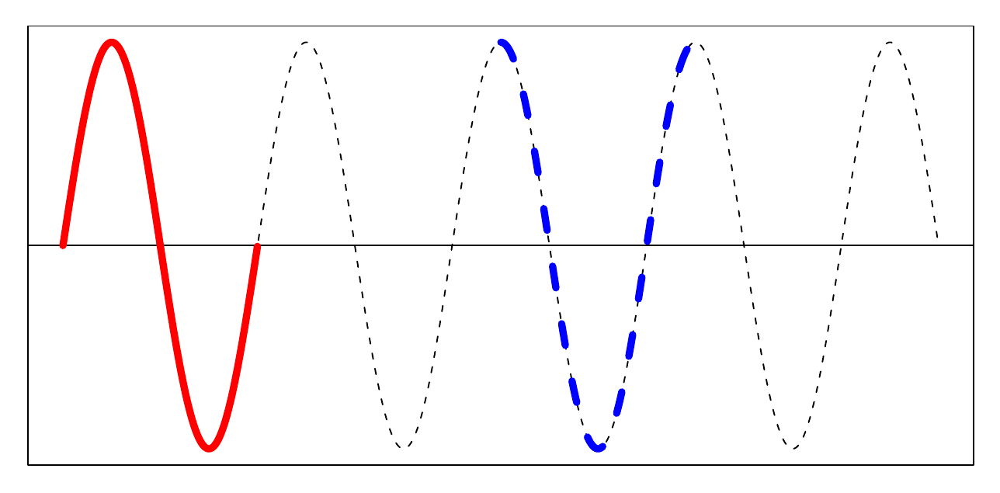
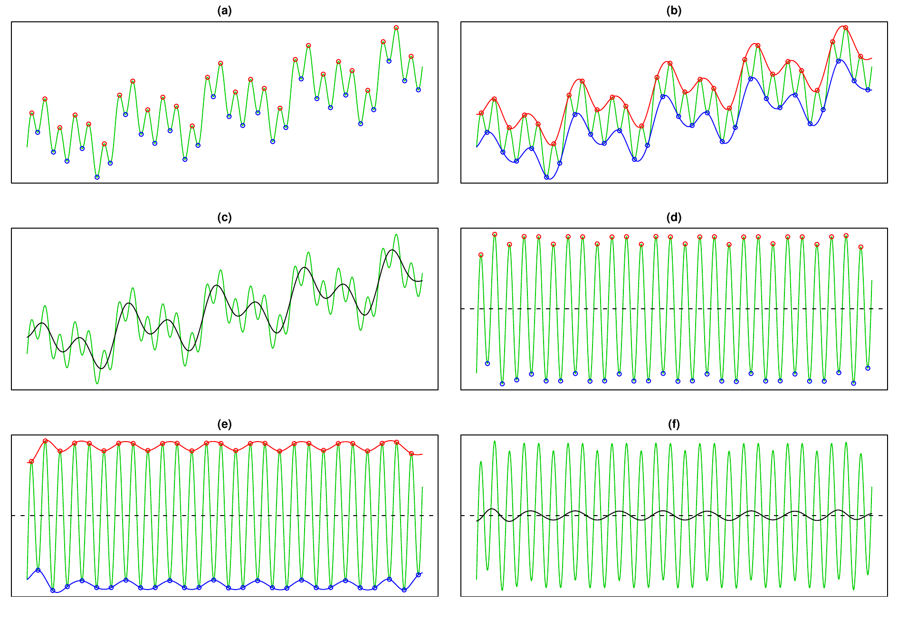
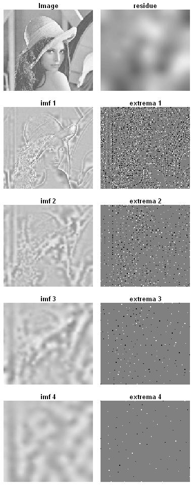

::: article
# Introduction {#introduction .unnumbered}

The concept of empirical mode decomposition (EMD) and the Hilbert
spectrum (HS) has been developed rapidly in many disciplines of science
and engineering since @huang1998b invented EMD. The key feature of EMD
is to decompose a signal into so-called intrinsic mode function (IMF).
Furthermore, the Hilbert spectral analysis of intrinsic mode functions
provides frequency information evolving with time and quantifies the
amount of variation due to oscillation at different time scales and time
locations. In this article, we introduce an R package called *EMD*
[@kim2008a] that performs one- and two- dimensional EMD and HS.

# Intrinsic mode function {#sec.extrema .unnumbered}

The essential step extracting an IMF is to identify an oscillation
embedded in a signal from local time scale. Consider the following
synthetic signal $x(t), 0< t < 9$ of the form

$$\label{eq:examplesignal}
x(t) = 0.5 t + \sin(\pi t) + \sin(2 \pi t) + \sin(6 \pi t).  (\#eq:examplesignal)  $$

The signal in Figure [1](#sinusoid3) consists of several components,
which are generated through the process that a component is superimposed
to each other.

{#sinusoid3 width="90.0%" alt="graphic without alt text"}

An intrinsic oscillation or frequency of a component, for example,
$\sin(\pi t), t \in (0, 9)$ in Figure [1](#sinusoid3) can be perceived
through the red solid wave or the blue dotted wave in
Figure [2](#sinusoid). The blue dotted wave in Figure [2](#sinusoid)
illustrates one cycle of intrinsic oscillation which starts at a local
maximum and terminates at a consecutive local maximum by passing through
two zeros and a local minimum which eventually appears between two
consecutive maxima. A component for a given time scale can be regarded
as the composition of repeated intrinsic oscillation which is symmetric
to its local mean, zero.

{#sinusoid width="100%" alt="graphic without alt text"}

Thus the first step to define intrinsic oscillation is to detect local
extrema or zero-crossings. The function `extrema()` identifies local
extrema and zero-crossings of the signal in Figure [2](#sinusoid).

``` r
> ### Identify extrema and zero-crossings
> ndata <- 3000
> tt <- seq(0, 9, length=ndata)
> xt <- sin(pi * tt)
>
> library(EMD)
> extrema(xt)
$minindex
     [,1] [,2]
[1,]  501  501
[2,] 1167 1167
[3,] 1834 1834
[4,] 2500 2500

$maxindex
     [,1] [,2]
[1,]  168  168
[2,]  834  834
[3,] 1500 1501
[4,] 2167 2167
[5,] 2833 2833

$nextreme
[1] 9

$cross
      [,1] [,2]
 [1,]    1    1
 [2,]  334  335
 [3,]  667  668
 [4,] 1000 1001
 [5,] 1333 1334
 [6,] 1667 1668
 [7,] 2000 2001
 [8,] 2333 2334
 [9,] 2666 2667

$ncross
[1] 9
```

The function `extrema()` returns a list of followings.

-   `minindex` : matrix of time index at which local minima are
    attained. Each row specifies a starting and ending time index of a
    local minimum.

-   `maxindex` : matrix of time index at which local maxima are
    attained. Each row specifies a starting and ending time index of a
    local maximum.

-   `nextreme` : the number of extrema.

-   `cross` : matrix of time index of zero-crossings. Each row specifies
    a starting and ending time index of zero-crossings.

-   `ncross` : the number of zero-crossings.

Once local extrema is obtained, the intrinsic mode function is derived
through the sifting procedure.

# Sifting process

@huang1998b suggested a data-adapted algorithm extracting a sinusoidal
wave or equivalently a frequency from a given signal $x$. First,
identify the local extrema in Figure [3](#sinusoid3sift)(a), and
generate the two functions called the upper envelope and lower envelope
by interpolating local maxima and local minima, respectively. See
Figure [3](#sinusoid3sift)(b). Second, take their average, which will
produce a lower frequency component than the original signal as in
Figure [3](#sinusoid3sift)(c). Third, by subtracting the envelope mean
from the signal $x$, the highly oscillated pattern $h$ is separated as
in Figure [3](#sinusoid3sift)(d).

@huang1998b defined an oscillating wave as an intrinsic mode function if
it satisfies two conditions 1) the number of extrema and the number of
zero-crossings differs only by one and 2) the local average is zero. If
the conditions of IMF are not satisfied after one iteration of
aforementioned procedure, the same procedure is applied to the residue
signal as in Figure [3](#sinusoid3sift)(d), (e) and (f) until properties
of IMF are satisfied.

{#sinusoid3sift
width="100%" alt="graphic without alt text"}

This iterative process is called sifting. The following code produces
Figure [3](#sinusoid3sift), and the function `extractimf()` implements
the sifting algorithm by identifying the local extrema with the
`extrema()`. Note that when setting the option `‘check=TRUE’`, one must
click the plot to proceed to the next step.

``` r
> ### Generating a signal
> ndata <- 3000
> par(mfrow=c(1,1), mar=c(1,1,1,1))
> tt2 <- seq(0, 9, length=ndata)
> xt2 <- sin(pi * tt2) + sin(2* pi * tt2) +
+ sin(6 * pi * tt2)  + 0.5 * tt2
> plot(tt2, xt2, xlab="", ylab="", type="l",
+ axes=FALSE); box()
>
> ### Extracting the first IMF by sifting process
> tryimf <- extractimf(xt2, tt2, check=TRUE)
```

The function `extractimf()` extracts IMF's from a given signal, and it
is controlled by the following arguments.

-   `residue` : observation or signal observed at time `tt`.

-   `tt` : observation index or time index.

-   `tol` : tolerance for stopping rule.

-   `max.sift` : the maximum number of sifting.

-   `stoprule` : stopping rule.

-   `boundary` : specifies boundary condition.

-   `check` : specifies whether the sifting process is displayed. If
    `check=TRUE`, click the plotting area to start the next step.

# Stopping rule

The sifting process stops when the replication of sifting procedure
exceed the predefined maximum number by `max.sift` or satisfies the
properties of IMF by stopping rule. The stopping rule `stoprule` has two
options -- `"type1"` and `"type2"`. The option `stoprule = "type1"`
makes the sifting process stop when the absolute values of the candidate
IMF $h_i$ are smaller than tolerance level, that is, $|h_i(t)| <$ `tol`
for all $t$. Or by the option `stoprule = "type2"`, the sifting process
stops when the variation of consecutive candidate IMF's is within the
tolerance level,
$$\sum_t \left( \frac{h_i(t) - h_{i-1}(t)}{h_{i-1}(t)} \right)^2 < \text{\texttt{tol}}.$$

# Boundary adjustment

To eliminate the boundary effect of a signal, it is necessary to adjust
a signal at the boundary. @huang1998b extended the original signal by
adding artificial waves repeatedly on both sides of the boundaries. The
waves called characteristic waves are constructed by repeating the
implicit mode formed from extreme values nearest to boundary. The
argument `boundary` specifies the adjusting method of the boundary. The
argument `boundary = "wave"` constructs a wave which is defined by two
consecutive extrema at either boundary, and adds four waves at either
end. Typical adjusting method extends a signal assuming that a signal is
symmetric or periodic. The option `boundary = "symmetric"` or
`boundary = "periodic"` extends both boundaries symmetrically or
periodically.

@zeng2004 considered two extended signals by adding a signal in a
symmetric way and reflexive way called even extension and odd extension,
respectively. Even extension and odd extension produce the extended
signals so that its average is zero. This boundary condition can be
specified by `boundary = "evenodd"`. For each extended signal, upper and
lower envelopes are constructed and envelope mean of the extended
signals is defined by the average of four envelopes. Then, the envelope
mean outside the time scale of the original signal is close to zero,
while the envelope mean within the time scale of the original signal is
almost the same as the envelope mean of the original signal. On the
other hand, the option `boundary = "none"` performs no boundary
adjustments.

# Empirical mode decomposition {#empirical-mode-decomposition .unnumbered}

Once the highest frequency is removed from a signal, the same procedure
is applied on the residue signal to identify next highest frequency. The
residue is considered a new signal to decompose.

Suppose that we have a signal from model (\@ref(eq:examplesignal)). The
signal in Figure [1](#sinusoid3) is composed of 4 components from
$\sin(6 \pi t)$ with the highest frequency to $0.5 t$ with the lowest
frequency. We may regard the linear component as a component having the
lowest frequency. The left panel in Figure [4](#sinusoid3sifts)
illustrates the first IMF and the residue signal obtained by the
function `extractimf()`. If the remaining signal is still compound of
components with several frequencies as in the left panel in
Figure [4](#sinusoid3sifts), then the next IMF is obtained by taking the
residue signal as a new signal in the right panel in
Figure [4](#sinusoid3sifts). The number of extrema will decrease as the
procedure continues, so that the signal is sequently decomposed into the
highest frequency component $imf_1$ to the lowest frequency component
$imf_n$, for some finite $n$ and a residue signal $r$. Finally, we have
$n$ IMF's and a residue signal as
$$x(t) = \sum_{i=1}^{n} imf_i(t) + r(t).$$

{#sinusoid3sifts width="100%" alt="graphic without alt text"}

The above-mentioned decomposition process is implemented by the function
`emd()` that utilizes the functions `extractimf()` and `extrema()`. The
final decomposition result by the following code is illustrated in
Figure [5](#sinusoid3imfs).

``` r
> ### Empirical Mode Decomposition
> par(mfrow=c(3,1), mar=c(2,1,2,1))
> try <- emd(xt2, tt2, boundary="wave")
>
> ### Ploting the IMF's
> par(mfrow=c(3,1), mar=c(2,1,2,1))
> par(mfrow=c(try$nimf+1, 1), mar=c(2,1,2,1))
> rangeimf <- range(try$imf)
> for(i in 1:try$nimf) {
+ plot(tt2, try$imf[,i], type="l", xlab="",
+ ylab="", ylim=rangeimf, main=
+ paste(i, "-th IMF", sep="")); abline(h=0)}
> plot(tt2, try$residue, xlab="", ylab="",
+ main="residue", type="l")
```

{#sinusoid3imfs width="100%" alt="graphic without alt text"}

The arguments of `emd()` are similar to those of `extractimf()`. The
additional arguments are

-   `max.imf` : the maximum number of IMF's.

-   `plot.imf` : specifies whether each IMF is displayed. If
    `plot.imf=TRUE`, click the plotting area to start the next step.

Up to now we have focused on artificial signals without any measurement
error. A typical signal in the real world is corrupted by noise, which
is not the component of interest and contains no interpretable
information. A remedy to smooth out the noise is to apply smoothing
technique not interpolation during the sifting process. Then the first
IMF might capture the entire noise effectively. As an alternative, Kim
and Oh [@kim2006] proposed an efficient smoothing method for IMF's by
combining the conventional cross-validation and thresholding approach.
By thresholding, noisy signal can be denoised while the distinct
localized feature of a signal can be kept.

# Intermittence

@huang1998b [@huang2003a] pointed out that intermittence raises mode
mixing, which means that different modes of oscillations coexist in a
single IMF. Since EMD traces the highest frequency embedded in a given
signal locally, when intermittence occurs, the shape of resulting IMF is
abruptly changed and this effect distorts procedures thereafter.

@huang2003a attacked this phenomenon by restricting the size of
frequency. To be specific, the distance limit of the successive maxima
(minima) in an IMF is introduced. Thus, IMF composes of only sinusoidal
waves whose length of successive maxima (minima) are shorter than their
limit. Equivalently, we may employ the length of the zero-crossings to
overcome the intermittence problem. Consider a signal $x(t)$ combined by
two sine curves [@deering2005],

$$\begin{eqnarray}
&  & x(t) \nonumber \\
& = &
\begin{cases}
\sin(2 \pi f_1 t) + \sin(2 \pi f_2 t), & \frac{1}{30} \leq t \leq \frac{2}{30}, \\
\sin(2 \pi f_1 t), & \text{otherwise.}
\end{cases} \label{eq:mask}  
\end{eqnarray}  (\#eq:mask)  $$

Figure [6](#intermbefore) illustrates the signal $x(t)$ when $f_1=1776$
and $f_2 = 1000$ and the corresponding two IMF's. The first IMF absorbs
the component that appeared in the second IMF between $\frac{1}{30}$ and
$\frac{2}{30}$. Thus, the resulting IMF has a mode mixing pattern.

``` r
> ### Mode mixing
> tt <- seq(0, 0.1, length = 2001)[1:2000]
> f1 <- 1776; f2 <- 1000
> xt <- sin(2*pi*f1*tt) * (tt <= 0.033 |
+ tt >= 0.067) + sin(2*pi*f2*tt)
>
> ### EMD
> interm1 <- emd(xt, tt, boundary="wave",
+ max.imf=2, plot.imf=FALSE)
> par(mfrow=c(3, 1), mar=c(3,2,2,1))
> plot(tt, xt, main="Signal", type="l")
> rangeimf <- range(interm1$imf)
> plot(tt, interm1$imf[,1], type="l", xlab="",
+ ylab="", ylim=rangeimf, main="IMF 1")
> plot(tt, interm1$imf[,2], type="l", xlab="",
+ ylab="", ylim=rangeimf, main="IMF 2")
```

{#intermbefore width="100%" alt="graphic without alt text"}

By following the approach of @huang1998b [@huang2003a], we can remove
waves whose empirical period represented by the distance of other
zero-crossings is larger than 0.0007 in the first IMF. The period
information obtained by histogram in Figure [7](#intermhist) can be used
to choose an appropriate distance. We eliminate the waves with lower
frequency in the first IMF with the histogram of other zero-crossings.

``` r
> ### Histogram of empirical period
> par(mfrow=c(1,1), mar=c(2,4,1,1))
> tmpinterm <- extrema(interm1$imf[,1])
> zerocross <-
+ as.numeric(round(apply(tmpinterm$cross, 1, mean)))
> hist(diff(tt[zerocross[seq(1, length(zerocross),
+ by=2)]]), freq=FALSE, xlab="", main="")
```

{#intermhist width="90.0%" alt="graphic without alt text"}

Figure [8](#intermafter) shows the resulting IMF's after treating
intermittence properly. The argument `interm` of the function `emd()`
specifies a vector of periods to be excluded from the IMF's.

``` r
> ### Treating intermittence
> interm2 <- emd(xt, tt, boundary="wave",
+ max.imf=2, plot.imf=FALSE, interm=0.0007)
>
> ### Plot of each imf
> par(mfrow=c(2,1), mar=c(2,2,3,1), oma=c(0,0,0,0))
> rangeimf <- range(interm2$imf)
> plot(tt,interm2$imf[,1], type="l",
+ main="IMF 1 after treating intermittence",
+ xlab="", ylab="", ylim=rangeimf)
> plot(tt,interm2$imf[,2], type="l",
+ main="IMF 2 after treating intermittence",
+ xlab="", ylab="", ylim=rangeimf)
```

{#intermafter width="100%" alt="graphic without alt text"}

# Hilbert spectrum {#hilbert-spectrum .unnumbered}

When a signal is subject to non-stationarity so that the frequency and
amplitude change over time, it is necessary to have a more flexible and
extended notion of frequency. @huang1998b used the concept of
instantaneous frequency through the Hilbert transform. For a
comprehensive explanation of the Hilbert transform, refer to @cohen1995.
For a real signal $x(t)$, the analytic signal $z(t)$ is defined as
$z(t) = x(t) + i \ y(t)$ where $y(t)$ is the Hilbert transform of
$x(t)$, that is,
$y(t) = \frac{1}{\pi} P \int_{-\infty}^{\infty} \frac{x(s)}{t-s} \ ds$
where $P$ is the Cauchy principal value. The polar coordinate form of
the analytic signal $z$ with amplitude and phase is
$z(t) = a(t) \exp(i \theta(t))$ where amplitude $a(t)$ is
$||z(t)|| = \sqrt{x(t)^2 + y(t)^2}$ and phase $\theta(t)$ is
$\arctan \left(\frac{y(t)}{x(t)} \right)$. The instantaneous frequency
as time-varying phase is defined as $\frac{d \theta(t)}{d t}.$ After
decomposing a signal into IMF's with EMD thereby preserving any local
property in the time domain, we can extract localized information in the
frequency domain with the Hilbert transform and identify hidden local
structures embedded in the original signal. The local information can be
described by the Hilbert spectrum which is amplitude and instantaneous
frequency representation with respect to time. Figure [9](#spectrogram)
describes the Hilbert spectrum for IMF 1 of the signal of
model (\@ref(eq:mask)) before and after treating the intermittence. The
X-Y axis represents time and instantaneous frequency, and the color
intensity of the image depicts instantaneous amplitude.

``` r
> ### Spectrogram : X - Time, Y - frequency,
> ### Z (Image) - Amplitude
> test1 <- hilbertspec(interm1$imf)
> spectrogram(test1$amplitude[,1],
+ test1$instantfreq[,1])
> test2 <- hilbertspec(interm2$imf, tt=tt)
> spectrogram(test2$amplitude[,1],
+ test2$instantfreq[,1])
```

{#spectrogram width="100%" alt="graphic without alt text"}

For multiple signals, the function `hilbertspec()` calculates the
amplitudes and instantaneous frequency using Hilbert transform. The
function has the following arguments,

-   `xt` : matrix of multiple signals. Each column represents a signal.

-   `tt` : observation index or time index.

The function `hilbertspec()` returns a matrix of amplitudes and
instantaneous frequencies for multiple signals. The function
`spectrogram()` produces an image of amplitude by time index and
instantaneous frequency. The horizontal axis represents time, the
vertical axis is instantaneous frequency, and the color of each point in
the image represents amplitude of a particular frequency at a particular
time. It has arguments as

-   `amplitude` : vector or matrix of amplitudes for multiple signals.

-   `freq` : vector or matrix of instantaneous frequencies for multiple
    signals.

-   `tt` : observation index or time index.

-   `multi` : specifies whether spectrograms of multiple signals are
    separated or not.

-   `nlevel` : the number of color levels used in legend strip

-   `size` : vector of image size.

# Extension to two dimensional image {#extension-to-two-dimensional-image .unnumbered}

The extension of EMD to an image or two dimensional data is
straightforward except the identification of the local extrema. Once the
local extrema are identified, the two dimensional smoothing spline
technique is used for the sifting procedure.

For the two-dimensional case, we provide four R functions.

-   `extrema2dC()` for identifying the two dimensional extrema,

-   `extractimf2d()` for extracting the IMF from a given image,

-   `emd2d()` for decomposing an image to IMF's and the residue image
    combining two R functions above, and

-   `imageEMD()` for displaying the decomposition results.

As in a one-dimensional case, `extractimf2d()` extracts two dimensional
IMF's from a given image based on local extrema identified by
`extrema2dC()`. Combining these functions, `emd2d()` performs
decomposition and its arguments are as follows.

-   `z` : matrix of an image observed at (`x`, `y`).

-   `x, y` : locations of regular grid at which the values in `z` are
    measured.

-   `tol` : tolerance for stopping rule of sifting.

-   `max.sift` : the maximum number of sifting.

-   `boundary` : specifies boundary condition 'symmetric', 'reflexive'
    or 'none'.

-   `boundperc` : expand an image by adding specified percentage of
    image at the boundary when boundary condition is 'symmetric' or
    'reflexive'.

-   `max.imf` : the maximum number of IMF.

-   `plot.imf` : specifies whether each IMF is displayed. If
    `plot.imf=TRUE`, click the plotting area to start the next step.

The following R code performs two dimensional EMD of the Lena image. The
size of the original image is reduced for computational simplicity.

``` r
> data(lena)
> z <- lena[seq(1, 512, by=4), seq(1, 512, by=4)]
> lenadecom <- emd2d(z, max.imf = 4)
```

The R function `imageEMD()` plots decomposition results and the argument
`extrma=TRUE` illustrates the local maxima (minima) with the white
(black) color and grey background. See Figure [10](#lenadecom).

``` r
> imageEMD(z=z, emdz=lenadecom, extrema=TRUE,
+ col=gray(0:100/100))
```

{#lenadecom
width="100%" alt="graphic without alt text"}

# Conclusions {#conclusions .unnumbered}

IMF's through EMD provide a multi-resolution tool and spectral analysis
gives local information with time-varying amplitude and phase according
to the scales. We introduce *EMD*, an R package for the proper
implementation of EMD, and the Hilbert spectral analysis for
non-stationary signals. It is expected that R package *EMD* makes EMD
methodology practical for many statistical applications.
:::
