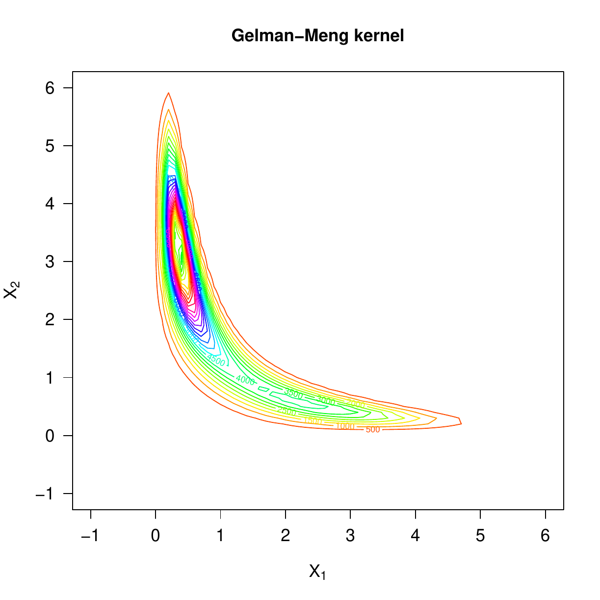
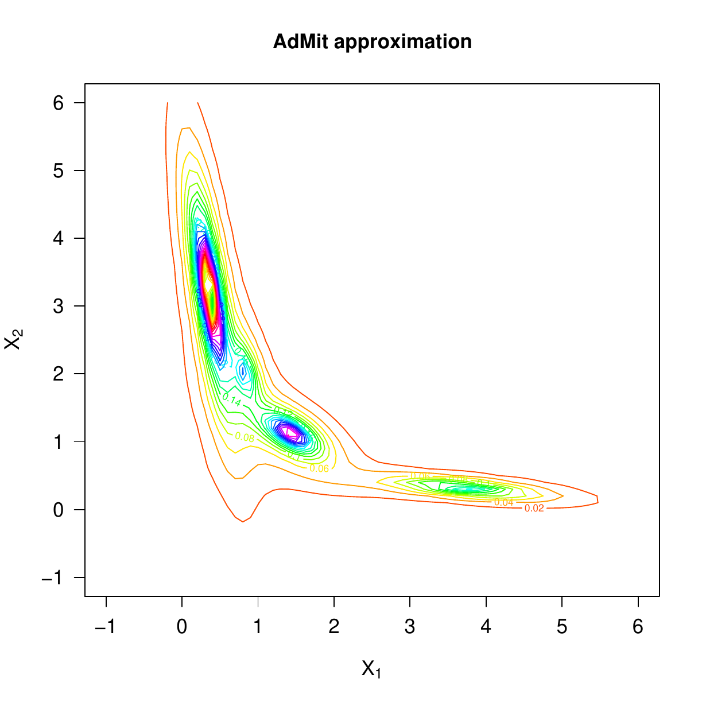
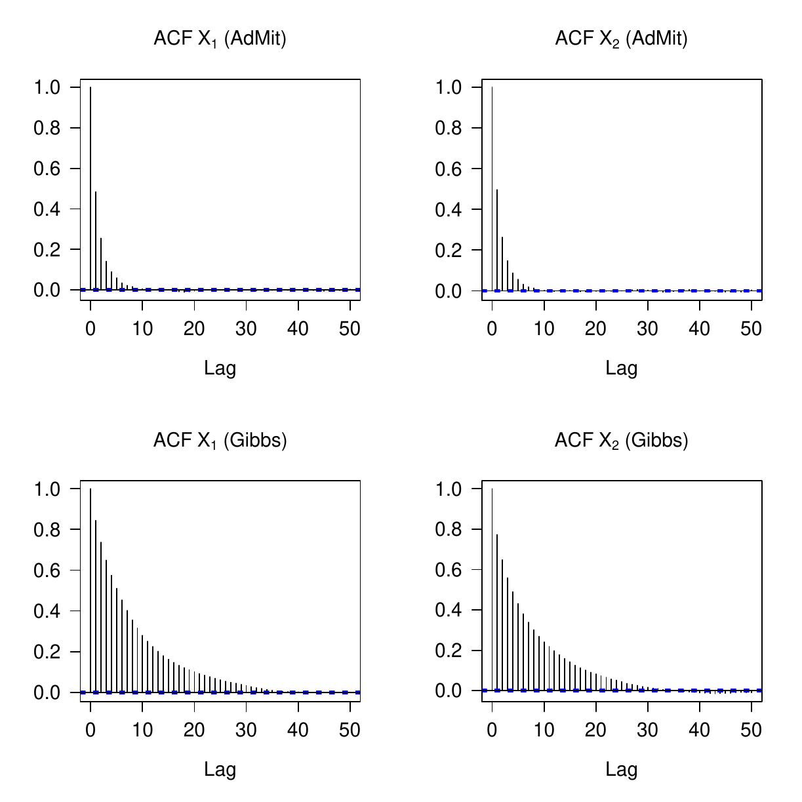

::: article
# Introduction

This note presents the package *AdMit*
[@AdMit; @Ardia:Hoogerheide:VanDijk:09], an R implementation of the
adaptive mixture of Student-t distributions (AdMit) procedure developed
by @Hoogerheide:06; see also @Hoogerheide:Kaashoek:VanDijk:07
[@Hoogerheide:VanDijk:08]. The AdMit strategy consists of the
construction of a mixture of Student-t distributions which approximates
a target distribution of interest. The fitting procedure relies only on
a kernel of the target density, so that the normalizing constant is not
required. In a second step, this approximation is used as an importance
function in importance sampling or as a candidate density in the
independence chain Metropolis-Hastings (M-H) algorithm to estimate
characteristics of the target density. The estimation procedure is fully
automatic and thus avoids the difficult task, especially for
non-experts, of tuning a sampling algorithm. Typically, the target is a
posterior distribution in a Bayesian analysis, where we indeed often
only know a kernel of the posterior density.

In a *standard* case of importance sampling or the independence chain
M-H algorithm, the candidate density is unimodal. If the target
distribution is multimodal then some draws may have huge weights in the
importance sampling approach and a second mode may be completely missed
in the M-H strategy. As a consequence, the convergence behavior of these
Monte Carlo integration methods is rather uncertain. Thus, an important
problem is the choice of the importance or candidate density, especially
when little is known a priori about the shape of the target density. For
both importance sampling and the independence chain M-H, it holds that
the candidate density should be *close* to the target density, and it is
especially important that the tails of the candidate should not be
thinner than those of the target.

@Hoogerheide:06 and @Hoogerheide:Kaashoek:VanDijk:07 mention several
reasons why mixtures of Student-t distributions are natural candidate
densities. First, they can provide an accurate approximation to a wide
variety of target densities, with substantial skewness and high
kurtosis. Furthermore, they can deal with multi-modality and with
non-elliptical shapes due to asymptotes. Second, this approximation can
be constructed in a quick, iterative procedure and a mixture of
Student-t distributions is easy to sample from. Third, the Student-t
distribution has fatter tails than the Normal distribution; especially
if one specifies Student-t distributions with few degrees of freedom,
the risk is small that the tails of the candidate are thinner than those
of the target distribution. Finally, @Zeevi:Meir:97 showed that under
certain conditions any density function may be approximated to arbitrary
accuracy by a convex combination of *basis* densities; the mixture of
Student-t distributions falls within their framework.

The package *AdMit* consists of three main functions: `AdMit`, `AdMitIS`
and `AdMitMH`. The first one allows the user to fit a mixture of
Student-t distributions to a given density through its kernel function.
The next two functions perform importance sampling and independence
chain M-H sampling using the fitted mixture estimated by `AdMit` as the
importance or candidate density, respectively.

To illustrate the use of the package, we apply the AdMit methodology to
a bivariate bimodal distribution. We describe the use of the functions
provided by the package and document the ability and relevance of the
methodology to reproduce the shape of non-elliptical distributions.

# Illustration

This section presents the functions provided by the package *AdMit* with
an illustration of a bivariate bimodal distribution. This distribution
belongs to the class of conditionally Normal distributions proposed by
@Gelman:Meng:91 with the property that the joint density is not Normal.
It is not a posterior distribution, but it is chosen because it is a
simple distribution with non-elliptical shapes so that it allows for an
easy illustration of the AdMit approach.

Let $X_1$ and $X_2$ be two random variables, for which $X_1$ is Normally
distributed given $X_2$ and vice versa. Then, the joint distribution,
after location and scale transformations in each variable, can be
written as [see @Gelman:Meng:91]:
$$\begin{aligned}
\begin{split}
p(\mathbf x) \propto k(\mathbf x) 
&\doteq \exp 
\Big[ -\tfrac{1}{2} \big(A x_1^2 x_2^2 + x_1^2 + x_2^2\\
&\quad\quad - 2 B x_1 x_2 - 2 C_1 x_1 - 2 C_2 x_2\big) \Big]\,
\end{split} 
\end{aligned}    $$ where $p(\mathbf x)$ denotes a density,
$k(\mathbf x)$ a kernel and $\mathbf x\doteq (x_1,x_2)'$ for notational
purposes. $A$, $B$, $C_1$ and $C_2$ are constants; we consider an
asymmetric case in which $A=5$, $B=5$, $C_1=3$, $C_2=3.5$ in what
follows.

The adaptive mixture approach determines the number of mixture
components $H$, the mixing probabilities, the modes and scale matrices
of the components in such a way that the mixture density $q(\mathbf x)$
approximates the target density $p(\mathbf x)$ of which we only know a
kernel function $k(\mathbf x)$ with $\mathbf x\in \mathbb R^d$.
Typically, $k(\mathbf x)$ will be a posterior density kernel for a
vector of model parameters $\mathbf x$.

The AdMit strategy consists of the following steps:

-   Initialization: computation of the mode and scale matrix of the
    first component, and drawing a sample from this Student-t
    distribution;

-   Iterate on the number of components: add a new component that covers
    a part of the space of $\mathbf x$ where the previous mixture
    density was relatively small, as compared to $k(\mathbf x)$;

-   Optimization of the mixing probabilities;

-   Drawing a sample $\{\mathbf x^{[i]}\}$ from the new mixture
    $q(\mathbf x)$;

-   Evaluation of importance sampling weights
    $\{ k(\mathbf x^{[i]})/q(\mathbf x^{[i]}) \}$. If the coefficient of
    variation, i.e. the standard deviation divided by the mean, of the
    weights has converged, then stop. Otherwise, go to step (1). By
    default, the adaptive procedure stops if the relative change in the
    coefficient of variation of the importance sampling weights caused
    by adding one new Student-t component to the candidate mixture is
    less than 10%.

There are two main reasons for using the coefficient of variation of the
importance sampling weights as a measure of the fitting quality. First,
it is a natural, intuitive measure of quality of the candidate as an
approximation to the target. If the candidate and the target
distributions coincide, all importance sampling weights are equal, so
that the coefficient of variation is zero. For a poor candidate that not
even roughly approximates the target, some importance sampling weights
are huge while most are (almost) zero, so that the coefficient of
variation is high. The better the candidate approximates the target, the
more evenly the weight is divided among the candidate draws, and the
smaller the coefficient of variation of the importance sampling weights.
Second, @Geweke:89 argues that a reasonable objective in the choice of
an importance density is the minimization of the variance, or
equivalently the coefficient of variation, of the importance weights. We
prefer to quote the coefficient of variation because it does not depend
on the number of draws or the integration constant of the posterior
density kernel, unlike the standard deviation of the scaled or unscaled
importance weights, respectively. The coefficient of variation merely
reflects the quality of the candidate as an approximation to the target.

Note also that all Student-t components in the mixture approximation
$q(\mathbf x)$ have the same degrees of freedom parameter. Moreover,
this value is not determined by the procedure but set by the user; by
default, the algorithm uses the value one (i.e. the approximation
density is a mixture of Cauchy) since i) it enables the method to deal
with fat-tailed target distributions and ii) it makes it easier for the
iterative procedure to detect modes that are far apart. There may be a
trade-off between efficiency and robustness at this point: setting the
degrees of freedom to one reflects that we find a higher robustness more
valuable than a slight possible gain in efficiency.

The core function provided by the package is the function `AdMit`. The
main arguments of the function are: `KERNEL`, a kernel function of the
target density on which the approximation is constructed. This function
must contain the logical argument `log`. When `log = TRUE`, the function
`KERNEL` returns the logarithm value of the kernel function; this is
used for numerical stability. `mu0` is the starting value of the first
stage optimization; it is a vector whose length corresponds to the
length of the first argument in `KERNEL`. `Sigma0` is the (symmetric
positive definite) scale matrix of the first component. If a matrix is
provided by the user, it is used as the scale matrix of the first
component and then `mu0` is used as the mode of the first component
(instead of a starting value for optimization). `control` is a list of
tuning parameters, containing in particular: `df` (default: 1), the
degrees of freedom of the mixture components and `CVtol` (default: 0.1),
the tolerance of the relative change of the coefficient of variation.
For further details, the reader is referred to the documentation manual
(by typing `?AdMit`) or to @Ardia:Hoogerheide:VanDijk:09. Finally, the
last argument of `AdMit` is `…` which allows the user to pass additional
arguments to the function `KERNEL`.

Let us come back to our bivariate conditionally Normal distribution.
First, we need to code the kernel:

``` r
> GelmanMeng <- function(x, log = TRUE)
+ \{
+   if (is.vector(x))
+     x <- matrix(x, nrow = 1)
+   r <- -0.5 * ( 5 * x[,1]^2 * x[,2]^2
+                + x[,1]^2 + x[,2]^2
+                - 10 * x[,1] * x[,2]
+                - 6 * x[,1] - 7 * x[,2] )
+   if (!log)
+     r <- exp(r)
+   as.vector(r)
+ \}
```

Note that the argument `log` is set to `TRUE` by default so that the
function outputs the logarithm of the kernel. Moreover, the function is
vectorized to speed up the computations. The contour plot of
`GelmanMeng` is displayed in the left part of Figure [1](#f:KERNEL).

<figure id="f:KERNEL">
<p></p>
<figcaption>Figure 1: Left: contour plot of the kernel GelmanMeng.
Right: contour plot of the four-component Student-t mixture
approximation estimated by the function AdMit.</figcaption>
</figure>

We now use the function `AdMit` to find a suitable approximation for the
density whose kernel is `GelmanMeng`. We use the starting value
`mu0 = c(0, 0.1)` for the first stage optimization and assign the result
of the function to `outAdMit`.

``` r
> set.seed(1234)
> outAdMit <- AdMit(KERNEL = GelmanMeng, 
+                   mu0 = c(0, 0.1))

\$CV
[1] 8.0737 1.7480 0.9557 0.8807

\$mit
\$mit\$p
   cmp1    cmp2    cmp3    cmp4 
0.54707 0.14268 0.21053 0.09972 

\$mit\$mu
         k1     k2
cmp1 0.3640 3.2002
cmp2 3.7088 0.3175
cmp3 1.4304 1.1240
cmp4 0.8253 2.0261

\$mit\$Sigma
        k1k1     k1k2     k2k1    k2k2
cmp1 0.03903 -0.15606 -0.15606 1.22561
cmp2 0.86080 -0.08398 -0.08398 0.02252
cmp3 0.13525 -0.06743 -0.06743 0.09520
cmp4 0.03532 -0.04072 -0.04072 0.21735

\$mit\$df
[1] 1

\$summary
  H METHOD.mu TIME.mu METHOD.p TIME.p     CV
1 1      BFGS    0.21     NONE   0.00 8.0737
2 2      BFGS    0.08   NLMINB   0.08 1.7480
3 3      BFGS    0.12   NLMINB   0.08 0.9557
4 4      BFGS    0.20   NLMINB   0.19 0.8807
```

The output of the function `AdMit` is a list. The first component is
`CV`, a vector of length $H$ which gives the value of the coefficient of
variation of the importance sampling weights at each step of the
adaptive fitting procedure. The second component is `mit`, a list which
consists of four components giving information on the fitted mixture of
Student-t distributions: `p` is a vector of length $H$ of mixing
probabilities, `mu` is a $H\times d$ matrix whose rows give the modes of
the mixture components, `Sigma` is a $H \times d^2$ matrix whose rows
give the scale matrices (in vector form) of the mixture components and
`df` is the degrees of freedom of the Student-t components. The third
component of the list returned by `AdMit` is `summary`. This is a data
frame containing information on the adaptive fitting procedure. We refer
the reader to the documentation manual for further details.

For the kernel `GelmanMeng`, the approximation constructs a mixture of
four components. The value of the coefficient of variation decreases
from 8.0737 to 0.8807. A contour plot of the four-component
approximation is displayed in the right-hand side of
Figure [1](#f:KERNEL). This graph is produced using the function `dMit`
which returns the density of the mixture given by the output
`outAdMit$mit`. The contour plot illustrates that the four-component
mixture provides a good approximation of the density: the areas with
substantial target density mass are *covered* by sufficient density mass
of the mixture approximation.

Once the adaptive mixture of Student-t distributions is fitted to the
density using a kernel, the approximation provided by `AdMit` is used as
the importance sampling density in importance sampling or as the
candidate density in the independence chain M-H algorithm.

The *AdMit* package contains the `AdMitIS` function which performs
importance sampling using the mixture approximation in `outAdMit$mit` as
the importance density. The arguments of the function `AdMitIS` are: (i)
`N`, the number of draws used in importance sampling; (ii) `KERNEL`, a
kernel function of the target density; (iii) `G`, the function of which
the expectation $E_p\big[g(\mathbf x)\big]$ is estimated; By default,
the function `G` is the identity so that the function outputs a vector
containing the mean estimates for the components of $\mathbf x$.
Alternative functions may be provided by the user to obtain other
quantities of interest for $p(\mathbf x)$. The only requirement is that
the function outputs a matrix; (iv) `mit`, a list providing information
on the mixture approximation; (v) `…` allows additional parameters to be
passed to the function `KERNEL` and/or `G`.

Let us apply the function `AdMitIS` to the kernel `GelmanMeng` using the
approximation `outAdMit$mit`:

``` r
> outAdMitIS <- AdMitIS(N = 1e5, 
+                       KERNEL = GelmanMeng, 
+                       mit = outAdMit\$mit)

\$ghat
[1] 0.9556 2.2465

\$NSE
[1] 0.003833 0.005639

\$RNE
[1] 0.6038 0.5536
```

The output of the function `AdMitIS` is a list. The first component is
`ghat`, the importance sampling estimator of
$E_p\big[g(\mathbf x)\big]$. The second component is `NSE`, a vector
containing the numerical standard errors (the variation of the estimates
that can be expected if the simulations were to be repeated) of the
components of `ghat`. The third component is `RNE`, a vector containing
the relative numerical efficiencies of the components of `ghat` (the
ratio between an estimate of the variance of an estimator based on
direct sampling and the importance sampling estimator's estimated
variance with the same number of draws). `RNE` is an indicator of the
efficiency of the chosen importance function; if target and importance
densities coincide, `RNE` equals one, whereas a very poor importance
density will have a `RNE` close to zero. Both `NSE` and `RNE` are
estimated by the method given in @Geweke:89.

Further, the *AdMit* package contains the `AdMitMH` function which uses
the mixture approximation in `outAdMit$mit` as the candidate density in
the independence chain M-H algorithm. The arguments of the function
`AdMitMH` are: (i) `N`, the length of the MCMC sequence of draws; (ii)
`KERNEL`, a kernel function of the target density; (iii) `mit`, a list
providing information on the mixture approximation; (iv) `…` allows
additional parameters to be passed to the function `KERNEL`.

Let us apply the function `AdMitMH` to the kernel `GelmanMeng` using the
approximation `outAdMit$mit`:

``` r
> outAdMitMH <- AdMitMH(N = 101000, 
+                       KERNEL = GelmanMeng, 
+                       mit = outAdMit\$mit)

\$draws
               k1         k2
1       7.429e-01  3.021e-01
2       7.429e-01  3.021e-01
3       7.429e-01  3.021e-01
4       1.352e+00  1.316e+00
5       1.011e+00  1.709e+00
6       1.011e+00  1.709e+00
7       1.005e+00  1.386e+00
...

\$accept
[1] 0.5119
```

The output of the function `AdMitMH` is a list of two components. The
first component is `draws`, a $N \times d$ matrix containing draws from
the target density $p(\mathbf x)$ in its rows. The second component is
`accept`, the acceptance rate of the independence chain M-H algorithm.

The package *coda* [@coda] can be used to check the convergence of the
MCMC chain and obtain quantities of interest for $p(\mathbf x)$. Here,
for simplicity, we discard the first 1'000 draws as a burn-in sample and
transform the output `outAdMitMH$draws` in a `mcmc` object using the
function `as.mcmc` provided by *coda*. A summary of the MCMC chain can
be obtained using `summary`:

``` r
> library("coda")
> draws <- as.mcmc(outAdMitMH\$draws)
> draws <- window(draws, start = 1001)
> colnames(draws) <- c("X1", "X2")
> summary(draws)\$stat

     Mean     SD Naive SE Time-series SE
X1 0.9643 0.9476 0.002996       0.004327
X2 2.2388 1.3284 0.004201       0.006232
```

We note that the mean estimates are close to the values obtained with
the function `AdMitIS`. The relative numerical efficiency (RNE) can be
computed using the functions `effectiveSize` and `niter`:

``` r
> effectiveSize(draws) / niter(draws)

    X1     X2 
0.3082 0.3055 
```

These relative numerical efficiencies reflect the good quality of the
candidate density in the independence chain M-H algorithm.

The approach is compared to the standard Gibbs sampler, which is
extremely easy to implement here since the full conditional densities
are Normals. We generated $N=101000$ draws from a Gibbs sampler using
the first 1'000 draws as a burn-in period. In this case, the RNE were
0.06411 and 0.07132, respectively. In Figure [2](#f:ACF) we display the
autocorrelogram for the MCMC output of the `AdMitMH` function (upper
graphs) together with the autocorrelogram of the Gibbs (lower part). We
clearly notice that the Gibbs sequence is mixing much more slowly,
explaining the lower RNE values. This example illustrates the phenomenon
that the autocorrelation in the Gibbs sequence may be high when
assessing a non-elliptical distribution, and that the AdMit approach may
overcome this.

<figure id="f:ACF">

<figcaption>Figure 2: Upper graphs: Autocorrelation function (ACF) for
the AdMitMH output. Lower graphs: ACF for the Gibbs output.</figcaption>
</figure>

# Summary

This note presented the package *AdMit* which provides functions to
approximate and sample from a certain target distribution given only a
kernel of the target density function. The estimation procedure is fully
automatic and thus avoids the time-consuming and difficult task of
tuning a sampling algorithm. The use of the package has been illustrated
in a bivariate bimodal distribution.

Interested users are referred to @Ardia:Hoogerheide:VanDijk:09 for a
more complete discussion on the *AdMit* package. The article provides a
more extensive introduction of the package usage as well as an
illustration of the relevance of the AdMit procedure with the Bayesian
estimation of a mixture of ARCH model fitted to foreign exchange
log-returns data. The methodology is compared to standard cases of
importance sampling and the Metropolis-Hastings algorithm using a naive
candidate and with the Griddy-Gibbs approach. It is shown that for
investigating means and particularly tails of the joint posterior
distribution the AdMit approach is preferable.

# Acknowledgments

The authors acknowledge an anonymous reviewer for helpful comments that
have led to improvements of this note. The first author is grateful to
the Swiss National Science Foundation (under grant #FN PB FR1-121441)
for financial support. The third author gratefully acknowledges the
financial assistance from the Netherlands Organization of Research
(under grant #400-07-703).
:::
