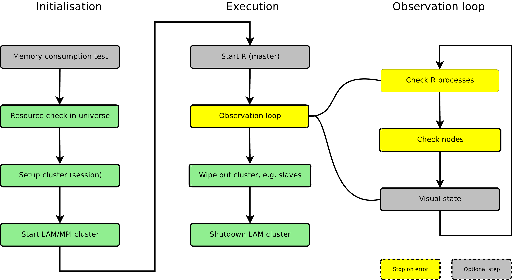

::: article
Many statistical analysis tasks in areas such as bioinformatics are
computationally very intensive, while lots of them rely on
embarrassingly parallel computations [@GRAMA_ETAL]. Multiple computers
or even multiple processor cores on standard desktop computers, which
are widespread nowadays, can easily contribute to faster analyses.

R itself does not allow parallel execution. There are some existing
solutions for R to distribute calculations over many computers --- a
cluster --- for example *Rmpi*, *rpvm*, *snow*, *nws* or *papply*.
However these solutions require the user to setup and manage the cluster
on his own and therefore deeper knowledge about cluster computing itself
is needed. \>From our experience this is a barrier for lots of R users,
who basically use it as a tool for statistical computing.

Parallel computing has several pitfalls. A single program can easily
affect a complete computing infrastructure on maloperation such as
allocating too many CPUs or RAM leaving no resources for other users and
their processes, or degrading the performance of one or more individual
machines. Another problem is the difficulty of keeping track of what is
going on in the cluster, which is sometimes hard if the program fails
for some reason on a slave.

We developed the management tool sfCluster and the corresponding R
package *snowfall*, which are designed to make parallel programming
easier and more flexible. sfCluster completely hides the setup and
handling of clusters from the user and monitors the execution of all
parallel programs for problems affecting machines and the cluster.
Together with *snowfall* it allows the use of parallel computing in R
without further knowledge of cluster implementation and configuration.

# snowfall

The R package *snowfall* is built as an extended abstraction layer above
the well established *snow* package by L. Tierney, A. J. Rossini, N. Li
and H. Sevcikova [@ROSS_07]. Note this is not a technical layer, but an
enhancement in useablity. *snowfall* can use all networking types
implemented in *snow*, which are socket, MPI, PVM and NetWorkSpaces.

snowfall is also usable on its own (without sfCluster), which makes it
handy on single multicore machines, for development or for distribution
inside packages.

The design goal was to make parallel computing accessible to R
programmers without further general computing knowledge. The Application
Programming Interface (API) of *snowfall* is similar to *snow* and
indeed *snow* functions can be called directly. So porting of existing
*snow* programs is very simple.

The main *snowfall* features are as follows:

-   All cluster functions and *snow* wrappers include extended error
    handling with stopping on error, which makes it easier to find
    improper behaviour for users without deeper knowledge of clusters.

-   In addition to *snow* functions, functions for common tasks are
    provided (like loading packages and sources in the cluster,
    exchanging variables \[between functions?\] and saving intermediate
    results).

-   Cluster settings can be controlled with command line arguments. The
    user does not have to change his R script to switch between
    sequential or parallel execution, or to change the number of cores
    or type of clusters used.

-   Connector to sfCluster: Used with sfCluster, configuration does not
    have to be done on initialisation as all values are taken from the
    user-given sfCluster settings.

-   All functions work in sequential execution, too, i.e. without a
    cluster. This is useful for development and distribution of packages
    using *snowfall*. Switching between sequential and parallel
    execution does not require code changes inside the parallel program
    (and can be changed on initialisation).

Like *snow*, *snowfall* basically uses list functions for
parallelisation. Calculations are distributed on slaves for different
list elements. This is directly applicable to any data parallel problem,
for example bootstrapping or cross-validation can be represented with
this approach (other types of parallelisation can also be used, but
probably with more effort).

Generally, a cluster constitutes single machines, called nodes, which
are chosen out of a set of all machines usable as nodes, called the
universe. The calculation is started on a master node, which spawns
worker R processes (sometimes also called slaves). A CPU is a single
calculation unit of which modern computers may have more than one.

<figure id="figure:bootstrap">

<pre class="sourceCode r"><code class="sourceCode r">library(snowfall)
# 1. Initialisation of snowfall.
# (if used with sfCluster, just call sfInit())
sfInit(parallel=TRUE, cpus=4, type=&quot;SOCK&quot;)

# 2. Loading data.
require(mvna)
data(sir.adm)

# 3. Wrapper, which can be parallelised.
wrapper &lt;- function(idx) {
  # Output progress in worker logfile
  cat( &quot;Current index: &quot;, idx, &quot;\n&quot; )
  index &lt;- sample(1:nrow(sir.adm), replace=TRUE)
  temp &lt;- sir.adm[index, ]
  fit &lt;- crr(temp$time, temp$status, temp$pneu)
  return(fit$coef)
}

# 4. Exporting needed data and loading required
#    packages on workers.
sfExport(&quot;sir.adm&quot;)
sfLibrary(cmprsk)

# 5. Start network random number generator
#    (as &quot;sample&quot; is using random numbers).
sfClusterSetupRNG()

# 6. Distribute calculation
result &lt;- sfLapply(1:1000, wrapper)

# Result is always in list form.
mean(unlist(result))

# 7. Stop snowfall
sfStop()</code></pre>

<figcaption>Figure 1:  Example bootstrap using
snowfall.</figcaption>
</figure>

For most basic programs, the parallelisation follows the workflow of the
example in Figure [1](#figure:bootstrap).

1.  Initialisation. Call `sfInit` with parameters if not using sfCluster
    or without parameters if used with sfCluster. Parameters are used to
    switch between parallel or sequential execution (argument
    `parallel`, default `FALSE`) and the number of CPUs wanted (argument
    `cpus` with numerical value, in sequential mode always `1`, in
    parallel mode the default is `2`). Used with sfCluster, these
    parameters are taken from the sfCluster settings.

2.  Load the data and prepare the data needed in the parallel
    calculations (for example generating data for a simulation study).

3.  Wrap parallel code into a wrapper function (function `wrapper` in
    the example), callable by an R list function.

4.  Export objects needed in the parallel calculation (e.g., `sir.adm`)
    to cluster nodes. It is also necessary to load required packages on
    all workers. Exporting objects can reduce the total amount of data
    transmitted. If there are only a few objects needed in the parallel
    function, you can export them implicitly using additional arguments
    in the wrapper function and specifying them in the parallel call
    (e.g. `sfLapply`).

5.  Optional step: start a network random number generator. Such random
    number generators ensure that nodes produce independent sequences of
    random numbers. The sequences, and hence results relying on random
    numbers, are reproducible provided that the same number of workers
    process the same sequence of tasks.

6.  Distribute the calculation to the cluster by using a parallel list
    function (`sfLapply` in the example). This function distributes
    calls of `wrapper` to workers (which usually means index $1$ to
    index $n$ is called on CPU $1$ to CPU $n$ respectively. These calls
    are then executed in parallel. If the list is longer than the amount
    of CPUs, index $n+1$ is scheduled on CPU 1 again [^1]). That also
    means all used data inside the wrapper function must be exported
    first, to have them existing on any node (see point 2).

7.  Stop cluster via `sfStop()` (If used with sfCluster this is not
    stopping the cluster itself, but allows reinitialisation with
    `sfInit`).

Probably the most irritating thing in the example is the export of the
data frame. On the provided type of cluster computing, the source
program runs only on the master first of all. Local variables and
objects remain on the master, so workers do not automatically have
access to them. All data, functions and packages needed for the parallel
calculation have to be transfered to the workers' processes first.
Export means objects are instantiated on the slaves. Unlike *snow*'s
export function, local variables can be exported, too. As a further
addition, all variables can be exported or removed from the worker
processes.[^2]

<figure id="figure:commandline">

<pre class="sourceCode r"><code class="sourceCode r"># Start a socket cluster on local machine using 3 processors
R CMD BATCH myParPrg.R --args --parallel --cpus=3

# Start a socket cluster with 5 cores (3 on localhost, 2 on machine &quot;other&quot;)
R --args --parallel --hosts=localhost:3,other:2 &lt; myParPrg.R

# Start using MPI with 5 cores on R interactive shell.
R --args --parallel --type=MPI --cpus=5</code></pre>

<figcaption>Figure 2:  Examples for snowfall configuration
using the command line.</figcaption>
</figure>

Basic networking parameters (like execution mode and the number of CPUs
on each machine) can be set on the command line, as seen in Figure
[2](#figure:commandline). Arguments provided in `sfInit()` will
over-ride the command line arguments. For example, a script that always
uses MPI clusters might include `sfInit(type="MPI")`. This mechanism can
be used in R scripts using *snowfall*, as a connector to sfCluster, or
as a binding to other workload and management tools.

In all current parallel computing solutions intermediate results are
lost if the cluster dies, perhaps due to a shutdown or crash of one of
the used machines. *snowfall* offers a function which saves all
available parts of results to disc and reloads them on a restored run.
Indeed it does not save each finished part, but any number of CPUs parts
(for example: Working on a list with 100 segments on a 5 CPU cluster, 20
result steps are saved). This function cannot prevent a loss of results,
but can greatly save time on long running clusters. As a side effect
this can also be used to realise a kind of "dynamic" resource
allocation: just stop and restart with restoring results on a
differently sized cluster.

Note that the state of the RNG is not saved in the current version of
*snowfall*. Users wishing to use random numbers need to implement
customized save and restore functions, or use pre-calculated random
numbers.

# sfCluster

sfCluster is a Unix commandline tool which is built to handle cluster
setup, monitoring and shutdown automatically and therefore hides these
tasks from the user. This is done as safely as possible enabling cluster
computing even for inexperienced users. Using *snowfall* as the R
frontend, users can change resource settings without changing their R
program. sfCluster is written in Perl, using only Open Source tools.

{#figure:workflow
width="100%" alt="graphic without alt text"}

On the backend, sfCluster is currently built upon MPI, using the LAM
implementation [@burns94:_lam], which is available on most common Unix
distributions.

Basically, a cluster is defined by two resources: CPU and memory. The
monitoring of memory usage is very important, as a machine is
practically unusable for high performance purposes if it is running out
of physical memory and starts to swap memory on the hard disk. sfCluster
is able to probe memory usage of a program automatically (by running it
in sequential mode for a certain time) or to set the upper bound to a
user-given value.

The resource allocation can be widely configured: Even partial usage of
a specific machine is possible (for example on a machine with 4 CPUs,
which is used for other purposes as well, it is possible to allow only
e.g. 2 cores for usage in clusters and sfCluster ensures that no more
than 2 CPUs are used by parallel computing on this machine). The
restriction of usage can leave calculation resources for other tasks,
e.g. if a computer is used for other calculations or perhaps a computing
pool for students is used for cluster programs, leaving enough CPU power
for the users of those machines.

sfCluster checks the cluster universe to find machines with free
resources to start the program (with the desired amount of resources ---
or less, if the requested resources are not available). These machines,
or better, parts of these machines, are built into a new cluster, which
belongs to the new program. This is done via LAM sessions, so each
program has its own independent LAM cluster.

Optionally sfCluster can keep track of resource usage during runtime and
can stop cluster programs if they exceed their given memory usage,
machines start to swap, or similar events. On any run, all spawned R
worker processes are detected and on shut down it is ensured that all of
them are killed, even if LAM itself is not closed/shut down correctly.

The complete workflow of sfCluster is shown in Figure
[3](#figure:workflow).

An additional mechanism for resource administration is offered through
user groups, which divide the cluster universe into "subuniverses". This
can be used to preserve specific machines for specific users. For
example, users can be divided in two groups, one able to use the whole
universe, the other only specific machines or a subset of the universe.
This feature was introduced, because we interconnect the machine pools
from two institutes to one universe, where some scientists can use all
machines, and some only the machines from their institute.

{#figure:monitoring width="100%" alt="graphic without alt text"}

sfCluster features three main parallel execution modes. All of these
setup and start a cluster for the program as described, run R and once
the program has finished, shutdown the cluster. The batch- and
monitoring mode shuts down the cluster on interruption from the user
(using keys on most Unix systems).

1.  Parallel batchmode: Parallel counterpart to `R CMD BATCH`. Called
    using `sfCluster -b` or by the optionally installed `R CMD par`.

2.  Interactive R shell (`sfCluster -i` or `R CMD parint`).

3.  Monitoring mode (`sfCluster -m` or `R CMD parmon`): Behaves
    similarly to batchmode, but features a process monitor for workers,
    access to worker logfiles, system output and debugging and runtime
    messages. The visualisation in the terminal is done using Ncurses.
    For an example output see Figure [4](#figure:monitoring): A cluster
    with 9 worker processes (marked `SL`) and one master process (marked
    `MA`) are running on five machines. Each machine has a tab with
    logfiles marked by the name of the node, e.g. `knecht4`. For each
    process, it's process identification number (PID), the node it is
    running on, its memory usage and state (like running, sleeping, dead
    etc.) is shown at the top. The `System` tab contains system messages
    from sfCluster; the R output on the master is shown in tab
    `R-Master`.

Besides the parallel execution modes, the sequential mode can be chosen,
which works in all cases, even without an installed or running cluster
environment, i.e. also on Windows systems or as part of a package build
on *snowfall*. On execution in sequential mode, *snowfall* is forced to
run in non-parallel mode.

Besides choosing the amount of required CPUs, users can specify several
options on starting sfCluster. These contain for example the R version,
the nice level of the slaves, activating the sending of emails after
finish or failure and many more.

<figure id="figure:showall">

<pre class="sourceCode r"><code class="sourceCode r">jo@biom9:~$ sfCluster -o
SESSION          | STATE |  M | MASTER       #N   RUNTIME R-FILE / R-OUT
-----------------+-------+----+---------------------------------------------------
LrtpdV7T_R-2.8.1 | run   | MO | biom9.imbi    9   2:46:51 coxBst081223.R / coxBst081223.Rout
baYwQ0GB_R-2.5.1 | run   | IN | biom9.imbi    2   0:00:18 -undef- / -undef-

jo@biom9:~$ sfCluster -o --all
SESSION          | STATE | USR |  M | MASTER       #N   RUNTIME R-FILE / R-OUT
-----------------+-------+-----+----+---------------------------------------------
LrtpdV7T_R-2.8.1 | run   | jo  | MO | biom9.imbi    9   3:16:09 coxBst081223.R / coxBst081223.Rout
jlXUhxtP_R-2.5.1 | run   | jo  | IN | biom9.imbi    2   0:00:22 -undef- / -undef-
bSpNLNhd_R-2.7.2 | run   | cp  | BA | biom9.imbi    8   0:32:57 getPoints11.R / getPoints11.Rout
NPS5QHkK_R-2.7.2 | run   | cp  | MO | biom9.imbi   10   3:50:42 box2.R / box2.Rout

jo@biom9:~$ sfCluster --universe --mem=1G
Assumed memuse: 1024M (use &#39;--mem&#39; to change).

Node                           | Max-Load | CPUs | RAM    | Free-Load | Free-RAM | FREE-TOTAL
-------------------------------+----------+------+--------+-----------+----------+------------
biom8.imbi.uni-freiburg.de     |        8 |    8 |  15.9G |     0     |     9.3G |     0
biom9.imbi.uni-freiburg.de     |        8 |    8 |  15.9G |     0     |    12.6G |     0
biom10.imbi.uni-freiburg.de    |        8 |    8 |  15.9G |     0     |    14.0G |     0
biom12.imbi.uni-freiburg.de    |        2 |    4 |   7.9G |     0     |     5.8G |     0
knecht5.fdm.uni-freiburg.de    |        8 |    8 |  15.7G |     1     |     1.2G |     1
knecht4.fdm.uni-freiburg.de    |        8 |    8 |  15.7G |     1     |     4.3G |     1
knecht3.fdm.uni-freiburg.de    |        5 |    8 |  15.7G |     3     |    11.1G |     3
biom6.imbi.uni-freiburg.de     | no-sched |    4 |   7.9G |     -     |        - |     -
biom7.imbi.uni-freiburg.de     |        2 |    4 |   7.9G |     1     |     2.1G |     1

Potential usable CPUs: 6</code></pre>

<figcaption>Figure 5: Overview of running clusters from the user (first
call) and from all users (second call). The session column states a
unique identifier as well as the used R version. “state” describes
whether the cluster is currently running or dead. “USR” contains the
user who started the cluster. Column “M” includes the sfCluster running
mode: <code>MO</code>/<code>BA</code>/<code>IN</code> for monitoring,
batch and interative. Column “#N” contains the amount of CPUs used in
this cluster. The third call gives an overview of the current usage of
the whole universe, with free calculation time (“Free-Load”) and useable
memory (“Free-RAM”).</figcaption>
</figure>

# Administration

sfCluster includes features to get information about current running
clusters and free resources on the cluster universe (see Figure
[5](#figure:showall) for an example). This can help users to get an
overview of what is currently happening on the cluster machines and of
the resources available for starting their own programs. Also detailed
information about clusters, with all process PIDs, memory use and
runtime of single processes can be printed, which is useful for
administrators to determine which R process belongs to which cluster.

All these administration options are directly usable by (administrative)
root account, as well, so administrators can safely kill clusters
without wiping out all the slave processes manually.

The configuration of sfCluster itself is done via common Unix-style
configuration files. Configuration includes system variables (like
definition of triggers for stopping events on observation), the user
groups, R versions and of course the cluster universe with resource
limits.

The installation is available through tar.gz or as a Debian package;
both are instantly usable for a single (probably multicore) machine and
only need to be configured for "real" clusters. In normal cases the
default installation should work out of the box. It needs some minor
tweaking if R is not installed in the default way, e.g. if multiple R
installations are available on the machines. All needed CRAN and CPAN
packages are also installable through the installer.

Future additions will be a port to OpenMPI, integration to common batch
and resource management systems (e.g. the Sun Grid Engine or slurp) and
basic reports about cluster behaviour.

# Summary

Although many well-working solutions for parallel computing in R are
available, they have their downsides on forcing the user to manage the
underlying clusters manually. sfCluster/*snowfall* solves this problem
in a very flexible and comfortable way, enabling even inexperienced
computer users to benefit from parallel programming (without having to
learn cluster management, usage and falling into pitfalls affecting
other people's processes). *snowfall* makes sure the resulting R
programs are runable everywhere, even without a cluster.

The combination *snowfall*/sfCluster has been used daily in our
institute for several months and has evolved with user's demands and
wishes. There are packages that have been built integrating *snowfall*
with optionally usable parallelisation techniques (e.g. the package
*peperr*).\
The software and further information are available at
<http://www.imbi.uni-freiburg.de/parallel>.\

# Acknowledgments

This research was supported by the Deutsche Forschungsgemeinschaft
(German Research Foundation) with FOR 534.

Thanks to Arthur Allignol for his little bootstrapping example.

\
:::

[^1]: If calls to the wrapper function take different times, as with
    search problems, or you have computers with different speeds, most
    likely you will want to use a load balanced version, like
    sfClusterApplyLB, which dynamically re-schedules calls of `wrapper`
    to CPUs which have finished their previous job.

[^2]: There are more elaborate ways to integrate data transfer, e.g.
    NetWorkSpaces, but from our experience, *snowfall*'s exporting
    functions are enough for most common needs.
