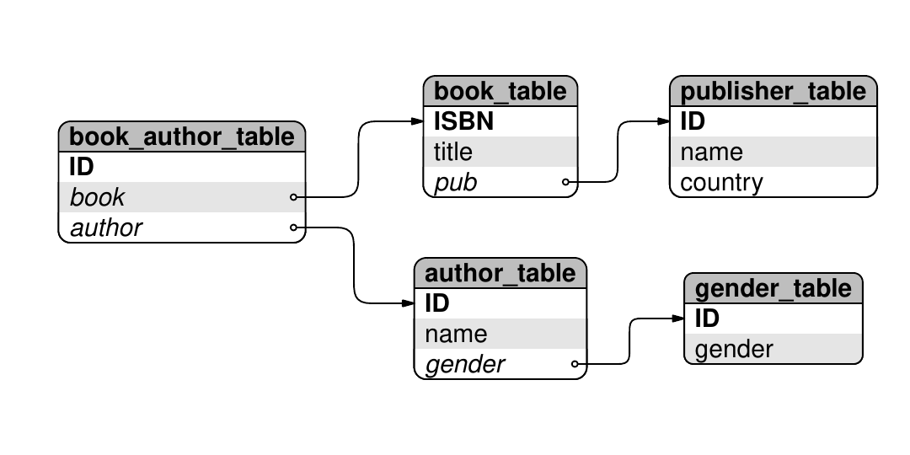
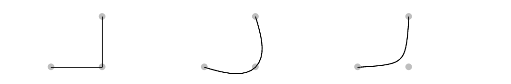
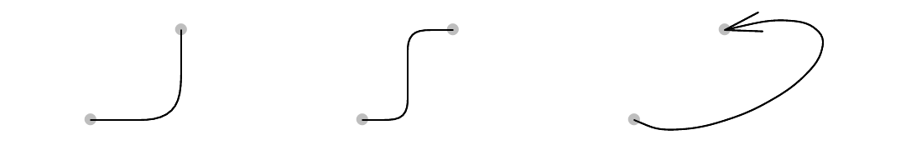

::: article
R provides a number of well-known *high-level* facilities for producing
sophisticated statistical plots, including the "traditional" plots in
the *graphics* package [@R], the Trellis-style plots provided by
*lattice* [@lattice], and the grammar-of-graphics-inspired approach of
*ggplot2* [@ggplot].

However, R also provides a powerful set of *low-level* graphics
facilities for drawing basic shapes and, more importantly, for arranging
those shapes relative to each other, which can be used to draw a wide
variety of graphical images. This article highlights some of R's
low-level graphics facilities by demonstrating their use in the
production of *diagrams*. In particular, the focus will be on some of
the useful things that can be done with the low-level facilities
provided by the *grid* graphics package
[@grid; @rgraphics; @gridchanges].

# Starting at the end {#starting-at-the-end .unnumbered}

An example of the type of diagram that we are going to work towards is
shown below. We have several "boxes" that describe table schema for a
database, with lines and arrows between the boxes to show the
relationships between tables.

{width="100%" alt="graphic without alt text"}

To forestall some possible misunderstandings, the sort of diagram that
we are talking about is one that is designed *by hand*. This is not a
diagram that has been automatically laid out.

The sort of diagram being addressed is one where the author of the
diagram has a clear idea of what the end result will roughly look
like---the sort of diagram that can be sketched with pen and paper. The
task is to produce a pre-planned design, using a computer to get a nice
crisp result.

That being said, a reasonable question is "why not draw it by hand?",
for example, using a free-hand drawing program such as *Dia* [@dia]. The
advantage of using R code to produce this sort of image is that code is
easier to reproduce, reuse, maintain, and fine-tune with accuracy. The
thought of creating this sort of diagram by pushing objects around the
screen with a mouse fills me with dread. Maybe I'm just not a very GUI
guy.

Before we look at drawing diagrams with the core R graphics facilties,
it is important to acknowledge that several contributed R packages
already provide facilities for drawing diagrams. The *Rgraphviz*
[@Rgraphvizpkg] and *igraph* [@igraph] packages provide automated layout
of node-and-edge graphs, and the *shape* and *diagram* packages
[@shapepkg; @diagrampkg] provide functions for drawing nodes of various
shapes with lines and arrows between them, with manual control over
layout.

In this article, we will only be concerned with drawing diagrams with a
small number of elements, so we do not need the automated layout
facilities of *Rgraphviz* or *igraph*. Furthermore, while the *shape*
and *diagram* packages provide flexible tools for building node-and-edge
diagrams, the point of this article is to demonstrate low-level *grid*
functions. We will use a node-and-edge diagram as the motivation, but
the underlying ideas can be applied to a much wider range of
applications.

In each of the following sections, we will meet a basic low-level
graphical tool and demonstrate how it can be used in the generation of
the pieces of an overall diagram, or how the tool can be used to combine
pieces together in convenient ways.

# Graphical primitives

One of the core low-level facilities of R graphics is the ability to
draw basic shapes. The typical graphical primitives such as text,
circles, lines, and rectangles are all available.

In this case, the shape of each box in our diagram is not quite as
simple as a rectangle because it has rounded corners. However, a rounded
rectangle is also one of the graphical primitives that the *grid*
package provides.[^1]

The code below draws a rounded rectangle with a text label in the
middle.

``` r
> library(grid)
```

``` r
> grid.roundrect(width=.25)
> grid.text("ISBN")
```

{width="100%" alt="graphic without alt text"}

# Viewports

A feature of the boxes in the diagram at the beginning of this article
is that the text is carefully positioned relative to the rounded
rectangle; the text is left-aligned within the rectangle. This careful
positioning requires knowing where the left edge of the rectangle is on
the page. Calculating those positions is annoyingly tricky and only
becomes more annoying if at some later point the position of the box is
adjusted and the positions of the text labels have to be calculated all
over again.

Using a *grid* viewport makes this sort of positioning very simple. The
basic idea is that we can create a viewport where the box is going to be
drawn and then do all of our drawing within that viewport. Positioning
text at the left edge of a viewport is very straightforward, and if we
need to shift the box, we simply shift the viewport and the text
automatically tags along for the ride. All of this applies equally to
positioning the text vertically within the box.

In the code below, we create a viewport for the overall box, we draw a
rounded rectangle occupying the entire viewport, then we draw text 2 mm
from the left hand edge of the viewport and 1.5 lines of text up from
the bottom of the viewport. A second line of text is also added, 0.5
lines of text from the bottom.

``` r
> pushViewport(viewport(width=.25))
> grid.roundrect()
> grid.text("ISBN",
            x=unit(2, "mm"),
            y=unit(1.5, "lines"),
            just="left")
> grid.text("title",
            x=unit(2, "mm"),
            y=unit(0.5, "lines"),
            just="left")
> popViewport()
```

{width="100%" alt="graphic without alt text"}

# Coordinate systems

The positioning of the labels within the viewport in the previous
example demonstrates another useful feature of the *grid* graphics
system: the fact that locations can be specified in a variety of
coordinate systems or units. In that example, the text was positioned
horizontally in terms of millimetres and vertically in terms of lines of
text (which is based on the font size in use).

As another example of the use of these different units, we can size the
overall viewport so that it is just the right size to fit the text
labels. In the following code, the height of the viewport is based on
the number of labels and the width of the viewport is based on the width
of the largest label, plus a 2 mm gap either side. This code also
simplifies the labelling by drawing both labels in a single
`grid.text()` call.

``` r
> labels <- c("ISBN", "title")
> vp <-
    viewport(width=max(stringWidth(labels))+
                   unit(4, "mm"),
             height=unit(length(labels),
                         "lines"))
> pushViewport(vp)
> grid.roundrect()
> grid.text(labels,
            x=unit(2, "mm"),
            y=unit(2:1 - 0.5, "lines"),
            just="left")
> popViewport()
```

{width="100%" alt="graphic without alt text"}

# Clipping

Another feature of the boxes that we want to produce is that they have
shaded backgrounds. Looking closely, there are some relatively complex
shapes involved in this shading. For example, the grey background for
the "heading" of each box has a curvy top, but a flat bottom. These are
not simple rounded rectangles, but some unholy alliance of a rounded
rectangle and a normal rectangle.

It is possible, in theory, to achieve any sort of shape with R because
there is a general polygon graphical primitive. However, as with the
positioning of the text labels, determining the exact boundary of this
polygon is not trivial and there are easier ways to work.

In this case, we can achieve the result we want using clipping, so that
any drawing that we do is only visible on a restricted portion of the
page. R does not provide clipping to arbitrary regions, but it is
possible to set the clipping region to any *rectangular* region.

The basic idea is that we will draw the complete rounded rectangle, then
set the clipping region for the box viewport so that no drawing can
occur in the last line of text in the box and then draw the rounded
rectangle again, this time with a different background. If we continue
doing this, we end up with bands of different shading.

The following code creates an overall viewport for a box and draws a
rounded rectangle with a grey fill. The code then sets the clipping
region to start one line of text above the bottom of the viewport and
draws another rounded rectangle with a white fill. The effect is to
leave just the last line of the original grey rounded rectangle showing
beneath the white rounded rectangle that has had its last line clipped.

``` r
> pushViewport(viewport(width=.25))
> grid.roundrect(gp=gpar(fill="grey"))
> grid.clip(y=unit(1, "lines"),
            just="bottom")
> grid.roundrect(gp=gpar(fill="white"))
> popViewport()
```

{width="100%" alt="graphic without alt text"}

# Drawing curves

Another basic shape that is used in the overall diagram is a nice curve
from one box to another.

In addition to the basic functions to draw *straight* lines in R, there
are functions that draw *curves*. In particular, R provides a graphical
primitive called an X-spline [@xspline]. The idea of an X-spline is that
we define a set of control points and a curve is drawn either through or
near to the control points. Each control point has a parameter that
specifies whether to create a sharp corner at the control point, or draw
a smooth curve through the control point, or draw a smooth curve that
passes nearby.

The following code sets up sets of three control points and draws an
X-spline relative to each set of control points. The first curve makes a
sharp corner at the middle control point, the second curve makes a
smooth corner *through* the middle control point, and the third curve
makes a smooth corner *near* the middle control point. The control
points are drawn as grey dots for reference (code not shown).

``` r
> x1 <- c(0.1, 0.2, 0.2)
> y1 <- c(0.2, 0.2, 0.8)
> grid.xspline(x1, y1)
> x2 <- c(0.4, 0.5, 0.5)
> y2 <- c(0.2, 0.2, 0.8)
> grid.xspline(x2, y2, shape=-1)
> x3 <- c(0.7, 0.8, 0.8)
> y3 <- c(0.2, 0.2, 0.8)
> grid.xspline(x3, y3, shape=1)
```

{width="100%" alt="graphic without alt text"}

Determining where to place the control points for a curve between two
boxes is another one of those annoying calculations, so a more
convenient option is provided by a curve graphical primitive in *grid*.
The idea of this primitive is that we simply specify the start and end
points of the curve and R figures out a set of reasonable control points
to produce an appropriate X-spline. It is also straightforward to add an
arrow to either end of any straight or curvy line that R draws.

The following code draws three curves between pairs of end points. The
first curve draws the default "city-block" line between end points, with
a smooth corner at the turning point, the second curve is similar, but
with an extra corner added, and the third curve draws a single wide,
smooth corner that is distorted towards the end point. The third curve
also has an arrow at the end.

``` r
> x1a <- 0.1; x1b <- 0.2
> y1a <- 0.2; y1b <- 0.8
> grid.curve(x1a, y1a, x1b, y1b)
> x2a <- 0.4; x2b <- 0.5
> y2a <- 0.2; y2b <- 0.8
> grid.curve(x2a, y2a, x2b, y2b,
             inflect=TRUE)
> x3a <- 0.7; x3b <- 0.8
> y3a <- 0.2; y3b <- 0.8
> grid.curve(x3a, y3a, x3b, y3b,
             ncp=8, angle=135,
             square=FALSE,
             curvature=2,
             arrow=arrow(angle=15))
```

{width="100%" alt="graphic without alt text"}

# Graphical functions

The use of graphical primitives, viewports, coordinate systems, and
clipping, as described so far, can be used to produce a box of the style
shown in the diagram at the start of the article. For example, the
following code produces a box containing three labels, with background
shading to assist in differentiating among the labels.

``` r
> labels <- c("ISBN", "title", "pub")
> vp <-
    viewport(width=max(stringWidth(
                             labels))+
                   unit(4, "mm"),
             height=unit(length(labels),
                         "lines"))
> pushViewport(vp)
> grid.roundrect()
> grid.clip(y=unit(1, "lines"),
            just="bottom")
> grid.roundrect(gp=gpar(fill="grey"))
> grid.clip(y=unit(2, "lines"),
            just="bottom")
> grid.roundrect(gp=gpar(fill="white"))
> grid.clip()
> grid.text(labels,
            x=unit(rep(2, 3), "mm"),
            y=unit(3:1 - .5, "lines"),
            just="left")
> popViewport()
```

{width="100%" alt="graphic without alt text"}

However, in the sort of diagram that we want to produce, there will be
several such boxes. Rather than write separate code for each box, it
makes sense to write a general function that will work for any set of
labels. Such a function is shown in Figure [1](#figure:tablebox) and the
code below uses this function to draw two boxes side by side.

<figure id="figure:tablebox">
<div class="sourceCode" id="cb1"><pre class="sourceCode r"><code class="sourceCode r"><span id="cb1-1"><a href="#cb1-1" aria-hidden="true" tabindex="-1"></a><span class="sc">&gt;</span> tableBox <span class="ot">&lt;-</span> <span class="cf">function</span>(labels, <span class="at">x=</span>.<span class="dv">5</span>, <span class="at">y=</span>.<span class="dv">5</span>) {</span>
<span id="cb1-2"><a href="#cb1-2" aria-hidden="true" tabindex="-1"></a>      nlabel <span class="ot">&lt;-</span> <span class="fu">length</span>(labels)</span>
<span id="cb1-3"><a href="#cb1-3" aria-hidden="true" tabindex="-1"></a>      tablevp <span class="ot">&lt;-</span></span>
<span id="cb1-4"><a href="#cb1-4" aria-hidden="true" tabindex="-1"></a>          <span class="fu">viewport</span>(<span class="at">x=</span>x, <span class="at">y=</span>y,</span>
<span id="cb1-5"><a href="#cb1-5" aria-hidden="true" tabindex="-1"></a>                   <span class="at">width=</span><span class="fu">max</span>(<span class="fu">stringWidth</span>(labels)) <span class="sc">+</span></span>
<span id="cb1-6"><a href="#cb1-6" aria-hidden="true" tabindex="-1"></a>                         <span class="fu">unit</span>(<span class="dv">4</span>, <span class="st">&quot;mm&quot;</span>),</span>
<span id="cb1-7"><a href="#cb1-7" aria-hidden="true" tabindex="-1"></a>                   <span class="at">height=</span><span class="fu">unit</span>(nlabel, <span class="st">&quot;lines&quot;</span>))</span>
<span id="cb1-8"><a href="#cb1-8" aria-hidden="true" tabindex="-1"></a>      <span class="fu">pushViewport</span>(tablevp)</span>
<span id="cb1-9"><a href="#cb1-9" aria-hidden="true" tabindex="-1"></a>      <span class="fu">grid.roundrect</span>()</span>
<span id="cb1-10"><a href="#cb1-10" aria-hidden="true" tabindex="-1"></a>      <span class="cf">if</span> (nlabel <span class="sc">&gt;</span> <span class="dv">1</span>) {</span>
<span id="cb1-11"><a href="#cb1-11" aria-hidden="true" tabindex="-1"></a>          <span class="cf">for</span> (i <span class="cf">in</span> <span class="dv">1</span><span class="sc">:</span>(nlabel <span class="sc">-</span> <span class="dv">1</span>)) {</span>
<span id="cb1-12"><a href="#cb1-12" aria-hidden="true" tabindex="-1"></a>              fill <span class="ot">&lt;-</span> <span class="fu">c</span>(<span class="st">&quot;white&quot;</span>, <span class="st">&quot;grey&quot;</span>)[i <span class="sc">%%</span> <span class="dv">2</span> <span class="sc">+</span> <span class="dv">1</span>]</span>
<span id="cb1-13"><a href="#cb1-13" aria-hidden="true" tabindex="-1"></a>              <span class="fu">grid.clip</span>(<span class="at">y=</span><span class="fu">unit</span>(i, <span class="st">&quot;lines&quot;</span>), <span class="at">just=</span><span class="st">&quot;bottom&quot;</span>)</span>
<span id="cb1-14"><a href="#cb1-14" aria-hidden="true" tabindex="-1"></a>              <span class="fu">grid.roundrect</span>(<span class="at">gp=</span><span class="fu">gpar</span>(<span class="at">fill=</span>fill))</span>
<span id="cb1-15"><a href="#cb1-15" aria-hidden="true" tabindex="-1"></a>          }</span>
<span id="cb1-16"><a href="#cb1-16" aria-hidden="true" tabindex="-1"></a>      }</span>
<span id="cb1-17"><a href="#cb1-17" aria-hidden="true" tabindex="-1"></a>      <span class="fu">grid.clip</span>()</span>
<span id="cb1-18"><a href="#cb1-18" aria-hidden="true" tabindex="-1"></a>      <span class="fu">grid.text</span>(labels,</span>
<span id="cb1-19"><a href="#cb1-19" aria-hidden="true" tabindex="-1"></a>                <span class="at">x=</span><span class="fu">unit</span>(<span class="dv">2</span>, <span class="st">&quot;mm&quot;</span>), <span class="at">y=</span><span class="fu">unit</span>(nlabel<span class="sc">:</span><span class="dv">1</span> <span class="sc">-</span> .<span class="dv">5</span>, <span class="st">&quot;lines&quot;</span>),</span>
<span id="cb1-20"><a href="#cb1-20" aria-hidden="true" tabindex="-1"></a>                <span class="at">just=</span><span class="st">&quot;left&quot;</span>)</span>
<span id="cb1-21"><a href="#cb1-21" aria-hidden="true" tabindex="-1"></a>      <span class="fu">popViewport</span>()</span>
<span id="cb1-22"><a href="#cb1-22" aria-hidden="true" tabindex="-1"></a>  }</span></code></pre></div>
<figcaption>Figure 1: <span id="figure:tablebox"
label="figure:tablebox"></span>A function to draw a diagram box, for a
given set of <code>labels</code>, centred at the specified
(<code>x</code>, <code>y</code>) location.</figcaption>
</figure>

``` r
> tableBox(c("ISBN", "title", "pub"),
           x=0.3)
> tableBox(c("ID", "name", "country"),
           x=0.7)
```

{width="100%" alt="graphic without alt text"}

This function represents the simplest way to efficiently reuse graphics
code and to provide graphics code for others to use. However, there are
benefits to be gained from going beyond this procedural programming
style to a slightly more complicated object-oriented approach.

# Graphical objects

In order to achieve the complete diagram introduced at the start of this
article, we need one more step: we need to draw lines and arrows from
one box to another. We already know how to draw lines and curves between
two points; the main difficulty that remains is calculating the exact
position of the start and end points, because these locations depend on
the locations and dimensions of the boxes. The calculations could be
done by hand for each individual curve, but as we have seen before,
there are easier ways to work. The crucial idea for this step is that we
want to create not just a graphical function that encapsulates how to
draw a box, but define a graphical object that encapsulates information
about a box.

The code in Figure [2](#figure:boxgrob) defines such a graphical object,
plus a few other things that we will get to shortly. The first thing to
concentrate on is the `boxGrob()` function. This function creates a
`"box"` graphical object. In order to do this, all it has to do is call
the `grob()` function and supply all of the information that we want to
record about `"box"` objects. In this case, we just record the labels to
be drawn within the box and the location where we want to draw the box.

<figure id="figure:boxgrob">
<div class="sourceCode" id="cb1"><pre class="sourceCode r"><code class="sourceCode r"><span id="cb1-1"><a href="#cb1-1" aria-hidden="true" tabindex="-1"></a><span class="sc">&gt;</span> boxGrob <span class="ot">&lt;-</span> <span class="cf">function</span>(labels, <span class="at">x=</span>.<span class="dv">5</span>, <span class="at">y=</span>.<span class="dv">5</span>) {</span>
<span id="cb1-2"><a href="#cb1-2" aria-hidden="true" tabindex="-1"></a>      <span class="fu">grob</span>(<span class="at">labels=</span>labels, <span class="at">x=</span>x, <span class="at">y=</span>y, <span class="at">cl=</span><span class="st">&quot;box&quot;</span>)</span>
<span id="cb1-3"><a href="#cb1-3" aria-hidden="true" tabindex="-1"></a>  }</span>
<span id="cb1-4"><a href="#cb1-4" aria-hidden="true" tabindex="-1"></a><span class="sc">&gt;</span> drawDetails.box <span class="ot">&lt;-</span> <span class="cf">function</span>(x, ...) {</span>
<span id="cb1-5"><a href="#cb1-5" aria-hidden="true" tabindex="-1"></a>      <span class="fu">tableBox</span>(x<span class="sc">$</span>labels, x<span class="sc">$</span>x, x<span class="sc">$</span>y)</span>
<span id="cb1-6"><a href="#cb1-6" aria-hidden="true" tabindex="-1"></a>  }</span>
<span id="cb1-7"><a href="#cb1-7" aria-hidden="true" tabindex="-1"></a><span class="sc">&gt;</span> xDetails.box <span class="ot">&lt;-</span> <span class="cf">function</span>(x, theta) {</span>
<span id="cb1-8"><a href="#cb1-8" aria-hidden="true" tabindex="-1"></a>      nlines <span class="ot">&lt;-</span> <span class="fu">length</span>(x<span class="sc">$</span>labels)</span>
<span id="cb1-9"><a href="#cb1-9" aria-hidden="true" tabindex="-1"></a>      height <span class="ot">&lt;-</span> <span class="fu">unit</span>(nlines, <span class="st">&quot;lines&quot;</span>)</span>
<span id="cb1-10"><a href="#cb1-10" aria-hidden="true" tabindex="-1"></a>      width <span class="ot">&lt;-</span> <span class="fu">unit</span>(<span class="dv">4</span>, <span class="st">&quot;mm&quot;</span>) <span class="sc">+</span> <span class="fu">max</span>(<span class="fu">stringWidth</span>(x<span class="sc">$</span>labels))</span>
<span id="cb1-11"><a href="#cb1-11" aria-hidden="true" tabindex="-1"></a>      <span class="fu">grobX</span>(<span class="fu">roundrectGrob</span>(<span class="at">x=</span>x<span class="sc">$</span>x, <span class="at">y=</span>x<span class="sc">$</span>y, <span class="at">width=</span>width, <span class="at">height=</span>height),</span>
<span id="cb1-12"><a href="#cb1-12" aria-hidden="true" tabindex="-1"></a>            theta)</span>
<span id="cb1-13"><a href="#cb1-13" aria-hidden="true" tabindex="-1"></a>  }</span>
<span id="cb1-14"><a href="#cb1-14" aria-hidden="true" tabindex="-1"></a><span class="sc">&gt;</span> yDetails.box <span class="ot">&lt;-</span> <span class="cf">function</span>(x, theta) {</span>
<span id="cb1-15"><a href="#cb1-15" aria-hidden="true" tabindex="-1"></a>      nlines <span class="ot">&lt;-</span> <span class="fu">length</span>(x<span class="sc">$</span>labels)</span>
<span id="cb1-16"><a href="#cb1-16" aria-hidden="true" tabindex="-1"></a>      height <span class="ot">&lt;-</span> <span class="fu">unit</span>(nlines, <span class="st">&quot;lines&quot;</span>)</span>
<span id="cb1-17"><a href="#cb1-17" aria-hidden="true" tabindex="-1"></a>      width <span class="ot">&lt;-</span> <span class="fu">unit</span>(<span class="dv">4</span>, <span class="st">&quot;mm&quot;</span>) <span class="sc">+</span> <span class="fu">max</span>(<span class="fu">stringWidth</span>(x<span class="sc">$</span>labels))</span>
<span id="cb1-18"><a href="#cb1-18" aria-hidden="true" tabindex="-1"></a>      <span class="fu">grobY</span>(<span class="fu">rectGrob</span>(<span class="at">x=</span>x<span class="sc">$</span>x, <span class="at">y=</span>x<span class="sc">$</span>y, <span class="at">width=</span>width, <span class="at">height=</span>height),</span>
<span id="cb1-19"><a href="#cb1-19" aria-hidden="true" tabindex="-1"></a>            theta)</span>
<span id="cb1-20"><a href="#cb1-20" aria-hidden="true" tabindex="-1"></a>  }</span></code></pre></div>
<figcaption>Figure 2: <span id="figure:boxgrob"
label="figure:boxgrob"></span>Some functions that define a graphical
object representing a diagram box. The <code>boxGrob()</code> function
constructs a <code>"box"</code> object, the <code>drawDetails()</code>
method describes how to draw a <code>"box"</code> object, and the
<code>xDetails()</code> and <code>yDetails()</code> functions calculate
locations on the boundary of a <code>"box"</code> object.</figcaption>
</figure>

This function does not draw anything. For example, the following code
creates two `"box"` objects, but produces no graphical output
whatsoever.

``` r
> box1 <- boxGrob(c("ISBN", "title",
            "pub"), x=0.3)
> box2 <- boxGrob(c("ID", "name",
            "country"), x=0.7)
```

The `grid.draw()` function can be used to draw any graphical object, but
we need to supply the details of how `"box"` objects get drawn. This is
the purpose of the second function in Figure [2](#figure:boxgrob). This
function is a method for the `drawDetails()` function; it says how to
draw `"box"` objects. In this case, the function is very simple because
it can call the `tableBox()` function that we defined in Figure
[1](#figure:tablebox). The important detail is that the `boxGrob()`
function specified a special class, `cl="box"`, for `"box"` objects,
which meant that we could define a `drawDetails()` method specifically
for this sort of object and control what gets drawn.

With this `drawDetails()` method defined, we can draw the boxes that we
created earlier by calling the `grid.draw()` function. This function
will draw any *grid* graphical object by calling the appropriate method
for the `drawDetails()` generic function (among other things). The
following code calls `grid.draw()` to draw the two boxes.

``` r
> grid.draw(box1)
> grid.draw(box2)
```

{width="100%" alt="graphic without alt text"}

At this point, we appear to have achieved only a more complicated
equivalent of the previous graphics function. However, there are a
number of other functions that can do useful things with *grid*
graphical objects. For example, the `grobX()` and `grobY()` functions
can be used to calculate locations on the boundary of a graphical
object. As with `grid.draw()`, which has to call `drawDetails()` to find
out how to draw a particular class of graphical object, these functions
call generic functions to find out how to calculate locations on the
boundary for a particular class of object. The generic functions are
called `xDetails()` and `yDetails()` and methods for our special `"box"`
class are defined in the last two functions in Figure
[2](#figure:boxgrob).

These methods work by passing the buck. They both create a rounded
rectangle at the correct location and the right size for the box, then
call `grobX()` (or `grobY()`) to determine a location on the boundary of
the rounded rectangle. In other words, they rely on code within the
*grid* package that already exists to calculate the boundary of rounded
rectangles.

With these methods defined, we are now in a position to draw a curved
line between our boxes. The key idea is that we can use `grobX()` and
`grobY()` to specify a start and end point for the curve. For example,
we can start the curve at the right hand edge of `box1` by specifying
`grobX(box1, "east")`. The vertical position is slightly trickier
because we do not want the line starting at the top or bottom of the
box, but we can simply add or subtract the appropriate number of lines
of text to get the right spot.

The following code uses these ideas to draw a curve from the `pub` label
of `box1` to the `ID` label of `box2`. The curve has two corners
(`inflect=TRUE)` and it has a small arrow at the end.

This call to `grid.curve()` is relatively verbose, but in a diagram
containing many similar curves, this burden can be significantly reduced
by writing a simple function that hides away the common features, such
as the specification of the arrow head.

The major gain from this object-oriented approach is that the start and
end points of this curve are described by simple expressions that will
automatically update if the locations of the boxes are modified.

``` r
> grid.curve(grobX(box1, "east"),
             grobY(box1, "south") +
               unit(0.5, "lines"),
             grobX(box2, "west"),
             grobY(box2, "north") -
               unit(0.5, "lines"),
             inflect=TRUE,
             arrow=
               arrow(type="closed",
                  angle=15,
                  length=unit(2, "mm")),
             gp=gpar(fill="black"))
```

{width="100%" alt="graphic without alt text"}

# Conclusion

This article has demonstrated a number of useful *low-level* graphical
facilities in R with an example of how they can be combined to produce a
diagram consisting of non-trivial nodes with smooth curves between them.

The code examples provided in this article have ignored some details in
order to keep things simple. For example, there are no checks that the
arguments have sensible values in the functions `tableBox()` and
`boxGrob()`. However, for creating one-off diagrams, this level of
detail is not necessary anyway.

One detail that would be encountered quite quickly in practice, in this
particular sort of diagram, is that a curve from one box to another that
needs to go across-and-down rather than across-and-up would require the
addition of `curvature=-1` to the `grid.curve()` call. Another thing
that is missing is complete code to produce the example diagram from the
beginning of this article, where there are five interconnected boxes and
the boxes have some additional features, such as a distinct "header"
line at the top. This complete code was excluded to save on space, but a
simple R package is provided at <http://www.stat.auckland.ac.nz/~paul/>
with code to draw that complete diagram and the package also contains a
more complete implementation of code to create and draw `"box"`
graphical objects.

One final point is that using R graphics to draw diagrams like this is
*not* fast. In keeping with the [S]{.sans-serif} tradition, the emphasis
is on developing *code* quickly and on having code that is not a
complete nightmare to maintain. In this case particularly, the speed of
developing a diagram comes at the expense of the time taken to draw the
diagram. For small, one-off diagrams this is not likely to be an issue,
but the approach described in this article would *not* be appropriate,
for example, for drawing a node-and-edge graph of the Internet.
:::

[^1]: From R version 2.9.0; prior to that, a simpler rounded rectangle
    was available via the `grid.roundRect()` function in the *RGraphics*
    package.
