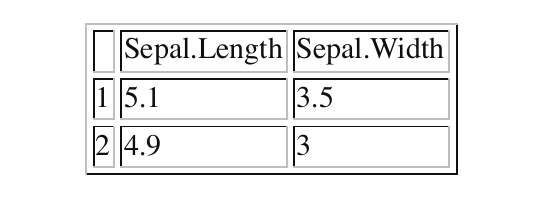
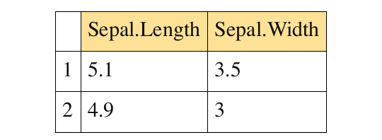
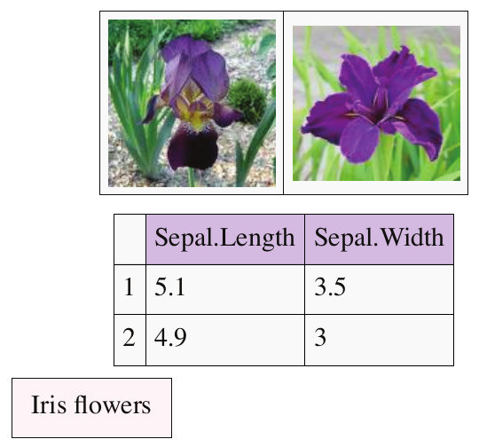
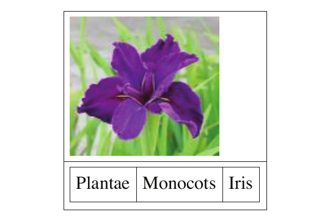

::: article
# Introduction

HTML documents are structured documents made of diverse elements such as
paragraphs, sections, columns, figures and tables organized in a
hierarchical layout. Combination of HTML documents and hyperlinking is
useful to report analysis results; for example, in the package
[*arrayQualityMetrics*](https://CRAN.R-project.org/package=arrayQualityMetrics),
estimating the quality of microarray data sets and
[*cellHTS2*](https://CRAN.R-project.org/package=cellHTS2), performing
the analysis of cell-based screens.

There are several tools for exporting data from R into HTML documents.
The package [*R2HTML*](https://CRAN.R-project.org/package=R2HTML) is
able to render a large diversity of R objects in HTML but does not
support combining them efficiently in a structured layout and has a
complex syntax. On the other hand, the package
[*xtable*](https://CRAN.R-project.org/package=xtable) can render R
matrices with simple commands but cannot combine HTML elements and lacks
formatting options.

The package [*hwriter*](https://CRAN.R-project.org/package=hwriter)
allows rendering R objects in HTML and combining resulting elements in a
structured layout. It uses a simple syntax, supports extensive
formatting options and takes full advantage of the ellipsis `’...’`
argument and R vector recycling rules.

Comprehensive documentation and examples of
[*hwriter*](https://CRAN.R-project.org/package=hwriter) are generated by
running the command `example(hwriter)`, which creates the package web
page <http://www.ebi.ac.uk/~gpau/hwriter>.

# The function `hwrite`

The generic function `hwrite` is the core function of the package
[*hwriter*](https://CRAN.R-project.org/package=hwriter).
`hwrite(x, page=NULL, ...)` renders the object `x` in HTML using the
formatting arguments specified in '`...`' and returns a character vector
containing the HTML element code of `x`.

If `page` is a filename, the HTML element is written in this file. If it
is an R connection/file, the element is appended to this connection,
allowing the sequential building of HTML documents. If `NULL`, the
returned HTML element code can be concatenated with other elements with
`paste` or nested inside other elements through subsequent `hwrite`
calls. These operations are the tree structure equivalents of adding a
sibling node and adding a child node in the document tree.

## Formatting objects

The most basic call of `hwrite` is to output a character vector into an
HTML document.

``` r
> hwrite('Hello world !', 'doc.html')
```

{width="100%" alt="graphic without alt text"}

Character strings can be rendered with a variety of formatting options.
The argument `link` adds an hyperlink to the HTML element pointing to an
external document. The argument `style` specifies an inline Cascaded
Style Sheet (CSS) style (color, alignment, margins, font, \...) to
render the element. Other arguments allow a finer rendering control.

``` r
> hwrite('Hello world !', 'doc.html',
  link='http://cran.r-project.org/')
```

{width="100%" alt="graphic without alt text"}

``` r
> hwrite('Hello world !', 'doc.html', 
  style='color: red; font-size: 20pt;
  font-family: Gill Sans Ultra Bold')
```

{width="100%" alt="graphic without alt text"}

Images can be included using `hwriteImage` which supports diverse
formatting options.

``` r
> img=system.file('images', c('iris1.jpg',
  'iris3.jpg'), package='hwriter')
> hwriteImage(img[2], 'doc.html')
```

{width="1.5in" alt="graphic without alt text"}

## Arguments recycling

Objects written with formatting arguments containing more than one
element are recycled by `hwrite`, producing a vector of HTML elements.

``` r
> hwrite('test', 'doc.html', style=paste(
  'color:', c('peru', 'purple', 'green')))
```

{width="100%" alt="graphic without alt text"}

## Vectors and matrices

Vectors and matrices are rendered as HTML tables.

``` r
> hwrite(iris[1:2, 1:2], 'doc.html')
```

{width="100%" alt="graphic without alt text"}

Formatting arguments are recycled and distributed over table cells.
Arguments `link` and `style` are valid. Cell background color is
controlled by the argument `bgcolor`.

``` r
> colors=rgb(colorRamp(c('red', 'yellow', 
  'white'))((0:7)/7), max=255)
> hwrite(0:7, 'doc.html', bgcolor=colors,
  style='padding:5px')
```

{width="100%" alt="graphic without alt text"}

Formatting arguments can also be distributed on rows and columns using
the syntax `row.*` and `col.*` where `*` can be any valid HTML \<td\>
attribute. Global table properties are specified using the syntax
`table.*` where `*` can be any valid HTML \<table\> attribute. As an
example, `table.style` controls the global table CSS inline style and
`table.cellpadding` controls the global cell padding size.

``` r
> hwrite(iris[1:2, 1:2], 'doc.html', 
  row.bgcolor='#ffdc98', table.style=
  'border-collapse:collapse', 
  table.cellpadding='5px')
```

{width="100%" alt="graphic without alt text"}

## Appending HTML elements in a page

A new HTML document is created by the function `openPage` which returns
an R connection. Appending HTML elements to the page is done by passing
the connection to `hwrite` instead of a filename. The document is closed
by `closePage` which terminates the HTML document. The function
`openPage` supports the argument `link.css` which links the document to
external stylesheets containing predefined CSS styles and classes.
Classes can be used with the argument `class` of the function `hwrite`.

``` r
> hcss=system.file('images', 'hwriter.css',
  package='hwriter')
> p=openPage('doc.html', link.css=hcss)
> hwriteImage(img, p, br=TRUE)
> hwrite(iris[1:2, 1:2], p, br=TRUE,
  row.bgcolor='#d2c0ed')
> hwrite('Iris flowers', p, class='intro')
> closePage(p)
```

{width="100%" alt="graphic without alt text"}

## Nesting HTML elements

The function `hwrite` always returns a character vector containing HTML
code parts. Code parts can be reused in further `hwrite` calls to build
tables containing complex cells or inner tables, which are useful to
compose HTML document layouts.

``` r
> cap=hwrite(c('Plantae','Monocots','Iris'),
  table.style='border-collapse:collapse', 
  table.cellpadding='5px')
> print(cap)
```

::: center
``` r
<table style="border-collapse:collapse"
cellpadding="5px" border="1"><tr><td>
Plantae</td><td>Monocots</td><td>Iris
</td></tr></table>
```
:::

``` r
> hwrite(matrix(c(hwriteImage(img[2]),cap)),
  'doc.html', table.cellpadding='5px',
  table.style='border-collapse:collapse')
```

{width="100%" alt="graphic without alt text"}
:::
