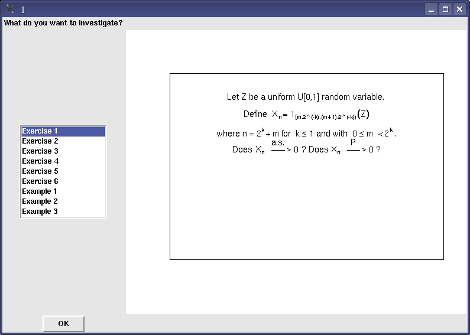

::: article
# Introduction

Many students are exposed, during their graduate school years, to the
difficult concepts of convergence of a sequence of random variables (see
@RSethuraman1995). Indeed, as pointed out by @RBryceGouldNotzPeck2001,
"statistical theory is an important part of the curriculum, and is
particularly important for students headed for graduate school". Such
knowledge is prescribed by learned statistics societies (see
Accreditation of Statisticians by the Statistical Society of Canada, and
Curriculum Guidelines for Undergraduate Programs in Statistical Science
by the American Statistical Association). In the main textbooks (see for
example @RBillingsley1986, @RChung1974, @RFerguson1996, @RLehmann2001,
@RSerfling2002), around 15 pages without graphs are allotted to defining
these convergence concepts and their interrelations. But, very often,
these concepts are only described through their definitions and some of
their properties. Thus, some students may not fully visualize how a
random variable converges to some limit. They also may not fully
understand the differences between the various modes, especially between
convergence in probability and almost surely.

Moreover, a statistician could be interested in whether or not a
specific random sequence converges. To explain the modes of convergence,
we could follow @RBryceGouldNotzPeck2001's advice: "a modern statistical
theory course might, for example, include more work on computer
intensive methods". With regard to the convergence in law, @RDunn1999
and @RMarasingheMeekerCookShin1996 have proposed tools to explain this
concept in an interactive manner. @RMills2002 proposed a review of
statistical teaching based on simulation methods and @RChanceRossman2006
have written a book on this subject. Our package enables one to
investigate graphically the four classical modes of convergence of a
sequence of random variables: convergence almost surely, convergence in
probability, convergence in law and convergence in $r$-th mean. Note
that it is tightly associated with the reading of
@RLafayeDeMicheauxLiquet2009 which explains what we call our "mind
visualization approach" of these convergence concepts.

The two main functions to use in our package are `investigate` and
`check.convergence`. The first one will be described in the next
section, investigating pre-defined Exercise 1 from
@RLafayeDeMicheauxLiquet2009. The second one will be described in the
last section, where it is shown how to treat your own examples.

At this point, note the necessary first two steps to perform before
working with our package:

``` r
install.packages("ConvergenceConcepts")
require(ConvergenceConcepts)
```

# Pre-defined examples

Our package contains several pre-defined examples and exercises (all
introduced and solved in @RLafayeDeMicheauxLiquet2009 and in its
associated online Appendix), some of which are classical ones. To
investigate these examples, just type in the R console:

``` r
investigate()
```

{#figure:figure1
width="6in" alt="graphic without alt text"}

Any entry can be selected by clicking in the left panel displayed in
Figure [1](#figure:figure1). The corresponding text then appears inside
the right panel. Next, by clicking the OK button, the relevant R
functions are called to help the user to visualize the chosen modes of
convergence for the random variable sequence under investigation. You
will then be able to twiddle a few features.

For example, the first entry corresponds to the following problem.

**Exercise 1:** Let $Z$ be a uniform $U[0,1]$ random variable and define
$X_n=1_{ [m/2^k,(m+1)/2^k]}(Z)$ where $n=2^k+m$ for $k\geq 1$ and with
$0\leq m <2^k$. Thus $X_1=1$, $X_2=1_{[0,1/2)}(Z)$,
$X_3=1_{[1/2,1)}(Z)$, $X_4=1_{[0,1/4)}(Z)$, $X_5=1_{[1/4,1/2)}(Z)$,
$\ldots$. Does $X_n\stackrel{a.s.}{\longrightarrow}0$? Does
$X_n\stackrel{P}{\longrightarrow}0$?

**Solution to exercise 1:** The drawing on Figure [2](#figure:cantor)
explains the construction of $X_n$.

{#figure:cantor width="100%" alt="graphic without alt text"}

Let us apply our visual reasoning as explained in Section 2 of
[@RLafayeDeMicheauxLiquet2009]. Once a $z$ value is randomly drawn, the
entire associated sample path is fully determined. As $n$ increases,
each sample path "stays" for a longer time at 0 but eventually jumps
to 1. In fact it will jump to 1 an infinite number of times after each
fixed $n$ value.

This can be seen using our package. After having selected the first
entry and clicked on the OK button displayed in Figure
[1](#figure:figure1), we obtain the following plot.

![Figure 3: Seeing almost sure convergence in action. On the left panel,
we visualize only 10 sample paths among the M=500 simulated realizations
of the sequence of random variables defined in exercise 1. It can be
seen that all these sample paths go off $[-\epsilon,+\epsilon]$ in the
block beginning at position n=104. On the right panel, we visualize the
$\hat{a}_n$ values for each n between 1 and 200. We see that $\hat{a}_n$
equal 1.](Pnotas1.png){#figure:figure3 width="6.5in" alt="graphic without alt text"}

On the left panel of this plot, we see some sample paths associated with
$X_n$. One can thus notice, on left panel of Figure
[3](#figure:figure3), that for all $n=1,\ldots$, all these sample paths
will jump to 1 somewhere (and even at many places) in the grey block
beginning at position $n$.

By definition, $X_n\stackrel{a.s.}{\longrightarrow}0$ if and only if
$\forall \epsilon>0: a_n= P\left[\omega;\exists k\geq n: \,
  |X_{k,\omega}|>\epsilon\right]\underset{n\rightarrow\infty}{\longrightarrow}0$.
In this definition, and in the one thereafter on convergence in
probability, $\omega$ can be viewed as some kind of labelling of a
sample path. We define $\hat{a}_n$ to be a frequentist estimate of
$a_n$. It is the proportion of the pieces of generated sample paths
beginning at position $n$ that go outside the horizontal band
$[-\epsilon,+\epsilon]$ (see @RLafayeDeMicheauxLiquet2009 for more
details). Using our package, the user can interactively move the grey
block on left side of Figure [3](#figure:figure3). He can thus observe
the pieces of sample paths which leave the horizontal band. Red marks
indicate, for each sample path, the first time when this happens.
Simultaneously we can observe their proportion $\hat{a}_n$ (equal to 1
here) on right side of Figure [3](#figure:figure3) as indicated by a
sliding red circle. We can see that we cannot have almost sure
convergence.

By definition, $X_n\stackrel{P}{\longrightarrow}0$ if and only if
$\forall\epsilon>0:\ p_n= P \left[\omega;\
  |X_{n,\omega}|>\epsilon\right]\underset{n\rightarrow\infty}{\longrightarrow}
0$. We define $\hat{p}_n$ to be a frequentist estimate of $p_n$. It is
the proportion of generated sample paths lying outside a band
$[-\epsilon,+\epsilon]$ in the bar at position $n$. Note that, for this
example, this corresponds to the proportion of $[0,1]$-uniform $z$
values falling into an interval whose length gets narrower. We can
investigate graphically convergence in probability by sliding the
vertical bar (click first on radio button *Probability* for this bar to
appear, see Figure [4](#figure:figure4)) and observe that $\hat{p}_n$ is
going towards 0. This lets us perceive that in this case, we do have
convergence in probability.

![Figure 4: Seeing convergence in probability in action. On the left
panel, we visualize only 10 sample paths among the M=500 simulated
realizations of the sequence of random variables defined in exercise 1.
It can be seen that, among these ten, only one sample path go off
$[-\epsilon,+\epsilon]$ in the bar at position n=104. On the right
panel, we visualize the $\hat{p}_n$ values for each n between 1 and 200.
We see that $\hat{p}_n$ goes towards 0.](Pnotas2.png){#figure:figure4
width="100%" alt="graphic without alt text"}

For the interested reader, a mathematically rigorous proof of this
exercise can be found in @RLafayeDeMicheauxLiquet2009.

# Investigating your own examples

We now introduce two new problems that have not been either pre-included
or treated in the package. We show how a user can define his own
functions in order to investigate the convergence of $X_n$ towards $X$,
or equivalently of $X_n-X$ to 0. These problems are rather simple, but
the objective here is only to show how to use our package. The two steps
will consist in coding your generator of the $X_i$'s and then using the
`check.convergence` function.

This last function has several arguments whose description is now given.

::: trivlist
`nmax`: number of points in each sample path.

`M`: number of sample paths to be generated.

`genXn`: a function that generates the first $n$ $X_n-X$ values, or only
the first $n$ $X_n$ values in the law case.

`argsXn`: a list of arguments to `genXn`.

`mode`: a character string specifying the mode of convergence to be
investigated, must be one of `"p"` (default), `"as"`, `"r"` or `"L"`.

`epsilon`: a numeric value giving the interval endpoint.

`r`: a numeric value (r\>0) if convergence in $r$-th mean is to be
studied.

`nb.sp`: number of sample paths to be drawn on the left plot.

`density`: if `density`=`TRUE`, then the plot of the density of $X$ and
the histogram of $X_n$ is returned. If `density`=`FALSE`, then the plot
of the distribution function $F(t)$ of $X$ and the empirical
distribution $F_n(t)$ of $X_n$ is returned.

`densfunc`: function to compute the density of $X$.

`probfunc`: function to compute the distribution function of $X$.

`tinf`: lower limit for investigating convergence in law.

`tsup`: upper limit for investigating convergence in law.

`trace`: function used to draw the plot; `plot` or `points`.

`...`: optional arguments to `trace`.
:::

**Problem 1:** Let $X_1, X_2, \ldots$ be independent, identically
distributed, continuous random variables with a $N(2,9)$ distribution.
Define $Y_i = (0.5)^i X_i$, $i = 1, 2, \ldots$. Also define $T_n$ and
$A_n$ to be the sum and the average, respectively, of the terms
$Y_1, Y_2, \ldots, Y_n$.

1.  Is $Y_n$ convergent in probability to 0?

2.  Is $T_n$ convergent in probability to 2?

3.  Is $A_n$ convergent in probability to 0?

4.  Is $T_n$ convergent in law to a $N(2,3)$ ?

**Solution to problem 1:**

1.  We first define a random generator (called `genYn`) for the $Y_i$'s
    then we call the function `check.convergence`.

    ``` r
    genYn <- function(n) {
      res <- (0.5)^(1:n)*rnorm(n,2,3)
      return(res)
    }
    check.convergence(2000,500,genYn,mode="p") 
    ```

    We can zoom in the left panel of Figure [5](#figure:ex1a) (from
    $n_1=1$ to $n_2=10$) and see the 10 sample paths going rapidly
    inside the horizontal band $[-\epsilon,+\epsilon]$. Looking at the
    evolution of $\hat{p}_n$ towards 0 in the right panel, we can assume
    that $Y_n$ converges in probability towards 0.

    {#figure:ex1a width="6.5in" alt="graphic without alt text"}

2.  We first define a random generator (called `genTn`) for the
    $(T_i-2)$'s then we call the function `check.convergence`.

    ``` r
    genTn <- function(n) {
      res <- cumsum((0.5)^(1:n)*rnorm(n,2,3))-2
      return(res)
    }
    check.convergence(2000,500,genTn,mode="p") 
    ```

    Each one of the sample paths rapidly evolve towards an horizontal
    asymptote, not the same for each sample path, and not contained
    inside the horizontal band $[-\epsilon,+\epsilon]$. Looking at the
    evolution of $\hat{p}_n$ in the right panel of Figure
    [6](#figure:ex1b), we can assume that $T_n$ does not converge in
    probability towards 2.

    {#figure:ex1b width="6.5in" alt="graphic without alt text"}

3.  We first define a random generator (called `genAn`) for the $A_i$'s
    then we call the function `check.convergence`.

    ``` r
    genAn <- function(n) {
      x<-1:n	
      res<-cumsum((0.5)^x*rnorm(n,2,3))/cumsum(x)
      return(res)
    }
    check.convergence(2000,500,genAn,mode="p") 
    ```

    In this case, we can zoom in (from $n_1=1$ to $n_2=50$) to better
    see the sample paths which all end up inside the horizontal band
    $[-\epsilon,+\epsilon]$. Looking at the evolution of $\hat{p}_n$
    towards 0 in the right panel of Figure [7](#figure:ex1c), we can
    assume that $A_n$ converges in probability towards 0.

    {#figure:ex1c width="6.5in" alt="graphic without alt text"} 

4.  We first define a random generator (called `genTnL`) for the $T_i$'s
    then we call the function `check.convergence`.

    ``` r
    genTnL <- function(n) {
      res <- cumsum((0.5)^(1:n)*rnorm(n,2,3))
      return(res)
    }
    check.convergence(2000,1000,genTnL,mode="L", 
      density = F, 
      densfunc = function(x){dnorm(x,2,sqrt(3))}, 
      probfunc=function(x){pnorm(x,2,sqrt(3))}, 
      tinf = -4, tsup = 4) 
    ```

    {#figure:ex1d width="6.5in" alt="graphic without alt text"}

    By definition, $X_n\stackrel{L}{\longrightarrow}X$ if and only if
    $l_n(t)=|F_n(t)-F(t)|\underset{n\rightarrow\infty}{\longrightarrow}0$,
    at all $t$ for which $F$ (the distribution function of $X$) is
    continuous, where $F_n(t)$ is the distribution function of $X_n$. We
    define $\hat{F}_n(t)$ to be the empirical distribution function of
    $X_n$ (based on $M$ realizations of $X_n$) and
    $\hat{l}_n(t)=|\hat{F}_n(t)-F(t)|$.

    We can move the slider (right part of Figure [8](#figure:ex1d)) and
    see that the red curve comes closer to the black one. Also, on the
    right you can see the tri-dimensional plot of $|\hat{F}_n(t)-F(t)|$
    for $n=1,\ldots,n_\text{max}=2000$ to see if gets closer to the zero
    horizontal plane. These plots suggest a convergence in distribution.

**Problem 2:** Let $X_1, X_2, \ldots$ be *i.i.d.* random variables with
a uniform distribution on $[0,1]$. We define $M_n = \max\{X_1,
\ldots,X_n\}$.

1.  Show that $M_n$ converges in probability and almost surely to 1.

2.  Show that $M_n$ converges in quadratic mean to 1.

**Solution to problem 2:**

We first define our random generator of the $(X_i-1)$'s.

``` r
genMn <- function(n) {
  res <- cummax(runif(n))-1
  return(res)
}
```

1.  We now call the `check.convergence` function.

    ``` r
    check.convergence(2000,500,genMn,mode="p")  
    ```

    Obviously, all the sample paths are strictly increasing towards 1.
    Looking at the right panel of Figure [9](#figure:ex2a), we see
    $\hat{a}_n$ and $\hat{p}_n$ decreasing towards 0. This makes us
    believe that we are contemplating a convergence almost surely and
    convergence in probability towards 1.

    {#figure:ex2a width="6.5in" alt="graphic without alt text"}

2.  We now call the `check.convergence` function to investigate the
    quadratic mean convergence.

    ``` r
    check.convergence(2000,500,genMn,mode="r",r=2)  
    ```

    By definition, $X_n\stackrel{r}{\longrightarrow}X$ if and only if
    $e_{n,r}=E|X_n-X|^r\underset{n\rightarrow\infty}{\longrightarrow}0$.
    We define, in an obvious fashion, $\hat{e}_{n,r}$ to be a Monte
    Carlo estimate of $e_{n,r}$, precisely defined in
    @RLafayeDeMicheauxLiquet2009.

    Looking at Figure [10](#figure:ex2b), one can expect $M_n$ to
    converge in quadratic mean towards 1 since $\hat{e}_{n,r}$ is
    decreasing towards 0.

{#figure:ex2b width="3in" alt="graphic without alt text"}

# Conclusion

We have described how this package can be used as interactive support
for asymptotics courses. A few examples were given to show how to
investigate almost sure convergence, convergence in probability,
convergence in law, or in $r$-th mean.

:::
