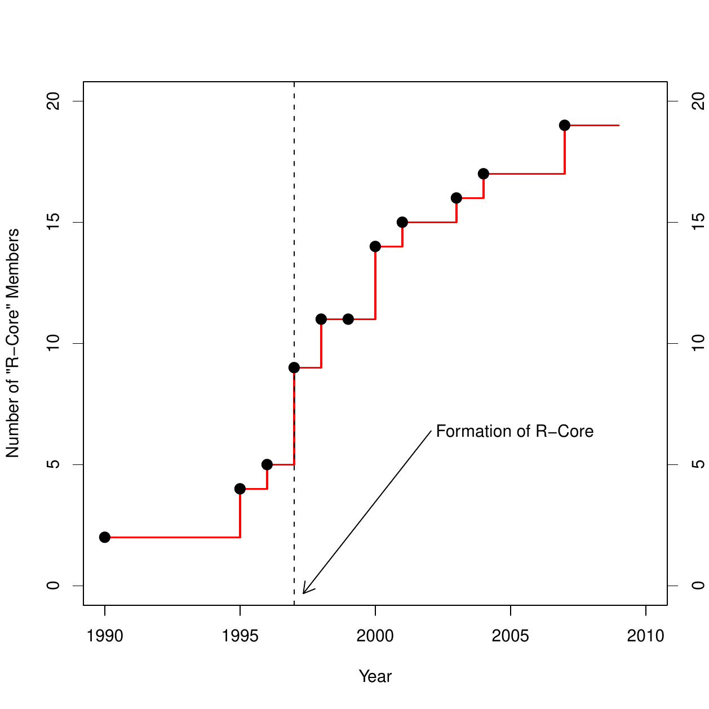
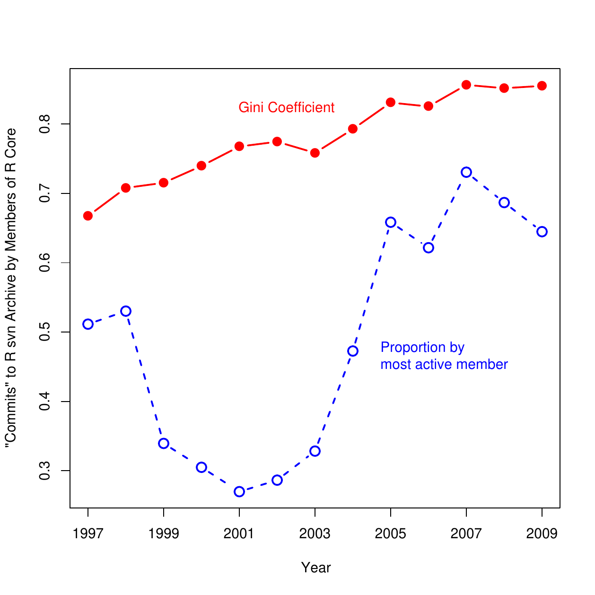
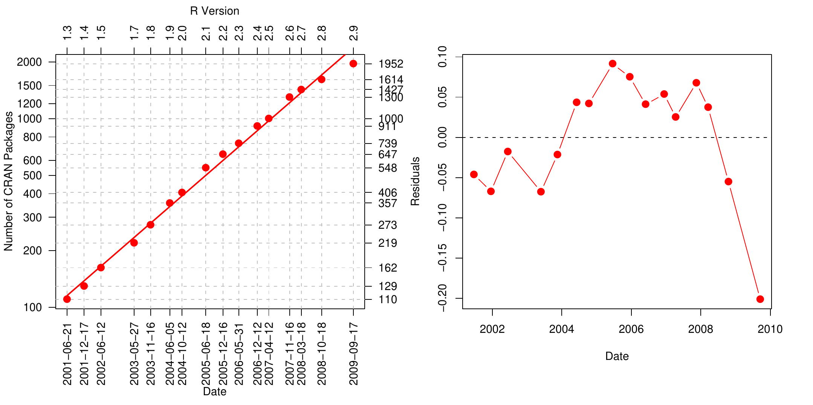
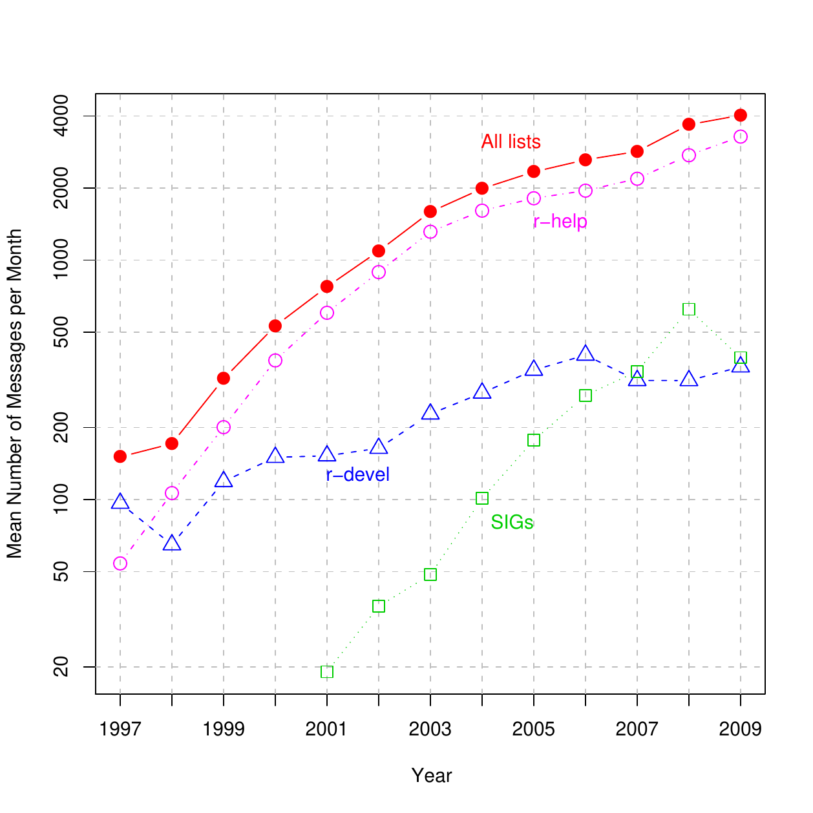

::: article
# Introduction

This paper describes aspects of the R Core team; briefly traces the
trajectory of the R Project; discusses the development and organization
of the R Project; considers the reasons for the success of R; and
speculates about its prospects for continued success. The paper is based
on semi-structured interviews conducted during 2006 and 2007 with most
members of the R Core team, whom I will occasionally quote in the paper;
on publicly available archival sources; and on participant observation
in the R Project, as a user, package developer, author, and --- more
recently --- a member of the R Foundation.

The paper is not a complete consideration of the social organization of
the R Project in that it does not systematically address interactions
among members of the R Core team, nor between the Core team and package
developers and users, nor among developers and users, all of which would
be the proper subject of a more complete account. Nevertheless, I do try
to identify key aspects of the social design of the R Project,
particularly with respect to their contributions to the success of R and
to its future.

# What is problematic about open-source software development?

Why do people contribute to open-source projects such as R? Is this
behaviour purely altruistic, or are there rewards --- tangible and
otherwise --- to open-source development? @Raymond2001c, for example,
suggests that the open-source development community constitutes a "gift
culture" in which the currency is reputation; he also argues
[@Raymond2001d] for the economic rationality of businesses that support
open-source development. Similar arguments about the potential
rationality of participation in open-source projects are advanced by
@Weber2004.

Although I will address the question of motivation briefly (and although
it is raised repeatedly by economists), it is not an issue unique to
open-source software development: After all, people participate in a
wide variety of voluntary organizations. There is a large and venerable
literature in sociology on voluntary associations (for reviews, see
[@Smith1975], and [@Knoke1986]), much of it focusing on participation,
and more recent work in the area addressing the "social capital"
accruing to communities as a consequence of participation in voluntary
organizations (following [@Putnam1995]).

@Winchester2003 [p. 215] writes of the unpaid volunteers who contributed
meticulous work to the monumental *Oxford English Dictionary*:

> \[W\]e do not really know why so many people gave so much of their
> time for so little apparent reward. And this is the abiding and most
> marvelous mystery of the enormously democratic process that was the
> Dictionary --- that hundreds upon hundreds of people, for motives
> known and unknown, for reasons both stated and unsaid, helped to
> chronicle the immense complexities of the language that was their own,
> and that they dedicated in many cases ... years upon years of labour
> to a project of which they all, buoyed by some set of unfathomable and
> optimistic notions, insisted on becoming a part.

With a few changes in specifics, much the same can be said of
participation in the R Project --- both by members of the Core team and
by others.

Participation in open-source software projects is in this sense no
different from participation in other voluntary organizations, such as
coaching a children's ice-hockey team or contributing to the *OED*. When
asked about their motivation for working on the R project, members of
the R Core team responded with conventional reasons for participating in
a voluntary association:

-   To satisfy a sense of obligation (with a hint of rational
    self-interest).

    > \[M\]y feeling is that I gain great benefit from open-source
    > software. This is tremendously valuable to me, being able to use
    > all of these other tools, and I feel both a moral and practical
    > obligation to contribute back into this sea of tools that are, I
    > think, very important for the development of our profession.

    And, in another case:

    > \[P\]robably more than half of what I've done for the R Project is
    > not because I needed it, but because I thought that the R Project
    > needed it. There are relatively few things in R that I have done
    > that I needed

-   To do intrinsically rewarding work.

    > \[It's\] very satisfying ...to work on a day-to-day basis with
    > people with whom one has common interests and can get a lot of
    > pleasure from working with.

-   To contribute to the broader public good.

    > One of the nicest sort of things \[is that\] other people in the
    > Philippines or Bolivia or Mexico ...can have a world class
    > statistical software system \[when\] they could never afford any
    > of the commerical systems.

    In another case:

    > \[Y\]ou want to actually contribute something for the greater
    > good. I mean that's why we do this stuff --- in the hope that it
    > is actually of importance to some people, \[that\] it's going to
    > change things.

What seems to me most problematic about open-source software
development, however, is *how* the work gets done. Traditionally,
software was developed by rigidly hierarchical organizations that
reflected the perceived necessity for an overall design of a software
project and a division of labour in its execution. Despite the ideology
of open-source development as a "bazaar" [@Raymond2001b], an open-source
software project of any complexity must (like the *OED*) come to grips
with the problems of social organization, including direction and
division of labour, if it is to succeed. After all, different parts of
the software have to combine in a functional whole.

# The R Core team

The R Core team is responsible for the development of the basic R
software and for the infrastructure that supports its continued
development and distribution. As most readers of this journal are likely
aware, the R Project began around 1990 as the informal endeavour of
Robert Gentleman and Ross Ihaka, who were then both at Auckland
University in New Zealand. The initial development of R is described in
@IhakaGentleman1996. Several other individuals became part of the
project, in the sense of having write-access to the R source code, over
the next five or six years, but the organization of the project remained
informal. Then, in 1997, this structure was formalized in the creation
of an R Core group with nine members, a number that has subsequently
grown to 19 (see Figure [1](#FigRCore)).

<figure id="FigRCore">

 

<figcaption>Figure 1: Growth of the R Core team. Points represent
changes in membership. Source of data: Interviews and personal
communications with members of R Core.</figcaption>
</figure>

Open-source software projects vary a great deal in their organization:
Some are undertakings of large corporations, such as Sun (Open Office),
IBM (the Eclipse interactive software development environment), or
Google (the Android smart-phone platform). Many open-source projects,
such as the Linux operating system, have strongly hierarchical
structures, and some, such as Perl, revolve around a central individual.
(See, e.g., [@Fogel2006], for a prescriptive treatment of the
organization of open-source software projects, along with the
ideological writings of [@Raymond2001a], and [@Stallman2002].) Although
I haven't formally surveyed the many existing open-source projects, the
R Project is apparently unusual in its flat formal organization of
independent volunteers. This structure has attracted a remarkably
talented and competent group of individuals, but, as I will argue later
in this paper, it poses challenges for moving the R Project forward.

Although there are few formally differentiated roles among members of
the R Core team, there is a fuzzy division of labour. Certain members of
R Core, for example, are responsible for maintaining the versions of R
for different operating systems, and other members for maintaining the
CRAN package archive. The development of this division of labour was
essentially accidental, particularly in the early stages of the R
Project. More recently, several members of the R Core team were
recruited at least partly because their skills and expertise
complemented those of then-current members of the Core group.

A loose, more-or-less naturally developed division of labour serves the
day-to-day needs of the R Project --- that is, routine tasks such as
preparation and dissemination of a new release, making marginal
improvements to R, or fixing bugs that are discovered in the software
--- but it does not account for new directions in the development of R,
particularly when decisions are controversial.

According to my interviews with R Core members, the Core group operates
according to what I would describe as a modified-consensus model. An
issue is discussed, for example, at occasional face-to-face meetings of
R Core members and more frequently by email. An attempt is made to reach
a consensus, but consensus is not always possible. In such cases,
frequently nothing is done to move the issue forward, and development
simply does not take place. In other instances, development is pushed
forward preemptively by one or a small number of R Core members who are
willing simply to implement a change. One example that came up
repeatedly in my interviews was the implementation of
internationalization in R. As one member of R Core put it to me, "\[We
have\] a system that \[is\] democratic but the person who \[is\] going
to do the work \[gets\] more votes than anybody else." In such cases,
the silence of other R Core members connotes consent --- or at least
acquiescence. Another R Core member said, "\[C\]onsensus could be as
simple as nobody objecting." Except with respect to membership in the
Core group, formal votes do not occur.

A number of members of R Core referred to a more formal process by which
at least some larger innovations are first described in written
proposals:

> \[F\]or more complex things, people understand they need to write a
> request for comments, which they do, and that generates its own
> thread; and on the basis of that, the proposal is either modified or,
> very rarely, things have to be abandoned.

Table [1](#TabStages) attempts to summarize several key aspects of the
organization of the R Project during three "stages" of its development:
(1) an initial stage, during which R was the exclusive project of
Gentleman and Ihaka, with some student participation; (2) a transitional
stage during which several other developers were recruited to the
project; and (3) a continuing mature stage during which the R Project
has been guided by a formally constituted Core team.

::: {#TabStages}
  --------------------------------- ---------------------------- ----------------------------------- -------------------------------------
                                    Stage                                                            

                                    *Initial*                    *Transitional*                      *R Core*

  *Approximate Dates*               1990-94                      1994-97                             1997-

  *Recruitment*                     some student participation   demonstrated interest               semi-purposive, by invitation

  *Division of labour*              none                         developing                          semi-formal

  *Hierarchy*                       none                         original developers, contributors   differential participation

  *Principal Mode of Cooperation*   direct collaboration         anarchic voluntarism                partly distinct roles + voluntarism

  *Planning*                        none                         implicit                            partial

  *Decision-Making*                 joint                        individual                          modified consensus

  *Resolution of Disagreements*     discussion                   largely unnecessary                 discussion, preemption, avoidance

  *principal goal*                  personal development         reproduce and improve S             various, partly conflicting
  --------------------------------- ---------------------------- ----------------------------------- -------------------------------------

  : Table 1: Stages in the development of the R Project.
:::

Figure [2](#FigCommits) points out another characteristic of the R Core
group --- that activity in the R svn (version-control) archive is highly
unequal, and that the level of inequality has increased since 1997. I
hasten to add that this activity, assessed as number of "commits" to the
archive by each member of R Core, is measured imperfectly: Individual
"commits" to the archive can represent vastly different amounts of code,
and the contribution of an R Core member to the project may not be
reflected in changes to the svn archive. Nevertheless, the Gini
coefficient for commits by R Core members has risen from 0.67 to 0.85 in
a little more than a decade, and the proportion of commits by the single
most active individual (not the same person, by the way, through this
period) reached a high of 0.73 in 2007.

<figure id="FigCommits">

 

<figcaption>Figure 2: There is a high level of inequality among R Core
members in the number of “commits” to the R svn archive. Source of data:
http://developer.r-project.org/.</figcaption>
</figure>

# The trajectory of the R Project

<figure id="FigPackages">

 

<figcaption>Figure 3: The number of packages on CRAN (left panel) has
grown roughly exponentially, with residuals from the exponential trend
(right panel) showing a recent decline in the rate of growth. The number
of packages for R version 1.6 is not shown because the count was taken
only two days after that for version 1.5, and therefore indicated just
one additional package. (An earlier version of the graph in the left
panel appeared in .) Sources of data:
https://svn.r-project.org/R/branches/ and (for version 2.9)
http://cran.r-project.org/web/checks/check_summary.html.</figcaption>
</figure>

Writing about R in a book published in 2002, I pointed approvingly to
the "more than 100 contributed packages available on the R Web site
...many of them prepared by experts in various areas of applied
statistics." Comparing R to S-PLUS, I said that, "I believe that the
current development of R is more dynamic." There are now nearly 2000
contributed packages on CRAN. The left panel of Figure [3](#FigPackages)
shows that the growth in CRAN packages has been approximately
exponential --- the linear correlation between the log of the number of
packages and time exceeds 0.99; a plot of residuals, however, in the
right panel of Figure [3](#FigPackages), shows that the rate of growth
has been slowing recently.

Although it is more difficult to assess how widely R is used, the
anecdotal evidence makes the hypothesis of exponential growth coupled
with currently wide use plausible. A recent article in both the print
and on-line editions of *The New York Times* [@Vance2009] supports the
increasing popularity of R --- regardless of the merits of the article
itself. Likewise, developers of commercial statistical software, such as
SPSS and SAS, who find themselves in competition with R, have moved to
make R available from within their products. Figure [4](#FigLists) shows
the monthly rate of messages on the r-help, r-devel, and other ("SIG")
email lists from 1997 to 2008. After a period of less-than-exponential
growth, the growth in the overall number of messages appears once more
to be accelerating.

<figure id="FigLists">

 

<figcaption>Figure 4: There has been dramatic growth in traffic on the R
email lists. Source of data:
http://www.r-project.org/mail.html.</figcaption>
</figure>

# Why did the R Project succeed?

That the R Project has "succeeded" is undeniable, and the members of the
R Core team whom I interviewed unanimously endorsed that judgment. This
success rests on a number of factors (some of which I have already
mentioned):

## Open-source development

The initial developers --- Robert Gentleman and Ross Ihaka --- opened up
the project, eventually forming the R Core group and releasing R under
the GNU General Public License (GPL). Other software, such as Octave
[@EatonBatemanHauberg2008] and Lisp-Stat [@Tierney1990], which followed
a different development model focusing on a single key individual, have
not gained as wide acceptance.[^1]

Partly by accident, but increasingly by design, the R Project attracted
a Core group of immensely talented individuals, including leading
figures in statistical computing.

## The S language

After an initial period in which it served mainly to satisfy the
curiosity of its creators, the R Project acquired a concrete, if not
exclusive, target: roughly to reproduce the functionality of S in a
language with essentially similar syntax.[^2]

As a corollary to the last point, much of the necessary software beyond
the basic R system was already available in S "libraries" (e.g.,
[*MASS*](https://CRAN.R-project.org/package=MASS),
[@VenablesRipley2002];
[*survival*](https://CRAN.R-project.org/package=survival),
[@TherneauLumley2009];
[*nlme*](https://CRAN.R-project.org/package=nlme),
[@PineheiroBatesDebRoySarkar2009]) which could be ported to R. As an
additional corollary, the S language had substantially penetrated the
community of statisticians, and so R had a favourably disposed,
strategically important group of potential users.

In comparison to other free statistical software (e.g., Lisp-Stat) R is
relatively easy to use, particularly for those already familiar with
S.[^3] I'm aware that there are frequent remarks about the "steep
learning curve" associated with R, but I think that these complaints
have point-and-click statistical software and not competing statistical
programming environments as their primary reference.

## The R package system

The package system, introduced early in the life of R, permits
individuals to participate in the development of R without the direct
intervention of the R Core group. In a sense, the package system ---
like version control --- is a technological solution to a social
problem: how to invite, motivate, and coordinate the activity of
hundreds of volunteers without overwhelming the resources of the Core
team. As one R Core member put it,

> \[T\]he package system allows us to take advantage of lots of people
> without having to find some way of getting consensus from them.
> ...\[The package system\] wasn't designed with that social purpose in
> mind but I think that it's been critical in R being successful.

The package system provides a variety of integrative functions,
including quality control; enforcement of standards; provision of a
common documentation format, which itself has certain novel and
noteworthy features (e.g., the incorporation of executable examples);
and convenient distribution.

In addition to help files, the package system supports the provision of
automatically-compiled longer documents, termed "vignettes." More
generally, R has cross-fertilized the development of literate
programming tools for statistics, most notably Sweave [described in
@Leisch2002; @Leisch2003].

Because R is programmable, it permits users to develop software for
their own use. The package system encourages them then to share this
software with others and, to a limited extent, facilitates recognition
for software development. This process allows R to grow in a natural,
organic manner. Although R is not unique in providing a programming
environment for statistical applications, nor in providing a mechanism
for sharing code, the R package system is particularly well worked out.
This general point, moreover, extends to the the core developers as
well, whose work on R is partly motivated by their research interests,
both statistical and substantive. The availability of a wide variety of
contributed packages, in turn, enhances the attractiveness of R to a
diverse group of users, including those who do not write their own
programs

The package system also serves at least partly to circumvent disputes
that might otherwise fracture the R Project. Although this route has its
limitations, one can innovate in packages without making changes
directly to the basic R system. As has been pointed out to me, however,
the same might be said of other open-source software projects that
support packages, and some of these projects --- for example, Emacs and
Linux --- have forked. But the general point seems sound: A successful
package system raises the threshold for forking an open-source project.

## Other considerations

Several other factors have contributed to R's success:

-   As is common in open-source software projects, the R Core group has
    successfully leveraged information technology, both to coordinate
    its own activities (e.g., by version control) and to involve others
    in the project (e.g., via e-mail lists, package automation, and
    distribution via the Internet). Many of the members of R Core,
    however, stressed the importance of periodic face-to-face meetings
    among the core developers. One said, for example, that face-to-face
    meetings were "crucial," and continued,

    > \[Y\]ou can sort out details by e-mail, but you cannot thrash out
    > general policy, and so having a meeting every year or two is
    > really important to get it together and get general ideas sorted
    > out.

-   R runs on all widely used computational platforms (Windows, Mac OS
    X, and Linux/Unix systems).

-   Where R differs from S, it has clearly improved on the latter. Some
    examples are lexical scoping, the package system, and the
    introduction of namespaces. Development of new software in R,
    therefore, has become more attractive than in S-PLUS, even when cost
    is not an issue.

-   And, of course, R is free, in both of Stallman's (2002) senses --- R
    is available free of cost, and users of R are free to examine,
    modify, and redistribute the software.

# What are the prospects for R?

Many of the factors leading to the initial success of R are of continued
relevance. In addition, R has accumulated a great deal of momentum: It
has attracted a large and growing user community and developer base.
Indeed, much of the dynamism of R is now in package development. The
visibility of R has grown, with, for example, the publication of many
books that reference R directly or indirectly. As a consequence, quite a
few individuals and organizations now have a substantial investment in
R. I have already noted the recent *New York Times* article on R, and
the fact that commercial statistical-software developers have found it
advantageous to try to integrate R in their products.

Nevertheless, several aspects of the social organization of the R
Project pose challenges to its continued success.

## Decision making and division of labour in R Core

The decision-making procedures of the R Core team were perhaps better
suited to an earlier stage in the development of the software and to a
smaller Core group. At an earlier phase in the development of R, so much
work needed to be done that direction and coordination were less
critical issues than they now appear to be. Moreover, the
modified-consensus decision-making procedure of the R Core team and its
dependence on voluntarism have apparently prevented some long-standing
issues from being adequately addressed.

Several members of R Core mentioned this problem to me---although they
don't necessarily agree on what the outstanding issues are. For example,

> There are several major issues which have been around for a long time.
> One major issue is how to, how closely to integrate S4 with "Base R"
> .... And then performance is still a major issue ...\[We\] are
> gradually moving towards isolating the problems and working on the
> obstacles, gradually eliminating them. But there's no sort of
> concerted effort in the sense that we say, "OK, let's all sit together
> and figure out what the actions are that need to be taken, and let's
> do an action plan and all that stuff." Development doesn't work along
> these lines.

With respect to R infrastructure for handling large data sets, an issue
that came up in several interviews, one member of the R Core team
remarked,

> I think for a lot of the stuff, if you look at the R development, it
> happens when someone has the need for it. If it hasn't happened thus
> far, it's because all the 17 core developers haven't had the specific
> need for that kind of thing, but eventually it will happen.

Two observations about this last remark: (1) As I explained earlier, a
great deal of the activity of members of R Core (e.g., the
implementation of internationalization) is not the product of direct
need, and so it would clearly be wrong to conclude the the contents of
the base R system simply reflect the needs of the core developers. (2)
There are indeed facilities in R for handling large quantities of data,
as reflected, for example, in various interfaces to database-management
systems, R packages for handling massive genomic data sets, and
packages, such as the [@Lumley2009a] and [@Lumley2009b] packages, that
are specifically designed to deal with large problems. Nevertheless, I
believe that the basic point is a valid one: At least in naive use, R
users often encounter memory issues, as evidenced by the frequency with
which such issues are raised on the r-help email list.

Similarly, another member of R Core remarked,

> I have more ambitious plans for package mechanisms, and threading is
> looming large on the horizon all the time, but there's a lot of
> resistance to making major changes, and that inhibits me from doing a
> lot of stuff there.

He attributed the resistance to two factors: a "need to maintain the
user base," and the lack of time among members of R Core to do "long
term scheduling."

There is another side to the coin of modified-consensus decision-making
that has been pointed out to me as well: Requiring consensus, or at
least acquiesence, avoids the implementation of half-baked solutions to
problems.

I have already noted the apparently unequal division of labour among the
members of the R Core group. There is, therefore, a potential
over-dependence upon a few key individuals, and no clear plan for
succession if these individuals were for some reason to drop out or
seriously to curtail their activities. As one member of R Core put it to
me, "\[T\]here are several small groups of people who, if they fairly
simultaneously dropped out, I suspect that it would be very difficult to
keep the R Project running."

## Tension between innovation and backwards compatibility

An advantage that the R Core team has relative to commercial software
developers is that they are not as tightly constrained by their
"customers." For example, commercial developers risk alienating their
customers if they fail to maintain strict backwards compatibility of
their software. Such constraints on R are not entirely absent, however,
and several members of R Core (one of whom was quoted above) mentioned
them to me in the interviews that I conducted. Speaking of partial name
matching, for example, one R Core member told me:

> I think that was a bad design decision. I don't think that's ever
> going to change, though. I think it's too widely used, even though it
> should change, and ...the pain would be worth the gain, ...\[but\] it
> won't happen.

And more generally,

> I don't think \[R\] will change radically. I would like it to change,
> I would like to introduce new capabilities, ... but I think it's too
> big now to have those accepted.

## Negotiating CRAN

The current organization of CRAN --- essentially a flat, alphabetized
list of nearly 2000 packages --- may not be sustainable. It is already
difficult for users to navigate the package archive to find resources
within it. The problem, however, isn't inherent to CRAN itself, but
rather suggests the provision of tools to negotiate the contents of the
package archive. Some at least partly successful solutions have already
been implemented:

Search Tools

:   There are several search mechanisms, both inside and outside of R,
    that help users to locate resources --- for example, the
    `help.search` and `RSiteSearch` commands in R; various search sites,
    such as <http://www.rseek.org/>; the package
    [@GravesDoraiRajFrancois2009]; and the *Crantastic* web site,
    <http://crantastic.org/>, which has both package search and tagging
    features. My experience with these facilities is that they are
    useful, but they often both produce large numbers of irrelevant hits
    and miss relevant information.

Task Views

:   The CRAN Task Views [@Zeileis2005] are a serious attempt to help
    users to navigate the package system. In my opinion, the task views
    are valuable, but fall substantially short of providing complete and
    convenient access to the contents of CRAN. As I can attest from
    personal experience, it is difficult, for example, for maintainers
    of task views to keep them current. Nor are task views *intended* to
    provide a complete index to CRAN.

Keywords

:   Help files include mandatory keywords that could, in principle,
    provide a basis for searching CRAN, but the standard set of keywords
    is not very helpful. Similarly, package files have an optional
    `Classification` field that can be used to tag the package's content
    according to several standard schemes, but this field is little used
    by package authors. Similarly, R `.Rd` files support optional
    `\concept` markup, which allows a package writer to supply arbitrary
    keywords, accessible through the `help.search` command. This
    facility too is mostly ignored. In contrast, the Bioconductor
    package archive takes a more sophisticated and prescriptive approach
    to the use of keywords, which are supplied via a mandatory
    `biocViews` field to the package file. The keywords are then used to
    subset packages.

It is hard to imagine that, without further development, the current
structure of CRAN and the tools that surround it could usefully survive,
say, five more years of exponential growth. Paradoxically, then, R is
challenged by its own success. That said, providing more effective
mechanisms for organizing the information in CRAN is a difficult
problem: I don't mean either to minimize the difficulty of the problem
or to disparage the efforts that have been directed at it thus far.

## Concluding remarks

A wild card in the future of R is the possible development of competing
statistical software that breaks radically with the structure of the S
language. It is easier, however, to understand some of the social
structures and processes that contribute to R's current momentum and
others that present challenges to its continued development. The sum of
these more predictable factors suggests that at least the short-term
prospects for the R Project remain bright. But, as the American baseball
player Yogi Berra famously said, "It ain't over till it's over."

# Acknowledgments

The research reported in this paper was supported by grants from the
McMaster University Arts Research Board and the Social Sciences and
Humanities Research Council of Canada. The paper is partly based on a
presentation that I gave at the useR! 2008 conference in Dortmund,
Germany. I am grateful to the members of R Core and others associated
with the R Project who consented to be interviewed; to Bonnie Fox for
comments on an early draft of this paper; and to two reviewers and the
editor of The R Journal, whose critical comments on a first version of
the paper stimulated various revisions. Any remaining deficiencies are,
of course, my responsibility.
:::

[^1]: I base this claim partly on my interviews with members of R Core
    who had experience with other software. Note that the point is
    independent of the intentions of the original developers of R and
    other software, but is rather meant to be descriptive of the effects
    of the manner in which they incorporated contributions from other
    people.

[^2]: Although this assertion was disputed by a referee, I think that an
    examination of the contents of the standard R distribution supports
    it. Moreover, the point came up several times in my interviews; for
    example,

    > \[T\]he rough idea that the R people have had over the years is
    > that the ...so-called Blue Book and ...the so-called White Book
    > are kind of a rough definition of the S language. And so, not
    > necessarily always, but fairly often, if a question comes up about
    > what something should do or how it should be interpreted there's a
    > tendency to go back to those books and look at them.

    Another member of R Core said,

    > R wasn't created from scratch --- well, it was, but there was a
    > model, some members of the core team call it the prototype. So
    > when there were disputes about the way things should work, then
    > the development process was inevitably drawn towards similar
    > behaviour to S, except in cases where the S behaviour was
    > obviously wrong. ...\[C\]ompatibility with S ...became an
    > important design requirement. When R first started it was ...in
    > many ways quite different.

    Just to be clear: I don't mean to claim that R simply or exclusively
    reproduces S, nor that replicating the functionality of S was an
    initial goal of the original R duo of developers. As well, I'm
    focusing here on the syntax of R --- which is the feature of the
    language most visible initially to users --- as opposed to its
    semantics, which derive from the Scheme dialect of Lisp [see
    @IhakaGentleman1996].

[^3]: Of course, those previously familiar with Lisp will have little
    difficulty picking up Lisp-Stat, but a fair comparison assumes a
    user without this sort of background. My own experience provides
    some anecdotal support for the assertion: I came to R directly from
    APL and Lisp-Stat. I also had some prior, superficial exposure to S,
    had programmed in several different languages starting with Fortran,
    and used a variety of statistical packages, such as BMDP, Minitab,
    SPSS, and SAS. It took me at least a couple of months of intensive
    work to become reasonably comfortable with Lisp, but just a few days
    to reach a similar level of competence in R (and I don't think that
    the transfer from Lisp to R was very great). Watching inexperienced
    students coping with Lisp-Stat and R reinforces this judgment about
    their relative difficulty. Moreover, a number of the members of R
    Core made similar points. One said, for example, "I think Lisp-Stat
    is great, I like it a lot, ...\[but\] I know a fair amount of
    people, and you probably do too, who just can't relate to the Lisp
    way of expressing things."
