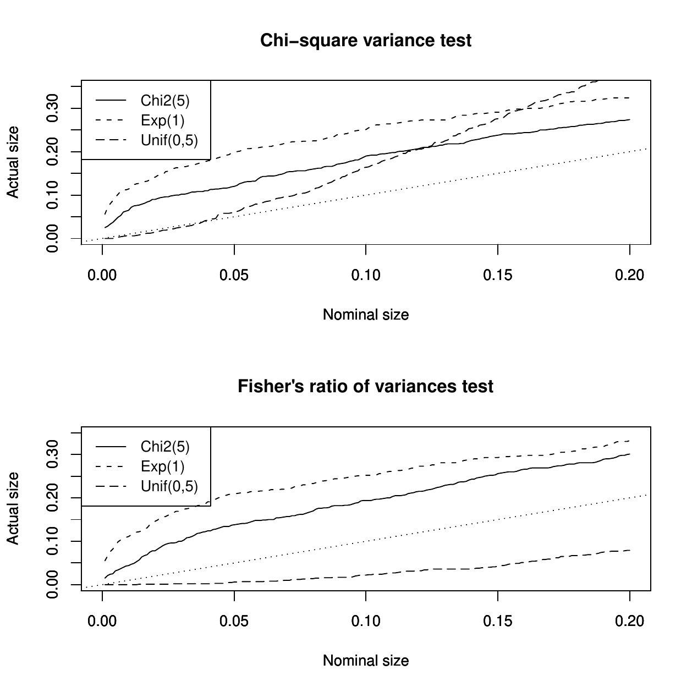

::: article
# Introduction

It is sometimes desirable to compare two variances rather than two
averages. To cite a few examples ([@R:Dean+Illowsky:2009]): college
administrators would like two college professors grading exams to have
the same variation in their grading; in order for a lid to fit a
container, the variation in the lid and the container should be the
same; a supermarket might be interested in the variability of check-out
times for two checkers.

Now usually, a first course on statistical inference presents mean tests
in both Gaussian and asymptotical frameworks (Table [1](#table:1)), but
variance tests are often presented only in the Gaussian case (Table
[2](#table:2)).

::: {#table:1}
  ------------------------------------------------------------------------------------------------------------------------------------
    Population law                                              Test statistic                                     Law
  ------------------ ---------------------- ------------------------------------------------------ -----------------------------------
       Gaussian        $\sigma^{2}$ known    $\dfrac{\overline{Y}_n -\mu_{ref}}{\sigma/\sqrt{n}}$          $\mathcal{N}(0,1)$

         2-4          $\sigma^{2}$ unknown   $\dfrac{\overline{Y}_n -\mu_{ref}}{S_{n}/\sqrt{n}}$                $t(n-1)$

   Unknown $(n>30)$    $\sigma^{2}$ known    $\dfrac{\overline{Y}_n-\mu_{ref}}{\sigma/\sqrt{n}}$    $\approx\mathcal{N}(0,1)$ asympt.

         2-4          $\sigma^{2}$ unknown   $\dfrac{\overline{Y}_n -\mu_{ref}}{S_{n/\sqrt{n}}}$    $\approx\mathcal{N}(0,1)$ asympt.
  ------------------------------------------------------------------------------------------------------------------------------------

  : Table 1: Testing $H_0:\mu=\mu_{ref}$ for both the Gaussian and large
  sample cases.
:::

::: {#table:2}
  -------------------------------------------------------
          Test statistic                    Law
  ------------------------------- -----------------------
   $(n-1)S_n^2/\sigma_{ref}^{2}$     $\chi^2_{(n-1)}$

          $S_1^2/S_2^{2}$          $F_{(n_1-1,n_{2}-1)}$
  -------------------------------------------------------

  : Table 2: Testing $H_0:\sigma^2=\sigma_{ref}^2$ or
  $H_0:\sigma_1^2=\sigma_2^2$ for the Gaussian case ($\sigma^2$,
  $\sigma_1^2$, $\sigma_2^2$ unknown; $\sigma_{ref}^2$ known).
:::

An important point to be noticed is that students are usually told that
mean tests are robust to non-normality for large samples as indicated by
the asymptotic $\mathcal{N}(0,1)$ distribution in the last two cells of
Table [1](#table:1) (see e.g. @R:Ozgur+Strasser:2004). They could think
that this also occurs for variance tests. Indeed, many practitioners use
the classical chi-square single variance test or Fisher's two variances
test, even if the Gaussian assumption fails. This could lead to heavy
errors, **even for large samples**, as shown in Figure
[1](#figure:histos). @R:Miller:1997 [p. 264] describes this situation as
\"catastrophic\".

<figure id="figure:histos">



<figcaption>Figure 1: P-value Plots (see ) under $H_0$ of m = 10000
replications of test statistics of the chi-square variance test (top)
and Fisher’s ratio of variances test (bottom) in the large sample
Gaussian context. The parameters of the simulation are: n = $n_1$ = $n_2$ =
500, $Y \stackrel{d}{=} Y_1 \stackrel{d}{=} Y_2\sim\chi^2(5)$ (resp.
$\mathcal{E}(1)$, resp. $\mathcal{U}[0,5]$). The dotted lines are $45^\circ$
lines.</figcaption>
</figure>

To have a better idea of the type I error in the classical single
variance test, let us test for example $H_0:\sigma^2=1$ versus
$H_1:\sigma^2<1$, by simulating 10000 samples of size 1000 from an
$\mathcal{E}(1)$ distribution (i.e. under $H_0$) and using $\alpha=5\%$.
We obtained a percentage of rejection of the null of $21.53\%$, thus
showing a type I error far greater than $\alpha$. The percentage for the
asymptotic test (described later) is $9.05\%$ which is not too far from
$\alpha$. For a $\mathcal{U}([0,5])$, the classical single variance test
leads to a type I error far lesser than $\alpha$ ($0.44\%$). Our test
still behaves correctly with a type I error near $\alpha$ ($5.39\%$).
This is mainly due to the departure of the kurtosis of the distribution
from 3 (for more theoretical details see *e.g.* Section 2.2 of
@R:Coeurjolly+Drouilhet+LafayedeMicheaux+Robineau:2009).

Note that the problem of the robustness (to departures from normality)
of tests for comparing two (or more) variances has been widely treated
in the literature, see e.g. @R:Box:1953,
@R:Conover+Johnson+Johnson:1981, @R:Tiku+Akkaya:2004, @R:Pan:1999 and
the references therein. These authors built specific test statistics.
Note also that in the one sample (non Gaussian) case, to the best of our
knowledge, no statistical tool is available to compare a population
variance to a reference value.

Now, it is well-known, see e.g. @R:Casella+Berger:2001 [p. 492], that a
common method for constructing a large sample test statistic may be
based on an estimator that has an asymptotic normal distribution.
Suppose we wish to test a hypothesis about a parameter $\theta$, and
$\hat{\theta}_n$ is some estimator of $\theta$ based on a sample of size
$n$. If we can prove some form of the central limit theorem to show
that, as $n\rightarrow+\infty$,
$$\label{eq:TCL}
(\hat{\theta} - \theta)/\hat{\sigma}_{\hat{\theta}}\stackrel{d}{\rightarrow}\mathcal{N}(0,1)  (\#eq:TCL)  $$
where $\hat{\sigma}_{\hat{\theta}}$ is the usual standard error, which
is a convergent (in probability) estimate of
$\sigma_{\hat{\theta}}=\sqrt{Var(\hat{\theta}_n)}$, then one has the
basis for an approximate test.

This approach can be used to complete Table 2 for the large sample case,
shown in Table [3](#table:3) for the single variance test only:

::: {#table:3}
  -----------------------------------------------------------------------------------------------------------------------------------------------------------------
                    Population law                                                 Test statistic                                               Law
  --------------------------------------------------- ------------------------------------------------------------------------- -----------------------------------
   Unknown $(n$ large$)$ with finite $4^{th}$ moment   $\dfrac{S_n^{2^{}}-\sigma_{ref}^2}{\hat{\sigma}_{S_{n\vphantom{g}}^2}}$   $\approx\mathcal{N}(0,1)$ asympt.

  -----------------------------------------------------------------------------------------------------------------------------------------------------------------

  : Table 3: Testing $H_0:\sigma^2=\sigma_{ref}^2$ for the large sample
  case. We let
  $\hat{\sigma}_{S_n^2}^2=\frac{1}{n(n-1)}\sum_{i=1}^n((y_i-\overline{Y}_n)^2-S_n^2)^2$.
:::

The case of a (large sample) test for a difference in scale parameters
(possibly weighted by a factor $\rho$) is also of interest as suggested
by the availability of related procedures in R (to compute
Ansari-Bradley's and Mood's tests for example). The standard error
involved in this test is
$\hat{\sigma}_{\hat{\theta}}=\sqrt{\hat{\sigma}_{S_{n_1}^2}^2+\rho^2\hat{\sigma}_{S_{n_2}^2}^2}$.

The point to be noted here is that this general approach has been
extensively used in
@R:Coeurjolly+Drouilhet+LafayedeMicheaux+Robineau:2009 where we end up
with a unified approach very similar to the classical t-test from a
mathematical point of view. Proofs, which are not very complicated, are
provided in the report just cited. The details are not fully expounded
here but lead us to propose a more complete, homogeneous teaching
framework, with no additional difficulty, to test various parameters
such as the mean, the variance, and the difference or ratio of means or
variances (for large samples). This approach also allows the direct
derivation of asymptotic confidence intervals. Note that @R:Bonnet:2006a
and @R:Bonnet:2006b use a similar asymptotic approach, with a refinement
based on a variance stabilizing transformation, to obtain asymptotic
confidence intervals, solely for the single variance and ratio of
variances cases. Table [4](#table:4) gives a summary of the various
parameters we can test and the R functions we have implemented to
compute the standard error $\hat{\sigma}_{\hat{\theta}}$ of
$\hat{\theta}$:\

::: {#table:4}
  --------------------------------------------------------------------------------------------------------------------------------
                               $\theta$                               Dataset(s)   $\hat{\sigma}_{\hat{\theta}\vphantom{g}}$ in R
  ------------------------------------------------------------------ ------------ ------------------------------------------------
                                $\mu$                                    `y`                        `seMean(y)`

                        $\sigma^{2^{\text{}}}$                           `y`                         `seVar(y)`

                     $d_{\mu_{}}=\mu_1-\rho\mu_2$                      `y1, y2`                 `seDMean(y1,y2,rho)`

   $d_{\sigma\vphantom{g}^2}=\sigma_1^2-\rho\sigma_2^{2^{\text{}}}$    `y1, y2`                 `seDVar(y1,y2,rho)`

                       $r_{\mu_{}}=\mu_1/\mu_2$                        `y1, y2`                   `seRMean(y1,y2)`

     $r_{\sigma\vphantom{g}^2}=\sigma_1^2/\sigma_2^{2^{\text{}}}$      `y1, y2`                   `seRVar(y1,y2)`
  --------------------------------------------------------------------------------------------------------------------------------

  : Table 4: Various parameters we can test and available R functions to
  compute standard error $\hat{\sigma}_{\hat{\theta}}$.
:::

::: center
::: {#table:5}
  ------ ---------------------------- -------- ------------------------- -------- -------------------------------- --------
         $\mathcal{E}^{\text{}}(1)$            $\chi^{2^{\text{}}}(5)$            $\mathcal{U}^{\text{}}([0,5])$   

  n      $\chi^2$                     asymp.   $\chi^2$                  asymp.   $\chi^2$                         asymp.

  30     0.2168                       0.2733   0.1278                    0.2218   0.0086                           0.0801

  100    0.2194                       0.1765   0.1307                    0.1442   0.0061                           0.0589

  500    0.2157                       0.1102   0.1367                    0.0928   0.0051                           0.0543

  1000   0.2153                       0.0905   0.1323                    0.0787   0.0040                           0.0539
  ------ ---------------------------- -------- ------------------------- -------- -------------------------------- --------

  : Table 5: Type I error in terms of $n$ for the test $H_1:
    \sigma^2<\sigma_{ref}^2$ with $\sigma_{ref}^2=1$ ($\mathcal{E}(1)$),
  $10$ ($\chi^2(5)$), $25/12$ ($\mathcal{U}([0,5])$) based on $m=10000$
  replications.
:::
:::

These functions can be used in conjunction with (equation \@ref(eq:TCL))
to obtain p-values for various tests. For a simple example, if you want
to use a sample contained in the vector `y` to test $H_0: \sigma^2=1$,
you can use

``` r
2*pnorm(-abs((var(y)-1)/seVar(y)))
```

This contribution also solves the problem of providing an implemented
"robust" (to departure of the i.i.d. large sample distribution from
normality) alternative to the chi-square single variance test for large
samples. Indeed, we did not find any such procedure in standard
statistical software and so it is highly likely that practitioners would
incorrectly use a chi-square test on a single variance. It also provides
a very simple alternative to the (ratio of variances) Fisher test in
large samples. Some other "robust" alternative procedures to the Fisher
test in the case of non Gaussian (not necessary large) samples are
implemented in R: the Bartlett test (`bartlett.test`), the Fligner test
(`fligner.test`) and the Levene test (`levene.test` available in the
`lawstat` package). R also provides, through `ansari.test` and
`mood.test` functions, Ansari-Bradley's and Mood's two-sample rank-based
tests for a difference in scale parameters. The purpose of this paper is
not to compare our tests to their competitors in terms of power. We
nevertheless conduct two short simulation studies (limited to the
probability of Type I error): first for the problem of testing a
variance (Table [5](#table:5)), comparing the classical $\chi^2$ single
variance test to our procedure, and second for the problem of comparing
(the differences $d_{\sigma^2}$ of) two variances (Tables [6](#table:6),
[7](#table:7) and [8](#table:8)), comparing the classical Fisher test to
our procedure, as well as Ansari-Bradley's test and Mood's test. These
simulations were based on the three distributions used earlier in Figure
[1](#figure:histos). The simulations show that the level $\alpha$ is
quite correct (when $n$ increases) for our procedure in the case of
testing a single variance and for all three alternative tests (ours,
Ansari-Bradley's and Mood's tests) for testing two variances.

::: {#table:6}
  ------ ---------------------------- ----------- -------- --------
         $\mathcal{E}^{\text{}}(1)$                        

  $n$    $\mathcal{F}$                asympTest   Ansari   Mood

  30     0.2827                       0.0675      0.0478   0.0497

  100    0.3083                       0.0500      0.0480   0.0484

  500    0.3269                       0.0454      0.0484   0.0470

  1000   0.3260                       0.0526      0.0501   0.0515
  ------ ---------------------------- ----------- -------- --------

  : Table 6: Type I error for the test
  $H_1: \sigma_1^2 \neq\sigma_{2}^2$ in terms of $n$ for $m=10000$
  replications of the distribution $\mathcal{E}(1)$.
:::

::: {#table:7}
  ------ ------------------------- ----------- -------- --------
         $\chi^{2^{\text{}}}(5)$                        

  $n$    $\mathcal{F}$             asympTest   Ansari   Mood

  30     0.1605                    0.0676      0.0477   0.0472

  100    0.1797                    0.0537      0.0516   0.0494

  500    0.1911                    0.0525      0.0505   0.0498

  1000   0.1907                    0.0526      0.0503   0.0511
  ------ ------------------------- ----------- -------- --------

  : Table 7: Type I error for the test
  $H_1: \sigma_1^2 \neq\sigma_{2}^2$ in terms of $n$ for $m=10000$
  replications of the distribution $\chi^2(5)$.
:::

::: {#table:8}
  ------ -------------------------------- ----------- -------- --------
         $\mathcal{U}^{\text{}}([0,5])$                        

  $n$    $\mathcal{F}$                    asympTest   Ansari   Mood

  30     0.0029                           0.0652      0.0490   0.0494

  100    0.0021                           0.0527      0.0490   0.0475

  500    0.0024                           0.0520      0.0511   0.0511

  1000   0.0022                           0.0539      0.0528   0.0538
  ------ -------------------------------- ----------- -------- --------

  : Table 8: Type I error for the test
  $H_1: \sigma_1^2 \neq\sigma_{2}^2$ in terms of $n$ for $m=10000$
  replications of the distribution $\mathcal{U}([0,5])$.
:::

# Using asympTest

The R package
[*asympTest*](https://CRAN.R-project.org/package=asympTest) consists of
a main function `asymp.test` and six auxiliary ones designed to compute
standard errors of estimates of different parameters, see Table
[4](#table:4). The auxiliary functions will not be the most useful ones
for the user, except if he/she wants to compute the confidence interval
himself/herself. The function `asymp.test` has been written in the same
spirit as the standard R functions `t.test` or `var.test`. The arguments
of `asymp.test` and the resulting outputs are also inspired from these
functions. In particular, the function `asympt.test` returns an object
of class \"htest\" (which is the general class of test objects in R).

This `asymp.test` function has several arguments, similar to those of
the `t.test` function, whose description can be obtained using the
command `?asymp.test`.

In order to illustrate this function, let us consider the Digitalis
Investigation Group NHLBI Teaching data set
(<https://biolincc.nhlbi.nih.gov/teaching/>) which was made available by
the NHLBI. Note that statistical processes such as permutations within
treatment groups were used to completely anonymize the data; therefore,
inferences derived from the teaching dataset may not be valid.

The DIG Trial was a randomized, double-blind, multicenter trial with
more than 300 centers in the United States and Canada participating. The
purpose of the trial was to examine the safety and efficacy of Digoxin
in treating patients with congestive heart failure in sinus rhythm.

Diastolic BP (`DIABP`, mmHg) is a known risk factor of cardiovascular
diseases. In this case, it is desirable to compare the variability of
this quantity for placebo (`TRTMT=0`) and treatment (`TRTMT=1`) groups,
respectively.

## Reading of the data

``` r
> require(asympTest)
>
> data(DIGdata) 
> attach(DIGdata)
> x <- na.omit(DIABP[TRTMT==0])
> y <- na.omit(DIABP[TRTMT==1])
> c(length(x),length(y))
[1] 3400 3395
```

## Comparing the two variances

Shapiro-Wilk normality test performed by the function `shapiro.test()`
indicates that the two samples seem to be far from the Gaussian
distribution. Thus, this should prevent us from using the following
Fisher test.

``` r
> var.test(DIABP ~ TRTMT, data = DIGdata,
+    na.action = na.omit)

        F test to compare two variances

data:  x and y
F = 0.9295, num df = 3399, denom df = 3394
p-value = 0.03328
alternative hypothesis: 
   true ratio of variances is not equal to 1
95 percent confidence interval:
 0.8690651 0.9942238
sample estimates:
ratio of variances
          0.929541
```

Instead, let us use our package.

``` r
> asymp.test(DIABP ~ TRTMT, data = DIGdata,
+    na.action = na.omit, parameter = "dVar")

Two-sample asymptotic diff. of variances test

data:  DIABP by TRTMT
statistic = -1.5272, p-value = 0.1267
alternative hypothesis: 
  true diff. of variances is not equal to 0
95 percent confidence interval:
 -21.160491   2.626127
sample estimates:
difference of variances
              -9.267182
```

We can see that `var.test`, not to be used due to the unlikely normality
of the data, significantly shows a difference in variances (at a 5%
level). We don't obtain the same conclusion with our test.

We can also place ourselves in a fictitious case by generating a sample
`x` from a $\mathcal{U}(0;\sqrt{12})$ (i.e. with a true population
variance $\sigma^2=1$). We then apply both our test and the classical
chi-square test to show $H_1:\sigma^2>\sigma_{ref}^2=0.97$.

``` r
> n <- 1000
> x <- runif(n, max = sqrt(12))
> asymp.test(x, par = "var", alt = "gr", 
+    ref = 0.97)

        One-sample asymptotic variance test

data:  x
statistic = 1.753, p-value = 0.0398
alternative hypothesis: 
         true variance is greater than 0.97
95 percent confidence interval:
 0.9731491       Inf
sample estimates:
variance
1.021055
> chisq.stat <- (n-1)*var(x)/0.97
> pchisq(chisq.stat, n-1, lower.tail = F)
[1] 0.1207650
```

For the above generated sample `x`, we respectively found the following
p-values: 0.0398 and 0.120. In this case, we can thus see that our
proposition correctly accepts $H_1$ (at the 5% level) but not the
chi-square single variance test.

# Conclusion

This paper has introduced a new package called
[*asympTest*](https://CRAN.R-project.org/package=asympTest). This is a
contribution to the many R procedures available. It is interesting
firstly in the fact that it provides a unified teaching framework to
present classical parametric tests (based on the Central Limit Theorem).
These tests are made readily available in R through an easy to use
function called `asymp.test`. This function resembles `t.test` or
`var.test`, so students will not be confused. Secondly, it also makes
available in R a robust (to non-normality) alternative to the classical
chi-square single variance test. In the future, we also plan to provide
tools similar to the `power.t.test` function in the context of large
samples.


:::
