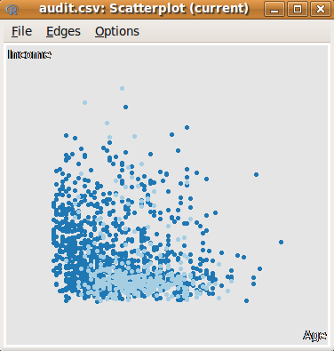
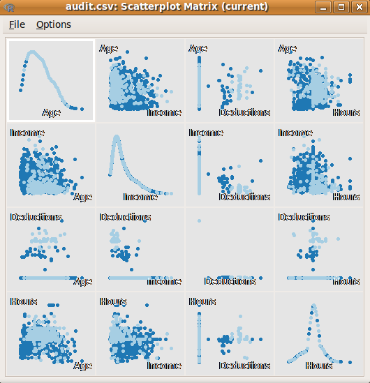

::: article
# Introduction

Data mining combines concepts, tools, and algorithms from machine
learning and statistics for the analysis of very large datasets, so as
to gain insights, understanding, and actionable knowledge.

Closed source data mining products have facilitated the uptake of data
mining in many organisations. These products offer off-the-shelf
ease-of-use that makes them attractive to the many new data miners in a
market place desperately seeking high levels of analytical skills.

R is ideally suited to the many challenging tasks associated with data
mining. R offers a breadth and depth in statistical computing beyond
what is available in commercial closed source products. Yet R remains,
primarily, a programming language for the highly skilled statistician,
and out of the reach of many.

[Rattle](http://rattle.togaware.com) (the R Analytical Tool To Learn
Easily) is a graphical data mining application written in and providing
a pathway into R [@williams:2009:rattle]. It has been developed
specifically to ease the transition from basic data mining, as
necessarily offered by GUIs, to sophisticated data analyses using a
powerful statistical language.

Rattle brings together a multitude of R packages that are essential for
the data miner but often not easy for the novice to use. An
understanding of R is not required in order to get started with
Rattle---this will gradually grow as we add sophistication to our data
mining. Rattle's user interface provides an entree into the power of R
as a data mining tool.

Rattle is used for teaching data mining at numerous universities and is
in daily use by consultants and data mining teams world wide. It is also
available as a product within [Information Builders'
WebFocus](http://www.ibi.com) business intelligence suite as RStat.

Rattle is one of several open source data mining tools
[@chen.williams.xu:2007:pakdd07_open_source]. Many of these tools are
also directly available within R (and hence Rattle) through packages
like [*RWeka*](http://cran.r-project.org/package=RWeka)
[@hornik.buchta.zeileis:2009:rweka] and
[*arules*](https://CRAN.R-project.org/package=arules)
[@hahsler.gruen.hronik:2005:arules].

# Implementation

Rattle uses the [Gnome](http://www.gnome.org) graphical user interface
as provided through the
[*RGtk2*](http://cran.r-project.org/package=RGtk2) package
[@lawrence.lang:2006:rgtk2]. It runs under various operating systems,
including GNU/Linux, Macintosh OS/X, and MS/Windows.

The GUI itself has been developed using the
[Glade](http://glade.gnome.org/) interactive interface builder. This
produces a programming-language-independent XML description of the
layout of the widgets that make up the user interface. The XML file is
then simply loaded by an application and the GUI is rendered!

Glade allows the developer to freely choose to implement the
functionality (i.e., the widget callbacks) in a programming language of
choice, and for Rattle that is R. It is interesting to note that the
first implementation of Rattle actually used Python for implementing the
callbacks and R for the statistics, using
[*rpy*](http://rpy.sourceforge.net/). The release of
[*RGtk2*](https://CRAN.R-project.org/package=RGtk2) allowed the
interface elements of Rattle to be written directly in R so that Rattle
is a fully R-based application.

Underneath, Rattle relies upon an extensive collection of R packages.
This is a testament to the power of R---it delivers a breadth and depth
of statistical analysis that is hard to find anywhere else. Some of the
packages underlying Rattle include
[*ada*](http://cran.r-project.org/package=ada),
[*arules*](http://cran.r-project.org/package=arules),
[*doBy*](http://cran.r-project.org/package=doBy),
[*ellipse*](http://cran.r-project.org/package=ellipse),
[*fBasics*](http://cran.r-project.org/package=fBasics),
[*fpc*](http://cran.r-project.org/package=fpc),
[*gplots*](http://cran.r-project.org/package=gplots),
[*Hmisc*](http://cran.r-project.org/package=Hmisc),
[*kernlab*](http://cran.r-project.org/package=kernlab),
[*mice*](http://cran.r-project.org/package=mice),
[*network*](http://cran.r-project.org/package=network),
[*party*](http://cran.r-project.org/package=party),
[*playwith*](http://cran.r-project.org/package=playwith),
[*pmml*](http://cran.r-project.org/package=pmml),
[*randomForest*](http://cran.r-project.org/package=randomForest),
[*reshape*](http://cran.r-project.org/package=reshape),
[*rggobi*](http://cran.r-project.org/package=rggobi),
[*RGtk2*](http://cran.r-project.org/package=RGtk2),
[*ROCR*](http://cran.r-project.org/package=ROCR),
[*RODBC*](http://cran.r-project.org/package=RODBC), and
[*rpart*](http://cran.r-project.org/package=rpart). These packages are
all available from the Comprehensive R Archive Network
([CRAN](http://cran.r-project.org/)). If a package is not installed but
we ask through Rattle for some functionality provided by that package,
Rattle will popup a message indicating that the package needs to be
installed.

Rattle is not only an interface though. Additional functionality that is
desired by a data miner has been written for use in Rattle, and is
available from the [*rattle*](http://cran.r-project.org/package=rattle)
package without using the Rattle GUI. The
[*pmml*](http://cran.r-project.org/package=pmml) package
[@guazzelli_etal:2009:pmml] is an offshoot of the development of Rattle
and supports the export of models from Rattle using the open standard
XML based PMML, or Predictive Model Markup Language [@dmg:2008:pmml].
Models exported from R in this way can be imported into tools like the
[ADAPA](http://www.zementis.com/) decision engine running on cloud
computers, [Teradata's Warehouse Miner](http://www.teradata.com) for
deployment as SQL over a very large database, and [Information Builder's
WebFocus](http://www.ibi.com) which handles data sourcing, preparation,
and reporting, and is able to transform Rattle generated PMML models
into C code to run on over 30 platforms.

# Installation

The Gnome and Glade libraries need to be installed (separately to R) to
run Rattle. On GNU/Linux and Mac/OSX this is usually a simple package
installation. Specifically, for [Debian](http://www.debian.org) or
[Ubuntu](http://www.ubuntu.com) we install packages like *gnome* and
*glade-3*. For MS/Windows the self-installing libraries can be obtained
from <http://downloads.sourceforge.net/gladewin32>. Full instructions
are available from <http://rattle.togaware.com>.

After installing the required libraries be sure to restart the R console
to ensure R can find the new libraries.

Assuming R is installed we can then install the
[*RGtk2*](https://CRAN.R-project.org/package=RGtk2) and
[*rattle*](https://CRAN.R-project.org/package=rattle) packages with:

``` r
> install.packages("RGtk2")
> install.packages("rattle")
```

Once installed we simply start Rattle by loading the
[*rattle*](https://CRAN.R-project.org/package=rattle) package and then
evaluating the `rattle()` function:

``` r
> library(rattle)
```

``` r
Rattle: Graphical interface for data mining in R.
Version 2.5.0 Copyright (C) 2006-2009 Togaware.
Type 'rattle()' to shake, rattle, & roll your data.
```

``` r
> rattle()
```

Rattle will pop up a window similar to that in
Figure [1](#fig:rattle_startup).

The latest development version of Rattle is always available from
Togaware:

``` r
> install.packages("rattle", 
+     repos = "http://rattle.togaware.com")
```

{#fig:rattle_startup width="100%"
alt="graphic without alt text"}

# Data Mining

Rattle specifically uses a simple tab-based concept for the user
interface (Figure [1](#fig:rattle_startup)), capturing a work flow
through the data mining process with a tab for each stage. A typical
work flow progresses from the left most tab (the **Data** tab) to the
right most tab (the **Log** tab). For any tab the idea is for the user
to configure the available options and then to click the **Execute**
button (or `F2`) to perform the appropriate task. The status bar at the
base of the window will indicate when the action is complete.

We can illustrate a very simple, if unrealistic, run through Rattle to
build a data mining model with just four mouse clicks. Start up R, load
the [*rattle*](https://CRAN.R-project.org/package=rattle) package, and
issue the `rattle()` command. Then:

1.  Click on the **Execute** button;

2.  Click on **Yes** within the resulting popup;

3.  Click on the **Model** tab;

4.  Click on the **Execute** button.

Now we have a decision tree built from a sample classification dataset.

With only one or two more clicks, alternative models can be built. A few
more clicks will have an evaluation chart displayed to compare the
performance of the models constructed. Then a click or two more will
have the models applied to score a new dataset.

Of course, there is much more to modelling and data mining than simply
building a tree model. This simple example provides a flavour of the
interface provided by Rattle.

The common work flow for a data mining project can be summarised as:

1.  Load a **Data**set and select variables;

2.  **Explore** the data to understand distributions;

3.  **Test** distributions;

4.  **Transform** the data to suit the modelling;

5.  Build **Model**s;

6.  **Evaluate** models and score datasets;

7.  Review the **Log** of the data mining process.

The underlying R code, constructed and executed by Rattle, is recorded
in the **Log** tab, together with instructive comments. This allows the
user to review the actual R commands. The R code snippets can also be
copied as text (or **Export**ed to file) from the **Log** tab and pasted
into the R console and executed. This allows Rattle to be deployed for
basic tasks, yet still access the full power of R as needed (e.g., to
fine-tune modelling options that are not exposed in the interface).

The use of Sweave [@leisch:2002:sweave] to allow LaTeX markup as the
format of the contents of the log is experimental but will introduce the
concept of literate data mining. The data miner will document their
activity, as they proceed through Rattle, by editing the log which is
also automatically populated as the modelling proceeds. Simple and
automatic processing can then turn the log into a formatted report that
also embodies the actual code, which may also be run so as to replicate
the activity.

Using the related Tangle processor allows the log to be exported as an R
script file, to record the actions taken. The script can then be
independently run at a later time (or pasted into the R console).

Repeatability and reproducibility are important in both scientific
research and commercial practice.

# Data

If no dataset has been supplied to Rattle and we click the **Execute**
button (e.g., startup Rattle and immediately click **Execute**) we are
given the option to load one of Rattle's sample datasets from a CSV
file.

Rattle can load data from various sources. It directly supports CSV
(comma separated data), TXT (tab separated data), ARFF (a common data
mining dataset format [@witten.frank:2005:weka] which adds type
information to a CSV file), and ODBC connections (allowing connection to
many data sources including MySQL, SQLite, Postgress, MS/Excel,
MS/Access, SQL Server, Oracle, IBM DB2, Netezza, and Teradata). R data
frames attached to the current R session, and datasets available from
the packages installed in the R libraries, are also available through
the Rattle interface.

To explore the use of Rattle as a data mining tool we consider the
sample `audit` dataset provided by the
[*rattle*](https://CRAN.R-project.org/package=rattle) package. The data
is artificial, but reflects a real world dataset used for reviewing the
outcomes of historic financial audits. Picture, for example, a revenue
authority collecting taxes based on information supplied by the tax
payer. Thousands of random audits might be performed and the outcomes
indicate whether an adjustment to the supplied information was required,
resulting in a change to the taxpayer's liability.

The audit dataset is supplied as both an R dataset and as a CSV file.
The dataset consists of 2,000 fictional tax payers who have been audited
for tax compliance. For each case an outcome after the audit is recorded
(whether the financial claims had to be adjusted or not). The actual
dollar amount of adjustment that resulted is also recorded (noting that
adjustments can go in either direction).

The audit dataset contains 13 variables (or columns), with the first
being a unique client identifier.

When loading data into Rattle certain special prefixes to variable names
can be used to identify default variable roles. For example, if the
variable name starts with `ID_` then the variable is marked as having a
role as an identifier. Other prefixes include `IGNORE_`, `RISK_`, `IMP_`
(for imputed) and `TARGET_`. Examples from the audit data include
`IGNORE_Accounts` and `TARGET_Adjusted`.

The CSV option of the **Data** tab provides the simplest approach to
loading data into Rattle. If the **Data** tab is **Execute**d with no
CSV file name specified then Rattle offers the option to load a sample
dataset. Clicking on the **Filename** box will then list other available
sample datasets, including `audit.csv`.

Once Rattle loads a dataset the text window will contain the list of
available variables and their default roles (as in
Figure [2](#fig:rattle_startup_audit)).

{#fig:rattle_startup_audit
width="100%" alt="graphic without alt text"}

By default, most variables have a role of **Input** for modelling. We
may want to identify one variable as the **Target** variable, and
optionally identify another variable as a **Risk** variable (which is a
measure of the size of the "targets"). Other roles include **Ident** and
**Ignore**.

Rattle uses simple heuristics to guess at roles, particularly for the
target and ignored variables. For, example, any numeric variable that
has a unique value for each observation is automatically identified as
an identifier.

Rattle will, by default, partition the dataset into a training and a
test dataset. This kind of sampling is useful for exploratory purposes
when the data is quite large. Its primary purpose, though, is to select
a 70% sample for training of models, providing a 30% set for testing.

# Explore

Exploratory data analysis is important in understanding our data. The
**Explore** tab provides numerous numeric and graphic tools for
exploring data. Once again, there is a considerable reliance on many
other R packages.

## Summary

The **Summary** option uses R's `summary` command to provide a basic
univariate summary. This is augmented with the `contents` and `describe`
commands from the [*Hmisc*](https://CRAN.R-project.org/package=Hmisc)
package [@harrell:2009:hmisc]. Extended summaries include additional
statistics provided by the
[*fBasics*](https://CRAN.R-project.org/package=fBasics) package
[@fbasics], kurtosis and skewness, as well as a summary of missing
values using the missing value functionality from the
[*mice*](https://CRAN.R-project.org/package=mice) package [@mice].

## Distributions

The **Distributions** option provides access to numerous plot types. It
is always a good idea to review the distributions of the values of each
of the variables before we consider data mining. While the above
summaries help, the visual explorations can often be quite
revealing [@cook.swayne:2007:rggobi].

A vast array of tools are available within R for presenting data
visually and the topic is covered in detail in many books
including @cleveland:1993:visual_data. Rattle provides a simple
interface to the underlying functionality in R for drawing some common
plots. The current implementation primarily relies on the base graphics
provided by R, but may migrate to the more sophisticated
[*lattice*](http://cran.r-project.org/package=lattice) [@lattice] or
[*ggplot2*](http://cran.r-project.org/package=ggplot2) [@ggplot2].

Some of the canned plots are illustrated in Figure [3](#fig:multi).
Clockwise we can see a box plot, a histogram, a mosaic plot, and a
Benford's Law plot. Having identified a target variable (in the **Data**
tab) the plots include the distributions for each subset of observations
associated with each value of the target variable, wherever this makes
sense to do so.

## GGobi and Latticist

Rattle provides access to two sophisticated tools for interactive
graphical data analysis: GGobi and Latticist.

The GGobi [@cook.swayne:2007:rggobi] visualisation tool is accessed
through the [*rggobi*](https://CRAN.R-project.org/package=rggobi)
package [@wickham.etal:2008:intro_rggobi]. GGobi will need to be
installed on the system separately, and runs under GNU/Linux, OS/X, and
MS/Windows. It is available for download from <http://www.ggobi.org/>.

Ggobi is useful for exploring high-dimensional data through highly
dynamic and interactive graphics, especially with tours, scatterplots,
barcharts and parallel coordinate plots. The plots are interactive and
linked with brushing and identification. The available functionality is
extensive, and supports panning, zooming and rotations.

{#fig:multi
width="100%" alt="graphic without alt text"}

Figure [4](#fig:ggobi) displays a scatterplot of Age versus Income
(left) and a scatterplot matrix across four variables at the one time
(right). Brushing is used to distinguish the class of each observation.

<figure id="fig:ggobi">
<p>       </p>
<figcaption>Figure 4: Example of GGobi using <a
href="https://CRAN.R-project.org/package=rggobi"><em>rggobi</em></a> to
connect.</figcaption>
</figure>

A more recent addition to the R suite of packages are the
[*latticist*](https://CRAN.R-project.org/package=latticist) and
[*playwith*](https://CRAN.R-project.org/package=playwith) packages
[@andrews:2008:latticist] which employ
[*lattice*](https://CRAN.R-project.org/package=lattice) graphics within
a graphical interface to interactively explore data. The tool supports
various plots, data selection and sub-setting, and support for brushing
and annotations. Figure [5](#fig:latticist_audit) illustrates the
default display when initiated from Rattle.

# Test

The **Test** tab provides access to a number of parametric and
non-parametric statistical tests of distributions. This more recent
addition to Rattle continues to receive attention (and hence will change
over time). In the context of data mining often applied to the binary
classification problem, the current tests are primarily two sample
statistical tests.

{#fig:latticist_audit width="100%"
alt="graphic without alt text"}

Tests of data distribution include the Kolomogorov-Smirnov and Wilcoxon
Signed Rank tests. For testing the location of the average the T-test
and Wilcoxon Rank-Sum tests are provided. The F-test and Pearson's
correlation are also available.

# Transform

Cleaning data and creating new features (derived variables) occupies
much time for a data miner. There are many approaches to data cleaning,
and a programming language like R supports them all. Rattle's
**Transform** tab (Figure [6](#fig:rescale-income)) provides a number of
the common options for transforming, including rescaling, skewness
reduction, imputing missing values, turning numeric variables into
categorical variables, and vice versa, dealing with outliers, and
removing variables or observations with missing values. We review a
number of the transforms here.

## Rescale

The **Rescale** option offers a number of rescaling operations, using
the `scale` command from base and the `rescaler` command from the
[*reshape*](https://CRAN.R-project.org/package=reshape) package
[@reshape]. Rescalings include recentering and scaling around zero
(**Recenter**), scaling to 0--1 (**Scale \[0,1\]**), converting to a
rank ordering (**Rank**), robust rescaling around zero using the median
(**-Median/MAD**), and rescaling based on groups in the data.

For any transformation the original variable is not modified. A new
variable is created with a prefix added to the variable's name to
indicate the transformation. The prefixes include `RRC_`, `R01_`,
`RRK_`, `RMD_`, and `RBG_`, respectively.

The effect of the rescaling can be examined using the **Explore** tab
(Figure [7](#fig:rattle_audit_explore_distribution_rescale_income)).
Notice that Rattle overlays bar charts with a density plot, by default.

{#fig:rescale-income
width="100%" alt="graphic without alt text"}

{#fig:rattle_audit_explore_distribution_rescale_income
width="100%" alt="graphic without alt text"}

## Impute

Imputation of missing values is a tricky topic and should only be done
with a good understanding of the data. Often, observational data (as
distinct from experimental data) will contain missing values, and this
can cause a problem for data mining algorithms. For example, the
**Forest** option (using
[*randomForest*](https://CRAN.R-project.org/package=randomForest))
silently removes any observation with any missing value! For datasets
with a very large number of variables, and a reasonable number of
missing values, this may well result in a small, unrepresentative
dataset, or even no data at all!

There are many types of imputations possible, only some of which are
directly available in Rattle. Further, Rattle does not (yet) support
multiple imputation. The pattern of missing values can be viewed using
the **Show Missing** check button of the **Summary** option of the
**Explore** tab.

The simplest, and least recommended, of imputations involves replacing
all missing values for a variable with a single value. This makes most
sense when we know that the missing values actually indicate that the
value is "0" rather than unknown. For example, in a taxation context, if
a tax payer does not provide a value for a specific type of deduction,
then we might assume that they intend it to be zero. Similarly, if the
number of children in a family is not recorded, it could be a reasonable
assumption that it is zero (but it might equally well mean that the
number is just unknown).

A common, if generally unsatisfactory, choice for missing values that
are known not to be zero is to use some "central" value of the variable.
This is often the mean, median, or mode. We might choose to use the
mean, for example, if the variable is otherwise normally distributed
(and in particular has little skewness). If the data does exhibit some
skewness though (e.g., there are a small number of very large values)
then the median might be a better choice.

Be wary of any imputation performed. It is, after all, inventing new
data! Future development of Rattle may provide more support with model
based imputation through packages like
[*Amelia*](https://CRAN.R-project.org/package=Amelia) [@amelia].

## Remap

The **Remap** option provides numerous re-mapping operations, including
binning, log transforms, ratios, and mapping categorical variables into
indicator variables for the situation where a model builder requires
numeric data. Rattle provides options to use **Quantile** binning,
**KMeans** binning, and **Equal Width** binning. For each option the
default number of bins is 4 but we can change this to suit our needs.
The generated variables are prefixed with either `BQn_`, `BKn_`, and
`BEn_` respectively, with `n` replaced with the number of bins. Thus, we
can create multiple binnings for any variable.

There are also options to **Join Categorics**---a convenient way to
stratify the dataset, based on multiple categoric variables. A **Log**
transform is also available.

# Model

Data mining algorithms are often described as being either descriptive
or predictive. Rattle currently supports the two common descriptive or
unsupervised approaches to model building: cluster analysis and
association analysis. A variety of predictive model builders are
supported: decision trees, boosting, random forests, support vector
machines, generalised linear models, and neural networks.

Predictive modelling, and generally the task of classification, is at
the heart of data mining. Rattle originally focused on the common data
mining task of binary (or two class) classification but now supports
multinomial classification and regression, as well as descriptive
models.

Rattle provides a straight-forward interface to a collection of
descriptive and predictive model builders available in R. For each, a
simple collection of tuning parameters is exposed through the graphical
interface. Where possible, Rattle attempts to present good default
values (often the same defaults as selected by the author of the
respective package) to allow the user to simply build a model with no or
little tuning. This may not always be the right approach, but is
certainly a reasonable place to start.

We will review modelling within Rattle through decision trees and random
forests.

## Decision Trees

One of the classic machine learning techniques, widely deployed in data
mining, is decision tree induction [@quinlan:1986:mlj_decision_trees].
Using a simple algorithm and a simple tree structure to represent the
model, the approach has proven to be very effective. Underneath, the
[*rpart*](https://CRAN.R-project.org/package=rpart) [@rpart] and
[*party*](https://CRAN.R-project.org/package=party) [@party] packages
are called upon to do the work.
Figure [8](#fig:rattle_audit_model_rpart_window) shows the **Model** tab
with the results of building a decision tree displayed textually (the
usual output from the `summary` command for an `"rpart"` object).

{#fig:rattle_audit_model_rpart_window
width="100%" alt="graphic without alt text"}

Rattle adds value to the basic
[*rpart*](https://CRAN.R-project.org/package=rpart) functionality with
additional displays of the decision tree, as in
Figure [9](#fig:rattle_audit_model_rpart), and the conversion of the
decision tree into a list of rules (using the **Draw** and **Rules**
buttons respectively).

{#fig:rattle_audit_model_rpart
width="70.0%" alt="graphic without alt text"}

## Ensemble

The ensemble approach has gained a lot of interest lately. Early work
[@williams:aida.1988] experimented with the idea of combining a
collection of decision trees. The results there indicated the benefit of
building multiple trees and combining them into a single model, as an
ensemble.

Recent developments continue to demonstrate the effectiveness of
ensembles in data mining through the use of the boosting and random
forest algorithms. Both are supported in rattle and we consider just the
random forest here.

## Random Forests

A [random forest](http://en.wikipedia.org/wiki/random forest) [random
forest](http://en.wikipedia.org/wiki/XnullX)
[@breiman:2001:random_forests] develops an ensemble of decision trees.
Random forests are often used when we have very large training datasets
and a very large number of input variables (hundreds or even thousands
of input variables). A random forest model is typically made up of tens
or hundreds of decision trees, each built using a random sample of the
dataset, and whilst building any one tree, a random sample of the
variables is considered at each node.

The random sampling of both the data and the variables ensures that even
building 500 decision trees can be efficient. It also reputably delivers
considerable robustness to noise, outliers, and over-fitting, when
compared to a single tree classifier.

Rattle uses the
[*randomForest*](https://CRAN.R-project.org/package=randomForest)
package [@rf] to build a forest of trees. This is an interface to the
original random forest code from the original developers of the
technique. Consequently though, the resulting trees have a different
structure to standard `"rpart"` trees, and so some of the same tree
visualisations are not readily available. Rattle can list all of the
rules generated for a random forest, if required. For complex problems
this can be a very long list indeed (thousands of rules).

The **Forest** option can also display a plot of relative variable
importance. This provides insight into which variables play the most
important role in predicting the class outputs. The **Importance**
button will display two plots showing alternative measures of the
relative importance of the variables in our dataset in relation to
predicting the class.

# Building All Models and Tuning

Empirically, the different model builders often produce models that
perform similarly, in terms of misclassification rates. Thus, it is
quite instructive to use all of the model builders over the same
dataset. The **All** option will build one model for each of the
different model builders.

We can review the performance of each of the models built and choose
that which best suits our needs. In choosing a single model we may not
necessarily choose the most accurate model. Other factors can come into
play. For example, if the simple decision tree is almost as accurate as
the 500 trees in the random forest ensemble, then we may not want to
step up to the complexity of the random forest for deployment.

An effective alternative, where explanations are not required, and
accuracy is desired, is to build a model of each type and to then build
an ensemble that is a linear combination of these models.

# Evaluate

Rattle provides a standard collection of tools for evaluating and
comparing the performance of models. This includes the error matrix (or
confusion table), lift charts, ROC curves, and Cost Curves, using, for
example, the [*ROCR*](https://CRAN.R-project.org/package=ROCR) package
[@rocr]. Figure [10](#fig:rattle_audit_evaluate_risk) shows the options.

{#fig:rattle_audit_evaluate_risk
width="100%" alt="graphic without alt text"}

A cumulative variation of the ROC curve is implemented in Rattle as Risk
charts (Figure [11](#fig:riskchart)). Risk charts are particularly
suited to binary classification tasks, which are common in data mining.
The aim is to efficiently display an easily understood measure of the
performance of the model with respect to resources available. Such
charts have been found to be more readily explainable to decision-making
executives.

A risk chart is particularly useful in the context of the `audit`
dataset, and for risk analysis tasks in general. The audit dataset has a
two class target variable as well as a so-called *risk* variable, which
is a measure of the size of the risk associated with each observation.
Observations that have no adjustment following an audit (i.e., clients
who have supplied the correct information) will of course have a risk of
zero associated with them. Observations that do have an adjustment will
usually have a risk associated with them, and for convenience we simply
identify the value of the adjustment as the magnitude of the risk.

Rattle uses the idea of a risk chart to evaluate the performance of a
model in the context of risk analysis.

{#fig:riskchart
width="58.0%" alt="graphic without alt text"}

A risk chart plots performance against caseload. Suppose we had a
population of just 100 observations (or audit cases). The case load is
the percentage of these cases that we will actually ask our auditors to
process. The remaining cases will not be considered any further,
expecting them to be low risk, and hence, with limited resources, not
requiring any action.

The decision as to what percentage of cases are actioned corresponds to
the x-axis of the risk chart---the caseload. A 100% caseload indicates
that we will action all audit cases. A 25% caseload indicates that we
will action just one quarter of all cases.

The performance is the percentage of the total number of cases that
required an adjustment (or the total risk---both are plotted if a risk
variable is identified) that might be covered in the population that we
action.

The risk chart allows the trade-off between resources and risk to be
visualised.

# Model Deployment

Once we have decided upon a model that represents acceptable improvement
to our business processes we are faced with deployment. Deployment can
range from running the model ad hoc, to a fully automated and carefully
governed deployment environment. We discuss some of the issues here and
explore how Rattle supports deployment.

## Scripting R

The simplest approach to deployment is to apply the model to a new
dataset. This is often referred to as scoring. In the context of R this
is nothing more than using the `predict` function.

Rattle's evaluation tab supports scoring with the **Score** option.
There are further options to score the training dataset, the test
dataset, or data loaded from a CSV file (which must contain the exact
same variables). Any number of models can be selected, and the results
are written to a CSV file.

Scoring is often performed some time after the model is built. In this
case the model needs to be saved for later use. The concept of a Rattle
project is useful in such a circumstance. The current state of Rattle
(including the actual data and models built during a session) can be
saved to a project, and later loaded into a new instance of Rattle
(running on the same host or even a different host and operating
system). A new dataset can then be scored using the saved model.

Underneath, saving/loading a Rattle project requires no more than using
the `save` and `load` commands of R to create a binary representation of
the R objects, and saving them to file. A Rattle project can get quite
large, particularly with large datasets.

Larger files take longer to load, and for deploying a model it is often
not necessary to keep the original data. So as we get serious about
deployment we might save just the model we wish to deploy. This is done
using the `save` function and knowing a little bit about the internals
of Rattle (but no more than what is exposed through the **Log** tab).

The approach, saving a randomForest model, might be:

``` r
> myrf <- crs$rf
> save(myrf, file = "model01_090501.RData")
```

We can then load the model at a later time and apply the model (using a
script based on the commands shown in the Rattle **Log** tab) to a new
dataset:

``` r
> library(randomForest)
> (load("model01_090501.RData"))
```

``` r
[1] "myrf"
```

``` r
> dataset <- read.csv("cases_090601.csv")
> pr <- predict(myrf, dataset, 
+     type = "prob")[, 2]
> write.csv(cbind(dataset, 
+     pr), file = "scores_090601.csv", 
+     row.names = FALSE)
> head(cbind(Actual = dataset$TARGET_Adjusted, 
+     Predicted = pr))
```

``` r
  Actual Predicted
1      0     0.022
2      0     0.034
3      0     0.002
4      1     0.802
5      1     0.782
6      0     0.158
```

As an aside, we can see the random forest model is doing okay on these
few observations.

In practise (e.g., in the Australian Taxation Office) once model
deployment has been approved the model is deployed into a secure
environment. It is scheduled regularly to be applied to new data using a
script that is very similar to that above (using the
[*littler*](http://code.google.com/p/littler/) package for GNU/Linux).
The data is obtained from a data warehouse and the results populate a
data warehouse table which is then used to automatically generate work
items for auditors to action.

## Export to PMML

An alternative approach to deployment is to export the model so that it
can be imported into other software for prediction on new data.

We have experimented with exporting random forests to C++ code. This has
been demonstrated running over millions of rows of new data in a data
warehouse in seconds.

Exporting to a variety of different languages, such as C++, is not an
efficient approach to exporting models. Instead, exporting to a standard
representation, which other software can also export, makes more sense.
This standard representation can then be exported to a variety of other
languages.

The Predictive Model Markup Language [@dmg:2008:pmml] provides such a
standard language for representing data mining models. PMML is an XML
based standard that is supported, to some extent, by the major
commercial data mining vendors and many open source data mining tools.

The [*pmml*](https://CRAN.R-project.org/package=pmml) package for R was
separated from the [*rattle*](https://CRAN.R-project.org/package=rattle)
package to allow its independent development with contributions from a
broader community. PMML models generated by Rattle, using the
[*pmml*](https://CRAN.R-project.org/package=pmml) package, can be
imported into a number of other products, including Teradata Warehouse
Miner (which converts models to SQL for execution), Information
Builders' WebFocus (which converts models to C code for execution on
over 30 platforms), and Zementis' [ADAPA](http://www.zementis.com/) tool
for online execution.

The **Export** button (whilst displaying a model within the **Model**
tab) will export a model as PMML.

# Log

A GUI is not as complete and flexible as a full programming language.
Rattle is sufficient for many data miners, providing a basic
point-and-click environment for quick and consistent data mining,
gaining much from the breadth and depth of R. However, a professional
data miner will soon find the need to go beyond the assumptions embodied
in Rattle. Rattle supports this through the **Log** tab.

As mentioned above, a log of the R commands that Rattle constructs are
exposed through the **Log** tab. The intention is that the R commands be
available for copying into the R console so that where Rattle only
exposes a limited number of options, further options can be tuned via
the R console.

The **Log** tab captures the commands for later execution and is also
educational. Informative comments are included to describe the steps
involved. The intention is that it provide a tutorial introduction to
using R from the command line, where we obtain a lot more power.

The text that appears at the top of the **Log** tab is shown in
Figure [12](#fig:rattle_audit_log_top). Commentary text is preceded with
R's comment character (the #), with R commands in between.

{#fig:rattle_audit_log_top
width="100%" alt="graphic without alt text"}

The whole log can be exported to a script file (with a `.R` filename
extension) and then loaded into R or an R script editor (like
[Emacs/ESS](http://ess.r-project.org/) or
[Tinn-R](http://www.sciviews.org/Tinn-R/)) to repeat the exact steps of
the Rattle interactions. In general, we will want to review the code and
fine-tune it to suit our purposes. After exporting the **Log** tab into
a file, with a filename like `myrf01.R`, we can have the file execute as
a script in R with:

``` r
> source("myrf01.R")
```

# Help

The **Help** menu provides access to brief descriptions of the
functionality of Rattle, structured to reflect the user interface. Many
of the help messages then provide direct access to the underlying
documentation for the various packages involved.

# Future

Rattle continues to undergo development, extending in directions
dictated by its actual use in data mining projects, and from suggestions
and code offered by its user population. Here we mention some of the
experimental developments that may appear in Rattle over time.

A number of newer R packages provide capabilities that can enhance
Rattle significantly. The
[*party*](http://cran.r-project.org/package=party) package and
associated efforts to unify the representation of decision tree models
across R is an exciting development. The
[*caret*](http://cran.r-project.org/package=caret) package offers a
unified interface to running a multitude of model builders, and
significant support for tuning models over various parameter settings.
This latter capability is something that has been experimented with in
Rattle, but not yet well developed.

A text mining capability is in the pipeline. Current versions of Rattle
can load a corpus of documents, transform them into feature space, and
then have available all of Rattle's capabilities. The loading of a
corpus and its transformation into feature space relies on the
[*tm*](http://cran.r-project.org/package=tm) package
[@feinerer:2008:text_mining_r].

Time series analysis is not directly supported in Rattle. Such a
capability will incorporate the ability to analyse web log histories and
observations of many entities over time.

Spatial data analysis is another area of considerable interest, often at
the pre-processing stage of data mining. The extensive work completed
for spatial data analysis with R [@bivand.etal:2008:spatial] may provide
the basis for extending Rattle in this direction.

Further focus on missing value imputation is likely, with the
introduction of more sound approaches, including k-nearest neighbours
and multiple imputation.

Initial support for automated report generation using the
[*odfWeave*](http://cran.r-project.org/package=odfWeave) package is
included in Rattle (through the Report button). Standard report
templates are under development for each of the tabs. For the **Data**
tab, for example, the report provides plots and tables showing
distributions and basic statistics.

The Rattle code will remain open source and others are welcome to
contribute. The source code is hosted by [Google
Code](http://code.google.com/p/rattle/)
(<http://code.google.com/p/rattle/>). The [Rattle
Users](http://groups.google.com/group/rattle-users) mailing list
(<http://groups.google.com/group/rattle-users>) is also hosted by
Google. An open source reference book is also available
[@williams:2009:data_mining_survival].

# Acknowledgements

A desire to see R in the hands of many more of my colleagues at the
Australian Taxation Office lead to the development of Rattle. I thank
Stuart Hamilton, Frank Lu and Anthony Nolan for their ongoing
encouragement and feedback. Michael Lawrence's work on the
[*RGtk2*](https://CRAN.R-project.org/package=RGtk2) package provided a
familiar platform for the development of GUI applications in R.

The power of Rattle relies on the contributions of the open source
community and the underlying R packages. For the online version of this
article, follow the package links to find many of those who deserve very
much credit.

We are simply standing on the shoulders of those who have gone before
us, potentially providing new foundations for those who follow this way.
:::
