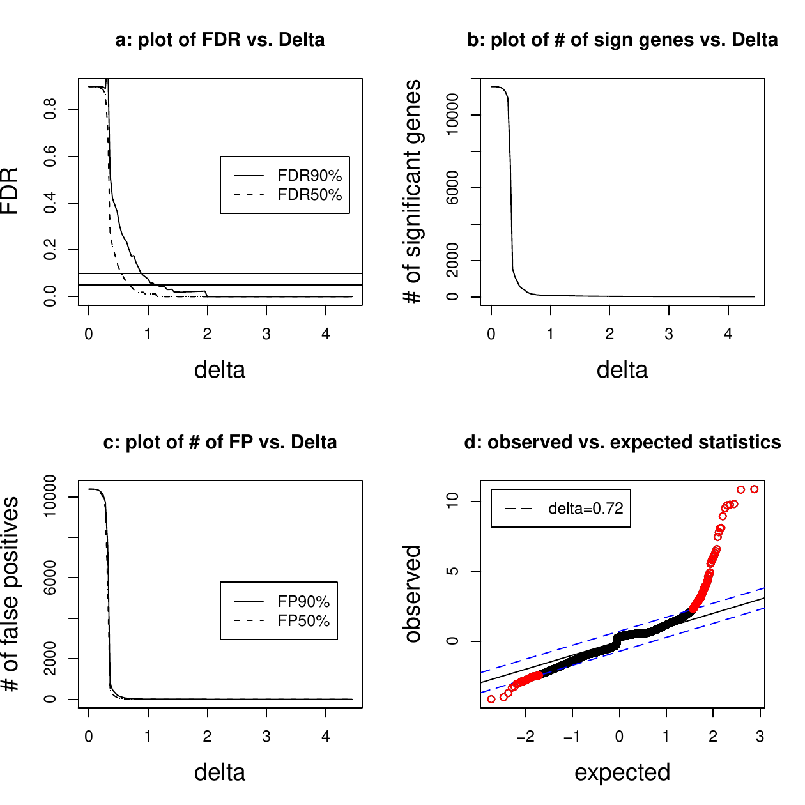
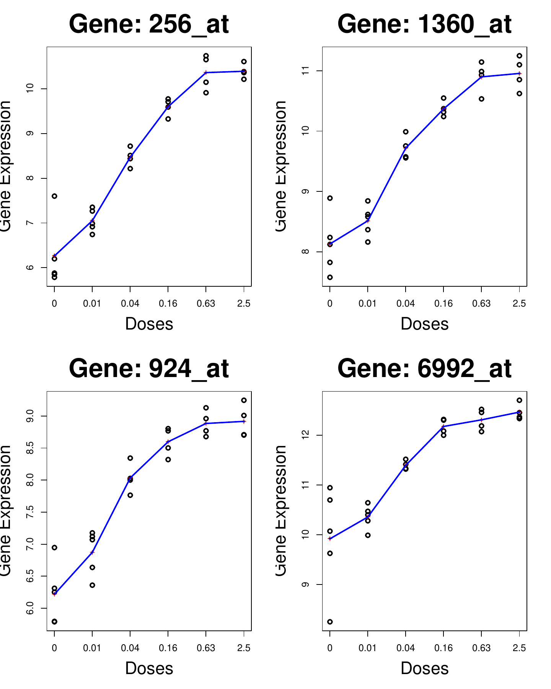

::: article
# Introduction

The exploration of dose-response relationship is important in
drug-discovery in the pharmaceutical industry. The response in this type
of studies can be either the efficacy of a treatment or the risk
associated with exposure to a treatment. Primary concerns of such
studies include establishing that a treatment has some effect and
selecting a dose or doses that appear efficacious and safe
[@Pinheiro2006a]. In recent years, dose-response studies have been
integrated with microarray technologies [@Lin2010]. Within the
microarray setting, the response is gene expression measured at a
certain dose level. The aim of such a study is usually to identify a
subset of genes with expression levels that change with experimented
dose levels.

One of four main questions formulated in dose-response studies by Ruberg
([-@Ruberg1995a], [-@Ruberg1995b]) and @Chuang1997 is whether there is
any evidence of the drug effect. To answer this question, the null
hypothesis of homogeneity of means (no dose effect) is tested against
ordered alternatives. @Lin2007 ([-@Lin2007], [-@Lin2010]) discussed
several testing procedures used in dose-response studies of microarray
experiments. Testing procedures which take into account the order
restriction of means with respect to the increasing doses include
Williams (@Williams1971, [-@Williams1971] and [-@Williams1972]), Marcus
[@Marcus1976], the likelihood ratio test (@Barlow1972 [-@Barlow1972],
and @Robertson1988 [-@Robertson1988]), the $M$ statistic [@Hu2005] and
the modified $M$ statistic [@Lin2007].

To carry out the analysis of dose-response microarray experiments
discussed by @Lin2007 ([-@Lin2007], [-@Lin2010]), an R package called
*IsoGene* has been developed. The *IsoGene* package implements the
testing procedures described by @Lin2007 to identify a subset of genes
where a monotone relationship between gene expression and dose can be
detected. In this package, the inference is based on resampling methods,
both permutations [@Ge2003] and the Significance Analysis of Microarrays
(SAM), @Tusher2001, [-@Tusher2001]. To control the False Discovery Rate
(FDR) the Benjamini Hochberg (BH) procedure [@Benjamini1995] is
implemented.

This paper introduces the *IsoGene* package with background information
about the methodology used for analysis and its main functions.
Illustrative examples of analysis using this package are also provided.

# Testing for Trend in Dose Response Microarray Experiments {#methods}

In a microarray experiment, for each gene, the following ANOVA model is
considered:

$$\label{themodel}
   Y_{ij}=\mu(d_{i})+\varepsilon_{ij},\;i=0,1,\dots,
K,\;j=1,2, \dots, n_i,  (\#eq:themodel)  $$

where $Y_{ij}$ is the $j$th gene expression at the *i*th dose level,
$d_{i}$ ($i=0,1,\dots, K$) are the **$K$+1** dose levels, $\mu(d_{i})$
is the mean gene expression at each dose level, and
$\varepsilon_{ij} \sim N(0,\sigma^{2})$. The dose levels $d_0,...,d_K$
are strictly increasing.

The null hypothesis of homogeneity of means (no dose effect) is given by

$$\label{null}
\begin{array}{l}
H_{0}:\mu(d_{0})=\mu(d_{1})= \dots =\mu(d_{K}).
\end{array}  (\#eq:null)  $$

where $\mu(d_{i})$ is the mean response at dose $d_{i}$ with $i=0,..,K$,
where $i=0$ indicates the control. The alternative hypotheses under the
assumption of monotone increasing and decreasing trend of means are
respectively specified by

$$\label{h1up} H^{Up}_{1}: \mu(d_{0}) \le \mu(d_{1}) \le \cdots \le
\mu(d_{K}),  (\#eq:h1up)  $$

$$\label{h1down}  H^{Down}_{1}: \mu(d_{0}) \ge \mu(d_{1}) \ge \cdots
\ge \mu(d_{K}).  (\#eq:h1down)  $$

For testing $H_{0}$ against $H^{Down}_{1}$ or $H^{Up}_{1}$, estimation
of the means under both the null and alternative hypotheses is required.
Under the null hypothesis, the estimator for the mean response
$\hat{\mu}$ is the overall sample mean. Let
$\hat{\mu}^{\star}_{0},\hat{\mu}^{\star}_{1},\dots,\hat{\mu}^{\star}_{K}$
be the maximum likelihood estimates for the means (at each dose level)
under the order restricted alternatives. [@Barlow1972] and
@Robertson1988 showed that
$\hat{\mu}^{\star}_{0},\hat{\mu}^{\star}_{1},\dots,\hat{\mu}^{\star}_{K}$
are given by the isotonic regression of the observed means.

In order to test $H_{0}$ against $H^{Down}_{1}$ or $H^{Up}_{1}$,
@Lin2007 discussed five testing procedures shown in Figure [1](#stats).
The likelihood ratio test ($\bar{E}^{2}_{01}$) (@Bartholomew1961
[-@Bartholomew1961] , @Barlow1972 [-@Barlow1972], and @Robertson1988
[-@Robertson1988]) uses the ratio between the variance under the null
hypothesis ($\hat{\sigma}^{2}_{H_{0}}$ ) and the variance under order
restricted alternatives ($\hat{\sigma}^{2}_{H_{1}}$):

$$\label{lr1}
\Lambda_{01}^{\frac{2}{N}}=\frac{\hat{\sigma}^{2}_{H_{1}}}{\hat{\sigma}^{2}_{H_{0}}}=\frac{\sum_{ij}
(y_{ij}-\hat{\mu}^{\star}_{j})^{2}}{\sum_{ij}(y_{ij}-\hat{\mu})^{2}}.  (\#eq:lr1)  $$

Here, $\hat{\mu}=\sum_{ij}y_{ij}/\sum_i n_i$ is the overall mean and
$\hat{\mu}_{i}^{\star}$ is the isotonic mean of the $i$th dose level.
The null hypothesis is rejected for a \"small\" value of
$\Lambda_{01}^{\frac{2}{N}}$. Hence, $H_{0}$ is rejected for a large
value of $\bar{E}^{2}_{01}=1-\Lambda^{\frac{2}{N}}_{01}$.

<figure id="stats">
<table>
<caption></caption>
<thead>
<tr class="header">
<th style="text-align: left;">Test statistic</th>
<th style="text-align: left;">Formula</th>
</tr>
</thead>
<tbody>
<tr class="odd">
<td style="text-align: left;">Likelihood Ratio Test (LRT)</td>
<td style="text-align: left;"><span
class="math inline">$\bar{E}^{2}_{01}=\frac{\sum_{ij}(y_{ij}-\hat{\mu})^{2}-\sum_{ij}(y_{ij}-\hat{\mu}^{\star}_{i})^{2}}{\sum_{ij}(y_{ij}-\hat{\mu})^{2}}$</span></td>
</tr>
<tr class="even">
<td style="text-align: left;">Williams</td>
<td style="text-align: left;"><span
class="math inline"><em>t</em> = (<em>μ̂</em><sub><em>K</em></sub><sup>⋆</sup>−<em>ȳ</em><sub>0</sub>)/<em>s</em></span></td>
</tr>
<tr class="odd">
<td style="text-align: left;">Marcus</td>
<td style="text-align: left;"><span
class="math inline"><em>t</em> = (<em>μ̂</em><sub><em>K</em></sub><sup>⋆</sup>−<em>μ̂</em><sub>0</sub><sup>⋆</sup>)/<em>s</em></span></td>
</tr>
<tr class="even">
<td style="text-align: left;">M</td>
<td style="text-align: left;"><span
class="math inline"><em>M</em> = (<em>μ̂</em><sub><em>K</em></sub><sup>⋆</sup>−<em>μ̂</em><sub>0</sub><sup>⋆</sup>)/<em>s̃</em></span></td>
</tr>
<tr class="odd">
<td style="text-align: left;">Modified M (M’)</td>
<td style="text-align: left;"><span
class="math inline"><em>M</em>′ = (<em>μ̂</em><sub><em>K</em></sub><sup>⋆</sup>−<em>μ̂</em><sub>0</sub><sup>⋆</sup>)<em>s̃</em>′</span></td>
</tr>
</tbody>
</table>

<figcaption>Figure 1: Test statistics for trend test, where <span
class="math inline">$s=\sqrt{2 \times \sum_{i=0}^{K} \sum_{j=1}^{n_{i}}
(y_{ij}-\hat{\mu}_{i})^2/(n_{i} (n-K)})$</span>, <span
class="math inline">$\tilde{s}=\sqrt{\sum_{i=0}^{K} \sum_{j=1}^{n_{i}}
(y_{ij}-\hat{\mu}^{\star}_{i})^2/(n-K)}$</span>, <span
class="math inline">$\tilde{s}'=\sqrt{\sum_{i=0}^{K} \sum_{j=1}^{n_{i}}
(y_{ij}-\hat{\mu}^{\star}_{i})^2/(n-I)}$</span>, and <span
class="math inline"><em>I</em></span> is the unique number of isotonic
means.</figcaption>
</figure>

Williams ([-@Williams1971], [-@Williams1972]) proposed a step-down
procedure to test for the dose effect. The tests are performed
sequentially from the comparison between the isotonic mean of the
highest dose and the sample mean of the control, to the comparison
between the isotonic mean of the lowest dose and the sample mean of the
control. The procedure stops at the dose level where the null hypothesis
(of no dose effect) is not rejected. The test statistic is shown in
Figure [1](#stats), where $\bar{y}_{0}$ is the sample mean at the first
dose level (control), $\hat{\mu}_{i}^{\star}$ is the estimate for the
mean at the $i$th dose level under the ordered alternative, $n_{i}$ is
the number of replications at each dose level, and $s^{2}$ is an
estimate of the variance. A few years later, @Marcus1976 proposed a
modification to Williams's procedure by replacing the sample mean of the
control dose ($\bar{y}_{0}$) with the isotonic mean of the control dose
($\hat{\mu}_{0}^{\star}$).

@Hu2005 proposed a test statistic (denoted by $M$) that was similar to
Marcus' statistic, but with the standard error estimator calculated
under the ordered alternatives. This is in contrast to Williams' and
Marcus' approaches that used the within group sum of squares under the
unrestricted means. Moreover, @Hu2005 used $n-K$ as the degrees of
freedom. However, the unique number of isotonic means is not fixed, but
changes across genes. For that reason, @Lin2007 proposed a modification
to the standard error estimator used in the $M$ statistic by replacing
it with $(n-I)$ as the degrees of freedom, where $I$ is the unique
number of isotonic means for a given gene. The five test statistics
discussed above are based on the isotonic regression of the observed
means. Estimation of isotonic regression requires the knowledge of the
direction of the trend (increasing/decreasing). In practice, the
direction is not known in advance. Following @Barlow1972, the *IsoGene*
package calculates the likelihood of the isotonic trend for both
directions and chooses the direction for which the likelihood is
maximized.

The Significance Analysis of Microarrays procedure (SAM, @Tusher2001,
[-@Tusher2001]) can be also adapted to the five test statistics
described above. The generic algorithm of SAM discussed by @Chu2001 is
implemented in this package. For the $t$-type test statistics (i.e.,
Williams, Marcus, the $M$, and the $M'$), a fudge factor is added in the
standard error of the mean difference. For example, the SAM regularized
test statistic for the $M'$ is given by,
$$M'^{SAM}=\frac{\hat{\mu}^{\star}_{K}-\hat{\mu}^{\star}_{0}}{\tilde{s}'+ s_{0}},$$
where $s_0$ is the fudge factor and is estimated from the percentiles of
standard errors of all genes which minimize the Coefficient of Variation
(CV) of the Median Absolute Deviation (MAD) of the SAM regularized test
statistics. For the $F$-type test statistic, such as $\bar{E}_{01}^2$,
the SAM regularized test statistic is defined by,
$$\bar{E}_{01}^{2SAM}= \frac{\sqrt{\hat{\sigma}^2_{H_0}-\hat{\sigma}^2_{H_1}}} {\sqrt{\hat{\sigma}^2_{H_0}}+s_{0}}.
\label{ttestSAM}  (\#eq:ttestSAM)  $$

## Multiplicity

In this study, a gene-by-gene analysis is carried out. When many
hypotheses are tested, the probability of making the type I error
increases sharply with the number of hypotheses tested. Hence,
multiplicity adjustments need to be performed. @Dudoit2003 and
@Dudoit2008 provided extensive discussions on the multiple adjustment
procedures in genomics. @Lin2007 compared several approaches for
multiplicity adjustments, and showed the application in dose-response
microarray experiments. In the *IsoGene* package the inference is based
on resampling-based methods. The Benjamini Hochberg (BH) procedure is
used to control the FDR . We use the definition of FDR from
@Benjamini1995. The Significance Analysis of Microarrays (SAM,
@Tusher2001, [-@Tusher2001]) approach is also considered, which
estimates the FDR by using permutations, where the FDR is computed as
median of the number of falsely called genes divided by the number of
genes called significant.

# Introduction to IsoGene Package

The *IsoGene* package provides the estimates and $p$-values of five test
statistics for testing for monotone trends discussed in the previous
section. The $p$-values are calculated based on a resampling procedure
in which the distribution of the statistic under the null hypothesis is
approximated using permutations.

The main functions of the *IsoGene* package are `IsoRawp()` and
`IsoTestBH()` which calculate the raw $p$-values using permutations and
adjust them using the Benjamini-Hochberg (BH-FDR, @Benjamini1995,
[-@Benjamini1995]) and Benjamini-Yekutieli (BY-FDR, @Benjamini2001,
[-@Benjamini2001]) procedures. The *IsoGene* package also implements the
Significance Analysis of Microarrays (SAM) by using function
`IsoTestSAM()`.

<figure id="function">
<table>
<caption></caption>
<thead>
<tr class="header">
<th style="text-align: left;">Function</th>
<th style="text-align: left;">Description</th>
</tr>
</thead>
<tbody>
<tr class="odd">
<td style="text-align: left;"><code>IsoRawp()</code></td>
<td style="text-align: left;">Calculates raw p-values for</td>
</tr>
<tr class="even">
<td style="text-align: left;"></td>
<td style="text-align: left;">each test statistic using</td>
</tr>
<tr class="odd">
<td style="text-align: left;"></td>
<td style="text-align: left;">permutations</td>
</tr>
<tr class="even">
<td style="text-align: left;"><code>IsoTestBH()</code></td>
<td style="text-align: left;">Adjusts raw p-values of the</td>
</tr>
<tr class="odd">
<td style="text-align: left;"></td>
<td style="text-align: left;">five test statistics using the</td>
</tr>
<tr class="even">
<td style="text-align: left;"></td>
<td style="text-align: left;">BH- or BY-FDR procedure</td>
</tr>
<tr class="odd">
<td style="text-align: left;"><code>IsoGene1()</code></td>
<td style="text-align: left;">Calculates the values of the</td>
</tr>
<tr class="even">
<td style="text-align: left;"></td>
<td style="text-align: left;">five test statistics for a</td>
</tr>
<tr class="odd">
<td style="text-align: left;"></td>
<td style="text-align: left;">single gene</td>
</tr>
<tr class="even">
<td style="text-align: left;"><code>IsoGenem()</code></td>
<td style="text-align: left;">Calculates the values of the</td>
</tr>
<tr class="odd">
<td style="text-align: left;"></td>
<td style="text-align: left;">five test statistics for all genes</td>
</tr>
<tr class="even">
<td style="text-align: left;"><code>IsoPlot()</code></td>
<td style="text-align: left;">Plots the data points, sample</td>
</tr>
<tr class="odd">
<td style="text-align: left;"></td>
<td style="text-align: left;">means at each dose and</td>
</tr>
<tr class="even">
<td style="text-align: left;"></td>
<td style="text-align: left;">an isotonic regression line</td>
</tr>
<tr class="odd">
<td style="text-align: left;"></td>
<td style="text-align: left;">(optional)</td>
</tr>
<tr class="even">
<td style="text-align: left;"><code>IsopvaluePlot()</code></td>
<td style="text-align: left;">Plots the <span
class="math inline"><em>p</em><sup><em>U</em><em>p</em></sup></span> and
<span
class="math inline"><em>p</em><sup><em>D</em><em>o</em><em>w</em><em>n</em></sup></span>-values</td>
</tr>
<tr class="odd">
<td style="text-align: left;"></td>
<td style="text-align: left;">of a gene for a given test</td>
</tr>
<tr class="even">
<td style="text-align: left;"><code>IsoBHplot()</code></td>
<td style="text-align: left;">Plots the raw p-values and</td>
</tr>
<tr class="odd">
<td style="text-align: left;"></td>
<td style="text-align: left;">adjusted BH- and BY-FDR</td>
</tr>
<tr class="even">
<td style="text-align: left;"></td>
<td style="text-align: left;"><span
class="math inline"><em>p</em></span>-values</td>
</tr>
<tr class="odd">
<td style="text-align: left;"><code>IsoGenemSAM()</code></td>
<td style="text-align: left;">Calculates the values for the</td>
</tr>
<tr class="even">
<td style="text-align: left;"></td>
<td style="text-align: left;">five SAM regularized test</td>
</tr>
<tr class="odd">
<td style="text-align: left;"></td>
<td style="text-align: left;">statistics</td>
</tr>
<tr class="even">
<td style="text-align: left;"><code>IsoTestSAM()</code></td>
<td style="text-align: left;">Obtains the list of significant</td>
</tr>
<tr class="odd">
<td style="text-align: left;"></td>
<td style="text-align: left;">genes using the SAM</td>
</tr>
<tr class="even">
<td style="text-align: left;"></td>
<td style="text-align: left;">procedure</td>
</tr>
</tbody>
</table>

<figcaption>Figure 2: The main <em>IsoGene</em> package
functions.</figcaption>
</figure>

The supporting functions are `IsoGenem()` and `IsoGenemSAM()`, which
calculate the values for the five test statistics and for five SAM
regularized test statistics, respectively. The functions
`IsopvaluePlot(), IsoBHplot()`, and `IsoPlot()` can be used to display
the data and show the results of the testing procedures. The summary of
the functions and their descriptions are presented in
Figure [2](#function).

The *IsoGene* package can be obtained from CRAN:
[http://cran.r-project.org/package=IsoGene](http://cran.ii.uib.no/web/packages/IsoGene/).
The *IsoGene* package requires the *ff* and *Iso* packages.

## Example 1: Data Exploration

To illustrate the analysis of dose-response in microarray using
*IsoGene* package, we use the dopamine data. The data were obtained from
a pre-clinical evaluation study of an active compound and Talloen,
[-@Gohlmann2009]). In this study the potency of the compound was
investigated. The compound had 6 dose levels (0, 0.01, 0.04, 0.16, 0.63,
2.5 mg/kg) and each dose was given to four to five independent rats. The
experiment was performed using Affymetrix whole-human genome chip. There
are 26 chips/arrays and each chip/array contains 11,562 probe sets (for
simplicity, we refer to the probe sets as genes). The dopamine data set
with 1000 genes is provided inside the package as example data. The
complete data set can be obtained on request upon the first author. For
this paper, the analysis is based on the original data set (using all
genes).

The example data is in an `ExpressionSet` object called `dopamine`. More
detailed explanation of the `ExpressionSet` object is discussed by
@Falcon2007. In order to load the object into *R*, the following code
can be used:

``` r
> library(affy)
> library(IsoGene)
> data(dopamine)
> dopamine
ExpressionSet(storageMode:lockedEnvironment)
assayData: 11562 features, 26 samples
  element names: exprs
phenoData
  sampleNames: X1, X2, ..., X26 (26 total)
  varLabels and varMetadata description:
    dose: Dose Levels
featureData
  featureNames: 201_at,202_at,...,11762_at
   (11562 total)
  fvarLabels and fvarMetadata
    description: none
experimentData: use 'experimentData(object)'
```

The *IsoGene* package requires the information of dose levels and gene
expression as input. The information of dose levels and the log2
transformed gene intensities can be extracted using the following code:

``` r
> express <- data.frame(exprs(dopamine))
> dose <- pData(dopamine)$dose
```

For data exploration, the function `IsoPlot()` can be used to produce a
scatterplot of the data. The function `IsoPlot()` has two options to
specify the dose levels, i.e., `type ="ordinal"` or `"continuous"`. By
default, the function produces the plot with continuous dose levels and
data points. To add an isotonic regression line, one can specify
`add.curve=TRUE`.

Plots of the data and an isotonic regression line for one of the genes
in the data set with dose on the continuous and ordinal scale can be
produced by using the following code:

``` r
# Figure 3
> par(mfrow=c(1,2))
> IsoPlot(dose,express[56,],type="continuous",
+ add.curve=TRUE)
> IsoPlot(dose,express[56,],type="ordinal",
+ add.curve=TRUE)
```

<figure id="isoplot1">
<p><span></span></p>
<figcaption>Figure 3: <em><span>The plots produced by
<code>IsoPlot()</code> with dose as continuous variable (left panel) and
dose as ordinal variable (right panel and the real dose level is
presented on the <em>x</em>-axis). The data points are plotted as
circles, while the sample means as red crosses and the fitted increasing
isotonic regression model as a blue solid line.</span></em></figcaption>
</figure>

## Example 2: Resampling-based Multiple Testing

In this section, we illustrate an analysis to test for monotone trend
using the five statistics presented in section [2](#methods) using the
*IsoGene* package. The function `IsoRawp()` is used to calculate raw
$p$-values based on permutations. The dose levels, the data frame of the
gene expression, and the number of permutations used to approximate the
null distribution need to be specified in this function. Note that,
since the permutations are generated randomly, one can use function
`set.seed` to obtain the same random number. To calculate raw $p$-values
for the `dopamine` data using 1000 permutations with `seed=1234`, we can
use the following code:

``` r
> set.seed(1234)
> rawpvalue <- IsoRawp(dose, express,
+ niter=1000)
```

The output object `rawpvalue` is a list with four components containing
the $p$-values for the five test statistics: two-sided $p$-values,
one-sided $p$-values, $p^{Up}$-values and $p^{Down}$-values. The codes
to extract the component containing two-sided $p$-values for the first
four genes are presented below. In a similar way, one can obtain other
components.

``` r
> twosided.pval <- rawpvalue[[2]]
> twosided.pval[1:4, ]
  Probe.ID    E2 Williams Marcus     M  ModM
1   201_at 1.000    0.770  0.996 0.918 0.946
2   202_at 0.764    0.788  0.714 0.674 0.700
3   203_at 0.154    0.094  0.122 0.120 0.134
4   204_at 0.218    0.484  0.378 0.324 0.348
```

Once the raw $p$-values are obtained, one needs to adjust these
$p$-values for multiple testing. The function `IsoTestBH()` is used to
adjust the $p$-values while controlling for the FDR. The raw p-values
(e.g., `rawp` ), FDR level, type of multiplicity adjustment (BH-FDR or
BY-FDR) and the statistic need to be specified in following way:

``` r
IsoTestBH(rawp, FDR=c(0.05,0.1),
type=c("BH","BY"), stat=c("E2",
"Williams","Marcus","M","ModifM"))
```

`IsoTestBH()` produces a list of genes, which have a significant
increasing/decreasing trend. The following code can be used to adjust
the two-sided $p$-values of the $\bar{E}^{2}_{01}$ using the BH-FDR
adjustment:

``` r
> E2.BH <- IsoTestBH(twosided.pval,
+ FDR = 0.05, type = "BH", stat ="E2")
> dim(E2.BH)
[1] 250   4
```

The object `E2.BH` contains a list of significant genes along with the
probe ID, the corresponding row numbers of the gene in the original data
set, the unadjusted (raw), and the BH-FDR adjusted $p$-values of the
$\bar{E}^{2}_{01}$ test statistic. In the `dopamine` data, there are 250
genes tested with a significant monotone trend using the likelihood
ratio test ($\bar{E}^{2}_{01}$) at the 0.05 FDR level. The first four
significant genes are listed below:

``` r
> E2.BH[1:4, ]
  Probe.ID row.num raw p-values BH adj.p-values
1 256_at    56            0             0
2 260_at    60            0             0
3 280_at    80            0             0
4 283_at    83            0             0
```

One can visualize the number of significant findings for the BH-FDR and
BY-FDR procedures for a given test statistic using the `IsoBHPlot()`
function.

``` r
> # Figure 4
> IsoBHPlot(twosided.pval,FDR=0.05,stat="E2")
```

Figure [4](#IsoBHPlot) shows the raw $p$-values (solid blue line), the
BH-FDR adjusted $p$-values (dotted and dashed red line) and BY-FDR
(dashed green line) adjusted $p$-values for the $\bar{E}^2_{01}$.

<figure id="IsoBHPlot">
<p><span></span></p>
<figcaption>Figure 4: <em><span>Plot of unadjusted, BH-FDR and BY-FDR
adjusted <span class="math inline"><em>p</em></span>-values for <span
class="math inline"><em>Ē</em><sub>01</sub><sup>2</sup></span></span></em></figcaption>
</figure>

## Example 3: Significance Analysis of Dose-response Microarray Data (SAM)

The Significance Analysis of Microarrays (SAM) for testing for the
dose-response relationship under order restricted alternatives is
implemented in the *IsoGene* package as well. The function
`IsoTestSAM()` provides a list of significant genes based on the SAM
procedure.

``` r
> IsoTestSAM(x, y, fudge=c("none","pooled"),
+ niter=100, FDR=0.05, stat=c("E2",
+ "Williams","Marcus","M","ModifM"))
```

The input for this function is the dose levels (`x`), gene expression
(`y`), number of permutations (`niter`), the FDR level, the test
statistic, and the option of using fudge factor. The option `fudge` is
used to specify the calculation the fudge factor in the SAM regularized
test statistic. If the option `fudge ="pooled"` is used, the fudge
factor will be calculated using the method described in the SAM manual
[@Chu2001]. If we specify `fudge ="none"` no fudge factor is used.

The following code is used for analyzing the `dopamine` data using the
SAM regularized $M'$-test statistic:

``` r
> set.seed(1235)
> SAM.ModifM <-  IsoTestSAM(dose, express,
+ fudge="pooled", niter=100,
+ FDR=0.05, stat="ModifM")
```

The resulting object `SAM.ModifM`, contains three components:

1.  `sign.genes1` contains a list of genes declared significant using
    the SAM procedure.

2.  `qqstat` gives the SAM regularized test statistics obtained from
    permutations.

3.  `allfdr` provides a delta table in the SAM procedure for the
    specified test statistic.

To extract the list of significant gene, one can do:

``` r
> SAM.ModifM.result <- SAM.ModifM[[1]]
> dim(SAM.ModifM.result)
[1] 151   6
```

The object `SAM.ModifM.result`, contains a matrix with six columns: the
Probe IDs, the corresponding row numbers of the genes in the data set,
the observed SAM regularized $M'$ test statistics, the $q$-values
(obtained from the lowest False Discovery Rate at which the gene is
called significant), the raw $p$-values obtained from the joint
distribution of permutation test statistics for all of the genes as
described by @Storey2003, and the BH-FDR adjusted $p$-values.

For `dopamine` data, there are 151 genes found to have a significant
monotone trend based on the SAM regularized $M'$ test statistic with the
FDR level of 0.05. The SAM regularized $M'$ test statistic values along
with $q$-values for the first four significant genes are presented
below.

``` r
> SAM.ModifM.result[1:4,]
```

``` r
  Probe.ID row.num  stat.val qvalue    pvalue adj.pvalue
1  4199_at    3999 -4.142371 0.0000 3.4596e-06 0.0012903
2  4677_at    4477 -3.997728 0.0000 6.9192e-06 0.0022857
3  7896_at    7696 -3.699228 0.0000 1.9027e-05 0.0052380
4  9287_at    9087 -3.324213 0.0108 4.4974e-05 0.0101960
```

Note that genes are sorted increasingly based on the SAM regularized
$M'$ test statistic values (i.e., `stat.val`).

In the *IsoGene* package, the function `IsoSAMPlot()` provides graphical
outputs of the SAM procedure. This function requires the SAM regularized
test statistic values and the delta table in the SAM procedure, which
can be obtained from the resulting object of the `IsoTestSAM()`
function, which in this example data is called `SAM.ModifM`. To extract
the objects we can use the following code:

``` r
# Obtaining SAM regularized test statistic
qqstat <- SAM.ModifM[[2]]
# Obtaining delta table
allfdr <- SAM.ModifM[[3]]
```

We can also obtain the `qqstat` and `allfdr` from the functions
`Isoqqstat()` and `Isoallfdr()`, respectively. The code for the two
functions are:

``` r
Isoqqstat(x, y, fudge=c("none","pooled"),niter)
Isoallfdr(qqstat, ddelta, stat=c("E2",
"Williams","Marcus","M","ModifM"))
```

The examples of using the functions `Isoqqstat()` and `Isoallfdr()` are
as follows:

``` r
# Obtaining SAM regularized test statistic
> qqstat <- Isoqqstat(dose, express,
+ fudge="pooled", niter=100)
# Obtaining delta table
> allfdr <- Isoallfdr(qqstat, ,stat="ModifM")
```

Note that in `Isoallfdr()`, `ddelta` is left blank, with default values
taken from the data, i.e., all the percentiles of the standard errors of
the $M'$ test statistic.

The two approaches above will give the same result. Then to produces the
SAM plot for the SAM regularized $M'$ test statistic, we can use the
function `IsoSAMPlot`:

``` r
# Figure 5
> IsoSAMPlot(qqstat, allfdr, FDR = 0.05,
+ stat = "ModifM")
```

<figure id="IsoSAMPlot">
<p><span></span></p>
<figcaption>Figure 5: <em><span>The SAM plots: a.Plot of the FDR vs.
<span class="math inline"><em>Δ</em></span>; b. Plot of number of
significant genes vs. <span class="math inline"><em>Δ</em></span>; c.
Plot of number of false positives vs. <span
class="math inline"><em>Δ</em></span>; d. Plot of the observed vs.
expected test statistics.</span></em></figcaption>
</figure>

Panel $a$ of Figure [5](#IsoSAMPlot) shows the FDR (either 50% or 90%
(more stringent)) vs. $\Delta$, from which, user can choose the $\Delta$
value with the corresponding desired FDR. The FDR 50% and FDR 90% are
obtained from, respectively, the median and 90th percentile of the
number of falsely called genes (number of false positives) divided by
the number of genes called significant, which are estimated by using
permutations [@Chu2001]. Panel $b$ shows the number of significant genes
vs. $\Delta$, and panel $c$ shows the number of false positives (either
obtained from 50th or 90th percentile) vs. $\Delta$. Finally, panel $d$
shows the observed vs. the expected (obtained from permutations) test
statistics, in which the red dots are those genes called differentially
expressed.

# Comparison of the Results of Resampling-based Multiple Testing and the SAM

In the previous sections we have illustrated analysis for testing a
monotone trend for dose-response microarray data by using permutations
and the SAM. The same approach can also be applied to obtain a list of
significant genes based on other statistics and other multiplicity
adjustments. Figure [6](#tab:siggene) presents the number of genes that
are found to have a significant monotone trend using five different
statistics with the FDR level of 0.05 using the two approaches.

It can be seen from Figure [6](#tab:siggene) that the $\bar{E}^{2}_{01}$
gives a higher number of significant genes than other $t$-type
statistics. Adding the fudge factor to the statistics leads to a smaller
number of significant genes using the SAM procedure for the $t$-type
test statistics as compared to the BH-FDR procedure.\

<figure id="tab:siggene">
<table>
<caption> </caption>
<tbody>
<tr class="odd">
<td style="text-align: left;"></td>
<td colspan="3" style="text-align: center;">Number of significant
genes</td>
</tr>
<tr class="even">
<td style="text-align: left;">Test statistic</td>
<td style="text-align: center;">BH-FDR</td>
<td style="text-align: center;">SAM</td>
<td style="text-align: center;"># common genes</td>
</tr>
<tr class="odd">
<td style="text-align: left;"><span
class="math inline"><em>Ē</em><sub>01</sub><sup>2</sup></span></td>
<td style="text-align: center;">250</td>
<td style="text-align: center;">279</td>
<td style="text-align: center;">200</td>
</tr>
<tr class="even">
<td style="text-align: left;">Williams</td>
<td style="text-align: center;">186</td>
<td style="text-align: center;">104</td>
<td style="text-align: center;">95</td>
</tr>
<tr class="odd">
<td style="text-align: left;">Marcus</td>
<td style="text-align: center;">195</td>
<td style="text-align: center;">117</td>
<td style="text-align: center;">105</td>
</tr>
<tr class="even">
<td style="text-align: left;"><span
class="math inline"><em>M</em></span></td>
<td style="text-align: center;">209</td>
<td style="text-align: center;">158</td>
<td style="text-align: center;">142</td>
</tr>
<tr class="odd">
<td style="text-align: left;"><span
class="math inline"><em>M</em>′</span></td>
<td style="text-align: center;">203</td>
<td style="text-align: center;">151</td>
<td style="text-align: center;">134</td>
</tr>
</tbody>
</table>

<figcaption>Figure 6: Number of significant genes for each test
statistic with BH-FDR and SAM.</figcaption>
</figure>

In the inference based on the permutations (BH-FDR) and the SAM, most of
the genes found by the five statistics are in common (see Figure
[6](#tab:siggene)). The plots of the samples and the isotonic trend of
four best genes that are found in all statistics and in both the
permutations and the SAM approaches are presented in Figure
[7](#PlotBestgene), which have shown a significant increasing monotone
trend.

# Discussion

We have shown the use of the *IsoGene* package for dose-response studies
within a microarray setting along with the motivating examples. For the
analysis using the SAM procedure, it should be noted that the fudge
factor in the $\bar{E}_{01}^2$ is obtained based on the approach for
F-type test statistic discussed by @Chu2001 and should be used with
caution. The performance of such an adjustment as compared to the
$t$-type test statistics has not yet been investigated in terms of power
and control of the FDR. Therefore, it is advisable to use the fudge
factor in the $t$-type test statistics, such as the $M$ and modified $M$
test statistics.

<figure id="PlotBestgene">
<p><span></span></p>
<figcaption>Figure 7: <em><span>Plots of the samples (circles) and the
isotonic trend (solid blue line) for the four best genes with a
significant monotone trend.</span></em></figcaption>
</figure>

The calculation of the raw $p$-values based on permutations using the
`IsoRawp()` function is computationally intensive. For example, when we
used 100 permutations for analyzing 10,000 genes, it takes around 30
minutes. When we use 1,000 permutations, the elapsed time increases
around 10 times. Usually to approximate the null distribution of the
test statistics, a large number of permutations is needed, which leads
to the increase of computation time. Considering the computation time,
we also provide the $p$-values obtained from joint distribution of
permutation statistics for all genes which is implemented in function
`IsoTestSAM()`. This approach is sufficient to obtain small $p$-values
using a small number of permutations. Alternatively, one can also use
the SAM procedure which does not require a large number of permutations
and takes less computation time. However caution should be drawn to the
comparison of the SAM procedure with and without the fudge factor.

A further development of this package is the Graphical User Interface
(GUI) using `tcl/tk` for users without knowledge of R programming.

# Acknowledgement

Financial support from the IAP research network nr P5/24 of the Belgian
Government (Belgian Science Policy) is gratefully acknowledged.

\
:::
