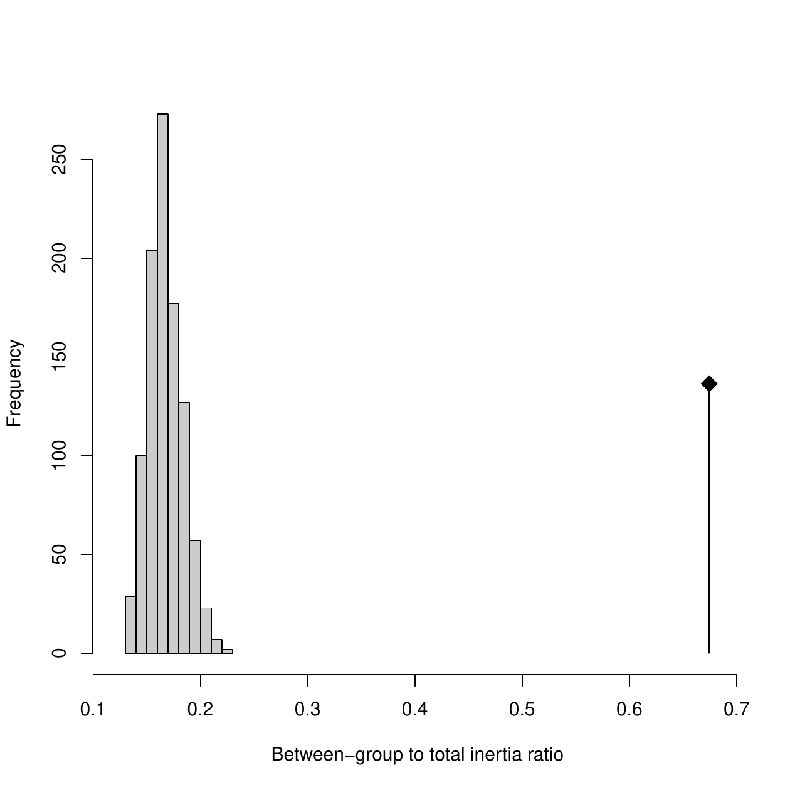
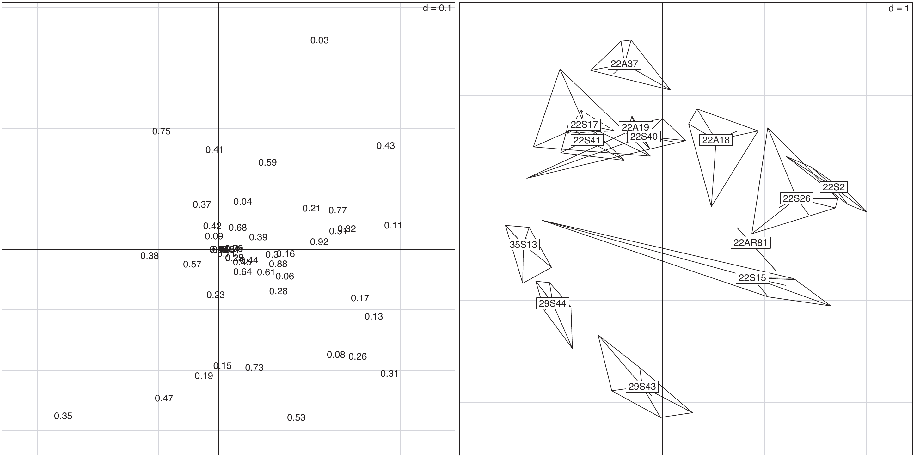
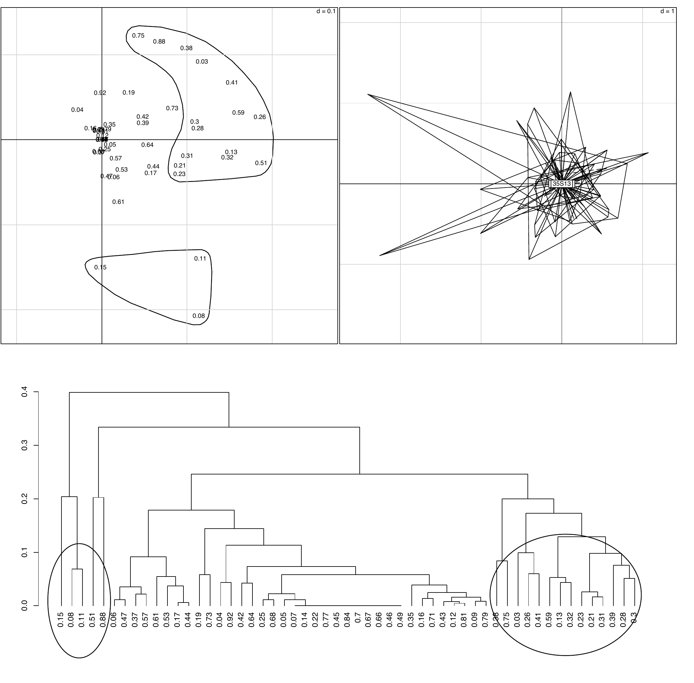

::: article
# Introduction

Reproducible research has gained much attention recently (see
particularly <http://reproducibleresearch.net/> and the references
therein). In the area of Statistics, the availability of Sweave
([@Leisch2002], <http://www.stat.uni-muenchen.de/~leisch/Sweave/>) has
proved extremely useful and Sweave documents are now widely used. Sweave
offers the possibility to have text, R code, and outputs of this code in
the same document. This makes reproducibility of a scientific paper
written in Sweave very straightforward.

However, using Sweave documents implies a good knowledge of R, of Sweave
and of LaTeX. It also requires having R installed on one's computer. The
installed version of R must be compatible with the R code in the Sweave
document, and all the needed packages must also be installed. This may
be a problem for some scientists, for example for many biologists who
are not familiar with R and LaTeX, or who do not use them on a regular
basis.

In this paper, we demonstrate an online reproducibility system that
helps circumvent these problems. It is based on a web page that can be
used with any web browser. It does not require R to be installed
locally, nor does it need a thorough knowledge of R and LaTeX.
Nevertheless it allows the user to present and comment R code snippets,
to redo all the computations and to draw all the graphical displays of
the original paper.

The example presented here relates to multivariate data analysis.
Reproducibility of multivariate data analyses is particularly important
because there is a large number of different methods, with poorly
defined names, making it often difficult to know what has been done
exactly. Many methods have several different names, according to the
community where they were invented (or re-invented), and where they are
used. Translation of technical terms into languages other than English
is also difficult, as many are ambiguous and have "false friends".
Moreover, data analysis methods make intensive use of graphical
displays, with a large number of graphical parameters which can be
changed to produce a wide variety of displays.

This situation is similar to what was described by [@Buckheit1995] in
the area of wavelet research. Their solution was to publish the Matlab
code used to produce the figures in their research articles. Rather than
do this we decided to set up a simple computer environment using R to
offer online reproducibility. In 2002, we installed an updated version
of the Rweb system [@Banfield1999] on our department server (see
<http://pbil.univ-lyon1.fr/Rweb/Rweb.general.html>), and we implemented
several computational web services in the field of comparative genomics
([@Perriere2003], see for example
<http://pbil.univ-lyon1.fr/mva/coa.php>).

This server now combines the computational power of R with simple HTML
forms (as suggested by [@DeLeeuw2001] for Xlisp-Stat) and the ability to
search online molecular databases with the
[*seqinr*](https://CRAN.R-project.org/package=seqinr) package
[@Charif2007]. It is also used by several researchers to provide an
online reproducibility service for scientific papers (see for example
<http://pbil.univ-lyon1.fr/members/lobry/>).

The present paper provides an example of an application of this server
to the analysis of DNA fingerprints by multivariate analysis methods,
using the [*ade4*](https://CRAN.R-project.org/package=ade4) package
[@Chessel2004; @DrayDufour2007]. We have shown recently [@Valiente2009]
that multivariate analysis techniques can be used to analyse bacterial
DNA fingerprints and that they make it possible to draw useful
conclusions about the composition of the bacterial communities from
which they originate. We also demonstrate the effectiveness of principal
component analysis, between-group analysis and within-group analysis
\[PCA, BGA and WGA, [@Benzecri1983; @Doledec1987]\] to show differences
in diversity between bacterial communities of various origins.

In summary, we show here that it is easy to set up a software
environment offering full online reproducibility of computations and
graphical displays of multivariate data analysis methods, even for users
who are not familiar with R, Sweave or LaTeX.

# Data and methods

In this section, we first describe the biological material used in the
example data set. Then we present the statistical methods (PCA, BGA and
WGA), in the framework of the duality diagram
[@Escoufier1987; @Holmes2006]. We also detail the software environment
that was used.

## Biological material

The poultry red mite, *Dermanyssus gallinae* is an haematophagous mite
frequently present in breeding facilities and especially in laying hen
facilities [@Chauve1998]. This arthropod can be responsible for anemia,
dermatitis, weight loss and a decrease in egg production
[@Kirkwood1967]. It has also been involved in the transmission of many
pathogenic agents responsible for serious diseases in both animals and
humans [@Valiente2005; @Valiente2007]. The poultry red mite is therefore
an emerging problem that must be studied to maintain good conditions in
commercial egg production facilities. Nothing is known about its
associated non-pathogenic bacterial community and how the diversity of
the microflora within mites may influence the transmission of pathogens.

Most studies on insect microflora are based on isolation and culture of
the constituent micro-organisms. However, comparison of culture-based
and molecular methods reveals that only 20-50% of gut microbes can be
detected by cultivation [@Suau1999]. Molecular methods have been
developed to analyse the bacterial community in complex environments.
Among these methods, Denaturing Gradient and Temporal Temperature Gel
Electrophoresis (DGGE and TTGE) [@Muyzer1998] have already been used
successfully.

Full details of the example data set used in this paper (mites sampling,
DNA extraction, PCR amplification of 16S rDNA fragments and TTGE banding
pattern achieving) are given in @Valiente2009. Briefly, 13 poultry farms
were selected in the Bretagne region in France, and in each farm 15
single mites, five pools of 10 mites and one pool of 50 mites were
collected. The results for single mites and mite pools were analysed
separately, but only the results of mite pools are presented in this
study, as they had the most illustrative analysis. Banding patterns can
be analysed as quantitative variables (intensity of bands), or as binary
indicators (presence/absence of bands), but for the same reason, only
the presence/absence data were used in this paper.

TTGE banding patterns were collected in a data table, with bands in
columns (55 columns) and mite pools in rows (73 rows). This table was
first subjected to a principal component analysis (PCA) to get an
overall idea of the structure of the banding patterns. Between-group
analysis (BGA) was then applied to study the differences between poultry
farms, and finally within-group analysis (WGA) was used to eliminate the
farm effect and obtain the main characteristics of the common bacterial
flora associated with *D. gallinae* in standard breeding conditions. A
good knowledge of these characteristics would allow comparisons of the
standard bacterial flora among various situations, such as geographic
regions, type and location of breeding facilities (particularly organic
farms), or developmental stages of *D. gallinae*.

## Duality diagram of principal component analysis

Let $\mathbf{X}=[x_{ij}]_{(n,p)}$ be the TTGE data table with $n$ rows
(individuals = mite pools) and $p$ columns (variables = TTGE bands).
Variables have mean $\bar{x}_j=\frac{1}{n}\sum_i{x_{ij}}$ and variance
$\sigma_j^2=\frac{1}{n}\sum_i{(x_{ij}-\bar{x}_j)^2}$. Individuals belong
to $g$ groups (or classes), namely $G_1, \ldots, G_g$, with group counts
$n_1, \ldots, n_g$, and $\sum{n_k}=n$.

Using duality diagram theory and triplet notation, the PCA of
$\mathbf{X}$ is the analysis of a triplet
$(\mathbf{X}_0,\mathbf{D}_p,\mathbf{D}_n)$. $\mathbf{X}_0$ is the table
of standardized values:

::: center
$\mathbf{X}_0=[\tilde{x}_{ij}]_{(n,p)}$
:::

with $\tilde{x}_{ij}=\frac{x_{ij}-\bar{x}_j}{\sigma_j}$, and
$\mathbf{D}_n$ and $\mathbf{D}_p$ are the diagonal matrices of row and
column weights: $\mathbf{D}_p=\mathbf{I}_p$ and
$\mathbf{D}_n=\frac{1}{n}\mathbf{I}_n$.

This information is summarized in the following mnemonic diagram, called
the "duality diagram" because ${\mathbb{R}^{{p}^*}}$ is the dual of
${\mathbb{R}^p}$ and ${\mathbb{R}^{{n}^*}}$ is the dual of
${\mathbb{R}^n}$:


\begin{eqnarray}
  \mathbb{R}^p&
   \xrightarrow{{\mathbb{D}_p}}  & 
  \mathbb{R}^{{p}^*}\\
  {\mathbb{X}_0^T}  \uparrow&
  &\downarrow{\mathbb{X}_0} \\
  
  {\mathbb{R}^{{n}^*}}
   & 
   \xleftarrow{\mathbb{D}_n} &\mathbb{R}^n
  \end{eqnarray}

$\mathbf{X}_0^T$ is the transpose of $\mathbf{X}_0$. The analysis of
this triplet leads to the diagonalization of matrix:

::: center
$\mathbf{X}_0^T\mathbf{D}_n\mathbf{X}_0\mathbf{D}_p$
:::

*i.e.*, the matrix obtained by proceeding counter-clockwise around the
diagram, starting from ${\mathbb{R}^p}$. Principal components, (variable
loadings and row scores), are computed using the eigenvalues and
eigenvectors of this matrix.

## Between-group analysis

The between-group analysis (BGA) is the analysis of triplet
$(\mathbf{X}_B,\mathbf{D}_p,\mathbf{D}_{n_k})$, where $\mathbf{X}_B$ is
the $(g,p)$ matrix of group means:

::: center
$\mathbf{X}_B=[\bar{x}_j^k]_{(g,p)}$.
:::

The term $\bar{x}_j^k=\frac{1}{n_k}\sum_{i\in{G_k}}{\tilde{x}_{ij}}$ is
the mean of variable $j$ in group $k$. In matrix notation, if
$\mathbf{B}$ is the matrix of class indicators:
$\mathbf{B}=[b_i^k]_{(n,g)}$, with $b_i^k=1$ if $i\in{G_k}$ and
$b_i^k=0$ if $i\notin{G_k}$, then we have:

::: center
$\mathbf{X}_B=\mathbf{D}_{n_k}\mathbf{B} ^T\mathbf{X}_0$.
:::

Matrix $\mathbf{D}_{n_k}=Diag(\frac{1}{n_k})$ is the diagonal matrix of
(possibly non uniform) group weights, and $\mathbf{B}^T$ is the
transpose of $\mathbf{B}$.

BGA is therefore the analysis of the table of group means, leading to
the diagonalization of matrix
$\mathbf{X}_B^T\mathbf{D}_{n_k}\mathbf{X}_B\mathbf{D}_p$. Its aim is to
reveal any evidence of differences between groups. The statistical
significance of these differences can be tested with a permutation test.
Row scores of the initial data table can be computed by projecting the
rows of the standardized table $\mathbf{X}_0$ onto the principal
components subspaces.

## Within-group analysis

The within-group analysis (WGA) is the analysis of triplet
$(\mathbf{X}_W,\mathbf{D}_p,\mathbf{D}_n)$, where $\mathbf{X}_W$ is the
$(n,p)$ matrix of the differences between the standardized values and
the group means:

::: center
$\mathbf{X}_W=[\tilde{x}_{ij}-\bar{x}_{ij}^k]_{(n,p)}$
:::

with $\bar{x}_{ij}^k=\bar{x}_{j}^k$, $\forall{i\in{G_k}}$. In matrix
notation

::: center
$\mathbf{X}_W=\mathbf{X}_0-\mathbf{X}_{\tilde{B}}$
:::

where $\mathbf{X}_{\tilde{B}}$ is the matrix of groups means, repeated
inside each group.

WGA is therefore the analysis of the matrix of the residuals obtained by
eliminating the between-group effect. It leads to the diagonalization of
matrix $\mathbf{X}_W^T\mathbf{D}_n\mathbf{X}_W\mathbf{D}_p$. It is
useful when looking for the main features of a data table after removing
an unwanted characteristic.

## Software

We used R version 2.11.0 [@RDCT2009] for all computations, and the
*ade4* package (version 1.4-14) for multivariate analyses
[@Chessel2004; @DrayDufour2007; @ThioulouseDray2007]. PCA, BGA and WGA
were computed with the `dudi.pca`, `between` and `within` functions of
*ade4*. BGA permutation tests were done with the `randtest` function.

# Online reproducibility

The statistical analyses presented in [@Valiente2009] are reproducible
[@Gentle2004] via the web page <http://pbil.univ-lyon1.fr/TTGE/>.

This page presents the problem, gives access to the data set, and allows
the user to execute R code snippets that reproduce all the computations
and graphical displays of the original article [@Valiente2009]. The R
code is explained, with a description of important variables and
function calls, and the R outputs are documented. Links to the
information pages of the main *ade4* functions are also provided.

This page is therefore an example of *online* literate programming
[@Knuth1992], and also of an online *dynamic document* [@Gentle2004].
This is made possible using HTML forms containing R code stored in
editable text fields. The code itself can be modified by the user and
executed on demand. Code execution is achieved by sending it to the Rweb
software [@Banfield1999] running on our department server:
<http://pbil.univ-lyon1.fr/Rweb/Rweb.general.html>.

Links to the complete R code and data sets are provided on the web page.
They can be used to download these files and use them locally if
desired. The full R code (the collection of all code snippets) is
available directly from <http://pbil.univ-lyon1.fr/TTGE/allCode.R>.

## PCA, BGA and permutation test

The first code snippet in the reproducibility page reads the TTGE data
table, builds the factor describing the poultry farms, and computes the
three analyses (PCA, BGA, and WGA). The PCA is first done using the
`dudi.pca` function of the *ade4* package, and the resulting object is
passed to the `between` and `within` functions to compute BGA and WGA
respectively. The BGA permutation test is then computed and the test
output is plotted.

On the reproducibility web page, these successive steps are explained:
links to the data files are presented, the R code is displayed and
commented, and the \"Do it again!\" button can be used to redo the
computations. The code can be freely modified by the user and executed
again. For example, it is possible to change the scaling of the PCA, or
the number of random permutations in the Monte Carlo test to check the
influence of these parameters on analysis outputs.

Figure 1 shows the result of the permutation test of the BGA. The null
hypothesis is that there is no difference between farms. The test checks
that the observed value of the ratio of between-group to total inertia
(0.67) is much higher than expected under the null hypothesis. Under the
null hypothesis, mite pools can be permuted randomly among farms without
changing significantly the ratio of between to total inertia. To compute
the test, the rows of the dataframe are randomly permuted, and the ratio
is computed again. This is done many times, to get an idea of the
distribution of the between to total inertia ratio. Figure 1 shows that
the observed value (black diamond, far on the right) is much higher than
all the values obtained after permuting the pools. The $p$-value is
0.001, implying that the hypothesis of no differences between the farms
can confidently be rejected.

<figure>

<figcaption>Figure 1: Permutation test of the BGA. The observed value of
the between-group to total inertia ratio is equal to 0.67 (black diamond
on the right). The histogram on the left shows the distribution of 1000
values of this ratio obtained after permuting the rows of the data
table.</figcaption>
</figure>

## BGA plots

The second code snippet draws Figure 2, showing the factor maps of the
BGA.

<figure>

<figcaption>Figure 2: Factor maps of BGA (x-axis=first principal
component, y-axis=second principal component, inertia percentages: 20%
and 17%). The scale is given by the value d (top-right corner) that
represents the size of the background grid. The first panel shows the
map of the 55 TTGE bands (labels correspond to the position of the band
on the electrophoresis gel). The second panel shows the 73 mite pools,
grouped by convex hulls according to the poultry farm from which they
originate (labels correspond to the farms).</figcaption>
</figure>

The loadings of TTGE bands are in the `bga1$co` dataframe, and they are
plotted using the `s.label` function (first panel). To get an idea of
the dispersion of the six mite pools in each farm, we can plot the
projection of each pool on the factor map (second panel). The row scores
of the pools are in the `bga1$ls` dataframe, and two graphs are
superimposed: the graph of pool stars (with `s.class`), and the graph of
convex hulls surrounding the pools belonging to the same farm (with
`s.chull`). We can see that, as the permutation test had just evidenced,
the farms are indeed very different.

Here also, the user can very easily change the R code to draw
alternative graphs. It is possible, for example, to explore the effect
of the arguments to the `s.label` and `s.class` functions.

Interpreting the differences between farms evidenced in Figure 2 was not
easy. All 13 farms are standard poultry farms, using exactly the same
breeding conditions, and the differences between TTGE banding patterns
could not be attributed to any other factors.

Since the aim of the study was to find the common bacterial flora
associated with *D. gallinae* in standard breeding conditions, we
decided to remove this unwanted between-farm effect by doing a
within-group analysis.

<figure>

<figcaption>Figure 3: Factor maps of WGA (x-axis=first principal
component, y-axis=second principal component, inertia percentages: 14
and 8). The scale is given by the value d (top-right corner) that
represents the size of the background grid. Top-left panel: map of the
55 TTGE bands (see legend to Figure 2). Top-right panel: map of the 73
mite pools, grouped by farms. Bottom panel: dendrogram of the cluster
analysis on WGA band loadings.</figcaption>
</figure>

## WGA and cluster analysis plots

The third code snippet draws Figure 3, showing the factor maps of WGA
and the dendrogram of the cluster analysis on TTGE band loadings.

The loadings of the 55 TTGE bands are in the `wga1$co` dataframe, and
they are plotted using the `s.label` function (top-left panel). The
scores of the 73 mite pools are in the `wga1$li` dataframe. They are
grouped by convex hulls, according to the poultry farm from which they
originate using the `s.class` and `s.chull` functions (top-right panel).
The row scores of the WGA are centered by group, so the 13 farms are
centered on the origin (this corresponds to the fact that the \"farm
effect\" has been removed in this analysis).

The TTGE bands corresponding to the common dominant bacterial flora
associated with *D. gallinae* in standard breeding conditions were
selected on Figure 3 (top-left panel), using cluster analysis (lower
panel). This was done using the complete linkage algorithm, with
euclidean distances computed on WGA variable loadings on the first three
axes (wga1\$co) and not on raw data.

The reproducibility page can be used to compare these results and the
ones obtained with other clustering algorithms or other distance
measures. Another possibility is to check the effect of the number of
axes on which variable loadings are computed (three axes in the R code
proposed by default).

We included the two leftmost outgroups (bands 0.15, 0.08, 0.11, 0.51,
and 0.88) and the right group (0.38, 0.75, 0.03, 0.26, 0.41, 0.59, 0.13,
0.32, 0.23, 0.21, 0.31, 0.28, and 0.3). Band 0.39 was excluded because
it was present in only two mite pools belonging to one single farm.

These results show that there is a strong between-farm effect in the
TTGE banding patterns corresponding to the bacterial flora associated
with *D. gallinae* in standard breeding conditions. However, it was not
possible to give a satisfying biological interpretation of this effect:
the farms evidenced by the BGA did not show any particular
characteristic. The WGA could remove this farm effect, and revealed the
common dominant bacterial flora [@Valiente2009]. The knowledge of this
flora will allow us to compare the variations observed in different
conditions, such as different geographic regions, different types of
breeding farms (for example organic farms), or different developmental
stages of *D. gallinae*. Data from farms in different geographic regions
and from organic farms are already available, and a paper presenting the
results of their analysis has been submitted for publication.

# Discussion

## Statistical methodology

From the point of view of statistical methodology, BGA appears as a
robust method that can be used to reveal any evidence for, and test, a
simple effect, namely the effect of a single factor, in a multivariate
data table. Many recent examples of its use can be found in the area of
Genomics [@Culhane2002; @Culhane2005; @Baty2005; @Jeffery2007].

Furthermore WGA can eliminate a simple effect from a multivariate data
table. Like BGA, it can be used even when the number of cases is less
than the number of variables. A recent example of WGA in the area of
Genomics can be found in [@Suzuky2008].

BGA can be seen as a particular case of redundancy analysis \[RDA,
[@stewart1968]\] and WGA as a particular case of partial RDA \[CANOCO
[@BraakSmil2002]\]. Both cases correspond to covariates reduced to a
single dummy variable.

This can be checked with
[*vegan*](https://CRAN.R-project.org/package=vegan), another classical R
package for multivariate ecological data analysis, using the `rda`
function, as explained on the online reproducibility page in code
snippet 4. Outputs are not presented here, but they are available on
that site, where they may be interactively explored.

## Computer setup

The reproducibility web page presented here is just an example of use of
a simple setup that can be implemented easily on any web server. The
current configuration of our server is an old Sun Fire 800, with 8
UltraSparc III processors at 900 MHz, 28 GB of memory and 6 x 36 GB
disks. From the point of view of software, the server is running Solaris
10, the HTTP server is Apache 2.2.13, and we use Rweb 1.03 and R 2.11.0.
Rweb is mainly a set of CGI scripts written in Perl, and the installed
Perl version is v5.8.4. The page itself is written in plain HTML code,
using standard HTML forms to communicate with Rweb CGI scripts.

Rweb source code is available from the Montana State University
(<http://bayes.math.montana.edu/Rweb/Rweb1.03.tar.gz>).

There has been many other attempts at mixing R and HTML on the web.
Alternative solutions could for example make use of
[*CGIwithR*](https://CRAN.R-project.org/package=CGIwithR) [@Firth2003]
and [*R2HTML*](https://CRAN.R-project.org/package=R2HTML)
[@Lecoutre2003], or Rscript.

Running a server offering public computing services necessarily raises
many security issues. The server that is used for Rweb at the PBIL
(<http://pbil.univ-lyon1.fr>) also offers many other computing services
in the area of Genomic research, including complex database exploration
and analysis of huge molecular databases (GenBank, EMBL, etc.) This
server has been attacked and successfully compromised several times with
common rootkits, but in eight years \[we started the Rweb service in
2002, [@Perriere2003]\], the Rweb server has never been used in these
attacks. Rweb precludes the use of the most sensitive functions
(particularly \"system\", \"eval\", \"call\", \"sink\", etc.) and an
additional security measure taken on our server is that all computations
are performed in a temporary directory that is cleaned up automatically
after use.

## Online reproducibility

Sweave is a very good solution for the reproducibility of scientific
papers' statistical computation and graphical display. It is more and
more frequently used, and not only for reproducible research in the
strictest sense. For example, it is used for quality control and for
keeping up-to-date the documents used in the statistical teaching
modules of the Biometry and Evolutionary Biology department at the
University of Lyon, France:
<http://pbil.univ-lyon1.fr/R/enseignement.html> (in French).

Using Sweave documents, however, is very demanding for users. LaTeX and
R must be installed on the local computer, and users must have at least
some notions of how to compile these documents. The version of R and the
list of packages must be compatible with the R code included in the
Sweave document. This can be a serious obstacle for many researchers,
for example in Biology and Ecology.

The online reproducibility solution presented in this paper is much
easier to use for people who do not know LaTeX and who have only vague
notions of R. It can be used with any web browser and it can make the
analyses used in an applied statistics paper accessible to anyone. It
can even be a good tool to help people get a better knowledge of R and
encourage them to install R and use it locally.

## Rweb servers

Many examples of the use of the PBIL Rweb server are available on the
home page of J. R. Lobry, <http://pbil.univ-lyon1.fr/members/lobry/>.
The articles under the tag "\[ONLINE REPRODUCIBILITY\]" are reproducible
through a reproducibility web page, using HTML forms and Rweb as
explained in this paper.

Writing such web pages is very easy, and does not require R, Rweb or any
other particular software to be installed on the HTTP server. The HTML
code below is a minimal example of such a page. It can be used with any
web server using, for example, the apache2 HTTP server, or even locally
in any web browser:

``` r
<html>
<head><title>Rweb</title></head>
<body>
<p style="font-size:30px">
Rweb server at PBIL</p>
<form onSubmit = "return checkData(this)"
action="http://pbil.univ-lyon1.fr/cgi-bin/
Rweb/Rweb.cgi"
enctype="multipart/form-data"
method="post">
<textarea name="Rcode" rows=5 cols=80>
plot(runif(100))
</textarea><br />
<input type="submit" value="Run it!">
</form>
</body>
</html>
```

The main feature of this code is the `form` tag that declares the CGI
script of the Rweb server:
<http://pbil.univ-lyon1.fr/cgi-bin/Rweb/Rweb.cgi>. The `textarea` tag in
this form contains the R code: here by default it is just one plot
function call that draws 100 random points. This default code can be
changed in the HTML document, or modified interactively by the user when
the page is loaded in a web browser. The `input` tag defines the "Run
it!" button that can be used to execute the R code. When the user clicks
on this button, the code is sent to the Rweb CGI script and executed by
R. The browser display is updated, and the execution listing and the
graph appear.

Another solution is to install Rweb and run a local (public or private)
Rweb server.

## Maintenance and durability

An important problem for reproducible research is durability. How long
will a reproducible work stay reproducible?

The answer depends on the availability of the software needed to redo
the computations and the graphics. R and contributed packages evolve,
and R code can become deprecated if it is not updated on a regular
basis. Sweave has been used mainly for just this reason in the documents
used in the statistical teaching modules at the University of Lyon. All
the documents are recompiled automatically to check their compatibility
with the current version of R.

For an online reproducibility system to endure, the same conditions
apply. The Biometry and Evolutionary Biology department has been running
an Rweb server continuously since 2002, regularly updating the various
pieces of software on which it depends (R, contributed packages, Rweb,
Perl, Apache, etc.).

Reproducible research needs an ongoing effort; reproducibility ceases
when this effort is not sustained.

# Acknowledgment

We thank the Editor and two anonymous reviewers for many useful comments
and suggestions that helped improve the first version of this paper.

\

\
:::
