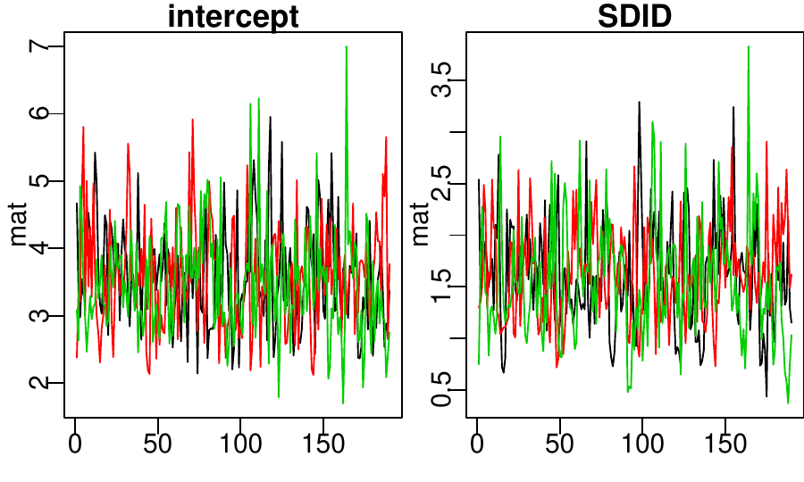
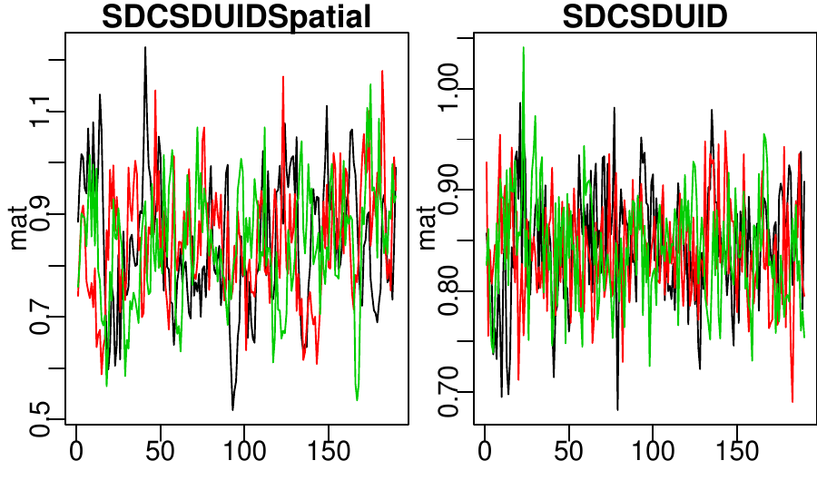
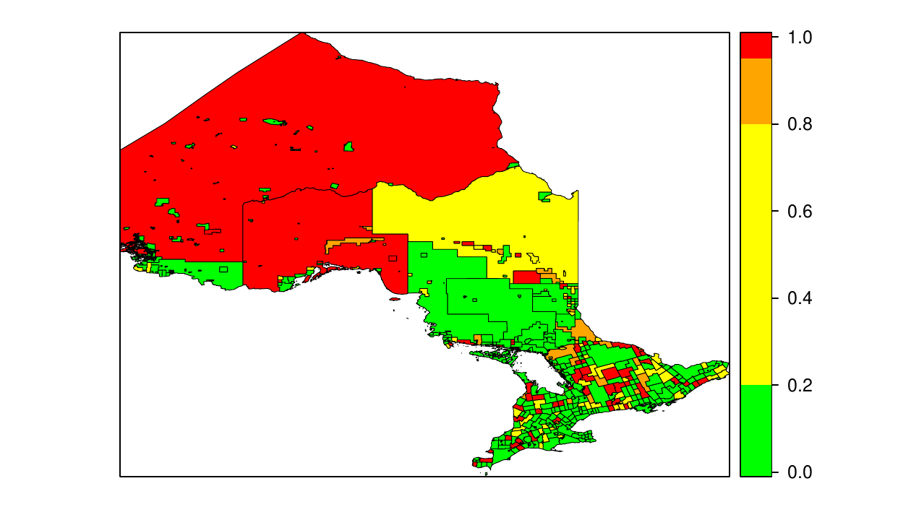

::: article
# Introduction

There are two steps in model fitting that are much more time consuming
in WinBUGS than in R. First, unbalanced multi-level data needs to be
formatted in a way that BUGS can handle, including changing categorical
variables to indicator variables. Second, a BUGS model file must be
written. The *glmmBUGS* package addresses these issues by allowing users
to specify models as formulas in R, as they would in the `glm` function,
and provides everything necessary for fitting the model with WinBUGS or
OpenBUGS via the *R2WinBUGS* package [@r2winbugs].

The *glmmBUGS* package creates the necessary BUGS model file, starting
value function, and suitably formatted data. Improved chain mixing is
accomplished with a simple reparametrization and the use of sensible
starting values. Functions are provided for formatting and summarizing
the results. Although a variety of models can be implemented entirely
within *glmmBUGS*, the package intends to provide a basic set of data
and files for users to modify as necessary. This allows the full
flexibility of BUGS model specification to be exploited, with much of
the initial "grunt work" being taken care of by *glmmBUGS*.

# Examples

## Independent random effects

Consider the bacteria data from the *MASS* package:

``` r
> library(MASS)
> data(bacteria)
> head(bacteria)
```

``` r
  y ap hilo week  ID     trt
1 y  p   hi    0 X01 placebo
2 y  p   hi    2 X01 placebo
3 y  p   hi    4 X01 placebo
4 y  p   hi   11 X01 placebo
5 y  a   hi    0 X02   drug+
6 y  a   hi    2 X02   drug+
```

The variables to be considered are: `y`, the presence or absence of
bacteria in a sample coded as `"y"` and `"n"` respectively; `week`, the
time of the observation; `ID`, the subject identifier; and `trt` giving
the treatment group as `"placebo"`, `"drug"`, or `"drug+"`.

A generalized linear mixed model is applied to the data with:

$$\begin{aligned}
  Y_{ij} &\sim  \text{Bernoulli}(p_{ij})\\ 
\mathop{\mathrm{logit}}(p_{ij}) &= \mu + x_{ij}\beta + V_{i}\\ 
V_{i} &\sim iid \text{\ N}(0, \sigma^2) 
\end{aligned} (\#eq:model)
$$ 

where: $Y_{ij}$ indicates the presence or absence of
bacteria of the $i$th person at week $j$; covariates $x_{ij}$ are week
and indicator variables for treatment; $p_{ij}$ denotes the probability
of bacteria presence; $V_i$ is the random effect for the $i$th patient,
assumed to be normal with mean $0$ and variance $\sigma^2$. To improve
the mixing of the Markov chain, a reparametrized model is fitted with:
$$ \begin{aligned}
  Y_{ij} &\sim  \text{Bernoulli}(p_{ij})\\ 
logit(p_{ij}) &= R_{i} + w_{ij} \gamma \\ 
R_{i} &\sim \text{N}(\mu + g_{i}\alpha, \sigma^2)
 \end{aligned} (\#eq:modelReparam)
$$ 

Here $g_i$ is the (indicator variable for) treatment
group for subject $i$ and $w_{ij}$ is the week that observation $j$ was
taken. Note that the two models are the same, with $V_i = R_{i} - \mu -
g_{i}\alpha$, $\beta = (\gamma, \alpha)$ and $x_{ij} = (w_{ij}, g_i)$.
The model in (\@ref(eq:model)) has strong negative dependence between
the posterior samples of $V_i$ and $\mu$, whereas $R_i$ and $\mu$ in
(\@ref(eq:modelReparam)) are largely independent.

As BUGS only allows numeric data, and cannot have the '+' sign in
variable names, the data are recoded as follows:

``` r
> bacterianew <- bacteria
> bacterianew$yInt = as.integer(bacterianew$y == 
+     "y")
> levels(bacterianew$trt) <- c("placebo", 
+     "drug", "drugplus")
```

The primary function in the package is `glmmBUGS`, which does the
preparatory work for fitting the model in (\@ref(eq:modelReparam)) with:

``` r
> library(glmmBUGS)
> bacrag <- glmmBUGS(formula = yInt ~ 
+     trt + week, data = bacterianew, 
+     effects = "ID", modelFile = "model.bug", 
+     family = "bernoulli")
```

This specifies `yInt` as a Bernoulli-valued response, `trt` and `week`
as fixed-effect covariates, and the `"ID"` column for the random
effects. The result is a list with three elements:

`ragged`

:   is a list containing the data to be passed to WinBUGS;

`pql`

:   is the result from fitting the model with the `glmmPQL` function in
    *MASS* package.

`startingValues`

:   is a list of starting values for the parameters and random effects,
    which is obtained from the `glmmPQL` result.

In addition, two files are written to the working directory

`model.bug`

:   is the BUGS model file

`getInits.R`

:   contains the R code for a function to generate random starting
    values.

To accommodate unbalanced designs, the data are stored as ragged arrays,
as described in the section "Handling unbalanced datasets" of the
WinBUGS manual [@winbugsmanual]. The `ragged` result has a vector
element `"SID"` indicating the starting position of each individual's
observations in the dataset. The covariates are split into elements
`"XID"` and `"Xobservations"` for the individual-level and
observation-level covariates respectively:

``` r
> names(bacrag$ragged)
```

``` r
[1] "NID"           "SID"          
[3] "yInt"          "XID"          
[5] "Xobservations"
```

The model file consists of an outer loop over `ID` levels and an inner
loop over observations. The details of how the model is implemented are
best understood by examining the `model.bug` file and consulting the
WinBUGS manual.

At this stage the user is expected to modify the files and, if
necessary, the data to refine the model, set appropriate priors, and
ensure suitability of starting values. Before using the `bugs` function
in the *R2WinBUGS* package to sample from the posterior, the starting
value function `getInits` must be prepared. First, the file `getInits.R`
(which contains the source for `getInits`) should be edited and sourced
into R. Next, the list containing the PQL-derived starting values must
be assigned the name `startingValues`, as `getInits` will be accessing
this object every time it is run.

``` r
> source("getInits.R")
> startingValues = bacrag$startingValues
> library(R2WinBUGS)
> bacResult = bugs(bacrag$ragged, getInits, 
+     model.file = "model.bug", n.chain = 3, 
+     n.iter = 2000, n.burnin = 100, 
+     parameters.to.save = names(getInits()), 
+     n.thin = 10)
```

## Post WinBUGS commands

After running WinBUGS, a series of functions in the *glmmBUGS* package
can be used to manipulate and check the simulation results. The
`restoreParams` function is used to restore the original parametrization
from (\@ref(eq:model)) and assign the original names to the group or
subject identifiers.

``` r
> bacParams = restoreParams(bacResult, 
+     bacrag$ragged)
> names(bacParams)
```

``` r
[1] "intercept" "SDID"      "deviance" 
[4] "RID"       "betas"    
```

The result is a set of posterior samples for $\mu$ (`intercept`),
$\sigma$ (`SDID`), all the $V_i$ (`RID`), and $\beta$ (`betas`).
Posterior means and credible intervals are obtained with the
`summaryChain` function.

``` r
> bacsummary = summaryChain(bacParams)
> names(bacsummary)
```

``` r
[1] "scalars" "RID"     "betas"  
```

``` r
> signif(bacsummary$betas[, c("mean", 
+     "2.5%", "97.5%")], 3)
```

``` r
               mean   2.5%   97.5%
observations -0.159 -0.263 -0.0614
trtdrug      -1.500 -3.240  0.0164
trtdrugplus  -0.920 -2.740  0.6060
```

``` r
> bacsummary$scalars[, c("mean", "2.5%", 
+     "97.5%")]
```

``` r
              mean     2.5%    97.5%
intercept 3.547556 2.243375 5.219125
SDID      1.597761 0.737010 2.716975
```

In order to check the convergence of the simulations, we use the
`checkChain` function to produce trace plots of the intercept and
$\sigma$ parameters.

``` r
> checkChain(bacParams, c("intercept", 
+     "SDID"))
```

{width="100%" alt="graphic without alt text"}

## A spatial example

The `ontario` dataset contains expected and observed cases of molar
cancer by census sub-division in Ontario, Canada.

``` r
> data(ontario)
> head(ontario)
```

``` r
         CSDUID observed logExpected
3501005 3501005       61    2.118865
3501011 3501011       50    1.971265
3501012 3501012      117    3.396444
3501020 3501020       65    1.919814
3501030 3501030       37    1.779957
3501042 3501042       16    1.182329
```

Consider the following model [see @GMRFbook]: 
$$
\begin{aligned}
  Y_{i} &\sim  \text{Poisson}(\lambda_i E_i)\\ 
\log(\lambda_{i}) &= \mu + U_i + V_i\\ 
U_i &\sim \text{GMRF}(\sigma_U^2)\\ 
V_i &\sim \text{iid N}(0, \sigma_V^2)
\end{aligned} (\#eq:spatial)
$$ 
where $Y_{i}$ and $E_i$ are the observed and expected
number of cancer cases in census division $i$; $\lambda_{i}$ is the
cancer incidence rate; the $U_i$ are spatial random effects, a Gaussian
Markov random field with variance $\sigma_U^2$; and $V_i$ are spatially
independent random effects with variance $\sigma_V^2$.

This model is reparametrised with $R_i = U_i + \mu+ V_i$ in place of
$V_i$. An adjacency matrix is required for the spatial random effect.
This was computed from the spatial boundary files with the `poly2nb`
function from the *spdep* package and is stored as the object
`popDataAdjMat`. The model can be fitted with `glmmBUGS` as follows:

``` r
> data(popDataAdjMat)
> forBugs = glmmBUGS(formula = observed + 
+     logExpected ~ 1, spatial = popDataAdjMat, 
+     effects = "CSDUID", family = "poisson", 
+     data = ontario)
```

Note that the expected counts are needed on the log scale, and are
passed as a second argument on the left side of the model equation to
denote their being offset parameters without a coefficient. The random
effect is at the census sub-division level (`CSDUID`), with
`popDataAdjMat` giving the dependency structure. Posterior samples can
be generated as follows:

``` r
> startingValues = forBugs$startingValues
> source("getInits.R")
> onResult = bugs(forBugs$ragged, getInits, 
+     model.file = "model.bug", n.chain = 3, 
+     n.iter = 2000, n.burnin = 100, 
+     parameters.to.save = names(getInits()), 
+     n.thin = 10)
> ontarioParams = restoreParams(onResult, 
+     forBugs$ragged)
> names(ontarioParams)
```

``` r
[1] "intercept"        "SDCSDUID"        
[3] "SDCSDUIDSpatial"  "deviance"        
[5] "RCSDUID"          "RCSDUIDSpatial"  
[7] "FittedRateCSDUID"
```

There are posterior simulations for two variance parameters, $\sigma_U$
(`SDCSDUIDSPATIAL`) and $\sigma_V$ (`SDCSDUID`). Samples for the random
effects are given for $U_i$ (`RCSDUIDSpatial`), $U_i +V_i$ (`RCSDUID`),
and $\lambda_i$ (`FittedRateCSDUID`). Trace plots are shown below for
$\sigma_U$ and $\sigma_V$, the standard deviations of the spatial and
non-spatial random effects.

``` r
> checkChain(ontarioParams, c("SDCSDUIDSpatial", 
+     "SDCSDUID"))
```

{width="100%" alt="graphic without alt text"} These trace plots
show poor mixing, and the Markov chain should be re-run with longer
chains and more thinning.

The posterior means for the relative risk $\lambda_i$ for Toronto and
Ottawa (Census Subdivisions 3506008 and 3530005) are extracted with:

``` r
> ontarioSummary = summaryChain(ontarioParams)
> ontarioSummary$FittedRateCSDUID[c("3506008", 
+     "3520005"), "mean"]
```

``` r
    3506008     3520005 
0.119725007 0.008148696 
```

The posterior probability of each region having a relative risk twice
the provincial average is computed with

``` r
> postProb = apply(ontarioParams$RCSDUID, 
+     3, function(x) mean(x > log(2)))
```

The `"RCSDUID"` element of `ontarioParams` is a three dimensional array,
with entry $i,j,k$ being iteration $i$ of chain $j$ for region $k$. The
`apply` statement computes the proportion of log-relative risks over
log(2) for each region (the third dimension).

The results can be merged into the original spatial dataset, as
described in the documentation for the *diseasemapping* package. Figure
[1](#fig:postprob) shows a map of the posterior probabilities.

<figure id="fig:postprob">

<figcaption>Figure 1: Posterior probabilities of Ontario census
sub-divisions having twice the provincial average risk of molar
cancer.</figcaption>
</figure>

## Additional features

The `reparam` argument to the `glmmBUGS` function reparametrizes the
intercept, and a set of covariates for a new baseline group is provided.
Recall that in the bacteria example the `ragged` object passed to
WinBUGS divides covariates into observation and ID level effects.
`ragged$Xobservations` is a vector and `ragged$XID` is a matrix of two
columns, which contains the week variable and indicator variables for
the treatments respectively. The `reparam` argument should accordingly
be a list with one or more of elements `"observations"` containing the
week or `"ID"` containing the two treatment indicators. Setting
`reparam=list(observations=2)` would make week 2 the baseline week,
rather than week zero. This argument is useful when using spline
functions as covariates, as the intercept parameter which WinBUGS
updates can be set to the curve evaluated in the middle of the dataset.

The `prefix` argument allows a character string to precede all data and
variable names. This can be used to combine multiple model files and
datasets into a single BUGS model, and modifying these files to allow
dependence between the various components. For instance, one random
effects model for blood pressure could be given `prefix=’blood’`, and a
model for body mass given `prefix=’mass’`. To allow for dependence
between the individual-level random effects for blood pressure and mass,
the two data sets and starting values produced by the `glmmBUGS`
function can be combined, and the two model files concatenated and
modified. Were it not for the prefix, some variable names would be
identical in the two datasets and combining would not be possible.

Finally, multi-level models can be accommodated by passing multiple
variable names in the `effects` argument. If the bacteria data were
collected from students nested within classes nested within schools, the
corresponding argument would be `effects = c("school","class","ID")`.

Currently unimplemented features that would enhance the package include:
random coefficients (specified with an `lmer`-type syntax); survival
distributions (with `"Surv"` objects as responses); and geostatistical
models for the random effects. As WinBUGS incorporates methods for all
of the above, these tasks are very feasible and offers of assistance
from the community would be gratefully accepted.

# Summary

There are a number of methods and R packages for performing Bayesian
inference on generalized linear mixed models, including *geoRglm*
[@georglm], *MCMCglmm* [@mcmcglmm] and *glmmGibbs* [@glmmgibbs].
Particularly noteworthy is the *INLA* package which avoids the use of
MCMC by using Laplace approximations, as described in @ruelaplace.
Despite this, many researchers working with R (including the authors)
continue to use WinBUGS for model fitting. This is at least partly due
to the flexibility of the BUGS language, which gives the user nearly
full control over specification of distributions and dependence
structures. This package aims to retain this flexibility by providing
files to be edited before model fitting is carried out, rather than
providing a large number of options for, i.e. prior distributions. More
model-specific packages such as *INLA* are entirely adequate (and
perhaps preferable) for the two examples presented here. Those who wish
to have full control over priors or build more complex models, for
example multivariate or errors-in-covariate models, will likely
appreciate the head start which the *glmmBUGS* package can provide for
these tasks.

# Acknowledgements

Patrick Brown holds a Discovery Grant from the Natural Sciences and
Engineering Research Council of Canada.

\

\
:::
