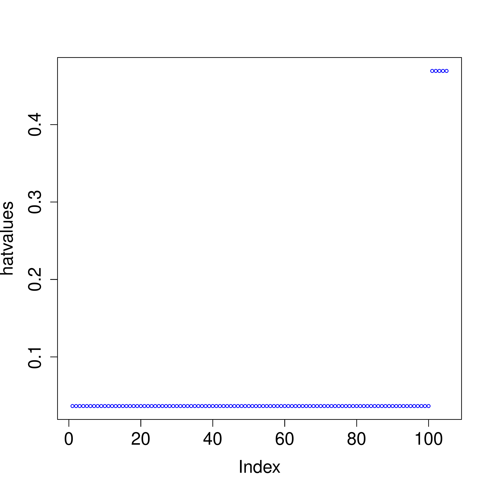
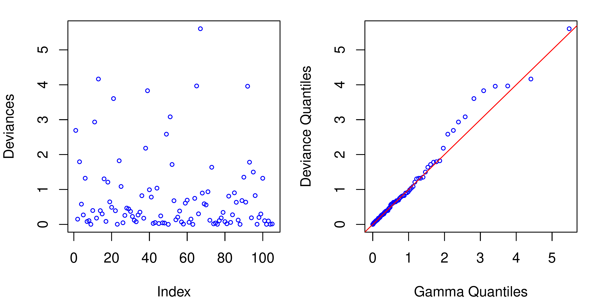
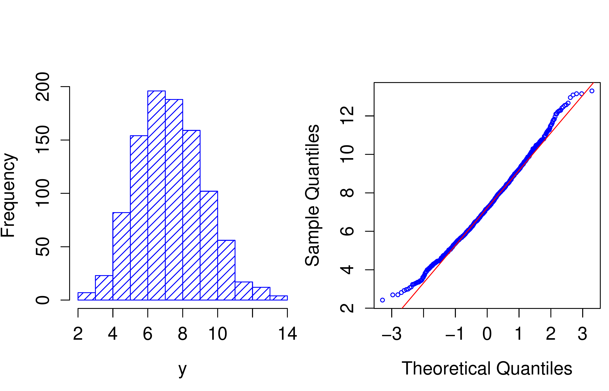

::: article
# Introduction

The [*hglm*](https://CRAN.R-project.org/package=hglm) package [@Alam10]
implements the estimation algorithm for hierarchical generalized linear
models [HGLM; @LeeNelder96]. The package fits generalized linear models
[GLM; @MN89] with random effects, where the random effect may come from
a distribution conjugate to one of the exponential-family distributions
(normal, gamma, beta or inverse-gamma). The user may explicitly specify
the design matrices both for the fixed and random effects. In
consequence, correlated random effects, as well as random regression
models can be fitted. The dispersion parameter can also be modeled with
fixed effects.

The main function is `hglm()` and the input is specified in a similar
manner as for `glm()`. For instance,

``` r
R> hglm(fixed = y ~ week, random = ~ 1|ID,
        family = binomial(link = logit))
```

fits a logit model for `y` with `week` as fixed effect and `ID`
representing the clusters for a normally distributed random intercept.
Given an `hglm` object, the standard generic functions are `print()`,
`summary()` and `plot()`.

Generalized linear mixed models (GLMM) have previously been implemented
in several R functions, such as the `lmer()` function in the
[*lme4*](https://CRAN.R-project.org/package=lme4) package [@Bate10] and
the `glmmPQL()` function in the
[*MASS*](https://CRAN.R-project.org/package=MASS) package [@Vena02]. In
GLMM, the random effects are assumed to be Gaussian whereas the `hglm()`
function allows other distributions to be specified for the random
effect. The `hglm()` function also extends the fitting algorithm of the
[*dglm*](https://CRAN.R-project.org/package=dglm) package [@Dunn09] by
including random effects in the linear predictor for the mean, i.e. it
extends the algorithm so that it can cope with mixed models. Moreover,
the model specification in `hglm()` can be given as a formula or
alternatively in terms of `y`, `X`, `Z` and `X.disp`. Here `y` is the
vector of observed responses, `X` and `Z` are the design matrices for
the fixed and random effects, respectively, in the linear predictor for
the means and `X.disp` is the design matrix for the fixed effects in the
dispersion parameter. This enables a more flexible modeling of the
random effects than specifying the model by an R formula. Consequently,
this option is not as user friendly but gives the user the possibility
to fit random regression models and random effects with known
correlation structure.

The [*hglm*](https://CRAN.R-project.org/package=hglm) package produces
estimates of fixed effects, random effects and variance components as
well as their standard errors. In the output it also produces
diagnostics such as deviance components and leverages.

# Three illustrating models

The [*hglm*](https://CRAN.R-project.org/package=hglm) package makes it
possible to

1.  include fixed effects in a model for the residual variance,

2.  fit models where the random effect distribution is not necessarily
    Gaussian,

3.  estimate variance components when we have correlated random effects.

Below we describe three models that can be fitted using `hglm()`, which
illustrate these three points. Later, in the Examples section, five
examples are presented that include the R syntax and output for the
`hglm()` function.

## Linear mixed model with fixed effects in the residual variance

We start by considering a normal-normal model with heteroscedastic
residual variance. In biology, for instance, this is important if we
wish to model a random genetic effect [e.g., @RC07] for a trait $y$,
where the residual variance differs between the sexes.

For the response $y$ and observation number $i$ we have:
$$\begin{aligned}
 y_{i}\mid\beta,u,\beta_{d}&\sim
 N\left(X_{i}\beta+Z_{i}u,\exp\left(X_{d,i}\beta_{d}\right)\right)\\
 u&\sim \textit{MVN}\left(0,\mathbf{I}\sigma_{u}^{2}\right)
\end{aligned}$$ where $\beta$ are the fixed effects in the mean part of
the model, the random effect $u$ represents random variation among
clusters of observations and $\beta_{d}$ is the fixed effect in the
residual variance part of the model. The variance of the random effect
$u$ is given by $\sigma_{u}^{2}$. The subscript $i$ for the matrices
$\mathbf{X}$, $\mathbf{Z}$, and $\mathbf{X}_{d}$ indicates the $i$'th
row. Here, a log link function is used for the residual variance and the
model for the residual variance is therefore given by
$\exp(X_{d,i}\beta_{d})$. In the more general GLM notation, the residual
variance here is described by the dispersion term $\phi$, so we have
$\log(\phi_{i})=X_{d,i}\beta_{d}$.

This model cannot be fitted with the
[*dglm*](https://CRAN.R-project.org/package=dglm) package, for instance,
because we have random effects in the mean part of the model. It is also
beyond the scope of the `lmer()` function since we allow a model for the
residual variance.

The implementation in `hglm()` for this model is demonstrated in Example
2 in the Examples section below.

## A Poisson model with gamma distributed random effects

For dependent count data it is common to model a Poisson distributed
response with a gamma distributed random effect [@LN06]. If we assume no
overdispersion conditional on $u$ and thereby have a fixed dispersion
term, this model may be specified as:
$$E\left(y_{i}\mid\beta,u\right)=\exp\left(X_{i}\beta+Z_{i}v\right)$$
where a level $j$ in the random effect $v$ is given by
$v_{j}=\log(u_{j})$ and $u_{j}$ are iid with gamma distribution having
mean and variance: $E(u_{j})=1$, $var(u_{j})=\lambda$.

This model can also be fitted with the
[*hglm*](https://CRAN.R-project.org/package=hglm) package, since it
extends existing GLMM functions (e.g. `lmer()`) to allow a non-normal
distribution for the random effect. Later on, in Example 3, we show the
`hglm()` code used for fitting a gamma-Poisson model with fixed effects
included in the dispersion parameter.

## A linear mixed model with a correlated random effect

In animal breeding it is important to estimate variance components prior
to ranking of animal performances [@LyWa97]. In such models the genetic
effect of each animal is modeled as a level in a random effect and the
correlation structure $\mathbf{A}$ is a matrix with known elements
calculated from the pedigree information. The model is given by
$$\begin{aligned}
    y_{i}\mid\beta,u&\sim N\left(\, X_{i}\beta+Z_{i}u,\sigma_{e}^{2}\right)\\
    u&\sim \textit{MVN}\left(0,\mathbf{A}\sigma_{u}^{2}\right)
\end{aligned}$$

This may be reformulated as [see @LN06; @RC07] $$\begin{aligned}
    y_{i}\mid\beta,u&\sim N\left(\,
        X_{i}\beta+Z_{i}^{*}u^{*},\sigma_{e}^{2}\right)\\
    u^{*}&\sim \textit{MVN}(0,\mathbf{I}\sigma_{u}^{2})
\end{aligned}$$ where $\mathbf{Z}^{*}=\mathbf{Z}\mathbf{L}$ and
$\mathbf{L}$ is the Cholesky factorization of $\mathbf{A}$.

Thus the model can be fitted using the `hglm()` function with a
user-specified input matrix `Z` (see R code in Example 4 below).

# Overview of the fitting algorithm

The fitting algorithm is described in detail in @LN06 and is summarized
as follows. Let $n$ be the number of observations and $k$ be the number
of levels in the random effect. The algorithm is then:

1.  Initialize starting values.

2.  Construct an augmented model with response $y_{aug}=\begin{pmatrix}
    y \\
    E(u)\end{pmatrix}.$

3.  Use a GLM to estimate $\beta$ and $v$ given the vector $\phi$ and
    the dispersion parameter for the random effect $\lambda$. Save the
    deviance components and leverages from the fitted model.

4.  Use a gamma GLM to estimate $\beta_{d}$ from the first $n$ deviance
    components $d$ and leverages $h$ obtained from the previous model.
    The response variable and weights for this model are $d/(1-h)$ and
    $(1-h)/2$, respectively. Update the dispersion parameter by putting
    $\phi$ equal to the predicted response values for this model.

5.  Use a similar GLM as in Step 4 to estimate $\lambda$ from the last
    $k$ deviance components and leverages obtained from the GLM in Step 3.

6.  Iterate between steps 3-5 until convergence.

For a more detailed description of the algorithm in a particular
context, see below.

# H-likelihood theory

Let $y$ be the response and $u$ an unobserved random effect. The
[*hglm*](https://CRAN.R-project.org/package=hglm) package fits a
hierarchical model $y\mid u\sim f_{m}(\mu,\phi)$ and
$u\sim f_{d}(\psi,\lambda)$ where $f_{m}$ and $f_{d}$ are specified
distributions for the mean and dispersion parts of the model.

We follow the notation of @LeeNelder96, which is based on the GLM
terminology by @MN89. We also follow the likelihood approach where the
model is described in terms of likelihoods. The conditional
(log-)likelihood for $y$ given $u$ has the form of a GLM
$$\ell(\theta',\phi;y\mid u)=\frac{y\theta'-b(\theta')}{a(\phi)}+c(y,\phi)$$
where $\theta'$ is the canonical parameter, $\phi$ is the dispersion
term, $\mu'$ is the conditional mean of $y$ given $u$ where
$\eta'=g(\mu')$, i.e. $g()$ is a link function for the GLM. The linear
predictor is given by $\eta'=\eta+v$ where $\eta=X\beta$ and $v=v(u)$
for some strict monotonic function of $u$. The link function $v(u)$
should be specified so that the random effects occur linearly in the
linear predictor to ensure meaningful inference from the h-likelihood
[@LNN07]. The or hierarchical likelihood is defined by
$$h=\ell(\theta',\phi;y\mid u)+\ell(\alpha;v)$$ where $\ell(\alpha;v)$
is the log density for $v$ with parameter $\alpha$. The estimates of
$\beta$ and $v$ are given by $\frac{\partial h}{\partial\beta}=0$ and
$\frac{\partial h}{\partial v}=0$. The dispersion components are
estimated by maximizing the
$$h_{p}=\left(h-\frac{1}{2}\log|-\frac{1}{2\pi}H|\right)_{\beta=\hat{\beta},v=\hat{v}}$$
where $H$ is the Hessian matrix of the h-likelihood. The dispersion term
$\phi$ can be connected to a linear predictor $X_{d}\beta_{d}$ given a
link function $g_{d}(\cdot)$ with $g_{d}(\phi)=X_{d}\beta_{d}$. The
adjusted profile likelihoods of $\ell$ and $h$ may be used for inference
of $\beta$, $v$ and the dispersion parameters $\phi$ and $\lambda$
[pp. 186 in @LN06]. More detail and discussion of h-likelihood theory is
presented in the [*hglm*](https://CRAN.R-project.org/package=hglm)
vignette.

## Detailed description of the hglm fitting algorithm for a linear mixed model with heteroscedastic residual variance

In this section we describe the fitting algorithm in detail for a linear
mixed model where fixed effects are included in the model for the
residual variance. The extension to distributions other than Gaussian is
described at the end of the section.

@LeeNelder96 showed that linear mixed models can be fitted using a
hierarchy of GLM by using an augmented linear model. The linear mixed
model $$\begin{aligned}
    y&=\mathbf{X}b+\mathbf{Z}u+e \\
    v&=\mathbf{Z}\mathbf{Z}^{T}\sigma_{u}^{2}+\mathbf{R}\sigma_{e}^{2}
\end{aligned}$$ where $\mathbf{R}$ is a diagonal matrix with elements
given by the estimated dispersion model (i.e. $\phi$ defined below). In
the first iteration of the HGLM algorithm, $\mathbf{R}$ is an identity
matrix. The model may be written as an augmented weighted linear model:

$$y_{a}=\mathbf{T}_{a}\delta+e_{a}
\label{eq:AugMod}  (\#eq:AugMod)  $$

where $$\begin{aligned}
    y_{a}&=\begin{pmatrix} y \\ 0_{q} \end{pmatrix}  &
    \mathbf{T}_{a}&=\begin{pmatrix} \mathbf{X} & \mathbf{Z}\\
        \mathbf{0} & \mathbf{I}_{q}\end{pmatrix} \\
    \delta&=\begin{pmatrix} b \\ u \end{pmatrix} &
    e_{a}&=\begin{pmatrix} e \\ -u \end{pmatrix}
\end{aligned}$$ Here, $q$ is the number of columns in $\mathbf{Z}$,
$0_{q}$ is a vector of zeros of length $q$, and $\mathbf{I}_{q}$ is the
identity matrix of size $q\times q$. The variance-covariance matrix of
the augmented residual vector is given by $$V(e_{a})=\begin{pmatrix}
\mathbf{R}\sigma_{e}^{2} & \mathbf{0}\\
\mathbf{0} & \mathbf{I}_{q}\sigma_{u}^{2}\end{pmatrix}$$ Given
$\sigma_{e}^{2}$ and $\sigma_{u}^{2}$, this weighted linear model gives
the same estimates of the fixed and random effects ($b$ and $u$
respectively) as Henderson's mixed model equations [@He76].

The estimates from weighted least squares are given by:
$$\mathbf{T}_{a}^{t}\mathbf{W}^{-1}\mathbf{T}_{a}\hat{\delta}=\mathbf{T}_{a}^{t}\mathbf{W}^{-1}y_{a}$$
where $\mathbf{W}\equiv V(e_{a})$.

The two variance components are estimated iteratively by applying a
gamma GLM to the residuals $e_{i}^{2}$ and $u_{i}^{2}$ with intercept
terms included in the linear predictors. The leverages $h_{i}$ for these
models are calculated from the diagonal elements of the hat matrix:

$$\mathbf{H}_{a}=\mathbf{T}_{a}(\mathbf{T}_{a}^{t}\mathbf{W}^{-1}\mathbf{T}_{a})^{-1}\mathbf{T}_{a}^{t}\mathbf{W}^{-1}
\label{eq:HatAug}  (\#eq:HatAug)  $$

A gamma GLM is used to fit the dispersion part of the model with
response $$y_{d,i}=e_{i}^{2}/(1-h_{i})$$ where $E(y_{d})=\mu_{d}$ and
$\mu_{d}\equiv\phi$ (i.e. $\sigma_{e}^{2}$ for a Gaussian reponse). The
GLM model for the dispersion parameter is then specified by the link
function $g_{d}(.)$ and the linear predictor $X_{d}\beta_{d}$, with
prior weights $(1-h_{i})/2$, for $$g_{d}(\mu_{d})=X_{d}\beta_{d}$$
Similarly, a gamma GLM is fitted to the dispersion term $\alpha$
(i.e. $\sigma_{u}^{2}$ for a GLMM) for the random effect $v$, with
$$y_{\alpha,j}=u_{j}^{2}/(1-h_{n+j}), j=1,2,...,q$$ and
$$g_{\alpha}(\mu_{\alpha})=\lambda$$ where the prior weights are
$(1-h_{n+j})/2$ and the estimated dispersion term for the random effect
is given by $\hat{\alpha}=g_{\alpha}^{-1}(\hat{\lambda})$.

The algorithm iterates by updating both
$\mathbf{R}=\textit{diag}(\hat{\phi})$ and $\sigma_u^2=\hat{\alpha}$,
and subsequently going back to Eq. (4).

For a non-Gaussian response variable $y$, the estimates are obtained
simply by fitting a GLM instead of Eq. (4) and by replacing $e_{i}^{2}$
and $u_{j}^{2}$ with the deviance components from the augmented model
[see @LN06].

# Implementation details

## Distributions and link functions

There are two important classes of models that can be fitted in
[*hglm*](https://CRAN.R-project.org/package=hglm): GLMM and conjugate
HGLM. GLMMs have Gaussian random effects. Conjugate HGLMs have been
commonly used partly due to the fact that explicit formulas for the
marginal likelihood exist. HGLMs may be used to fit models in survival
analysis (frailty models), where for instance the complementary-log-log
link function can be used on binary responses [see e.g., @CRR04]. The
gamma distribution plays an important role in modeling responses with a
constant coefficient of variation [see Chapter 8 in @MN89]. For such
responses with a gamma distributed random effect we have a gamma-gamma
model. A summary of the most important models is given in Tables
[1](#tab:Examples1a) and [3](#tab:Examples1b). Note that the
random-effect distribution can be an arbitrary conjugate
exponential-family distribution. For the specific case where the
random-effect distribution is a conjugate to the distribution of $y$,
this is called a . Further implementation details can be found in the
[*hglm*](https://CRAN.R-project.org/package=hglm) vignette.

::: {#tab:Examples1a}
  ---------------------------------------------------------------------------------------------------
  Model name            $y\mid u$ distribution    Link $g(\mu)$    $u$ distribution    Link $v(u)$
  --------------------- ------------------------- ---------------- ------------------- --------------
  Linear mixed model    Gaussian                  identity         Gaussian            identity

  Binomial conjugate    Binomial                  logit            Beta                logit

  Binomial GLMM         Binomial                  logit            Gaussian            identity

  Binomial frailty      Binomial                  comp-log-log     Gamma               log

  Poisson GLMM          Poisson                   log              Gaussian            identity

  Poisson conjugate     Poisson                   log              Gamma               log

  Gamma GLMM            Gamma                     log              Gaussian            identity

  Gamma conjugate       Gamma                     inverse          Inverse-Gamma       inverse

  Gamma-Gamma           Gamma                     log              Gamma               log
  ---------------------------------------------------------------------------------------------------

  : Table 1: Commonly used distributions and link functions possible to
  fit with `hglm()`
:::

[]{#tab:Examples1a label="tab:Examples1a"}

::: centering
::: {#tab:Examples1b}
  ------------------------------------------------------------------------------------------------
  Model name                Setting for `family` argument    Setting for `rand.family` argument
  ------------------------- -------------------------------- -------------------------------------
  Linear mixed model$^a$    `gaussian(link = identity)`      `gaussian(link = identity) `

  Beta-Binomial             `binomial(link = logit) `        `Beta(link = logit) `

  Binomial GLMM             `binomial(link = logit) `        `gaussian(link = identity) `

  Binomial frailty          `binomial(link = cloglog) `      `Gamma(link = log) `

  Poisson GLMM              `poisson(link = log) `           `gaussian(link = identity) `

  Poisson frailty           `poisson(link = log) `           `Gamma(link = log) `

  Gamma GLMM                `Gamma(link = log) `             `gaussian(link = identity) `

  Gamma conjugate           `Gamma(link = inverse) `         `inverse.gamma(link = inverse) `

  Gamma-Gamma               `Gamma(link = log) `             `Gamma(link = log) `
  ------------------------------------------------------------------------------------------------

  : Table 2: `hglm` code for commonly used models
:::

::: {#tab:Examples1b}
  -------------------------------------------------------------------------------------------
  $^a$For example, the `hglm()` code for a linear mixed model is

  `hglm(family = gaussian(link = identity), rand.family = gaussian(link = identity), ...)`
  -------------------------------------------------------------------------------------------

  : Table 3: `hglm` code for commonly used models
:::
:::

[]{#tab:Examples1b label="tab:Examples1b"}

## Possible future developments

In the current version of `hglm()` it is possible to include a single
random effect in the mean part of the model. An important development
would be to include several random effects in the mean part of the model
and also to include random effects in the dispersion parts of the model.
The latter class of models is called Double HGLM and has been shown to
be a useful tool for modeling heavy tailed distributions [@LeeNelder06].

The algorithm of `hglm()` gives true marginal likelihood estimates for
the fixed effects in conjugate HGLM [@LeeNelder96 pp. 629], whereas for
other models the estimates are approximated. Lee and co-workers [see
@LN06 and references therein] have developed higher-order
approximations, which are not implemented in the current version of the
[*hglm*](https://CRAN.R-project.org/package=hglm) package. For such
extensions, we refer to the commercially available GenStat software
[@Payne07], the recently available R package
[*HGLMMM*](https://CRAN.R-project.org/package=HGLMMM) [@Mola10] and also
to coming updates of [*hglm*](https://CRAN.R-project.org/package=hglm).

# Examples

## Example 1: A linear mixed model

#### Data description  {#data-description .unnumbered}

The output from the `hglm()` function for a linear mixed model is
compared to the results from the `lme()` function in the
[*nlme*](https://CRAN.R-project.org/package=nlme) [@Pinh09] package
using simulated data. In the simulated data there are five clusters with
20 observations in each cluster. For the mean part of the model, the
simulated intercept value is $\mu=0$, the variance for the random effect
is $\sigma_{u}^{2}=0.2$, and the residual variance is
$\sigma_{e}^{2}=1.0$ .

Both functions produce the same estimate of the fixed intercept effect
of 0.1473 (s.e. 0.16) and also the same variance component estimates.
The `summary.hglm()` function gives the estimate of the variance
component for the random intercept (0.082) as well as the residual
variance (0.84). It also gives the logarithm of the variance component
estimates together with standard errors below the lines
`Model estimates for the dispersion term` and
`Dispersion model for the random effects`. The `lme()` function gives
the square root of the variance component estimates.

The model diagnostics produced by the `plot.hglm` function are shown in
Figures [1](#fig:Figure1) and [2](#fig:Figure2). The data are completely
balanced and therefore produce equal leverages (hatvalues) for all
observations and also for all random effects (Figure [1](#fig:Figure1)).
Moreover, the assumption of the deviance components being gamma
distributed is acceptable (Figure [2](#fig:Figure2)).

<figure id="fig:Figure1">

<figcaption>Figure 1: Hatvalues (i.e. diagonal elements of the augmented
hat-matrix) for each observation 1 to 100, and for each level in the
random effect (index 101-105).</figcaption>
</figure>

<figure id="fig:Figure2">

<figcaption>Figure 2: Deviance diagnostics for each observation and each
level in the random effect.</figcaption>
</figure>

The R code and output for this example is as follows:

``` r
R> set.seed(123)
R> n.clus <- 5 #No. of clusters
R> n.per.clus <- 20  #No. of obs. per cluster
R> sigma2_u <- 0.2 #Variance of random effect
R> sigma2_e <- 1 #Residual variance
R> n <- n.clus*n.per.clus
R> X <- matrix(1, n, 1)
R> Z <- diag(n.clus)%x%rep(1, n.per.clus)
R> a <- rnorm(n.clus, 0, sqrt(sigma2_u))
R> e <- rnorm(n, 0, sqrt(sigma2_e))
R> mu <- 0
R> y <- mu + Z%*%a + e
R> lmm <- hglm(y = y, X = X, Z = Z)
R> summary(lmm)
R> plot(lmm)
```

::: footnotesize
``` r
Call: 
hglm.default(X = X, y = y, Z = Z)

DISPERSION MODEL
WARNING: h-likelihood estimates through EQL can be biased.
Model estimates for the dispersion term:[1] 0.8400608

Model estimates for the dispersion term: 
Link = log 
Effects:
  Estimate Std. Error 
   -0.1743     0.1441 

Dispersion = 1 is used in Gamma model on deviances 
to calculate the standard error(s).
Dispersion parameter for the random effects
[1] 0.08211

Dispersion model for the random effects: 
Link = log 
Effects:
  Estimate Std. Error 
   -2.4997     0.8682 

Dispersion = 1 is used in Gamma model on deviances 
to calculate the standard error(s).

MEAN MODEL
Summary of the fixed effects estimates 
    Estimate Std. Error t value Pr(>|t|)
X.1   0.1473     0.1580   0.933    0.353
Note: P-values are based on 96 degrees of freedom
Summary of the random effects estimate 
     Estimate Std. Error
[1,]  -0.3237     0.1971
[2,]  -0.0383     0.1971
[3,]   0.3108     0.1971
[4,]  -0.0572     0.1971
[5,]   0.1084     0.1971

EQL estimation converged in 5 iterations. 
```
:::

``` r
R> #Same analysis with the lme function
R> library(nlme)
R> clus <- rep(1:n.clus, 
+              rep(n.per.clus, n.clus))
R> summary(lme(y ~ 0 + X,
+              random = ~ 1 | clus))
```

::: footnotesize
``` r
Linear mixed-effects model fit by REML
Data: NULL 
      AIC      BIC    logLik
  278.635 286.4203 -136.3175

Random effects:
Formula: ~1 | clus
        (Intercept) Residual
StdDev:   0.2859608   0.9166

Fixed effects: y ~ 0 + X 
      Value Std.Error DF   t-value p-value
X 0.1473009 0.1573412 95 0.9361873  0.3516

Standardized Within-Group Residuals:
       Min         Q1        Med         Q3        Max 
-2.5834807 -0.6570612  0.0270673  0.6677986  2.1724148 

Number of Observations: 100
Number of Groups: 5 
```
:::

## Example 2: Analysis of simulated data for a linear mixed model with heteroscedastic residual variance

#### Data description  {#data-description-1 .unnumbered}

Here, a heteroscedastic residual variance is added to the simulated data
from the previous example. Given the explanatory variable $x_{d}$, the
simulated residual variance is 1.0 for $x_{d}=0$ and 2.72 for $x_{d}=1$.
The output shows that the variance of the random effect is 0.109, and
that $\hat{\beta}_{d}=(-0.32,1.47)$, i.e. the two residual variances are
estimated as 0.72 and 3.16. (Code continued from Example 1)

``` r
R> beta.disp <- 1
R> X_d <- matrix(1, n, 2)
R> X_d[,2] <- rbinom(n, 1, .5)
R> colnames(X_d) <- c("Intercept", "x_d")
R> e <- rnorm(n, 0, 
+       sqrt(sigma2_e*exp(beta.disp*X_d[,2])))
R> y <- mu + Z%*%a + e
R> summary(hglm(y = y, X = X, Z = Z, 
+               X.disp = X_d))
```

::: footnotesize
``` r
Call: 
hglm.default(X = X, y = y, Z = Z, X.disp = X_d)

DISPERSION MODEL
WARNING: h-likelihood estimates through EQL can be biased.
Model estimates for the dispersion term: 
Link = log 
Effects:
          Estimate Std. Error
Intercept  -0.3225     0.2040
x_d         1.4744     0.2881

Dispersion = 1 is used in Gamma model on deviances 
to calculate the standard error(s).
Dispersion parameter for the random effects
[1] 0.1093

Dispersion model for the random effects: 
Link = log 
Effects:
  Estimate Std. Error 
   -2.2135     0.8747 

Dispersion = 1 is used in Gamma model on deviances 
to calculate the standard error(s).
MEAN MODEL
Summary of the fixed effects estimates 
    Estimate Std. Error t value Pr(>|t|)
X.1  -0.0535     0.1836  -0.291    0.771
Note: P-values are based on 96 degrees of freedom
Summary of the random effects estimate 
     Estimate Std. Error
[1,]   0.0498     0.2341
[2,]  -0.2223     0.2276
[3,]   0.4404     0.2276
[4,]  -0.1786     0.2276
[5,]  -0.0893     0.2296

EQL estimation converged in 5 iterations. 
```
:::

## Example 3: Fitting a Poisson model with gamma random effects, and fixed effects in the dispersion term 

#### Data description  {#data-description-2 .unnumbered}

We simulate a Poisson model with random effects and estimate the
parameter in the dispersion term for an explanatory variable $x_{d}$.
The estimated dispersion parameter for the random effects is 0.6556.
(Code continued from Example 2)

``` r
R> u <- rgamma(n.clus,1)
R> eta <- exp(mu + Z%*%u)
R> y <- rpois(length(eta), eta)
R> gamma.pois <- hglm(y = y, X = X, Z = Z, 
+                     X.disp = X_d,
+                     family = poisson(
+                     link = log),
+                     rand.family =
+                     Gamma(link = log))
R> summary(gamma.pois)
```

::: footnotesize
``` r
Call: 
hglm.default(X = X, y = y, Z = Z, 
    family = poisson(link = log), 
    rand.family = Gamma(link = log), X.disp = X_d)

DISPERSION MODEL
WARNING: h-likelihood estimates through EQL can be biased.
Model estimates for the dispersion term: 
Link = log 
Effects:
          Estimate Std. Error
Intercept  -0.0186     0.2042
x_d         0.4087     0.2902

Dispersion = 1 is used in Gamma model on deviances
to calculate the standard error(s).
Dispersion parameter for the random effects
[1] 1.926

Dispersion model for the random effects: 
Link = log 
Effects:
  Estimate Std. Error 
    0.6556     0.7081 

Dispersion = 1 is used in Gamma model on deviances
to calculate the standard error(s).
MEAN MODEL
Summary of the fixed effects estimates 
    Estimate Std. Error t value Pr(>|t|)    
X.1   2.3363     0.6213    3.76 0.000293
---

Note: P-values are based on 95 degrees of freedom
Summary of the random effects estimate 
     Estimate Std. Error
[1,]   1.1443     0.6209
[2,]  -1.6482     0.6425
[3,]  -2.5183     0.6713
[4,]  -1.0243     0.6319
[5,]   0.2052     0.6232

EQL estimation converged in 3 iterations. 
```
:::

## Example 4: Incorporating correlated random effects in a linear mixed model - a genetics example

#### Data description  {#data-description-3 .unnumbered}

The data consists of 2025 individuals from two generations where 1000
individuals have observed trait values $y$ that are approximately normal
(Figure [3](#fig:Figure3)). The data we analyze was simulated for the
QTLMAS 2009 Workshop [@Coster09][^1]. A longitudinal growth trait was
simulated. For simplicity we analyze only the values given on the third
occasion at age 265 days.

<figure id="fig:Figure3">

<figcaption>Figure 3: Histogram and qqplot for the analyzed
trait.</figcaption>
</figure>

We fitted a model with a fixed intercept and a random animal effect,
$a$, where the correlation structure of $a$ is given by the additive
relationhip matrix $\mathbf{A}$ (which is obtained from the available
pedigree information). An incidence matrix $\mathbf{Z}_{0}$ was
constructed and relates observation number with id-number in the
pedigree. For observation $y_{i}$ coming from individual $j$ in the
ordered pedigree file $\mathbf{Z}_{0}[i,j]=1$, and all other elements
are 0. Let $\mathbf{L}$ be the Cholesky factorization of $\mathbf{A}$,
and $\mathbf{Z}=\mathbf{Z}_{0}\mathbf{L}$. The design matrix for the
fixed effects, $\mathbf{X}$, is a column of ones. The estimated variance
components are $\hat{\sigma}_{e}^{2}=2.21$ and
$\hat{\sigma}_{u}^{2}=1.50$.

The R code for this example is given below.

``` r
R> data(QTLMAS)
R> y <- QTLMAS[,1]
R> Z <- QTLMAS[,2:2026]
R> X <- matrix(1, 1000, 1)
R> animal.model <- hglm(y = y, X = X, Z = Z)              
R> print(animal.model)
```

::: footnotesize
``` r
Call: 
hglm.default(X = X, y = y, Z = Z)

Fixed effects:
     X.1 
7.279766 
Random effects: 
   [1] -1.191733707  1.648604776  1.319427376 -0.928258503
   [5] -0.471083317 -1.058333534  1.011451565  1.879641994
   [9]  0.611705900 -0.259125073 -1.426788944 -0.005165978
...

Dispersion parameter for the mean model:[1] 2.211169
Dispersion parameter for the random effects:[1] 1.502516

EQL estimation converged in 2 iterations  
```
:::

## Example 5: Binomial-beta model applied to seed germination data

#### Data description  {#data-description-4 .unnumbered}

The seed germination data presented by @Crowder78 has previously been
analyzed using a binomial GLMM [@BC93] and a binomial-beta HGLM
[@LeeNelder96]. The data consists of 831 observations from 21
germination plates. The effect of seed variety and type of root extract
was studied in a $2\times2$ factorial lay-out. We fit the binomial-beta
HGLM used by @LeeNelder96 and setting `fix.disp = 1` in `hglm()`
produces comparable estimates to the ones obtained by Lee and Nelder
(with differences $<2\times 10^{-3}$). The beta distribution parameter
$\alpha$ in @LeeNelder96 was defined as $1/(2a)$ where $a$ is the
dispersion term obtained from `hglm()`. The output from the R code given
below gives $\hat{a}=0.0248$ and the corresponding estimate given in
@LeeNelder96 is $\hat{a}=1/(2\hat{\alpha})=0.023$. We conclude that the
[*hglm*](https://CRAN.R-project.org/package=hglm) package produces
similar results as the ones presented in @LeeNelder96 and the dispersion
parameters estimated using the EQL method in GenStat differ by less than
1%. Additional examples, together with comparisons to estimates produced
by GenStat, are given in the
[*hglm*](https://CRAN.R-project.org/package=hglm) vignette included in
the package on CRAN.

``` r
R> data(seeds)
R> germ <- hglm(
+    fixed = r/n ~ extract*I(seed=="O73"), 
+    weights = n, data = seeds, 
+    random = ~1|plate, family = binomial(),
+    rand.family = Beta(), fix.disp = 1)
R> summary(germ)
```

::: footnotesize
``` r
Call: 
hglm.formula(family = binomial(), rand.family = Beta(), 
    fixed = r/n ~ extract * I(seed == "O73"), 
    random = ~1 | plate, data = seeds, 
    weights = n, fix.disp = 1)

DISPERSION MODEL
WARNING: h-likelihood estimates through EQL can be biased.
Model estimates for the dispersion term:[1] 1

Model estimates for the dispersion term: 
Link = log 
Effects:
[1] 1

Dispersion = 1 is used in Gamma model on deviances to
calculate the standard error(s).
Dispersion parameter for the random effects
[1] 0.02483

Dispersion model for the random effects: 
Link = log 

Effects:
  Estimate Std. Error 
   -3.6956     0.5304 

Dispersion = 1 is used in Gamma model on deviances to
calculate the standard error(s).
MEAN MODEL
Summary of the fixed effects estimates 
                               Estimate Std. Error t value
(Intercept)                     -0.5421    0.1928  -2.811
extractCucumber                  1.3386    0.2733   4.898
I(seed == "O73")TRUE             0.0751    0.3114   0.241
extractCucumber:I(seed=="O73")  -0.8257    0.4341  -1.902
                                Pr(>|t|)    
(Intercept)                     0.018429
extractCucumber                 0.000625
I(seed == "O73")TRUE            0.814264    
extractCucumber:I(seed=="O73")  0.086343
---

Note: P-values are based on 10 degrees of freedom
Summary of the random effects estimate 
      Estimate Std. Error
 [1,]  -0.2333     0.2510
 [2,]   0.0085     0.2328
 ...
[21,]  -0.0499     0.2953

EQL estimation converged in 7 iterations.
```
:::

# Summary

The hierarchical generalized linear model approach offers new
possibilities to fit generalized linear models with random effects. The
[*hglm*](https://CRAN.R-project.org/package=hglm) package extends
existing GLMM fitting algorithms to include fixed effects in a model for
the residual variance, fits models where the random effect distribution
is not necessarily Gaussian and estimates variance components for
correlated random effects. For such models there are important
applications in, for instance: genetics [@Noh06], survival analysis
[@HaLee05], credit risk modeling [@AlCa08], count data [@LN06] and
dichotomous responses [@Noh07]. We therefore expect that this new
package will be of use for applied statisticians in several different
fields.
:::

[^1]: `http://www.qtlmas2009.wur.nl/UK/Dataset`
