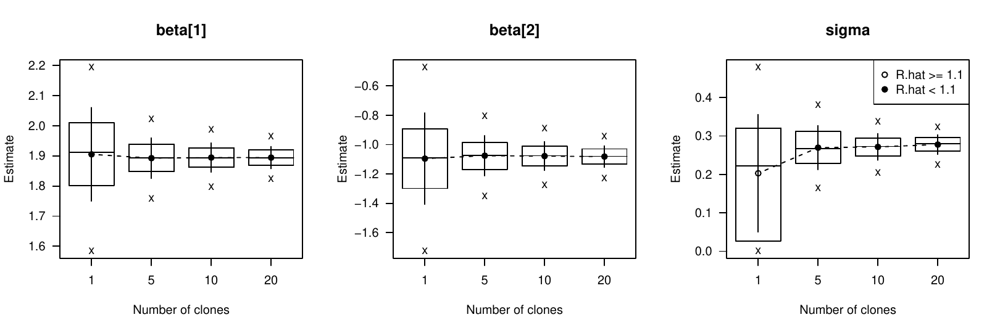
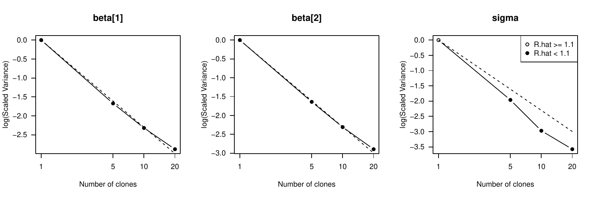
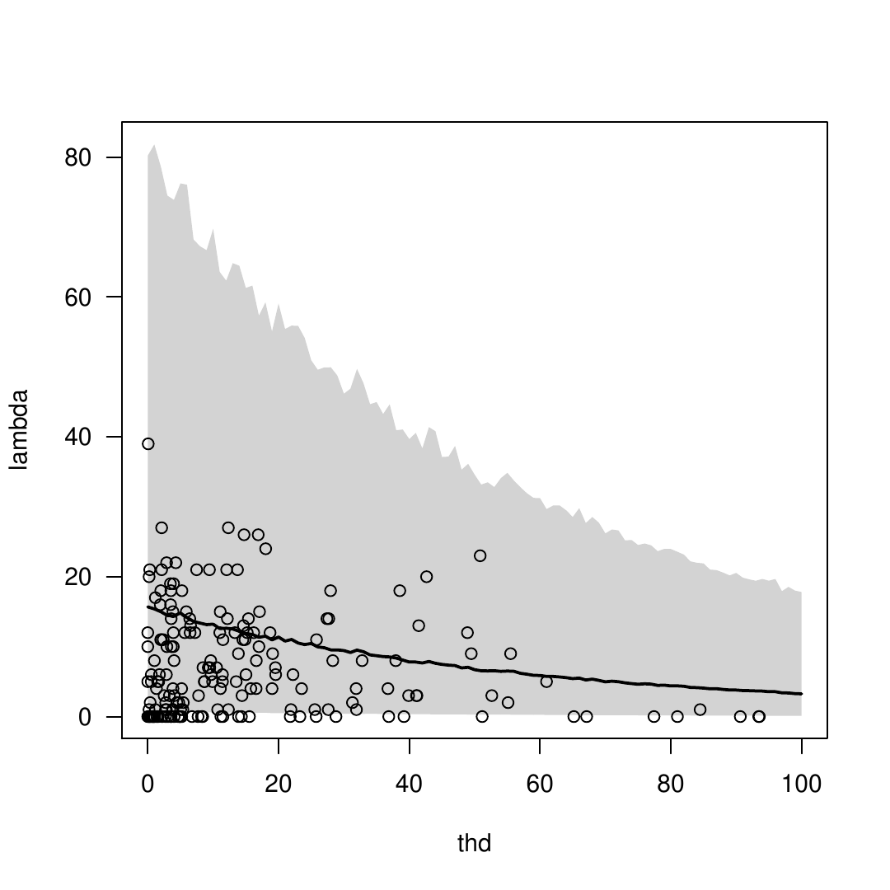

::: article
# Introduction

Hierarchical models, including generalized linear models with mixed
random and fixed effects, are increasingly popular. The rapid expansion
of applications is largely due to the advancement of the Markov Chain
Monte Carlo (MCMC) algorithms and related software
[@Gelman:2003; @{Gilks;Richardson;Spiegelhalter:1996}; @Lunn2009]. Data
cloning is a statistical computing method introduced by @Lele2007. It
exploits the computational simplicity of the MCMC algorithms used in the
Bayesian statistical framework, but it provides the maximum likelihood
point estimates and their standard errors for complex hierarchical
models. The use of the data cloning algorithm is especially valuable for
complex models, where the number of unknowns increases with sample size
(i.e. with latent variables), because inference and prediction
procedures are often hard to implement in such situations.

The [*dclone*](https://CRAN.R-project.org/package=dclone) R package
[@Solymos2010] provides infrastructure for data cloning. Users who are
familiar with Bayesian methodology can instantly use the package for
maximum likelihood inference and prediction. Developers of R packages
can build on the low level functionality provided by the package to
implement more specific higher level estimation procedures for users who
are not familiar with Bayesian methodology. This paper demonstrates the
implementation of the data cloning algorithm, and presents a case study
on how to write high level functions for specific modeling problems.

# Theory of data cloning

Imagine a hypothetical situation where an experiment is repeated by $k$
different observers, and all $k$ experiments happen to result in exactly
the same set of observations, $y^{(k)} = \left(y,y,\ldots,y\right)$. The
likelihood function based on the combination of the data from these $k$
experiments is
$L(\theta, y^{\left(k\right)}) = \left[L\left(\theta, y\right)\right]^k$.
The location of the maximum of $L(\theta,y^{(k)})$ exactly equals the
location of the maximum of the function $L\left(\theta, y\right)$, and
the Fisher information matrix based on this likelihood is $k$ times the
Fisher information matrix based on $L\left(\theta, y\right)$.

One can use MCMC methods to calculate the posterior distribution of the
model parameters ($\theta$) conditional on the data. Under regularity
conditions, if $k$ is large, the posterior distribution corresponding to
$k$ clones of the observations is approximately normal with mean
$\hat{\theta}$ and variance $1/k$ times the inverse of the Fisher
information matrix. When $k$ is large, the mean of this posterior
distribution is the maximum likelihood estimate and $k$ times the
posterior variance is the corresponding asymptotic variance of the
maximum likelihood estimate if the parameter space is continuous. When
some of the parameters are on the boundaries of their feasible space
[@StramLee1994], point estimates can be correct, but currently the
Fisher information cannot be estimated correctly by using data cloning.
This is an area for further research, but such situations challenge
other computing techniques as well.

Data cloning is a computational algorithm to compute maximum likelihood
estimates and the inverse of the Fisher information matrix, and is
related to simulated annealing [@Brooks1995]. By using data cloning, the
statistical accuracy of the estimator remains a function of the sample
size and not of the number of cloned copies. Data cloning does not
improve the statistical accuracy of the estimator by artificially
increasing the sample size. The data cloning procedure avoids the
analytical or numerical evaluation of high dimensional integrals,
numerical optimization of the likelihood function, and numerical
computation of the curvature of the likelihood function. Interested
readers should consult @Lele2007 [@Lele2010] for more details and
mathematical proofs for the data cloning algorithm.

# The data cloning algorithm

Consider the following Poisson generalized linear mixed model (GLMM)
with a random intercept for i.i.d. observations of $Y_{i}$ counts from
$i = 1,2,\ldots,n$ localities: $$\begin{aligned}
\alpha_{i} & \sim  \mathrm{normal}\left(0, \sigma^2\right)\\
\lambda_{i} & =  \exp\left(\alpha_{i} + \boldsymbol{X}_i^{\mathsf{T}}\boldsymbol{\beta}\right)\\
Y_{i} \mid \lambda_{i} & \sim \mathrm{Poisson}\left(\lambda_{i}\right)
\end{aligned}$$ The corresponding code for the simulation with
$\boldsymbol{\beta} = \left(1.8, -0.9\right)$, $\sigma=0.2$,
$x_{i} \sim \mathrm{U}\left(0, 1\right)$ is:

``` r
> library(dclone)
> set.seed(1234)
> n <- 50
> beta <- c(1.8, -0.9)
> sigma <- 0.2
> x <- runif(n, min = 0, max = 1)
> X <- model.matrix(~ x)
> alpha <- rnorm(n, mean = 0, sd = sigma)
> lambda <- exp(alpha + drop(X %*% beta))
> Y <- rpois(n, lambda)
```

The first step in the data cloning algorithm is to construct the full
Bayesian model of the problem with proper prior distributions for
unknown parameters. We use flat normal priors for $\beta$s and for
$\log\left(\sigma\right)$. First we use the
[*rjags*](https://CRAN.R-project.org/package=rjags) [@Plummer2009rjags]
and [*coda*](https://CRAN.R-project.org/package=coda) [@Plummer2008coda]
R packages and the JAGS [@Plummer2009JAGS] software for model fitting.
But the [*dclone*](https://CRAN.R-project.org/package=dclone) package
also supports WinBUGS [@Spiegelhalter2003WinBUGS] and OpenBUGS
[@Spiegelhalter2007OpenBUGS] via the R packages
[*R2WinBUGS*](https://CRAN.R-project.org/package=R2WinBUGS)
[@Sturtz2005] and [*BRugs*](https://CRAN.R-project.org/package=BRugs)
[@Thomas2006], respectively. The corresponding model in the BUGS
language is:

``` r
> glmm.model <- function() {
+    for (i in 1:n) {
+       Y[i] ~ dpois(lambda[i])
+       lambda[i] <- exp(alpha[i] +
+          inprod(X[i,], beta[1,]))
+       alpha[i] ~ dnorm(0, tau)
+    }
+    for (j in 1:np) {
+       beta[1,j] ~ dnorm(0, 0.001)
+    }
+    log.sigma ~ dnorm(0, 0.001)
+    sigma <- exp(log.sigma)
+    tau <- 1 / pow(sigma, 2)
+ }
```

Note that instead of writing the model into a file, we store it as an R
function (see JAGS and WinBUGS documentation for how to correctly
specify the model in the BUGS language). Although the BUGS and R
syntaxes seem similar, the BUGS model function cannot be evaluated
within R. Storing the BUGS model as an R function is handy, because the
user does not have to manage different files when modeling.
Nevertheless, the model can be supplied in a separate file by giving its
name as character.

We also have to define the data as elements of a named list along with
the names of nodes that we want to monitor (we can also set up initial
values, number of burn-in iterations, number of iterations for the
posterior sample, thinning values, etc.; see
[*dclone*](https://CRAN.R-project.org/package=dclone) package
documentation for details). Now we can do the Bayesian inference by
calling the `jags.fit` function:

``` r
> dat <- list(Y = Y, X = X, n = n,
+    np = ncol(X))
> mod <- jags.fit(dat, 
+    c("beta", "sigma"), glmm.model, n.iter = 1000)
```

The output `mod` is an `"mcmc.list"` object, which can be explored by
methods such as `summary` or `plot` provided by the
[*coda*](https://CRAN.R-project.org/package=coda) package.

The [*dclone*](https://CRAN.R-project.org/package=dclone) package
provides the `bugs.fit` wrapper function for WinBUGS/OpenBUGS. The BUGS
model needs to be changed to run smoothly in WinBUGS/OpenBUGS:

``` r
> glmm.model.bugs <- function() {
+    for (i in 1:n) {
+       Y[i] ~ dpois(lambda[i])
+       lambda[i] <- exp(alpha[i] +
+          inprod(X[i,], beta[1,]))
+       alpha[i] ~ dnorm(0, tau) %_% I(-5, 5)
+    }
+    for (j in 1:np) {
+       beta[1,j] ~ dnorm(0, 0.01) %_% I(-5, 5)
+    }
+    log.sigma ~ dnorm(0, 0.01) %_% I(-5, 5)
+    sigma <- exp(log.sigma)
+    tau <- 1 / pow(sigma, 2)
+ }
```

In the `bugs.fit` function, the settings besides the `data`, `params`,
`model`, and `inits` arguments follow the settings in the
`bugs`/`openbugs` functions in the
[*R2WinBUGS*](https://CRAN.R-project.org/package=R2WinBUGS) package.
This leads to some differences between the arguments of the `jags.fit`
and the `bugs.fit` functions. For example `bugs.fit` uses `n.thin`
instead of `thin`, and `n.burnin` is equivalent to `n.adapt + n.update`
as compared to `jags.fit`. The `bugs.fit` can return the results either
in `"mcmc.list"` or `"bugs"` format. The reason for leaving different
arguments for `jags.fit` and `bugs.fit` is that the aim of the
[*dclone*](https://CRAN.R-project.org/package=dclone) package is not to
make the MCMC platforms interchangeable, but to provide data cloning
facility for each. It is easy to adapt an existing BUGS code for data
cloning, but it sometimes can be tricky to adapt a JAGS code to WinBUGS
and vice versa, because of differences between the two dialects
(i.e. truncation, censoring, autoregressive priors, etc., see
@Plummer2009rjags).

Here are the results from the three MCMC platforms:

``` r
> mod.wb <- bugs.fit(dat, c("beta", "sigma"), 
+    glmm.model.bugs, DIC = FALSE, n.thin = 1)
> mod.ob <- bugs.fit(dat, c("beta", "sigma"), 
+    glmm.model.bugs, program = "openbugs", 
+    DIC = FALSE, n.thin = 1)
```

``` r
> sapply(list(JAGS = mod, WinBUGS = mod.wb, 
+    OpenBUGS = mod.ob), coef)
```

``` r
          JAGS WinBUGS OpenBUGS
beta[1]  1.893   1.910   1.9037
beta[2] -1.050  -1.074  -1.0375
sigma    0.161   0.130   0.0732
```

The idea in the next step of the data cloning algorithm is that instead
of using the likelihood for the observed data, we use the likelihood
corresponding to $k$ copies (clones) of the data. Actually cloning
(repeating) the data $k$ times is important if the model includes
unobserved (latent) variables: in this way latent variables are cloned
as well, thus contributing to the likelihood. We can use the `rep`
function to repeat the data vectors, but it is less convenient for
e.g. matrices or data frames. Thus, there is the `dclone` generic
function with methods for various R object classes:

``` r
> dclone(1:5, 1)
```

``` r
[1] 1 2 3 4 5
```

``` r
> dclone(1:5, 2)
```

``` r
 [1] 1 2 3 4 5 1 2 3 4 5
attr(,"n.clones")
[1] 2
attr(,"n.clones")attr(,"method")
[1] "rep"
```

``` r
> dclone(matrix(1:4, 2, 2), 2)
```

``` r
     [,1] [,2]
[1,]    1    3
[2,]    2    4
[3,]    1    3
[4,]    2    4
attr(,"n.clones")
[1] 2
attr(,"n.clones")attr(,"method")
[1] "rep"
```

``` r
> dclone(data.frame(a=1:2, b=3:4), 2)
```

``` r
    a b
1_1 1 3
2_1 2 4
1_2 1 3
2_2 2 4
```

The number of clones can be extracted by the `nclones` function; it
returns `NULL` for $k=1$ and $k$ otherwise.

The BUGS data specification might contain some elements that we do not
want to clone (e.g. `"np"`, the number of columns of the design matrix
in this case). Thus the `dclone` method has different behaviour for
lists, than for non list classes (including data frames). We can define
which elements should not be cloned, or which should be multiplied by
$k$ instead of being cloned $k$ times.

``` r
> dat2 <- dclone(dat, n.clones = 2, 
+     multiply = "n", unchanged = "np")
> nclones(dat2)
```

``` r
[1] 2
attr(,"method")
      Y       X       n      np 
  "rep"   "rep" "multi"      NA 
```

The `"method"` attribute of the cloned object stores this information.
There are three different ways of cloning (besides `NA` standing for
unchanged): `"rep"` is for (longitudinal) repetitions, `"multi"` is for
multiplication, and `"dim"` is repeating the data along an extra
dimension (see later).

Now we do the model fitting with $k=2$. The `"mcmc.list"` object
inherits the information about the cloning:

``` r
> mod2 <- jags.fit(dat2, 
+    c("beta", "sigma"), glmm.model, n.iter = 1000)
```

Similarly, the `bugs.fit` function takes care of the cloning information
passed through the data argument:

``` r
> mod.wb2 <- bugs.fit(dat2, c("beta", "sigma"), 
+    glmm.model.bugs, DIC = FALSE, n.thin = 1)
> mod.ob2 <- bugs.fit(dat2, c("beta", "sigma"), 
+    glmm.model.bugs, program = "openbugs", 
+    DIC = FALSE, n.thin = 1)
```

And here are the results based on $k=2$ for the three MCMC platforms:

``` r
> sapply(list(JAGS = mod2, WinBUGS = mod.wb2, 
+    OpenBUGS = mod.ob2), coef)
```

``` r
          JAGS WinBUGS OpenBUGS
beta[1]  1.918   1.905    1.896
beta[2] -1.114  -1.080   -1.078
sigma    0.207   0.187    0.243
```

For some models, indexing can be more complex, and simple repetitions of
the data (`"rep"` method) are not appropriate. In case of non
independent data (time series or spatial autoregressive models), cloning
should be done over an extra dimension to ensure that clones are
independent. For this purpose, one can use the `dcdim` function:

``` r
> (obj <- dclone(dcdim(data.matrix(1:5)), 2))
```

``` r
     clone.1 clone.2
[1,]       1       1
[2,]       2       2
[3,]       3       3
[4,]       4       4
[5,]       5       5
attr(,"n.clones")
[1] 2
attr(,"n.clones")attr(,"method")
[1] "dim"
attr(,"n.clones")attr(,"method")attr(,"drop")
[1] TRUE
```

If data cloning consists of repetitions of the data, our BUGS model
usually does not need modifications. If we add an extra dimension to the
data, the BUGS model and the data specification must reflect the extra
dimension, too.

To demonstrate this, we consider a model and data set from
@Ponciano2009. They used the single-species population growth data from
laboratory experiments of @Gause1934 with *Paramecium aurelia*. Gause
initiated liquid cultures on day 0 at a concentration of two individuals
per 0.5 cm$^3$ of culture media. Then, on days 2--19, he took daily 0.5
cm$^3$ samples of the microbe cultures and counted the number of cells
in each sample. @Ponciano2009 fitted discrete time stochastic models of
population dynamics to describe Gause's data taking into account both
process noise and observation error. The Beverton-Holt model
incorporates a latent variable component ($N_t,~t=0,1,\ldots,q$) to
describe an unobserved time series of actual population abundance. The
latent variable component contains density dependence ($\beta$) and
stochastic process noise ($\sigma^2$). The model incorporates a Poisson
observation component to account for variability caused by sampling:
$$\begin{aligned}
\mu_{t} & =  \log(\lambda) + \log(N_{t-1}) - \log(1 + \beta N_{t-1})\\
\log(N_t) & \sim  \mathrm{normal}(\mu_t, \sigma^2)\\
Y_t \mid N_t & \sim  \mathrm{Poisson}(N_t)
\end{aligned}$$ $\lambda$ is the finite rate of increase in population
abundance. The corresponding BUGS model is:

``` r
> beverton.holt <- function() {
+    for (j in 1:k) {
+       for(i in 2:(n+1)){
+          Y[(i-1),j] ~ dpois(exp(log.N[i,j]))
+          log.N[i,j] ~ dnorm(mu[i,j], 1 / sigma^2)
+          mu[i,j] <- log(lambda) + log.N[(i-1),j] 
+              - log(1 + beta * exp(log.N[(i-1),j]))
+       }
+       log.N[1,j] ~ dnorm(mu0, 1 / sigma^2)
+    }
+    beta ~ dlnorm(-1, 1)
+    sigma ~ dlnorm(0, 1)
+    tmp ~ dlnorm(0, 1)
+    lambda <- tmp + 1
+    mu0 <- log(lambda) + log(2) - log(1 + beta * 2)
+ }
```

Note that besides the indexing for the time series, the model contains
another dimension for the clones. We define the data set by using the
`dcdim` method for cloning the observations. We include an element
`k = 1` that will be multiplied to indicate how many clones (columns)
are in the data, while `n` (number of observations) remains unchanged:

``` r
> paurelia <- c(17, 29, 39, 63, 185, 258, 267, 
+    392, 510, 570, 650, 560, 575, 650, 550, 
+    480, 520, 500)
> bhdat <- list(Y=dcdim(data.matrix(paurelia)),
+    n=length(paurelia), k=1)
> dcbhdat <- dclone(bhdat, n.clones = 5, 
+    multiply = "k", unchanged = "n")
```

``` r
> bhmod <- jags.fit(dcbhdat, 
+    c("lambda","beta","sigma"), beverton.holt, 
+    n.iter=1000)
```

``` r
> coef(bhmod)
```

``` r
   beta  lambda   sigma 
0.00218 2.18755 0.12777 
```

Results compare well with estimates in @Ponciano2009
($\hat{\beta} = 0.00235$, $\hat{\lambda} = 2.274$,
$\hat{\sigma} = 0.1274$).

# Iterative model fitting

We can use the `dc.fit` function to iteratively fit the same model with
various $k$ values as described in @Lele2010. The function takes similar
arguments to `dclone` and `jags.fit` (or `bugs.fit`, if
`flavour = "bugs"` is used). Because the information in the data
overrides the priors by increasing the number of clones, we can improve
MCMC convergence by making the priors more informative during the
iterative fitting process. We achieve this by modifying the BUGS model
for the Poisson GLMM example:

``` r
> glmm.model.up <- function() {
+    for (i in 1:n) {
+       Y[i] ~ dpois(lambda[i])
+       lambda[i] <- exp(alpha[i] + 
+          inprod(X[i,], beta[1,]))
+       alpha[i] ~ dnorm(0, 1/sigma^2)
+    }
+    for (j in 1:np) {
+       beta[1,j] ~ dnorm(pr[j,1], pr[j,2])
+    }
+    log.sigma ~ dnorm(pr[(np+1),1], pr[(np+1),2])
+    sigma <- exp(log.sigma)
+    tau <- 1 / pow(sigma, 2)
+ }
```

We also define a function to update the priors. The function returns
values for flat prior specification in the first iteration, and uses the
updated posterior means (via the `coef` method) and data cloning
standard errors (via the `dcsd` method) in the rest, because priors that
have large probability mass near the maximum likelihood estimate require
fewer clones to achieve the desired accuracy.

``` r
> upfun <- function(x) {
+    if (missing(x)) {
+       np <- ncol(X)
+       return(cbind(rep(0, np+1),
+           rep(0.001, np+1)))
+    } else {
+       ncl <- nclones(x)
+       if (is.null(ncl))
+          ncl <- 1
+       par <- coef(x)
+       se <- dcsd(x)
+       log.sigma <- mcmcapply(x[,"sigma"], log)
+       par[length(par)] <- mean(log.sigma)
+       se[length(se)] <- sd(log.sigma) * sqrt(ncl)
+       return(cbind(par, se))
+    }
+ }
```

Finally, we define prior specifications as part of the data (`"pr"`),
and provide the updating function in the `dc.fit` call:

``` r
> updat <- list(Y = Y, X = X, n = n, 
+    np = ncol(X), pr = upfun())
> k <- c(1, 5, 10, 20)
> dcmod <- dc.fit(updat, c("beta", "sigma"), 
+    glmm.model.up, n.clones = k, n.iter = 1000,
+    multiply = "n", unchanged = "np",
+    update = "pr", updatefun = upfun)
```

``` r
> summary(dcmod)
```

``` r
Iterations = 1001:2000
Thinning interval = 1 
Number of chains = 3 
Sample size per chain = 1000 
Number of clones = 20

1. Empirical mean and standard deviation for each
   variable, plus standard error of the mean:

          Mean     SD DC SD Naive SE
beta[1]  1.894 0.0368 0.164 0.000671
beta[2] -1.082 0.0734 0.328 0.001341
sigma    0.278 0.0256 0.114 0.000467
        Time-series SE R hat
beta[1]        0.00259  1.01
beta[2]        0.00546  1.01
sigma          0.00194  1.04

2. Quantiles for each variable:

          2.5%    25%   50%    75%  97.5%
beta[1]  1.823  1.869  1.89  1.920  1.964
beta[2] -1.230 -1.133 -1.08 -1.029 -0.943
sigma    0.226  0.260  0.28  0.296  0.323
```

The summary contains data cloning standard errors (`DC SD`) and
$\hat{R}$ values for MCMC chain convergence [@GelmanRubin1992].

# Diagnostics

We can see how the increase in the number of clones affects our
inferences on single nodes by using the `dctable` function. This
function retrieves the information stored during the iterative fitting
process (or can be used to compare more than one fitted model). Only the
last MCMC object is returned by `dc.fit`, but descriptive statistics of
the posterior distribution are stored in each step
(Figure [1](#fig:dct)). The asymptotic convergence can be visually
evaluated by plotting the posterior variances scaled by the variance for
the model at $k=1$ (or the smallest $k$). If scaled variances are
decreasing at a $1/k$ rate and have reached a lower bound (say $<0.05$),
the data cloning algorithm has converged. If scaled variances are not
decreasing at the proper rate, that might indicate identifiability
issues [@Lele2010]. On the log scale, this graph should show an
approximately linear decrease of log(scaled variance) vs. $\log(k)$ for
each parameter (Figure [2](#fig:dctsd)).

``` r
> dct <- dctable(dcmod)
> plot(dct)
```

<figure id="fig:dct">

<figcaption>Figure 1: Summary statistics for the Poisson mixed model
example. Means are converging towards the maximum likelihood estimates
(points), standard errors (vertical lines) are getting shorter with
increasing number of clones (95 and 50% quantile ranges and median also
depicted).</figcaption>
</figure>

``` r
> plot(dct, type="log.var")
```

<figure id="fig:dctsd">

<figcaption>Figure 2: Convergence diagnostics for data cloning based on
the Poisson mixed model example. Log of Scaled Variances should decrease
linearly with \log(k), the scaled variance value close to zero
(&lt;0.05) indicates convergence of the data cloning
algorithm.</figcaption>
</figure>

@Lele2010 introduced diagnostic measures for checking the convergence of
the data cloning algorithm which are based on the joint posterior
distribution and not only on single parameters. These include
calculating the largest eigenvalue of the posterior variance covariance
matrix (`lambdamax.diag`), or calculating the mean squared error and
another correlation-like fit statistic ($r^2$) based on a $\chi^2$
approximation (`chisq.diag` with a `plot` method). The maximum
eigenvalue reflects the degeneracy of the posterior distribution, while
the two fit measures reflect the adequacy of the normal approximation.
All three statistics should converge to zero as $k$ increases. If this
happens, different prior specifications are no longer influencing the
results [@Lele2007; @Lele2010].

These measures and multivariate $\hat{R}$ values for MCMC chain
convergence [@BrookGelman1997] are calculated during the iterations by
`dc.fit` as well, and can be retrieved by the function `dcdiag`:

``` r
> dcdiag(dcmod)
```

``` r
  n.clones lambda.max ms.error r.squared r.hat
1        1    0.11538   0.1282   0.02103  1.66
2        5    0.02225   0.0229   0.00277  1.02
3       10    0.01145   0.0383   0.00612  1.01
4       20    0.00643   0.0241   0.00173  1.03
```

The data cloning algorithm requires that MCMC chains are properly mixed
and the posterior distribution is nearly degenerate multivariate normal.
These requirements have been satisfied in the case of the Poisson GLMM
model. $\hat{R}$ values show better mixing properties of the MCMC chains
with higher $k$ values, and in this example it is expected, because we
have used informative priors near the maximum likelihood estimates for
the cases $k>1$.

The functions `dctable` and `dcdiag` can be used to determine the number
of clones required for a particular model and data set. Also, these
diagnostic functions can alert the modeller when the model contains
non-identifiable parameters. @Lele2010 gives several examples; here we
consider the normal-normal mixture: $$\begin{aligned}
\mu_{i} & \sim \mathrm{normal}(\gamma, \tau^2)\\
Y_{i} \mid \mu_i & \sim \mathrm{normal}(\mu_i, \sigma^2)
\end{aligned}$$ where the parameters ($\gamma, \sigma^2+\tau^2$) are
known to be identifiable, but ($\gamma, \sigma^2, \tau^2$) are not.

We simulate random observations under this model
($\gamma=2.5, \sigma=0.2, \tau=0.5$) and fit the corresponding BUGS
model:

``` r
> gamma <- 2.5
> sigma <- 0.2
> tau <- 0.5
> set.seed(2345)
> mu <- rnorm(n, gamma, tau)
> Y <- rnorm(n, mu, sigma)
> nn.model <- function() {
+    for (i in 1:n) {
+       Y[i] ~ dnorm(mu[i], prec1)
+       mu[i] ~ dnorm(gamma, prec2)
+    }
+    gamma ~ dnorm(0, 0.001)
+    log.sigma ~ dnorm(0, 0.001)
+    sigma <- exp(log.sigma)
+    prec1 <- 1 / pow(sigma, 2)
+    log.tau ~ dnorm(0, 0.001)
+    tau <- exp(log.tau)
+    prec2 <- 1 / pow(tau, 2)
+ }
> nndat <- list(Y = Y, n = n)
```

``` r
> nnmod <- dc.fit(nndat, c("gamma","sigma","tau"), 
+    nn.model, n.clones=c(1,10,20,30,40,50), 
+    n.iter=1000, multiply="n")
```

``` r
> dcdiag(nnmod)
```

``` r
  n.clones lambda.max ms.error r.squared r.hat
1        1     0.0312    0.508   0.02985  1.18
2       10     0.0364    0.275   0.00355  2.06
3       20     1.2617    1.111   0.13714 50.15
4       30     0.1530    0.753   0.10267 12.91
5       40     1.7972    0.232   0.03770 92.87
6       50     1.8634    0.241   0.04003 15.72
```

``` r
> vars <- mcmcapply(nnmod[,c("sigma","tau")],
+    array)^2
> sigma^2 + tau^2
```

``` r
[1] 0.29
```

``` r
> summary(rowSums(vars))
```

``` r
   Min. 1st Qu.  Median    Mean 3rd Qu.    Max. 
   0.21    0.23    2.87    3.00    6.04    6.84 
```

The high `r.hat` and the variable `lambda.max` and fit statistic values
that are not converging to zero indicate possible problems with
identifiability.

# Inference and prediction

We can explore the results with methods defined for `"mcmc.list"`
objects (many such methods are available in the
[*coda*](https://CRAN.R-project.org/package=coda) package,
e.g. `summary`, `plot`, etc.). The
[*dclone*](https://CRAN.R-project.org/package=dclone) package adds a few
more methods: `coef` returns the mean of the posterior, `dcsd` the data
cloning standard errors. Any function returning a scalar statistic can
be passed via the `mcmcapply` function:

``` r
> coef(dcmod)
```

``` r
beta[1] beta[2]   sigma 
  1.894  -1.082   0.278 
```

``` r
> dcsd(dcmod)
```

``` r
beta[1] beta[2]   sigma 
  0.164   0.328   0.114 
```

``` r
> mcmcapply(dcmod, sd) * sqrt(nclones(dcmod))
```

``` r
beta[1] beta[2]   sigma 
  0.164   0.328   0.114 
```

The asymptotic multivariate normality can be used to get Wald-type
confidence intervals for the estimates based on the inverse of the
Fisher information matrix. The `vcov` method returns the inverse Fisher
information matrix, the `confint` method calculates confidence intervals
assuming multivariate normality for MCMC objects with $k > 1$:

``` r
> confint(dcmod)
```

``` r
          2.5 % 97.5 %
beta[1]  1.5718  2.217
beta[2] -1.7253 -0.438
sigma    0.0534  0.502
```

``` r
> vcov(dcmod)
```

``` r
         beta[1]  beta[2]    sigma
beta[1]  0.02705 -0.04604 -0.00291
beta[2] -0.04604  0.10783 -0.00156
sigma   -0.00291 -0.00156  0.01308
```

Confidence intervals can also be obtained via parametric bootstrap or
based on profile likelihood [@Ponciano2009], but these are not currently
available in the [*dclone*](https://CRAN.R-project.org/package=dclone)
package and often require substantial user intervention.

These methods are handy when we make predictions. We can use the maximum
likelihood estimates and the variance-covariance matrix defined as a
multivariate normal node in the BUGS model. For the Poisson mixed model
example, the BUGS model for prediction will look like:

``` r
> glmm.pred <- function() {
+    for (i in 1:n) {
+       Y[i] ~ dpois(lambda[i])
+       lambda[i] <- exp(mu[i])
+       mu[i] <- alpha[i] + 
+          inprod(X[i,], beta[1,])
+       alpha[i] ~ dnorm(0, tau)
+    }
+    tmp[1:(np+1)] ~ dmnorm(param[], prec[,])
+    beta[1,1:np] <- tmp[1:np]
+    sigma <- tmp[(np+1)]
+    tau <- 1 / pow(sigma, 2)
+ }
```

Now we add the estimates and the precision matrix `prec` to the data
(the `make.symmetric` function prevents some problems related to matrix
symmetry and numerical precision), and define $\boldsymbol{X}$ for the
predictions (now we simply use the observed values of the covariates).
Then do the modeling as usual by sampling the node `"lambda"`:

``` r
> prec <- make.symmetric(solve(vcov(dcmod)))
> prdat <- list(X = X, n = nrow(X), np = ncol(X), 
+    param = coef(dcmod), prec = prec)
> prmod <- jags.fit(prdat, "lambda", glmm.pred, 
+    n.iter = 1000)
```

# Writing high level functions

Suppose we want to provide a user friendly function to fit the Poisson
mixed model with random intercept. We are now modeling the observed
abundances (`count` based on point counts) of the Ovenbird (*Seiurus
aurocapilla*) as a function of ecological site characteristics
(upland/lowland, `uplow`) and percentage of total human disturbance
around the sites (`thd` in the `ovenbird` data set). Data were collected
from 182 sites in the Northern Boreal region of Alberta, Canada, between
2003 and 2008. Data were collected by the Alberta Biodiversity
Monitoring Institute and are available at <http://www.abmi.ca>.

Our goal is to determine the effect of human disturbance on Ovenbird
abundance, by controlling for site characteristics. But we know that
other factors not taken into account, e.g. the amount of deciduous
forest, might influence the abundance as well [@Hobson2002]. So the
random intercept will account for this unexplained environmental
variability. The Poisson error component will account for random
deviations from expected abundances ($\lambda_{i}$) and observed counts
($Y_{i}$) represent a realization of this quantity.

Here is the high level function for fitting the Poisson mixed model
built on data cloning with a simple `print`, `summary` and `predict`
method:

``` r
> glmmPois <- function(formula, 
+ data = parent.frame(), n.clones, ...) {
+    lhs <- formula[[2]]
+    Y <- eval(lhs, data)
+    formula[[2]] <- NULL
+    rhs <- model.frame(formula, data)
+    X <- model.matrix(attr(rhs, "terms"), rhs)
+    dat <- list(n = length(Y), Y = Y, 
+       X = X, np = ncol(X))
+    dcdat <- dclone(dat, n.clones, 
+       multiply = "n", unchanged = "np")
+    mod <- jags.fit(dcdat, c("beta", "sigma"), 
+       glmm.model, ...)
+    coefs <- coef(mod)
+    names(coefs) <- c(colnames(X), 
+       "sigma")
+    rval <- list(coefficients = coefs,
+       call = match.call(),
+       mcmc = mod, y = Y, x = rhs, 
+       model = X, formula = formula)
+    class(rval) <- "glmmPois"
+    rval
+ }
> print.glmmPois <- function(x, ...) {
+    cat("glmmPois model\n\n")
+    print(format(coef(x), digits = 4), 
+       print.gap = 2, quote = FALSE)
+    cat("\n")
+    invisible(x)
+ }
> summary.glmmPois <- function(object, ...) {
+    x <- cbind("Estimate" = coef(object),
+       "Std. Error" = dcsd(object$mcmc),
+       confint(object$mcmc))
+    cat("Call:", deparse(object$call, 
+       width.cutoff = getOption("width")), 
+       "\n", sep="\n")
+    cat("glmmPois model\n\n")
+    printCoefmat(x, ...)
+    cat("\n")
+    invisible(x)
+ }
> predict.glmmPois <- function(object, 
+ newdata = NULL, type = c("mu", "lambda", "Y"), 
+ level = 0.95, ...){
+    prec <- solve(vcov(object$mcmc))
+    prec <- make.symmetric(prec)
+    param <- coef(object)
+    if (is.null(newdata)) {
+       X <- object$model
+    } else {
+       rhs <- model.frame(object$formula, newdata)
+       X <- model.matrix(attr(rhs, "terms"), rhs)
+    }
+    type <- match.arg(type)
+    prdat <- list(n = nrow(X), X = X, 
+       np = ncol(X), param = param, prec = prec)
+    prval <- jags.fit(prdat, type, glmm.pred, ...)
+    a <- (1 - level)/2
+    a <- c(a, 1 - a)
+    rval <- list(fit = coef(prval), 
+       ci.fit = quantile(prval, probs = a))
+    rval
+ }
```

Note that the functions `glmm.model` and `glmm.pred` containing the BUGS
code are used within these R functions. This implementation works fine,
but is not adequate when building a contributed R package, because
functions such as `dnorm` and `inprod` are not valid R objects, etc. For
R packages, the best way is to represent the BUGS model as a character
vector with lines as elements, and put that inside the R function. The
`custommodel` function of the
[*dclone*](https://CRAN.R-project.org/package=dclone) package can be
used to create such character vectors and pass them to other
[*dclone*](https://CRAN.R-project.org/package=dclone) functions via the
`model` argument.

Now we fit the model for the `ovenbird` data set to estimate the effect
of human disturbance on Ovenbird abundance. We fit the model using the
function `glmmPois`:

``` r
> data(ovenbird)
> obmod <- glmmPois(count ~ uplow + thd, 
+    ovenbird, n.clones = 5, n.update = 1000, 
+    n.iter = 1000)
```

Then print the object and inspect the summary,

``` r
> obmod
```

``` r
glmmPois model

 (Intercept)  uplowlowland           thd  
     2.00312      -1.34242      -0.01647  
       sigma  
     1.19318  
```

``` r
> summary(obmod)
```

``` r
Call:
glmmPois(formula = count ~ uplow + thd, data = ovenbird, 
    n.clones = 5, n.update = 1000, n.iter = 1000)


glmmPois model

             Estimate Std. Error    2.5 % 97.5 %
(Intercept)   2.00312    0.13767  1.73328   2.27
uplowlowland -1.34242    0.21503 -1.76387  -0.92
thd          -0.01647    0.00569 -0.02763  -0.01
sigma         1.19318    0.09523  1.00653   1.38
```

Finally predict abundances as a function of disturbance (0--100%) by
controlling for site characteristics (Figure [3](#fig:pred)):

``` r
> thd <- seq(0, 100, len = 101)
> ndata <- data.frame(uplow = rep("lowland", 
+    length(thd)), thd = thd)
> levels(ndata$uplow) <- levels(ovenbird$uplow)
> obpred <- predict(obmod, ndata, "lambda")
```

<figure id="fig:pred">

<figcaption>Figure 3: Expected Ovenbird abundance (lambda) as the
function of percentage human disturbance (thd) based on the Poisson
mixed model. Line represents the mean, gray shading indicates 95%
prediction intervals. Points are observations.</figcaption>
</figure>

Ovenbird abundance was significantly higher in upland sites, and human
disturbance had a significant negative effect on expected Ovenbird
abundance. Unexplained variation
($\sigma^2=$`<!-- -->`{=html}1.425 $\pm$  0.102 SE) was substantial,
thus the choice of the Poisson mixed model makes sense for this data
set.

# Summary

The data cloning algorithm is especially useful for complex models for
which other likelihood based computational methods fail. The algorithm
also can numerically reveal potential identifiability issues related to
hierarchical models. The
[*dclone*](https://CRAN.R-project.org/package=dclone) package supports
established MCMC software and provides low level functions to help
implementing high level estimating procedures to get maximum likelihood
inferences and predictions for more specialized problems based on the
data cloning algorithm.

# Acknowledgements

Subhash Lele, Khurram Nadeem and Gabor Grothendieck have provided
invaluable suggestions and feedback on this work. Comments of Martyn
Plummer and two anonymous reviewers greatly improved the quality of the
paper. Funding was provided by the Alberta Biodiversity Monitoring
Institute and the Natural Sciences and Engineering Research Council.
:::
