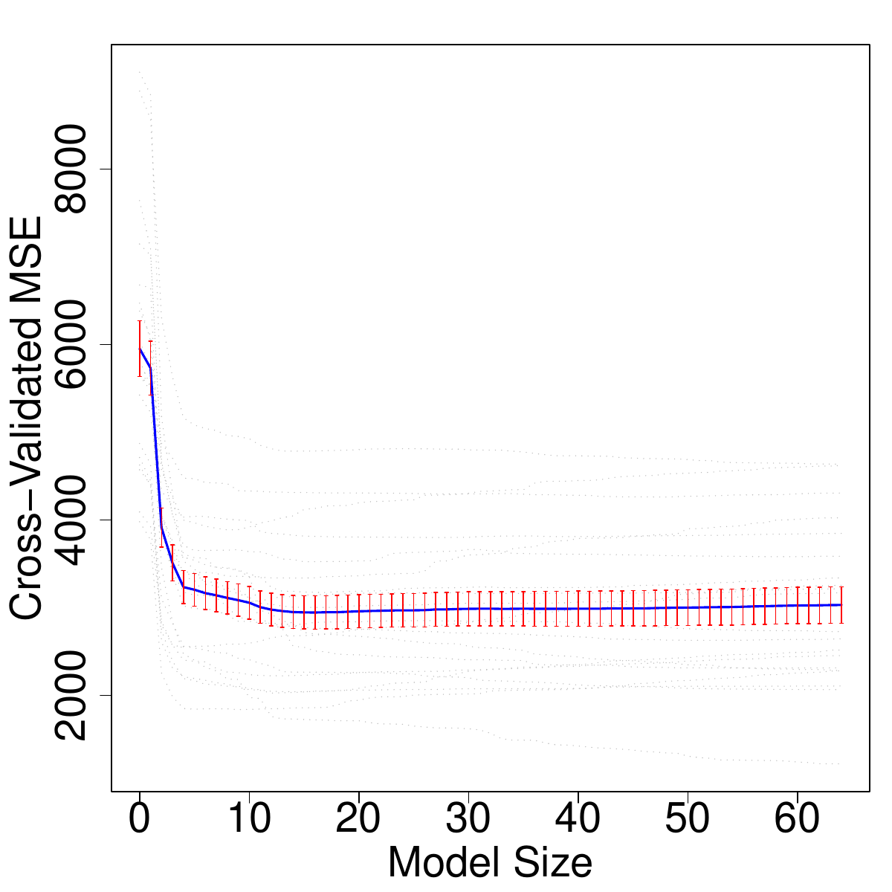
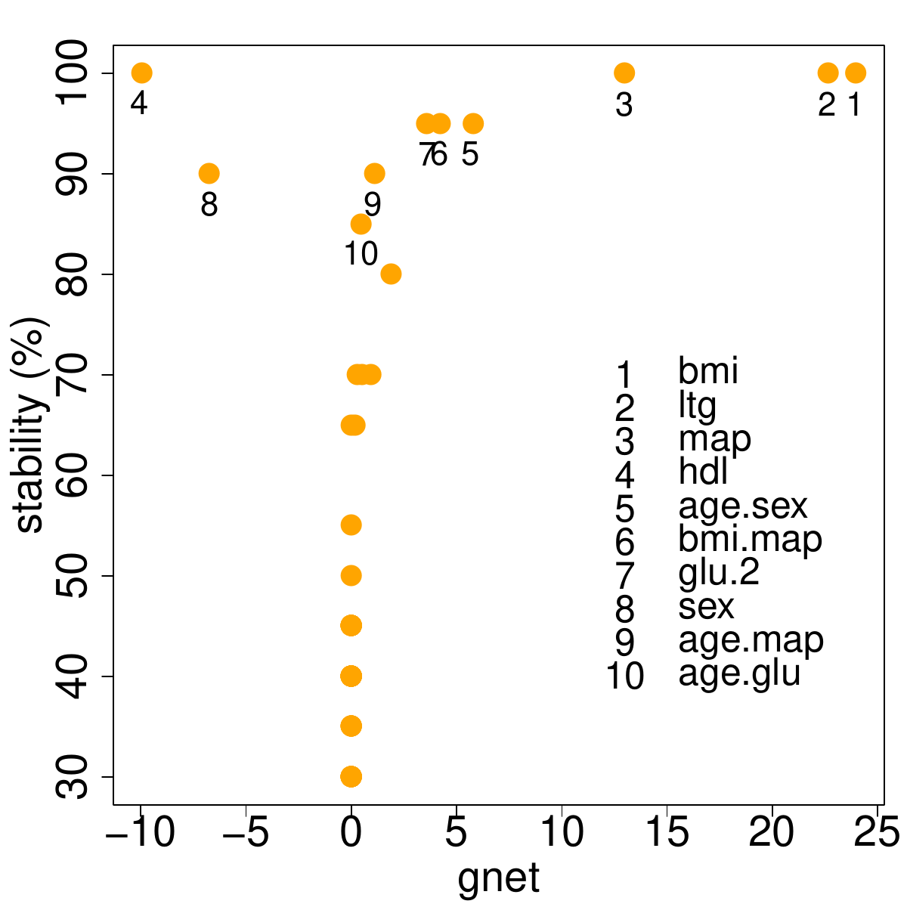
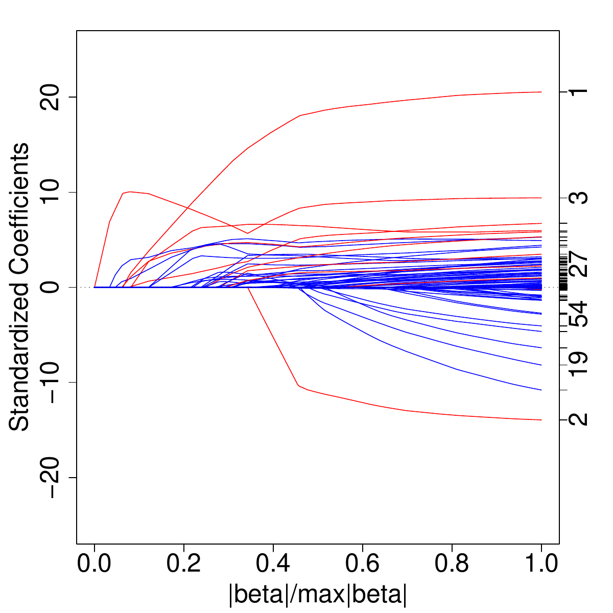
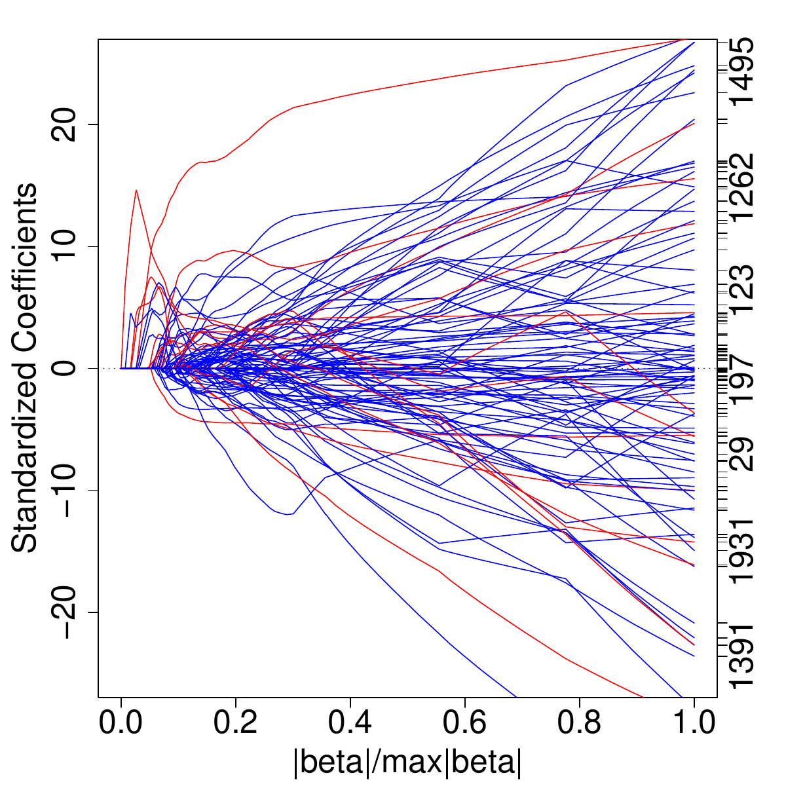

::: article
The expression spike and slab, originally coined
by [@Mitchell+Beauchamp:1988], refers to a type of prior used for the
regression coefficients in linear regression models (see
also [@Lempers:1971]). In [@Mitchell+Beauchamp:1988], this prior assumed
that the regression coefficients were mutually independent with a
two-point mixture distribution made up of a uniform flat distribution
(the slab) and a degenerate distribution at zero (the spike).
In [@George+McCulloch:1993] a different prior for the regression
coefficient was used. This involved a scale (variance) mixture of two
normal distributions. In particular, the use of a normal prior was
instrumental in facilitating efficient Gibbs sampling of the posterior.
This made spike and slab variable selection computationally attractive
and heavily popularized the method.

As pointed out in [@IR:2005], normal-scale mixture priors, such as those
used in [@George+McCulloch:1993], constitute a wide class of models
termed *spike and slab models*. Spike and slab models were extended to
the class of rescaled spike and slab models [@IR:2005]. Rescaling was
shown to induce a non-vanishing penalization effect, and when used in
tandem with a continuous bimodal prior, confers useful model selection
properties for the posterior mean of the regression
coefficients [@IR:2005; @IR:2010].

Recently, [@IR:2010] considered the geometry of generalized ridge
regression (GRR), a method introduced by Hoerl and Kennard to overcome
ill-conditioned regression
settings [@Hoer:Kenn:ridg:1970a; @Hoer:Kenn:ridg:1970b]. This analysis
showed that GRR possesses unique advantages in high-dimensional
correlated settings, and that weighted GRR (WGRR) regression, a
generalization of GRR, is potentially even more effective. Noting that
the posterior mean of the regression coefficients from a rescaled spike
and slab model is a type of WGRR estimator, they showed that this WGRR
estimator, referred to as the Bayesian model averaged (BMA) estimator,
when coupled with dimension reduction, yielded low test-set
mean-squared-error when compared to the elastic net [@Zou:Hast:2005].

Additionally, [@IR:2010] introduced a generalization of the elastic net,
which they coined the gnet (short for generalized elastic net). The gnet
is the solution to a least-squares penalization problem in which the
penalization involves an overall $\ell_1$-regularization parameter (used
to impose sparsity) and a unique $\ell_2$-regularization parameter for
each variable (these latter parameters being introduced to combat
multicollinearity). To calculate the gnet, a lasso-type optimization is
used by fixing the $\ell_2$-regularization parameters at values
determined by finding the closest GRR to the BMA. Like the BMA, the gnet
is highly effective for prediction. However, unlike the BMA, which is
obtained by model averaging, and therefore often contains many small
coefficient values, the gnet is much sparser, making it more attractive
for variable selection.

The gnet and BMA estimators represent attractive solutions for modern
day high-dimensional data settings. These problems often involve
correlated variables, in part due to the nature of the data, and in part
due to an artifact of the
dimensionality \[see [@cai-2007-35; @Fan:Lv:sure:2008] for a detailed
discussion about high-dimensional correlation\]. The BMA is attractive
because it addresses the issue of correlation by drawing upon the
properties of WGRR estimation, a strength of the Bayesian approach,
while the gnet achieves sparse variable selection by drawing upon the
principle of soft-thresholding, a powerful frequentist regularization
concept.

Because high-dimensional data is becoming increasingly common, it would
be valuable to have user friendly software for computing the gnet and
BMA estimator. With this in mind, we have developed an R package
*spikeslab* for implementing this methodology [@spikeslab].

The main purpose of this article is to describe this package. Because
this new spike and slab approach may be unfamiliar to users in the
R-community, we start by giving a brief high-level description of the
algorithm \[for further details readers should however
consult [@IR:2010]\]. We then highlight some of the package's key
features, illustrating its use in both low- and high-dimensional
settings.

# The spike and slab algorithm

The *spikeslab* R package implements the rescaled spike and slab
algorithm described in [@IR:2010]. This algorithm involves three key
steps:

1.  Filtering (dimension reduction).

2.  Model Averaging (BMA).

3.  Variable Selection (gnet).

**Step 1** filters all but the top $n F$ variables, where $n$ is the
sample size and $F>0$ is the user specified fraction. Variables are
ordered on the basis of their absolute posterior mean coefficient value,
where the posterior mean is calculated using Gibbs sampling applied to
an approximate rescaled spike and slab posterior. Below is a
toy-illustration of how filtering works \[$p$ is the total number of
variables and $(\text{V}_{(k)})_{k=1}^p$ are the ordered variables\]:
$$\underbrace{\text{V}_{(1)},\ldots,\text{V}_{([nF])}}_{\text{retain
  these variables}}\hskip30pt 
\underbrace{\text{V}_{([nF]+1)},\ldots,\text{V}_{(p)}}_{\text{filter
 these variables}}.$$ The value for $F$ is set using the option
`bigp.smalln.factor`, which by default is set to the value $F=1$. The
use of an approximate posterior in the filtering step is needed in high
dimensions. This yields an ultra-fast Gibbs sampling procedure, with
each step of the Gibbs sampler requiring $O(np)$ operations. Thus,
computational effort for the filtering step is linear in both
dimensions.

**Step 2** fits a rescaled spike and slab model using only those
variables that are not filtered in Step 1. Model fitting is implemented
using a Gibbs sampler. Computational times are generally rapid as the
number of variables at this point are a fraction of the original size,
$p$. A blocking technique is used to further reduce computational times.
The posterior mean of the regression coefficients, which we refer to as
the BMA, is calculated and returned. This (restricted) BMA is used as an
estimator for the regression coefficients.

**Step 3** calculates the gnet. In the optimization, the gnet's
$\ell_2$-regularization parameters are fixed (these being determined
from the restricted BMA obtained in Step 2) and its solution path with
respect to its $\ell_1$-regularization parameter is calculated using the
[*lars*](https://CRAN.R-project.org/package=lars) R package [@lars] \[a
package dependency of *spikeslab*\]. The `lars` wrapper is called with
`type=”lar”` to produce the full LAR path solution [@Efron:lasso:2004].
The gnet is defined as the model in this path solution minimizing the
AIC criterion. Note importantly, that cross-validation is not used to
optimize the $\ell_1$-regularization parameter. The gnet estimator is
generally very stable, a property that it inherits from the BMA, and
thus even simple model selection methods such as AIC work quite well in
optimizing its path solution. This is different than say the elastic
net [@Zou:Hast:2005] where cross-validation is typically used to
determine its regularization parameters (often this involves a double
optimization over both the $\ell_1$- and $\ell_2$-regularization
parameters). This is an important feature which reduces computational
times in big-$p$ problems.

# Low-dimensional settings

Although the spike and slab algorithm is especially adept in
high-dimensional settings, it can be used effectively in classical
settings as well. In these low-dimensional scenarios when $p<n$, the
algorithm is implemented by applying only Steps 2 and 3 (i.e., Step 1 is
skipped). The default setting for *spikeslab*, in fact, assumes a
low-dimensional scenario.

As illustration, we consider the benchmark diabetes data ($n=442$,
$p=64$) used in [@Efron:lasso:2004] and which is an example dataset
included in the package. The response $Y$ is a quantitative measure of
disease progression for patients with diabetes. The data includes 10
baseline measurements for each patient, in addition to 45 interactions
and 9 quadratic terms, for a total of 64 variables for each patient. The
following code implements a default analysis:

``` r
data(diabetesI, package = "spikeslab")
set.seed(103608)
obj <- spikeslab(Y ~ . , diabetesI)
print(obj)
```

The `print` call outputs a basic summary of the analysis, including a
list of the selected variables and their parameter estimates (variables
selected are those having nonzero gnet coefficient estimates):

``` r
            bma    gnet bma.scale gnet.scale
bmi      24.076  23.959   506.163    503.700
ltg      23.004  22.592   483.641    474.965
map      14.235  12.894   299.279    271.089
hdl     -11.495 -10.003  -241.660   -210.306
sex      -7.789  -6.731  -163.761   -141.520
age.sex   6.523   5.913   137.143    124.322
bmi.map   3.363   4.359    70.694     91.640
glu.2     2.185   3.598    45.938     75.654
age.ltg   1.254   0.976    26.354     20.528
bmi.2     1.225   1.837    25.754     38.622
age.map   0.586   0.928    12.322     19.515
age.2     0.553   0.572    11.635     12.016
sex.map   0.540   0.254    11.349      5.344
glu       0.522   0.628    10.982     13.195
age.glu   0.417   0.222     8.757      4.677
```

In interpreting the table, we note the following:

1.  The first column with the heading bma lists the coefficient
    estimates for the BMA estimator obtained from Step 2 of the
    algorithm. These values are given in terms of the standardized
    covariates (mean of 0 and variance of 1).

2.  The second column with the heading gnet lists the coefficient
    estimates for gnet obtained from Step 3 of the algorithm. These
    values are also given in terms of the standardized covariates.

3.  The last two columns are the BMA and gnet estimators given in terms
    of the original scale of the variables. These columns are used for
    prediction, while the first two columns are useful for assessing the
    relative importance of variables.

Note that all columns can be extracted from the spike and slab object,
`obj`, if desired.

## Stability analysis

Even though the gnet accomplishes the goal of variable selection, it is
always useful to have a measure of stability of a variable. The wrapper
`cv.spikeslab` can be used for this purpose.

The call to this wrapper is very simple. Here we illustrate its usage on
the diabetes data:

``` r
y <- diabetesI[,  1]
x <- diabetesI[, -1]
cv.obj <- cv.spikeslab(x = x, y = y, K = 20)
```

This implements 20-fold validation (the number of folds is set by using
the option `K`). The gnet estimator is fit using the training data and
its test-set mean-squared-error (MSE) for its entire solution-path is
determined. As well, for each fold, the optimal gnet model is determined
by minimizing test-set error. The average number of times a variable is
selected in this manner defines its stability (this is recorded in
percentage as a value from 0%-100%). Averaging the gnet's test-set MSE
provides an estimate of its MSE as a function of the number of
variables.

The gnet's coefficient values (estimated using the full data) and its
stability values can be obtained from the `cv.obj` using the following
commands:

``` r
cv.stb <- as.data.frame(cv.obj$stability)
gnet <- cv.stb$gnet
stability <- cv.stb$stability
```

Figure 1 (top) plots the gnet's cross-validated MSE curve as a function
of the model size. The plot was produced with the command

``` r
plot(cv.obj, plot.type = "cv")
```

Close inspection (confirmed by considering the object, `cv.obj`) shows
that the optimal model size is somewhere between 9 and 17, agreeing
closely with our previous analysis. The bottom plot shows how gnet
coefficient estimates vary in terms of their stability values (obtained
by plotting `gnet` versus `stability`). There are 10 variables having
stability values greater than 80%.

<figure>
<p></p>
<figcaption>Figure 1: Stability analysis for diabetes data.</figcaption>
</figure>

# High-dimensional settings

To analyze $p\gg n$ data, users should use the option `bigp.smalln=TRUE`
in the call to `spikeslab`. This will invoke the full spike and slab
algorithm including the filtering step (Step 1) which is crucial to
success in high-dimensional settings (note that $p\ge n$ for this option
to take effect). This three-step algorithm is computationally efficient,
and because the bulk of the computations are linear in $p$, the
algorithm should scale effectively to very large $p$-problems. However,
in order to take full advantage of its speed, there are a few simple,
but important rules to keep in mind.

First, users should avoid using the formula and data-frame call to
`spikeslab` when $p$ is large. Instead they should pass the
$x$-covariate matrix and $y$-response vector directly. This avoids the
tremendous overhead required to parse formula in R.

Second, the final model size of the BMA and gnet are controlled by two
key options; these must be set properly to keep computations manageable.
These options are: `bigp.smalln.factor` and `max.var`. The first option
restricts the number of filtered variables in Step 1 of the algorithm to
be no larger than $Fn$, where $F>0$ is the value `bigp.smalln.factor`.
The default setting $F=1$ should be adequate in most scenarios \[one
exception is when $n$ is very large (but smaller than $p$); then $F$
should be decreased to some value $0<F<1$\]. The second option,
`max.var`, restricts the number of selected variables in *both* Steps 1
and 3 of the algorithm. Its function is similar to `bigp.smalln.factor`,
although unlike `bigp.smalln.factor`, it directly controls the size of
gnet. The default value is `max.var=500`. In most examples, it will
suffice to work with `bigp.smalln.factor`.

Thus, if $x$ is the $x$-matrix, $y$ is the $y$-response vector, and $f$
and $m$ are the desired settings for `bigp.smalln.factor` and `max.var`,
then a generic call in high-dimensional settings would look like:

``` r
obj <- spikeslab(x=x, y=y, bigp.smalln = TRUE, 
      bigp.small.n.factor = f, max.var = m)
```

Although `spikeslab` has several other options, most users will not need
these and the above call should suffice for most examples. However, if
computational times are a still of concern even after tuning $f$ and
$m$, users may consider changing the default values of `n.iter1` and
`n.iter2`. The first controls the number of burn-in iterations used by
the Gibbs sampler, and the second controls the number of Gibbs sampled
values following burn-in (these latter values are used for inference and
parameter estimation). The default setting is 500 in both cases.
Decreasing these values will decrease computational times, but accuracy
will suffer. Note that if computational times are not a concern, then
both values could be increased to 1000 (but not much more is needed) to
improve accuracy.

As illustration, we used a simulation with $n=100$ and $p=2000$. The
data was simulated independently in blocks of size $40$. Within each
block, the $x$-variables were drawn from a 50-dimensional multivariate
normal distribution with mean zero and equicorrelation matrix with
$\rho=0.95$. With probability 0.9, all regression coefficients within a
block were set to zero, otherwise with probability 0.1, all regression
coefficients were set to zero except for the first 10 coefficients,
which were each assigned a randomly chosen value from a standard normal
distribution. Random noise $\varepsilon$ was simulated independently
from a N$(0,\sigma^2)$ distribution with $\sigma=0.4$.

The top plot in Figure 2 displays the path solution for the gnet. Such a
plot can be produced by a call to the *lars* wrapper `plot.lars` using
the `gnet.obj` obtained from the `spikeslab` call. As `gnet.obj` is a
*lars*-type object it is fully interpretable by the *lars* package, and
thus it can be parsed by the packages' various wrappers. For
convenience, the path solution can be produced by a direct call to
`plot`; a typical call being:

``` r
obj <- spikeslab(x=x, y=y, bigp.smalln = TRUE) 
plot(obj, plot.type = "path")
```

Actually Figure 2 was not produced by a call to `plot` but in fact was
obtained by slightly modifying the `plot.lars` wrapper so as to display
the paths of a variable color coded by its true coefficient value (blue
for truly zero and red for truly nonzero). We did this in order to
facilitate comparison to the lasso. The lasso path (obtained using the
LAR-solution) is displayed in the bottom plot of Figure 2. Notice how in
contrast to gnet, the path solution for the lasso has a wiggly
\"spaghetti\"-like shape and that many of the truly nonzero coefficients
are hard to identify because of this. This a direct consequence of the
high-correlation in the $x$-variables of this example. This correlation
creates instability in the lasso-LAR solution, and this ultimately
impacts its performance.

<figure>
<p></p>
<figcaption>Figure 2: Path solutions for the gnet (top) and the lasso
(bottom) from a correlated high-dimensional simulation (n=100 and
p=2000). Blue and red lines correspond to truly zero and truly nonzero
coefficient values, respectively.</figcaption>
</figure>

# Summary

The gnet incorporates the strength of Bayesian WGRR estimation with that
of frequentist soft thresholding. These combined strengths make it an
effective tool for prediction and variable selection in correlated
high-dimensional settings. If variable selection is not of concern, and
the key issue is accurate prediction, than the BMA may be preferred.
Both the gnet and BMA can be computed using the *spikeslab* R package.
This package is computationally efficient, and scales effectively even
to massively large $p$-problems.

As one example of this scalability, we added 100,000 noise variables to
the diabetes data set and then made a call to `cv.spikeslab` with the
added options `bigp.smalln = TRUE`, `max.var = 100` and
`parallel = TRUE` (as before we used $K=20$ fold validation). The
`parallel` option invokes parallel processing that is implemented via
the package [*snow*](https://CRAN.R-project.org/package=snow) [@snow]
\[note that sending in an integer for the option `parallel` sets the
number of socket clusters on the local machine on which the session is
being initiated; in our example we actually used `parallel = 8`\]. The
*snow* package should be loaded prior to making the `cv.spikeslab` call.

{width="100%" alt="graphic without alt text"}

Figure 3 displays the gnet's path solution (obtained using the full
data). While only 4 variables have path-profiles that clearly stand out,
impressively these variables are the top 4 from our previous analysis.
The gnet estimates (scaled to standardized covariates), its averaged
cv-estimates, and the stability values for the top 15 variables were:

``` r
              gnet     gnet.cv stability
ltg     20.1865498 20.14414604       100
bmi     18.7600433 22.79892835       100
map      4.7111022  4.83179363        95
hdl     -2.5520177 -2.66839785        95
bmi.2    3.6204750  0.46308305        40
x.61746  0.0000000 -0.74646210        35
x.42036  4.8342736  0.41993669        30
x.99041  0.0000000 -0.70183515        30
x.82308  5.2728011  0.75420320        25
glu      1.3105751  0.16714059        25
x.46903  0.0000000 -0.65188451        25
x.57061  0.0000000  0.73203633        25
x.99367 -2.7695621 -0.22110463        20
tch      0.2542299  0.14837708        20
x.51837  0.0000000 -0.09707276        20
```

Importantly, note that the top 4 variables have greater than or equal to
95% stability (variables starting with "x." are noise variables). It is
also interesting that 3 other non-noise variables, \"bmi.2\", \"glu\",
and \"tch\" were in the top 15 variables. In fact, when we inspected the
100 variables that passed the filtering step of the algorithm (applied
to the full data), we found that 10 were from the original 64 variables,
and 6 were from the top 15 variables from our earlier analysis. This
demonstrates stability of the filtering algorithm even in ultra-high
dimensional problems.

Finally, we remark that in illustrating the *spikeslab* package in this
article, we focused primarily on the `spikeslab` wrapper, which is the
main entry point to the package. Other available wrappers include
`predict.spikeslab` for prediction on test data, and
`sparsePC.spikeslab`. The latter implements variable selection for
multiclass gene expression data [@IR:2010].

In future work we plan to extend the rescaled spike and slab methodology
to high-dimensional generalized linear models. At that time we will
introduce a corresponding wrapper.

# Acknowledgements

This work was partially funded by the National Science Foundation grant
DMS-0705037. We thank Vincent Carey and two anonymous referees for
helping to substantially improve this manuscript.

\

\

\
:::
