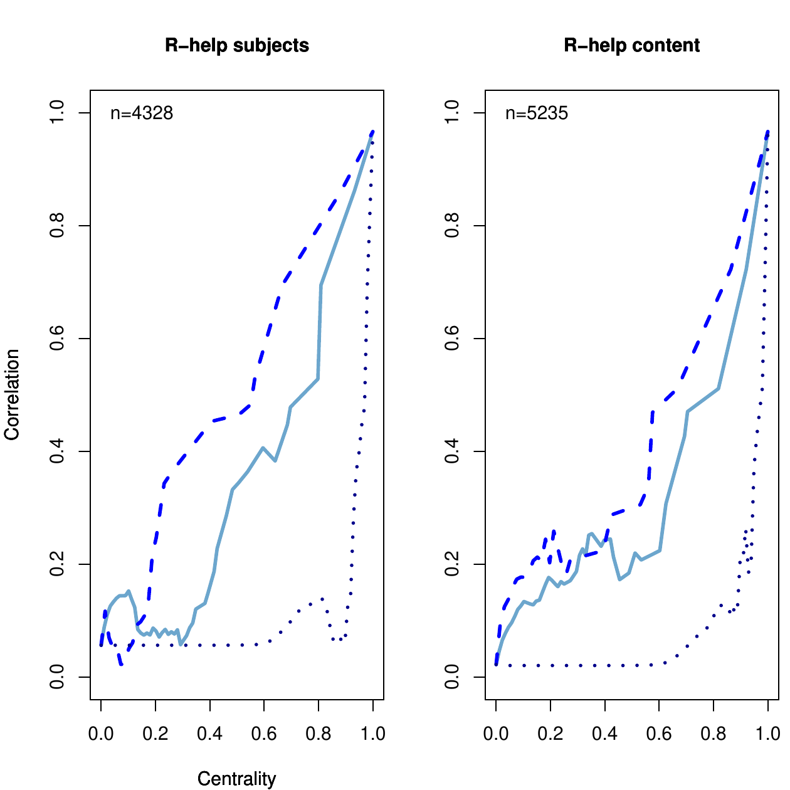
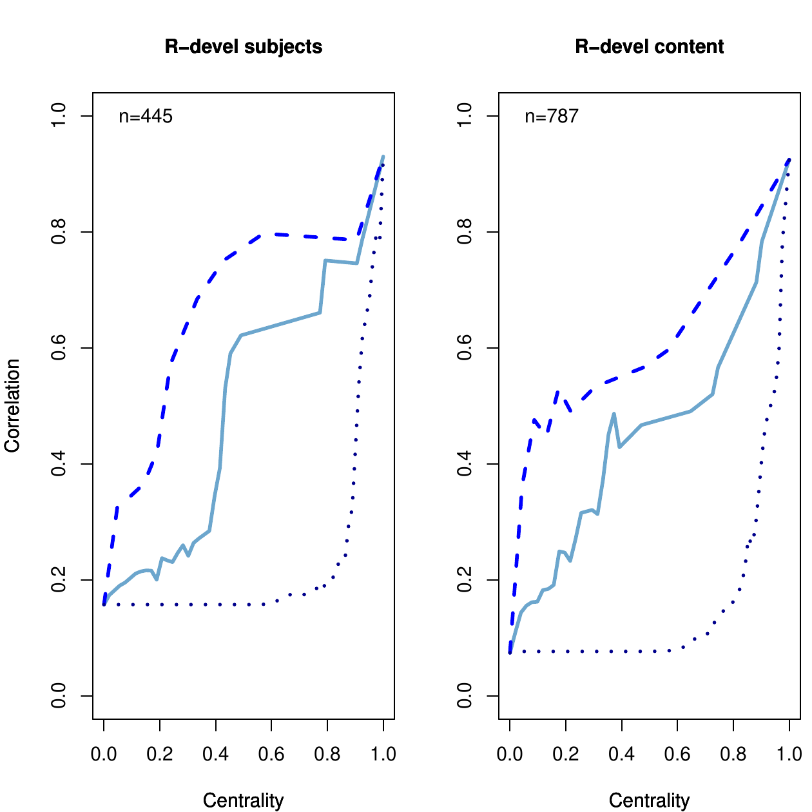

::: article
# Introduction

Social Network Analysis (SNA) provides powerful methods to study the
relationships between people expressed as binary or weighted adjacency
matrices. It can be used to find influential or popular nodes,
communities and informal hierarchies. However, it is limited in the
sense that it cannot capture the context of their encounter. An actor
might be a regarded adviser or trend setter concerning one topic and
might not know anything about another. If all his or her relationships
are expressed as purely numerical networks, a differentiation is not
possible.

In open source software communities, a large part of the developers'
communication and thus collaboration happens electronically via e-mails
and forums. In the R mailing lists, R-help and R-devel, all kinds of
application and development related questions are discussed. From
experts to newcomers, everyone shares the same platform, so a view on
the entire network does not offer a detailed picture, leaving the
question of how well the communication really works in the R community
and which role the most central actors play in this context. As bad
coordination can be reflected by redundant code or hardly compatible
packages, it is important that developers and users working in the same
field stay in contact.

In this paper, we use content-based SNA, an approach to combine SNA and
Text Mining (TM) in order to find out to which extent sharing interests
is associated with communicating in two R mailing lists. Content-based
SNA consists of extracting overlapping topic related subnetworks from
the entire communication network. The paper shows how the authors'
interests can be found based on their centralities in these topic-based
subnetworks. By comparing the networks showing who shares interests with
their communication networks, we find that communicating is the more
associated with sharing interests the more central the authors are in
the communication networks. We argue that this finding is due to the
motives of authors to use the mailing lists.

# Related work

There are several approaches to combine SNA and TM. One has to
distinguish between combinations that enrich TM through SNA and those
that enrich SNA through TM. One of the most prominent applications on
the TM side is used by the search engines Google and Yahoo. They rank
search results found by TM procedures according to centrality measures
based on hyperlink graphs [@brin:1998; @kleinberg:1999]. Another very
important TM plus SNA application is the summarization of texts by
calculating centrality measures in word networks (networks where nodes
represent words that are connected if they appear in the same text
unit). The results are often visualized as tag clouds
[@erkan:2004; @vanderwende:2004].

However, approaches to enrich an SNA with TM are not as numerous.
@mccallum:2007 introduced the author-recipient-topic model which
consists of fitting a multinomial distribution over topics and
authors/recipients of a message simultaneously. The results are
combinations of concepts and pairs of authors and recipients that
characterize the network. By studying the Enron e-mail corpus, they
defined social roles based on such combinations. For example the
relationships of an Enron lawyer to a few other people were
characterized by the concept "legal contracts". A similar approach was
applied to authors of Wikipedia articles by @chang:2009.

The tradition this paper stands in is called "content-based SNA". In
content-based SNA, the network is partitioned into several overlapping
subgraphs of people who discuss the same topic. Examples in the
literature comprise @velardi:2008, who analyzed the evolution of
content-based communication networks in a company by measuring the
agent-aggregation around topics, and @viermetz:2008, who calculated
local actor centrality in content-based networks to find opinion
leaders. To the best of our knowledge, content-based SNA has not been
applied to mailing lists or to any kind of open source related data.

# Data preparation

The data were taken from the mailing lists R-help and R-devel from
January 2008 to May 2009. The e-mails can be downloaded as compressed
text files from the R website (<https://stat.ethz.ch/pipermail/r-help/>
and <https://stat.ethz.ch/pipermail/r-devel/>). There is one text file
for each month. The R code for the entire data preparation process can
be downloaded from R-Forge
<https://r-forge.r-project.org/projects/snatm/>. First, the e-mails for
each month were written into a single file using `as.one.file()` from
the *snatm* package (example of the R-devel mailing list):

``` r
> as.one.file(files,
+   filename = "allthreads.txt",
+   list = "rdevel")
```

Then, the meta data (author, date, subject, thread-ID and e-mail-ID) and
the e-mail content were extracted from these texts and transformed into
a matrix.

``` r
> forest <- makeforest(month = "allthreads")
> head(forest)
```

``` r
     emailID threadID
[1,] "1"     "1"     
[2,] "2"     "2"     
[3,] "3"     "2"     
[4,] "4"     "3"     
[5,] "5"     "2"     
[6,] "6"     "3"     
     author                                
[1,] "ggrothendieck at gmail.com (Gabor..."
[2,] "huber at ebi.ac.uk (Wolfgang Hube..."
[3,] "ripley at stats.ox.ac.uk (Prof Br..."
[4,] "dfaden at gmail.com (David Faden)..."
[5,] "ripley at stats.ox.ac.uk (Prof Br..."
[6,] "ripley at stats.ox.ac.uk (Prof Br..."
     subjects                              
[1,] "[Rd] Wish List"                      
[2,] "[Rd] Error from wilcox.test"         
[3,] "[Rd] Error from wilcox.test"         
[4,] "[Rd] setting the seed in standalo..."
[5,] "[Rd] Error from wilcox.test"         
[6,] "[Rd] setting the seed in standalo..."
     content                               
[1,] "In:     trunk/src/library/base/ma..."
[2,] "On 1/3/2008 9:03 AM, Gabor Grothe..."
[3,] "What it is trying is  % env R_DEF..."
[4,] "On 1/4/08, Prof Brian Ripley <rip..."
[5,] "Full_Name: Hendrik Weisser Versio..."
[6,] "hendrik.weisser at gmx.net wrote:..."
```

The function `makeforest()` from *snatm* is based on the
[*tm.plugin.mail*](https://CRAN.R-project.org/package=tm.plugin.mail)
package [@feinerer:2008] which uses the Message-IDs and In-Reply-To-IDs
contained in the e-mail headers to assign a thread-ID to each e-mail
(`threads()` from the *tm.plugin.mail* package). The e-mail-IDs sort the
e-mails according to the sequence in which they were sent. Answers to
e-mails that were sent before January 2008 had to be removed because in
this case the `threads()` function cannot identify complete threads.
Furthermore, citations and signatures were omitted from the e-mail
content (`removeCitation()` and `removeSignature()` from the
*tm.plugin.mail* package). The data contains 43760 R-help e-mails and
5008 R-devel e-mails.

## Data preparation for TM

First, in order to reduce spelling ambiguities resulting from
differences in American versus British English, the e-mail subjects and
content were transformed into British English using the `ae-to-be()`
function from the *snatm* package.

Second, the `wn.replace()` function from the *snatm* package was used to
find groups of synonyms that were used in the texts based on the WordNet
Database [@fellbaum:1998; @wallace:2007; @feinerer:2010]. All terms in
these groups of synonyms are replaced by one single representative of
the group. However, in order to account for the R-specific vocabulary,
not all of the synonym terms should be replaced. For example, the word
"car" should not be replaced by "auto" where it "typically" refers to
the [*car*](https://CRAN.R-project.org/package=car) package. The
`wn.replace()` function allows for manual deselection of certain terms,
if they should not be replaced by a synonym.

Third, terms are stemmed using the Snowball stemmer `stemDocument()`
from the [*tm*](https://CRAN.R-project.org/package=tm) package.

Fourth, term frequencies of the resulting terms (`termFreq()` from the
*tm* package [@feinerer:2008]) were calculated (separately for subjects
and content). The function `tolower()` from the *base* package was
applied and stopwords were ignored. Words of length less than three were
omitted as the vast majority of them did not have a meaning in terms of
abbreviations and the like, but were code chunks. Terms that were used
less than 10 times (for subjects) or less than 20 times (for content)
were ignored as well.

The four steps can be done all at once by the `prepare.text()` function
from the *snatm* package.

## Data preparation for SNA {#dataprepsna}

To obtain a social network from the mailing list data, first, an alias
detection procedure was performed on the `Author`-column of `forest`. It
matched the different user names and e-mail addresses belonging to one
and the same person by using the Levensthein Distance (`agrep()`
[@levenshtein:1966]) and a few transformations inspired by @bird:2006
that can be found in `find.aliases()` from the *snatm* package. This
way, the number of unique authors was reduced from 6393 to 5972 in
R-help and from 1049 to 983 in R-devel.

Second, the new `forest` was transformed into an edge list
(`createedges()` from *snatm*). Somebody answering an e-mail was
connected to all the authors who wrote something before
(chronologically) in the same thread as we assume that the respondent is
aware of all the previous e-mails. After this, the edgelist was
transformed into a matrix representation of a network (`adjacency()`
from *snatm*).

``` r
> network <- adjacency(createedges(forest))
> network[1:2, 1:2]
```

``` r
         Gabor G. Brian R.
Gabor G.      130       29
Brian R.       19      250
```

The resulting social network consists of nodes representing e-mail
authors and directed valued lines indicating who answered whom and the
number of mails sent in the corresponding direction. For example, Gabor
Grothendieck answered on 29 of Brian Ripley's e-mails. If the diagonal
is not zero the corresponding authors appeared several times in the same
thread. (However, the diagonal will be ignored in the subsequent
analysis.) We will call these networks "communication networks".

## Combining network data and textual data

This section describes the crucial step where network data and textual
data are combined. Three data preparation steps are needed.

### First step

For all the subject terms that were used 10 times or more and all the
content terms that appeared 20 times or more (using the prepared text
corpora resulting from the `prepare.text()` function) a communication
network was extracted that shows only the connections between authors
who used this particular term. In a loop each term was assigned to
`subjectfilter`, such that only connections between authors who used a
certain term were extracted from `forest`.

``` r
> network <- adjacency(createedges(
+             forest,
+             subjectfilter = "lattice"))
```

As an example, Figure [1](#LATTICE) shows the communication network of
all the R-help authors who used the term "lattice" in the e-mail
subject.

{#LATTICE width="90.0%" alt="graphic without alt text"}

Deepayan Sarkar, who is the author of the *lattice* package
[@sarkar:2008], is clearly the most central person in this network. This
indicates that he answered nearly everyone having a question about
*lattice*.

### Second step

This step is based on the idea that someone's interest for a certain
subject can be measured by his or her centrality or activity in the
corresponding communication network. For example, we would conclude from
Figure [1](#LATTICE) that Deepayan Sarkar is very interested in the word
"lattice". In SNA, there are several measures to calculate centrality,
for example degree, closeness, betweenness and others. We chose to use
the degree (number of direct neighbors; `degree` from the
[*sna*](https://CRAN.R-project.org/package=sna) package [@butts:2008])
because it measures activity while the others measure the connectedness
to the entire network. The degree was calculated for all the nodes of
networks that have more than 20 members. If a network has only 20
members or less, the results of centrality measures and thus the
assumption of somebody being interested in a certain topic are
considered not to be meaningful. Then, we created a network consisting
of two sets of nodes (2-mode network), one representing e-mail authors
and the other representing `terms`.

``` r
> twomode <- adjacency(centrality.edgelist(
+            terms, apply.to = "subjects"))
```

Each term and each author who used the term was connected by a line
having the normalized degree centrality rank as line weight. (For
instance the person with the highest degree in a certain communication
network is connected to the corresponding word with a line weight of 1.)
Thus, the line weight can be interpreted as the extent to which somebody
is interested in a particular term in a \[0,1\] interval. Figure
[2](#PLOT500) shows the 0.45% strongest lines of R-help authors and
subject-terms (largest connected subnetwork only).

{#PLOT500
width="90.0%" alt="graphic without alt text"}

For example, Jim Lemon is connected to terms like "bar", "scatter",
"axi(s)", "barplot" and "diagram", so he seems to be interested in
plots.

### Third step {#datapreptm3}

In the third step, this 2-mode network was reduced to a 1-mode network
by omitting the term nodes and connecting the author nodes that were
adjacent to the term (`shrink` from the *snatm* package).

``` r
> shrink(twomode, keep = people,
+   values = "min")
```

For example, in the 1-mode network John Fox and Gabor Grothendieck are
connected because they are both connected to "mean" in the 2-mode
network. The networks have line weights representing the minimum of the
line weights two people were formally connected with through the term
node. For example, in the 2-mode network John Fox was connected to the
term "mean" with a line weight of 0.9957 and Gabor Grothendieck was also
connected to "graph" but with a line weight of 1. Then the two authors
are connected with a line weight of 0.9957 in the 1-mode network,
meaning that the extent to which they share interests is 0.9957 of 1. We
will call these networks "interest networks".

# Results: Comparison of communication networks and interest networks

At this point, the two kinds of networks, the communication networks and
the interest networks can be compared. The communication networks have
line weights representing the number of e-mails exchanged. The line
weights of the interest networks indicate the extent to which two people
have similar interests in a 0--1 interval. If we calculate the
correlation between the line weights of both networks, we get the extent
to which the fact of sharing interests is associated with communicating.
We should expect that the more two people are interested in the same
topic, the more e-mails they exchange.

There are two communication networks, one for R-help having 5972 nodes
and one for R-devel having 983 nodes. Furthermore, there are four
interest networks because the extent of shared interests was measured
once by using the subjects and once by using the content for each of the
mailing lists. The interest networks have fewer nodes because only the
most frequently used terms were included into the interest analysis.
Thus, people who only used less frequent terms do not appear in the
interest networks. To compare the two kinds of networks the
communication networks were reduced to those nodes who also appeared in
the interest networks. Furthermore, the reduced communication network
was permuted (`permutation()` from the *snatm* package) such that the
sequence of author names assigned to `rownames(network)` is the same in
both networks. However, the correlation between sharing interests and
communicating is only approximately 0 for all possible combinations of
communication networks and interest networks (Table 1). (The diagonals
of the communication networks were set to 0.)\

::: center
  ----------------------------------------------------
  Interest         Communication network 
  -------------- ----------------------- -------------
  2-3 network                 **R-help**   **R-devel**

  **subjects**                     0.030         0.070

  **content**                      0.009         0.044
  ----------------------------------------------------

  : Table 1
:::

Table 1: Correlations between all combinations of communication networks
and interest networks.\
However, if the centrality of authors in the communication network is
taken into account, we get a different picture. Figure [3](#correlation)
shows how the correlation between intensity of communication and extent
of sharing interests changes (y-axis) as the normalized centrality
(degree, betweenness and closeness) of nodes increases (x-axis). (Degree
and closeness were calculated with the *sna* package [@butts:2008],
betweenness with the
[*igraph*](https://CRAN.R-project.org/package=igraph) package
[@csardi:2006].)

<figure id="correlation">



<figcaption>Figure 3: Correlation between intensity of communication and
sharing interests (y-axis) and degree centrality of nodes
(x-axis).</figcaption>
</figure>

More precisely, it shows the correlations between communication networks
and interest networks consisting of only those authors who have a higher
or equally high centrality than indicated on the x-axis.

There is an almost linear increase in correlation in the R-help subjects
network for the centrality measures degree and betweenness, whose
distributions are highly right skewed. Closeness is approximately
normally distributed. Thus, networks of people having an average
closeness (around 0.5) are not correlated just as networks of authors
with an average normalized degree (around 0). In the R-help content
network, a relation between the centrality of authors and the
correlation between sharing interests and communicating begins only at a
centrality of around 0.5 for right skewed measures and around 0.95 for
closeness. This is a result of the discussion topics sometimes changing
in the course of threads. In the R-devel networks, the relation is also
positive but not as stable, which is due to the much smaller network
sizes $n$ of 445 (subjects) and 787 (content) compared to 4328
(subjects) and 5235 (content) in the R-help networks. The correlation in
R-devel is generally higher than in R-help. In both, the R-help (for
high centralities) and the R-devel networks, the lines are smoother when
the subjects were used to find people's interests. This might be due to
some additional chatting in the content while the subjects are more
focused on the actual topics. However, the choice of subjects or content
does not influence the general finding that sharing interests and
communicating is the more associated the higher people's centrality
scores are. This might be explained by impartiality or indifference of
highly active authors towards the personality of their e-mail partners.
They rather concentrate on the topics. Figure [4](#ansquest) supports
this interpretation:

{#ansquest width="100%" alt="graphic without alt text"}

Each point represents one author and shows how many questions (x-axis)
and answers (y-axis) he or she wrote (`ans.quest()` from the *snatm*
package). The larger a point the higher the author's degree centrality.
The plots indicate that in R-help the 15 most active authors (red) write
far more answers than questions. All but one author are developers of
CRAN packages, which suggests that their motivation is to provide help
concerning their packages or specific topics, no matter who asked the
questions. In contrary, less central R-help authors are either more
choosey with the choice of e-mail partners or they are not active enough
to answer everyone having similar interests. In R-devel the proportion
of answers to questions of central authors (red) is not different from
less central authors. Still, Figure [3](#correlation) suggests that
there is a great correspondency between communicating and sharing
interests among the most active authors. The low correlation between
intensity of communication and extent of sharing interests for
peripheral nodes in both mailing lists can be due to their very low
activity which hinders the definition of their interests.

# Summary

The paper showed how content-based SNA can be used to find people's
interests in mailing list networks. By comparing communication graphs
and networks showing who has similar interests, a relationship between
the correlation of these two and node centrality could be found.
Accordingly, the expected relationship between sharing interests and
communicating exists only for very active authors while less active
authors do not answer everyone who has similar interests. Thus, the
communication efficiency can be regarded to be high for very active
mailing list authors while it is moderate for mid-active authors.
Additionally, the paper suggests using only the subjects to find the
relationship between communicating and sharing interests because the
content contains more noise.

# Code for figures [1](#LATTICE) and [2](#PLOT500) {#code-for-figures-lattice-and-plot500}

``` r
> # Figure 1
> gplot.snatm(network, vertex.col = "white",
+      vertex.border = "grey",
+      label = rownames(network),
+      boxed.labels = FALSE,
+      label.pos = 5,
+      label.cex =
+        ((sna::degree(network)+1)^0.45)*0.25,
+      gmode = "graph", edge.lwd = 0.1,
+      edge.col = "grey")
> # Figure 2
> # See how to get peoplelist in the snatm demo.
> people <- which(is.element(rownames(twomode)
+   ,unique(peoplelist)))
> labelcol <- rep(rgb(0,0,1,0.75),dim(twomode)[1])
> labelcol[people] <- "red"
> gplot.snatm(twomode, gmode = "graph",
+      vertex.col = "white", vertex.cex = 1,
+      label = rownames(twomode),
+      label.col = labelcol,
+      label.cex =
+        (sna::degree(twomode)^0.25)*0.35,
+      label.pos = 5, edge.lwd = 0.1,
+      boxed.labels = FALSE,
+      vertex.border = "white",edge.col = "grey")
```

\
\
\

\
:::
