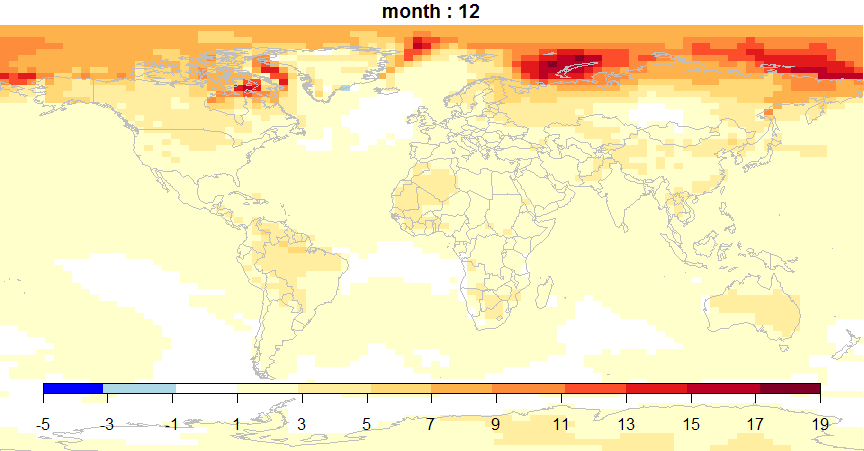
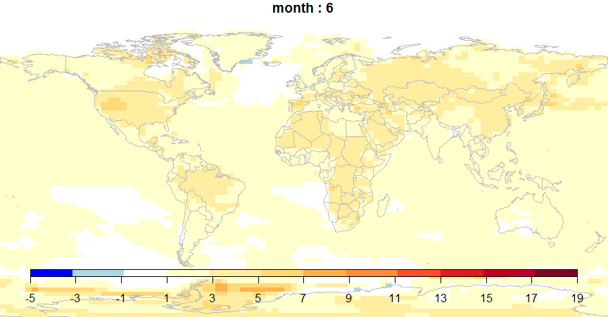

::: article
# Introduction

Global datasets are becoming increasingly common and are frequently seen
on the web, in journal papers and in our newspapers (for example a
'carbon atlas' of global emissions available at
<http://image.guardian.co.uk/sys-files/Guardian/documents/2007/12/17/CARBON_ATLAS.pdf>).
At the same time there is a greater interest in global issues such as
climate change, the global economy, and poverty (as for example outlined
in the Millenium Development Goals,
<http://www.un.org/millenniumgoals/bkgd.shtml>). Thirdly, there is an
increasing availability of software tools for visualising data in new
and interesting ways. Gapminder (<http://www.gapminder.org>) has
pioneered making UN statistics more available and intelligible using
innovative visualisation tools and Many Eyes (<http://www-958.ibm.com/>)
provides a very impressive interface for sharing data and creating
visualisations.

World maps have become so common that they have even attracted satire.
The Onion's Atlas of the Planet Earth [@OurDumbWorld], contains a 'Bono
Awareness' world map representing 'the intensity with which artist Bono
is aware of the plight and daily struggles of region', with a
categorisation ranging from 'has heard of nation once' through 'moved
enough by nations crisis to momentarily remove sunglasses' to 'cares
about welfare of nation nearly as much as his own'.

There appears to be a gap in the market for free software tools that can
be used across disciplinary boundaries to produce innovative,
publication quality global visualisations. Within R there are great
building blocks (particularly
[*sp*](https://CRAN.R-project.org/package=sp),
[*maptools*](https://CRAN.R-project.org/package=maptools) and
[*fields*](https://CRAN.R-project.org/package=fields)) for spatial data
but users previously had to go through a number of steps if they wanted
to produce world maps of their own data. Experience has shown that
difficulties with linking data and creating classifications, colour
schemes and legends, currently constrains researchers' ability to view
and display global data. We aim to reduce that constraint to allow
researchers to spend more time on the more important issue of what they
want to display. The vision for
[*rworldmap*](https://CRAN.R-project.org/package=rworldmap) is to
produce a package to facilitate the visualisation and mapping of global
data. Because the focus is on global data, the package can be more
specialised than existing packages, making world mapping easier, partly
because it doesn't have to deal with detailed local maps. Through
[*rworldmap*](https://CRAN.R-project.org/package=rworldmap) we aim to
make it easy for R users to explore their global data and also to
produce publication quality figures from their outputs.

[*rworldmap*](https://CRAN.R-project.org/package=rworldmap) was partly
inspired and largely funded by the UK Natural Environment Research
Council (NERC) program Quantifying Uncertainty in Earth System Science
([QUEST](http://quest.bris.ac.uk)). This program brings together
scientists from a wide range of disciplines including climate modellers,
hydrologists and social scientists. It was apparent that while
researchers have common tools for visualisation within disciplines, they
tend to use different ones across disciplines and that this limits the
sharing of data and methods necessary for truly interdisciplinary
research. Within the project, climate and earth system modellers tended
to use IDL, ecologists ArcGIS, hydrologists and social scientists Matlab
and fisheries scientists R. With the exception of R, these software
products cost thousands of pounds which acts as a considerable
constraint on users being able to try out techniques used by
collaborators. This high cost and learning curve of adopting new
software tools hinders the sharing of data and methods between
disciplines. To address this, part of the vision for
[*rworldmap*](https://CRAN.R-project.org/package=rworldmap) was to
develop a tool that can be freely used and modified across a
multi-disciplinary project, to facilitate the sharing of scripts, data
and outputs. Such freely available software offers greater opportunity
for collaboration with research institutes in developing countries that
may not be able to afford expensive licenses.

# [*rworldmap*](https://CRAN.R-project.org/package=rworldmap) data inputs

[*rworldmap*](https://CRAN.R-project.org/package=rworldmap) consists of
tools to visualise global data and focuses on two types of data.
Firstly, data that are referenced by country codes or names and
secondly, data that are referenced on a grid.

## Country data

There is a wealth of global country level data available on the internet
including UN population data, and many global indices for, among others:
[Environmental Performance](http://epi.yale.edu/Files), [Global
Hunger](http://www.ifpri.org/publication/2010-global-hunger-index) and
[Multidimensional
Poverty](http://www.ophi.org.uk/policy/multidimensional-poverty-index/).

Data are commonly referenced by country names as these are the most
easily recognised by users, but country names have the problem that
vocabularies are not well conserved and many countries have a number of
subtly different alternate names (e.g. Ivory Coast and Cote d'Ivoire,
Laos and People's Democratic Republic of Lao). To address this problem
there are ISO standard country codes of either 2 letters, 3 letters or
numeric, and also 2 letter FIPS country codes, so there is still not one
universally adopted standard.
[*rworldmap*](https://CRAN.R-project.org/package=rworldmap) supports all
of these country codes and offers tools to help when data are referenced
by names or other identifiers.

## Gridded data

Global datasets are frequently spatially referenced on a grid, because
such gridded or raster data formats offer advantages in efficiency of
data storage and processing. Remotely sensed data and other values
calculated from it are most frequently available in gridded formats.
These can include terrestrial or marine data or both.

There are many gridded data formats, here I will concentrate on two:
ESRI GridAscii and netCDF.

ESRI GridAscii files are an efficient way of storing and transferring
gridded data. They are straightforward text files so can be opened by
any text editor. They have a short header defining the structure of the
file (e.g. number, size and position of rows and columns), followed by a
single row specifying the value at each grid cell. Thus they use much
less space than if the coordinates for each cell had to be specified.

Example start of gridAscii file for a half degree global grid:

``` r
 ncols  720
 nrows  360
 xllcorner -180
 yllcorner -90
 cellsize  0.5
 NODATA_value -999
 -999 1 0 1 1 ... [all 259200 cell values]
```

NetCDF is a data storage file format commonly used by climate scientists
and oceanographers. NetCDF files can be multi-dimensional, e.g. holding
$(x,y)$ data for multiple attributes over multiple months, years, days
etc. The package [*ncdf*](https://CRAN.R-project.org/package=ncdf) is
good for reading data from netCDF files.

# rworldmap functionality

[*rworldmap*](https://CRAN.R-project.org/package=rworldmap) has three
core functions outlined below and others that are described later.

1.  `joinCountryData2Map()` joins user country data referenced by
    country names or codes to a map to enable plotting

2.  `mapCountryData()` plots a map of country data

3.  `mapGriddedData()` plots a map of gridded data

## Joining country data to a map

To join the data to a map use `joinCountryData2Map`. You will need to
specify the name of column containing your country identifiers
(`nameJoinColumn`) and the type of code used (`joinCode`) e.g. \"ISO3\"
for ISO 3 letter codes or \"UN\" for numeric country codes.

``` r
data(countryExData)
sPDF <- joinCountryData2Map( countryExData
         ,joinCode = "ISO3"
         ,nameJoinColumn = "ISO3V10")
```

This code outputs, to the R console, a summary of how many countries are
successfully joined. You can specify `verbose=TRUE` to get a full list
of countries. The object returned (named sPDF in this case) is of type
`"SpatialPolygonsDataFrame"` from the package
[*sp*](https://CRAN.R-project.org/package=sp). This object is required
for the next step, displaying the map.

If you only have country names rather than codes in your data, use
`joinCode="NAME"`; you can expect more mismatches due to the greater
variation within country names mentioned previously. To address this you
can use the `identifyCountries()` function described below, and change
any country names in your data that do not exactly match those in the
internal map.

## Mapping country data

To plot anything other than the default map, `mapCountryData` requires
an object of class `"SpatialPolygonsDataFrame"` and a specification of
the name of the column containing the data to plot:

``` r
data(countryExData)
sPDF <- joinCountryData2Map( countryExData
         ,joinCode = "ISO3"
         ,nameJoinColumn = "ISO3V10")
mapDevice() #create world map shaped window         
mapCountryData(sPDF
              ,nameColumnToPlot='BIODIVERSITY')
```

{width="100%" alt="graphic without alt text"}

## Mapping gridded data

The `mapGriddedData` function can accept either

1.  an object of type `"SpatialGridDataFrame"`, as defined in the
    package [*sp*](https://CRAN.R-project.org/package=sp)

2.  the name of an ESRI GridAscii file as a character string

3.  a 2D R matrix or array (rows by columns)

[*rworldmap*](https://CRAN.R-project.org/package=rworldmap) contains a
`"SpatialGridDataFrame"` example that can be accessed and mapped as
shown in the code and figure below.

``` r
  data(gridExData)
  mapDevice() #create world map shaped window
  mapGriddedData(gridExData)
```

{width="100%" alt="graphic without alt text"}

## Modifying map appearance

[*rworldmap*](https://CRAN.R-project.org/package=rworldmap) plotting
functions are set up to work with few parameters specified (usually just
those identifying the data) and in such cases, default values will be
used. However, there is considerable flexibility to modify the
appearance of plots by specifying values for arguments. Details of
argument options are provided in the help files but here are a selection
of the main arguments:

-   `catMethod` determines how the data values are put into categories
    (then `colourPalette` determines the colours for those categories).
    Options for `catMethod` are: `"pretty"`, `"fixedWidth"`,
    `"diverging"`, `"logfixedWidth"`, `"quantiles"`, `"categorical"`, or
    a numeric vector defining the breaks between categories. Works with
    the next argument (`numCats`) , although `numCats` is not used for
    `"categorical"`, where the data are not modified, or if the user
    specifies a numeric vector, where the number of categories will be a
    result.

-   `numCats` specifies the favoured number of categories for the data.
    The number of categories used may be different if the number
    requested is not possible for the chosen `catMethod` (e.g. for
    `"quantiles"` if there are only 2 values in the data it is not
    possible to have more than 2 categories).

-   `colourPalette` specifies a colour palette to use from:

    1.  `"palette"` for the current palette

    2.  a vector of valid colours, e.g. `c("red", "white", "blue")` or
        output from
        [*RColorBrewer*](https://CRAN.R-project.org/package=RColorBrewer)

    3.  a string defining one of the internal rworldmap palettes from:
        `"heat"`, `"diverging"`, `"white2Black"`, `"black2White"`,
        `"topo"`, `"rainbow"`, `"terrain"`, `"negpos8"`, `"negpos9"`.

-   `addLegend` set to `TRUE` for a default legend, if set to `FALSE`
    the function `addMapLegend` or `addMapLegendBoxes` can be used to
    create a more flexible legend.

-   `mapRegion` a region to zoom in on, can be set to a country name
    from `getMap()$NAME` or one of `"eurasia"`, `"africa"`,
    `"latin america"`, `"uk"`, `"oceania"`, `"asia"`.

## mapBubbles(), mapBars(), and mapPies()

Another option for displaying data is to use the `mapBubbles` function
which allows flexible creation of bubble plots on global maps. You can
specify data columns that will determine the sizing and colouring of the
bubbles (using `nameZSize` and `nameZColour`). The function also accepts
other spatialDataFrame objects or data frames containing columns
specifying the x and y coordinates. If you wish to represent more
attribute values per location there are also the newer `mapBars()` and
`mapPies()` functions to produce bar and pie charts respectively (noting
that pie charts may not be the best way of presenting data when there
are more than a few categories).

``` r
mapDevice() #create world map shaped window
mapBubbles(dF=getMap()
          ,nameZSize="POP2005"
          ,nameZColour="REGION"
          ,colourPalette="rainbow"
          ,oceanCol="lightblue"
          ,landCol="wheat") 
```

{width="100%" alt="graphic without alt text"}

## Identifying countries

The interactive function `identifyCountries()` allows the user to click
on the current map and, provided the cursor is sufficiently close to
country centroid, will add the country name to the map. Optionally, the
name of an attribute variable can also be passed to the function to
cause the value of the attribute to be added to the label. e.g. 'Cape
Verde 506807' will be printed on the map if the code below is entered
and the mouse clicked over those islands (if you know where they are!).

``` r
identifyCountries(getMap()
                 ,nameColumnToPlot="POP2005") 
```

## Aggregating data to produce different outputs

[*rworldmap*](https://CRAN.R-project.org/package=rworldmap) offers
options for aggregating half degree gridded data to countries, and in
turn for aggregating country level data to regions. In both of these
options a range of aggregation options are available including mean,
minimum, maximum and variance.

`mapHalfDegreeGridToCountries()` takes a gridded input file, aggregates
to a country level and plots the map. It accepts most of the same
arguments as `mapCountryData()`.

Country level data can be aggregated to global regions specified by
`regionType` in `country2Region()` which outputs as text, and
`mapByRegion()` which produces a map plot. The regional classifications
available include SRES (The Special Report on Emissions Scenarios of the
Intergovernmental Panel on Climate Change (IPCC) ), GEO3(Global Earth
Observation), Stern and GBD (Global Burden of Disease).

``` r
data(countryExData)
country2Region(countryExData
           ,nameDataColumn="CLIMATE"
           ,joinCode="ISO3"
           ,nameJoinColumn="ISO3V10"
           ,regionType="Stern"
           ,FUN="mean")
```

Outputs this text:

``` r
                meanCLIMATEbyStern
Australasia               56.92000
Caribbean                 65.20000
Central America           76.11250
Central Asia              56.18000
East Asia                 69.18462
Europe                    73.87619
North Africa              71.00000
North America             62.70000
South America             77.01818
South Asia                77.22000
South+E Africa            75.79474
West Africa               78.68421
West Asia                 49.62000
```

``` r
data(countryExData)
mapDevice() #create world map shaped window
mapByRegion(countryExData
           ,nameDataColumn="CLIMATE"
           ,joinCode="ISO3"
           ,nameJoinColumn="ISO3V10"
           ,regionType="Stern"
           ,FUN="mean")
```

Produces this map:

{width="100%" alt="graphic without alt text"}

The identity of which countries are in which regions are stored in the
data frame `countryRegions`. This also identifies which countries are
currently classed by the UN as Least Developed Countries (LDC), Small
Island Developing states (SID) and Landlocked Developing Countries
(LLDC). To map just the Least Developed Countries the code below could
be used:

``` r
data(countryRegions)
sPDF <- joinCountryData2Map( countryRegions
         ,joinCode = "ISO3"
         ,nameJoinColumn = "ISO3")
mapDevice() #create world map shaped window         
mapCountryData(sPDF[which(sPDF$LDC=='LDC'),]
              ,nameColumnToPlot="POP2005")         
```

## Using [*rworldmap*](https://CRAN.R-project.org/package=rworldmap) with other packages [*classInt*](https://CRAN.R-project.org/package=classInt) and [*RColorBrewer*](https://CRAN.R-project.org/package=RColorBrewer)

While [*rworldmap*](https://CRAN.R-project.org/package=rworldmap) sets
many defaults internally there are also options to use other packages to
have greater flexibility. In the example below
[*classInt*](https://CRAN.R-project.org/package=classInt) is used to
create the classification and
[*RColorBrewer*](https://CRAN.R-project.org/package=RColorBrewer) to
specify the colours.

``` r
library(classInt)
library(RColorBrewer)

#getting smallexample data and joining to a map
data(countryExData)
sPDF <- joinCountryData2Map(countryExData
        ,joinCode = "ISO3"
        ,nameJoinColumn = "ISO3V10"
        ,mapResolution = "coarse")

#getting class intervals 
classInt <- classIntervals( sPDF[["EPI"]]
            ,n=5, style = "jenks")
catMethod = classInt[["brks"]]

#getting colours
colourPalette <- brewer.pal(5,'RdPu')

#plot map
mapDevice() #create world map shaped window
mapParams <- mapCountryData(sPDF
             ,nameColumnToPlot="EPI"
             ,addLegend=FALSE
             ,catMethod = catMethod
             ,colourPalette=colourPalette )

#adding legend             
do.call(addMapLegend
       ,c(mapParams
         ,legendLabels="all"
         ,legendWidth=0.5
         ,legendIntervals="data"
         ,legendMar = 2))
```

{width="100%" alt="graphic without alt text"}

# Examples using data freely available on the web

## Example country data from the web

The Happy Planet Index or HPI (<http://www.happyplanetindex.org>)
combines country by country estimates of life expectancy, life
satisfaction and ecological footprint to create an index of sustainable
well-being that makes much more sense than GDP for assessing how
countries are doing [@GDPRIP].

An Excel file containing the data (`hpi-2-0-results.xls`) can be
downloaded from the HPI website at:
<http://www.happyplanetindex.org/learn/download-report.html>.

I copied the country data from the sheet 'All Data' and pasted into a
`.csv` file so that the header row was at the top of the file and the
summary statistics at the bottom were left off. I then edited some of
the column names to make them appropriate R variable names
(e.g. changing 'Life Sat (0-10)' to 'LifeSat').

This data can then be read in easily using `read.csv()` and
`joinCountryData2Map()`.

``` r
inFile <- 'hpi2_0edited2.csv'
dF <- read.csv(inFile,header=TRUE,as.is=TRUE)
sPDF <- joinCountryData2Map(dF
                  , joinCode='NAME'
                  , nameJoinColumn='country'
                  , verbose='TRUE')     
```

Unfortunately, but in common with many global country level datasets,
the countries are specified by name alone rather than by ISO country
codes. The `verbose=TRUE` option in `joinCountryData2Map()` can be used
to show the names of the 10 countries that don't join due to their names
being slightly different in the data than rworldmap. The names of the
countries that failed to join can be edited in the csv to be the same as
those in `getMap()[[’NAME’]]`, and then they will join. A selection is
shown below.

``` r
name in HPI     name in rworldmap
Iran            Iran (Islamic Republic of)
Korea           Korea, Republic of
Laos            Lao People's Democratic Republic
Moldova         Republic of Moldova 
Syria           Syrian Arab Republic
Tanzania        United Republic of Tanzania
Vietnam         Viet Nam 
United States of America    United States
```

The map of the HPI on the website is interesting in that the colours
applied to countries are not determined by the value of the HPI for that
country, but instead by the values of the three component indices for
Life Expectancy, Life Satisfaction and Ecological Footprint. Therefore I
needed to add some extra R code to be able to recreate the HPI map.

``` r
#categorise component indices
dF$LifeSatcolour <- 
  ifelse(dF$LifeSat < 5.5,'red'
    ,ifelse(dF$LifeSat > 7.0,'green'
           ,'amber' ))
           
dF$LifeExpcolour <- 
  ifelse(dF$LifeExp < 60,'red'
    ,ifelse(dF$LifeExp > 75,'green'
           ,'amber' ))
           
dF$HLYcolour <- 
  ifelse(dF$HLY < 33,'red'
    ,ifelse(dF$HLY > 52.5,'green'
           ,'amber' ))

dF$Footprintcolour <- 
  ifelse(dF$Footprint > 8.4,'blood red'
    ,ifelse(dF$Footprint > 4.2,'red'
         ,ifelse(dF$Footprint < 2.1,'green'
                ,'amber' )))

#count red, amber , greens per country
numReds<- 
  (as.numeric(dF$Footprintcolour=='red')
  +as.numeric(dF$LifeExpcolour=='red')
  +as.numeric(dF$LifeSatcolour=='red'))
numAmbers<-
  (as.numeric(dF$Footprintcolour=='amber')
  +as.numeric(dF$LifeExpcolour=='amber')
  +as.numeric(dF$LifeSatcolour=='amber'))
numGreens<- 
  (as.numeric(dF$Footprintcolour=='green')
  +as.numeric(dF$LifeExpcolour=='green')
  +as.numeric(dF$LifeSatcolour=='green'))
         
#calculate HPI colour per country
dF$HPIcolour <- 
 ifelse(dF$Footprintcolour=='blood red'
       | numReds>1,6
  ,ifelse(numReds==1,5
   ,ifelse(numAmbers==3,4
    ,ifelse(numGreens==1 & numAmbers==2,3
     ,ifelse(numGreens==2 & numAmbers==1,2
      ,ifelse(numGreens==3,1
       ,NA))))))

#join data to map                                   
sPDF <- joinCountryData2Map(dF
                  ,joinCode="NAME"
                  ,nameJoinColumn="country")

#set colours                                   
colourPalette <- c('palegreen'
                  ,'yellow'
                  ,'orange'                  
                  ,'orangered'
                  ,'darkred')

#plot map
mapDevice() #create world map shaped window
mapParams <- mapCountryData(sPDF
              ,nameColumnToPlot='HPIcolour'
              ,catMethod='categorical'
              ,colourPalette=colourPalette
              ,addLegend=FALSE
              ,mapTitle='Happy Planet Index')

#changing legendText
mapParams$legendText <- 
    c('2 good, 1 middle'
     ,'1 good, 2 middle'
     ,'3 middle'
     ,'1 poor'
     ,'2 poor or footprint v.poor')
#add legend
do.call( addMapLegendBoxes
        , c(mapParams
           ,x='bottom'
           ,title="HPI colour"))
```

{width="100%" alt="graphic without alt text"}

## Example gridded data from the web

'Koeppen Geiger' is a published classification dividing the world into
30 climatic zones. The GIS files for a Koeppen Geiger gridded climatic
regions map are freely available from
<http://koeppen-geiger.vu-wien.ac.at/>. The code below shows how to read
in and plot an ascii file downloaded from that site.

``` r
inFile1 <- 'Koeppen-Geiger-ASCII.txt'
#read in data which is as lon,lat,catID
dF<-read.table(inFile1,header=TRUE,as.is=TRUE)
#convert to sp SpatialPointsDataFrame
coordinates(dF) = c("Lon", "Lat")
# promote to SpatialPixelsDataFrame 
gridded(dF) <- TRUE 
# promote to SpatialGridDataFrame 
sGDF = as(dF, "SpatialGridDataFrame") 
#plotting map
mapDevice() #create world map shaped window
mapParams <- mapGriddedData(sGDF
                     ,catMethod='categorical'
                     ,addLegend=FALSE)
#adding formatted legend
do.call(addMapLegendBoxes
       ,c(mapParams
         ,cex=0.8
         ,ncol=10
         ,x='bottom'
         ,title='Koeppen-Geiger Climate Zones'))
```

This produces a map that looks a lot different from the published map
because it is using a different colour palette. The default `"heat"`
colour palette is not the best for this categorical data and one of the
palettes from
[*RColorBrewer*](https://CRAN.R-project.org/package=RColorBrewer) more
suitable for categorical data could be used. However it would be good to
retain the palette created by the authors of the data. The ascii file
does not contain any colour information, however the authors also
provide ESRI and Google Earth compatible files that do have colour
information. It appeared to be impossible to extract the palette from
the ESRI files, but by opening the `.kmz` file in Google Earth, saving
to `.kml` and some fiddly text editing in R the colours could be
extracted as a single column then saved to a `.csv` file, the first few
lines of which are:

``` r
colour
\#960000
\#ff0000
\#ff9999
\#ffcccc
...
```

Plotting the map in the original colours can then be achieved relatively
simply by:

``` r
#reading in colour palette
#as.is=T stops conversion to factors 
#which otherwise messes up colours
tst <- read.csv('paletteSaved.csv',as.is=TRUE) 

#plotting map
mapDevice() #create world map shaped window
#tst$x passes the palette as a vector
mapParams <- mapGriddedData(sGDF
               ,catMethod='categorical'
               ,addLegend=FALSE
               ,colourPalette=tst$x)
#adding legend
do.call(addMapLegendBoxes
  ,c(mapParams
  ,cex=0.8
  ,ncol=3
  ,x='bottomleft'
  ,title='Koeppen-Geiger Climate Zones'))
```

{width="100%" alt="graphic without alt text"}

## Using [*rworldmap*](https://CRAN.R-project.org/package=rworldmap) to map netCDF data in tandem with [*ncdf*](https://CRAN.R-project.org/package=ncdf)

netCDF is a common file format used in meteorology and oceanography, it
is both multi-dimensional and self documented. The package
[*ncdf*](https://CRAN.R-project.org/package=ncdf) allows netCDF files to
be opened, queried and data extracted directly to R. Data extracted from
netCDF files in this way can then be converted to
[*sp*](https://CRAN.R-project.org/package=sp) objects and plotted using
[*rworldmap*](https://CRAN.R-project.org/package=rworldmap). In the
example below the netCDF file ($\sim 333$ KB) is first downloaded from
the IPCC data distribution centre at:
<http://www.ipcc-data.org/cgi-bin/downl/ar4_nc/tas/HADCM3_SRA1B_1_tas-change_2046-2065.cyto180.nc>.

This particular file was accessed from:
<http://www.ipcc-data.org/ar4/info/UKMO-HADCM3_SRA1B_tas.html>

The `’lon180’` option was chosen to get a file with longitude values
from $-180$ to $180$ as that requires less editing before plotting.

``` r
library(ncdf)
#the downloaded file   
inFile <- 
   'HADCM3_SRA1B_1_tas-change_2046-2065.cyto180.nc' 
memory.limit(4000) #set memory limit to max 
nc = open.ncdf(inFile, write=FALSE)
```

`print(nc)` prints to console a description of the file contents which
includes the information shown below (edited slightly for brevity).

``` r
file ... has 4 dimensions:
time   Size: 12
latitude   Size: 73
longitude   Size: 96
bounds   Size: 2
------------------------
file ... has 4 variables
float climatological_bounds[bounds,time]  
float latitude_bounds[bounds,latitude]  
float longitude_bounds[bounds,longitude]  
float 
   air_temperature_anomaly[longitude,latitude,time] 
```

After the netCDF file has been opened in this way, selected variables
can be read into R using `get.var.ncdf()`, converted to a
`SpatialGridDataFrame` and plotted using the
[*rworldmap*](https://CRAN.R-project.org/package=rworldmap) function
`mapGriddedData`. The code below first creates a grid from the
parameters in netCDF file, and is written to be generic so that it
should work on other similar netCDF files. Then it creates a standard
classification and colour scheme for all of the plots based on having
looked at the values in each months data first. Finally it loops through
all months reads in the data for that month, creates a
spatialGridDataFrame for each, plots it and saves it as a `.png`.

``` r
ncArray =
   get.var.ncdf(nc,'air_temperature_anomaly')

# creating gridTopology from the netCDF metadata
offset = c(min(nc$dim$longitude$vals)
          ,min(nc$dim$latitude$vals))
cellsize = c( abs(diff(nc$dim$longitude$vals[1:2]))
            , abs(diff(nc$dim$latitude$vals[1:2])))          
# add cellsize/2 to offset 
# to convert from lower left referencing to centre
offset = offset + cellsize/2
cells.dim = c(nc$dim$longitude$len
             ,nc$dim$latitude$len )

gt <- GridTopology(cellcentre.offset = offset
                  , cellsize = cellsize
                  , cells.dim = cells.dim )
mapDevice()
#creating a vector to classify the data
catMethod=seq(from=-5,to=19,by=2)
#creating a colourPalette for all plots
#-ve blue, 0 white, +ve yellow to red
colourPalette=c('blue','lightblue','white'
               ,brewer.pal(9,'YlOrRd'))
          
#looping for each month
for( zDim in 1 : nc$dim$time$len ){
 #reading the values for this month
 ncMatrix <- ncArray[,,zDim]
 #to get the image up the right way 
 #this reverses the y values but not the x ones
 ncMatrix2 <-ncMatrix[ ,nc$dim$latitude$len:1 ]
 gridVals <-data.frame(att=as.vector(ncMatrix2))
 #creating a spatialGridDataFrame
 sGDF <-SpatialGridDataFrame(gt, data=gridVals)

 #plotting the map and getting params for legend
 mapParams <- mapGriddedData( sGDF
               ,nameColumnToPlot='att'
               ,catMethod=catMethod
               ,colourPalette=colourPalette
               ,addLegend=FALSE )   
 #adding formatted legend             
 do.call(addMapLegend
        ,c(mapParams
        ,legendLabels="all"
        ,legendWidth=0.5
        ,legendMar = 3))
 title(paste('month :',zDim))#adding brief title 

 outputPlotType = 'png'
 savePlot(paste("ipccAirAnomalyMonth",zDim,sep='')
         ,type=outputPlotType)
} #end of month loop
close.ncdf(nc) #closing the ncdf file
```

<figure>


<figcaption>Figure 8: Two examples of IPCC temperature anomaly data (for
December and June respectively) plotted using
mapGriddedData()</figcaption>
</figure>

# Summary

[*rworldmap*](https://CRAN.R-project.org/package=rworldmap) is a new
package to facilitate the display of global data, referenced by grid,
country or region. It is available on CRAN at
<http://cran.r-project.org/web/packages/rworldmap>.
[*rworldmap*](https://CRAN.R-project.org/package=rworldmap) aims to
provide tools to improve the communication and understanding of world
datasets. If you have any comments or suggestions or would like to
contribute code please get in touch. The source code and development
versions are available from <http://code.google.com/p/rworld/>. I plan
to extend this work by making datasets, including those used in this
paper, more easily accessible, perhaps through a package called
[*rworldmapData*](https://CRAN.R-project.org/package=rworldmapData). We
are also working on visualisations to communicate more information than
by maps alone. For more help on rworldmap there is a vignette available
at
<http://cran.r-project.org/web/packages/rworldmap/vignettes/rworldmap.pdf>
and an FAQ at
<http://cran.r-project.org/web/packages/rworldmapvignettes/rworldmapFAQ.pdf>.

# Acknowledgements

This work was funded by NERC through the QUEST Data Initiative (QESDI)
and QUEST Global Systems Impacts (GSI) projects. Thanks to Pru Foster
and Sarah Cornell at QUEST and Graham Pilling at Cefas without whose
enthusiasm this would not have happened. Thanks to Martin Juckes for
understanding project management, Barry Rowlingson and Roger Bivand for
their contributions at a startup workshop and after, and to Nick Dulvy,
Joe Scutt-Phillips and Elisabeth Simelton for inspiration on global
vulnerability analyses and colour.

\

# Appendix: Comparing using [*rworldmap*](https://CRAN.R-project.org/package=rworldmap) to not using it 

Here I show a brief comparison between using
[*rworldmap*](https://CRAN.R-project.org/package=rworldmap) and not. It
is not my intention to set up a straw-man that demonstrates how superior
my package is to others. Other packages have different objectives, by
focusing on world maps I can afford to ignore certain details. It is
only by building on the great work in other packages that I have been
able to get this far. Those caveats aside here is the comparison using
some data on alcohol consumption per adult by country, downloaded as an
Excel file from the gapminder website at
<http://www.gapminder.org/data/> and saved as a `.csv`. Reading in the
data is common to both approaches:

``` r
inFile <- 'indicatoralcoholconsumption20100830.csv'
dF <- read.csv(inFile)
```

## Using [*rworldmap*](https://CRAN.R-project.org/package=rworldmap)

``` r
library(rworldmap)
sPDF <- joinCountryData2Map(dF,
            , joinCode = "NAME"
            , nameJoinColumn = "X"
            , nameCountryColumn = "X"
            , verbose = TRUE)
           
mapCountryData(sPDF,nameColumnToPlot='X2005')
```

## Not using [*rworldmap*](https://CRAN.R-project.org/package=rworldmap)

``` r
library(maptools)
library(fields)
## get map
data(wrld_simpl) #from package maptools
## joining
#first identify failures
matchPosnsInLookup <- match(
          as.character(dF$X)
         ,as.character(wrld_simpl$NAME))
failedCodes <- dF$X[is.na(matchPosnsInLookup)]
numFailedCodes <- length(failedCodes)

#printing info to console
cat(numFailedCodes
    ,"countries failed to join to the map\n")
print(failedCodes)
#find match positions in the data
matchPosnsInData <- match(
           as.character(wrld_simpl$NAME)
          ,as.character(dF$X))
# join data to the map
wrld_simpl@data <- cbind(wrld_simpl@data
                        , dF[matchPosnsInData,])

#sizing window to a good shape for the world
dev.new(width=9,height=4.5)
#so that maps extends to edge of window
oldpar <- par(mai=c(0,0,0.2,0)) 

#categorising the data
numCats <- 7
quantileProbs <- seq(0,1,1/numCats)
quantileBreaks <- quantile(wrld_simpl$X2005
                          ,na.rm=T
                          ,probs=quantileProbs)
                          
wrld_simpl$toPlot <- cut( wrld_simpl$X2005
                        , breaks=quantileBreaks
                        , labels=F )
#plotting map
plot(wrld_simpl
    ,col=rev(heat.colors(numCats))[wrld_simpl$toPlot])

#adding legend using the fields package
zlim <- range(quantileBreaks,na.rm=TRUE)
image.plot(legend.only=TRUE
          ,zlim=zlim
          ,col=rev(heat.colors(numCats))
          ,breaks=quantileBreaks
          ,horizontal=TRUE)
          
par(oldpar) #reset graphics settings          
```

Slight differences in country naming, and an absence of country codes,
causes 9 countries not to to join in both approaches.
`joinCountryData2Map()` outputs the identities of these countries. This
means that in the maps it incorrectly looks like alcohol consumption is
zero in both the UK and USA. To correct this the country names need to
be renamed prior to joining, either in the `.csv` or in the dataframe.
In the R dataframe the countries could be renamed by:

``` r
n1<-'United Kingdom of Great Britain and Northern Ireland'
n2<-'United Kingdom' 
levels(dF$X)[which(levels(dF$X)==n1)] <- n2
```

The objective for
[*rworldmap*](https://CRAN.R-project.org/package=rworldmap) is to make
world mapping easier, based on difficulties experienced by the author
and project collaborators. Of course, there is still a learning curve
associated with being able to use
[*rworldmap*](https://CRAN.R-project.org/package=rworldmap) itself. All
of the operations shown in this paper can be accomplished by
accomplished R programmers without the need for
[*rworldmap*](https://CRAN.R-project.org/package=rworldmap), however in
an inter-disciplinary project
[*rworldmap*](https://CRAN.R-project.org/package=rworldmap) made it
easier for scientists who are new to R to start producing outputs, and
encouraged them to extend their R learning further. There are repetitive
data manipulation routines that are tricky to implement,
[*rworldmap*](https://CRAN.R-project.org/package=rworldmap) reduces the
time spent on these so that more time can be spent on the important task
of communicating what the data say.
:::
