::: article
Prior to version 2.11.0, the core R graphics engine was entirely
`vector` based. In other words, R was only capable of drawing
mathematical shapes, such as lines, rectangles, and polygons (and text).

This works well for most examples of statistical graphics because plots
are typically made up of data symbols (polygons) or bars (rectangles),
with axes (lines and text) alongside (see Figure [1](#figure:plot)).

![Figure 1: []{#figure:plot label="figure:plot"}A typical statistical
plot that is well-described by vector elements: polygons, rectangles,
lines, and text.](raster-plot.png){#figure:plot width="100%" alt="graphic without alt text"}

However, some displays of data are inherently `raster`. In other words,
what is drawn is simply an array of values, where each value is
visualized as a square or rectangular region of colour (see Figure
[2](#figure:heatmap)).

![Figure 2: []{#figure:heatmap label="figure:heatmap"}An example of an
inherently raster graphical image: a heatmap used to represent
microarray data. This image is based on @heatmaptut2; the data are from
@SabinaChiaretti04012004.](raster-heatmap.png){#figure:heatmap
width="100%" alt="graphic without alt text"}

It is possible to draw such raster elements using vector primitives---a
small rectangle can be drawn for each data value---but this approach
leads to at least two problems: it can be very slow to draw lots of
small rectangles when drawing to the screen; and it can lead to very
large files if output is saved in a vector file format such as PDF (and
*viewing* the resulting PDF file can be very slow).

Another minor problem is that some PDF viewers have trouble reconciling
their anti-aliasing algorithms with a large number of rectangles drawn
side by side and may end up producing an ugly thin line between the
rectangles.

To avoid these problems, from R version 2.11.0 on, the R graphics engine
supports rendering raster elements as part of a statistical plot.

# Raster graphics functions

The low-level R language interface to the new raster facility is
provided by two new functions: `rasterImage()` in the
[*graphics*](https://CRAN.R-project.org/package=graphics) package and
`grid.raster()` in the [*grid*](https://CRAN.R-project.org/package=grid)
package.

For both functions, the first argument provides the raster image that is
to be drawn. This argument should be a `"raster"` object, but both
functions will accept any object for which there is an `as.raster()`
method. This means that it is possible to simply specify a vector,
matrix, or array to describe the raster image. For example, the
following code produces a simple greyscale image (see Figure
[3](#figure:greyscale)).

``` r
> library(grid)
```

``` r
> grid.raster(1:10/11)
```

<figure id="figure:greyscale">
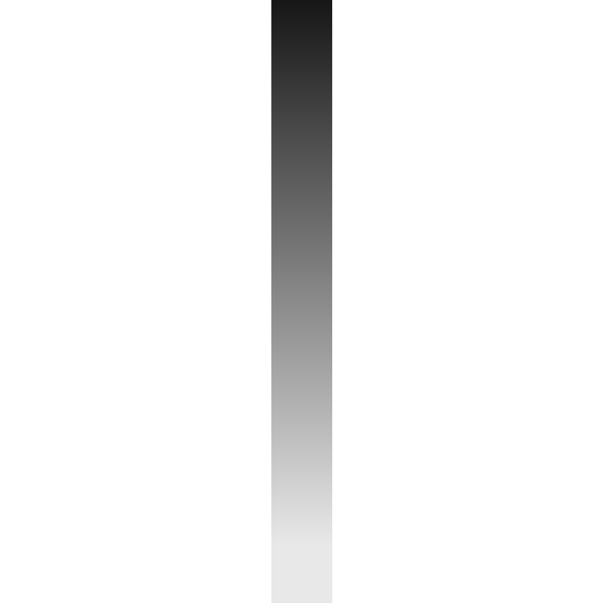
<figcaption>Figure 3: <span id="figure:greyscale"
label="figure:greyscale"></span>A simple greyscale raster image
generated from a numeric vector.</figcaption>
</figure>

As the previous example demonstrates, a numeric vector is interpreted as
a greyscale image, with 0 corresponding to black and 1 corresponding to
white. Other possibilities are logical vectors, which are interpreted as
black-and-white images, and character vectors, which are assumed to
contain either colour names or RGB strings of the form `"#RRGGBB"`.

The previous example also demonstrates that a vector is treated as a
matrix of pixels with a single column. More usefully, the image to draw
can be specified by an explicit matrix (numeric, logical, or character).
For example, the following code shows a simple way to visualize the
first 100 named colours in R.

``` r
> grid.raster(matrix(colors()[1:100], ncol=10), 
+             interpolate=FALSE)
```

<figure id="figure:colors">
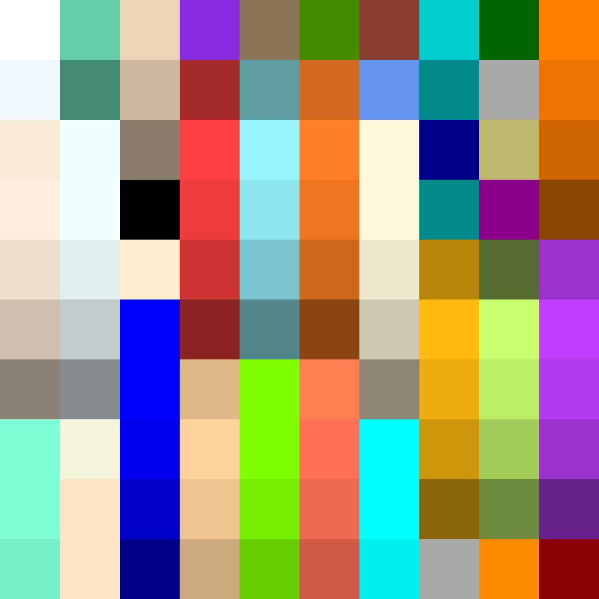
<figcaption>Figure 4: <span id="figure:colors"
label="figure:colors"></span>A raster image generated from a character
matrix (of the first 100 values in <code>colors()</code>).</figcaption>
</figure>

It is also possible to specify the raster image as a *numeric* array:
either three planes of red, green, and blue channels, or four planes
where the fourth plane provides an "alpha" (transparency) channel.

Greater control over the conversion to a `"raster"` object is possible
by directly calling the `as.raster()` function, as shown below.

``` r
> grid.raster(as.raster(1:10, max=11))
```

## Interpolation

The simple image matrix example above demonstrates another important
argument in both of the new raster functions---the `interpolate`
argument.

In most cases, a raster image is not going to be rendered at its
"natural" size (using exactly one device pixel for each pixel in the
image), which means that the image has to be resized. The `interpolate`
argument is used to control how that resizing occurs.

By default, the `interpolate` argument is `TRUE`, which means that what
is actually drawn by R is a linear interpolation of the pixels in the
original image. Setting `interpolate` to `FALSE` means that what gets
drawn is essentially a sample from the pixels in the original image. The
former case was used in Figure [3](#figure:greyscale) and it produces a
smoother result, while the latter case was used in Figure
[4](#figure:colors) and the result is more "blocky." Figure
[5](#figure:interpolate) shows the images from Figures
[3](#figure:greyscale) and [4](#figure:colors) with their interpolation
settings reversed.

``` r
> grid.raster(1:10/11, interpolate=FALSE)
```

``` r
> grid.raster(matrix(colors()[1:100], ncol=10))
```

<figure id="figure:interpolate">
<p>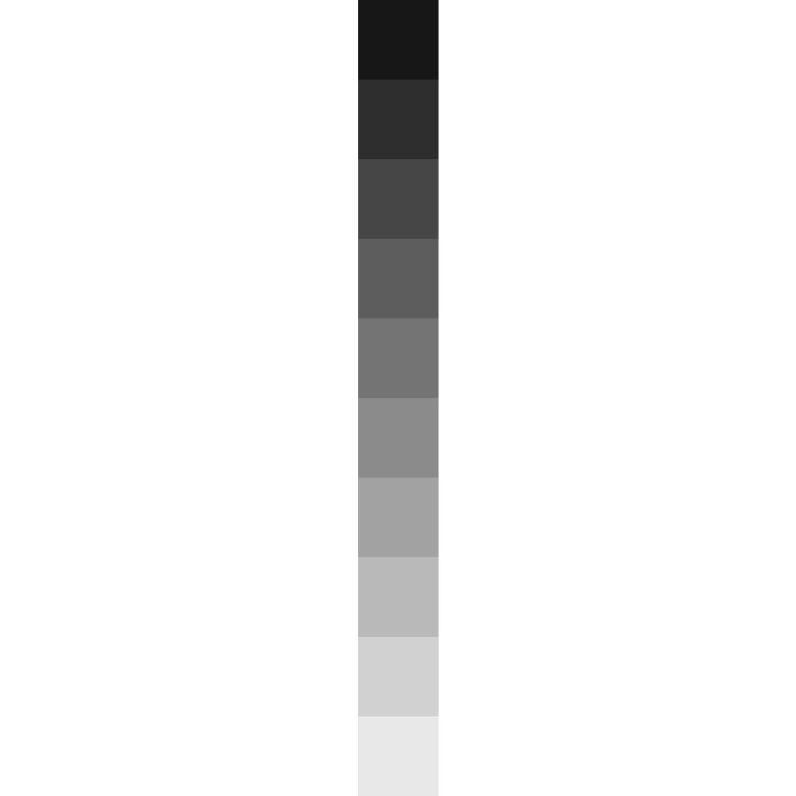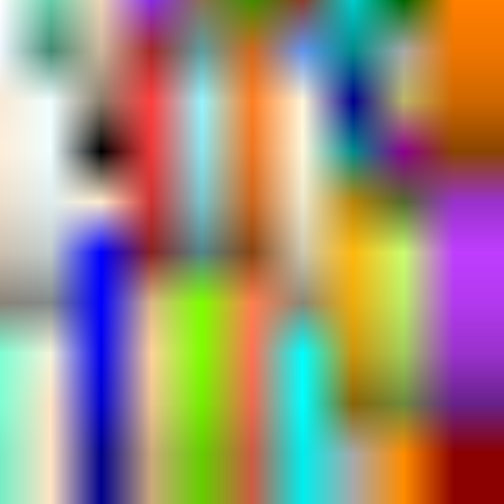</p>
<figcaption>Figure 5: <span id="figure:interpolate"
label="figure:interpolate"></span>The raster images from Figures and
with their interpolation settings reversed.</figcaption>
</figure>

The ability to use linear interpolation provides another advantage over
the old behaviour of drawing a rectangle per pixel. For example, Figure
[6](#figure:rlogo) shows a version of the R logo image drawn using both
the old behaviour and with the new raster support. The latter version of
the image is smoother thanks to linear interpolation.

``` r
> download.file("http://cran.r-project.org/Rlogo.jpg",
+               "Rlogo.jpg")
> library(ReadImages)
> logo <- read.jpeg("Rlogo.jpg")
```

``` r
> par(mar=rep(0, 4))
> plot(logo)
```

``` r
> grid.raster(logo)
```

<figure id="figure:rlogo">
<p>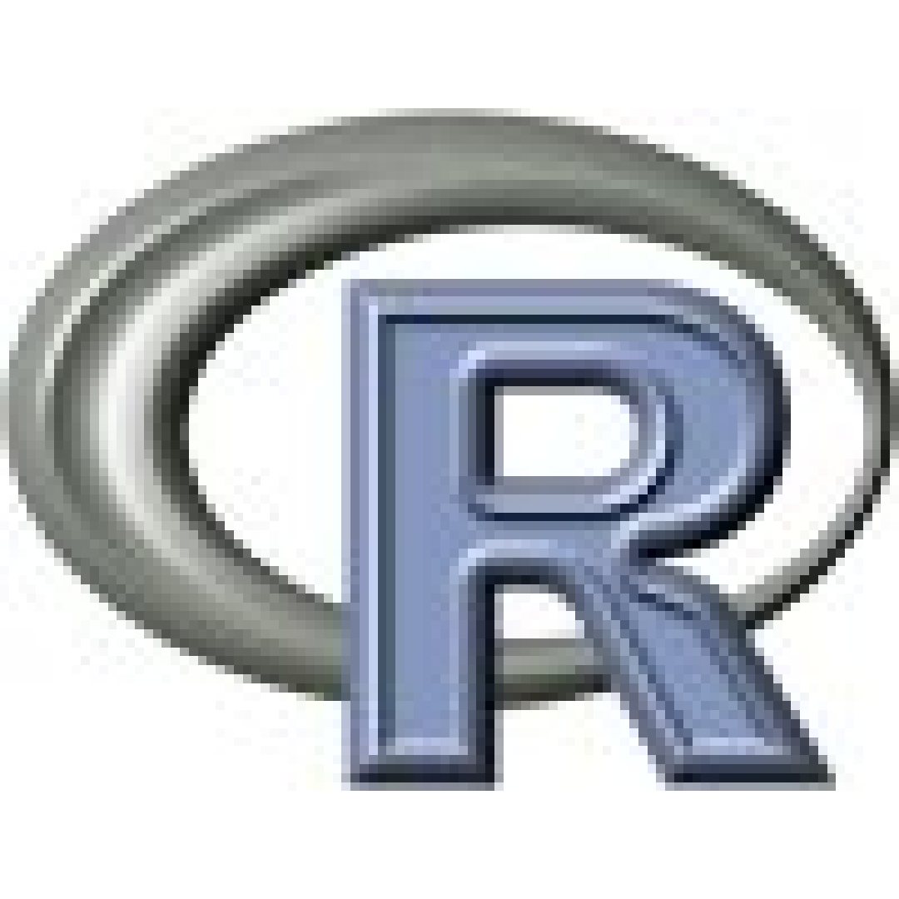</p>
<figcaption>Figure 6: <span id="figure:rlogo"
label="figure:rlogo"></span>The R logo drawn using the old behaviour of
drawing a small rectangle for each pixel (left) and using the new raster
support with linear interpolation (right), which produces a smoother
result.</figcaption>
</figure>

What has been described so far applies equally to the `rasterImage()`
function and the `grid.raster()` function. The next few sections look at
each of these functions separately to describe their individual
features.

## The `rasterImage()` function

The `rasterImage()` function is analogous to other low-level
[*graphics*](https://CRAN.R-project.org/package=graphics) functions,
such as `lines()` and `rect()`; it is designed to *add* a raster image
to the current plot.

The image is positioned by specifying the location of the bottom-left
and top-right corners of the image in user coordinates (i.e., relative
to the axis scales in the current plot).

To provide an example, the following code sets up a matrix of normalized
values based on a mathematical function (taken from the first example on
the `image()` help page).

``` r
> x <- y <- seq(-4*pi, 4*pi, len=27)
> r <- sqrt(outer(x^2, y^2, "+"))
> z <- cos(r^2)*exp(-r/6)
> image <- (z - min(z))/diff(range(z))
```

The following code draws a raster image from this matrix that occupies
the entire plot region (see Figure [7](#figure:rasterimage)). Notice
that some work needs to be done to correctly align the raster cells with
axis scales when the pixel coordinates in the image represent data
values.

``` r
> step <- diff(x)[1]
> xrange <- range(x) + c(-step/2, step/2)
> yrange <- range(y) + c(-step/2, step/2)
> plot(x, y, ann=FALSE, 
+      xlim=xrange, ylim=yrange,
+      xaxs="i", yaxs="i")
> rasterImage(image, 
+             xrange[1], yrange[1], 
+             xrange[2], yrange[2],
+             interpolate=FALSE)
```

<figure id="figure:rasterimage">
<div class="center">
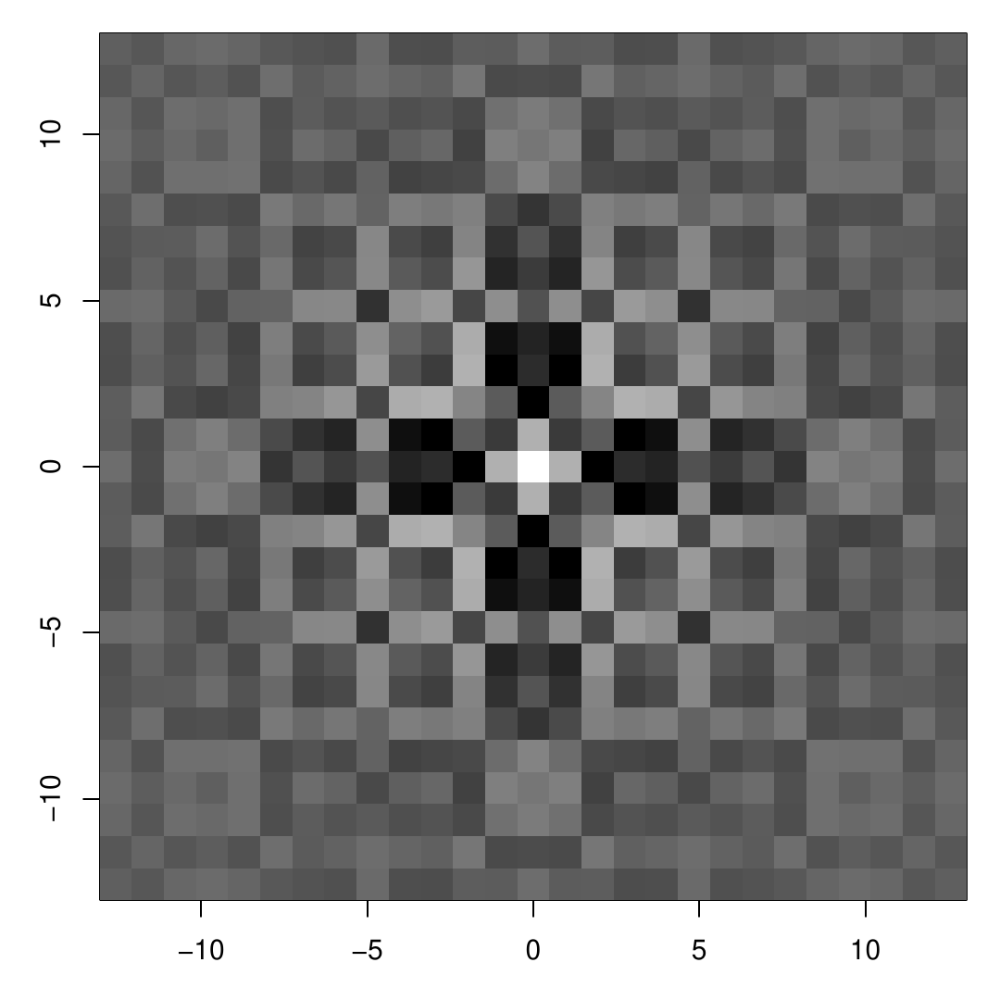
</div>
<figcaption>Figure 7: <span id="figure:rasterimage"
label="figure:rasterimage"></span>An image drawn from a matrix of
normalized values using <code>rasterImage()</code>.</figcaption>
</figure>

It is also possible to rotate the image (about the bottom-left corner)
via the `angle` argument.

To avoid distorting an image, some calculations using functions like
`xinch()`, `yinch()`, and `dim()` (to get the dimensions of the image)
may be required. More sophisticated support for positioning and sizing
the image is provided by `grid.raster()`.

## The `grid.raster()` function

The `grid.raster()` function works like any other
[*grid*](https://CRAN.R-project.org/package=grid) graphical primitive;
it draws a raster image within the current
[*grid*](https://CRAN.R-project.org/package=grid) viewport.

By default, the image is drawn as large as possible while still
respecting its native aspect ratio (Figure [3](#figure:greyscale) shows
an example of this behaviour). Otherwise, the image is positioned
according to the arguments `x` and `y` (justified by `just`, `hjust`,
and `vjust`) and sized via `width` and `height`. If only one of `width`
or `height` is given, then the aspect ratio of the image is preserved
(and the image may extend beyond the current viewport).

Any of `x`, `y`, `width`, and `height` can be vectors, in which case
multiple copies of the image are drawn. For example, the following code
uses `grid.raster()` to draw the R logo within each bar of a
[*lattice*](https://CRAN.R-project.org/package=lattice) barchart.

``` r
> x <- c(0.00, 0.40, 0.86, 0.85, 0.69, 0.48, 
+        0.54, 1.09, 1.11, 1.73, 2.05, 2.02)
> library(lattice)
```

``` r
> barchart(1:12 ~ x, origin=0, col="white",
+          panel=function(x, y, ...) {
+              panel.barchart(x, y, ...)
+              grid.raster(logo, x=0, width=x, y=y, 
+                          default.units="native",
+                          just="left",
+                          height=unit(2/37, 
+                            "npc"))
+          })
```

<figure id="figure:gridraster">
<div class="center">
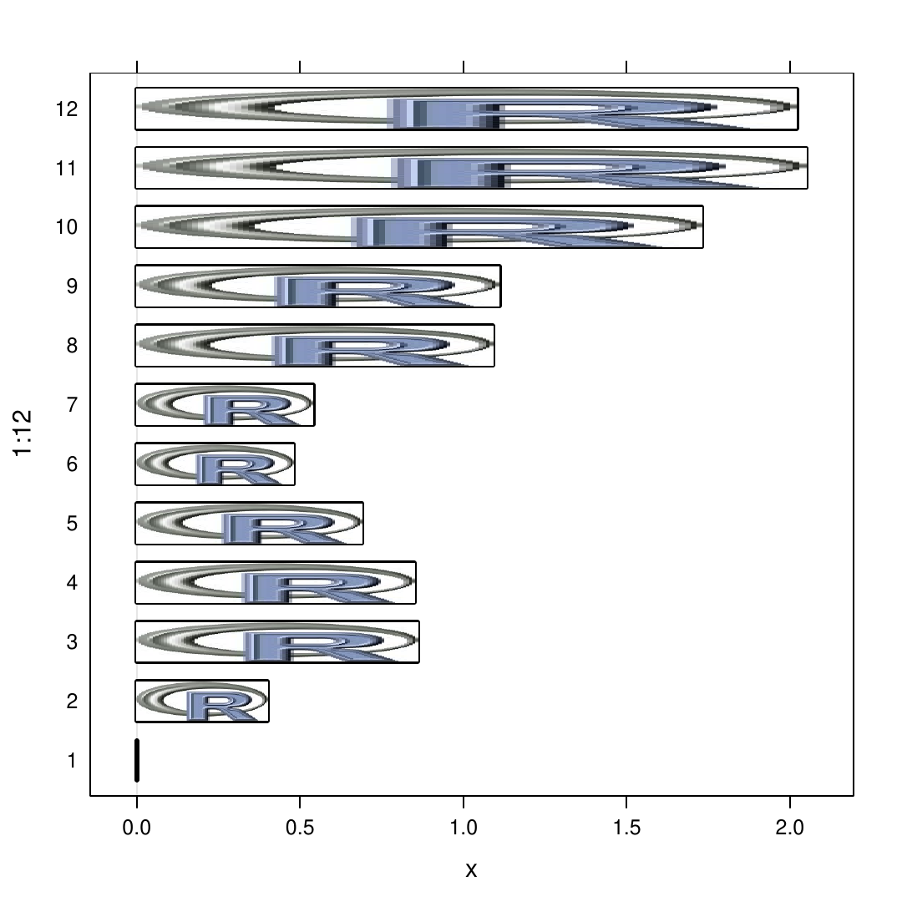
</div>
<figcaption>Figure 8: <span id="figure:gridraster"
label="figure:gridraster"></span>A <a
href="https://CRAN.R-project.org/package=lattice"><em>lattice</em></a>
barchart of the change in the “level of interest in R” during 1996 (see
<code>demo(graphics)</code>) with the R logo image used to annotate each
bar (with apologies to Edward Tufte and all of his heirs and disciples).
</figcaption>
</figure>

In addition to `grid.raster()`, there is also a `rasterGrob()` function
to create a raster image graphical object.

## Support for raster image packages

A common source of raster images is likely to be external files, such as
digital photos and medical scans. A number of R packages exist to read
general raster formats, such as JPEG or TIFF files, plus there are many
packages to support more domain-specific formats, such as NIFTI and
ANALYZE.

Each of these packages creates its own sort of data structure to
represent the image within R, so in order to render an image from an
external file, the data structure must be converted to something that
`rasterImage()` or `grid.raster()` can handle.

Ideally, the package will provide a method for the `as.raster()`
function to convert the package-specific image data structure into a
`"raster"` object. In the absence of that, the simplest path is to
convert the data structure into a matrix or array, for which there
already exist `as.raster()` methods.

In the example that produced Figure [6](#figure:rlogo), the R logo was
loaded into R using the
[*ReadImages*](https://CRAN.R-project.org/package=ReadImages) package,
which created an `"imagematrix"` object called `logo`. This object could
be passed directly to either `rasterImage()` or `grid.raster()` because
an `"imagematrix"` is also an array, so the predefined conversion for
arrays did the job.

# Profiling

This section briefly demonstrates that the claimed improvements in terms
of file size and speed of rendering are actually true. The following
code generates a simple random test case image (see Figure
[9](#figure:test)). The only important feature of this image is that it
is a reasonably large image (in terms of number of pixels).

``` r
> z <- matrix(runif(500*500), ncol=500)
```

<figure id="figure:test">
<div class="center">
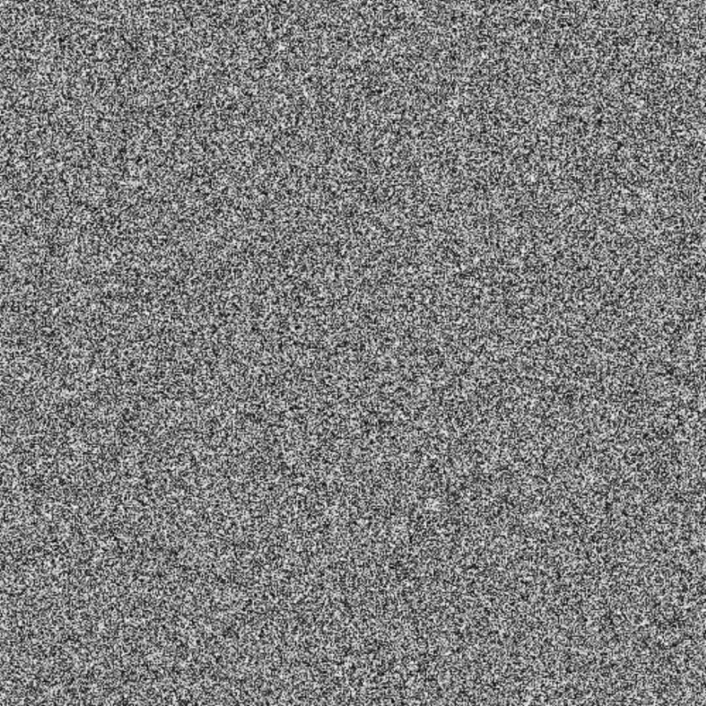
</div>
<figcaption>Figure 9: <span id="figure:test"
label="figure:test"></span>A simple random test image. </figcaption>
</figure>

The following code demonstrates that a PDF version of this image is
almost an order of magnitude larger if drawn using a rectangle per pixel
(via the `image()` function) compared to a file that is generated using
`grid.raster()`.

``` r
> pdf("image.pdf")
> image(z, col=grey(0:99/100))
> dev.off()
```

``` r
> pdf("gridraster.pdf")
> grid.raster(z, interp=FALSE)
> dev.off()
```

``` r
> file.info("image.pdf", "gridraster.pdf")["size"]
```

``` r
                   size
image.pdf      14893004
gridraster.pdf  1511031
```

The current encoding of the raster image in the PDF file is maximally
naive, so this represents a lower bound on the memory saving. It would
be possible to make much larger memory savings if a more sophisticated
encoding method was implemented. Having said that, in situations where
the raster image represents actual data (e.g., microarray data), it
would be important to use a *lossless* encoding in order to preserve
each individual "pixel" of data. In the case where every pixel counts,
it is also worth noting that not all pixels will be visible when viewing
an image at a reduced size (though this is true whether the image is
rendered as pixels or small rectangles).

The next piece of code can be used to demonstrate that rendering speed
is also much slower when drawing an image to screen as many small
rectangles. The timings are from a run on a CentOS Linux system with the
Cairo-based X11 device. There are likely to be significant differences
to these results if this code is run on other systems.

``` r
> system.time({
+     for (i in 1:10) {
+         image(z, col=grey(0:99/100))
+     }
+ })
```

``` r
   user  system elapsed 
 42.017   0.188  42.484 
```

``` r
> system.time({
+     for (i in 1:10) {
+         grid.newpage()
+         grid.raster(z, interpolate=FALSE)
+     }
+ })
```

``` r
   user  system elapsed 
  2.013   0.081   2.372 
```

This is not a completely fair comparison because there are different
amounts of input checking and housekeeping occurring inside the
`image()` function and the `grid.raster()` function, but more detailed
profiling (with `Rprof()`) was used to determine that most of the time
was being spent by `image()` doing the actual rendering.

# Examples

This section demonstrates some possible applications of the new raster
support.

The most obvious application is simply to use the new functions wherever
images are currently being drawn as many small rectangles using a
function like `image()`. For example, @huber used the new raster
graphics support in R in the production of gene expression profiles (see
Figure [10](#figure:huber)).

<figure id="figure:huber">
<div class="center">
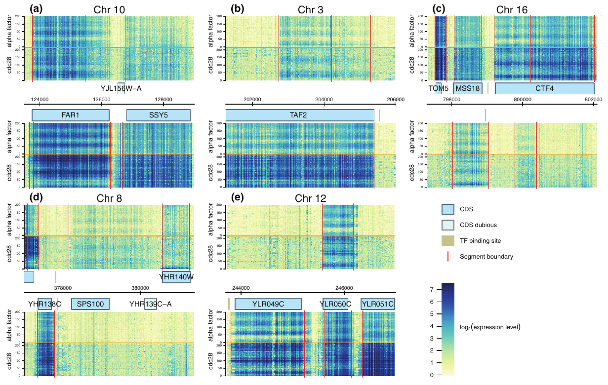
</div>
<figcaption>Figure 10: <span id="figure:huber"
label="figure:huber"></span>An example of the use of raster images in an
R graphic <span class="citation" data-cites="huber">(reproduced from
Figure 3 of Granovskaia, L. M. Jensen, M. E. Ritchie, J. Toedling,
Y. Ning, P. Bork, W. Huber, and L. M. Steinmetz 2010, which was
published as an open access article by Biomed
Central)</span>.</figcaption>
</figure>

Having raster images as a graphical primitive also makes it easier to
think about performing some graphical tricks that were not necessarily
obvious before. An example is gradient fills, which are not explicitly
supported by the R graphics engine. The following code shows a simple
example where the bars of a barchart are filled with a greyscale
gradient (see Figure [11](#figure:gradient)).

``` r
> barchart(1:12 ~ x, origin=0, col="white",
+          panel=function(x, y, ...) {
+              panel.barchart(x, y, ...)
+              grid.raster(t(1:10/11), x=0, 
+                          width=x, y=y, 
+                          default.units="native",
+                          just="left",
+                          height=unit(2/37, 
+                            "npc"))
+          })
```

<figure id="figure:gradient">
<div class="center">
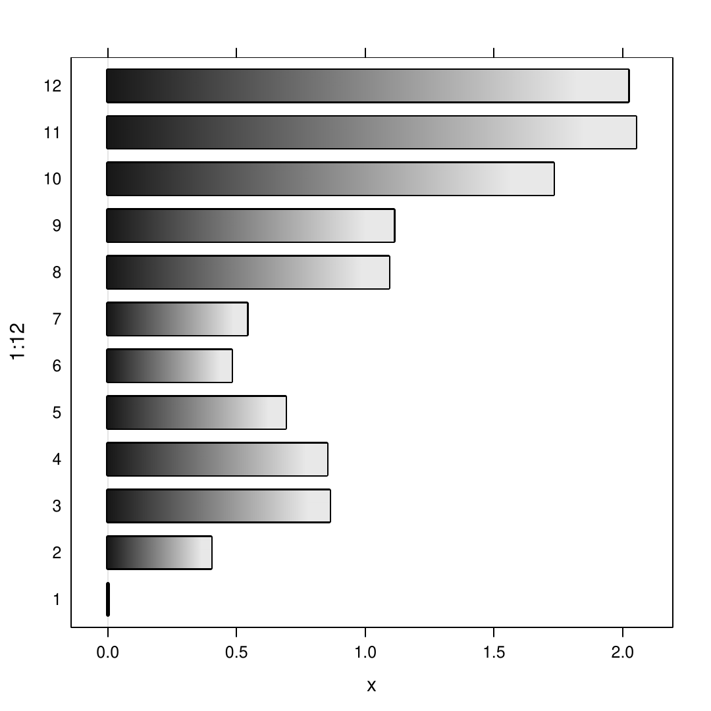
</div>
<figcaption>Figure 11: <span id="figure:gradient"
label="figure:gradient"></span>A <a
href="https://CRAN.R-project.org/package=lattice"><em>lattice</em></a>
barchart of the change in the “level of interest in R” during 1996 (see
<code>demo(graphics)</code>) with the a greyscale gradient used to fill
each bar (once again, begging the forgiveness of Edward Tufte).
</figcaption>
</figure>

Another example is non-rectangular clipping operations via raster
"masks" (R's graphics engine only supports clipping to rectangular
regions).[^1] The code below is used to produce a map of Spain that is
filled with black (see Figure [12](#figure:spain)).

``` r
> library(maps)
> par(mar=rep(0, 4))
> map(region="Spain", col="black", fill=TRUE)
```

Having produced this image on screen, the function `grid.cap()` can be
used to capture the current screen image as a raster object.

``` r
> mask <- grid.cap()
```

An alternative approach would be produce a PNG file and read that in,
but `grid.cap()` is more convenient for interactive use.

The following code reads in a raster image of the Spanish flag from an
external file (using the [*png*](https://CRAN.R-project.org/package=png)
package), converting the image to a `"raster"` object.

``` r
> library(png)
> espana <- readPNG("1000px-Flag_of_Spain.png")
> espanaRaster <- as.raster(espana)
```

We now have two raster images in R. The following code trims the flag
image on its right edge and trims the map of Spain on its bottom edge so
that the two images are the same size (demonstrating that `"raster"`
objects can be subsetted like matrices).

``` r
> espanaRaster <- espanaRaster[, 1:dim(mask)[2]]
> mask <- mask[1:dim(espanaRaster)[1], ]
```

Now, we use the map as a "mask" to set all pixels in the flag image to
transparent wherever the map image is not black (demonstrating that
assigning to subsets also works for `"raster"` objects).

``` r
> espanaRaster[mask != "black"] <- "transparent"
```

The flag image can now be used to fill a map of Spain, as shown by the
following code (see Figure [12](#figure:spain)).

``` r
> par(mar=rep(0, 4))
> map(region="Spain")
> grid.raster(espanaRaster, y=1, just="top")
> map(region="Spain", add=TRUE)
```

<figure id="figure:spain">
<p>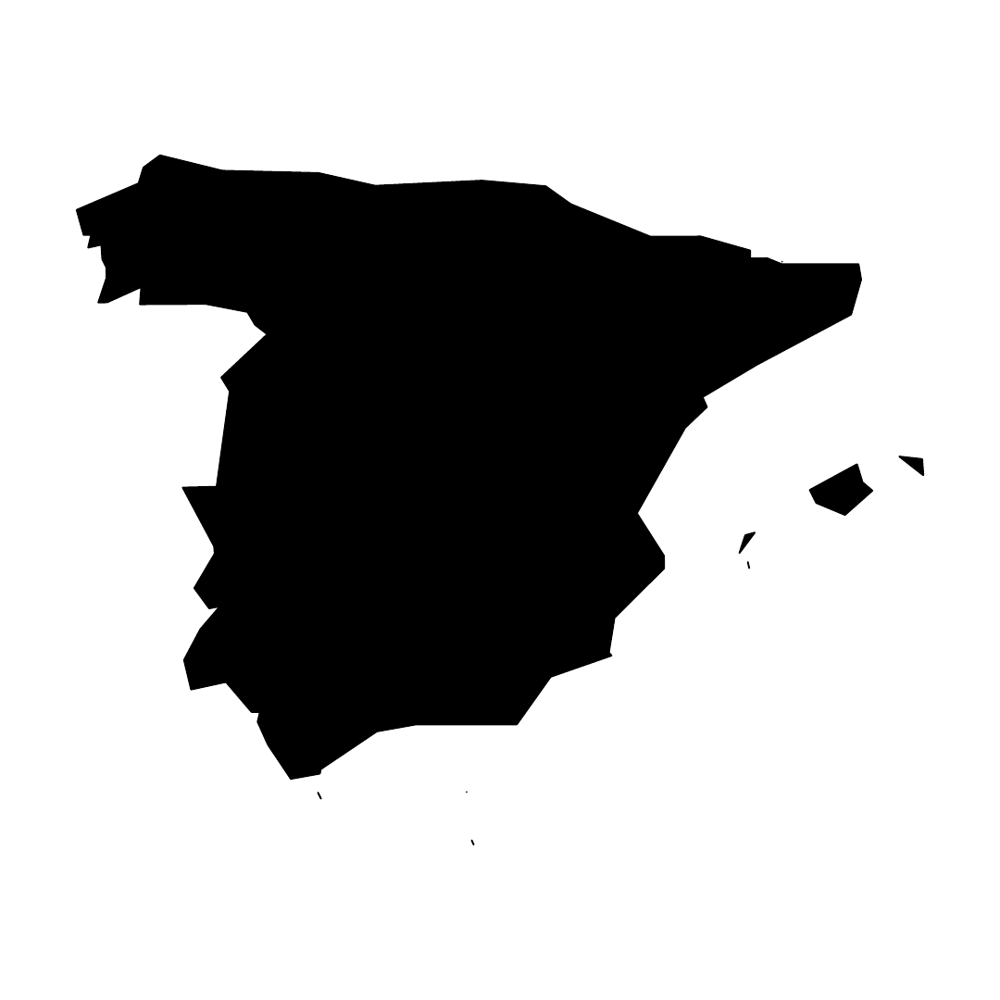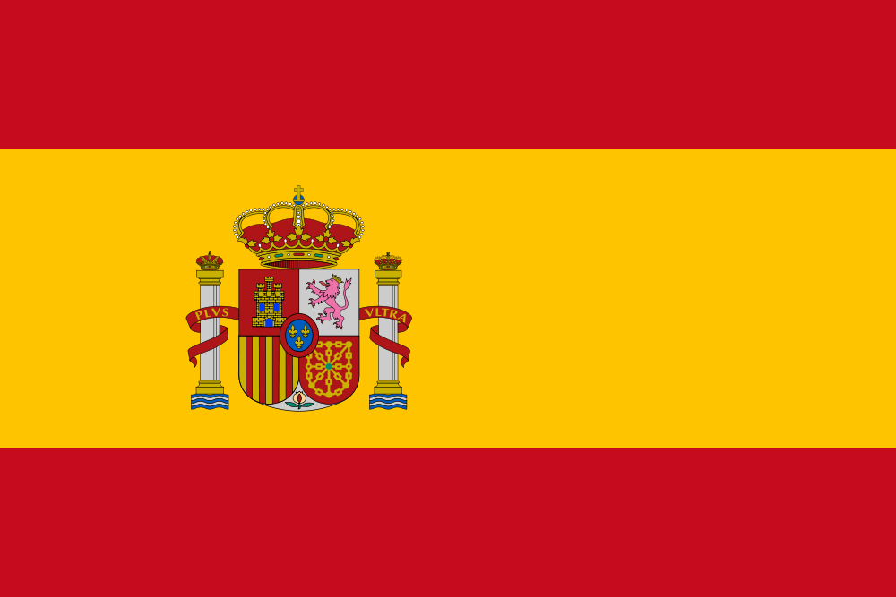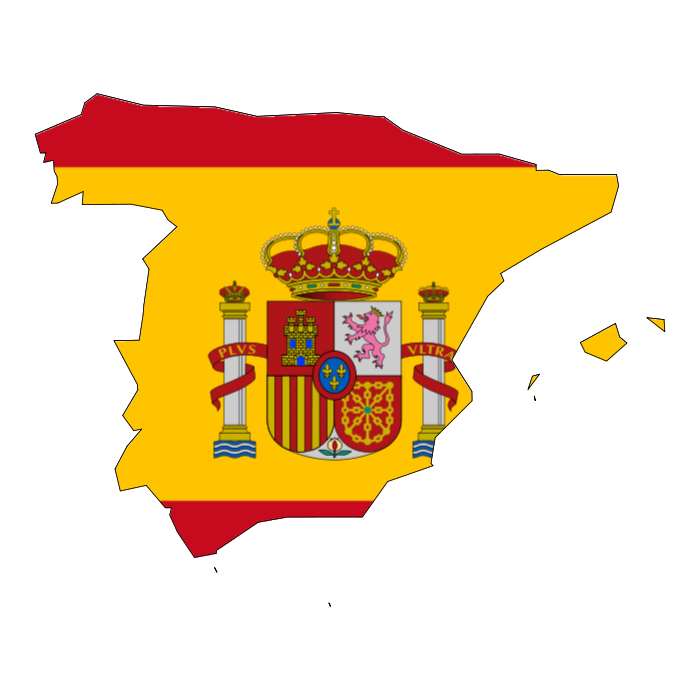</p>
<figcaption>Figure 12: <span id="figure:spain"
label="figure:spain"></span>A raster image of the Spanish flag being
used as a fill pattern for a map of Spain. On the left is a map of spain
filled in black (produced by the <code>map()</code> function from the <a
href="https://CRAN.R-project.org/package=maps"><em>maps</em></a>
package). In the middle is a PNG image of Spanish flag (a public domain
image from Wikimedia Commons, <a
href="http://en.wikipedia.org/wiki/File:Flag_of_Spain.svg"
class="uri">http://en.wikipedia.org/wiki/File:Flag_of_Spain.svg</a>),
and on the right is the result of clipping the Spanish flag image using
the map as a mask.</figcaption>
</figure>

# Known issues

The raster image support has been implemented for the primary screen
graphics devices that are distributed with R---Cairo (for Linux), Quartz
(for MacOS X), and Windows---plus the vector file format devices for PDF
and PostScript. The screen device support also covers support for
standard raster file formats (e.g., PNG) on each platform.

The X11 device has basic raster support, but rotated images can be
problematic and there is no support for transparent pixels in the image.
The Windows device does not support images with a different alpha level
per pixel.

There is no support for raster images for the XFig or PiCTeX devices.

A web page on the R developer web site,
<http://developer.r-project.org/Raster/raster-RFC.html>, will be
maintained to show the ongoing state of raster support.

# Summary

The R graphics engine now has native support for rendering raster
images. This will improve rendering speed and memory efficiency for
plots that contain large raster images. It also broadens the set of
graphical effects that are possible (or convenient) with R.

# Acknowledgements

Thanks to the editors and reviewers for helpful comments and suggestions
that have significantly improved this article.

\
:::

[^1]: This example depends on R version 2.12.1
