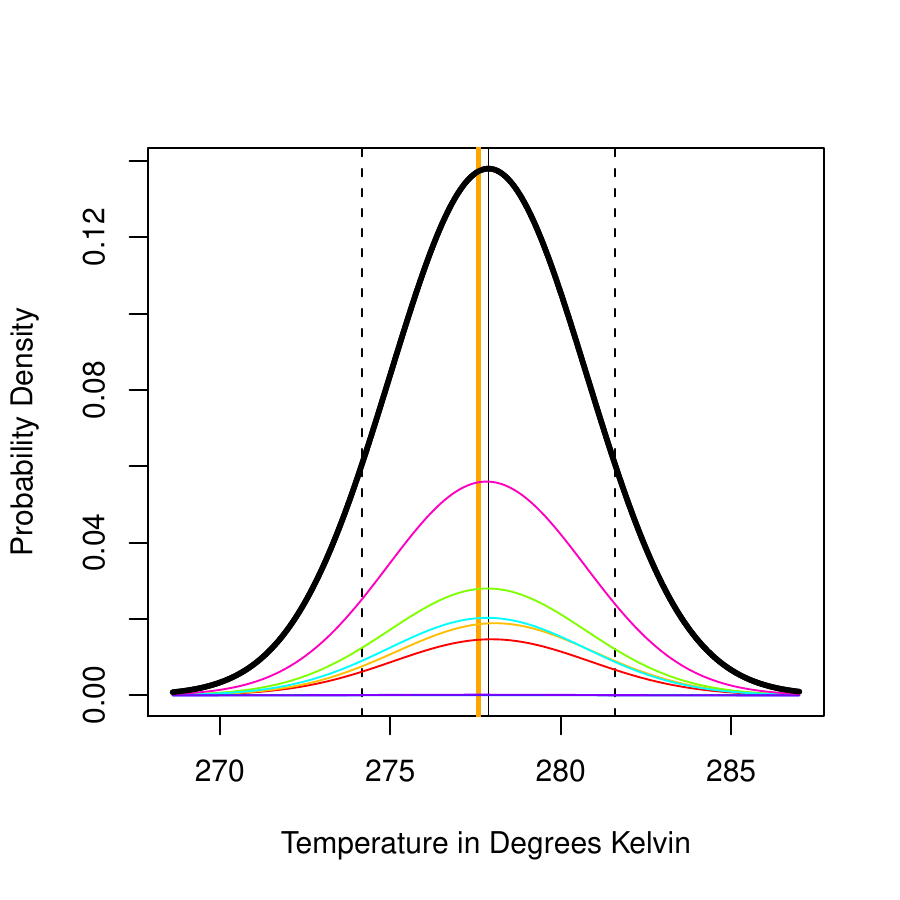
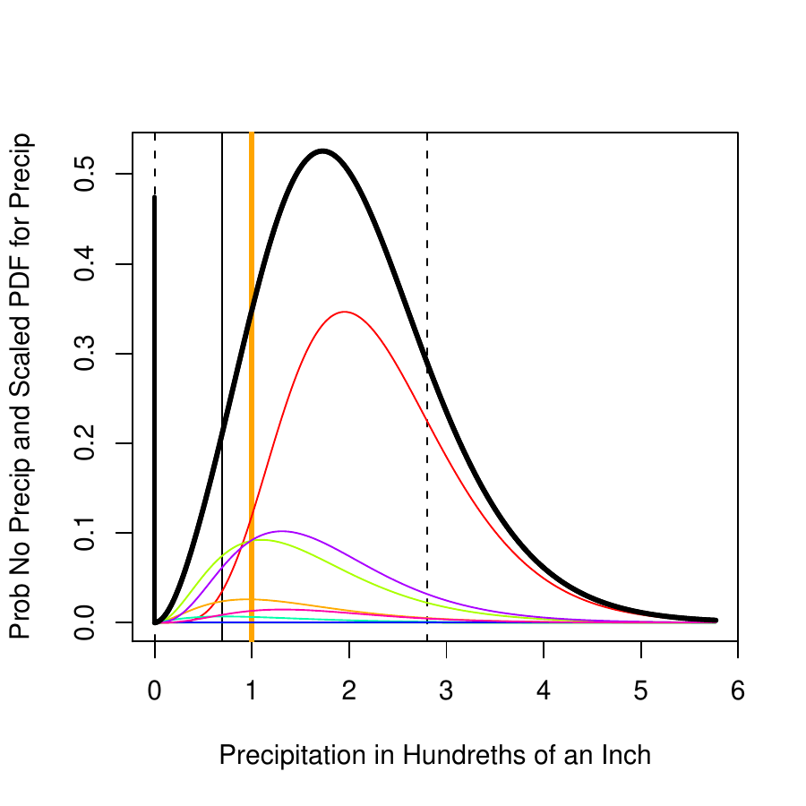
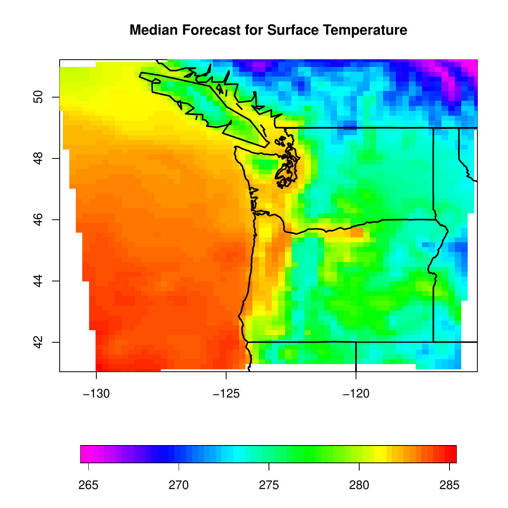
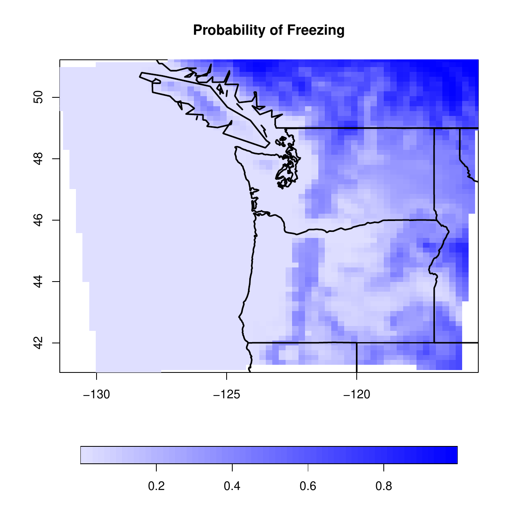
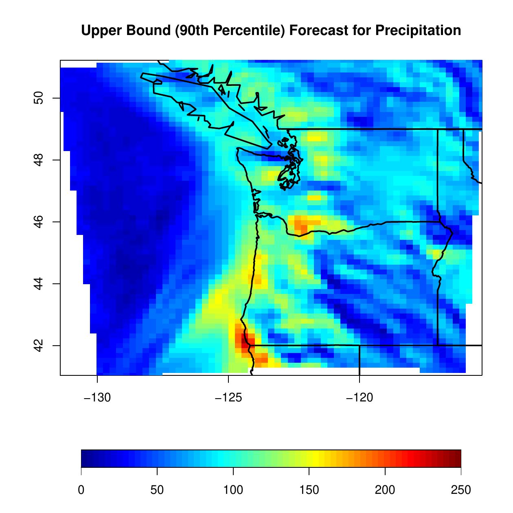
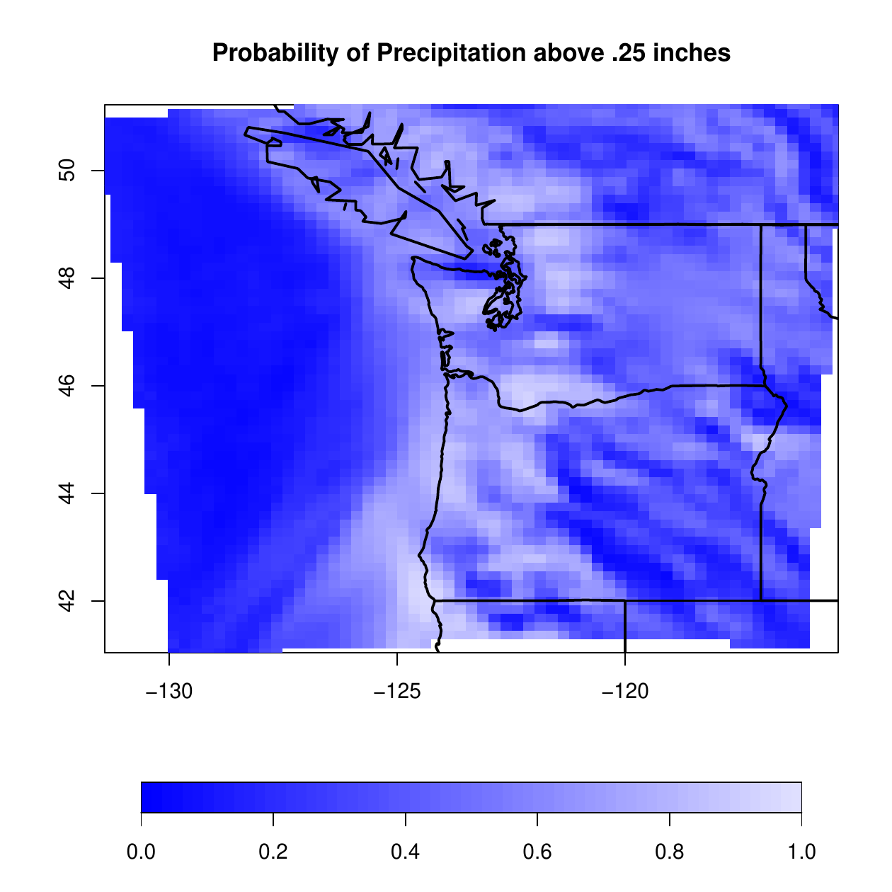
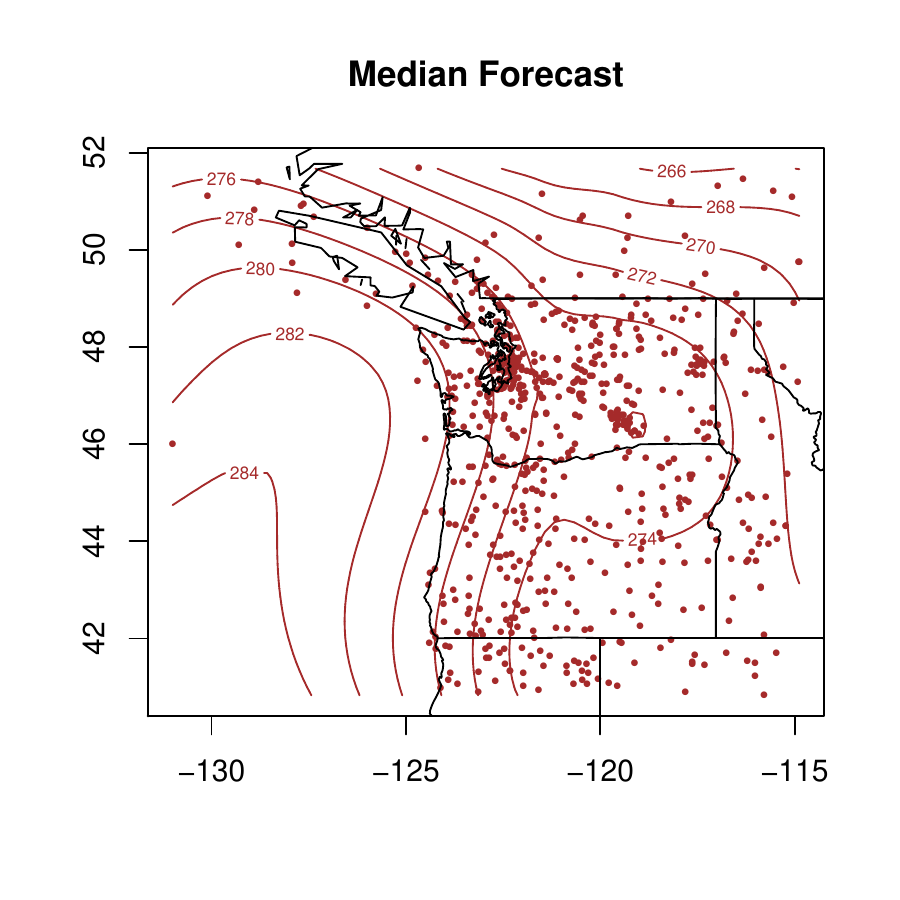
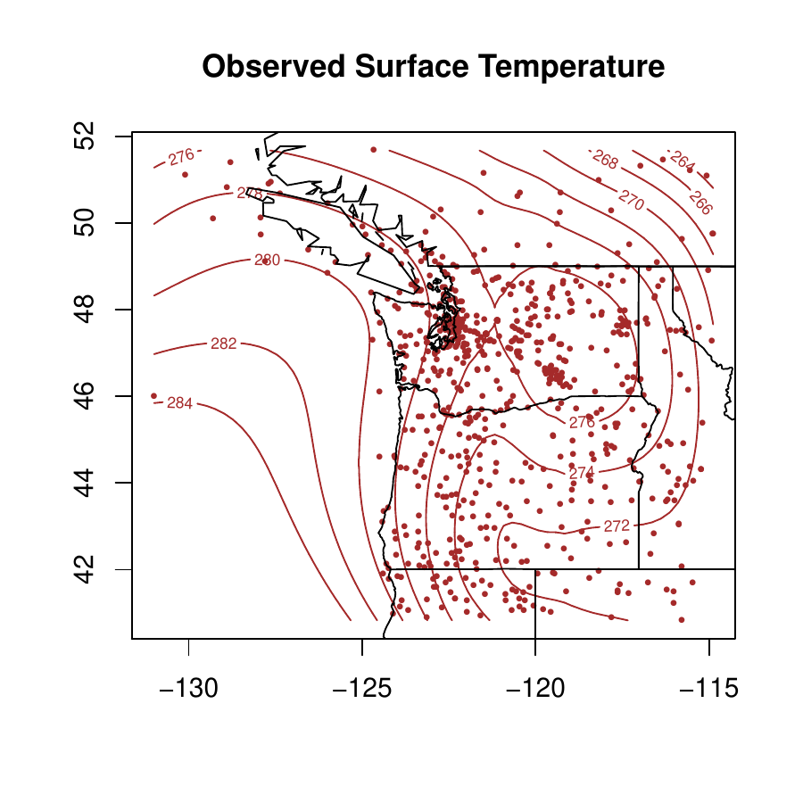
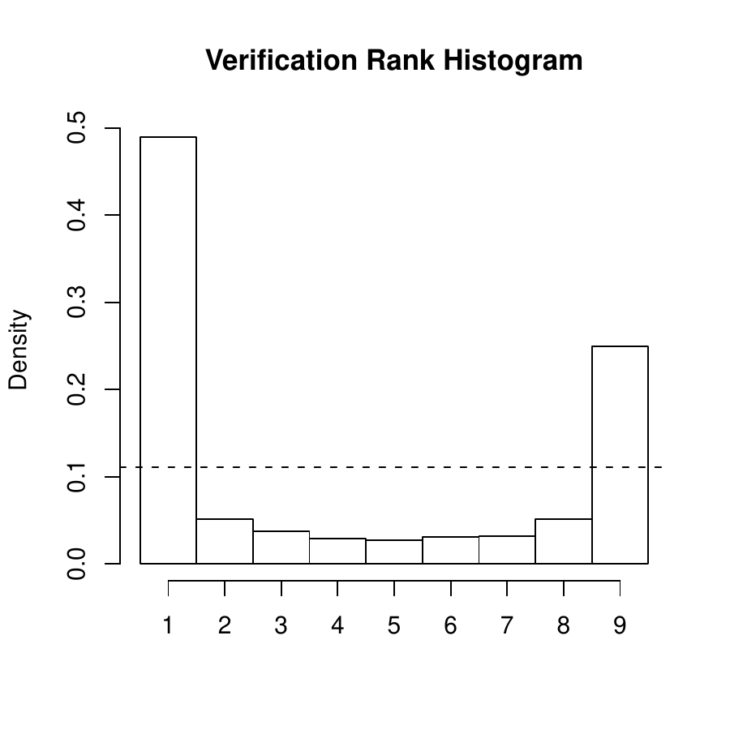
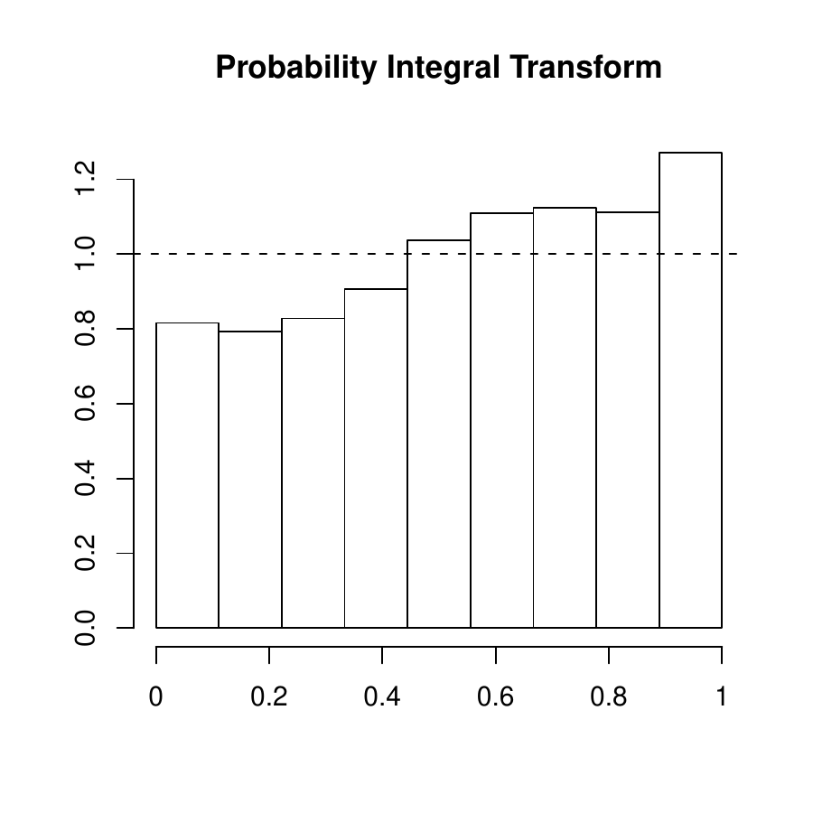

::: article
# Introduction

Over the past two decades, weather forecasting has experienced a
paradigm shift towards probabilistic forecasts, which take the form of
probability distributions over future weather quantities and events.
Probabilistic forecasts allow for optimal decision making for many
purposes, including air traffic control, ship routing, agriculture,
electricity generation and weather-risk finance.

Up to the early 1990s, most weather forecasting was deterministic,
meaning that only one "best" forecast was produced by a numerical model.
The recent advent of ensemble prediction systems marks a radical change.
An ensemble forecast consists of multiple numerical forecasts, each
computed in a different way. Statistical postprocessing is then used to
convert the ensemble into calibrated and sharp probabilistic forecasts
[@GneitingRaftery2005].

# The [*ensembleBMA*](https://CRAN.R-project.org/package=ensembleBMA) package

The [*ensembleBMA*](https://CRAN.R-project.org/package=ensembleBMA)
package [@ensembleBMApackage] offers statistical postprocessing of
forecast ensembles via Bayesian model averaging (BMA). It provides
functions for model fitting and forecasting with ensemble data that may
include missing and/or exchangeable members. The modeling functions
estimate BMA parameters from training data via the EM algorithm.
Currently available options are normal mixture models (appropriate for
temperature or pressure), mixtures of gamma distributions (appropriate
for wind speed), and Bernoulli-gamma mixtures with a point mass at zero
(appropriate for quantitative precipitation). Functions for verification
that assess predictive performance are also available.

The BMA approach to the postprocessing of ensemble forecasts was
introduced by @Raftery&2005 and has been developed in @Berrocal&2007,
@Sloughter&2007, @Wilson&2007, @Fraley&2010 and @Sloughter&2010. Detail
on verification procedures can be found in @GneitingRaftery2007 and
@Gneiting&2007.

## `"ensembleData"` objects

Ensemble forecasting data for weather typically includes some or all of
the following information:

-   ensemble member forecasts

-   initial date

-   valid date

-   forecast hour (prediction horizon)

-   location (latitude, longitude, elevation)

-   station and network identification

The initial date is the day and time at which initial conditions are
provided to the numerical weather prediction model, to run forward the
partial differential equations that produce the members of the forecast
ensemble. The forecast hour is the prediction horizon or time between
initial and valid dates. The ensemble member forecasts then are valid
for the hour and day that correspond to the forecast hour ahead of the
initial date. In all the examples and illustrations in this article, the
prediction horizon is 48 hours.

For use with the
[*ensembleBMA*](https://CRAN.R-project.org/package=ensembleBMA) package,
data must be organized into an `"ensembleData"` object that minimally
includes the ensemble member forecasts. For model fitting and
verification, the corresponding weather observations are also needed.
Several of the model fitting functions can produce forecasting models
over a sequence of dates, provided that the `"ensembleData"` are for a
single prediction horizon. Attributes such as station and network
identification, and latitude and longitude, may be useful for plotting
and/or analysis but are not currently used in any of the modeling
functions. The `"ensembleData"` object facilitates preservation of the
data as a unit for use in processing by the package functions.

Here we illustrate the creation of an `"ensembleData"` object called
`srftData` that corresponds to the `srft` data set of surface
temperature [@Berrocal&2007]:

``` r
data(srft)
members <- c("CMCG", "ETA", "GASP", "GFS",
             "JMA", "NGPS", "TCWB", "UKMO")
srftData <- 
  ensembleData(forecasts = srft[,members],
    dates = srft$date, 
    observations = srft$obs,
    latitude = srft$lat,
    longitude = srft$lon,
    forecastHour = 48)
```

The `dates` specification in an `"ensembleData"` object refers to the
valid dates for the forecasts.

#### Specifying exchangeable members.

Forecast ensembles may contain members that can be considered
exchangeable (arising from the same generating mechanism, such as random
perturbations of a given set of initial conditions) and for which the
BMA parameters, such as weights and bias correction coefficients, should
be the same. In
[*ensembleBMA*](https://CRAN.R-project.org/package=ensembleBMA),
exchangeability is specified by supplying a vector that represents the
grouping of the ensemble members. The non-exchangeable groups consist of
singleton members, while exchangeable members belong to the same group.
See @Fraley&2010 for a detailed discussion.

#### Specifying dates.

Functions that rely on the
[*chron*](https://CRAN.R-project.org/package=chron) package
[@chronPackage] are provided for converting to and from Julian dates.
These functions check for proper format (`YYYYMMDD` or `YYYYMMDDHH`).

## BMA forecasting

BMA generates full predictive probability density functions (PDFs) for
future weather quantities. Examples of BMA predictive PDFs for
temperature and precipitation are shown in Figure
[1](#fig:predictivePDFs).

<figure id="fig:predictivePDFs">
<p></p>
<figcaption>Figure 1: BMA predictive distributions for temperature (in
degrees Kelvin) valid January 31, 2004 (left) and for precipitation (in
hundredths of an inch) valid January 15, 2003 (right), at Port Angeles,
Washington at 4PM local time, based on the eight-member University of
Washington Mesoscale Ensemble . The thick black curve is the BMA PDF,
while the colored curves are the weighted PDFs of the constituent
ensemble members. The thin vertical black line is the median of the BMA
PDF (occurs at or near the mode in the temperature plot), and the dashed
vertical lines represent the 10th and 90th percentiles. The orange
vertical line is at the verifying observation. In the precipitation plot
(right), the thick vertical black line at zero shows the point mass
probability of no precipitation (47%). The densities for positive
precipitation amounts have been rescaled, so that the maximum of the
thick black BMA PDF agrees with the probability of precipitation
(53%).</figcaption>
</figure>

#### Surface temperature example.

As an example, we fit a BMA normal mixture model for forecasts of
surface temperature valid January 31, 2004, using the `srft` training
data. The `"ensembleData"` object `srftData` created in the previous
section is used to fit the predictive model, with a rolling training
period of 25 days, excluding the two most recent days because of the 48
hour prediction horizon.

One of several options is to use the function `ensembleBMA` with the
valid date(s) of interest as input to obtain the associated BMA fit(s):

``` r
srftFit <- 
  ensembleBMA(srftData, dates = "2004013100", 
    model = "normal", trainingDays = 25)
```

When no dates are specified, a model fit is produced for each date for
which there are sufficient training data for the desired rolling
training period.

The BMA predictive PDFs can be plotted as follows, with Figure
[1](#fig:predictivePDFs) showing an example:

``` r
plot(srftFit, srftData, dates = "2004013100")
```

This steps through each location on the given dates, plotting the
corresponding BMA PDFs.

Alternatively, the modeling process for a single date can be separated
into two steps: first extracting the training data, and then fitting the
model directly using the `fitBMA` function. See @Fraley&2007 for an
example. A limitation of this approach is that date information is not
automatically retained.

Forecasting is often done on grids that cover an area of interest,
rather than at station locations. The dataset `srftGrid` provides
ensemble forecasts of surface temperature initialized on January 29,
2004 and valid for January 31, 2004 at grid locations in the same region
as that of the `srft` stations.

Quantiles of the BMA predictive PDFs at the grid locations can be
obtained with the function `quantileForecast`:

``` r
srftGridForc <- quantileForecast(srftFit, 
  srftGridData, quantiles = c( .1, .5, .9))
```

Here `srftGridData` is an `"ensembleData"` object created from
`srftGrid`, and `srftFit` provides a forecasting model for the
corresponding date.[^1] The forecast probability of temperatures below
freezing at the grid locations can be computed with the `cdf` function,
which evaluates the BMA cumulative distribution function:

``` r
probFreeze <- cdf(srftFit, srftGridData, 
  date = "2004013100", value = 273.15)
```

In the `srft` and `srftGrid` datasets, temperature is recorded in
degrees Kelvin (K), so freezing occurs at 273.15 K.

These results can be displayed as image plots using the `plotProbcast`
function, as shown in Figure [2](#fig:srftGrid310104), in which darker
shades represent higher probabilities. The plots are made by binning
values onto a plotting grid, which is the default in `plotProbcast`.
Loading the [*fields*](https://CRAN.R-project.org/package=fields)
[@fieldsPackage] and [*maps*](https://CRAN.R-project.org/package=maps)
[@mapsPackage] packages enables display of the country and state
outlines, as well as a legend.

<figure id="fig:srftGrid310104">
<p></p>
<figcaption>Figure 2: Image plots of the BMA median forecast for surface
temperature and BMA probability of freezing over the Pacific Northwest,
valid January 31, 2004. </figcaption>
</figure>

#### Precipitation example.

The `prcpFit` dataset consists of the fitted BMA parameters for 48 hour
ahead forecasts of daily precipitation accumulation (in hundredths of an
inch) over the U.S. Pacific Northwest from December 12, 2002 through
March 31, 2005, as described by @Sloughter&2007. The fitted models are
Bernoulli-gamma mixtures with a point mass at zero that apply to the
cube root transformation of the ensemble forecasts and observed data. A
rolling training period of 30 days is used. The dataset used to obtain
`prcpFit` is not included in the package on account of its size.
However, the corresponding `"ensembleData"` object can be constructed in
the same way as illustrated for the surface temperature data, and the
modeling process also is analogous, except that the `"gamma0"` model for
quantitative precipitation is used in lieu of the `"normal"` model.

The `prcpGrid` dataset contains gridded ensemble forecasts of daily
precipitation accumulation in the same region as that of `prcpFit`,
initialized January 13, 2003 and valid January 15, 2003. The BMA median
and upper bound (90th percentile) forecasts can be obtained and plotted
as follows:

``` r
data(prcpFit)

prcpGridForc <- quantileForecast( 
  prcpFit, prcpGridData, date = "20030115", 
  q = c(0.5, 0.9))
```

Here `prcpGridData` is an `"ensembleData"` object created from the
`prcpGrid` dataset. The 90th percentile plot is shown in Figure
[3](#fig:prcp150103).

<figure id="fig:prcp150103">
<p> </p>
<figcaption>Figure 3: Image plots of the BMA upper bound (90th
percentile) forecast of precipitation accumulation (in hundredths of an
inch), and the BMA probability of precipitation exceeding .25 inches
over the Pacific Northwest, valid January 15, 2003. </figcaption>
</figure>

The probability of precipitation and the probability of precipitation
above $.25$ inches can be obtained as follows:

``` r
probPrecip <- 1 - cdf(prcpFit, prcpGridData, 
  date = "20030115", values = c(0, 25))
```

The plot for the BMA forecast probability of precipitation accumulation
exceeding $.25$ inches is also shown in Figure [3](#fig:prcp150103).

## Verification

The [*ensembleBMA*](https://CRAN.R-project.org/package=ensembleBMA)
functions for verification can be used whenever observed weather
conditions are available. Included are functions to compute verification
rank and probability integral transform histograms, the mean absolute
error, continuous ranked probability score, and Brier score.

#### Mean absolute error, continuous ranked probability score, and Brier score.

In the previous section, we obtained a gridded BMA forecast of surface
temperature valid January 31, 2004 from the `srft` data set. To obtain
forecasts at station locations, we apply the function `quantileForecast`
to the model fit `srftFit`:

``` r
srftForc <- quantileForecast(srftFit, 
  srftData, quantiles = c( .1, .5, .9))
```

The BMA quantile forecasts can be plotted together with the observed
weather conditions using the function `plotProbcast` as shown in Figure
[4](#fig:srft310104interp).

<figure id="fig:srft310104interp">
<p></p>
<figcaption>Figure 4: Contour plots of the BMA median forecast of
surface temperature and verifying observations at station locations in
the Pacific Northwest, valid January 31, 2004 (srft dataset). The plots
use loess fits to the forecasts and observations at the station
locations, which are interpolated to a plotting grid. The dots represent
the 715 observation sites.</figcaption>
</figure>

Here the R core function `loess` was used to interpolate from the
station locations to a grid for surface plotting. It is also possible to
request image or perspective plots, or contour plots.

The mean absolute error (MAE) and mean continuous ranked probability
score [CRPS; e.g., @GneitingRaftery2007] can be computed with the
functions `CRPS` and `MAE`:

``` r
CRPS(srftFit, srftData)
# ensemble      BMA 
# 1.945544 1.490496 

MAE(srftFit, srftData)
# ensemble      BMA 
# 2.164045 2.042603 
```

The function `MAE` computes the mean absolute difference between the
ensemble or BMA median forecast[^2] and the observation. The BMA CRPS is
obtained via Monte Carlo simulation and thus may vary slightly in
replications. Here we compute these measures from forecasts valid on a
single date; more typically, the CRPS and MAE would be computed from a
range of dates and the corresponding predictive models.

Brier scores [see e.g., @JolliffeStephenson2003; @GneitingRaftery2007]
for probability forecasts of the binary event of exceeding an arbitrary
precipitation threshold can be computed with the function `brierScore`.

#### Assessing calibration.

<figure id="fig:srftHist">
<p></p>
<figcaption>Figure 5: Verification rank histogram for ensemble
forecasts, and PIT histogram for BMA forecast PDFs for surface
temperature over the Pacific Northwest in the srft dataset valid from
January 30, 2004 to February 28, 2004. More uniform histograms
correspond to better calibration.</figcaption>
</figure>

Calibration refers to the statistical consistency between the predictive
distributions and the observations [@Gneiting&2007]. The verification
rank histogram is used to assess calibration for an ensemble forecast,
while the probability integral transform (PIT) histogram assesses
calibration for predictive PDFs, such as the BMA forecast distributions.

The verification rank histogram plots the rank of each observation
relative to the combined set of the ensemble members and the
observation. Thus, it equals one plus the number of ensemble members
that are smaller than the observation. The histogram allows for the
visual assessment of the calibration of the ensemble forecast
[@Hamill2001]. If the observation and the ensemble members are
exchangeable, all ranks are equally likely, and so deviations from
uniformity suggest departures from calibration. We illustrate this with
the `srft` dataset, starting at January 30, 2004:

``` r
use <- ensembleValidDates(srftData) >= 
  "2004013000"

srftVerifRank <- verifRank( 
  ensembleForecasts(srftData[use,]), 
  ensembleVerifObs(srftData[use,]))

k <- ensembleSize(srftData)

hist(srftVerifRank, breaks = 0:(k+1),
     prob = TRUE, xaxt = "n", xlab = "", 
     main = "Verification Rank Histogram")
axis(1, at = seq(.5, to = k+.5, by = 1), 
     labels = 1:(k+1))
abline(h=1/(ensembleSize(srftData)+1), lty=2)
```

The resulting rank histogram composites ranks spatially and is shown in
Figure [5](#fig:srftHist). The U shape indicates a lack of calibration,
in that the ensemble forecast is underdispersed.

The PIT is the value that the predictive cumulative distribution
function attains at the observation, and is a continuous analog of the
verification rank. The function `pit` computes it. The PIT histogram
allows for the visual assessment of calibration and is interpreted in
the same way as the verification rank histogram. We illustrate this on
BMA forecasts of surface temperature obtained for the entire `srft` data
set using a 25 day training period (forecasts begin on January 30, 2004
and end on February 28, 2004):

``` r
srftFitALL <- ensembleBMA(srftData, 
                          trainingDays = 25)

srftPIT <- pit(srftFitALL, srftData)

hist(srftPIT, breaks = (0:(k+1))/(k+1), 
     xlab="", xaxt="n", prob = TRUE, 
     main = "Probability Integral Transform")
axis(1, at = seq(0, to = 1, by = .2), 
     labels = (0:5)/5)
abline(h = 1, lty = 2)
```

The resulting PIT histogram is shown in Figure [5](#fig:srftHist). It
shows signs of negative bias, which is not surprising because it is
based on only about a month of verifying data. We generally recommend
computing the PIT histogram for longer periods, ideally at least a year,
to avoid its being dominated by short-term and seasonal effects.

# The [*ProbForecastGOP*](https://CRAN.R-project.org/package=ProbForecastGOP) package

The
[*ProbForecastGOP*](https://CRAN.R-project.org/package=ProbForecastGOP)
package [@ProbForecastGOPpackage] generates probabilistic forecasts of
entire weather fields using the geostatistical output perturbation (GOP)
method of @Gel&2004. The package contains functions for the GOP method,
a wrapper function named `ProbForecastGOP`, and a plotting utility named
`plotfields`. More detailed information can be found in the PDF document
installed in the package directory at
`ProbForecastGOP/docs/vignette.pdf` or in the help files.

The GOP method uses geostatistical methods to produce probabilistic
forecasts of entire weather fields for temperature and pressure, based
on a single numerical weather forecast on a spatial grid. The method
involves three steps:

-   an initial step in which linear regression is used for bias
    correction, and the empirical variogram of the forecast errors is
    computed;

-   an estimation step in which the weighted least squares method is
    used to fit a parametric model to the empirical variogram; and

-   a forecasting step in which a statistical ensemble of weather field
    forecasts is generated, by simulating realizations of the error
    field from the fitted geostatistical model, and adding them to the
    bias-corrected numerical forecast field.

## Empirical variogram

In the first step of the GOP method, the empirical variogram of the
forecast errors is found. Variograms are used in spatial statistics to
characterize variability in spatial data. The empirical variogram plots
one-half the mean squared difference between paired observations against
the distance separating the corresponding sites. Distances are usually
binned into intervals, whose midpoints are used to represent classes.

In
[*ProbForecastGOP*](https://CRAN.R-project.org/package=ProbForecastGOP),
four functions compute empirical variograms. Two of them, `avg.variog`
and `avg.variog.dir`, composite forecast errors over temporal
replications, while the other two, `Emp.variog` and `EmpDir.variog`,
average forecast errors temporally, and only then compute variograms.
Alternatively, one can use the wrapper function `ProbForecastGOP` with
argument `out = "VARIOG"`.

## Parameter estimation

The second step in the GOP method consists of fitting a parametric model
to the empirical variogram of the forecast errors. This is done by the
`Variog.fit` function using the weighted least squares approach.
Alternatively, the wrapper function `ProbForecastGOP` with entry `out`
set equal to `"FIT"` can be employed. Figure [6](#fig-fitvar1)
illustrates the result for forecasts of surface temperature over the
Pacific Northwest in January through June 2000.

{#fig-fitvar1
width="100%" alt="graphic without alt text"}

The parametric models implemented in `Variog.fit` are the exponential,
spherical, Gaussian, generalized Cauchy and Whittle-Matérn, with further
detail available in the help files. The function `linesmodel` computes
these parametric models.

## Generating ensemble members

The final step in the GOP method involves generating multiple
realizations of the forecast weather field. Each realization provides a
member of a statistical ensemble of weather field forecasts, and is
obtained by simulating a sample path of the fitted error field, and
adding it to the bias-adjusted numerical forecast field.

This is achieved by the function `Field.sim`, or by the wrapper function
`ProbForecastGOP` with the entry `out` set equal to `"SIM"`. Both
options depend on the `GaussRF` function in the
[*RandomFields*](https://CRAN.R-project.org/package=RandomFields)
package that simulates Gaussian random fields [@RandomFieldsPackage].

The output of the functions is both numerical and graphical, in that
they return members of the forecast field ensemble, quantile forecasts
at individual locations, and plots of the ensemble members and quantile
forecasts. The plots are created using the `image.plot`, `US` and
`world` functions in the
[*fields*](https://CRAN.R-project.org/package=fields) package
[@fieldsPackage]. As an illustration, Figure [7](#fig-fitvar2) shows a
member of a forecast field ensemble of surface temperature over the
Pacific Northwest valid January 12, 2002.

{#fig-fitvar2
width="100%" alt="graphic without alt text"}

# Summary

We have described two packages,
[*ensembleBMA*](https://CRAN.R-project.org/package=ensembleBMA) and
[*ProbForecastGOP*](https://CRAN.R-project.org/package=ProbForecastGOP),
for probabilistic weather forecasting. Both packages provide
functionality to fit forecasting models to training data.

In [*ensembleBMA*](https://CRAN.R-project.org/package=ensembleBMA),
parametric mixture models, in which the components correspond to the
members of an ensemble, are fit to a training set of ensemble forcasts,
in a form that depends on the weather parameter. These models are then
used to postprocess ensemble forecasts at station or grid locations.

In
[*ProbForecastGOP*](https://CRAN.R-project.org/package=ProbForecastGOP),
a parametric model is fit to the empirical variogram of the forecast
errors from a single member, and forecasts are obtained by simulating
realizations of the fitted error field and adding them to the
bias-adjusted numerical forecast field. The resulting probabilistic
forecast is for an entire weather field, and shows physically realistic
spatial features.

Supplementing model fitting and forecasting, both packages provide
functionality for verification, allowing the quality of the forecasts
produced to be assessed.

# Acknowledgements

This research was supported by the DoD Multidisciplinary University
Research Initiative (MURI) program administered by the Office of Naval
Research under Grant N00014-01-10745, by the National Science Foundation
under grants ATM-0724721 and DMS-0706745, and by the Joint Ensemble
Forecasting System (JEFS) under subcontract S06-47225 from the
University Corporation for Atmospheric Research (UCAR). We are indebted
to Cliff Mass and Jeff Baars of the University of Washington Department
of Atmospheric Sciences for sharing insights, expertise and data, and
thank Michael Scheuerer for comments. This paper also benefitted from
the critiques of two anonymous reviewers and the associate editor.

\

\

\

\
:::

[^1]: The package implements the original BMA method of @Raftery&2005
    and @Sloughter&2007, in which there is a single, constant bias
    correction term over the whole domain. Model biases are likely to
    differ by location, and there are newer methods that account for
    this [@Gel2007; @Mass&2008; @Kleiber&2011].

[^2]: @Raftery&2005 employ the BMA predictive mean rather than the
    predictive median.
