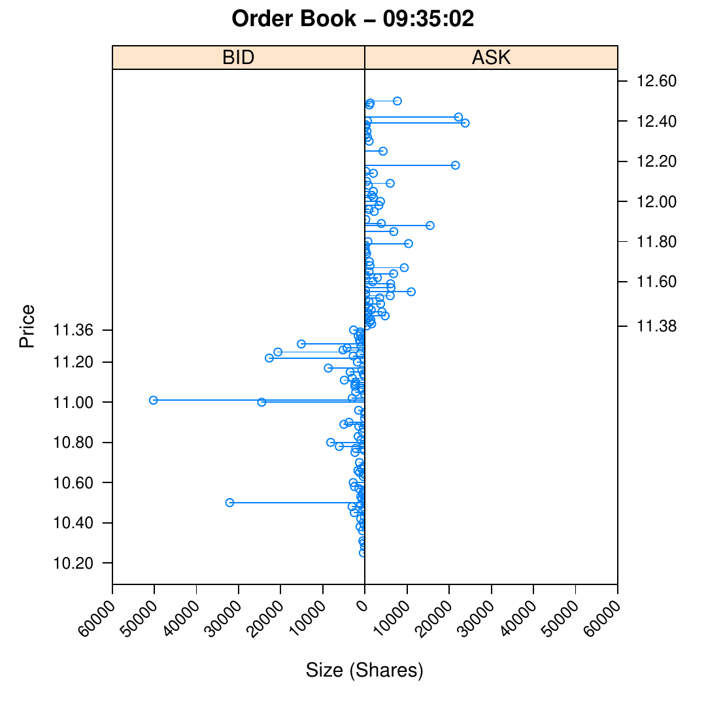
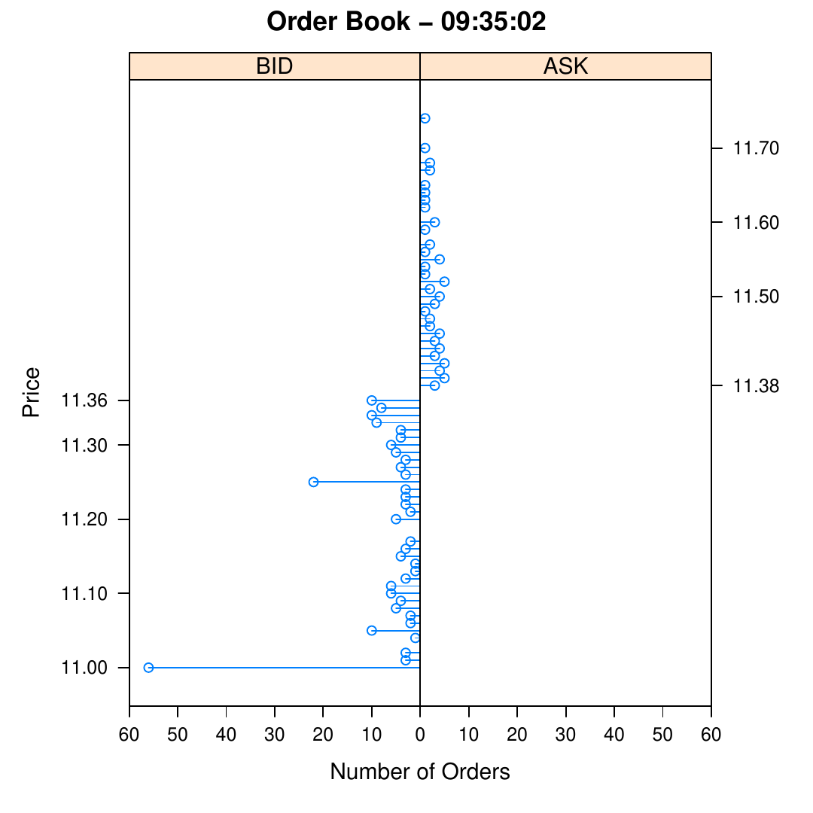
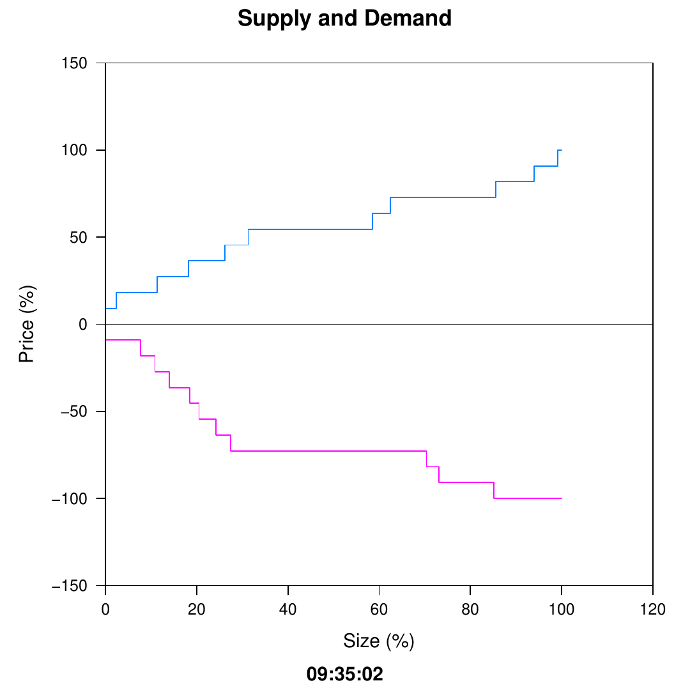
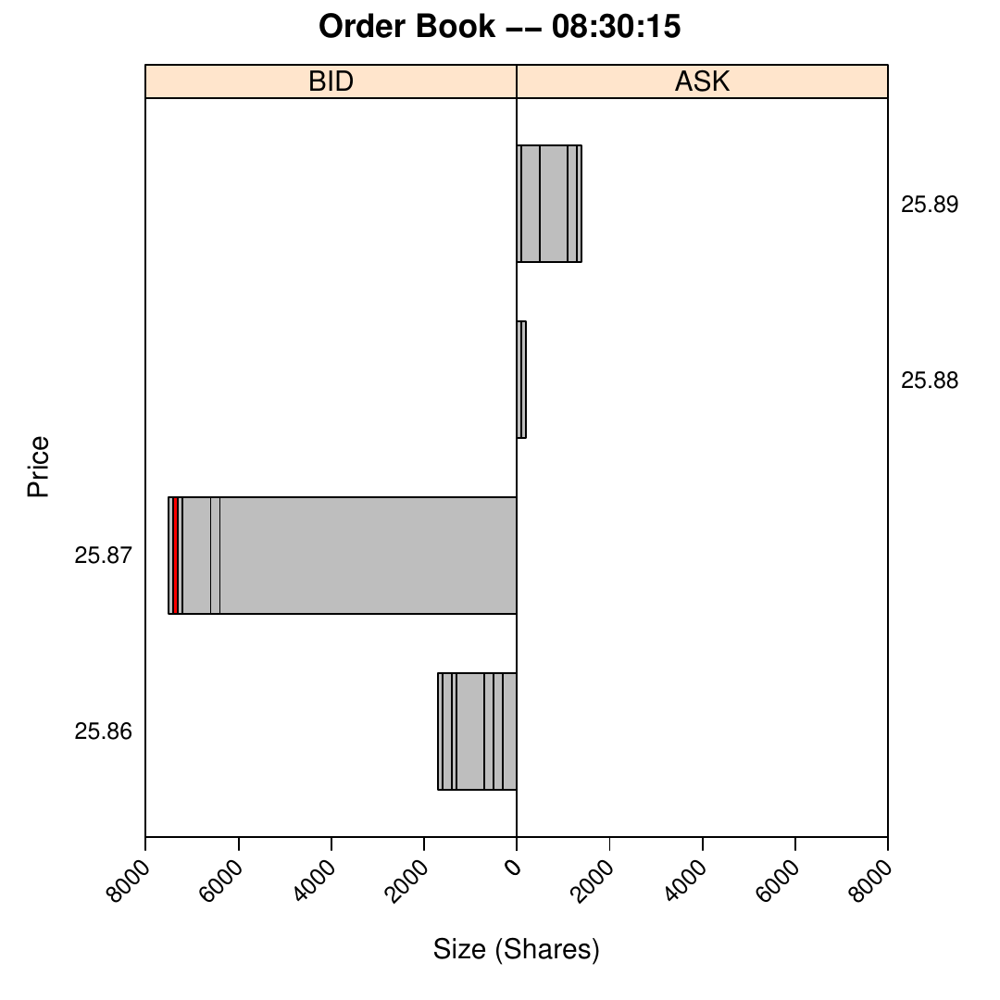
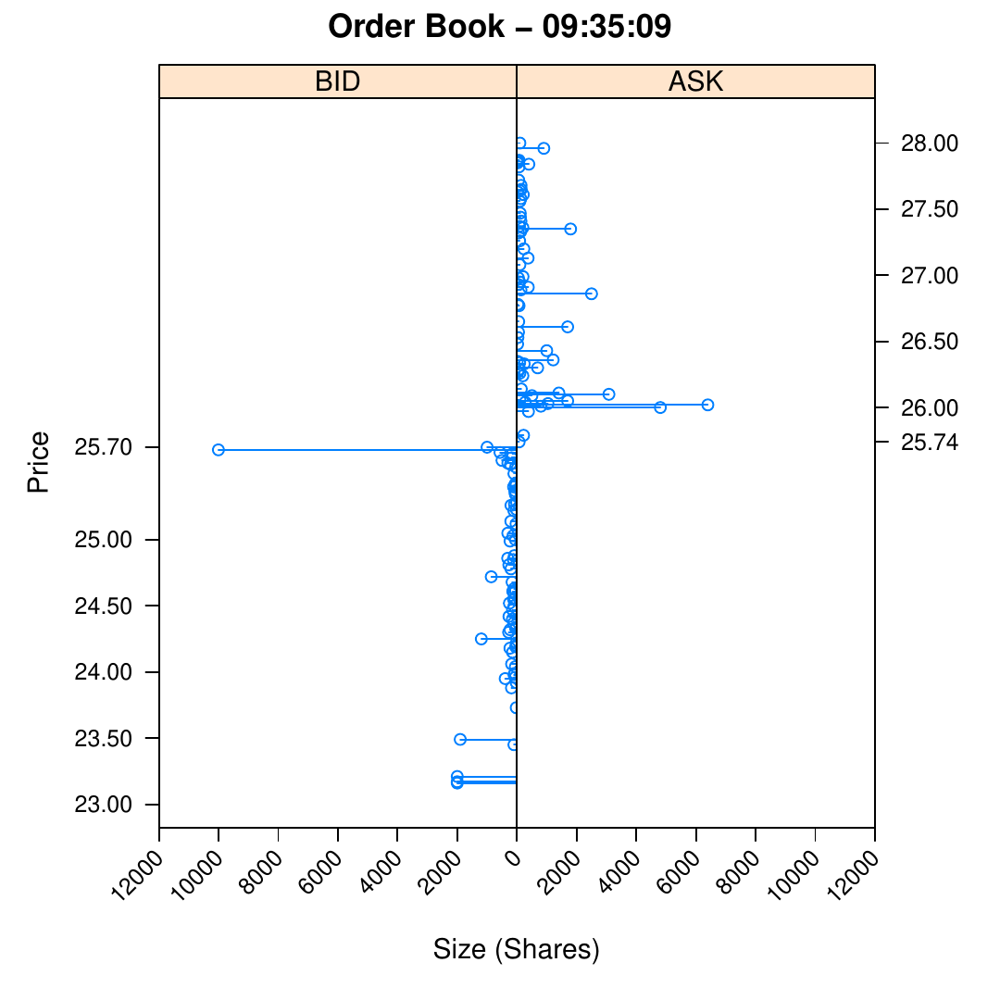

::: article
# Introduction

The [*orderbook*](https://CRAN.R-project.org/package=orderbook) package
provides facilities for exploring and visualizing the data associated
with an order book: the electronic collection of the outstanding limit
orders for a financial instrument, e.g. a stock. A limit order is an
order to buy or sell a given quantity of stock at a specified limit
price or better. The size is the number of shares to be bought or sold.
An order remains in the order book until fully executed, i.e. until its
size is zero as a result of trades. Partial executions occur as a result
of trades for less than the entire size of the order.

Consider a simple order book containing five limit orders: sell 150
shares of IBM at \$11.11, sell 150 shares of IBM at \$11.08, buy 100
shares of IBM at \$11.05, buy 200 shares of IBM at \$11.05, and buy 200
shares of IBM at \$11.01.

``` r
                 Price          Ask Size

                 $11.11         150
                 $11.08         100
     300         $11.05
     200         $11.01

Bid Size         Price
```

Orders on the bid (ask) side represent orders to buy (sell). The price
levels are \$11.11, \$11.08, \$11.05, and \$11.01. The best bid at
\$11.05 (highest bid price) and the best ask at \$11.08 (lowest ask
price) make up the inside market. The spread (\$0.03) is the difference
between the best bid and best ask. The midpoint (\$11.065) is the
average of the best bid and best ask.

There are four types of messages that traders can submit to an order
book: add, cancel, cancel/replace, and market order. A trader can add a
limit order in to the order book. She can also cancel an order and
remove it from the order book. If a trader wants to reduce the size of
her order, she can issue a cancel/replace, which cancels the order, then
immediately replaces it with another order at the same price, but with a
lower size. Every limit order is assigned a unique ID so that cancel and
cancel/replace orders can identify the corresponding limit order. A
market order is an order to immediately buy or sell a quantity of stock
at the best available prices. A trade occurs when a market order "hits"
a limit order on the other side of the inside market.

All orders have timestamps indicating the time at which they were
accepted into the order book. The timestamp determines the time priority
of an order. Earlier orders are executed before later orders. For
example, suppose that the order to buy 100 shares at \$11.05 was
submitted before the order to buy 200 shares at \$11.05. Now suppose a
market order selling 200 shares is submitted to the order book. The
limit order for 100 shares will be executed because it is at the front
of the queue at the best bid. Then, 100 shares of the order with 200
total shares will be executed, since it was second in the queue. 100
shares of the 200 share order remain in the order book at \$11.05.

A market order for more shares than the size at the inside market will
execute at worse price levels until it is complete. For example, if a
market order to buy 200 shares is submitted to the order book, the order
at \$11.08 will be fully executed. Since there are no more shares
available at that price level, 100 shares at the \$11.11 price level
will be transacted to complete the market order. An order to sell 50
shares at \$11.11 will remain in the order book. Executing these two
market orders (a sell of 200 shares and a buy of 200 shares) on our
hypothetical order book results in a new state for the order book.

``` r
                 Price          Ask Size

                 $11.11         50
     100         $11.05
     200         $11.01

Bid Size         Price
```

Note that cancel/replace orders can lower the size of an order, but not
increase it. Cancel/replace orders maintain the time priority of the
original order, so if size increases were allowed, traders with orders
at the highest time priority for a price level could perpetually
increase the size of their order, preventing others from being able to
transact stock using limit orders at that price level. See
[@johnson:barry] for more details on the order book.

# Example

NVIDIA is a graphics processing unit and chipset developer with ticker
symbol NVDA. Consider the order book for NVDA at a leading electronic
exchange on June 8, 2010. We create the `orderbook` object by specifying
the location of our data file.

``` r
> library(orderbook)
> filename <- system.file("extdata",
+                         "sample.txt",
+                         package = "orderbook")
> ob <- orderbook(file = filename)
> ob <- read.orders(ob, 10000)
```

``` r
> ob
```

``` r
An object of class orderbook (default)
--------------------------
Current orderbook time:    09:35:02
Message Index:             10,000
Bid Orders:                631
Ask Orders:                1,856
Total Orders:              2,487
```

We read in the first 10,000 messages then `show` the object. The current
time is 9:35:02 AM. This is the time of the last message read. The
message index indicates which row in the data file the object has read
through. The display also shows that there are 631 bids and 1,856 asks
outstanding, for a total of 2,487 orders. This indicates that many
earlier orders have been removed through either cancels or trades.

``` r
> summary(ob)
```

``` r
Current time is 09:35:02

Ask price levels:   540
Bid price levels:   179
Total price levels: 719
-----------------------------
Ask orders:         1,856
Bid orders:         631
Total orders:       2,487
-----------------------------
Spread:             0.02

Mid point:          11.37
-----------------------------
Inside market

Best Bid:           11.36
Size:               2,700

Best Ask:           11.38
Size:               400
```

Using `summary` the total order information from `show` is repeated.
Additionally, we see that there are 540 ask and 179 bid price levels,
for a total of 719. This indicates that many orders have been submitted
at the same price level. The spread is \$0.02, and the midpoint is
\$11.37. The inside market is composed of 2,700 shares offered at the
best bid of \$11.36 and 400 shares offered at the best ask of \$11.38.

``` r
> display(ob)
```

``` r
Current time is 09:35:02

		 Price 	 Ask Size
---------------------------------------------
		 11.42 	 900
		 11.41 	 1,400
		 11.40 	 1,205
		 11.39 	 1,600
		 11.38 	 400
---------------------------------------------
  2,700 	 11.36
  1,100 	 11.35
  1,100 	 11.34
  1,600 	 11.33
    700 	 11.32
---------------------------------------------
Bid Size 	 Price
```

`display` shows the inside market, along with the four next best bid and
ask price levels and the size at each price level.

<figure>
<div class="sourceCode" id="cb1"><pre class="sourceCode r"><code class="sourceCode r"><span id="cb1-1"><a href="#cb1-1" aria-hidden="true" tabindex="-1"></a><span class="sc">&gt;</span> <span class="fu">plot</span>(ob)</span></code></pre></div>

<figcaption></figcaption>
</figure>

`plot` is a graphical representation of `display`. Price levels are on
the y-axis, and size is on the x-axis. The maximum and minimum price
levels displayed by default are 10% above and below the midpoint. Note
the large number of shares at \$11.01. It is helpful to know the number
of orders which make up the large size at that price level. Using the
`"["` method we can view the order information at particular price
levels.

``` r
> ob["11.01"]
```

``` r
  price  size type     time      id
1 11.01   109  BID 34220988 4403084
2 11.01 50000  BID 34220988 4403085
3 11.01   100  BID 34220988 4403086
```

There is an order for 50,000 shares at the \$11.01 price level that
accounts for almost all of the size. We can view a plot of the number of
orders rather than the number of shares at each price level by
specifying `type = ’o’` when using `plot`. In the previous plot the
maximum and minimum price levels were 10% off from the midpoint, but for
this plot we specify a range of only 3.3%.

Note the large number of orders at \$11.00. The `"["` method returns a
`data.frame`, so we can use `nrow` to return the number of orders at
\$11.00.

``` r
> nrow(ob["11.00"])
```

``` r
[1] 56
```

There are 56 orders at that price level, which confirms what we see in
the plot.

<figure>
<div class="sourceCode" id="cb1"><pre class="sourceCode r"><code class="sourceCode r"><span id="cb1-1"><a href="#cb1-1" aria-hidden="true" tabindex="-1"></a><span class="sc">&gt;</span> <span class="fu">plot</span>(ob, <span class="at">bounds =</span> <span class="fl">0.033</span>, <span class="at">type =</span> <span class="st">&#39;o&#39;</span>)</span></code></pre></div>

<figcaption></figcaption>
</figure>

The type argument on plot allows for an "sd" option which shows supply
and demand curves for the order book. The demand (supply) curve is
downsloping (upsloping). This is because more people want to buy (sell)
a stock when the price decreases (increases). The ask (bid) prices are
normalized by the absolute value of the difference between the highest
(lowest) plotted ask (bid) price level and the the midpoint. Following
[@cao:orderbook], the sizes are normalized by the sum of the sizes
across all plotted price levels for each side.

<figure>
<div class="sourceCode" id="cb1"><pre class="sourceCode r"><code class="sourceCode r"><span id="cb1-1"><a href="#cb1-1" aria-hidden="true" tabindex="-1"></a><span class="sc">&gt;</span> <span class="fu">plot</span>(ob, <span class="at">bounds =</span> <span class="fl">0.01</span>, <span class="at">type =</span> <span class="st">&quot;sd&quot;</span>)</span></code></pre></div>

<figcaption></figcaption>
</figure>

[*orderbook*](https://CRAN.R-project.org/package=orderbook) has methods
for creating new `orderbook` objects at specified clock times of
interest. `read.time` returns an `orderbook` object that has read all
messages before the specified time. For example, this returns the
`orderbook` object at 9:30:00.

``` r
> ob <- read.time(ob, "9:30:00")
```

`read.orders` is used to move forwards or backwards in the order book by
a specified number of messages. In this case, an `orderbook` object at
50 messages before the current message is returned.

``` r
> ob <- read.orders(ob, n = -50)
> ob
```

``` r
An object of class orderbook (default)
--------------------------
Current orderbook time:    09:28:41
Message Index:             292
Bid Orders:                72
Ask Orders:                81
Total Orders:              153
```

# Data

Data files should contain all messages for one stock on a single trading
day. Most brokers and exchanges have their own format for transmitting
raw message data to customers, so it would be unfeasible for us to write
scripts to automatically process all data formats. Consequently, raw
data for an `orderbook` object must be in the following form:

``` r
type,time,id,price,size,type,status
A,34226539,5920814,25.95,100,ASK,TRUE
A,34226788,5933949,25.91,100,BID,FALSE
R,34226900,5933949,50
C,34226904,5920814
T,34226904,755377,25.95,100,TRUE
```

where A, R, T, and C mean Add, Replace, Trade, and Cancel, respectively.
The second column is the timestamp of the message in milliseconds after
midnight, and the third column is the order ID. For a Replace the next
column is the new size, while for Add and Trade a column for price comes
before the size column. Add messages also have the type of order
(BID/ASK) in the sixth column. The optional seventh (sixth) column is
`TRUE` if the order (trade) belongs to the user, and `FALSE` otherwise.
This allows the user to create plots that show the time priority of his
own orders. If the column is omitted, the first line of the data file
should be `type, time, id, price, size, type` and not include `status`.

In this example a user order to sell 100 shares at \$25.95 is added to
the order book, followed by an order to buy 100 shares at \$25.91. The
size of the order at \$25.91 is then replaced to 50 shares. Finally, the
order at \$25.95 is cancelled, and a trade for 100 shares at \$25.95
occurs.

# Analyzing trades

A user can create plots that show the time priority of his own orders if
a `status` column is present in the data file.

``` r
> filename <- system.file("extdata",
+                         "tradersample.txt",
+                         package = "orderbook")
> ob <- orderbook(file = filename)
> ob <- read.time(ob, "9:30:05")
> ob <- next.trade(ob)
> ob
```

``` r
An object of class orderbook (trader)
--------------------------
Current orderbook time:    09:30:05
Message Index:             6,062
Bid Orders:                164
Ask Orders:                252
Total Orders:              416
```

Note that this `orderbook` object is of type trader. The `next.trade`
function sets the state of the order book to when the trade after the
current time occurs. There is also a `previous.trade` function with the
same functionality moving backwards

``` r
> view.trade(ob, tradenum = 584)
```

``` r
       trade 584
row         6063
time    09:30:05
id        636783
price      25.94
size        1000
status     FALSE
```

``` r
> mid.point(ob)
```

``` r
 price
25.935
```

Since the trade price is higher than the midpoint price, we know that
the trade occurred as a result of an ask order getting hit. Note that
trade data is stored into the order book only after it has read through
the corresponding trade message.

``` r
> midpoint.return(ob, tradenum = 584, time = 10)
```

``` r
          midpoint.return
10 second           0.065
```

The midpoint return is the difference in cents between the execution
price and the midpoint price after a specified period of time. For
example, the above calculates the ten second midpoint return for the
first trade. Since it was a sell order, the midpoint return will be
positive if the stock price decreases, and negative if the stock price
increases.

<figure>
<div class="sourceCode" id="cb1"><pre class="sourceCode r"><code class="sourceCode r"><span id="cb1-1"><a href="#cb1-1" aria-hidden="true" tabindex="-1"></a><span class="sc">&gt;</span> ob <span class="ot">&lt;-</span> <span class="fu">read.time</span>(ob, <span class="st">&quot;9:30:15&quot;</span>)</span>
<span id="cb1-2"><a href="#cb1-2" aria-hidden="true" tabindex="-1"></a><span class="sc">&gt;</span> <span class="fu">plot</span>(ob, <span class="at">type =</span> <span class="st">&quot;t&quot;</span>, <span class="at">bounds =</span> <span class="fl">0.02</span>)</span></code></pre></div>

<figcaption></figcaption>
</figure>

This plot shows two pennies above and below the best bid and best ask.
We see that the midpoint has dropped to 25.875, confirming the midpoint
return above. This graph shows two pennies above and below the best bid
and ask. Orders at these price levels are shown in time priority, with
the earliest submitted order being closest to the middle y-axis. Note
the red order--this is an order marked `TRUE` by the user, indicating
that it belonged to him.

# Simulation

Simulating and modelling the intraday decisions of traders is a topic of
active research in behavioral finance and economics.
[*orderbook*](https://CRAN.R-project.org/package=orderbook) supports
adding, replacing, and cancelling orders. Add orders require the price,
size, and type (ASK/BID) of the limit order. Time and ID are optional,
and will default to the maximum time + 1 and the maximum ID + 1. Replace
messages require the new size and ID. Cancel orders only require ID. In
addition, market orders can be issued to the order book. Market orders
require size and side (BUY/SELL).

``` r
> ob <- add.order(ob, 11.20, 300, "ASK")
> ob <- remove.order(ob, 1231883)
> ob <- replace.order(ob, 1231883, 150)
> ob <- market.order(ob, 200, "BUY")
```

Using these tools, the user can write functions to simulate the an order
book. In the following example, we consulted [@gilles:daniel]. We
simulate 1,000 messages. The messages are chosen based on the following
probabilities: 50% for a cancel message, 20% for a market order, and 30%
for a limit order. In the event of a cancel message the order cancelled
is randomly chosen. Market order have a 50-50 chance for a buy or sell
order. The size of the market order always corresponds to the size of
the individual order at the best ask or bid with the highest time
priority. Limit orders have a 50-50 chance to be an ask or bid. There is
a 35% chance for the price of a limit order to be within the spread. If
the price is outside of the spread, a price is chosen using a power law
distribution. Finally, the size follows a log-normal distribution. A
plot of this example simulation is shown below.

``` r
> ob <- simulate(ob)
```

<figure>
<div class="sourceCode" id="cb1"><pre class="sourceCode r"><code class="sourceCode r"><span id="cb1-1"><a href="#cb1-1" aria-hidden="true" tabindex="-1"></a><span class="sc">&gt;</span> <span class="fu">plot</span>(ob)</span></code></pre></div>

<figcaption></figcaption>
</figure>

[@gilles:daniel] used simulations to test the impact of liquidity on
price level stabilization. He concluded that most price changes are the
result of uninformed traders (who supply liquidity), rather than
informed traders (who demand liquidity).

# Conclusion

The [*orderbook*](https://CRAN.R-project.org/package=orderbook) package
is part of a collection of packages (see [@kane:backtest] and
[@kane:portfolio]) for working with financial market data. R provides
all the necessary tools for managing institutional sized portfolios.

\

\

\
:::
