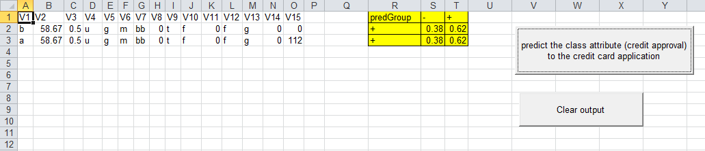

::: article
# Motivation

Building an application for end users is a very challenging goal.
Building a statistics application normally involves three different
roles: application developer, statistician, and user. Often,
statisticians are programmers too, but are only (or mostly) familiar
with statistical programming (languages) and definitely are not experts
in creating rich user interfaces/applications for (casual) users.

For many---maybe even for most---applications of statistics, Microsoft
Excel is used as the primary user interface. Users are familiar with
performing simple computations using the spreadsheet and can easily
format the result of the analyses for printing or inclusion in reports
or presentations. Unfortunately, Excel does not provide support for
doing more complex computations and analyses and also has documented
weaknesses for certain numerical calculations.

Statisticians know a solution for this problem, and this solution is
called R. R is a very powerful programming language for statistics with
lots of methods from different statistical areas implemented in various
packages by thousands of contributors. But unfortunately, R's user
interface is not what everyday users of statistics in business expect.

The following sections will show a very simple approach allowing a
statistician to develop an easy-to-use and maintainable end-user
application. Our example will make use of R and the package
[*rpart*](https://CRAN.R-project.org/package=rpart) and the resulting
application will completely hide the complexity and the R user interface
from the user.

[*rpart*](https://CRAN.R-project.org/package=rpart) implements recursive
partitioning and regression trees. These methods have become powerful
tools for analyzing complex data structures and have been employed in
the most varied fields: CRM, financial risk management, insurance,
pharmaceuticals and so on (for example, see: [@bib:cartFinance],
[@bib:dataMining], [@bib:cartHealth]).

The main reason for the wide distribution of tree-based methods is their
simplicity and intuitiveness. Prediction of a quantitative or
categorical variable, is done through a tree structure, which even
non-professionals can read and understand easily. The application of a
computationally complex algorithm thus results in an intuitive and easy
to use tool. Prediction of a categorical variable is performed by a
*classification tree*, while the term *regression tree* is used for the
estimation of a quantitative variable.

{#fig:GUI width="100%" alt="graphic without alt text"}

{#fig:results
width="100%" alt="graphic without alt text"}

Our application will be built for Microsoft Excel and will make use of R
and [*rpart*](https://CRAN.R-project.org/package=rpart) to implement the
functionality. We have chosen Excel as the primary tool for performing
the analysis because of various advantages:

-   Excel has a familiar and easy-to-use user interface.

-   Excel is already installed on most of the workstations in the
    industries we mentioned.

-   In many cases, data collection has been performed using Excel, so
    using Excel for the analysis seems to be the logical choice.

-   Excel provides many features to allow a high-quality presentation of
    the results. Pre-configured presentation options can easily adapted
    even by the casual user.

-   Output data (mostly graphical or tabular presentation of the
    results) can easily be used in further processing--- e.g., embedded
    in PowerPoint slides or Word documents using OLE (a subset of COM,
    as in [@bib:com]).

We are using R for the following reasons:

-   One cannot rely on Microsoft Excel's numerical and statistical
    functions (they do not even give the same results when run in
    different versions of Excel). See [@bib:ExcelProblems] for more
    information.

-   We are re-using an already existing, tested and proven package for
    doing the statistics.

-   Statistical programmers often use R for performing statistical
    analysis and implementing functions.

Our goal for creating an
[*RExcel*](https://CRAN.R-project.org/package=RExcel)-based application
is to enable any user to be able to perform the computations and use the
results without any special knowledge of R (or even of
[*RExcel*](https://CRAN.R-project.org/package=RExcel)). See
Figure [1](#fig:GUI) for an example of the application's user interface.
The results of running the application are shown in Figure
[2](#fig:results).

There are a few alternatives to
[*RExcel*](https://CRAN.R-project.org/package=RExcel) for connecting
Excel with R:

XLLoop

:   provides an Excel Add-In which is able to access various programming
    languages from within formulae. It supports languages like R,
    Javascript and others. The "backend" languages are accessed using
    TCP/IP communication. In contrast to this,
    [*RExcel*](https://CRAN.R-project.org/package=RExcel) uses COM,
    which has a very low latency (and hence is very fast). Additionally,
    the architecture of
    [*RExcel*](https://CRAN.R-project.org/package=RExcel) supports a
    completely invisible R server process (which is what we need for
    deploying the application), or can provide access to the R window
    while developing/testing.

inference for R

:   provides similar functionality as
    [*RExcel*](https://CRAN.R-project.org/package=RExcel). From the
    website, the latest supported R version is 2.9.1, while
    [*RExcel*](https://CRAN.R-project.org/package=RExcel) supports
    current R versions immediately after release (typically new versions
    work right out of the box without an update in
    [*RExcel*](https://CRAN.R-project.org/package=RExcel) or
    **statconnDCOM**).

# Integrating R and Microsoft Excel

Work on integration of Excel and R is ongoing since 1998. Since 2001, a
stable environment is available for building Excel documents based upon
statistical methods implemented in R. This environment consists of plain
R (for Windows) and a toolbox called **statconnDCOM** with its full
integration with Excel using
[*RExcel*](https://CRAN.R-project.org/package=RExcel) (which is
implemented as an add-in for Microsoft Excel).

Like all Microsoft Office applications and some third-party
applications, Excel provides a powerful scripting engine combined with a
highly productive visual development environment. This environment is
called Visual Basic for Applications, or VBA for short (see [@bib:VBA]).
VBA allows creation of "worksheet-functions" (also called user defined
functions or UDFs), which can be used in a similar way as Excel's
built-in functions (like, e.g., "`SUM`" or "`MEAN`") to dynamically
compute values to be shown in spreadsheet cells, and `Sub`s which allow
arbitrary computations , putting results into spreadsheet ranges. VBA
code can be bundled as an "Add-In" for Microsoft Excel which provides an
extension both in the user interface (e.g., new menus or dialogs) and in
functionality (additional sheet-functions similar to the built-in sheet
functions).

Extensions written in VBA can access third-party components compatible
with Microsoft's Component Object Model (COM, see [@bib:com]). The link
between R and Excel is built on top of two components:
[*RExcel*](https://CRAN.R-project.org/package=RExcel) is an Add-In for
Microsoft Excel implementing a spreadsheet-style interface to R and
**statconnDCOM**. **statconnDCOM** exposes a COM component to any
Windows application which encapsulates R's functionality in an
easy-to-use way.

**statconnDCOM** is built on an extensible design with exchangeable
front-end and back-end parts. In the context of this article, the
back-end is R. A back-end implementation for Scilab ([@bib:scilab]) is
also available. The front-end component is the COM interface implemented
by **statconnDCOM**. This implementation is used to integrate R or
Scilab into Windows applications. A first version of an Uno ([@bib:uno])
front-end has already been released for testing and download. Using this
front-end R and Scilab can easily be integrated into OpenOffice.org
applications, like Calc (see [@bib:openoffice]). **ROOo** is available
via [@bib:runo] and already supports Windows, Linux and MacOS X.

[*RExcel*](https://CRAN.R-project.org/package=RExcel) supports various
user interaction modes:

Scratchpad and data transfer mode:

:   Menus control data transfer from R to Excel and back; commands can
    be executed immediately, either from Excel cells or from R command
    line

Macro mode:

:   Macros, invisible to the user, control data transfer and R command
    execution

Spreadsheet mode:

:   Formulas in Excel cells control data transfer and command execution,
    automatic recalculation is controlled by Excel

Throughout the rest of this article, we will describe how to use
*scratchpad mode* and *macro mode* for prototyping and implementing the
application.

For more information on
[*RExcel*](https://CRAN.R-project.org/package=RExcel) and
**statconnDCOM** see [@bib:r+excel+com].

# Implementing the classification and regression tree

With [*RExcel*](https://CRAN.R-project.org/package=RExcel)'s tool set we
can start developing our application in Excel immediately.
[*RExcel*](https://CRAN.R-project.org/package=RExcel) has a "scratchpad"
mode which allows you to write R code directly into a worksheet and to
run it from there. Scratchpad mode is the user interaction mode we use
when prototyping the application. We will then transform the
prototypical code into a "real" application. In practice, the
prototyping phase in scratchpad mode will be omitted for simple
applications. In an Excel hosted R application we also want to transfer
data between Excel and R, and transfer commands may be embedded in R
code. An extremely simplistic example of code in an R code scratchpad
range in Excel might look like this:

``` r
#!rput    inval     'Sheet1'!A1
result<-sin(inval)
#!rget    result    'Sheet1'!A2
```

R code is run simply by selecting the range containing code and choosing
`Run R Code` from the pop-up menu.

Lines starting with `#!` are treated as special
[*RExcel*](https://CRAN.R-project.org/package=RExcel) commands. `rput`
will send the value (contents) of a cell or range to R, `rget` will read
a value from R and store it into a cell or range.

::: {#tab:rexcelcommands}
  ----------------------------------------------------------------------------------------------------
  *Command*                              *Description*
  -------------------------------------- -------------------------------------------------------------
  `#!rput` variable range                store the value (contents) of a range in an R variable

  `#!rputdataframe` variable range       store the value of a range in an R data frame

  `#!rputpivottable` variable range      store the value of a range in an R variable

  `#!rget` r-expression range            store the value of the R expression in the range

  `#!rgetdataframe` r-expression range   store the data frame value of the R expression in the range

  `#!insertcurrentplot` cell-address     insert the active plot into the worksheet
  ----------------------------------------------------------------------------------------------------

  : Table 1: Special
  [*RExcel*](https://CRAN.R-project.org/package=RExcel) commands used in
  sheets
:::

In the example, the value stored in cell `A1` of sheet `Sheet1` will be
stored in the R variable `inval`. After evaluating the R expression
`result<-sin(inval)`, the value of the R variable `result` is stored in
cell `A2`.

Table [1](#tab:rexcelcommands) lists all special
[*RExcel*](https://CRAN.R-project.org/package=RExcel) commands and
provides a short description. More information can be found in the
documentation of [*RExcel*](https://CRAN.R-project.org/package=RExcel).

In the example below , we have a dataset on the credit approval process
for 690 subjects. For each record, we have 15 input variables
(qualitative and quantitative) while variable 16 indicates the outcome
of the credit application: positive ($+$) or negative ($-$). Based on
this training dataset, we develop our classification tree which is used
to show the influence of 15 variables on the loan application and to
distinguish "good" applicants from "risky" applicants (so as to estimate
variable 16). The risk manager will use this model fully integrated into
Excel for further credit approval process.

The goal of the code snippet below is to estimate the model and display
the chart with the classification tree. The risk manager can easily view
the binary tree and use this chart to highlight the splits. This will
help discover the most significant variables for the credit approval
process. For example, in this case it is clear that the predictor
variables $V9$ determines the best binary partition in terms of
minimizing the "impurity measure". In addition, the risk manager will
notice that when $V9$ equals $a$, the only significant variable to
observe is $V4$. The graphical representation of the classification tree
is shown in Figure [3](#fig:classificationtree) on page
[3](#fig:classificationtree).

``` r
library(rpart)          
#!rputdataframe    trainingdata           \
      'database'!A1:P691
fit<-rpart(V16~.,data=trainingdata)
plot(fit,branch=0.1,uniform=T,margin=.1,  \
      compress=T,nspace=0.1)          
text(fit,fancy=T,use.n=T)               
#!insertcurrentrplot    'database'!T10        
graphics.off()          
```

Note:

:   `\` in the code denotes a line break for readability and should not
    be used in the real spreadsheet

{#fig:classificationtree
width="100%" alt="graphic without alt text"}

After estimating the model and visualizing the results, you can use the
Classification Tree to make predictions about the variable V16: the
applicants will be classified as "good" or "risky." By running the
following code, the 15 observed variables for two people are used to
estimate the probability of credit approval. Generally, a "positive"
value ($+$) with probability higher than $0.5$ will indicate to grant
the loan. So the risk manager using this model will decide to grant the
credit in both cases.

``` r
library(rpart)          
#!rputdataframe trainingdata              \
      'database'!A1:P691
#!rputdataframe newcases                  \
      'predict'!A1:O3
outdf<-as.data.frame(predict(fit,newcases))             
predGroup <- ifelse(outdf[,1]>0.5,        \
      names(outdf[1]),names(outdf[2]))
res<-cbind(predGroup,outdf)             
#!rgetdataframe res     'predict'!R1
```

The potential of this approach is obvious: Very complex models, such as
classification and regression trees, are made available to decision
makers (in this case, the risk manager) directly in Microsoft Excel. See
Figure [2](#fig:results) on page [2](#fig:results) for a screen-shot of
the presentation of the results.

# Tidying up the spreadsheet {#sec:cleanup}

In an application to be deployed to end users, R code should not be
visible to the users. Excel's mechanism for performing operations on
data is to run macros written in *VBA* (Visual Basic for Applications,
the programming language embedded in Excel).
[*RExcel*](https://CRAN.R-project.org/package=RExcel) implements a few
functions and subroutines which can be used from VBA. Here is a
minimalistic example:

``` r
Sub RExcelDemo()
    RInterface.StartRServer
    RInterface.GetRApply "sin", _
       Range("A2"), Range("A1")
    RInterface.StopRServer
End Sub
```

`GetRApply` applies an R function to arguments taken from Excel ranges
and puts the result in a range. These arguments can be scalars, vectors,
matrices or dataframes. In the above example, the function `sin` is
applied to the value from cell `A1` and the result is put in cell `A2`.
The R function given as the first argument to `GetRApply` does not
necessarily have to be a named function, any function expression can be
used.

[*RExcel*](https://CRAN.R-project.org/package=RExcel) has several other
functions that may be called in VBA macros. `RRun` runs any code given
as string. `RPut` and `RGet` transfer matrices, and `RPutDataframe` and
`RGetDataframe` transfer dataframes. `RunRCall` similar to `GetRApply`
calls an R function but does not transfer any return value to Excel. A
typical use of `RunRCall` is for calling plot functions in R.
`InsertCurrentRPlot` embeds the current R plot into Excel as an image
embedded in a worksheet.

In many cases, we need to define one or more R functions to be used with
`GetRApply` or the other VBA support functions and subroutines.
[*RExcel*](https://CRAN.R-project.org/package=RExcel) has a mechanism
for that. When [*RExcel*](https://CRAN.R-project.org/package=RExcel)
connects to R (using the command *RInterface.StartRServer*), it will
check whether the directory containing the active workbook also contains
a file named `RExcelStart.R`. If it finds such a file, it will read its
contents and evaluate them with R (`source` command in R). After doing
this, [*RExcel*](https://CRAN.R-project.org/package=RExcel) will check
if the active workbook contains a worksheet named `RCode`. If such a
worksheet exists, its contents also will be read and evaluated using R.

*Some notes on handling R errors in Excel*: The R implementation should
check for all errors which are expected to occur in the application. The
application itself is required to pass correctly typed arguments when
invoking an R/ function. If
[*RExcel*](https://CRAN.R-project.org/package=RExcel) calls a function
in R and R throws an error, an Excel dialog box will pop up informing
the user of the error. An alternative to extensive checking is to use
R's `try` mechanism to catch errors in R and handle them appropriately.

Using these tools, we now can define a macro performing the actions our
scratchpad code did in the previous section. Since we can define
auxiliary funcions easily, we can also now make our design more modular.

The workhorse of our application is the following VBA macro:

``` r
Sub PredictApp()
    Dim outRange As Range
    ActiveWorkbook.Worksheets("predict") _
      .Activate
    If Err.Number <> 0 Then
      MsgBox "This workbook does not "   _
        & "contain data for rpartDemo"
      Exit Sub
    End If
    ClearOutput
    RInterface.StartRServer
    RInterface.RunRCodeFromRange         _
      ThisWorkbook.Worksheets("RCode")   _
        .UsedRange

    RInterface.GetRApply                 _
      "function("     _
        & "trainingdata,groupvarname,"   _
        & "newdata)predictResult(fitApp("_
        & "trainingdata,groupvarname),"  _
        & "newdata)", _
      ActiveWorkbook.Worksheets(         _
        "predict").Range("R1"),          _
      AsSimpleDF(DownRightFrom(          _
        ThisWorkbook.Worksheets(         _
          "database").Range("A1"))),     _
        "V16",                           _
      AsSimpleDF(ActiveWorkbook          _
        .Worksheets("predict").Range(    _
          "A1").CurrentRegion)

    RInterface.StopRServer
    Set outRange = ActiveWorkbook        _
      .Worksheets("predict").Range("R1") _
        .CurrentRegion
    HighLight outRange
End Sub
```

The function `predictResult` is defined in the worksheet `RCode`.

# Packaging the application

So far, both our code (the R commands) and data have been part of the
same spreadsheet. This may be convenient while developing the
[*RExcel*](https://CRAN.R-project.org/package=RExcel)-based application
or if you are only using the application for yourself, but it has to be
changed for redistribution to a wider audience.

We will show how to divide the application into two parts, the first
being the Excel part, the second being the R part. With a clear
interface between these, it will be easy to update one of them without
affecting the other. This will make testing and updating easier.
Separating the R implementation from the Excel (or
[*RExcel*](https://CRAN.R-project.org/package=RExcel)) implementation
will also allow an R expert to work on the R part and an Excel expert to
work on the Excel part.

As an additional benefit, exchanging the Excel front-end with a custom
application (e.g., written in a programming language like C#) will be
easier, too, as the R implementation will not have to be changed (or
tested) in this case.

The application's R code interface is simple, yet powerful.
[*RExcel*](https://CRAN.R-project.org/package=RExcel) will only have to
call a single R function called `approval`. Everything else is hidden
from the user (including the training data). `approval` takes a data
frame with the data for the cases to be decided upon as input and
returns a data frame containing the group classification and the
probabilities for all possible groups. Of course, the return value can
also be shown in a figure.

## Creating an R package {#sec:Rpackage}

The macro-based application built in section "[4](#sec:cleanup)" still
contains the R code and the training data. We will now separate the
implementation of the methodology and the user interface by putting all
our R functions and the training data into an R package. This R package
will only expose a single function which gets data for the new cases as
input and returns the predicted group membership as result. Using this
approach, our application now has a clear architecture. The end user
workbook contains the following macro:

``` r
Sub PredictApp()
    Dim outRange As Range
    ClearOutput
    RInterface.StartRServer

    RInterface.RRun "library(RExcelrpart)"
    RInterface.GetRApply "approval",      _
      Range("'predict'!R1"),              _
      AsSimpleDF(Range("predict!A1")      _
        .CurrentRegion)

    RInterface.StopRServer
    Set outRange = Range("predict!R1")    _
      .CurrentRegion
    HighLight outRange
End Sub
```

In this macro, we start a connection to R, load the R package and call
the function provided by this package and then immediately close the the
connection to R.

The **statconnDCOM** server can reside on another machine than the one
where the Excel application is running. The server to be used by
[*RExcel*](https://CRAN.R-project.org/package=RExcel) can be configured
in a configuration dialog or even from within VBA macros. So with
minimal changes, the application created can be turned into an
application which uses a remote server. A further advantage of this
approach is that the R functions and data used by the application can be
managed centrally on one server. If any changes or updates are
necessary, the Excel workbooks installed on the end users' machines do
not need to be changed.

## Building a VBA add-in for Excel

The implementation using an R package still has some shortcomings. The
end user Excel workbook contains macros, and often IT security policies
do to not allow end user workbooks to contain any executable code
(macros). Choosing a slightly different approach, we can put all the VBA
macro code in an Excel add-in. In the end user workbook, we just place
buttons which trigger the macros from the add-in. When opening a new
spreadsheet to be used with this add-in, Excel's template mechanism can
be used to create the buttons on the new worksheet . The code from the
workbook described in section "[4](#sec:cleanup)" cannot be used "as is"
since it is written under the assumption that both the training data and
the data for the new cases are contained in the same workbook. The
necessary changes, however, are minimal. C onverting the workbook from
section "[4](#sec:cleanup)" again poses the problem that the data and
the methodology are now deployed on the end users' machines. Therefore
updating implies replacing the add-in on all these machines. Combining
the add-in approach with the packaging approach from section
"[5.1](#sec:Rpackage)" increases modularization. With this approach we
have:

-   End user workbooks without any macro code.

-   Methodology and base data residing on a centrally maintained server.

-   Connection technology for end users installed for all users in one
    place, not separately for each user.

# Deploying the Application

Using the application on a computer requires installation and
configuration of various components.

The required (major) components are:

-   Microsoft Excel, including
    [*RExcel*](https://CRAN.R-project.org/package=RExcel) and
    **statconnDCOM**

-   R, including
    [*rscproxy*](https://CRAN.R-project.org/package=rscproxy)

-   The VBA Add-In and the R package created throughout this article

For the simplest setup, all compontents are installed locally. As an
alternative, you can also install Excel,
[*RExcel*](https://CRAN.R-project.org/package=RExcel) and our newly
built VBA Add-In on every workstation locally and install everything
else on a (centralized) server machine. In this case, R,
[*rscproxy*](https://CRAN.R-project.org/package=rscproxy), our
application's R package and **statconnDCOM** are installed on the server
machine and one has to configure
[*RExcel*](https://CRAN.R-project.org/package=RExcel) to use R via
**statconnDCOM** on a remote server machine. Please beware that this
kind of setup can be a bit tricky, as it requires a correct DCOM
security setup (using the Windows tool *dcomcnfg*).

# Downloading

All examples are available for download from the *Download* page on
<http://rcom.univie.ac.at>.

\

\
:::
