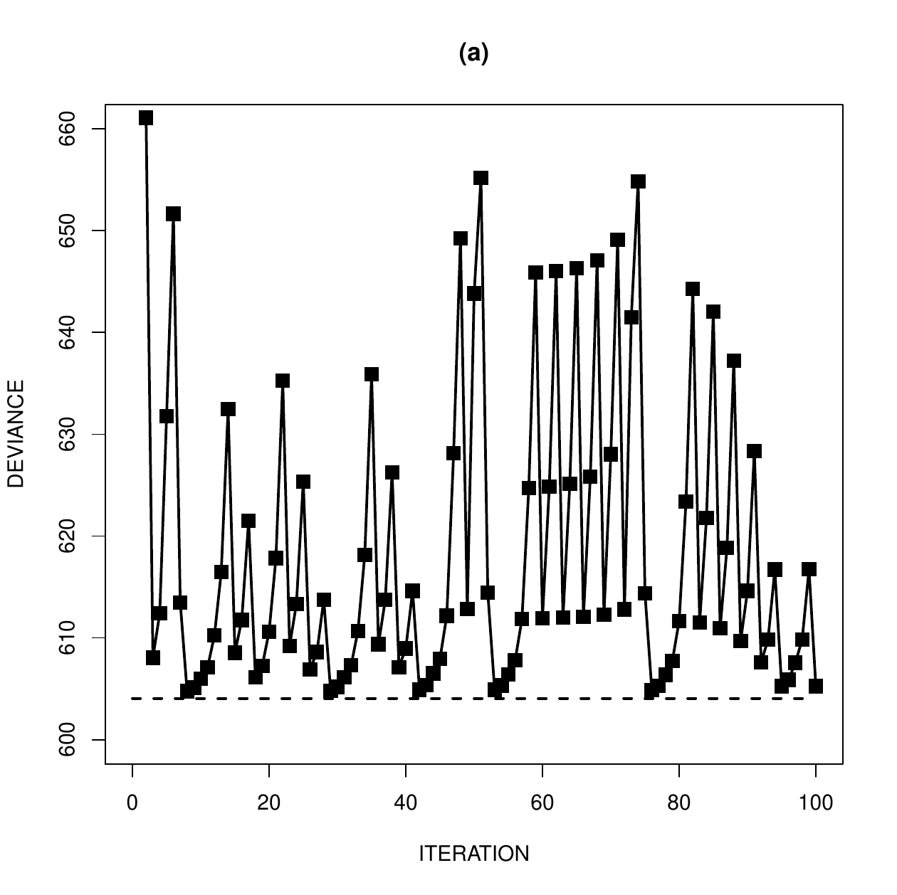
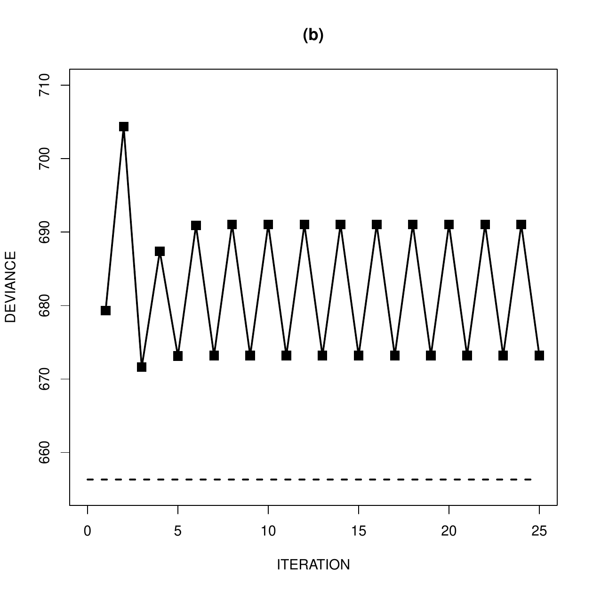
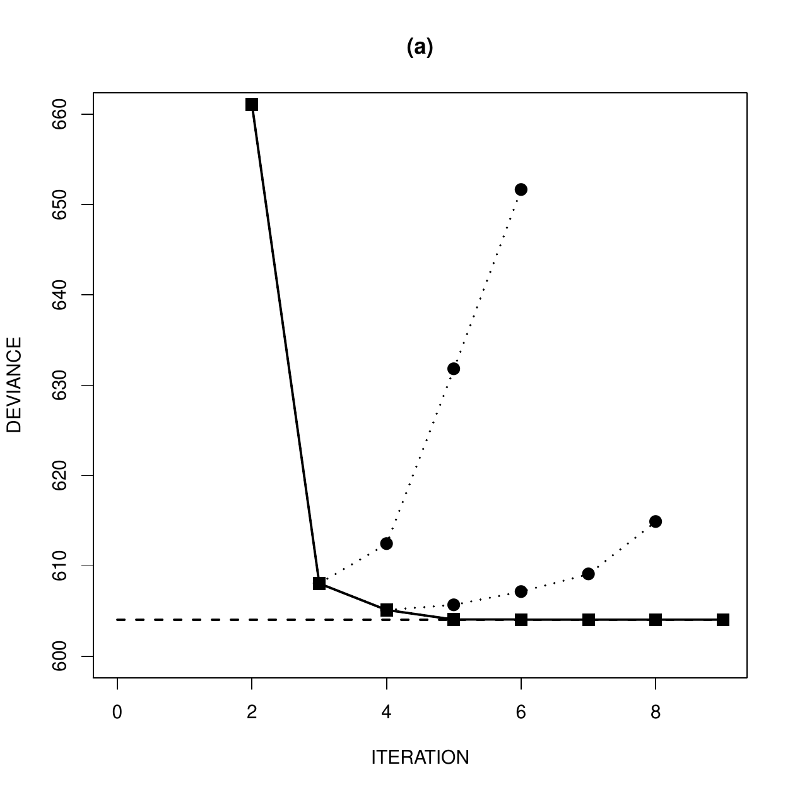
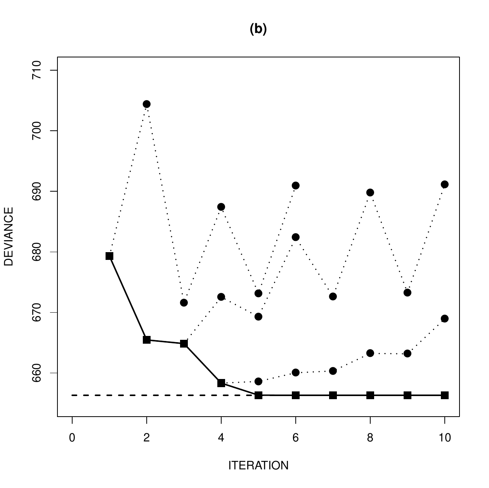

::: article
It is not too uncommon for iteratively reweighted least squares (IRLS)
to exhibit convergence problems when fitting a generalized linear model
(GLM). Such problems tend to be most common when using a non-standard
link function, such as a log link binomial model or an identity link
Poisson model. Consequently, most commonly used statistical software has
the provision to invoke various modifications of IRLS if non-convergence
occurs.

In the [*stats*](https://CRAN.R-project.org/package=stats) package of R,
IRLS is implemented in the `glm` function via its workhorse routine
`glm.fit`. This routine deals with specific types of convergence
problems by switching to step-halving if iterates display certain
undesirable properties. That is, if a full Fisher scoring step of IRLS
will lead to either an infinite deviance or predicted values that are
invalid for the model being fitted, then the increment in parameter
estimates is repeatedly halved until the updated estimates no longer
exhibit these features. This is achieved through repeated application of
the call

``` r
\code{start <- (start + coefold)/2}  
```

where `coefold` and `start` contain estimates from the previous and
current iterations, respectively.

Although this approach works well in some contexts, it can be prone to
fail in others. In particular, although the step-halving process in
`glm.fit` will throw an errant iterative sequence back into the desired
region, the sequence may repeatedly try to escape that region and never
converge. Furthermore, it is even possible for the IRLS iterative
sequence to be such that step-halving is never invoked in `glm.fit`, yet
the sequence does not converge. Such behavior is typically accompanied
by a deviance sequence that increases in one or more of the iterations.
This suggests a modification to `glm.fit` which has been implemented in
the [*glm2*](https://CRAN.R-project.org/package=glm2) package
[@Marschner2011].

As motivation for the proposed modification, we begin by discussing the
potential for non-convergence using some numerical examples of the above
types of behavior. The [*glm2*](https://CRAN.R-project.org/package=glm2)
package is then discussed, which consists of a main function `glm2` and
a workhorse routine `glm.fit2`. These are modified versions of `glm` and
`glm.fit`, in which step-halving is used to force the deviance to
decrease from one iteration to the next. It is shown that this
modification provides improved convergence behavior.

# Non-convergence

We start by providing illustrations of the two types of non-convergence
alluded to above. Specifically, we will consider situations in which
standard IRLS does not converge, and for which either: (i) the
step-halving in `glm.fit` is invoked but cannot induce convergence; or
(ii) the step-halving in `glm.fit` is never invoked despite the
non-convergence of IRLS. These two types of behavior will be illustrated
using an identity link Poisson regression model, which can be prone to
convergence problems as the link function does not automatically respect
the non-negativity of the Poisson means. This context is useful for
studying the convergence properties of algorithms based on IRLS, because
for this particular GLM a reliable alternative algorithm exists which is
not based on IRLS, as described by @Marschner2010. While we focus on the
identity link Poisson model here, the same behavior can occur in other
models and the documentation for the
[*glm2*](https://CRAN.R-project.org/package=glm2) package includes a log
link binomial example.

In Table 3.2 of @Agresti2007 a data set is presented that is amenable to
analysis using a linear Poisson model. The data set consists of a count
response variable $y_i$, $i=1,\dots, 173$, called Sa in @Agresti2007,
with observed values ranging from 0 through 15 and a mean of 2.9. Also
presented are a number of potential covariates. Here we define three
covariates, $x_{i1}$, $x_{i2}$ and $x_{i3}$, $i=1,\dots, 173$, similarly
to @Marschner2010. The first two of these covariates, $x_{i1}$ and
$x_{i2}$, are defined by dichotomizing the covariates called C and S in
@Agresti2007, such that $\{x_{i1}\}=1\{\textrm{C}>3\}$ and
$\{x_{i2}\}=1\{\textrm{S}<3\}$. This yields two 0/1 binary covariates
with means 0.4 and 0.3, respectively. The third covariate, $x_{i3}$, is
a continuous covariate called W in @Agresti2007, which is shifted here
by subtracting the smallest value, so that it ranges from 0 through 12.5
with a mean of 5.3.

Assuming $y_i$ is an observation from a Poisson distribution with mean
$\mu_i$, the identity link model is
$$\mu_i=\alpha_0+\alpha_1x_{i1}+\alpha_2x_{i2}+\alpha_3x_{i3}$$ with
parameter vector $\theta=(\alpha_0,\alpha_1,\alpha_2,\alpha_3)$. This
model can be fitted in R by first defining a response vector `y` with
`y[i]`$=y_i$, and corresponding covariate vectors `x1`, `x2` and `x3`
with `c(x1[i],x2[i],x3[i])`$=(x_{i1},x_{i2},x_{i3})$, along with a data
frame `poisdata` through the assignment
`poisdata <- data.frame(y,x1,x2,x3)`. The call to fit the model is then

``` r
glm(y ~ x1 + x2 + x3, data = poisdata, 
    family = poisson(link = "identity"),
    start = rep(1,4))
```

which includes an initial estimate through the `start` argument because
the default choice is invalid for this model. Below we also use the
`control` argument to monitor the iterative behavior.

As discussed later in the paper, the above call produces satisfactory
convergence for these data; however, a bootstrap analysis using the same
call leads to quite severe numerical instability. Using the `sample`
function, bootstrap replications were generated by sampling with
replacement from the original data, after which `glm` was applied to
each replication. This process readily produced replications for which
`glm` failed, and a collection of 100 such replications was generated in
which non-convergence occurred. Two of these replications are discussed
as examples in this section, while the full collection of 100
replications is discussed further in the next section.

Figure 1 displays the lack of convergence using `glm` for the two
illustrative replications. Increasing the maximum number of iterations
does not alleviate the problem. Also plotted in Figure 1 is the deviance
achieved by the maximum likelihood estimate (MLE), calculated using the
non-IRLS linear Poisson method of @Marschner2010. For Figure 1(a) this
minimum possible deviance is 604.0 with an MLE of
$\hat{\theta}=(-0.095,-0.385,0.618,0.530)$, while for Figure 1(b) the
minimum possible deviance is 656.3 with an MLE of
$\hat{\theta}=(0.997,-1.344,-0.169,0.524)$. Inspection of the score
functions reveals both MLEs are stationary and in the interior of the
parameter space.

These two examples illustrate the two scenarios of non-convergence
described at the beginning of this section. In Figure 1(a), step-halving
was invoked in 28 of the 100 iterations, showing that `glm` can fail to
converge even with step-halving. In Figure 1(b) step-halving was not
invoked, showing that `glm` can fail to converge without ever making use
of step-halving. The latter example is indicative of a potential problem
with Newton-type algorithms, which can have a so-called attracting
periodic cycle. In this case IRLS is attracted to a cycle of two iterate
values, with deviances of 673.2 and 691.1, and then subsequently
oscillates between those values.

Although these results use a specific starting value, the
non-convergence cannot be remedied with better initial estimates. This
is illustrated in Figure 1(a), where the iterates get very close to the
optimal value. Only when the initial estimate is identical to the MLE
does `glm` converge (in one iteration).

<figure>
<p></p>
<figcaption>Figure 1: Examples of non-convergence in glm. Dashed lines
denote the optimal deviance.</figcaption>
</figure>

# The glm2 package

An important feature of Figure 1 is that the iterative sequences display
instances of increasing deviance from one iteration to the next. It is
well known that step-halving can be used in Newton-type algorithms to
force the objective function to improve monotonically [@Lange2010
p. 251]. This approach is used to improve the convergence properties of
IRLS in other standard statistical software. Here we discuss its
implementation in the `glm2` function available within the
[*glm2*](https://CRAN.R-project.org/package=glm2) package, and the
associated improvements in convergence properties.

The source code for `glm.fit` has two step-halving blocks called inner
loops 1 and 2. These occur within the main loop immediately prior to the
test of convergence, and they use step-halving to rectify a divergent
deviance and invalid predicted values, respectively. The main change
implemented in the [*glm2*](https://CRAN.R-project.org/package=glm2)
package is that the modified routine `glm.fit2` has a further
step-halving block, called inner loop 3, which tests whether the
deviance is lower than in the previous iteration. If not, step-halving
is invoked until the deviance is lowered, leading to an iterative
sequence that monotonically decreases the deviance.

Convergence in `glm.fit` occurs if `abs(rel) < control$epsilon` where
`rel` is the relative change `(dev - devold)/(0.1 + abs(dev))` from the
current deviance `devold` to the updated deviance `dev`, and
`control$epsilon` is a positive tolerance. In `glm.fit2` the same
convergence test is used, and if it is not satisfied because
`rel <= -control$epsilon`, then iterations proceed as in `glm.fit`.
However, if convergence is not satisfied because
`rel >= control$epsilon`, then inner loop 3 invokes step-halving until
`rel <= -control$epsilon`. Thus, as well as decreasing the deviance, the
step-halving takes `rel` from one side of the convergence region to the
other, therefore never causing false convergence.

The `glm2` function is essentially identical to `glm`, except the
default fitting method is `glm.fit2`. This allows `glm2` to be called
with the same calling sequence as `glm`. Alternatively, in version
2.12.1 and later, it should be possible to achieve the same effect by
passing `glm.fit2` to `glm` through the `method` argument, instead of
the default method `glm.fit`. Indeed, existing scripts calling `glm`
should work unchanged with the new fitting function, after first
executing

``` r
glm <- function(..., method = glm2::glm.fit2)\{ 
    stats::glm(..., method = method)
\}
```

which makes `glm.fit2` the default fitting method when `glm` is called.

In the previous section we discussed a data set for which 100 bootstrap
replications were generated where `glm` failed to converge. When `glm2`
was used, convergence was achieved for all 100 replications with an
initial value of 1 for each of the four parameters. This included the
two illustrative examples plotted in Figure 1, which both converged to
the MLEs produced by the non-IRLS method of @Marschner2010. This
convergence is displayed in Figure 2, together with the path that `glm`
would take.

<figure>
<p></p>
<figcaption>Figure 2: Convergence of glm2 (squares) for the examples
presented in Figure 1. Circles denote the path that glm would
take.</figcaption>
</figure>

Using `glm2`, Figure 3 provides medians and inter-quartile ranges of the
estimates from the 100 replications that did not converge in `glm`. Also
shown is the same information for 100 replications where `glm` did
converge. In each case the two sets of estimates are relatively
consistent. This would seem to suggest that estimates from the
replications in which `glm` failed to converge are not particularly
unusual compared to those for which it did converge. In particular, as
demonstrated in Figure 1, non-convergence of `glm` can occur even when
the MLE is a stationary point in the interior of the parameter space.

As well as the functions `glm2` and `glm.fit2`, the
[*glm2*](https://CRAN.R-project.org/package=glm2) package provides data
sets and example code illustrating the usefulness of the proposed
change. This allows reproduction of the behavior described here for the
identity link Poisson model, and also provides an example for the log
link binomial model.

{width="100%" alt="graphic without alt text"}

# Discussion

This paper describes a modification that improves the convergence
properties of `glm`, and which is available in the `glm2` function in
the [*glm2*](https://CRAN.R-project.org/package=glm2) package. Following
the recommendation of the editors, the modification has been presented
as a separate package rather than as a code snippet. This has the
advantage of facilitating thorough testing of the proposed change, and
also allows some example analyses to be made available through the
package. These examples are promising, but additional testing would be
required before considering a change to `glm` and its ancillaries in the
standard R [*stats*](https://CRAN.R-project.org/package=stats) package.

While `glm2` should converge whenever `glm` converges, it may take a
different path to convergence. This will occur whenever a convergent
`glm` sequence has an iteration where the deviance increased. The fact
that `glm2` may take a different path to convergence should be
inconsequential in practice, particularly as it will be a more stable
monotone path.

Although we have found cases in which `glm` has convergence problems, in
other contexts it copes very well with numerical difficulties. The data
set from which the bootstrap replications were generated is an example.
Using an identity link Poisson model, the existing step-halving in `glm`
allows it to converge to the non-stationary MLE
$\hat{\theta}=(0.578,-0.626,0.048,0.484)$. Since the fitted value for
the observed covariate pattern $(x_{i1},x_{i2},x_{i3})=(1,1,0)$ is
$0.578-0.626+0.048=0$, and all other fitted values are positive, the
estimate produced is on the boundary of the parameter space. Not all GLM
software would be able to converge to a non-stationary boundary point
such as this.

Finally, we end with an observation on predicted values when using a
non-standard link function. When `glm` (or `glm2`) converges with a link
function that does not respect the natural parameter restrictions of the
error distribution, such as in the example here, the predicted values
will meet these restrictions for all observed covariate combinations.
However, predicted values for other covariate combinations may not meet
these restrictions. This is true not only for extreme covariate values
outside the observed ranges, but also for unobserved combinations that
are within the observed ranges. For example, the values $x_{i1}=1$,
$x_{i2}=0$ and $x_{i3}=0$ are all observed in the above data set, but
the combination $(x_{i1},x_{i2},x_{i3})=(1,0,0)$ was not observed, and
has a negative predicted value of $0.578-0.626=-0.048$. Although not
available in `glm` or `glm2`, in principle it is possible to use a
smaller parameter space that only has valid predicted values for
covariate combinations that are within the observed ranges of the
individual covariates. For the above data set this leads to the estimate
$\hat{\theta}=(0.640,-0.640,0.000,0.476)$ [@Marschner2010], which is
slightly different to the one produced by `glm` and has a valid
predicted value for the combination $(1,0,0)$. A discussion of the
relative merits of these parameter spaces is not attempted here, but it
is important to understand which one is being used when one fits a GLM
with a non-standard link.

\
:::
