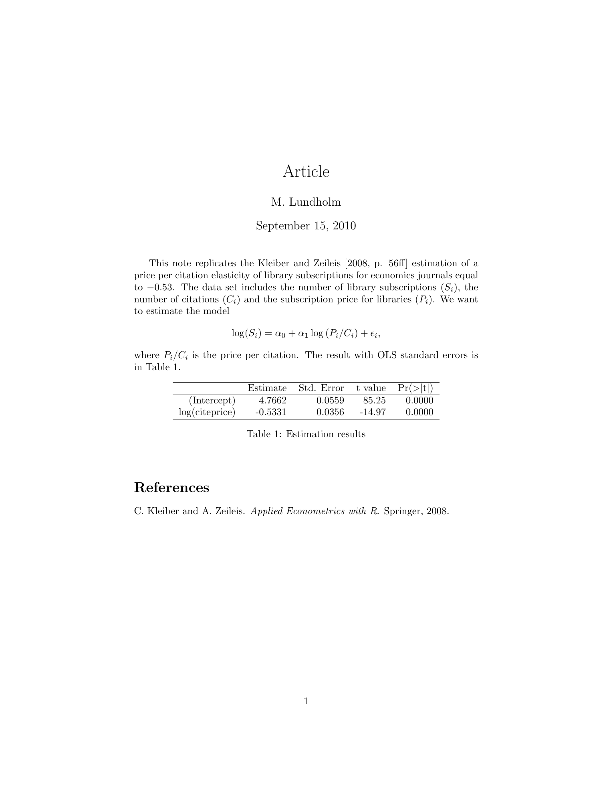
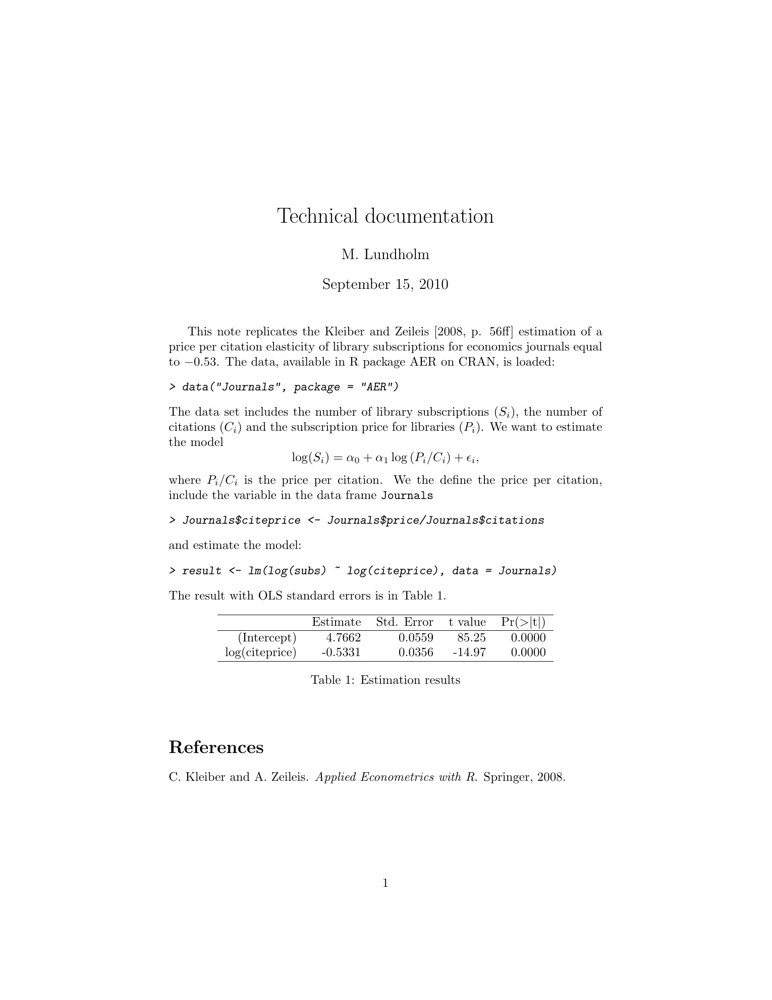

::: article
# Introduction

[@Gentleman04] introduced *compendiums* as a mechanism to combine text,
data, and auxiliary software into a distributable and executable unit,
in order to achieve *reproducible research*[@Buckheit95].:

> "...research papers with accompanying software tools that allow the
> reader to directly reproduce the result and employ the methods that
> are presented ..." [@Gentleman04]

[@Gentleman05] provides an example of how the compendium concept can be
implemented. The core of the implementation is a `Sweave`[@Leisch02].
See also [@Sweave] and @Meredith08. source file. This source file is
then packaged together with data and auxiliary software as an R package.

In this article I suggest an alternative implementation of the
compendium concept combining `Sweave` with `DOCSTRIP`. The latter is the
LaTeX literate programming environment used in package documentation and
as an installation tool.[@Mittelbach05] and @Goossens94. `DOCSTRIP` has
previously been mentioned in the context of reproducible research, but
then mainly as a hard to use alternative to `Sweave`.[@Hothorn06] and
@Rising08. Here, instead, `DOCSTRIP` and `Sweave` are combined.

Apart from the possibility to enjoy the functionality of `Sweave` and
packages such as [*xtable*](https://CRAN.R-project.org/package=xtable)
etc the main additional advantages are that

::: compactitem
in many applications almost all code and data can be kept in a single
source file,

multiple documents (i.e., PDF files) can share the same Sweave code
chunks.
:::

This means not only that administration of an empirical project is
facilitated but also that it becomes easier to achieve reproducible
research. Since `DOCSTRIP` is a part of every LaTeX installation a
`Sweave` user need not install any additional software. Finally,
`Sweave` and `DOCSTRIP` can be combined to produce more complex projects
such as R packages.

One example of the suggested implemention will be given. It contains R
code common to more than one document; an article containing the
advertisement of the research (using the terminology of @Buckheit95),
and one technical documentation of the same research. In the following I
assume that the details of `Sweave` are known to the readers of the R
Journal. The rest of the article will (i) give a brief introduction to
`DOCSTRIP`, (ii) present and comment the example and (iii) close with
some final remarks.

# DOCSTRIP

Suppose we have a source file the entire or partial content of which
should be tangled into one or more result files. In order to determine
which part of the source file that should be tangled into a certain
result file (i) the content of the source file is tagged with none, one
or more tags (tag--lists) and (ii) the various tag--lists are associated
with the result files in a `DOCSTRIP` "installation" file.

There are several ways to tag parts of the source file:

::: compactitem
A single line: Start the line with '`%<`*`tag-list`*`>`'.

Several lines, for instance one or more code or text chunks in `Sweave`
terminology: On a single line before the first line of the chunk enter
the start tag '`%<*`*`tag-list`*`>`' and on a single line after the last
line of the chunk the end tag '`%</`*`tag-list`*`>`'.

All lines: Lines that should be in all result files are left untagged.
:::

`tag-list` is a list of tags combined with the Boolean operators '`|`'
(logical or), '`&`' (logical and) and '`!`' (logical negation). A
frequent type of list would be, say, '`tag1|tag2|tag3`' which will
tangle the tagged material whenever `tag1`, `tag2` *or* `tag3` is called
for into the result files these tags are associated with. The initial
'%' of the tags must be in the file's first column or else the tag will
not be recognised as a `DOCSTRIP` tag. Also, tags must be matched so a
start tag with `tag-list` must be closed by an end tag with `tag-list`.
This resembles the syntax of LaTeX environments rather than the `Sweave`
syntax, where the end of a code or text chunk is indicated by the
beginning of the next text or code chunk. Note also that tags cannot be
nested.[^1]

The following source file (`docex.txt`) exemplifies all three types of
tags:

``` r
%<file1|file2>This line begins both files.
%<*file1>

This is the text that should be included in file1

%</file1>

This is the text to be included in both files

%<*file2>
This is the text that should be included in file2
%</file2>
%<*file1|file2>
Also text for both files.
%</file1|file2>
```

For instance, line $1$ is a single line tagged `file1` *or* `file2`,
line $2$ starts and line $6$ ends a tag `file1` and line $13$ starts and
line $15$ ends a tag `file1` *or* `file2`. Lines $7-9$ are untagged.

The next step is to construct a `DOCSTRIP` installation file which
associates each tag with one or more result files:

``` r
\input docstrip.tex
\keepsilent
\askforoverwritefalse
\nopreamble
\nopostamble
\generate{
\file{file1.txt}{\from{docex.txt}{file1}}
\file{file2.txt}{\from{docex.txt}{file2}}
}
\endbatchfile
```

Line $1$ loads `DOCSTRIP`. Lines $2-5$ contain options that basically
tell `DOCSTRIP` not to issue any messages, to write over any existing
result files and not to mess up the result files with pre-- and
post-ambles.[^2] The action takes place on lines $6-9$ within the
command '`\generate{}`', where lines $7-8$ associate the tags `file1`
and `file2` in the source file `docex.txt` with the result files
`file1.txt` and `file2.txt`.[^3]

We name this file `docex.ins`, where `.ins` is the conventional
extension for `DOCSTRIP` installation files. `DOCSTRIP` is then invoked
with

``` r
latex docex.ins
```

A log--file called `docex.log` is created from which we here show the
most important parts (lines $56-67$):

``` r
Generating file(s) ./file1.txt ./file2.txt 
\openout0 = `./file1.txt'.

\openout1 = `./file2.txt'.


Processing file docex.txt (file1) -> file1.txt
                          (file2) -> file2.txt
Lines  processed: 15
Comments removed: 0
Comments  passed: 0
Codelines passed: 8	
```

We see that two result files are created from the $15$ lines of code in
the source file. First `file1.txt`;

``` r
This line begins both files.

This is the text that should be included in file1


This is the text to be included in both files

Also text for both files.
```

and `file2.txt`;

``` r
This line begins both files.

This is the text to be included in both files

This is the text that should be included in file2
Also text for both files.
```

Note that some lines are blank in both the original source file and the
result files. Disregarding these the two result files together have $8$
lines of code. The untagged material in lines $7-9$ in the source files
is tangled into both result files, the blank lines $7$ and $8$ in the
source file result in the blank lines $5$ and $7$ in `file1.txt` and the
blank lines $2$ and $4$ in `file2.txt`.

# Example

In the following a simple example will be given of how `DOCSTRIP` can be
combined with `Sweave` to implement the compendium concept. The starting
point is a "research problem" which involves loading some data into R,
preprocessing the data, conducting an estimation and presenting the
result. The purpose is to construct a single compendium source file
which contains the code used to create (i) an "article" PDF--file which
will provide a brief account of the test and (ii) a "technical
documentation" PDF--file which gives a more detailed description of
loading and preprocessing data and the estimation. The source file also
contains the code of a BibTeX databse file and the `DOCSTRIP`
installation file. Although this source file is neither a LaTeX file or
a `Sweave` file I will use the extension `.rnw` since it first run
through `Sweave`. Here we simplify the example by using data from an R
package, but if the data set is not too large it could be a part of the
source file.

We can think of the "article" as the "advertisement" intended for
journal publication and the "technical documentation" as a more complete
account of the actual research intended to be available on (say) a web
place. However, tables, graphs and individual statistics should
originate from the same R code so whenever `Sweave` is executed these
are updated in both documents. There may also be common text chunks and
when they are changed in the source file, both documents are updated via
the result files.

The example code in the file `example_source.rnw` is as follows:

``` r
%<*article|techdoc>
%%%%%%%%%%%%%%%%%%%%%%%%%%%%%%%%%%%%%%%%%%%%
%% Author: Michael Lundholm
%% Email:  michael.lundholm@ne.su.se
%% Date:   2010-09-06
%%%%%%%%%%%%%%%%%%%%%%%%%%%%%%%%%%%%%%%%%%%%
%% The project files consists of
%%  * example_source.rnw (THIS FILE)
%% To create other files execute
%%   R CMD Sweave example_source.rnw
%%   latex example.ins
%%   pdflatex example_techdoc.tex
%%   bibtex example_techdoc
%%   pdflatex example_article.tex
%%   bibtex example_article
%%%%%%%%%%%%%%%%%%%%%%%%%%%%%%%%%%%%%%%%%%%%
\documentclass{article}
\usepackage{Sweave,amsmath,natbib}
%</article|techdoc>
%<article>\title{Article}
%<techdoc>\title{Technical documentation}
%<*article|techdoc>
\author{M. Lundholm}
\begin{document}
\maketitle
This note replicates the \citet[p. 56ff]{Kleiber08}
estimation of a price per citation elasticity of
library subscriptions for economics journals equal
to $\input{coef.txt}$.
%</article|techdoc>
%<*techdoc>
The data, available in R package AER on CRAN, is loaded:
<<Loading data>>=
data("Journals",package="AER")
@
%</techdoc>
%<*article|techdoc>
The data set includes the number of library
subscriptions ($S_i$), the number of citations
($C_i$)  and the subscription price for libraries
($P_i$). We want to estimate the model
$$\log(S_i)=\alpha_0+\alpha_1
\log\left(P_i/C_i\right)+\epsilon_i,$$
where $P_i/C_i$ is the price per citation.
%</article|techdoc>
%<*techdoc>
We the define the price per citation, include
the variable in the data frame \texttt{Journals}
<<Define variable>>=
Journals$citeprice <- Journals$price/Journals$citations
@
and estimate the model:
<<Estimate>>=
result <- lm(log(subs)~log(citeprice),data=Journals)
@
%</techdoc>
%<*article|techdoc>
The result with OLS standard errors is in
Table~\ref{ta:est}.
<<Result,results=tex,echo=FALSE>>=
library(xtable)
xtable(summary(result),label="ta:est",
caption="Estimation results")
@
<<echo=FALSE>>=
write(round(coef(result)[[2]],2),file="coef.txt")
@
\bibliographystyle{abbrvnat}
\bibliography{example}
\end{document}
%</article|techdoc>
%<*bib>
 @Book{ Kleiber08,
author = {Christian Kleiber and Achim Zeileis},
publisher = {Springer},
year = {2008},
title = {Applied Econometrics with {R}}}
%</bib>
%<*dump>
<<Write DOCSTRIP installation file>>=
writeLines(
"\\input docstrip.tex
\\keepsilent
\\askforoverwritefalse
\\nopreamble
\\nopostamble
\\generate{
\\file{example_article.tex}%
{\\from{example_source.tex}{article}}
\\file{example_techdoc.tex}%
{\\from{example_source.tex}{techdoc}}
\\file{example.bib}%
{\\from{example_source.tex}{bib}}}
\\endbatchfile
",con="example.ins")
@
%</dump>
```

The compendium source file contains the following `DOCSTRIP` tags (for
their association to files, see below):

-   `article` associated with `example_article.tex`, which contains the
    code to the "advertisement" article,

-   `techdoc` associated with `example_techdoc.tex`, which contains the
    code to the technical documentation,

-   `bib` associated with `example.bib` which contains the code to the
    BibTeX data base file,

-   `dump` associated with no file.

Note that the tags `article` and `techdoc` overlap with eachother but
not with `bib` and `dump`, which in turn are mutually exclusive. There
is no untagged material.

{#fig:ex1art
width="100%" alt="graphic without alt text"}

Lines $2-15$ contain general information about the distributed project,
which could be more or less elaborate. Here it just states that the
project is distributed as a single source file and how the compendium
source file should be processed to get the relevant output
`example_article.pdf` and `example_techdoc.pdf`.

When the instructions are followed, `Sweave` is run first on
`example_source.rnw` creating the file `example_source.tex`, in which
the `Sweave` code chunks are replaced by the corresponding R output code
wrapped with LaTeX typesetting commands. One of the R functions used in
this Sweave session is `writeLines()` (see the lines $80-96$) so that
the `DOCSTRIP` installation file `example.ins` is created before
`DOCSTRIP` is run.

This file `example_source.tex` is the `DOCSTRIP` source file from which
the `DOCSTRIP` utility, together with the installation file
`example.ins`, creates the result files `example_article.tex`,
`example_techdoc.tex` and `example.bib`. The two first result files
share some but not all code from the `DOCSTRIP` source file. The result
files are then run with the LaTeX family of software (here `pdflatex`
and BibTeX) to create two PDF--files `example_article.pdf` and
`example_techdoc.pdf`. These are shown in
Figures [1](#fig:ex1art)--[2](#fig:ex2art).

{#fig:ex2art
width="100%" alt="graphic without alt text"}

Note that the entire bibliography (BibTeX) file is included on lines
$73-77$ and extracted with `DOCSTRIP`. Note also on line $73$ that
unless the @ indicating a new bibliographical entry is *not* in column
$1$ it is mixed up by `Sweave` as a new text chunk and will be removed,
with errors as the result when BibTeX is run.[^4]

The bibliography database file is common to both `example_article.tex`
and `example_techdoc.tex`. Here the documents have the same single
reference. But in real implementations bibliographies would probably not
overlap completely. This way handling references is then preferable
since all bibliographical references occur only once in the source
file.[^5]

In LaTeX cross references are handled by writing information to the
auxiliary file, which is read by later LaTeX runs. This handles
references to an object located both before and after the reference in
the LaTeX file. In `Sweave` can be used to refer to R objects created
before but not after the reference is made. This is not exemplified
here. But since `Sweave` and LaTeX are run sequentially an object can be
created by R, written to a file (see the code chunk on lines $65-67$)
and then be used in the LaTeX run with the command `\input{}` (see code
line $29$).

# Final comments

By making use of combinations of `DOCSTRIP` and (say) `writeLines()` and
by changing the order in which `Sweave` and `DOCSTRIP` are executed the
applications can be made more complex. Such examples may be found
@Lundholm10b [@Lundholm10e].[^6] Also, the use of `DOCSTRIP` can
facilitate the creation of R packages as exemplified by the R data
package [*sifds*](https://CRAN.R-project.org/package=sifds) available on
CRAN [@sifds10]. Another type of example would be teaching material,
where this article may itself serve as an example. Apart from the
`DOCSTRIP` installation file and a Bash script file all code used to
produce this article is contained in a single source file. The Bash
script, together with `DOCSTRIP`, creates all example files including
the final PDF--files; that is, all example code is executed every time
this article is updated. So, if the examples are changed an update of
the article via the Bash script also updates the final PDF--files in
Figures [1](#fig:ex1art)--[2](#fig:ex2art).[^7]

# Colophone

This article was written on a i486-pc-linux-gnu platform using R version
2.11.1 (2010-05-31), LaTeX$2_\varepsilon$ (2005/12/01) and `DOCSTRIP`
2.5d (2005/07/29).

# Acknowledgement

The compendium implementation presented here is partially developed in
projects joint with Mahmood Arai, to whome I am owe several constructive
comments on a previous version.

\
:::

[^1]: More exactly: *Outer* tags, which are described here, cannot be
    nested but *inner tags* can be nested with outer tags. See
    @Goossens94 for details.

[^2]: Pre-- and postambles are text lines that are starting with a
    comment character. Since result files may be processed by software
    using different comment characters some care is needed to use pre--
    and postambles constructed by `DOCSTRIP`. See @Goossens94 how to set
    up pre-- and postambles that are common to all result files from a
    given installation file.

[^3]: From the example one infer that multiple source files are
    possible, altough the compendium implementation discussed later in
    most cases would have only one.

[^4]: The tag `dump` is a safeguard against that this material is
    allocated to some result file by `DOCSTRIP`; in this case to the
    BibTeX data base file.

[^5]: One alternative would be to replace the command
    `\bibliography{example}` on line $69$ with the content of
    `example_article.bbl` and `example_techdoc.bbl` appropriately tagged
    for `DOCSTRIP`. However, this procedure would require an "external"
    bibliography data base file. The problem then is that each time the
    data base is changed, manual updating of the parts of
    `example_source.rnw` that creates `example_article.bbl` and
    `example_techdoc.bbl` is required. Creating the bibliography data
    base file via `DOCSTRIP` makes this manual updating unnecessary.

[^6]: An early attempt to implement the ideas presented in this article
    can be found in @Araietal09.

[^7]: The compendium source files of projects mentioned in this
    paragraph, including this article, can be found at
    <http://people.su.se/~lundh/projects/>.
