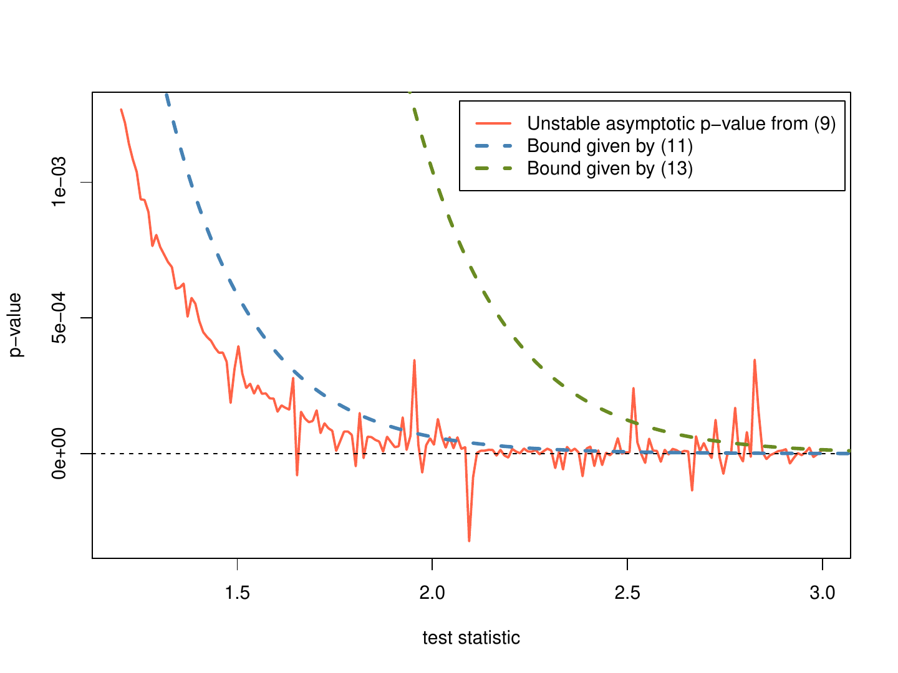

::: article
# Introduction

Goodness-of-fit tests are used to assess whether data are consistent
with a hypothesized null distribution. The $\chi^2$ test is the
best-known parametric goodness-of-fit test, while the most popular
nonparametric tests are the classic test proposed by Kolmogorov and
Smirnov followed closely by several variants on Cramér-von Mises tests.

In their most basic forms, these nonparametric goodness-of-fit tests are
intended for continuous hypothesized distributions, but they have also
been adapted for discrete distributions. Unfortunately, most modern
statistical software packages and programming environments have failed
to incorporate these discrete versions. As a result, researchers would
typically rely upon the $\chi^2$ test or a nonparametric test designed
for a continuous null distribution. For smaller sample sizes, in
particular, both of these choices can produce misleading inferences.

This paper presents a revision of R's `ks.test()` function and a new
`cvm.test()` function to fill this void for researchers and
practitioners in the R environment. This work was motivated by the need
for such goodness-of-fit testing in a study of Olympic figure skating
scoring [@emersonarnold2010]. We first present overviews of the theory
and general implementation of the discrete Kolmogorov-Smirnov and
Cramér-von Mises tests. We discuss the particular implementation of the
tests in R and provide examples. We conclude with a short discussion,
including the state of existing continuous and two-sample Cramér-von
Mises testing in R.

# Kolmogorov-Smirnov test

## Overview

The most popular nonparametric goodness-of-fit test is the
Kolmogorov-Smirnov test. Given the cumulative distribution function
$F_0(x)$ of the hypothesized distribution and the empirical distribution
function $F_{data}(x)$ of the observed data, the test statistic is given
by

$$\begin{aligned}
D = \sup_x \left| F_0(x)- F_{data}(x) \right|    
\label{eq:D}
\end{aligned}  (\#eq:D)  $$

When $F_0$ is continuous, the distribution of $D$ does not depend on the
hypothesized distribution, making this a computationally attractive
method. [@slakter1965] offers a standard presentation of the test and
its performance relative to other algorithms. The test statistic is
easily adapted for one-sided tests. For these, the absolute value in
(\@ref(eq:D)) is discarded and the tests are based on either the
supremum of the remaining difference (the 'greater' testing alternative)
or by replacing the supremum with a negative infimum (the 'lesser'
hypothesis alternative). Tabulated $p$-values have been available for
these tests since 1933 [@kol33].

The extension of the Kolmogorov-Smirnov test to non-continuous null
distributions is not straightforward. The formula of the test statistic
$D$ remains unchanged, but its distribution is much more difficult to
obtain; unlike the continuous case, it depends on the null model. Use of
the tables associated with continuous hypothesized distributions results
in conservative $p$-values when the null distribution is discontinuous
(see [@slakter1965], [@goodman1954], and [@massey1951]). In the early
1970's, @Conover1972 developed the method implemented here for computing
exact one-sided $p$-values in the case of discrete null distributions.
The method developed in @gleser85 is used to provide exact p-values for
two-sided tests.

## Implementation

The implementation of the discrete Kolmogorov-Smirnov test involves two
steps. First, the particular test statistic is calculated (corresponding
to the desired one-sided or two-sided test). Then, the $p$-value for
that particular test statistic may be computed.

The form of the test statistic is the same as in the continuous case; it
would seem that no additional work would be required for the
implementation, but this is not the case. Consider two non-decreasing
functions $f$ and $g$, where the function $f$ is a step function with
jumps on the set $\{x_1, \ldots x_N \}$ and $g$ is continuous (the
classical Kolmogorov-Smirnov situation). In order to determine the
supremum of the difference between these two functions, notice that

$$\begin{aligned}
\sup_x \left| f(x) - g(x) \right| &  \nonumber  \\
       =  \max_i \bigg[ \max\bigg(  & \left|g(x_i) - f(x_i) \right|, \nonumber \\
& \lim_{x \rightarrow x_i} \left| g(x) - f(x_{i-1})
   \right| \bigg) \bigg] \label{SUP1}\\
=  \max_i \bigg[\max \bigg( & \left|g(x_i) - f(x_i) \right|, \nonumber \\
& \left| g(x_i) - f(x_{i-1}) \right| \bigg) \bigg] 
\label{eq:SUP1}
\end{aligned}  (\#eq:SUP1)  $$

Computing the maximum over these $2N$ values (with $f$ equal to
$F_{data}(x)$ and $g$ equal to $F_0(x)$ as defined above) is clearly the
most efficient way to compute the Kolmogorov-Smirnov test statistic for
a continuous null distribution. When the function $g$ is not continuous,
however, equality (\@ref(eq:SUP1)) does not hold in general because we
cannot replace $\lim_{x\rightarrow x_i} g(x)$ with the value $g(x_i)$.

If it is known that $g$ is a step function, it follows that for some
small $\epsilon$,

$$\begin{aligned}
\sup_x &\left| f(x)- g(x) \right| =  \nonumber \\
        & \max_i \left( \left|g(x_i) - f(x_i) \right|, 
    \left| g(x_i - \epsilon) - f(x_{i-1}) \right| \right) 
\label{eq:epsilon}
\end{aligned}  (\#eq:epsilon)  $$

where the discontinuities in $g$ are more than some distance $\epsilon$
apart. This, however, requires knowledge that $g$ is a step function as
well as of the nature of its support (specifically, the break-points).
As a result, we implement the Kolmogorov-Smirnov test statistic for
discrete null distributions by requiring the complete specification of
the null distribution.

Having obtained the test statistic, the $p$-value must then be
calculated. When an exact $p$-value is required for smaller sample
sizes, the methodology in @Conover1972 is used in for one-sided tests.
For two-sided tests, the methods presented in @gleser85 lead to exact
two-sided $p$-values. This requires the calculation of rectangular
probabilities for uniform order statistics as discussed by @nieder81.
Full details of the calculations are contained in source code of our
revised function `ks.test()` and in the papers of Conover and Gleser.

For larger sample sizes (or when requested for smaller sample sizes),
the classical Kolmogorov-Smirnov test is used and is known to produce
conservative p-values for discrete distributions; the revised
`ks.test()` supports estimation of p-values via simulation if desired.

# Cramér-von Mises tests

## Overview

While the Kolmogorov-Smirnov test may be the most popular of the
nonparametric goodness-of-fit tests, Cramér-von Mises tests have been
shown to be more powerful against a large class of alternatives
hypotheses. The original test was developed by Harald Cramér and Richard
von Mises [@cramer1928; @vonmises1928] and further adapted by
[@anderson1952], and [@Watson1961]. The original test statistic, $W^2$,
Anderson's $A^2$, and Watson's $U^2$ are:

$$\begin{aligned}
W^2 &= n \cdot \int_{-\infty}^{\infty} \left[ F_{data}(x)- F_{0}(x) \right]^2 dF_0(x) \label{W2} \\
A^2 &= n \cdot \int_{-\infty}^{\infty} \frac{\left[F_{data}(x)- F_{0}(x) \right]^2}{F_0(x) -F_0(x)^2} dF_0(x) \label{A2} \\
U^2 &= n \cdot \int_{-\infty}^{\infty} \left[ F_{data}(x)- F_{0}(x) - W^2 \right]^2 dF_0(x) 
\label{eq:U2}
\end{aligned}  (\#eq:W2)  $$

As with the original Kolmogorov-Smirnov test statistic, these all have
test statistic null distributions which are independent of the
hypothesized continuous models. The $W^2$ statistic was the original
test statistic. The $A^2$ statistic was developed by Anderson in the
process of generalizing the test for the two-sample case. Watson's $U^2$
statistic was developed for distributions which are cyclic (with an
ordering to the support but no natural starting point); it is invariant
to cyclic reordering of the support. For example, a distribution on the
months of the year could be considered cyclic.

It has been shown that these tests can be more powerful than
Kolmogorov-Smirnov tests to certain deviations from the hypothesized
distribution. They all involve integration over the whole range of data,
rather than use of a supremum, so they are best-suited for situations
where the true alternative distribution deviates a little over the whole
support rather than having large deviations over a small section of the
support. [@stephens1974] offers a comprehensive analysis of the relative
powers of these tests.

Generalizations of the Cramér-von Mises tests to discrete distributions
were developed in [@choulakian1994]. As with the Kolmogorov-Smirnov
test, the forms of the test statistics are unchanged, and the null
distributions of the test statistics are again hypothesis-dependent.
[@choulakian1994] does not offer finite-sample results, but rather shows
that the asymptotic distributions of the test statistics under the null
hypothesis each involve consideration of a weighted sum of independent
chi-squared variables (with the weights depending on the particular null
distribution).

## Implementation

Calculation of the three test statistics is done using the matrix
algebra given by [@choulakian1994]. The only notable difficulty in the
implementation of the discrete form of the tests involves calculating
the percentiles of the weighted sum of chi-squares,

$$\begin{aligned}
Q = \sum_{i=1}^{p} \lambda_i \chi^2_{i,1df}   
\label{eq:eqQ}
\end{aligned}  (\#eq:eqQ)  $$

where $p$ is the number of elements in the support of the hypothesized
distribution. [@imhof1961] provides a method for obtaining the
distribution of $Q$, easily adapted for our case because the chi-squared
variables have only one degree of freedom. The exact formula given for
the distribution function of $Q$ is given by

$$\begin{aligned}
\mathbb{P}\{Q \geq x \} = \frac{1}{2} + 
\frac{1}{\pi} \int_{0}^{\infty} \frac{\sin\left[\theta(u,x)\right]}{u \rho(u) } du 
\label{eq:distQ}
\end{aligned}  (\#eq:distQ)  $$

for continuous functions $\theta(\cdot, x)$ and $\rho(\cdot)$ depending
on the weights $\lambda_i$.

There is no analytic solution to the integral in (\@ref(eq:distQ)), so
the integration is accomplished numerically. This seems fine in most
situations we considered, but numerical issues appear in the regime of
large test statistics $x$ (or, equivalently, small $p$-values). The
function $\theta(\cdot, x)$ is linear in $x$; as the test statistic
grows the corresponding periodicity of the integrand decreases and the
approximation becomes unstable. As an example of this numerical
instability, the red plotted in Figure [1](#cvmissues) shows the
non-monotonicity of the numerical evaluation of equation
(\@ref(eq:distQ)) for a null distribution that is uniform on the set
$\{1,2,3\}$.

<figure id="cvmissues">

<figcaption>Figure 1: Plot of calculated p-values for given test
statistics using numerical integration (red) compared to the
conservative chi-squared bound (dashed blue) and the Markov inequality
bound (dashed green). The null distribution is uniform on the set
\{1,2,3\} in this example. The sharp variations in the calculated
p-values are a result of numerical instabilities, and the true p-values
are bounded by the dashed curves.</figcaption>
</figure>

We resolve this problem by using a combination of two conservative
approximations to avoid the numerical instability. First, consider the
following inequality:

$$\begin{aligned}
\mathbb{P} \left(\sum_{i=1}^{p} \lambda_i \chi^2_1 \geq x \right) &\leq \mathbb{P} \left( \lambda_{max} \sum_{i=1}^{p} \chi^2_1 \geq x \right) \label{ineq1} \\
&= \mathbb{P} \left(\chi^2_p \geq \frac{x}{p \, \lambda_{max}} \right)
\label{eq:ineq1}
\end{aligned}  (\#eq:ineq1)  $$

The values for the weighted sum can be bounded using a simple
transformation and a chi-squared distribution of a higher degree of
freedom. Second, consider the Markov inequality:

$$\begin{aligned}
\mathbb{P} \left(\sum_{i=1}^{p} \lambda_i \chi^2_1 \geq x \right) & \leq \nonumber \\
\mathbb{E}\biggl[\exp\biggl( & t\sum_{i=1}^{p} 
    \lambda_iZ_i^2\biggr)\biggr] \exp(-tx) \\
& = \frac{\exp(-tx)}{\sqrt{\prod_{i=1}^{p}(1-2t\lambda_i)}}
\label{eq:ineq3}
\end{aligned}  (\#eq:ineq3)  $$

where the bound can be minimized over $t \in (0,1/2\lambda_{max})$. The
upper bounds for the $p$-value given by (\@ref(eq:ineq1)) and
(\@ref(eq:ineq3)) are both calculated and the smaller is used in cases
where the numerical instability of (\@ref(eq:distQ)) may be a concern.

The original formulation, numerical integration of (\@ref(eq:distQ)), is
preferable for most $p$-values, while the upper bound described above is
used for smaller $p$-values (smaller than 0.001, based on our
observations of the numerical instability of the original formulation).
Figure [1](#cvmissues) shows the bounds with the blue and green dashed
lines; values in red exceeding the bounds are a result of the numerical
instability. Although it would be preferable to determine the use of the
bound based on values of the test statistic rather than the $p$-value,
the range of "extreme" values of the test statistic varies with the
hypothesized distribution.

# Kolmogorov-Smirnov and Cramér-von Mises tests in R

Functions `ks.test()` and `cvm.test()` are provided for convenience in
package [*dgof*](https://CRAN.R-project.org/package=dgof), available on
CRAN. Function `ks.test()` offers a revision of R's Kolmogorov-Smirnov
function `ks.test()` from recommended package *stats*; `cvm.test()` is a
new function for Cramér-von Mises tests.

The revised `ks.test()` function supports one-sample tests for discrete
null distributions by allowing the second argument, `y`, to be an
empirical cumulative distribution function (an R function with class
`"ecdf"`) or an object of class `"stepfun"` specifying a discrete
distribution. As in the original version of `ks.test()`, the presence of
ties in the data (the first argument, `x`) generates a warning unless
`y` describes a discrete distribution. If the sample size is less than
or equal to 30, or when `exact=TRUE`, exact $p$-values are provided (a
warning is issued when the sample size is greater than 30 due to
possible numerical instabilities). When `exact = FALSE` (or when `exact`
is unspecified and the sample size is greater than 30) the classical
Kolmogorov-Smirnov null distribution of the test statistic is used and
resulting $p$-values are known to be conservative though imprecise (see
[@Conover1972] for details). In such cases, simulated $p$-values may be
desired, produced by the `simulate.p.value=TRUE` option.

The function `cvm.test()` is similar in design to `ks.test()`. Its first
two arguments specify the data and null distribution; the only extra
option, `type`, specifies the variant of the Cramér-von Mises test:

x

:   a numerical vector of data values.

y

:   an `ecdf` or step-function (`stepfun`) for specifying the null model

type

:   the variant of the Cramér-von Mises test; `W2` is the default and
    most common method, `U2` is for cyclical data, and `A2` is the
    Anderson-Darling alternative.

As with `ks.test()`, `cvm.test()` returns an object of class `"htest"`.

# Examples

Consider a toy example with observed data of length 2 (specifically, the
values 0 and 1) and a hypothesized null distribution that places equal
probability on the values 0 and 1. With the current `ks.test()` function
in R (which, admittedly, doesn't claim to handle discrete
distributions), the reported $p$-value, 0.5, is clearly incorrect:

``` r
> stats::ks.test(c(0, 1), ecdf(c(0, 1)))
```

``` r
	One-sample Kolmogorov-Smirnov test

data:  c(0, 1) 
D = 0.5, p-value = 0.5
alternative hypothesis: two-sided 
```

Instead, the value of $D$ given in equation (1) should be 0 and the
associated $p$-value should be 1. Our revision of `ks.test()` fixes this
problem when the user provides a discrete distribution:

``` r
> library(dgof)
> dgof::ks.test(c(0, 1), ecdf(c(0, 1)))
```

``` r
	One-sample Kolmogorov-Smirnov test

data:  c(0, 1) 
D = 0, p-value = 1
alternative hypothesis: two-sided 
```

Next, we simulate a sample of size 25 from the discrete uniform
distribution on the integers $\{1, 2, \ldots, 10\}$ and show usage of
the new `ks.test()` implementation. The first is the default two-sided
test, where the exact $p$-value is obtained using the methods of
@gleser85.

``` r
> set.seed(1)
> x <- sample(1:10, 25, replace = TRUE)
> x
```

``` r
 [1]  3  4  6 10  3  9 10  7  7  1  3  2  7
[14]  4  8  5  8 10  4  8 10  3  7  2  3
```

``` r
> dgof::ks.test(x, ecdf(1:10))
```

``` r
	One-sample Kolmogorov-Smirnov test

data:  x 
D = 0.08, p-value = 0.9354
alternative hypothesis: two-sided 
```

Next, we conduct the default one-sided test, where Conover's method
provides the exact $p$-value (up to the numerical precision of the
implementation):

``` r
> dgof::ks.test(x, ecdf(1:10),
+   alternative = "g")
```

``` r
	One-sample Kolmogorov-Smirnov test

data:  x 
D^+ = 0.04, p-value = 0.7731
alternative hypothesis:
the CDF of x lies above the null hypothesis 
```

In contrast, the option `exact=FALSE` results in the $p$-value obtained
by applying the classical Kolmogorov-Smirnov test, resulting in a
conservative $p$-value:

``` r
> dgof::ks.test(x, ecdf(1:10),
+   alternative = "g", exact = FALSE)
```

``` r
	One-sample Kolmogorov-Smirnov test

data:  x 
D^+ = 0.04, p-value = 0.9231
alternative hypothesis:
the CDF of x lies above the null hypothesis 
```

The $p$-value may also be estimated via a Monte Carlo simulation:

``` r
> dgof::ks.test(x, ecdf(1:10),
+   alternative = "g",
+   simulate.p.value = TRUE, B = 10000)
```

``` r
	One-sample Kolmogorov-Smirnov test

data:  x 
D^+ = 0.04, p-value = 0.7717
alternative hypothesis: 
the CDF of x lies above the null hypothesis 
```

A different toy example shows the dangers of using R's existing
`ks.test()` function with discrete data:

``` r
> dgof::ks.test(rep(1, 3), ecdf(1:3))
```

``` r
	One-sample Kolmogorov-Smirnov test

data:  rep(1, 3) 
D = 0.6667, p-value = 0.07407
alternative hypothesis: two-sided 
```

If, instead, either `exact=FALSE` is used with the new `ks.test()`
function, or if the original `stats::ks.test()` is used, the reported
$p$-value is 0.1389 even though the test statistic is the same.

We demonstrate the Cramér-von Mises tests with the same simulated data.

``` r
> cvm.test(x, ecdf(1:10))
```

``` r
	Cramer-von Mises - W2

data:  x 
W2 = 0.057, p-value = 0.8114
alternative hypothesis: Two.sided 
```

``` r
> cvm.test(x, ecdf(1:10), type = "A2")
```

``` r
	Cramer-von Mises - A2

data:  x 
A2 = 0.3969, p-value = 0.75
alternative hypothesis: Two.sided 
```

We conclude with a toy cyclical example showing that the test is
invariant to cyclic reordering of the support.

``` r
> set.seed(1)
> y <- sample(1:4, 20, replace = TRUE)
> cvm.test(y, ecdf(1:4), type = 'U2')
```

``` r
	Cramer-von Mises - U2

data:  y 
U2 = 0.0094, p-value = 0.945
alternative hypothesis: Two.sided 
```

``` r
> z <- y%%4 + 1
> cvm.test(z, ecdf(1:4), type = 'U2')
```

``` r
	Cramer-von Mises - U2

data:  z 
U2 = 0.0094, p-value = 0.945
alternative hypothesis: Two.sided 
```

In contrast, the Kolmogorov-Smirnov or the standard Cramér-von Mises
tests produce different results after such a reordering. For example,
the default Cramér-von Mises test yields $p$-values of 0.8237 and 0.9577
with the original and transformed data `y` and `z`, respectively.

# Discussion

This paper presents the implementation of several nonparametric
goodness-of-fit tests for discrete null distributions. In some cases the
$p$-values are known to be exact. In others, conservativeness in special
cases with small $p$-values has been established. Although we provide
for Monte Carlo simulated $p$-values with the new `ks.test()`, no
simulations may be necessary necessary for these methods; they were
generally developed during an era when extensive simulations may have
been prohibitively expensive or time-consuming. However, this does raise
the possibility that alternative tests relying upon modern computational
abilities could provide even greater power in certain situations, a
possible avenue for future work.

In the continuous setting, both of the Kolmogorov-Smirnov and the
Cramér-von Mises tests have two-sample analogues. When data are observed
from two processes or sampled from two populations, the hypothesis
tested is whether they came from the same (unspecified) distribution.
With the discrete case, however, the null distribution of the test
statistic depends on the underlying probability model, as discussed by
[@walsh1963]. Such an extension would require the specification of a
null distribution, which generally goes unstated in two-sample
goodness-of-fit tests. We note that [@Mdufour2001] explored two-sample
goodness-of-fit tests for discrete distributions using a permutation
test approach.

Further generalizations of goodness-of-fit tests for discrete
distributions are described in the extended study of [@dewev1973]. There
are existing R packages for certain type of Cramér-von Mises
goodness-of-fit tests for continuous distributions. Functions
implemented in package
[*nortest*](https://CRAN.R-project.org/package=nortest) [@nortest] focus
on the composite hypothesis of normality, while package
[*ADGofTest*](https://CRAN.R-project.org/package=ADGofTest) [@ADGofTest]
provides the Anderson-Darling variant of the test for general continuous
distributions. Packages
[*CvM2SL1Test*](https://CRAN.R-project.org/package=CvM2SL1Test)
[@CvM2SL1Test] and
[*CvM2SL2Test*](https://CRAN.R-project.org/package=CvM2SL2Test)
[@CvM2SL2Test] provide two-sample Cramér-von Mises tests with continuous
distributions. Package
[*cramer*](https://CRAN.R-project.org/package=cramer) [@cramer] offers a
multivariate Cramér test for the two-sample problem. Finally, we note
that the discrete goodness-of-fit tests discussed in this paper do not
allow the estimation of parameters of the hypothesized null
distributions (see [@LSS2007] for example).

# Acknowledgement

We are grateful to Le-Minh Ho for his implementation of the algorithm
described in @nieder81 for calculating rectangular probabilities of
uniform order statistics. We also appreciate the feedback from two
reviewers of this paper as well as from a reviewer of
[@emersonarnold2010].
:::
