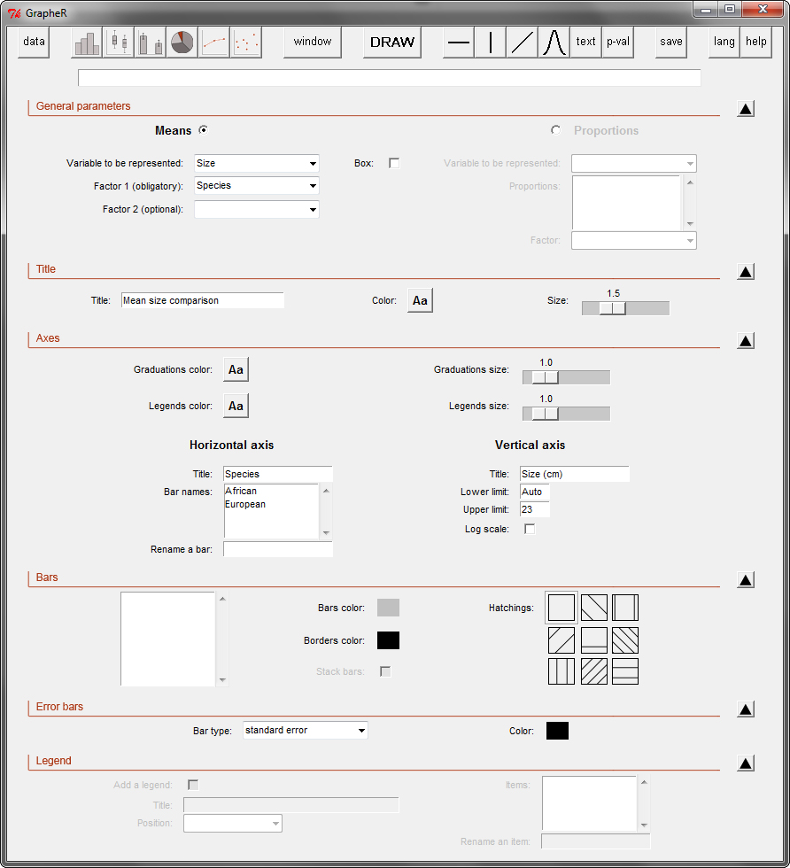

::: article
# Observation and aims

Unlike statistical software based on a Graphical User Interface (GUI),
such as Minitab or Stata, the R language allows you to control exactly
how your data will be displayed. This comes at a cost: you must know the
exact arguments of the commands to get the result you want.

In this context, beginners find that drawing elaborate graphs is often a
long and difficult process made up of lots of trials and slight code
modifications. Some well-known R GUIs already exist (e.g. [R
Commander](http://cran.r-project.org/package=Rcmdr) [@Rcmdr:Fox:2005],
[*JGR*](https://CRAN.R-project.org/package=JGR)
[@JGR:Helbig+Theus+Urbanek:2005], [Sci-Views
R](http://cran.r-project.org/package=SciViews)
[@SciViews:Grosjean:2010],
[Rattle](http://cran.r-project.org/package=rattle)
[@Rattle:Williams:2009] or
[*playwith*](https://CRAN.R-project.org/package=playwith)
[@playwith:Andrews:2010]), but the graphs they produce have mainly an
explorative function in data analysis, and are not customizable to get
publication-ready material.

Therefore, many R users, especially beginners (but not only), go back to
Excel-like software and their clickable interfaces to quickly draw the
graphs they want to publish. In the compromise between speed and
simplicity vs. graph quality, they must sacrifice graph quality in the
process. This is regrettable, because R can do lots of things Excel
cannot, by combining high and low-level graphical functions. The goal of
the [*GrapheR*](https://CRAN.R-project.org/package=GrapheR)
[@GrapheR:Herve:2011] package is therefore to combine the simplicity of
a GUI with the powerful capabilities and the graphical quality of R.

To be immediately accessible to beginners,
[*GrapheR*](https://CRAN.R-project.org/package=GrapheR) does not require
any knowledge of the R language. Indeed, the loading of the dataset, the
choice of the variables to be represented and the configuration of all
graphical options are made with menus, checkboxes and other clickable
tools.

The visual structure and functioning of the GUI are entirely based on
the [*tcltk*](https://CRAN.R-project.org/package=tcltk) package
developed by Peter Dalgaard
[@Tcltk:Dalgaard:2001; @Tcltk:Dalgaard:2002], which adapts the Tcl/Tk
language to R.

# Lauching the interface

As with any other package,
[*GrapheR*](https://CRAN.R-project.org/package=GrapheR) is loaded via
`library(GrapheR)`, `require(GrapheR)` or the `Packages` menu of the
Windows R GUI.

Launching the interface is the only step that requires the user to enter
a command: `run.GrapheR()`. The interface opens and the console can now
be reduced.

# Description of the interface

The interface is divided into three blocks (Figure [1](#Globalview)):

{#Globalview width="100%" alt="graphic without alt text"}

1.  The navigation bar: it contains seven groups of buttons, each
    corresponding to one (obligatory or optional) step of the process.
    From left to right:

    -   Loading and modifying the dataset.

    -   Setting up a graph. From left to right: histogram,
        box-and-whisker plot, bar plot, pie chart, curve and scatter
        plot.

    -   Opening a new graphics device: when a graph is drawn, it is in
        the active window or in a new device if none is open. This
        button allows the user to open a new graphics device in which
        several graphs can be drawn.

    -   Draw a graph.

    -   Adding elements to the graph. From left to right: add a
        horizontal line, add a vertical line, add any other kind of
        line, add a theoretical distribution curve, add text, and add
        $p$-values.

    -   Saving graph(s).

    -   Divers options: user language and help.

2.  The messages frame: when the mouse is over some specific elements of
    the GUI or when some specific actions are performed, messages are
    displayed in this frame. Three kinds of message can be displayed:

    -   [in blue]{style="color: 3,15,178"}: informative messages,

    -   [in green]{style="color: 2,103,0"}: warnings, for when
        particular attention should be paid to a specific point (for
        example: if this option is chosen, then this one can not be),

    -   [in red]{style="color: 255,0,0"}: error messages, for when the
        action requested can not be completed. The message indicates the
        origin of the error.

3.  The settings block: it is divided into four to six sub-blocks, each
    containing options relating to a given theme: general parameters of
    the graph, title of the graph, legend... Each sub-block can be
    opened or closed with the corresponding arrow situated on the right
    of the interface. Of course, defined settings are not lost when a
    sub-block is closed.

# Use

The examples shown here are based on the dataset provided in the
package, called `Swallows`. To load it, use the command
`data(Swallows)`. This (fictional!) dataset exemplifies the legendary
puzzle of African and European swallows' migrations
[@Monthy:Gilliam+Jones:1975].

## Loading and modifying the dataset

The first sub-block (Figure [2](#Load)) allows you to load the dataset.
Data can be imported from an external file (`txt` and `csv` extensions
are available so far) or can be an already existing R object of class
`"data.frame"` (i.e. a table).

The next sub-block allows you to get information on the dataset
structure. When a variable is selected in the list on the left, its type
(`numeric`, `factor`, `logical`...) and its summary are displayed in the
frame on the right.

The next two sub-blocks allow the dataset to be modified if needed:

-   by renaming variables (for example if the dataset does not contain
    their names),

-   by converting variables into factors. The conversion can be applied
    to variables of class `"character"` or to numeric variables (in this
    case values can be grouped into classes). The latter case is
    necessary when a factor is numerically coded, e.g. a binary factor
    (0/1), otherwise R would treat it as a numeric variable.

{#Load width="100%" alt="graphic without alt text"}

## Setting up a graph

Once the dataset is ready, click on the button corresponding to the type
of graph to be drawn (histogram, box-and-whisker plot, bar plot, pie
chart, curve or scatter plot).

Whatever the type of graph chosen, all parameters have a default value
except general parameters -- which correspond to variable(s) to be
represented. Hence, to quickly draw a graph, only general parameters
must be defined. If they are not (or not all) defined, an error occurs
when trying to draw the graph.

Here the aim is to draw two graphs: a barplot displaying a size
comparison of African and European swallows, and a scatter plot
displaying the relationship between weight and size in the two species.
Let's begin with the barplot. We start by clicking on the `Bar plot`
button in the navigation bar.

We want to show mean sizes of swallows depending on their species. In
the general parameters, we hence choose the `Means` type (bar plots can
also display proportions), `Size` as the variable to be represented and
`Species` as the obligatory factor (Figure [3](#Barplot)). A second,
optional, factor could be added, if for example we would like to display
mean sizes of swallows depending on their species and their sex (you can
try to do it, the dataset contains a `Sex` factor).

{#Barplot width="100%" alt="graphic without alt text"}

Graph title and axis legends are optional (no text is written by
default). In our example we call our graph `Mean size comparison` and
name the axes `Species` (horizontal axis) and `Size (cm)` (vertical
axis). Bar names are by default the names of the corresponding levels of
factor 1. However we could change this, which would only change the
names *displayed* on the graph (and not the ones in the dataset). This
allows you to use names containing several words, spaces or accents on
your graph (which is either impossible or strongly discouraged for
object names).

Lower and upper limits of the vertical axis can be changed, and a
logarithmic scale can be used. If limit values are left on `Auto`,
[*GrapheR*](https://CRAN.R-project.org/package=GrapheR) will adjust them
automatically. Here the lower limit is left on `Auto`, whilst the upper
limit is set to `23`, for reasons explained later.

If no second factor is defined, all bars are by default solid white with
a black border and no hatchings. We can set these three parameters (bar
color, border color and hatchings), but in this example we simply change
bar color to a classic grey. If a second factor is defined, one
color/hatching pattern can be attributed by level of this factor. In
this case colors are by default set to different shades of grey (borders
are always black). Bars can be stacked in this situation, but if you
choose this option, no error bar can be drawn.

Means and percentages in scientific bar plots are nearly always supplied
with error bars, but getting those bars right using the command line is
notoriously challenging for R beginners.
[*GrapheR*](https://CRAN.R-project.org/package=GrapheR) makes it easy to
draw error bars to represent either the standard deviation, the standard
error of the mean or the 95% confidence interval of the mean. Here we
choose for example `standard errors`.

When a second factor is defined, a legend box can be added to the graph.
Its items are by default the levels of this factor. As for bar names,
legend items can be renamed, which will not change actual level names in
the dataset. A title can also be added to the legend. Finally, its
position on the graph can be set.

Once all options have been thus configured, just click on the `DRAW`
button of the navigation bar...*et voilà!* By default the graph is
produced in the active graphics device, but here we want to display two
graphs in the same window. Hence we click on the `window` button of the
navigation bar before drawing our bar plot.

## Opening a new graphics device

A dialog box opens on the right of the interface, allowing specification
of the number of graphs to be drawn in the device to be created, and the
background color of this device (Figure [4](#Window)).

It is possible to draw up to 16 graphs in the same device, shared
between four rows and four columns. However, the larger the number of
graphs to be drawn, the smaller the space allocated to each.

{#Window
width="100%" alt="graphic without alt text"}

After creating the new graphics device, we can draw our graph by
clicking on the `DRAW` button.

## Adding elements to the graph

Once the graph is drawn, elements can be added to complete it:

-   one or several horizontal line(s)

-   one or several vertical line(s)

-   any other kind of line(s)

-   one or several theoretical distribution curve(s): only on density
    histograms

-   text

-   $p$-values: only on bar plots

These elements are always added to the last graph drawn.

For each element, clicking on the corresponding button in the navigation
bar opens a dialog box on the right of the interface.

In our bar plot example, let's assume that we had used R beforehand to
perform a statistical test to compare the sizes of our two species. We
can now use the $p$-values tool to add the result of this test on the
graph: just click on the `p-val` button.

Two designs are available, depending on the number of bars to be
compared (Figure [6](#Pvalues)). Whatever the design, the process is the
same: enter the text you want, customize its size and color if needed,
and finally click on the `Select` button. Then just click on the bars to
be compared on the graph.

{#Final width="100%" alt="graphic without alt text"}

{#Pvalues
width="100%" alt="graphic without alt text"}

The result, sometimes, will not look good the first time. It is because
there was not enough space above the bars to add text. If you want to
add text above your graph, remember to allow some space by setting a
higher upper limit for the vertical axis (this is the origin of the
value `23` in Figure [3](#Barplot)). If you omitted this, no problem,
drawing the graph again will be a matter of seconds in
[*GrapheR*](https://CRAN.R-project.org/package=GrapheR). The first graph
is now ready (left part of Figure [5](#Final)).

## Second graph

The second graph we want to draw is a scatter plot displaying the
relationship between weight and size in the two species. We start by
clicking on the `Scatter plot` button of the navigation bar.

In the general parameters, we define `Weight` as the X variable and
`Size` as the Y variable (Figure [7](#Scatterplot)). To draw a scatter
plot by species, we add an optional factor, `Species`, and select its
two levels from the list. Finally, for aesthetic reasons we choose to
draw a box around the graph by ticking the `Box` checkbox.

We add a title for the graph (`Weight - size relationship`), for the
horizontal axis (`Weight (g)`) and for the vertical axis (`Size (cm)`).

For each scatter plot, a different point symbol (as well as its color
and size) can be defined. By default all symbols are empty circles. When
only one scatter plot is drawn the default color is black, whereas when
several are drawn colors are set to different shades of grey. Here we
choose full circles for the two scatter plots and change only the second
color (corresponding to the `European` level) to a dark red.

A line/curve can be added by scatter plot, chosen among different types:

-   a linear regression line (performed with the least squares method)

-   a linear regression line (performed with the least rectangles
    method)

-   a quadratic regression line

-   a simple tendency curve

Here no variable is independent or dependent, but both are
interdependent. We hence choose to add a linear regression line
performed with the least rectangles method to each scatter plot. Among
the three available line types (full, large dashed or fine dashed), we
select `full`.

We add a legend box by ticking the `Add a legend` checkbox. We give it a
title (`Species`) and set its position to `top - left`. We leave the
default items, which correspond to levels of the factor defined in the
general parameters.

Finally, we click on the `DRAW` button of the navigation bar...the
second graph is born (Figure [5](#Final))!

{#Scatterplot
width="100%" alt="graphic without alt text"}

## Saving graph(s)

Once all graphs are drawn, they can be saved by clicking on the `Save`
button of the navigation bar. In the dialog box opening on the right of
the interface, select the device containing the graph to be saved
(Figure [8](#Save)). Then choose the extension of the file to be created
(`jpg`, `png` and `pdf` are available) and the image length. Image
height is automatically calculated from the length value. Finally click
on the `Save` button.\

{#Save width="100%" alt="graphic without alt text"}

## Changing the user language

To change the user language, click on the `lang` button of the
navigation bar. A dialog box opens on the right of the interface
(Figure [9](#Language)). Choose the desired language in the drop-down
menu. To fix your preference in the future, tick the
`Save the preference` checkbox. Click on the `Ok` button to validate.
The interface is closed and re-opened in the chosen language (but note
that any dataset loaded in the previous language session is lost and has
to be re-loaded).\

{#Language
width="100%" alt="graphic without alt text"}

# Implementing [*GrapheR*](https://CRAN.R-project.org/package=GrapheR) in another language

Implementing [*GrapheR*](https://CRAN.R-project.org/package=GrapheR) in
another language is very easy, because no word appearing in the
interface is written in the code. The button names, etc. come from an
external file which is loaded depending on the language setting. In the
current version (1.9-66), only English and French are available (files
`Language_en.csv` and `Language_fr.csv` in the `lang` directory).

Therefore, adding a new language just requires a (strict) translation of
each line of one of the existing files (including spaces before and/or
after words). The new file must then be saved as `Language_XX.csv`.

If you want to implement
[*GrapheR*](https://CRAN.R-project.org/package=GrapheR) in your
language, you are most welcome. In that case, remember that it would be
a good idea (but a tougher job) to also translate the user manual
(contained in the `doc` directory). If you want to participate, do not
hesitate to contact me. I will take care of all screenshots to be
included in the manual, and then add the link to the new language file
in the code.

# Acknowledgments

I am very grateful to Denis Poinsot, Dennis Webb, Clément Goubert and
two anonymous referees for their precious advice on GUI ergonomics,
[*GrapheR*](https://CRAN.R-project.org/package=GrapheR) English
translation and previous versions of this manuscript.

\
:::
