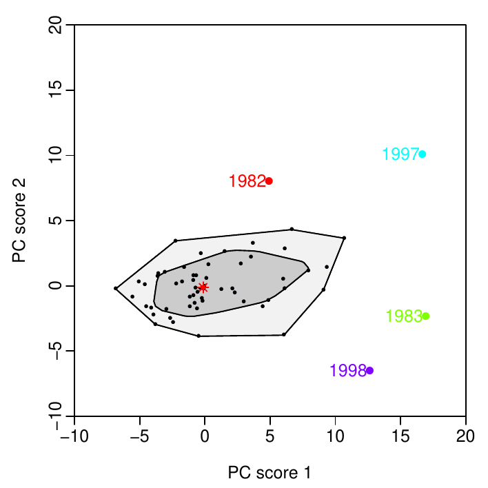
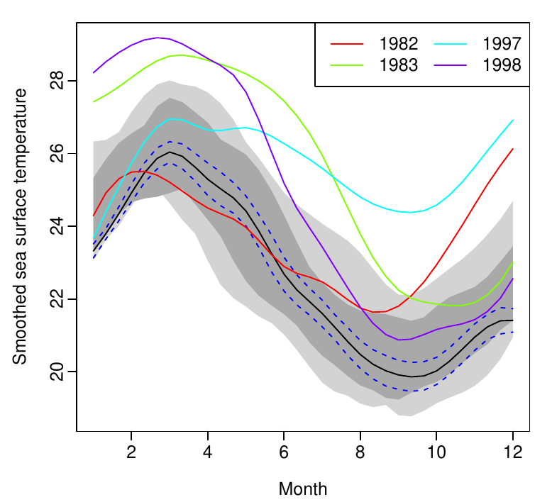
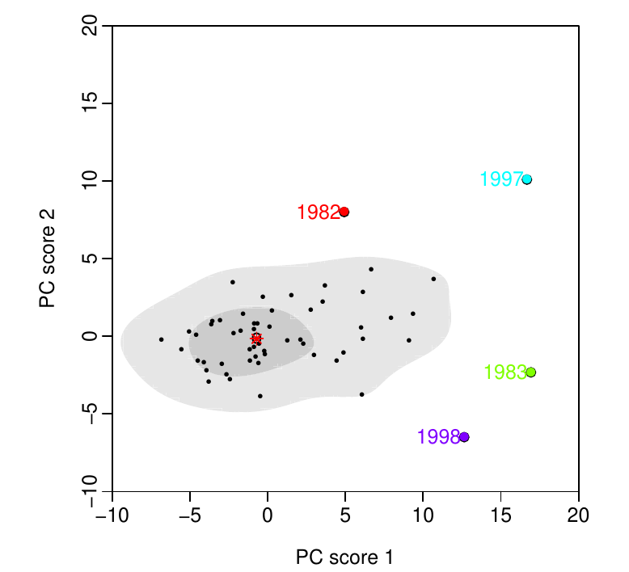
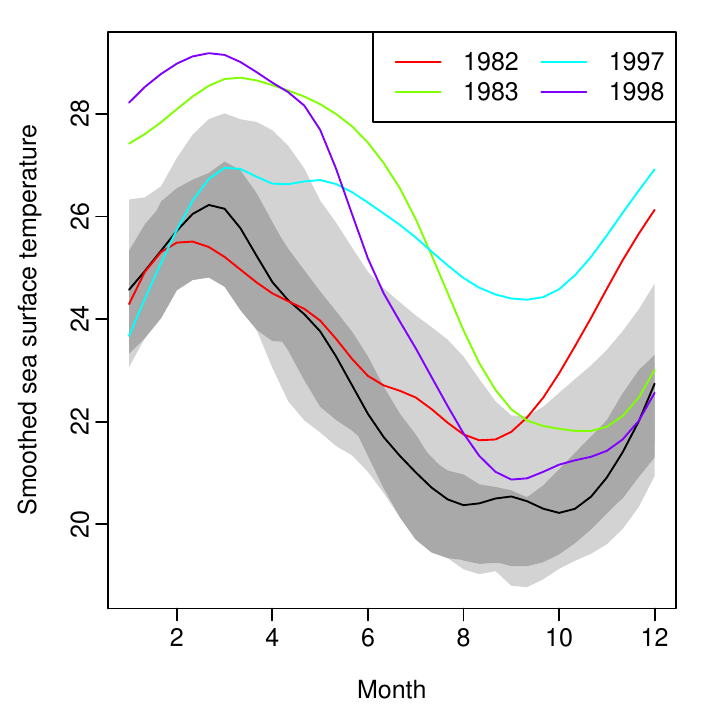
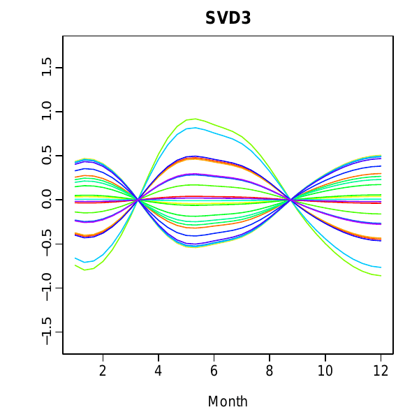
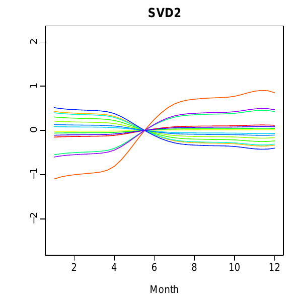
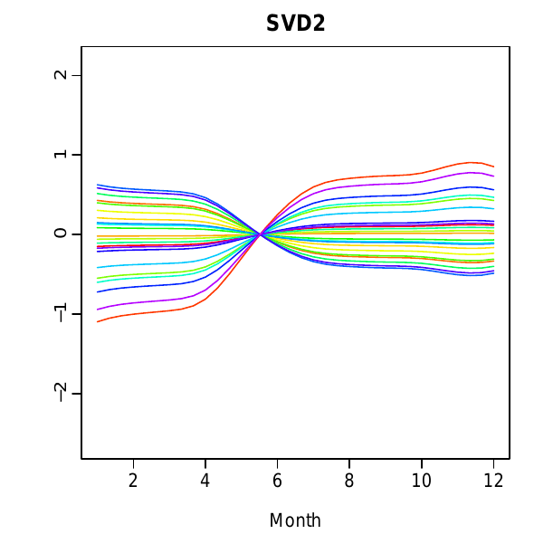
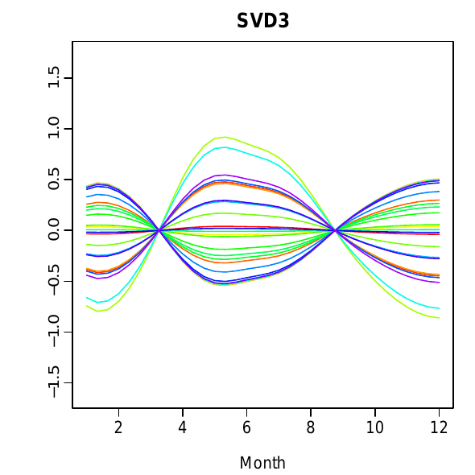
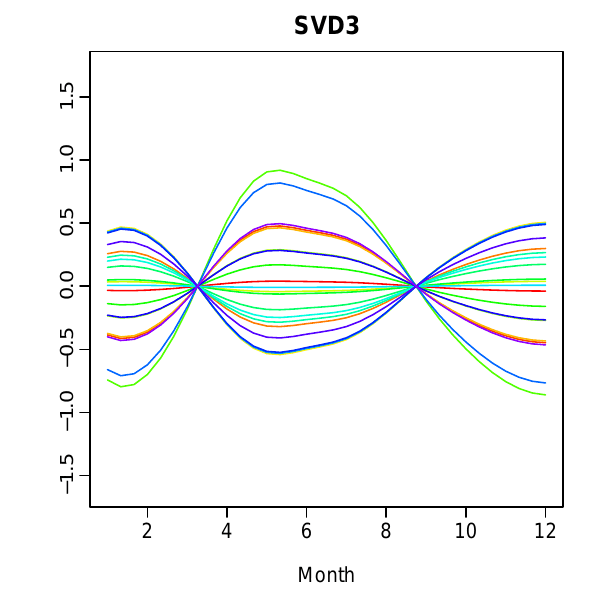
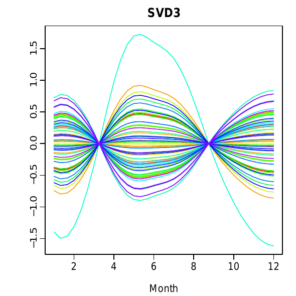

::: article
# Introduction

Recent advances in computer technology have enabled researchers to
collect and store high-dimensional data. When the high-dimensional data
are repeatedly measured over a period of time, a time series of
functions can be observed. Although one can display high-dimensional
time series by adapting multivariate techniques, it is important to take
smoothness of functions into account [@RD91]. It is the smooth property
of functions that separates functional time series from multivariate
time series. Unlike longitudinal time series, functional time series
mitigates the problem of missing data by an interpolation or smoothing
technique, and so functional time series can be thought of as
continuous.

Visualization aids the discovery of characteristics in data that might
not have been apparent in mathematical models and summary statistics.
Yet visualization has not yet received much attention in the literature
of functional data analysis. Notable exceptions are the phase-plane plot
of @RR02, which highlights important distributional characteristics
using the first and second derivatives of functional data, and the
singular value decomposition (SVD) plot of @ZMS+07, which displays the
changes in latent components in relation to the increases of the sample
size or dimensionality. Another exception is the rainbow plot of @HS10,
which can simultaneously display of functional data and identify
possible outliers.

The aim of this article is to collect the R code that implements these
graphical techniques. The R code of phase-plane plot is included in the
[*fda*](https://CRAN.R-project.org/package=fda) package [@RWG+11], while
others are included in the
[*rainbow*](https://CRAN.R-project.org/package=rainbow) package [@SH10].
In addition, this article also presents the use of animation, which can
easily be used with all three graphical techniques in order to visualize
time-varying features of the data.

The article proceeds as follows. Visualization methods of functional
time series are first reviewed. Illustrated by two data sets, the
visualization methods are then demonstrated using the
[*rainbow*](https://CRAN.R-project.org/package=rainbow) package.
Conclusions are given in the end.

# Data sets

The visualization methods are demonstrated using age-specific Australian
fertility rates and monthly sea surface temperatures, both included in
[*rainbow*](https://CRAN.R-project.org/package=rainbow). The details of
these two data sets are described below.

Figure [1](#fig:2) shows annual age-specific Australian fertility rates
between ages 15 and 49 observed from 1921 to 2006. These data were
obtained from the Australian Bureau of Statistics (Cat No,
3105.0.65.001, Table 38). The fertility rates are defined as the number
of live births at 30$^{\text{th}}$ June each year, per 1000 of the
female resident population of the same age.

{#fig:2 width="100%" alt="graphic without alt text"}

Although the four graphical techniques work equally well for plotting
un-smoothed multivariate data, functional data ought to be smooth in
nature. Therefore, the fertility rates were smoothed using a weighted
median smoothing $B$-spline, constrained to be concave [see @HN99; @HU07
for details].

Figure [2](#fig:3) shows monthly sea surface temperatures (in
$^{\circ}$C) from January 1950 to December 2006. These data were
obtained from National Oceanic and Atmospheric Administration
(<http://www.cpc.noaa.gov/data/indices/sstoi.indices>). These sea
surface temperatures were measured by moored buoys in the "Niño
region\", defined as the area within the coordinate $0-10^{\circ}$ South
and $90-80^{\circ}$ West.

{#fig:3 width="100%" alt="graphic without alt text"}

The sea surface temperatures were smoothed using a smoothing spline with
the smoothing parameter determined by generalized cross validation. Each
curve represents smoothed sea surface temperatures in each year.

# Functional time series visualization methods

## Rainbow plot

The rainbow plot is a graphical display of all the functional data, with
the only additional feature being a rainbow color palette based on an
ordering of the data. By default, the rainbow plot displays functional
data that are naturally ordered by time. Functional data can also be
ordered by halfspace location depth [@Tukey75] and highest density
regions [@Hyndman96]. The depth and density orderings lead to the
developments of functional bagplot and functional HDR boxplot, described
in the next subsections.

As the referees pointed out, the rainbow plot (with the default rainbow
color palette) may not be suitable for readers with color blindness. To
mitigate this problem, the `plot.fds` function allows users to specify
their preferred color, such as the heat or terrain palettes. In addition
to the computer-screen based RGB colors, the `plot.fds` function allows
users to utilize the perceptually-based Hue-Chroma-Luminance (HCL)
colors included in the
[*colorspace*](https://CRAN.R-project.org/package=colorspace) package
[@IMH+11]. The use of HCL colors is superior to RGB colors for
readability and color separation, and it is thus preferred [@ZHM09].

Figure [1](#fig:2) presents the rainbow plot of the smoothed fertility
rates in Australia between ages 15 and 49 observed from 1921 to 2006.
The fertility rates from the distant past years are shown in red, while
the most recent years are shown in violet. The peak of fertility rates
occurred around 1961, followed by a rapid decrease during the 1980s, due
to the increasing use of contraceptive pills. Then there is an increase
in fertility rates at higher ages in the most recent years, which may be
caused by a tendency to postpone child-bearing while pursuing careers.
The rainbow plot is useful to reveal pattern changes for functional time
series with a trend. It was produced by the following code:

``` r
# load the package used throughout this article
library("rainbow")
# plot.type = "function", curves are plotted by time
# the most recent curve is shown in purple
# the distant past cure is shown in red
plot(Australiasmoothfertility, plot.type = "functions",
  plotlegend = TRUE)
plot(ElNinosmooth, plot.type = "functions",
  plotlegend = TRUE)
```

For functional time series without a trend (e.g., Figure [2](#fig:3)),
the rainbow plot can still be used by constructing other order indexes,
such as halfspace location depth and highest density regions. The colors
of curves are then chosen in a rainbow color palette according to the
ordering of depth or density.

{#fig:depth width="100%" alt="graphic without alt text"}

{#fig:density width="100%" alt="graphic without alt text"}

Figures [3](#fig:depth) and [4](#fig:density) present the rainbow plots
of sea surface temperatures ordered by halfspace location depth and
highest density regions. The colors reflect the ordering and follow the
order of the rainbow. The curves closest to the center of the data set
are shown in red, whereas the most outlying curves are shown in violet.
The curves are plotted in the order of depth and density, so the red
curves are mostly obscured, but the violet curves are clearly seen even
if they overlap with the majority of the data. These rainbow plots were
produced using the following code.

``` r
# plot.type="depth", curves are plotted by depth
# depth is distance between median and each curve
# median curve (black line) is the center
plot(ElNinosmooth, plot.type = "depth", 
  plotlegend = TRUE)
  
# plot.type="density", curves are plotted by density
# mode (black line) has the highest density
plot(ElNinosmooth, plot.type = "density", 
  plotlegend = TRUE)
```

## Functional bagplot {#sec:bagplot}

Adopting from the idea of projection pursuit [@CBC+95], @HS10 use a
robust functional principal component analysis to decompose functional
data into the first two functional principal components and their
principal component scores. As surrogates for functional data, the
bivariate principal component scores can be ordered by Tukey's halfspace
location depth and plotted in a familiar two-dimensional graph.

{#fig:4
width="100%" alt="graphic without alt text"}

Following @JR92 and @SJT09, the functional bagplot is considered as a
mapping of the bivariate bagplot [@RRT99] of the first two robust
principal component scores to the functional curves. The functional
bagplot displays the median curve, and the inner and outer regions. The
inner region is defined as the region bounded by all curves
corresponding to the points in the bivariate bag. Hence, 50% of curves
are in the inner region. The outer region is similarly defined as the
region bounded by all curves corresponding to the points within the
bivariate fence region. The colors of bivariate outliers are matched to
the same colors of functional outliers.

Figures [5](#fig:4) and [6](#fig:5) display the bivariate and functional
bagplots of the sea surface temperature data.

{#fig:5
width="100%" alt="graphic without alt text"}

The detected outliers in the sea surface temperature data are the years
1982-1983 and 1997-1998. The sea surface temperatures during 1982-1983
began in June 1982 with a moderate increase, then there were abnormal
increases between September 1982 and June 1983 [@TOB+99]. The sea
surface temperatures during 1997-1998 were also unusual: they became
extremely warm in the latter half of 1997, and stayed high for the early
part of 1998.

In Figure [5](#fig:4), the dark gray region shows the 50% bag, and the
light gray region exhibits the customary 99% fence. These convex hulls
correspond directly to the equivalent regions with similar colors and
shading in the functional bagplot (in Figure [6](#fig:5)). Points
outside these regions are defined as outliers. The different colors for
these outliers enable the functional outliers to be matched to the
bivariate outliers. The red asterisk marks the Tukey median of the
bivariate principal component scores, and the solid black curve shows
the median curve. The dotted blue line in the functional bagplot gives
95% pointwise confidence intervals for the median curve. These bagplots
were produced using the following code.

``` r
# plot.type = "bivariate", the bivariate principal
# component scores are displayed
# type = "bag" requests the bagplot
fboxplot(ElNinosmooth, plot.type = "bivariate",
 type = "bag", ylim = c(-10, 20), xlim = c(-10, 20))
# plot.type = "functional", the bivariate pc scores
# are matched to corresponding curves
fboxplot(ElNinosmooth, plot.type = "functional",
 type = "bag")
```

## Functional highest density region (HDR) boxplot {#sec:hdr}

The bivariate principal component scores can also be ordered by the
highest density regions. The highest density regions are the quantiles
of a two-dimensional Parzen-Rosenblatt kernel density estimate, where
the bandwidths are chosen by a plug-in method [@Hyndman96]. In
comparison to a depth-measure approach, the density-measure approach is
able to display multimodality if it is present in the data.

The functional HDR boxplot is a mapping of the bivariate HDR boxplot
[@Hyndman96] of the first two robust principal component scores to the
functional curves. The functional HDR boxplot displays the modal curve
(i.e., the curve with the highest density), and the inner and outer
regions. The inner region is defined as the region bounded by all the
curves corresponding to the points inside the 50% bivariate HDR. Thus,
50% of curves are in the inner region. The outer region is similarly
defined as the region bounded by all the curves corresponding to the
points within the outer bivariate HDR. The colors of bivariate outliers
are matched to the same colors of functional outliers.

Figures [7](#fig:7) and [8](#fig:8) display the bivariate and functional
HDR boxplots of the sea surface temperature data set. As with any
outlier detection methods, the coverage probability of the outer region
needs to be pre-specified. If we set the coverage probability of the
outer region to be 93%, then the outliers detected would match the
results obtained by the bagplot. This indicates that these outliers are
not only far from the median, but also have the lowest density.

In Figure [7](#fig:7), the dark and light gray regions show the 50% HDR
and the 93% outer HDR, respectively. These correspond directly to the
equivalent regions with similar colors and shading in the functional HDR
boxplot (in Figure [8](#fig:8)). Points outside these outer regions are
identified as the outliers. The use of different colors for these
outliers enables the functional outliers to match with the bivariate
outliers. The red dot in the bivariate HDR boxplot marks the mode of
bivariate principal component scores, and it corresponds to the solid
black curve in the functional HDR boxplot.

{#fig:7 width="100%" alt="graphic without alt text"}

{#fig:8
width="100%" alt="graphic without alt text"}

These HDR boxplots were produced using the following code.

``` r
# type = "hdr" requests the HDR boxplot
# alpha requests the coverage probability of inner
# and outer HDR regions, customarily c(0.05,0.5)
fboxplot(ElNinosmooth, plot.type = "bivariate",
         type = "hdr", alpha = c(0.07,0.5),
         ylim = c(-10,20), xlim = c(-10,20))
fboxplot(ElNinosmooth, plot.type = "functional",
         type = "hdr", alpha = c(0.07,0.5))
```

<figure id="fig:9">
<p></p>
<p></p>
<figcaption>Figure 9: The animation of SVD plot is started by clicking
on any graph when using Adobe Reader.</figcaption>
</figure>

## Singular value decomposition (SVD) plot

@ZMS+07 proposed an interactive plot for visualizing patterns of
functional data and multivariate data. They use the idea of projection
pursuit to find only those low-dimensional projections that expose
interesting features of the high-dimensional point cloud. As a popular
projection pursuit technique, singular value decomposition (SVD)
decomposes high-dimensional smoothed multivariate data into singular
columns, singular rows, and singular values ordered by the amount of
explained variance.

@ZMS+07 discretize a set of functional data on a dense grid, denoted as
$\mathbf{f}(x_i)=[f_1(x_i),\cdots, f_n(x_i)]^{'}$, for $i=1,\cdots,p$,
where $p$ is the number of covariates, and $n$ is the number of curves.
Let $\{\mathbf{r}_i; i=1,\cdots,p\}$ and
$\{\mathbf{c}_j; j=1,\cdots,n\}$ be the row and column vectors of the
$(n\times p)$ matrix $\mathbf{f}(x_i)$, respectively. The SVD of
$\mathbf{f}(x_i)$ is defined as

$$\mathbf{f}(x_i)=s_1\mathbf{u}_1\mathbf{v}_1^T+s_2\mathbf{u}_2\mathbf{v}_2^T+\cdots+s_K\mathbf{u}_K\mathbf{v}_K^T,$$

where the singular columns $\mathbf{u}_1,\cdots,\mathbf{u}_K$ form $K$
orthonormal basis functions for the column space spanned by
$\{\mathbf{c}_j\}$; the singular rows $\mathbf{v}_1,\cdots,\mathbf{v}_K$
form $K$ orthonormal basis functions for the row space spanned by
$\{\mathbf{r}_i\}$; and $^T$ symbolizes vector transpose. The vectors
$\{\mathbf{u}_k\}$ and $\{\mathbf{v}_k\}$ are called singular column and
singular row, respectively. The scalars $s_1,\cdots,s_K$ are called
singular values. The matrix
$\{s_k\mathbf{u}_k\mathbf{v}_k^T; k=1,\cdots,K\}$ is referred to as the
SVD component.

The interactive plot of @ZMS+07 captures the changes in the singular
columns, as the number of curves gradually increases. Similarly, it also
captures the changes in the singular rows, as the number of covariates
gradually increases. The interactive plot simultaneously presents the
column and row information of a two-way matrix, to relate the matrix to
the corresponding curves, to show local variation, and to highlight
interactions between columns and rows of a two-way matrix.

By using the [*animate*](https://CRAN.R-project.org/package=animate)
package [@Grahn09], a set of dynamic movies can be created (see
Figure [9](#fig:9) for an example). The advantage of creating these
movies is the ability to demonstrate the time-varying features of the
singular components, and to highlight outliers if present in the data.
The animation is started by clicking on any graph when using Adobe
reader.

Figure [9](#fig:9) shows the SVD plot of the sea surface temperature
data set. The first SVD component captures the seasonal pattern, while
the second and third SVD components show the contrasts of sea surface
temperatures among different months. Note that the SVD2 and SVD3 are on
a much smaller scale in comparison to the SVD1, because the SVD1
accounts for the most of the curves' variation. The functional time
series can be approximated by the summation of the first three SVD
components. From the residual plot, outliers can be identified if they
differ significantly from zero.

The animated SVD plot was produced in a LaTeXeditor, such as WinEdt. For
creating one animation in Figure [9](#fig:9), a series of 57 figures (as
there are 57 years in the sea surface temperature data set) are linked
together as follows

``` r
\% load a package in WinEdt
\usepackage{animate}
\% link a series of 57 figures for producing
\% one animation
\begin{figure}
  \animategraphics{figure_}{1}{57}
\end{figure}
```

In R, the non-animated SVD plot can be produced using the following
code.

``` r
# order represents the number of SVD components
# as the number of SVD components increases
# the residuals should be centered around zero
# plot can be suppressed by setting plot = FALSE
SVDplot(ElNinosmooth, order = 3, plot = TRUE)
```

# Conclusions

This article described four graphical methods included in the
[*rainbow*](https://CRAN.R-project.org/package=rainbow) package, for
visualizing functional time series. These methods can be categorized
into graphical techniques using projection pursuit. Each of these
methods has its unique advantages for revealing the characteristics of
functional time series. Some of the methods enable us to identify and
analyze abnormal observations, while others can be very useful in
visualizing trend. Overall, these graphical methods present a summary of
functional time series, and should be considered as the first step of
functional time series analysis.

# Acknowledgements

Thanks to the editors and reviewers for constructive comments and
suggestions that have significantly improved this article. Thanks also
to Professor Rob Hyndman for helping with R code.
:::
