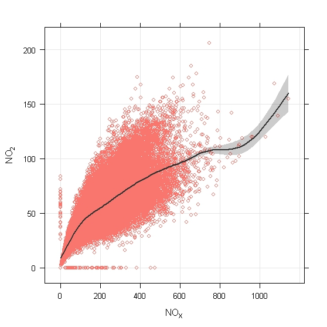
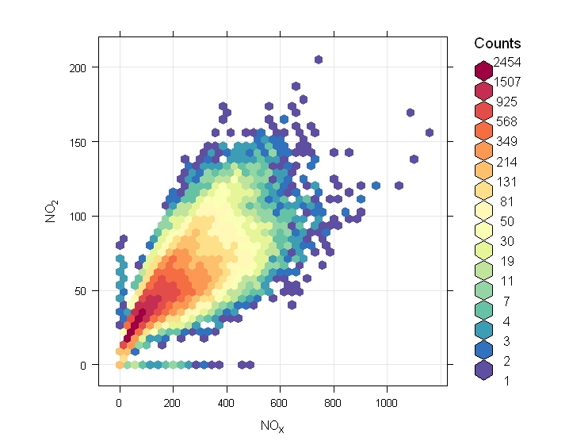
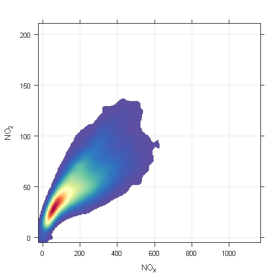
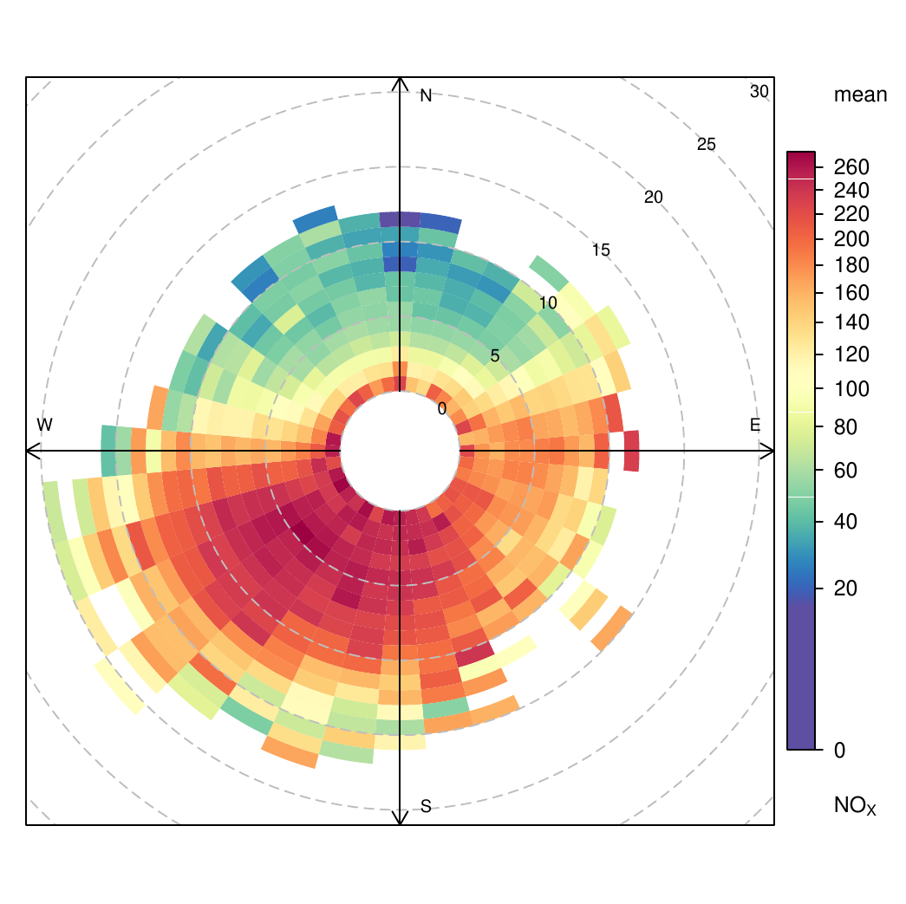
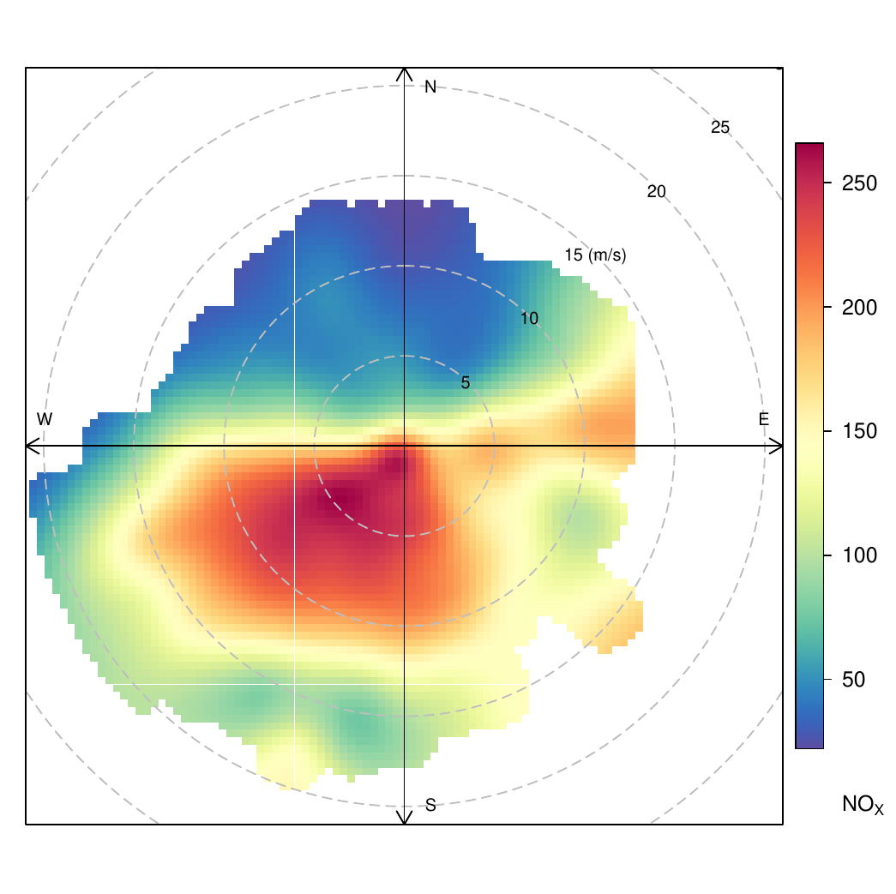
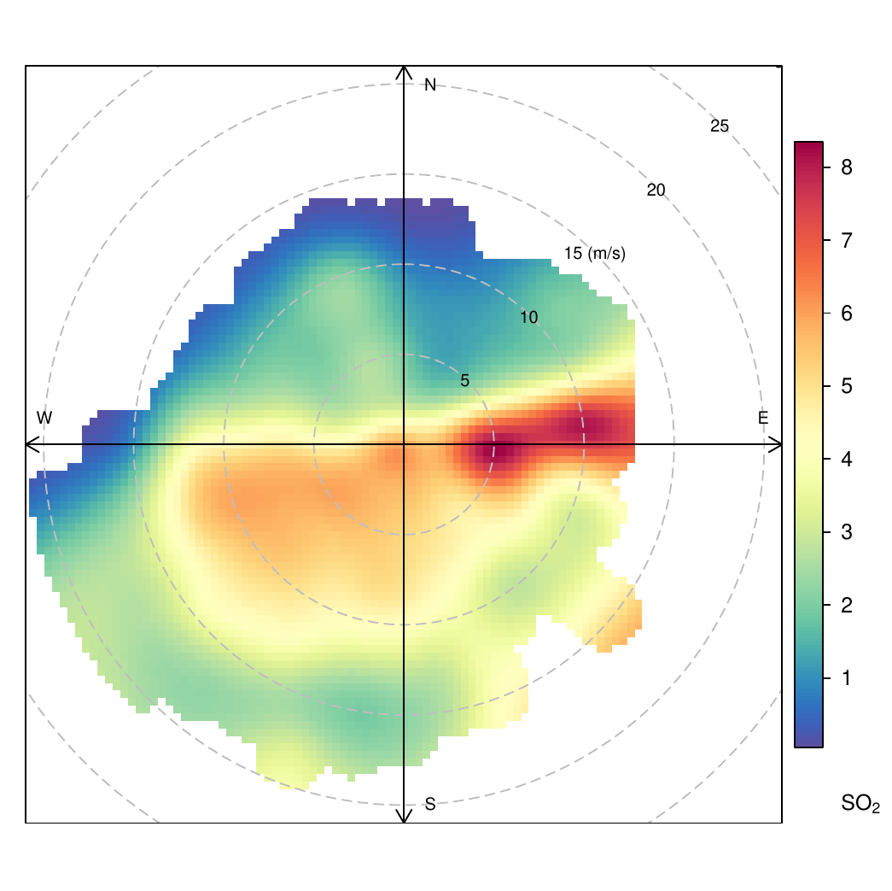

::: article
Large volumes of air quality data are routinely collected for regulatory
purposes, but few of those in local authorities and government bodies
tasked with this responsibility have the time, expertise or funds to
comprehensively analyse this potential resource [@R:Chow+Watson:2008].
Furthermore, few of these institutions can routinely access the more
powerful statistical methods typically required to make the most
effective use of such data without a suite of often expensive and
niche-application proprietary software products. This in turn places
large cost and time burdens on both these institutions and others
(e.g. academic or commercial) wishing to contribute to this work. In
addition, such collaborative working practices can also become highly
restricted and polarised if data analysis undertaken by one partner
cannot be validated or replicated by another because they lack access to
the same licensed products.

Being freely distributed under general licence, R has the obvious
potential to act as a common platform for those routinely collecting and
archiving data and the wider air quality community. This potential has
already been proven in several other research areas, and commonly cited
examples include the Bioconductor project [@R:Gentleman+etal:2004] and
the Epitools collaboration (<http://www.medepi.com/epitools>). However,
what is perhaps most inspiring is the degree of transparency that has
been demonstrated by the recent public analysis of climate change data
in R and associated open debate
(<http://chartsgraphs.wordpress.com/category/r-climate-data-analysis-tool/>).
Anyone affected by a policy decision, could potentially have unlimited
access to scrutinise both the tools and data used to shape that
decision.

# The openair rationale

With this potential in mind, the openair project was funded by UK NERC
(award NE/G001081/1) specifically to develop data analysis tools for the
wider air quality community in R as part of the NERC Knowledge Exchange
programme (<http://www.nerc.ac.uk/using/introduction/>).

One potential issue was identified during the very earliest stages of
the project that is perhaps worth emphasising for the existing R users.

Most R users already have several years of either formal or self-taught
experience in statistical, mathematical or computational working
practices before they first encounter R. They probably first discovered
R because they were already researching a specific technique that they
identified as beneficial to their research and saw a reference to a
package or script in an expert journal or were recommended R by a
colleague. Their first reaction on discovering R, and in particular the
packages, was probably one of excitement. Since then they have most
likely gone on to use numerous packages, selecting an appropriate
combination for each new application they undertook.

Many in the air quality community, especially those associated with data
collection and archiving, are likely to be coming to both
[*openair*](https://CRAN.R-project.org/package=openair)
[@R:Carslaw+Ropkins:2010] and R with little or no previous experience of
statistical programming. Like other R users, they recognise the
importance of highly evolved statistical methods in making the most
effective use of their data; but, for them, the step-change to working
with R is significantly larger.

As a result many of the decisions made when developing and documenting
the [*openair*](https://CRAN.R-project.org/package=openair) package were
shaped by this issue.

# Data structures and importers

Most of the main functions in
[*openair*](https://CRAN.R-project.org/package=openair) operate on a
single data frame. Although it is likely that in future this will be
replaced with an object class to allow data unit handling, the data
frame was initially adopted for two reasons. Firstly, air quality data
is currently collected and archived in numerous formats and keeping the
import requirements for
[*openair*](https://CRAN.R-project.org/package=openair) simple minimised
the frustrations associated with data importation. Secondly, restricting
the user to working in a single data format greatly simplifies data
management and working practices for those less familiar with
programming environments.

Typically, the data frame should have named fields, three of which are
specifically reserved, namely: `date`, a field of `POSIXt` class time
stamps, and `ws` and `wd`, numeric fields for wind speed and wind
direction data. There are no restrictions on the number of other fields
and the names used outside the standard conventions of R. This means
that the 'work up' to make a new file
[*openair*](https://CRAN.R-project.org/package=openair)-compatible is
minimal: Read in data; reformat and rename `date`; and rename wind speed
and wind direction as `ws` and `wd`, if present.

That said, many users new to programming still found class structures,
in particularly `POSIXt`, daunting. Therefore, a series of importer
functions were developed to simplify this process.

The first to be developed was `import`, a general purpose function
intended to handle comma and tab delimited file types. It defaults to a
file browser (via `file.choose`), and is intended to be used in the
common form, e.g.:

``` r
newdata <- import()
newdata <- import(file.type = "txt") #etc
```

(Here, as elsewhere in
[*openair*](https://CRAN.R-project.org/package=openair), argument
options have been selected pragmatically for users with limited
knowledge of file structures or programming conventions. Note that the
`file.type` option is the file extension `"txt"` that many users are
familiar with, rather than either the `delim` from `read.delim` or the
`"`$\setminus$`t"` separator.)

A wide range of monitoring, data logging and archiving systems are used
by the air quality community and many of these employ unique file
layouts, including e.g. multi-column date and stamps, isolated or
multi-row headers, or additional information of different dimensions to
the main data set. So, `import` includes a number of arguments,
described in detail in `?import`, that can be used to fine-tune its
operation for novel file layouts.

Dedicated importers have since been written for some of the file formats
and data sources most commonly used by the air quality community in the
UK. These operate in the common form:

``` r
newdata <- import[Name]() 
```

And include:

-   `importADMS`, a general importer for `.bgd`, `.met`, `.mop` and
    `.pst` file formats used by the Atmospheric Dispersion Modelling
    System [@R:McHugh+etal:1997] developed by CERC
    (<http://www.cerc.co.uk/index.php>). ADMS is widely used in various
    forms to model both current and future air quality scenarios
    (<http://www.cerc.co.uk/environmental-software/ADMS-model.html>).

-   `importAURN` and `importAURNCsv`, importers for hourly data from the
    UK (Automatic Urban and Rural Network) Air Quality Data Archive
    (<http://www.airquality.co.uk/data_and_statistics.php>).
    `importAURN` provides a direct link to the archive and downloads
    data directly from the online archive. `importAURNCsv` allows `.csv`
    files previously downloaded from the archive to be read into
    [*openair*](https://CRAN.R-project.org/package=openair).

-   `importKCL`, an importer for direct online access to data from the
    King's College London databases (<http://www.londonair.org.uk/>).

Here, we gratefully acknowledge the very significant help and support of
AEAT, King College London's Environmental Research Group (ERG) and CERC
in the development of these importers. AEAT and ERG operate the AURN and
LondonAir archives, respectively, and both specifically set up dedicated
services to allow the direct download of `.RData` files from their
archives. CERC provided extensive access to multiple generations of ADMS
file structures and ran an extensive programme of compatibility testing
to ensure the widest possible body of ADMS data was accessible to
[*openair*](https://CRAN.R-project.org/package=openair) users.

# Example data

The [*openair*](https://CRAN.R-project.org/package=openair) package
includes one example dataset, `mydata`. This is data frame of hourly
measurements of air pollutant concentrations, wind speed and wind
direction collected at the Marylebone (London) air quality monitoring
supersite between 1st January 1998 and 23rd June 2005 (source: London
Air Quality Archive; <http://www.londonair.org.uk>).

The same dataset is available to download as a `.csv` file from the
openair website
(<http://www.openair-project.org/CSV/OpenAir_example_data_long.csv>).
This file can be directly loaded into
[*openair*](https://CRAN.R-project.org/package=openair) using the
`import` function. As a result, many users, especially those new to R,
have found it a very useful template when loading their own data.

# Manuals

Two manuals are available for use with
[*openair*](https://CRAN.R-project.org/package=openair). The standard R
manual is available alongside the package at its `CRAN` repository site.
An extended manual, intended to provide new users less familiar with
either R or [*openair*](https://CRAN.R-project.org/package=openair) with
a gentler introduction, is available on the openair website:
<http://www.openair-project.org>.

# Main functions

Most of the main functions within
[*openair*](https://CRAN.R-project.org/package=openair) share a highly
similar structure and, wherever possible, common arguments. Many in the
air quality community are very familiar with `GUI` interfaces and data
analysis procedures that are very much predefined by the software
developers. R allows users the opportunity to really explore their data.
However, a command line framework can sometimes feel frustratingly slow
and awkward to users more used to a 'click and go' style of working.
Standardising the argument structure of the main functions both
encourages a more interactive approach to data analysis and minimises
the amount of typing required of users more used to working with a mouse
than keyboard.

Common [*openair*](https://CRAN.R-project.org/package=openair) function
arguments include: `pollutant`, which identities the data frame field or
fields to select data from; `statistic`, which, where data are grouped,
e.g. share common coordinates on a plot, identifies the summary
statistic to apply if only a single value is required; and, `avg.time`,
which, where data series are to be averaged on longer time periods,
identifies the required time resolution. However, perhaps the most
important of these common arguments is `type`, a simplified form of the
conditioning term `cond` widely used elsewhere in R.

Rapid data conditioning is only one of a large number of benefits that R
provides, but it is probably the one that has most resonance with air
quality data handlers. Most can instantly appreciate its potential power
as a data visualisation tool and its flexibility when used in a
programming environment like R. However, many new users can struggle
with the fine control of `cond`, particularly with regards to the
application of `format.POSIX*` to time stamps. The `type` argument
therefore uses an
[*openair*](https://CRAN.R-project.org/package=openair) workhorse
function called `cutData`, which is discussed further below, to provide
a robust means of conditioning data using options such as `"hour"`,
`"weekday"`, `"month"` and `"year"`)

These features are perhaps best illustrated with an example.

The [*openair*](https://CRAN.R-project.org/package=openair) function
`trendLevel` is basically a wrapper for the
[*lattice*](https://CRAN.R-project.org/package=lattice) [@R:Sarkar:2009]
function `levelplot` that incorporates a number of built-in conditioning
and data handling options based on these common arguments. So, many
users will be very familiar with the basic implementation.

The function generates a `levelplot` of
`pollutant `$\sim$` x * y | type` where `x`, `y` and `type` are all
cut/factorised by `cutData` and in each `x`/`y`/`type` case `pollutant`
data is summarised using the option `statistic`.

When applied to the openair example dataset `mydata` in its default
form, `trendLevel` uses `x = "month"` (month of year), `y = "hour"`
(time of day) and `type = "year"` to provide information on trends,
seasonal effects and diurnal variations in mean $NO_{x}$ concentrations
in a single output (Figure [1](#figure:trendLevel)).

However, `x`, `y`, `type` and `statistic` can all be user-defined.

{#figure:trendLevel width="100%" alt="graphic without alt text"}

The function arguments `x`, `y` and `type` can be set to a wide range of
time/date options or to any of the fields within the supplied data
frame, with numerics being cut into quantiles, characters converted to
factors, and factors used as is.

Similarly `statistic` can also be either a pre-coded option,
e.g. `"mean"`, `"max"`, etc, or be a user defined function. This 'tiered
approach' provides both simple, robust access for new users and a very
flexible structure for more experienced R users. To illustrate this
point, the default `trendLevel` plot (Figure [1](#figure:trendLevel))
can be generated using three equivalent calls:

``` r
   # predefined
   trendLevel(mydata, statistic = "mean")  
  
   # using base::mean
   trendLevel(mydata, statistic = mean)
  
   # using local function   
   my.mean <- function(x)\{
                 x <- na.omit(x)
                 sum(x) / length(x)\} 
   trendLevel(mydata, pollutant = "nox", 
              statistic = my.mean) 
```

The `type` argument can accept one or two options, depending on
function, and in the latter case strip labelling is handled using the
[*latticeExtra*](https://CRAN.R-project.org/package=latticeExtra)
[@R:Sarkar+Andrews:2011] function `useOuterStrips`.

<figure id="figure:scatterPlot">
<p></p>
<figcaption>Figure 2: openair plots generated using scatterPlot(mydata,
"nox", "no2", ...) and method = "scatter" (default; left), "hexbin"
(middle) and "density" (right).</figcaption>
</figure>

The other main functions include:

-   `summaryPlot`, a function which generates a rug plot and histogram
    view of one or more data frame fields, as well as calculating
    several key statistics that can be used to characterise the quality
    and capture efficiency of data collecting in extended monitoring
    programmes. The plot provides a useful screening prior to the main
    data analysis.

-   `timePlot` and `scatterPlot`, time-series and traditional scatter
    plot functions. These were originally introduced to provide such
    plots in a format consistent with other
    [*openair*](https://CRAN.R-project.org/package=openair) outputs, but
    have evolved through user-feedback to include additional hard-coded
    options that may be of more general use. Perhaps, the most obvious
    of these being the `"hexbin"` (hexagonal binning using the
    [*hexbin*](https://CRAN.R-project.org/package=hexbin) package
    [@R:Carr+etal:2011]) and `"density"` (2D kernel density estimates
    using `.smoothScatterCalcDensity` in
    [*grDevices*](https://CRAN.R-project.org/package=grDevices)) methods
    for handling over-plotting (Figure [2](#figure:scatterPlot)).

-   Trend analysis is an important component of air quality management,
    both in terms of historical context and abatement strategy
    evaluation. [*openair*](https://CRAN.R-project.org/package=openair)
    includes three trend analysis functions: `MannKendall`,
    `smoothTrend` and `LinearRelation`. `MannKendall` uses methods based
    on @R:Hirsch+etal:1982 and @R:Helsel+Hirsch:2002 to evaluate
    monotonic trends. Sen-Theil slope and uncertainty are estimated
    using code based on that published on-line by Rand Wilxox
    (<http://www-rcf.usc.edu/~rwilcox/>) and the basic method has been
    extended to block bootstrap simulation to account for
    auto-correlation [@R:Kunsch:1989]. `smoothTrend` fits a generalized
    additive model (GAM) to monthly averaged data to provide a
    non-parametric description of trends using methods and functions in
    the package [*mgcv*](https://CRAN.R-project.org/package=mgcv)
    [@R:Wood:2004; @R:Wood:2006]. Both functions incorporate an option
    to `deseasonalise` data prior to analysis using the `stl` function
    in [*stats*](https://CRAN.R-project.org/package=stats)
    [@R:Cleveland+etal:1990]. The other function, `linearRelation`, uses
    a rolling window linear regression method to visualise the degree of
    change in the relations between two species over larger timescales.

-   `windRose` generates a traditional 'wind rose' style plot of wind
    speed and direction. The associated wrapper function `pollutionRose`
    allows the user to substitute wind speed with another data frame
    field, most commonly a pollutant concentration time-series, to
    produce 'pollution roses' similar to those used by
    @R:Henry+etal:2009.

    <figure id="figure:polars">
    <p></p>
    <figcaption>Figure 3: openair plots generated using (left)
    polarFreq(mydata, "nox", statistic = "mean"); (middle) polarPlot(mydata,
    "nox"); and, (right) polarPlot(mydata, "so2").</figcaption>
    </figure>

-   `polarFreq`, `polarPlot` and `polarAnnulus` are a family of
    functions that extend polar visualisations. In its default form
    `polarFreq` provides an alternative to wind speed/direction
    description to `windRose`, but `pollutant` and `statistic` arguments
    can also be included in the call to produce a wide range of other
    polar data summaries. `polarPlot` uses `mgcv::gam` to fit a surface
    to data in the form `polarFreg(..., statistic = "mean")` to provide
    a useful visualisation tool for pollutant source characterisation.
    This point is illustrated by Figure [3](#figure:polars) which shows
    three related plots. Figure [3](#figure:polars) left is a basic
    polar presentation of mean $NO_{x}$ concentrations produced using
    `polarFreq(mydata, "nox", statistic = "mean")`.
    Figure [3](#figure:polars) middle is a comparable `polarPlot`, which
    although strictly less quantitatively accurate, greatly simplifies
    the identifications of the main features, namely a broad high
    concentration feature to the Southwest with a maxima at lower wind
    speeds (indicating a local source) and a lower concentration but
    more resolved high wind speed feature to the East (indicating a more
    distant source). Then, finally Figure [3](#figure:polars) right
    presents a similar `polarPlot` of $SO_{2}$, which demonstrates that
    the local source (most likely near-by traffic) is relatively
    $NO_{x}$ rich while the more distant Easterly feature (most likely
    power station emissions) is relatively $SO_{2}$ rich. This theme is
    discussed in further detail in @R:Carslaw+etal:2006. The
    `polarAnnulus` function provides an alternative polar visualisation
    based on wind direction and time frequency (e.g. hour of day, day of
    year, etc.) to explore similar diagnostics to those discussed above
    with regard to `trendLevel`.

-   Likewise, `timeVariation` generates a range of hour-of-the-day and
    day-of-the-week and month-of-the-year plots that can provide useful
    insights regarding the time frequency of one or more pollutants.

-   `calendarPlot` presents daily data in a conventional calendar-style
    layout. This is a highly effective format for the presentation of
    information, especially when working with non-experts.

-   Air quality standards are typically defined in terms of upper limits
    that concentrations of a particular pollutant may not exceed or may
    only exceed a number of times in any year. `kernelExceed` uses a
    kernel density function (`.smoothScatterCalcDensity` in
    [*grDevices*](https://CRAN.R-project.org/package=grDevices)) to map
    the distribution of such exceedances relative to two other
    parameters. The function was developed for use with daily mean
    (European) limit value for $PM_{10}$ (airborne particulate matter up
    to 10 micrometers in size) of $50~\mu g/m^{3}$ not to be exceeded on
    more than 35 days, and in its default form plots $PM_{10}$
    exceedances relative to wind speed and direction.

-   [*openair*](https://CRAN.R-project.org/package=openair) also
    includes a number of specialist functions. The `calcFno2` function
    provides an estimate of primary $NO_2$ emissions ratios, a question
    of particular concern for the air quality community at the moment.
    Associated theory is provided in @R:Carslaw+Beevers:2005, and
    further details of the function's use are given in the extended
    version of the openair manual (<http://www.openair-project.org>).
    Functions `modStats` and `conditionalQuantile` were developed for
    model evaluation.

# Utilities and workhorse functions

The [*openair*](https://CRAN.R-project.org/package=openair) package
includes a number of utilities and workhorse functions that can be
directly accessed by users and therefore used more generally. These
include:

-   `cutData`, a workhorse function for data conditioning, intended for
    use with the `type` option in main
    [*openair*](https://CRAN.R-project.org/package=openair) functions.
    It accepts a data frame and returns the conditioned form:

    ``` r
    head(olddata) 
      
                     date   ws  wd nox
    1 1998-01-01 00:00:00 0.60 280 285
    2 1998-01-01 01:00:00 2.16 230  NA
    3 1998-01-01 02:00:00 2.76 190  NA
    4 1998-01-01 03:00:00 2.16 170 493
    5 1998-01-01 04:00:00 2.40 180 468
    6 1998-01-01 05:00:00 3.00 190 264

    newdata <- cutData(olddata, 
                       type = "hour")
    head(newdata) 
      
                     date   ws  wd nox hour
    1 1998-01-01 00:00:00 0.60 280 285   00
    2 1998-01-01 01:00:00 2.16 230  NA   01
    3 1998-01-01 02:00:00 2.76 190  NA   02
    4 1998-01-01 03:00:00 2.16 170 493   03
    5 1998-01-01 04:00:00 2.40 180 468   04
    6 1998-01-01 05:00:00 3.00 190 264   05
    ```

    Here `type` can be the name of one of the fields in the data frame
    or one of a number of pre-defined terms. Data frame fields are
    handled pragmatically, e.g. factors are returned unmodified,
    characters are converted to factors, numerics are subset by
    `stats::quantile`. By default numerics are converted into four
    quantile bands but this can be modified using the additional option
    `n.levels`. Pre-defined terms include `"hour"` (hour-of-day),
    `"daylight"` (daylight or nighttime), `"weekday"` (day-of-week),
    `"weekend"` (weekday or weekend), `"month"` (month-of-year),
    `"monthyear"` (month and year), `"season"` (season-of-year),
    `"gmtbst"` (GMT or BST) and `"wd"` (wind direction sector).

    With the exception of `"daylight"`, `"season"`, `"gmtbst"` and
    `"wd"` these are wrappers for conventional `format.POSIXt`
    operations commonly required by
    [*openair*](https://CRAN.R-project.org/package=openair) users.

    `"daylight"` conditions the data relative to estimated sunrise and
    sunset to give either `daylight` or `nighttime`. The cut is actually
    made by a specialist function, `cutDaylight`, but more conveniently
    accessed via `cutData` or the main functions. The 'daylight'
    estimation, which is valid for dates between 1901 and 2099, is made
    using the measurement date, time, location and astronomical
    algorithms to estimate the relative positions of the Sun and the
    measurement location on the Earth's surface, and is based on NOAA
    methods (<http://www.esrl.noaa.gov/gmd/grad/solcalc/>). Date and
    time are extracted from the `date` field but can be modified using
    the additional option `local.hour.offset`, and location is
    determined by `latitude` and `longitude` which should be supplied as
    additional options.

    `"season"` conditions the data by month-of-year (as `"month"`) and
    then regroups data into the four seasons. By default, the operation
    assumes the measurement was made in the northern hemisphere, and
    winter = December, January and February, spring = March, April and
    May, etc., but can be reset using the additional option `hemisphere`
    (`hemisphere = "southern"` which returns winter = June, July and
    August, spring = September, October and November, etc.). Note: for
    convenience/traceability these are uniquely labelled, i.e. northern
    hemisphere: `winter (DJF)`, `spring (MAM)`, `summer (JJA)`,
    `autumn (SON)`; southern hemisphere: `winter (JJA)`, `spring (SON)`,
    `summer (DJF)`, `autumn (MAM)`.

    `"gmtbst"` (and the alternative form `"bstgmt"`) conditions the data
    according to daylight saving. The operation returns two cases: `GMT`
    or `BST` for measurement date/times where daylight saving was or was
    not enforced (or more directly GMT and BST time stamps are or are
    not equivalent), respectively, and resets the `date` field to local
    time (BST). Man-made sources, such as $NO_{x}$ emissions from
    vehicles in urban areas where daylight saving is enforced will tend
    to associated with local time. So, for example, higher 'rush-hour'
    concentrations will tend to associated with BST time stamps (and
    remain relatively unaffected by the BST/GMT case). By contrast a
    variable such as wind speed or temperature that is not as directly
    influenced by daylight saving should show a clear BST/GMT shift when
    expressed in local time. Therefore, when used with an
    [*openair*](https://CRAN.R-project.org/package=openair) function
    such as `timeVariation`, this type conditioning can help determine
    whether variations in pollutant concentrations are driven by
    man-made emissions or natural processes.

    `"wd"` conditions the data by the conventional eight wind sectors,
    `N` (0-22.5$^\circ$ and 337.5-360$^\circ$), `NE`
    (22.5-67.5$^\circ$), `E` (67.5-112.5$^\circ$), `SE`
    (112.5-157.5$^\circ$), `S` (157.5-202.5$^\circ$), `SW`
    (202.5-247.5$^\circ$), `W` (247.5-292.5$^\circ$) and `NW`
    (292.5-337.5$^\circ$).

-   `selectByDate` and `splitByDate` are functions for conditioning and
    subsetting a data frame using a range of `format.POSIXt` operations
    and options similar to `cutData`. These are mainly intended as a
    convenient alternative for newer
    [*openair*](https://CRAN.R-project.org/package=openair) users.

-   `drawOpenKey` generates a range of colour keys used by other
    [*openair*](https://CRAN.R-project.org/package=openair) functions.
    It is a modification of the `lattice::draw.colorkey` function and
    here we gratefully acknowledge the help and support of Deepayan
    Sarkar in providing both `draw.colorkey` and significant advice on
    its use and modification. More widely used colour key operations can
    be accessed from main openair functions using standard options,
    e.g. `key.position` (`= "right"`, `"left"`, `"top"`, or `"bottom"`),
    and `key.header` and `key.footer` (text to be added as headers and
    footers, respectively, on the colour key). In addition, finer
    control can be obtained using the option `key` which should be a
    list. `key` is similar to `key` in `lattice::draw.colorkey` but
    allows the additional components: `header` (a character vector of
    text or list including header text and formatting options for text
    to be added above the colour key), `footer` (as `header` but for
    below the colour key), `auto.text` (`TRUE/FALSE` for using
    [*openair*](https://CRAN.R-project.org/package=openair) workhorse
    `quickText`), and `tweaks`, `fit`, `slot` (a range of options to
    control the relative positions of header, footer and the colour key)
    and `plot.style` (a list of options controlling the type of colour
    key produced). One simple example of the use of
    `drawOpenKey(key(plot.style))` is the paddle scale in `windRose` -
    compare `windRose(mydata)` and `windRose(mydata, paddle = FALSE)`.

    `drawOpenKey` can be used with other
    [*lattice*](https://CRAN.R-project.org/package=lattice) outputs
    using methods previously described by Deepayan Sarkar
    [@R:Sarkar:2008; @R:Sarkar:2009], e.g.:

    ``` r
    ## some silly data and colour scale
    range <- 1:200; cols <- rainbow(200)

    ## my.key -- an openair plot key 
    my.key <- list(col = cols, at = range, 
                   space = "right", 
                   header = "my header", 
                   footer = "my footer")

    ## pass to lattice::xyplot
    xyplot(range ~ range, 
           cex = range/10, col = cols, 
           legend = list(right = 
               list(fun = drawOpenKey, 
                    args = list(key = my.key)
           )))
    ```

{#figure:keyexample width="85.0%" alt="graphic without alt text"}

-   `openColours` is a workhorse function that produces a range of
    colour gradients for other
    [*openair*](https://CRAN.R-project.org/package=openair) plots. The
    main option is `scheme` and this can be either the name of a
    pre-defined colour scheme, e.g. `"increment"`, `"default"`,
    `"brewer1"`, `"heat"`, `"jet"`, `"hue"`, `"greyscale"`, or two or
    more terms that can be coerced into valid colours and between which
    a colour gradient can be extrapolated, e.g. `c("red", "blue")`. In
    most openair plot functions `openColours(scheme)` can be accessed
    using the common option `cols`. Most of the colour gradient
    operations are based on standard R and
    [*RColorBrewer*](https://CRAN.R-project.org/package=RColorBrewer)
    [@R:Neuwirth:2011] methods.

    The `"greyscale"` `scheme` is a special case intended for those
    producing figures for use in black and white reports that also
    automatically resets some other
    [*openair*](https://CRAN.R-project.org/package=openair) plot
    parameters (e.g. strip backgrounds to white and other preset text,
    point and line to black or a 'best guess' grey).

-   `quickText` is a look-up style wrapper function that applies routine
    text formatting to expressions widely used in the air quality
    community, e.g. the super- and sub-scripting of chemical names and
    measurement units. The function accepts a `character` class object
    and returns it as an `expression` with any recognised text
    reformatted according to common convention. Labels in
    [*openair*](https://CRAN.R-project.org/package=openair) plots
    (`xlab`, `ylab`, `main`, etc) are typically passed via `quickText`.
    This, for examples, handles the automatic formatting of the colour
    key and axes labels in
    Figures [1](#figure:trendLevel)--[3](#figure:polars), where the
    inputs were data frame field names, `"nox"`, `"no2"`, etc (most
    convenient for command line entry) and the conventional chemical
    naming convention (International Union of Pure and Applied
    Chemistry, IUPAC, nomenclature) were $NO_{x}$, $NO_{2}$, etc.

    `quickText` can also be used as a label wrapper with non-openair
    plots, e.g.:

    ``` r
    my.lab <- "Particulates as pm10, ug/m3"
    plot(pm10 ~ date, data = mydata[1:1000,], 
         ylab = quickText(my.lab)) 
    ```

    (While many of us regard `expressions` as trivial, such label
    formatting can be particularly confusing for those new both
    programming languages and command line work, and functions like
    `quickText` really help those users to focus on the data rather than
    becoming frustrated with the periphery.)

{#figure:textexample width="85.0%" alt="graphic without alt text"}

-   `timeAverage` is a function for the aggregation of
    [*openair*](https://CRAN.R-project.org/package=openair) data frames
    using the `POSIXt` field `"date"`. By default it calculates the day
    average using an operation analogous to `mean(..., na.rm = TRUE)`,
    but additional options also allow it to be used to calculate a wide
    range of other statistics. The aggregation interval can be set using
    option `avg.time`, e.g. `"hour"`, `"2 hour"`, etc (`cut.POSIXt`
    conventions). The `statistic` can be selected from a range of
    pre-defined terms, including `"mean"`, `"max"`, `"min"`, `"median"`,
    `"sum"`, `"frequency"` (using `length`), `"sd"` and `"percentile"`.
    If `statistic = "percentile"`, the default 95 (%) may be modified
    using the additional option `percentile`. The data capture threshold
    can be set using `data.thresh` which defines the percentage of valid
    cases required in any given (aggregation) period where the
    statistics are to be calculated.

    While for the most part `timeAverage` could be considered merely a
    convenient wrapper for a number of more complex `POSIXt` aggregation
    operations, one important point that should be emphasised is that it
    handles the polar measure wind direction correctly. Assuming wind
    direction and speed are supplied as the data frame fields `"wd"` and
    `"ws"`, respectively, these are converted to wind vectors and the
    average wind direction is calculated using these. If this were not
    done and wind direction averages were calculated from `"wd"` alone
    then measurements about North (e.g. 355--360$^\circ$ and
    0--5$^\circ$) would average at about 180$^\circ$ not 0$^\circ$ or
    360$^\circ$.

# Output class

Many of the main functions in
[*openair*](https://CRAN.R-project.org/package=openair) return an object
of `"openair"` class, e.g.:

``` r
#From:
[object] <- openair.function(...)

#object structure
[object] #list[S3 "openair"]
    \$call  [function call]
    \$data  [data.frame generated/used in plot]
           [or list if multiple part]
    \$plot  [plot from function]
           [or list if multiple part]

#Example
ans <- windRose(mydata)
ans

openair object created by:
        windRose(mydata = mydata)

this contains:
        a single data frame:
        \$data [with no subset structure]
        a single plot object:
        \$plot [with no subset structure]
```

Associated generic methods (`head`, `names`, `plot`, `print`, `results`,
`summary`) have a common structure:

``` r
#method structure for openair generics
[generic method].[class] #method.name
     ([object], [class-specific options], 
     [method-specific options]) #options 
```

As would be expected, most `.openair` methods work like associated
`.default` methods, and object and method-specific options are based on
those of the `.default` method. Typically,
[*openair*](https://CRAN.R-project.org/package=openair) methods return
outputs consistent with the associated `.default` method unless either
`$data` or `$plot` have multiple parts in which cases outputs are
returned as lists of data frames or plots, respectively. The main
class-specific option is `subset`, which can be used to select specific
sub-data or sub-plots if these are available. The local method `results`
extracts the data frames generated during the plotting process.
Figure [6](#figure:usageexample) shows some trivial examples of current
usage.

{#figure:usageexample width="100%" alt="graphic without alt text"}

# Conclusions and future directions

As with many other R packages, the feedback process associated with
users and developers working in an open-source environment means than
[*openair*](https://CRAN.R-project.org/package=openair) is subject to
continual optimisation. As a result,
[*openair*](https://CRAN.R-project.org/package=openair) will undoubtedly
continue to evolve further through future versions. Obviously, the
primary focus of [*openair*](https://CRAN.R-project.org/package=openair)
will remain the development of tools to help the air quality community
make better use of their data. However, as part of this work we
recognise that there is still work to be done.

One area that is likely to undergo significant updates is the use of
classes and methods. The current `S3` implementation of output class is
crude, and future options currently under consideration include
improvements to `plot.openair` and `print.openair`, the addition of an
`update.openair` method (for reworking
[*openair*](https://CRAN.R-project.org/package=openair) plots), the
release of the `openairApply` (a currently un-exported wrapper function
for apply-type operations with
[*openair*](https://CRAN.R-project.org/package=openair) objects), and
the migration of the object to `S4`.

In light of the progress made with the output class, we are also
considering the possibility of replacing the current simple data frame
input with a dedicated class structure, as this could provide access to
extended capabilities such as measurement unit management.

One other particularly exciting component of recent work on openair is
international compatibility. The initial focus of the
[*openair*](https://CRAN.R-project.org/package=openair) package was very
much on the air quality community in the UK. However, distribution of
the package through CRAN has meant that we now have an international
user group with members in Europe, the United States, Canada, Australia
and New Zealand. This is obviously great. However, it has also brought
with it several challenges, most notably in association with local time
stamp and language formats. Here, we greatly acknowledge the help of
numerous users and colleagues who bug-tested and provided feedback as
part of our work to make
[*openair*](https://CRAN.R-project.org/package=openair) less
'UK-centric'. We will continue to work on this aspect of
[*openair*](https://CRAN.R-project.org/package=openair).

We also greatly acknowledge those in our current user group who were
less familiar with programming languages and command lines but who took
a real 'leap of faith' in adopting both R and
[*openair*](https://CRAN.R-project.org/package=openair). We will
continue to work to minimise the severity of the learning curves
associated with both the uptake of
[*openair*](https://CRAN.R-project.org/package=openair) and the
subsequent move from using
[*openair*](https://CRAN.R-project.org/package=openair) in a standalone
fashion to its much more efficient use as part of R.

\

\
:::
