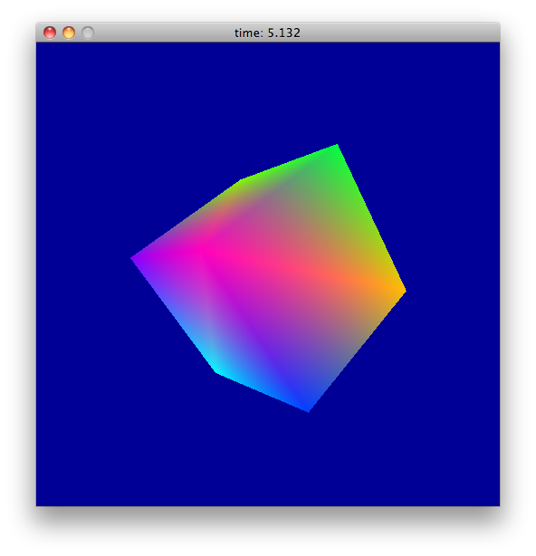

::: article
# Introduction

::: {#tab:libs}
  ---------------------------------------------------------------------------------------
  Lib/DynPort   Description                         Functions   Constants   Struct/Union
  ------------- ---------------------------------- ----------- ----------- --------------
  `GL`          OpenGL                                 336        3254           \-

  `GLU`         OpenGL Utility                         59          155           \-

  `R`           R library                              238         700           27

  `SDL`         Audio/Video/UI abstraction             201         416           34

  `SDL_image`   Pixel format loaders                   35           3            \-

  `SDL_mixer`   Music format loaders and playing       71          27            \-

  `SDL_net`     Network programming                    34           5            3

  `SDL_ttf`     Font format loaders                    38           7            \-

  `cuda`        GPU programming                        387         665           84

  `expat`       XML parsing framework                  65          70            \-

  `glew`        GL extensions                         1857         \-            \-

  `gl3`         OpenGL 3 (strict)                      317         838           1

  `ode`         Rigid Physics Engine                   547         109           11

  `opencl`      GPU programming                        79          263           10

  `stdio`       Standard I/O                           75           3            \-
  ---------------------------------------------------------------------------------------

  : Table 1: Overview of available DynPorts for portable C Libraries
:::

We present an improved Foreign Function Interface (FFI) for R that
significantly reduces the amount of C wrapper code needed to interface
with C. We also introduce a *dynamic* linkage that binds the C interface
of a pre-compiled library (*as a whole*) to an interpreted programming
environment such as R - hence the name *Foreign Library Interface*.
Table [1](#tab:libs) gives a list of the C libraries currently supported
across major R platforms. For each library supported, abstract interface
specifications are declared in a compact platform-neutral text-based
format stored in so-called *DynPort* file on a local repository.

R was choosen as the first language to implement a proof-of-concept
implementation for this approach. This article describes the
[*rdyncall*](https://CRAN.R-project.org/package=rdyncall) package which
implements a toolkit of low-level facilities that can be used as an
alternative FFI to interface with C. It also facilitates direct and
convenient access to common C libraries from R without compilation.

The project was motivated by the fact that high-quality software
solutions implemented in portable C are often not available in
interpreter-based languages such as R. The pool of freely available C
libraries is quite large and represents an invaluable resource for
software development. For example, *OpenGL* [@Board05] is the most
portable and standard interface to accelerated graphics hardware for
developing real-time graphics software. The combination of *OpenGL* with
the *Simple DirectMedia Layer* (SDL) [@SDL] core and extension libraries
offers a foundation framework for developing interactive multimedia
applications that can run on a multitude of platforms.

# Foreign function interfaces

FFIs provide the backbone of a language to interface with foreign code.
Depending on the design of this service, it can largely unburden
developers from writing additional wrapper code. In this section, we
compare the built-in R FFI with that provided by
[*rdyncall*](https://CRAN.R-project.org/package=rdyncall). We use a
simple example that sketches the different work flow paths for making an
R binding to a function from a foreign C library.

## FFI of base R

Suppose that we wish to invoke the C function `sqrt` of the *Standard C
Math* library. The function is declared as follows in C:

``` r
double sqrt(double x);
```

The `.C` function from the base R FFI offers a call gate to C code with
very strict conversion rules, and strong limitations regarding argument-
and return-types: R arguments are passed as C pointers and C return
types are not supported, so only C `void` functions, which are
procedures, can be called. Given these limitations, we are not able to
invoke the foreign `sqrt` function directly; intermediate wrapper code
written in C is needed:

``` r
#include <math.h>
void R_C_sqrt(double * ptr_to_x)
{
  double x = ptr_to_x[0], ans;
  ans = sqrt(x);
  ptr_to_x[0] = ans;
}
```

We assume that the wrapper code is deployed as a shared library in a
package named *testsqrt* which links to the *Standard C Math*
library[^1]. Then we load the *testsqrt* package and call the C wrapper
function directly via `.C`.

``` r
> library(testsqrt)
> .C("R_C_sqrt", 144, PACKAGE="testsqrt")
[[1]]
[1] 12
```

To make `sqrt` available as a public function, an additional R wrapper
layer is needed to carry out type-safety checks:

``` r
sqrtViaC <- function(x)
{
  x <- as.numeric(x) # type(x) should be C double.
  # make sure length > 0: 
  length(x) <- max(1, length(x)) 
  .C("R_C_sqrt", x, PACKAGE="example")[[1]]
}
```

We can conclude that -- in realistic settings -- the built-in FFI of R
almost always needs support by a wrapper layer written in C. The
\"foreign\" in the FFI of *base* is in fact relegated to the C wrapper
layer.

## FFI of rdyncall

::: {#tab:signature}
  --------------------------------------------------------------
  Type          Sign.     Type                   Sign.
  ------------- --------- ---------------------- ---------------
  `void`        `v`       `bool`                 `B`

  `char`        `c`       `unsigned char`        `C`

  `short`       `s`       `unsigned short`       `S`

  `int`         `i`       `unsigned int`         `I`

  `long`        `j`       `unsigned long`        `J`

  `long long`   `l`       `unsigned long long`   `L`

  `float`       `f`       `double`               `d`

  `void*`       `p`       `struct` *name* `*`    `*<`*name*`>`

  *type*`*`     `*`\...   `const char*`          `Z`
  --------------------------------------------------------------

  : Table 2: C/C++ Types and Signatures
:::

[*rdyncall*](https://CRAN.R-project.org/package=rdyncall) provides an
alternative FFI for R that is accessible via the function `.dyncall`. In
contrast to the base R FFI, which uses a C wrapper layer, the `sqrt`
function is invoked dynamically and directly by the interpreter at
run-time. Whereas the *Standard C Math* library was loaded implicitly
via the *testsqrt* package, it now has to be loaded explicitly.

R offers functions to deal with shared libraries at run-time, but the
location has to be specified as an absolute file path, which is
platform-specific. A platform-portable solution is discussed in a
following section on *Portable loading of shared library*. For now, we
assume that the example is done on Mac OS X where the *Standard C Math*
library has the file path `/usr/lib/libm.dylib`:

``` r
> libm <- dyn.load("/usr/lib/libm.dylib")
> sqrtAddr <- libm$sqrt$address
```

We first need to load the R package
[*rdyncall*](https://CRAN.R-project.org/package=rdyncall):

``` r
> library(rdyncall)
```

Finally, we invoke the foreign C function `sqrt` *directly* via
`.dyncall`:

``` r
> .dyncall(sqrtAddr, "d)d", 144)
[1] 12
```

The last call pinpoints the core solution for a direct invocation of
foreign code within R: The first argument specifies the address of the
foreign code, given as an external pointer. The second argument is a
*call signature* that specifies the argument- and return types of the
target C function. This string `"d)d"` specifies that the foreign
function expects a `double` scalar argument and returns a `double`
scalar value in accordance with the C declaration of `sqrt`. Arguments
following the call signature are passed to the foreign function in the
form specified by the *call signature*. In the example we pass `144` as
a C `double` argument type as first argument and receive a C `double`
value converted to an R `numeric`.

::: {#tab:signature_examples}
  ----------------------------------------------------------------------------------
  C function declaration                                     Call signature
  ---------------------------------------------------------- -----------------------
  `void          rsort_with_index(double*,int*,int n)`       `*d*ii)v`

  `SDL_Surface * SDL_SetVideoMode(int,int,int,Uint32_t)`     `iiiI)*<SDL_Surface>`

  `void          glClear(GLfloat,GLfloat,GLfloat,GLfloat)`   `ffff)v`
  ----------------------------------------------------------------------------------

  : Table 3: Examples of C functions and corresponding call signatures
:::

## Call signatures

The introduction of a type descriptor for foreign functions is a key
component that makes the FFI flexible and type-safe. The format of the
call signature has the following pattern:

*argument-types* `')'` *return-type*

The signature can be derived from the C function declaration: Argument
types are specified first, in the direct *left-to-right* order of the
corresponding C function prototyp declaration, and are terminated by the
symbol `')'` followed by a single return type signature.

Almost all fundamental C types are supported and there is no
restriction[^2] regarding the number of arguments supported to issue a
call. Table [2](#tab:signature) gives an overview of supported C types
and the corresponding text encoding; Table [3](#tab:signature_examples)
provides some examples of C functions and call signatures.

A public R function that encapsulates the details of the `sqrt` call is
simply defined by

``` r
> sqrtViaDynCall <- function(...) 
+ .dyncall(sqrtAddr, "d)d", ...)
```

No further guard code is needed here because `.dyncall` has built-in
type checks that are specified by the signature. In contrast to the R
wrapper code using `.C`, no explicit cast of the arguments via
`as.numeric` is required, because automatic coercion rules for
fundamental types are implemented as specified by the call signature.
For example, using the `integer` literal `144L` instead of `double`
works here as well.

``` r
> sqrtViaDyncall(144L)
[1] 12
```

If any incompatibility is detected, such as a wrong number of arguments,
empty atomic vectors or incompatible type mappings, the invocation is
aborted and an error is reported without risking an application crash.

Pointer type arguments, expressed via `’p’`, are handled differently.
The type signature `’p’` indicates that the argument is an address. When
passing R atomic vectors, the C argument value is the *address* of the
*first element* of the vector. External pointers and the `NULL` object
can also be passed as values for pointer type arguments. Automatic
coercion is deliberately not implemented for pointer types. This is to
support C functions that write into memory referenced by *out* pointer
types.

Typed pointers, specified by the prefix `’*’` followed by the signature
of the base type, offer a measure of type-safety for pointer types; if
an R vector is passed and the R atomic type does not match the base
type, the call will be rejected. Typed pointers to C `struct` and
`union` types are also supported; they are briefly described in the
section *Handling of C Types in R*.

In contrast to the R FFI, where the argument conversion is dictated
solely by the R argument type at call-time in a one-way fashion, the
introduction of an additional specification with a call signature gives
several advantages.

-   Almost all possible C functions can be invoked by a single
    interface; no additional C wrapper is required.

-   The built-in type-safety checks enhance stability and significantly
    reduce the need for assertion code.

-   The same call signature works across platforms, given that the C
    function type remains constant.

-   Given that our FFI is implemented in multiple languages (e.g.
    Python, Ruby, Perl, Lua), call signatures represent a universal type
    description for C libraries.

# Package overview

Besides dynamic calling of foreign code, the package provides essential
facilities for interoperability between the R and C programming
languages. An overview of components that make up the package is given
in Figure [1](#fig:pkg_overview).

{#fig:pkg_overview
width="100%" alt="graphic without alt text"}

We already described the `.dyncall` FFI. It is followed by a brief
description of portable loading of shared libraries using `dynfind`,
installation of wrappers via `dynbind`, handling of foreign data types
via `new.struct` and wrapping of R functions as C callbacks via
`new.callback`. Finally the high-level `dynport` interface for accessing
*whole* C libraries is briefly discussed. The technical details at
low-level of some components are described briefly in the section
*Architecture*.

## Portable loading of shared libraries

The *portable* loading of shared libraries across platforms is not
trivial because the file path is different across operating systems.
Referring back to the previous example, to load a particular library in
a portable fashion, one would have to check the platform to locate the C
library.[^3]

Although there is variation among the operating systems, library file
paths and search patterns have common structures. For example, among all
the different locations, prefixes and suffixes, there is a part within a
full library filename that can be taken as a *short library name* or
label.

The function `dynfind` takes a list of short library names to locate a
library using common search heuristics. For example, to load the
*Standard C Math* library, depending on the operating system the library
is either the *Microsoft Visual C Run-Time* DLL labeled `msvcrt` on
Windows or the *Standard C Math* shared library labeled `m` or `c` on
other operating systems.

``` r
> mLib <- dynfind(c("msvcrt","m","c"))
```

`dynfind` also supports more exotic schemes, such as Mac OS X Framework
folders. Depending on the library, it is sometimes enough to have a
single short filename - e.g. `"expat"` for the *Expat* library.

## Wrapping C libraries

Functional R interfaces to foreign code can be defined with small R
wrapper functions, which effectively delegate to `.dyncall`. Each
function interface is parameterized by a target address and a matching
call signature.

``` r
f <- function(...) .dyncall(target,signature,...) 
```

Since an *Application Programming Interface* (API) often consist of
hundreds of functions (see Table [1](#tab:libs)), `dynbind` can create
and install a batch of function wrappers for a library with a single
call by using a *library signature* that consists of concatenated
function names and signatures separated by semicolons.

For example, to install wrappers to the C functions `sqrt`, `sin` and
`cos` from the math library, one could use

``` r
> dynbind( c("msvcrt","m","c"), 
+ "sqrt(d)d;sin(d)d);cos(d)d;" )
```

The function call has the side-effect that three R wrapper functions are
created and stored in an environment that defaults to the global
environment. Let us review the `sin` wrapper (on the 64-bit Version of R
running on Mac OS X 10.6):

``` r
> sin
function (...) 
.dyncall.cdecl(<pointer: 0x7fff81fd13f0>,
 "d)d)", ...)
```

The wrapper directly uses the address of the `sin` symbol from the
*Standard C Math* library. In addition, the wrapper uses
`.dyncall.cdecl`, which is a concrete selector of a particular calling
convention, as outlined below.

## Calling conventions

Calling conventions specify how arguments and return values are passed
across sub-routines and functions at machine-level. This information is
vital for interfacing with the binary interface of C libraries. The
package has support for multiple calling conventions. Calling
conventions are controlled by `.dyncall` via the named argument
`callmode` to specify a non-default calling convention. Most supported
operating systems and platforms only have support for a single
`"default"` calling convention at run-time. An exception to this is the
Microsoft Windows platform on the Intel *i386* processor architecture:
While the default C calling convention on *i386* (excluding Plan9) is
`"default"`, system shared libraries from Microsoft such as
`KERNEL32.DLL`, `USER32.DLL` as well as the *OpenGL* library
`OPENGL32.DLL` use the `"stdcall"` calling convention. Only on this
platform does the `callmode` argument have an effect. All other
platforms currently ignore this argument.

## Handling of C types in R {#aggregate}

C APIs often make use of high-level C `struct` and `union` types for
exchanging information. Thus, to make interoperability work at that
level the handling of C data types is addressed by the package.

To illustrate this concept we consider the following example: A
user-interface library has a function to set the 2D coordinates and
dimension of a graphical output window. The coordinates are specified
using a C `struct Rect` data type and the C function receives a pointer
to that object:

``` r
void setWindowRect(struct Rect *pRect);
```

The structure type is defined as follows:

``` r
struct Rect {
  short          x, y;
  unsigned short w, h;
};
```

Before we can issue a call, we have to allocate an object of that size
and initialize the fields with values encoded in C types that are not
part of the supported set of R data types. The framework provides R
helper functions and objects to deal with C data types. Type information
objects can be created with a description of the C structure type.
First, we create a type information object in R for the `struct Rect` C
data type with the function `parseStructInfos` using a *structure type
signature*.

``` r
> parseStructInfos("Rect{ssSS}x y w h;")
```

After registration, an R object named `Rect` is installed that contains
C type information that corresponds to `struct Rect`. The format of a
*structure type signature* has the following pattern:

*Struct-name* `'{'` *Field-types* `'}'` *Field-names* `';'`

*Field-types* use the same type signature encoding as that of *call
signatures* for argument and return types (Table [2](#tab:signature)).
*Field-names* consist of a list of white-space separated names, that
label each field component left to right.

An instance of a C type can be allocated via `new.struct`:

``` r
> r <- new.struct(Rect)
```

Finally, the extraction (`'$'`, `'['`) and replacement(`'$<-'`, `'[<-'`)
operators can be used to access structure fields symbolically. During
value transfer between R and C, automatic conversion of values with
respect to the underlying C field type takes place.

``` r
> r$x <- -10 ; r$y <- -20 ; r$w <- 40 ; r$h <- 30
```

In this example, R `numeric` values are converted on the fly to `signed`
and `unsigned short` integers (usually 16-bit values). On printing `r` a
detailed picture of the data object is given:

``` r
> r
struct Rect {
 x: -10 
 y: -20 
 w:  40 
 h:  30 
}
```

At low-level, one can see that `r` is stored as an R `raw` vector
object:

``` r
> r[]
[1] f6 ff ec ff 28 00 1e 00
attr(,"struct")
[1] "Rect"
```

To follow the example, we issue a foreign function call to `setRect` via
`.dyncall` and pass in the `r` object, assuming the library is loaded
and the symbol is resolved and stored in an external pointer object
named `setWindowRectAddr`:

``` r
> .dyncall( setWindowRectAddr, "*<Rect>)v", r)
```

We make use of a typed pointer expression `’*<Rect>’` instead of the
untyped pointer signature `’p’`, which would also work but does not
prevent users from passing other objects that do not reference a
`struct Rect` data object. Typed pointer expressions increase
type-safety and use the pattern `'*<`*Type-Name*`>'`. The invocation
will be rejected if the argument passed in is not of C type `Rect`. As
`r` is tagged with an attribute `struct` that refers to `Rect`, the call
will be issued. Typed pointers can also occur as return types that
permit the manipulation of returned objects in the same symbolic manner
as above.

C `union` types are supported as well but use the `parseUnionInfos`
function instead for registration, and a slightly different signature
format:

::: center
*Union-name* `'`'| *Field-types* `'}'` *Field-names* `';'`
:::

The underlying low-level C type read and write operations and
conversions from R data types are performed by the functions `.pack` and
`.unpack`. These can be used for various low-level operations as well,
such as dereferencing of pointer to pointers.

R objects such as external pointers and atomic raw, integer and numeric
vectors can be used as C struct/union types via the attribute `struct`.
To *cast* a type in the style of C, one can use `as.struct`.

## Wrapping R functions as C callbacks

Some C libraries, such as user-interface toolkits and I/O processing
frameworks, use *callbacks* as part of their interface to enable
registration and activation of user-supplied event handlers. A callback
is a user-defined function that has a library-defined function type.
Callbacks are usually registered via a registration function offered by
the library interface and are activated later from within a library
run-time context.

[*rdyncall*](https://CRAN.R-project.org/package=rdyncall) has support
for wrapping ordinary R functions as C callbacks via the function
`new.callback`. Callback wrappers are defined by a *callback signature*
and the user-supplied R function to be wrapped. *Callback signatures*
look very similar to *call signatures* and should match the functional
type of the underlying C callback. `new.callback` returns an external
pointer that can be used as a low-level function pointer for the
registration as a C callback. See Section *Parsing XML using Expat*
below for applications of `new.callback`.

## Foreign library interface

At the highest level,
[*rdyncall*](https://CRAN.R-project.org/package=rdyncall) provides the
front-end function `dynport` to dynamically set up an interface to a C
Application Programming Interface. This includes loading of the
corresponding shared C library and resolving of symbols. During the
binding process, a new R name space [@RNameSpace] will be populated with
thin R wrapper objects that represent abstractions to C counterparts
such as functions, pointers-to-functions, type-information objects for C
struct and union types and symbolic constant equivalents of C enums and
macro definitions. The mechanism works across platforms; as long as the
corresponding shared libraries of a *DynPort* have been installed in a
system standard location on the host.

An initial repository of *DynPorts* is available in the package that
provides bindings for several popular C APIs; see Table [1](#tab:libs)
for available bindings.

# Sample applications

We give examples that demonstrate the direct usage of C APIs from within
R through the [*rdyncall*](https://CRAN.R-project.org/package=rdyncall)
package. The R interface to C libraries looks very similar to the actual
C API. For details on the usage of a particular C library, the
programming manuals and documentation of the libraries should be
consulted.

Before loading R bindings via `dynport`, the shared library should have
been installed onto the system. Currently this is to be done manually
and the installation method depends on the target operating system.
While *OpenGL* and *Expat* is often pre-installed on typical
desktop-systems, *SDL* usually has to be installed explicitly which is
described in the package; see `?’rdyncall-demos’` for details.

## OpenGL programming in R

{#fig:demo_SDL width="100%" alt="graphic without alt text"}

In the first example, we make use of the *Simple DirectMedia Layer*
library (*SDL*) [@Pendleton:2003:GPS] and the *Open Graphics Library*
(*OpenGL*) [@Board05] to implement a portable multimedia application
skeleton in R.

We first need to load bindings to SDL and OpenGL via `dynport`:

``` r
> dynport(SDL)
> dynport(GL)
```

Now we initialize the SDL library, e.g. we initialize the video
subsystem, and open a $640 x 480$ window surface in 32-bit color depths
with support for OpenGL rendering:

``` r
> SDL_Init(SDL_INIT_VIDEO)
> surface <- SDL_SetVideoMode(640,480,32,SDL_OPENGL)
```

Next, we implement the application loop which updates the display
repeatedly and processes the event queue until a *quit* request is
issued by the user via the window close button.

``` r
> mainloop <- function()
{
  ev <- new.struct(SDL_Event)
  quit <- FALSE
  while(!quit) {
    draw()
    while(SDL_PollEvent(ev)) {
      if (ev$type == SDL_QUIT) {
        quit <- TRUE
      }
    }
  }
}
```

SDL event processing is implemented by collecting events that occur in a
queue. Typical SDL applications poll the event queue once per update
frame by calling `SDL_PollEvent` with a pointer to a user-allocated
buffer of C type `union SDL_Event`. Event records have a common type
identifier which is set to `SDL_QUIT` when a quit event has occurred,
e.g. when users press a close button on a window.

Next we implement our `draw` function making use of the OpenGL API. We
clear the background with a blue color and draw a light-green rectangle.

``` r
> draw <- function()
{
  glClearColor(0,0,1,0)
  glClear(GL_COLOR_BUFFER_BIT)
  glColor3f(0.5,1,0.5)
  glRectf(-0.5,-0.5,0.5,0.5)
  SDL_GL_SwapBuffers()
}
```

Now we can run the application mainloop.

``` r
> mainloop()
```

To stop the application, we press the close button of the window. A
similar example is also available via `demo(SDL)`. Here the `draw`
function displays a rotating 3D cube displayed in Figure
[2](#fig:demo_SDL).

{#fig:demo_randomfield
width="100%" alt="graphic without alt text"}

`demo(randomfield)` gives a slightly more scientific application of
OpenGL and R: Random fields of 512x512 size are generated via blending
of 5000 texture mapped 2D gaussian kernels. The counter in the window
title bar gives the number of matrices generated per second (see Figure
[3](#fig:demo_randomfield)). When clicking on the animation window, the
current frame and matrix is passed to R and plotted. While several
dozens of matrices are computed and drawn per second using OpenGL, it
takes several seconds to plot a single matrix in R using `image()`.

## Parsing XML using Expat

In the second example, we use the *Expat* XML Parser library
[@www:expat; @Kim:2001:TSJ] to implement a stream-oriented XML parser
suitable for very large documents. In Expat, custom XML parsers are
implemented by defining functions that are registered as callbacks to be
invoked on events that occur during parsing, such as the start and end
of XML tags. In our second example, we create a simple parser skeleton
that prints the start and end tag names.

First we load R bindings for Expat via `dynport`.

``` r
> dynport(expat)
```

Next we create an abstract parser object via the C function
`XML_ParserCreate` that receives one argument of type C string to
specify a desired character encoding that overrides the document
encoding declaration. We want to pass a null pointer (`NULL`) here. In
the `.dyncall` FFI C null pointer values for pointer types are expressed
via the R `NULL` value:

``` r
> p <- XML_ParserCreate(NULL)
```

The C interface for registering start- and end-tag event handler
callbacks is given below:

``` r
/* Language C, from file expat.h: */
typedef void (*XML_StartElementHandler)
  (void *userData, const XML_Char *name, 
   const XML_Char **atts);
typedef void (*XML_EndElementHandler)
  (void *userData, const XML_Char *name);
void XML_SetElementHandler(XML_Parser parser, 
  XML_StartElementHandler start, 
  XML_EndElementHandler end);
```

We implement the callbacks as R functions that print the event and tag
name. They are wrapped as C callback pointers via `new.callback` using a
matching *callback signature*. The second argument `name` of type C
string in both callbacks, `XML_StartElementHandler` and
`XML_EndElementHandler`, is of primary interest in this example; this
argument passes over the XML tag name. C strings are handled in a
special way by the `.dyncall` FFI because they have to be copied as R
`character` objects. The special type signature `’Z’` is used to denote
a C string type. The other arguments are simply denoted as untyped
pointers using `’p’`:

``` r
> start <- new.callback("pZp)v", 
  function(ignored1,tag,ignored2) 
    cat("Start tag:", tag, "\n")
)
> end <- new.callback("pZ)v", 
  function(ignored,tag) 
    cat("Stop tag:", tag, "\n")
)
> XML_SetElementHandler(p, start, end)
```

To test the parser we create a sample document stored in a `character`
object named `text` and pass it to the parse function `XML_Parse`:

``` r
> text <- "<hello> <world> </world> </hello>"
> XML_Parse( p, text, nchar(text), 1)
```

The resulting output is

``` r
Start tag: hello
Start tag: world
End tag: world
End tag: hello
```

Expat supports processing of very large XML documents in a chunk-based
manner by calling `XML_Parse` several times, where the last argument is
used as indicator for the final chunk of the document.

# Architecture

The core implementation of the FFI, callback wrapping and loading of
code is based on small C libraries of the *DynCall* project [@dyncall].

The implementation of the FFI is based on the
[*dyncall*](https://CRAN.R-project.org/package=dyncall) C library, which
provides an abstraction for making arbitrary machine-level calls
offering a universal C interface for scripting language interpreters. It
has support for almost all fundamental C argument/return types[^4] and
multiple calling conventions, and is open for extension to other
platforms and binary standards. Generic call implementations for the
following processor architectures are supported: Intel i386 32-bit, AMD
64-bit, PowerPC 32-bit, ARM (including Thumb extension), MIPS 32/64-bit
and SPARC 32/64-bit including support for several platform-, processor-
and compiler-specific calling conventions.

The [*dyncallback*](https://CRAN.R-project.org/package=dyncallback) C
library implements generic callback handling. Callback handlers receive
calls from C and they forward the call, including conversion of
arguments, to a function of a scripting-language interpreter. A subset
of architectures from the above is currently supported here: i386, AMD64
and ARM, and partial support for PowerPC 32-bit on Mac OS X/Darwin.

Besides the processor architecture, the libraries support various
operating systems such as Linux, Mac OS X, Windows, the BSD family,
Solaris, Haiku, Minix and Plan9. Support for embedded platforms such as
Playstation Portable, Nintendo DS and iOS is available as well. FFI
implementations for other languages such as Python
[@vanRossum:2005:PLR], Lua [@{SPE::IerusalimschyFF1996}] and Ruby
[@Flanagan-Matsumoto08] are available from the *DynCall* project source
repository.

The source tree supports various build tools such as gcc, msvc, SunPro,
pcc, llvm and supports several make tools (BSD,C,GNU,N,Sun). A common
abstraction layer for assembler dialects helps to develop
cross-operating system call kernel. Due to the generic implementation
and simple design, the libraries are quite small (the dyncall library
for Mac OS X/AMD64 is 24 kb).

To test stability of the libraries, a suite of testing frameworks is
available, including test-case generators with support for structured or
random case studies and for testing extreme scenarios with large number
of arguments. Prior to each release, the libraries and tests are built
for a large set of architectures on
[*DynOS*](https://CRAN.R-project.org/package=DynOS) [@dynos]; a
batch-build system using CPU emulators such as
[*QEmu*](https://CRAN.R-project.org/package=QEmu) [@qemu] and
[*GXEmul*](https://CRAN.R-project.org/package=GXEmul) [@gxemul], and
various operating system images to test the release candidates and to
create pre-built binary releases of the library.

## Creation of DynPort files

The creation of *DynPort* files from C header files is briefly described
next. A tool chain, comprising of freely available components, is
applied once on a build machine as depicted in Figure
[4](#fig:gen_dynport).

{#fig:gen_dynport width="100%" alt="graphic without alt text"}

At first a main source file references the C header files of the library
that should be made accessable via dynport. In a preprocessing phase the
*GNU C Macro Processor* is used to process all `#include` statements
using standard system search paths to create a concatenated *All-In-One*
source file. *GCC-XML* [@gccxml], a modified version of the GNU C
compiler, transforms C header declarations to XML. The XML is further
transformed to the final type signature format using
[*xslproc*](https://CRAN.R-project.org/package=xslproc) [@libxslt], a
XSLT [@Clark:01:XTV] processor, and a custom XSL stylesheet that has
been implemented for the actual transformation from GCC-XML to the type
signature text format.

C Macro `#define` statements are handled separately by a custom C
Preprocessor implemented in C++ using the *boost wave* library
[@boostwave]. An optional filter stage is used to include only elements
with a certain pattern, such as a common prefix usually found in many
libraries, e.g. '`SDL_`'. In a last step, the various fragments are
assembled into a single text-file that represents the *DynPort* file.

# Limitations

During the creation of *DynPort* files, we encountered some cases
(mainly for the SDL library) where we had to comment out some symbolic
assignments (derived from C macro definitions) manually. These could not
be converted as-is into valid R assignments because they consist of
complex C expressions such as bit-shift operations. One could solve this
problem by integrating a C interpreter within the tool-chain that
deduces the appropriate type and value information from the replacement
part of each C macro definitions; definitions with incomplete type could
be rejected and constant values could be stored in a language-neutral
encoding.

In order to use a single *DynPort* for a given C library across multiple
platforms, its interface must be constant across platforms. *DynPort*
does not support the conditional statements of the C preprocessor. Thus
interfaces that use different types for arguments or structure fields
depending on the architecture cannot be supported in a universal manner.
For example, the *Objective-C Run-Time* C library of Mac OS X uses a
different number of fields within certain `struct` data types depending
on whether the architecture is *i386* or alternative *AMD64* in which
case padding fields are inserted in the middle of the structure. We are
aware of this problem although we have not encountered a conflict with
the given palette of C libraries available via *DynPorts* to R. A
possible work around for such cases would be to offer separate
*DynPorts* for different architectures.

[*dyncall*](https://CRAN.R-project.org/package=dyncall) and
[*dyncallback*](https://CRAN.R-project.org/package=dyncallback)
currently lack support for handling `long double`, `struct` and `union`
argument and return value types and architecture-specific vector types.
Work is in progress to overcome this limitation. The middleware
[*BridJ*](https://CRAN.R-project.org/package=BridJ) [@bridj] for the
Java VM and C/C++ libraries, which uses
[*dyncall*](https://CRAN.R-project.org/package=dyncall), provides
support for passing `struct` value types for a number of i386 and AMD64
platforms.

R character strings have a maximum size that can limit the number of
library functions per `dynbind` function call. An improved *DynPort*
file format and parser are being developed and are already available for
[*luadyncall*](https://CRAN.R-project.org/package=luadyncall).

This version of *DynPort* does not capture the full range of the C type
system. For example array and bit-field types are not supported; the
pointer-to-function type in an argument list can only be specified using
the void pointer `’*v’` or `’p’` instead of this (more informative)
explicit type. An extended version of *DynPort*, that overcomes these
inconveniences and that improves type safety, is being developed.

Certain restrictions apply when
[*rdyncall*](https://CRAN.R-project.org/package=rdyncall) is used to
work with C libraries. These arise from limitations in R. For example
the handling of C `float` pointers/arrays and `char` pointer-to-pointer
types are not implemented in R. The functions `.unpack` and `.pack` are
powerful helper functions designed to overcome these and some other
restrictions. Additional helper functions are included, such as
`floatraw` and `floatraw2numeric` that translate numeric R vectors to C
`float` arrays and vice versa.

The portable loading of shared libraries via `dynfind` might require
fine-tuning the list of short names when using less common R platforms
such as BSDs and Solaris.

# Related work

Several dynamic languages offer a flexible FFI, e.g. *ctypes* [@ctypes]
for Python, *alien* [@alien] for Lua,
[*Rffi*](https://CRAN.R-project.org/package=Rffi) [@RFFI] for R, *CFFI*
[@CFFI] for Common LISP and the *FFI* module for Perl [@PerlFFI] and
Ruby [@RubyFFI]. These all facilitate similar services such as foreign
function calls and handling of foreign data. With the exception of
*Rffi*, these also support wrapping of scripting functions as C
callbacks. In most cases, the type information is specified in the
grammar of the dynamic language. An exception to this is the *Perl FFI*
that uses text-based type signatures similar to *rdyncall*.

*ctypeslib* [@ctypeslib] is an extension to *ctypes* that comes closest
to the idea of *DynPorts* in which Python *ctypes* statements are
automatically generated from C library header files, also using
*GCC-XML*. In contrast, the *DynPort* framework contributes a *compact
text-based* type information format that is also used as the main
user-interface for various tasks in *rdyncall*. This software design is
applicable across languages and thus type information can be *shared*
across platforms and languages at the same time.

Specific alternatives to *dyncall* include *libffi* [@libffi] and
*ffcall* [@ffcall]. These are mature FFI libraries that use a
*data-driven* C interface and have support for many platforms. Although
not as popular as the first two, the *C/Invoke* library [@cinvoke] also
offers a similar service with bindings to Lua, Java and Kite. The
*dyncall* library offers a *functional* C interface (inspired by the
OpenGL API). It includes a comprehensive test suite and detailed
documentation of calling conventions on a variety of platforms and
compilers. As the framework was developed \"de novo\" we were free to
introduce our own strategy to support open as well as commercial and
embedded platforms. For example, the i386 Assembly (except for Plan9) is
implemented in a common abstract syntax that translates to GNU and
Microsoft Assembler. This makes sense here, because i386-based operating
systems use a common C calling convention which we address using a
*single* Assembly source. A by-product of this feature is that *dyncall*
enables the user to call operating system foreign code on some
architectures.

In contrast to the *dynamic* *zero-compilation* approach of *ctypeslib*
and *rdyncall*, the majority of language bindings to libraries use a
*compiled* approach in which code (handwritten or auto-generated) is
compiled for each platform. *SWIG* [@Beazley:2003:ASS:860016.860018] is
a development tool for the automatic generation of language bindings.
The user specifies the interface for a particular library in a C-like
language and then chooses among the several supported languages
(including R) to generate C sources that implement the binding for that
particular library/language combination. *RGtk2*
[@oai:doaj-articles:90f0897e2030d75afdb725c820796db6] offers R bindings
for the *GTK+* GUI framework consisting of R and C code. These are
produced by a custom code generator to offer carefully conceived
mappings to the object-oriented *GObject* framework. The generated code
includes features such as ownership management of returned objects using
human annotations. While custom bindings offer the ability to take into
account the features of a particular library and framework to offer very
user-friendly mapping schemes, *rdyncall* aims to offer convenient
access to C libraries in general but it requires users to know the
details of the particular interface of a C library and the R run-time
environment.

# Summary and Outlook

This paper introduces the *rdyncall* package[^5] that contributes an
improved Foreign Function Interface for R. The FFI facilitates *direct*
invocation of foreign functions *without* the need to compile wrappers
in C. The FFI offers a dynamic cross-platform linkage framework to wrap
and access *whole* C interfaces of native libraries from R. Instead of
*compiling* bindings for every *library/language* combination, R
bindings of a library are created dynamically at run-time in a
data-driven manner via *DynPort* files, a cross-platform universal type
information format. C libraries are made accessible in R as though they
were extension packages and the R interface looks very similar to that
of C. This enables system-level programming in R and brings a new wave
of possibilities to R developers such as direct access to OpenGL across
platforms as illustrated in the example. An initial repository of
*DynPort*s for standard cross-platform portable C libraries comes with
the package. Work is in progress for implementation of callback support
on architectures already supported by the *dyncall* C library. The
handling of foreign data types, which is currently implemented in R and
C, is planned to be reimplemented as a C library and part of the
*DynCall* project.

The *DynPort* facility in *rdyncall* consitutes an initial step in
building up an infrastructure between scripting languages and C
libraries. Analogous to the way in which R users enjoy quick access to
the large pool of R software managed by CRAN, we envision an archive
network in which C library developers can distribute their work across
languages, users could then get quick access to the pool of C libraries
from within scripting languages via automatic installation of
precompiled components and using universal type information for
cross-platform and cross-language dynamic bindings.

\
:::

[^1]: We omit here the details such as registering C functions which is
    described in detail in the R Manual '*Writing R Extensions*'
    [@RExt].

[^2]: The maximum number of arguments is limited by the amount of memory
    required for prebuffering a single call. It is currently fixed to 4
    kilobyte (approx. 512-1024 arguments).

[^3]: Possible C math library names are `libm.so` and `MSVCRT.DLL` in
    locations such as `/lib`, `/usr/lib`, `/lib64`, `/usr/lib64`,
    `C:\WINDOWS\SYSTEM32` etc..

[^4]: Passing of `long double`, `struct` and `union` argument/return C
    value types are currently work in progress.

[^5]: Version 0.7.4 on CRAN as of this writing.
