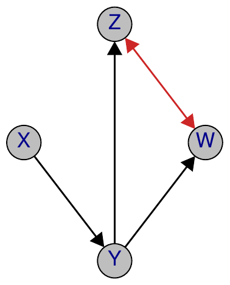

::: article
# Introduction and background

*Graphical Markov models* have become a part of the mainstream of
statistical theory and application in recent years. These models use
graphs to represent conditional independencies among sets of random
variables. Nodes of the graph correspond to random variables and edges
to some type of conditional dependency.

## Directed acyclic graphs

In the literature on graphical models the two most used classes of
graphs are directed acyclic graphs (DAGs) and undirected graphs. DAGs
have proven useful, among other things, to specify the data generating
processes when the variables satisfy an underlying partial ordering.

For instance, suppose that we have four observed variables: $Y$, the
ratio of systolic to diastolic blood pressure and $X$ the diastolic
blood pressure, both on a log scale; $Z$, the body mass and $W$, the
age, and that a possible generating process is the following linear
recursive regression model $$\begin{aligned}
Y &= \gamma_{YZ} Z + \gamma_{YU} U + \epsilon_Y\\
X &= \gamma_{XW} W + \gamma_{XU} U + \epsilon_X\\
Z &= \gamma_{ZV} W + \epsilon_Z\\
W &= \epsilon_W; \; U = \epsilon_U,
\end{aligned}$$ where all the variables are mean-centered and the
$\epsilon$s are zero mean, mutually independent Gaussian random errors.
In this model we assume that there exists a genetic factor $U$
influencing the ratio and levels of blood pressure.

This model can be represented by the DAG in Figure [1](#dags)(a) with
nodes associated with the variables and edges indicating the
dependencies represented by the regression coefficients ($\gamma$s).

<figure id="dags">
<p></p>
<figcaption>Figure 1: (a) A DAG. (b) A regression chain
graph.</figcaption>
</figure>

From the graph it is seen, for instance, that the ratio of the two blood
pressures ($Y$) is directly influenced by body mass ($Z$) but not by age
($W$). Thus a consequence of the model is that the variables must
satisfy a set of conditional independencies: for example, the ratio of
the blood pressure is independent of the age given the body mass,
written as $Y   \perp
\perp W | Z$.

A remarkable result is that the independencies can be deduced from the
graph alone, without reference to the equations, by using a criterion
called $d$-separation. In fact, in the graph of Figure [1](#dags)(a),
the nodes $Y$ and $W$ are $d$-separated given $Z$. This can be checked
using special graph algorithms included, for example, in packages
[*gRain*](https://CRAN.R-project.org/package=gRain) [@gRain] and
[*ggm*](https://CRAN.R-project.org/package=ggm) [@ggm]. For more details
on DAG models and their implementation in R see the extensive discussion
in @hoi12.

## Hidden variables and induced graphs

The model has four observed variables but includes an unobserved
variable, that is, the genetic factor $U$. When $U$ is hidden the model
for the observed variables becomes $$\begin{aligned}
Y &= \gamma_{YZ} Z + \eta_Y \\
X &= \gamma_{XW} W + \eta_X \\
Z &= \gamma_{ZV} W + \epsilon_Z\\
W &= \epsilon_W;
\end{aligned}$$ with two correlated errors
$\eta_{Y} =  \gamma_{YU} U + \epsilon_Y$ and
$\eta_X =  \gamma_{XU} U + \epsilon_X$, such that
$\mathrm{cov}(\eta_Y, \eta_X) = \omega_{YX}$. As a consequence the model
is still a recursive model and the parameters have a regression
parameter interpretation, but contain some correlated residuals.

The induced model is said to be obtained after marginalisation over $U$.
In this model some of the original independencies are lost, but we can
observe the implied independencies $Y  \perp
\perp W|Z$ and $X   \perp
\perp Z | W$. Also it can be shown that it is impossible to represent
such independencies in a DAG model defined for the four observed
variables. Therefore, we say that DAG models are not stable under
marginalisation.

A mixed graph with arrows and arcs, as shown in Figure [1](#dags)(b),
can be used to represent the induced independence model after
marginalisation over $U$. In this representation, beside the arrows,
represented by the $\gamma$s, we have the arc $Y  \prec
\!\!\!\!\!\frac{}{}
\!\!\!\!\!
\succ\! X$ associated with the (partial) correlation $\omega_{YX}$.

The graph of Figure [1](#dags)(b) belongs to a class of models called
regression chain graph models. This class generalises the recursive
generating process of DAGs by permitting joint responses, coupled in the
graph by arcs, and thus appears to be an essential extension for
applications; see @cox96. Regression chain graphs can be used as a
conceptual framework for understanding multivariate dependencies, for
example in longitudinal studies. The variables are arranged in a
sequence of blocks, such that (a) all variables in one block are of
equal standing and any dependence between them is represented by an arc,
and (b) all variables in one block are responses to variables in all
blocks to their right, so that any dependencies between them are
directed, represented by an arrow pointing from right to left. The graph
shows how the data analysis can be broken down into a series of
regressions and informs about which variables should or should not be
controlled for in each regression.

## More general induced graphs

The class of regression chain graphs is not, however, stable under
marginalisation. For instance, suppose that the generating process for
the blood pressure data is defined by the more general regression chain
graph of Figure [2](#dag2)(a) where $L$ is a further variable
representing a common hidden cause of systolic blood pressure and body
mass.

Then, after marginalisation over $L$, the model can still be described
by a linear system of equations with correlated residuals and can be
represented by the mixed graph shown in Figure [2](#dag2)(b). But the
resulting graph is not a DAG nor a regression chain graph because it
contains the pair of variables $(Y, Z)$ coupled by both a directed edge
and a path composed by bi-directed arcs. Thus $Y$ cannot be interpreted
as a pure response to $Z$ and in addition $Y$ and $Z$ are not two joint
responses.

<figure id="dag2">
<p></p>
<figcaption>Figure 2: (a) A regression chain graph model; (b) the mixed
graph obtained after marginalisation over L, which is not a regression
chain graph.</figcaption>
</figure>

## Stable mixed graphs

The previous illustrations show that when there are unobserved
variables, DAG or regression chain graph models are no longer
appropriate. The discussion could be extended to situations where there
are some selection variables that are hidden variables that are
conditioned on.

This motivates the introduction of a more general class of mixed graphs,
which contains three types of edges, denoted by lines, $\, \frac{\;}{}$,
arrows, $\frac{
}{
}\!\!\!\!\! \succ \!$, and arcs (bi-directed arrows), $\prec
\!\!\!\!\!\frac{}{}
\!\!\!\!\!
\succ\!$. In the case of regression models, explained above, lines
generally link pairs of joint context (explanatory) variables and arcs
generally link pairs of joint response variables.

There are at least three known classes of mixed graphs without self
loops that remain in the same class, i.e. that are stable under
marginalisation and conditioning. The largest one is that of ribbonless
graphs (RGs) [@sad112], defined as a modification of MC-graphs [@kos02].
Then, there is the subclass of summary graphs (SGs) [@wer11], and
finally the smallest class of the ancestral graphs (AGs) [@ric02].

## Four tasks of the current paper

In this paper, we focus on the implementation of four important tasks
performed on the class of mixed graphs in R:

1.  Generating different types of stable mixed graphs after
    marginalisation and conditioning.

2.  Verifying whether an independency of the form $Y  \perp
    \perp W|Z$ holds by using a separation criterion called
    $m$-separation.

3.  Generating a graph that induces the same independence structure as
    an input mixed graph such that the generated graph is maximal,
    i.e. each missing edge of the generated graph implies at least an
    independence statement.

4.  Verifying whether two graphs are Markov equivalent, i.e. they induce
    the same independencies, and whether, given a graph of a specific
    type, there is a graph of a different type that is Markov equivalent
    to it.

## Package *ggm*

The tasks above are illustrated by using a set of new functions
introduced into the R package
[*ggm*](https://CRAN.R-project.org/package=ggm) [@ggm]. In the next
section we give the details of how general mixed graphs are defined. The
following four sections deal with the four tasks respectively. For each
task we give a brief introduction at the beginning of its corresponding
section.

Some of the functions generalise previous contributions of *ggm*
discussed in @mar06. The *ggm* package has been improved and it is now
more integrated with other contributed packages related to graph theory,
such as *graph* [@graph],
[*igraph*](https://CRAN.R-project.org/package=igraph) [@csa09], and
[*gRbase*](https://CRAN.R-project.org/package=gRbase) [@DetHo05], which
are now required for representing and plotting graphs. Specifically, in
addition to adjacency matrices, all the functions in the package now
accept `graphNEL` and `igraph` objects as input, as well as a new
character string representation. A more detailed list of available
packages for graphical models can be found at the CRAN Task View
*gRaphical Models in R* at
<http://cran.r-project.org/web/views/gR.html>.

# Defining mixed graphs in R

For a comprehensive discussion on the ways of defining a directed
acyclic graph, see @hoi12. A mixed graph is a more general graph type
with at most three types of edge: directed, undirected and bi-directed,
with possibly multiple edges of different types connecting two nodes. In
*ggm* we provide some special tools for mixed graphs that are not
present in other packages. Here we briefly illustrate some methods to
define mixed graphs and we plot them with a new function, `plotGraph`,
which uses a Tk GUI for basic interactive graph manipulation.

The first method is based on a generalisation of the adjacency matrix.
The second uses a descriptive vector and is easy to use for small
graphs. The third uses a special function `makeMG` that allows the
directed, undirected, and bi-directed components of a mixed graph to be
combined.

## Adjacency matrices for mixed graphs

In the adjacency matrix of a mixed graph we code the three different
edges with a binary indicator: 1 for directed, 10 for undirected and 100
for bi-directed edges. When there are multiple edges the codes are
added.

Thus the *adjacency matrix of a mixed graph* $H$ with node set $N$ and
edge set $F$ is an $|N|\times|N|$ matrix obtained as $A=B+S+W$ by adding
three matrices $B = (b_{ij})$, $S = (s_{ij})$ and $W = (w_{ij})$ defined
by $$\begin{aligned}
b_{ij} &=
  \begin{cases}
    1, & \text{ if and only if } i\frac{
}{
}\!\!\!\!\! \succ \! j \text{ in } H; \\
    0, & \text{otherwise.}\\
  \end{cases}\\
s_{ij}=s_{ji}&=
  \begin{cases}
    10, & \text{if and only if } i\, \frac{\;}{}j \text{ in } H; \\
    0, & \text{otherwise.}
  \end{cases}\\
w_{ij}=w_{ji}&=
  \begin{cases}
    100, & \text{if and only if } i \prec
\!\!\!\!\!\frac{}{}
\!\!\!\!\!
\succ\! j \text{ in } H; \\
    0, & \text{otherwise.}
  \end{cases}
\end{aligned}$$ Notice that because of the symmetric nature of lines and
arcs $S$ and $W$ are symmetric, whereas $B$ is not necessarily
symmetric.

For instance consider the following general mixed graph.:

{width="45.0%" alt="graphic without alt text"}

Notice that this graph is not of much interest per se, because it is not
a stable graph, but it is introduced just to illustrate the structure of
the adjacency matrix.

This graph can be defined by the commands

``` r
> mg <- matrix(c(  0, 101,   0,   0, 110,
                 100,   0, 100,   0,   1,
                   0, 110,   0,   1,   0,
                   0,   0,   1,   0, 100,
                 110,   0,   0, 100,   0),
               5, 5, byrow = TRUE)
> N <- c("X","Y","Z","W","Q")
> dimnames(mg) <- list(N, N)
> mg
```

``` r
    X   Y   Z   W   Q
X   0 101   0   0 110
Y 100   0 100   0   1
Z   0 110   0   1   0
W   0   0   1   0 100
Q 110   0   0 100   0
```

and plotted with `plotGraph(mg)`.

## Defining mixed graphs by using vectors

A more convenient way of defining small mixed graphs is based on a
simple vector coding as follows. The graph is defined by a character
vector of length $3f$, where $f = |F|$ is the number of edges, and the
vector contains a sequence of triples
$\langle$`type, label1, label2`$\rangle$, where the `type` is the edge
type and `label1` and `label2` are the labels of the two nodes. The edge
type accepts `"a"` for a directed arrow , `"b"` for an arc and `"l"` for
a line. Notice that isolated nodes may not be created by this method.
For example, the vector representation of the previous mixed graph is

``` r
> mgv <- c("b","X","Y","a","X","Y","l","X","Q",
           "b","Q","X","a","Y","Q","b","Y","Z",
           "a","Z","W","a","W","Z","b","W","Q")
```

Once again as in the DAG case we can use `plotGraph(mgv)` to plot the
defined graph.

## Mixed graph using the function `makeMG`

Finally the adjacency matrix of a mixed graph may be built up with the
function `makeMG`. This function requires three arguments `dg`, `ug` and
`bg`, corresponding respectively to the three adjacency matrices $B$,
$S$ and $W$ composing the mixed graph. These may also be obtained by the
constructor functions `DG` and `UG` of *ggm* for directed and undirected
graphs respectively. Thus for the previous mixed graph we can issue the
command

``` r
> mg <- makeMG(dg = DG(Y ~ X, Z ~ W, W ~ Z),
               ug = UG(~ X*Q),
               bg = UG(~ Y*X + X*Q + Q*W + Y*Z))
```

obtaining the same adjacency matrix (up to a permutation).

# Generating stable mixed graphs

There are four general classes of stable mixed graphs.

The more general class is that of ribbonless graphs: these are mixed
graphs without a specific set of subgraphs called ribbons. Figure
[3](#rib) below shows two examples of ribbons. The exact definition of
ribbons is given in @sad112.

<figure id="rib">
<p><br />
</p>
<figcaption>Figure 3: Two commonly seen ribbons \langle
h,i,j\rangle.</figcaption>
</figure>

The lack of ribbons ensures that, for any RG, there is a DAG whose
independence structure, i.e. the set of all conditional independence
statements that it induces after marginalisation over, and conditioning
on, two disjoint subsets of its node set can be represented by the given
RG. This is essential, as it shows that the independence structures
corresponding to RGs are probabilistic, that is, there exists a
probability distribution $P$ that is faithful with respect to any RG,
i.e. for random vectors $X_A$, $X_B$, and $X_C$ with probability
distribution $P$, $X_A \perp \perp X_B\,|\,X_C$ if and only if
$\langle A,B\,|\,C\rangle$ is in the induced independence structure by
the graph. This probability distribution is the marginal and conditional
of a probability distribution that is faithful to the generating DAG.

The other classes of stable graphs are further simplification of the
class of ribbonless graphs. Summary graphs have the additional property
that there are neither arrowheads pointing to lines (i.e. $\prec
\!\!\!\!\!\frac{}{}
\!\!\!\!\!
\succ\! \circ\, \frac{\;}{}$ or $\frac{
}{
}\!\!\!\!\! \succ \! \circ\, \frac{\;}{}$) nor directed cycles with all
arrows pointing towards one direction.

Ancestral graphs have the same constraints as summary graphs plus the
additional prohibition of bows, i.e. arcs with one endpoint that is an
ancestor of the other endpoint; see @ric02.

However, for some ribbonless and summary graphs the corresponding
parametrisation is sometimes not available even in the case of a
standard joint Gaussian distribution.

If we suppose that stable mixed graphs are only used to represent the
independence structure after marginalisation and conditioning, we can
consider all types as equally appropriate. However, each of the three
types has been used in different contexts and for different purposes.
RGs have been introduced in order to straightforwardly deal with the
problem of finding a class of graphs that is closed under
marginalisation and conditioning by a simple process of deriving them
from DAGs. SGs are used when the generating DAG is known, to trace the
effects in the sets of regressions as described earlier. AGs are simple
graphs, meaning that they do not contain multiple edges and the lack of
bows ensures that they satisfy many desirable statistical properties.

In addition, when one traces the effects in regression models with
latent and selection variables (as described in the introduction)
ribbonless graphs are more alerting to possible distortions (due to
indirect effects) than summary graphs, and summary graphs are more
alerting than ancestral graphs; see also @werc08. For the exact
definition and a thorough discussion of all such graphs, see @sad112.

@sad112 also defines the algorithms for generating stable mixed graphs
of a specific type for a given DAG or for a stable mixed graph of the
same type after marginalisation and conditioning such that they induce
the marginal and conditional DAG-independence structure. We implement
these algorithms in this paper.

By "generating graphs" we mean applying the defined algorithms,
e.g. those for generating stable mixed graphs to graphs, in order to
generate new graphs.

## Functions to generate the three main types of stable mixed graphs

Three main functions `RG`, `SG`, and `AG` are available to generate and
plot ribbonless, summary, and ancestral graphs from DAGs, using the
algorithms in @sad112. These algorithms look for the paths with three
nodes and two edges in the graph whose inner nodes are being
marginalised over or conditioned on, and generate appropriate edges
between the endpoints. These have two important properties: (a) they are
well-defined in the sense that the process can be performed in any order
and will always produce the same final graph, and (b) the generated
graphs induce the modified independence structure after marginalisation
and conditioning; see @sad112 for more details.

The functions `RG`, `SG`, and `AG` all have three arguments: `a`, the
given input graph, `M`, the marginalisation set and `C`, the
conditioning set. The graph may be of class `"graphNEL"` or of class
`"igraph"` or may be represented by a character vector, or by an
adjacency matrix, as explained in the previous sections. The sets `M`
and `C` (default `c()`) must be disjoint vectors of node labels, and
they may possibly be empty sets. The output is always the adjacency
matrix of the generated graph. There are two additional logical
arguments `showmat` and `plot` to specify whether the adjacency matrix
must be explicitly printed (default `TRUE`) and the graph must be
plotted (default `FALSE`).

## Some examples

We start from a DAG defined in two ways, as an adjacency matrix and as a
character vector:

``` r
> ex <- matrix(c(0,1,0,0,0,0,0,0,
                 0,0,1,0,0,0,0,0,
                 0,0,0,0,0,0,0,0,
                 0,0,1,0,1,0,1,0,
                 0,0,0,0,0,1,0,0,
                 0,0,0,0,0,0,0,0,
                 0,0,0,0,0,1,0,0,
                 0,0,0,0,0,1,1,0),
               8, 8, byrow = TRUE)
>
> exvec <- c("a",1,2,"a",2,3,"a",4,3,
             "a",4,5,"a",4,7,"a",5,6,
             "a",7,6,"a",8,6,"a",8,7)
```

``` r
> plotGraph(ex)
```

{width="45.0%" alt="graphic without alt text"}

Then we define two disjoint sets $M$ and $C$ to marginalise over and
condition on

``` r
> M <- c(5,8)
> C <- 3
```

and we generate the ribbonless, summary and ancestral graphs from the
DAG with the associated plot.

``` r
> RG(ex, M, C, plot = TRUE)
```

``` r
  1  2  4   6   7
1 0  1  0   0   0
2 0  0 10   0   0
4 0 10  0   1   1
6 0  0  0   0 100
7 0  0  0 101   0
```

{width="45.0%" alt="graphic without alt text"}

The summary graph is also plotted:

``` r
> plotGraph(SG(ex,M,C))
```

``` r
   1  2  4   6   7
1  0 10  0   0   0
2 10  0 10   0   0
4  0 10  0   1   1
6  0  0  0   0 100
7  0  0  0 101   0
```

{width="45.0%" alt="graphic without alt text"}

The induced ancestral graph is obtained from the DAG defined as a
vector.

``` r
> AG(exvec, M, C, showmat = FALSE, plot = TRUE)
```

{width="45.0%" alt="graphic without alt text"}

# Verifying $m$-separation 

To globally verify whether an independence statement of the form
$A  \perp
\perp B \,|\,C$ is implied by a mixed graph we use a separation
criterion called $m$-separation. This has been defined in @sad112 for
the general class of loopless mixed graphs and is the same as the
$m$-separation criterion defined in @ric02 for ancestral graphs. It is
also a generalisation of the $d$-separation criterion for DAGs [@pea88].
This is a graphical criterion that looks to see if the graph contains
special paths connecting two sets $A$ and $B$ and involving a third set
$C$ of the nodes. These special paths are said to be active or
$m$-connecting. For example, a directed path from a node in $A$ to a
node in $B$ that does not contain any node of $C$ is $m$-connecting $A$
and $B$. However, if such a path intercepts a node in $C$ then $A$ and
$B$ are said to be $m$-separated given $C$. However, this behaviour can
change if the path connecting $A$ and $B$ contains a collision node or a
collider for short, that is a node $c$ where the edges meet
head-to-head, e.g. $\frac{
}{
}\!\!\!\!\! \succ \! c \prec
\!\!\!\!\!\frac{}{}$ or $\frac{
}{
}\!\!\!\!\! \succ \! c  \prec
\!\!\!\!\!\frac{}{}
\!\!\!\!\!
\succ\!$.

In general, a path is said to be $m$-connecting given $C$ if all its
collider nodes are in $C$ or in the set of ancestors of $C$, and all its
non-collider nodes are outside $C$. For two disjoint subsets $A$ and $B$
of the node set, we say that $C$ $m$-separates $A$ and $B$ if there is
no $m$-connecting path between $A$ and $B$ given $C$.

## Function for verifying $m$-separation

The $m$-separation criterion has been implemented in *ggm* and is
available by using the function `msep`. Note that there is still a
function `dSep` in *ggm* for $d$-separation, although it is superseded
by `msep`.

The function has four arguments, where the first is the graph `a`, in
one of the forms discussed before, and the other three are the disjoint
sets `A`, `B`, and `C`.

## Examples

For example, consider the DAG of Figure [1](#dags)(a):

``` r
> a <- DAG(Y ~ U + Z, X ~ U + W, Z ~ W)
```

We see that $Y$ and $W$ are $m$-separated given $Z$:

``` r
> msep(a, "Y", "W", "Z")
```

``` r
[1] TRUE
```

and the same statement holds for the induced ancestral graph after
marginalisation over `U`:

``` r
> b <- AG(a, M = "U")
> msep(b, "Y", "W", "Z")
```

``` r
[1] TRUE
```

This was expected because the induced ancestral graph respects all the
independence statements induced by $m$-separation in the DAG, and not
involving the variable `U`.

As a more complex example, consider the following summary graph,

``` r
> a <- makeMG(dg= DG(W ~ Z, Z ~ Y + X),
              bg= UG(~ Y*Z))
```

``` r
> plotGraph(a)
```

{width="45.0%" alt="graphic without alt text"}

Then, the two following statements verify whether `X` is $m$-separated
from `Y` given `Z`, and whether `X` is $m$-separated from `Y` (given the
empty set):

``` r
> msep(a, "X", "Y", "Z")
```

``` r
[1] FALSE
```

``` r
> msep(a, "X", "Y")
```

``` r
[1] TRUE
```

# Verifying maximality

For many subclasses of graphs a missing edge corresponds to some
independence statement, but for the more complex classes of mixed graphs
this is not necessarily true. A graph where each of its missing edges is
related to an independence statement is called a maximal graph. For a
more detailed discussion on maximality of graphs and graph-theoretical
conditions for maximal graphs, see @ric02 and @sad11. @sad11 also gave
an algorithm for generating maximal ribbonless graphs that induces the
same independence structure as an input non-maximal ribbonless graph.
This algorithm has been implemented in *ggm* as illustrated below.

## Function for generating maximal graphs

Given a non-maximal graph, we can obtain the adjacency matrix of a
maximal graph that induces the same independence statements with the
function `Max`. This function uses the algorithm by @sad113, which is an
extension of the implicit algorithm presented in @ric02. The related
functions `MAG`, `MSG`, and `MRG`, are just handy wrappers to obtain
maximal AGs, SGs and RGs, respectively. For example,

``` r
> H <- matrix(c(0  ,100,  1,  0,
                100,0  ,100,  0,
                0  ,100,  0,100,
                0,  1  ,100,  0), 4, 4)
```

``` r
> plotGraph(H)
```

{width="45.0%" alt="graphic without alt text"}

is a non-maximal ancestral graph, with the missing edge between nodes 1
and 4 that is not associated with any independence statement. Its
associated maximal graph is obtained by

``` r
> Max(H)
```

``` r
    1   2   3   4
1   0 100   0 100
2 100   0 100   1
3   1 100   0 100
4 100   0 100   0
```

``` r
> plotGraph(Max(H))
```

{width="45.0%" alt="graphic without alt text"}

As the graph `H` is an ancestral graph (as may be verified by the
function `isAG`), we obtain the same result with

``` r
> MAG(H)
```

``` r
    1   2   3   4
1   0 100   0 100
2 100   0 100   1
3   1 100   0 100
4 100   0 100   0
```

# Verifying Markov equivalence

Two graphical models are said to be Markov equivalent when their
associated graphs, although nonidentical, imply the same independence
structure, that is the same set of independence statements. Thus two
Markov equivalent models cannot be distinguished on the basis of
statistical tests of independence, even for arbitrary large samples. For
instance, it is easy to verify that the two directed acyclic graphs
models $X  \prec
\!\!\!\!\!\frac{}{}U \frac{
}{
}\!\!\!\!\! \succ \! Y$ and $X  \prec
\!\!\!\!\!\frac{}{}U  \prec
\!\!\!\!\!\frac{}{}Y$ both imply the same independence statements, and
are, therefore, Markov equivalent.

Sometimes, we can check whether graphs of different types are Markov
equivalent. For instance the DAG $X \frac{
}{
}\!\!\!\!\! \succ \! U  \prec
\!\!\!\!\!\frac{}{}Y$ is Markov equivalent to the bi-directed graph
$X  \prec
\!\!\!\!\!\frac{}{}
\!\!\!\!\!
\succ\! U  \prec
\!\!\!\!\!\frac{}{}
\!\!\!\!\!
\succ\! Z$.

Markov equivalent models may be useful in applications because (a) they
may suggest alternative interpretations of a given well-fitting model or
(b) on the basis of the equivalence one can choose a simpler fitting
algorithm. For instance, the previous bi-directed graph model may be
fitted, using the Markov equivalent DAG, in terms of a sequence of
univariate regressions.

In the literature several problems related to Markov equivalences have
been discussed. These include (a) verifying the Markov equivalence of
given graphs, (b) presenting conditions under which a graph of a
specific type can be Markov equivalent to a graph of another type, and
(c) providing algorithms for generating Markov equivalent graphs of a
certain type from a given graph.

## Functions for testing Markov equivalences

The function `MarkEqRcg` tests whether two regression chain graphs are
Markov equivalent. This function simply finds the skeleton and all
unshielded collider V-configurations in both graphs and tests whether
they are identical, see @wers11. The arguments of this function are the
two graphs `a` and `b` in one of the allowed forms. For example,

``` r
> H1 <- makeMG(dg = DAG(W ~ X, Q ~ Z),
               bg = UG(~ X*Y + Y*Z + W*Q))
> H2 <- makeMG(dg = DAG(W ~ X, Q ~ Z, Y ~ X + Z),
               bg = UG(~ W*Q))
> H3 <- DAG(W ~ X, Q ~ Z + W, Y ~ X + Z)
```

``` r
> plotGraph(H1); plotGraph(H2); plotGraph(H3)
```

{width="30.0%" alt="graphic without alt text"}{width="30.0%" alt="graphic without alt text"}{width="30.0%" alt="graphic without alt text"}

We can now verify Markov equivalence as follows

``` r
> MarkEqRcg(H1,H2)
```

``` r
[1] TRUE
```

``` r
> MarkEqRcg(H1,H3)
```

``` r
[1] FALSE
```

``` r
> MarkEqRcg(H2,H3)
```

``` r
[1] FALSE
```

To test Markov equivalence for maximal ancestral graphs the algorithm is
much more computationally demanding (see @ali04) and, for this purpose,
the function `MarkEqMag` has been provided. Of course, one can use this
function for Markov equivalence of regression chain graphs (which are a
subclass of maximal ancestral graphs). For example,

``` r
> A1 <- makeMG(dg = DG(W ~ Y),
               bg = UG(~ X*Y + Y*Z + Z*W))
> A2 <- makeMG(dg = DG(W ~ Y, Y ~ X),
               bg = UG(~ Y*Z + Z*W))
> A3 <- makeMG(dg = DG(W ~ Y, Y ~ X, Z ~ Y),
               bg = UG(~ Z*W))
```

``` r
> plotGraph(A1); plotGraph(A2); plotGraph(A3)
```

{width="30.0%" alt="graphic without alt text"}{width="30.0%" alt="graphic without alt text"}{width="30.0%" alt="graphic without alt text"}

``` r
> MarkEqMag(H1,H2)
```

``` r
[1] TRUE
```

``` r
> MarkEqMag(H1,H3)
```

``` r
[1] FALSE
```

``` r
> MarkEqMag(H2,H3)
```

``` r
[1] FALSE
```

## Functions for generating Markov equivalent graphs of a specific type

To obtain an alternative interpretation of an independence structure by
using different graphical models, it is important to verify if a given
graph is capable of being Markov equivalent to a graph of a specific
class of graphs (such as DAGs, undirected graphs, or bidirected graphs),
and if so, to obtain as a result such a graph. The functions
`RepMarDAG`, `RepMarUG`, and `RepMarBG` do this for DAGs, undirected
graphs, and bidirected graphs, respectively. For associated conditions
and algorithms, see @sad113. For example, given the following graph

``` r
> H <- matrix(c( 0,10,  0,  0,
                10, 0,  0,  0,
                 0, 1,  0,100,
                 0, 0,100,  0), 4, 4)
```

``` r
> plotGraph(H)
```

{width="45.0%" alt="graphic without alt text"}

we can see that it is Markov equivalent to a DAG, by

``` r
> RepMarDAG(H)
```

``` r
$verify
[1] TRUE

$amat
  1 2 3 4
1 0 1 0 0
2 0 0 1 0
3 0 0 0 0
4 0 0 1 0
```

``` r
> plotGraph(RepMarDAG(H))
```

{width="45.0%" alt="graphic without alt text"}

On the other hand it is not Markov equivalent to an undirected graph or
to a bidirected graph.

``` r
> RepMarUG(H)
```

``` r
$verify
[1] FALSE

$amat
[1] NA
```

``` r
> RepMarBG(H)
```

``` r
$verify
[1] FALSE

$amat
[1] NA
```

# Acknowledgments

The authors are grateful to Steffen Lauritzen for helpful suggestions on
codes and comments on an earlier version of the paper and to Nanny
Wermuth, the editor, and referees for their insightful comments.

\

\
:::
