::: article
One of the design goals of the R graphics system is to allow fine
control over the small details of plots. One way that the R graphics
system does this is by providing access to low-level generic graphics
facilities, such as the ability to draw basic shapes and the ability to
control apparently esoteric, but still useful, features of those shapes,
such as the line end style used for drawing lines.

In R version 2.12.0, another low-level graphics facility was added to R:
the ability to draw complex paths (not just polygons).

This article describes this new facility and presents some examples that
show how complex paths might be useful.

# Drawing paths with holes

The concept of a path is similar to the concept of a polygon: a path is
defined by a series of $(x, y)$ locations that describe the boundary of
the path.

For example, the following code defines a set of $(x, y)$ locations that
describe a simple triangle.

``` r
> x <- c(.1, .5, .9)
> y <- c(.1, .8, .1)
```

A triangle can be drawn from these locations using either the
`polypath()` function from the *graphics* package or, as shown below and
in Figure [1](#figure:simplepath), using the `grid.path()` function from
the *grid* package.

``` r
> library(grid)
```

``` r
> grid.path(x, y, gp=gpar(fill="grey"))
```

<figure id="figure:simplepath">
<div class="center">

</div>
<figcaption>Figure 1: A triangle drawn by the grid.path() function from
a set of three (x, y) locations.</figcaption>
</figure>

As for any basic shape, it is possible to control the colour and
thickness of the path border and the colour used to fill the interior of
the path.

We can also provide more than one set of $(x, y)$ locations when drawing
a path. The following code provides an example, defining a new set of
six locations along with an `id` vector that can be used to break the
locations into two groups of three.

``` r
> x <- c(.1, .5, .9,
+        .1, .2, .3)
> y <- c(.1, .8, .1,
+        .7, .6, .7)
> id <- rep(1:2, each=3)
```

``` r
> cbind(x, y, id)
```

``` r
       x   y id
[1,] 0.1 0.1  1
[2,] 0.5 0.8  1
[3,] 0.9 0.1  1
[4,] 0.1 0.7  2
[5,] 0.2 0.6  2
[6,] 0.3 0.7  2
```

These locations can be used to describe a path that consists of two
distinct triangles. The following code draws such a path using
`grid.path()`. The `id` argument is used to identify distinct groups of
locations when using `grid.path()`.[^1] Figure [2](#figure:mediumpath)
shows the result of drawing this path.

``` r
> grid.path(x, y, id=id,
+           gp=gpar(fill="grey"))
```

<figure id="figure:mediumpath">
<div class="center">
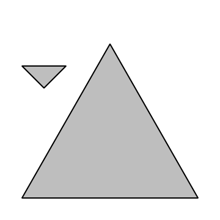
</div>
<figcaption>Figure 2: Two triangles drawn by the grid.path() function
from a set of six (x, y) locations broken into two groups of three
locations.</figcaption>
</figure>

This output looks exactly the same as the output we would get from
drawing the two groups of locations as polygons, using `grid.polygon()`
or `polygon()`, but conceptually there is a difference because the path
treats the two groups of locations as defining a single shape. We can
see the difference more clearly if we move the smaller triangle so that
it lies within the larger triangle (see Figure
[3](#figure:mediumpathinside)).

``` r
> x <- c(.1, .5, .9,
+        .4, .5, .6)
> y <- c(.1, .8, .1,
+        .5, .4, .5)
```

``` r
> grid.path(x, y, id=id,
+           gp=gpar(fill="grey"))
```

<figure id="figure:mediumpathinside">
<div class="center">
<p>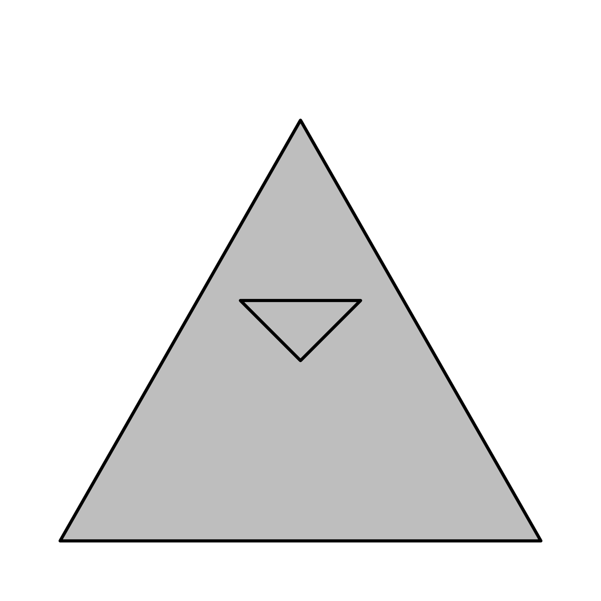</p>
</div>
<figcaption>Figure 3: On the left is a path drawn by the grid.path()
function where the boundary of the path consists of two distinct
triangles (one within the other). The result is a single shape with a
hole in it. On the right is the result of drawing the two boundaries
with the grid.polygon() function, which treats the boundaries as two
separate shapes. In this case, the smaller triangle is drawn (filled in)
on top of the larger triangle.</figcaption>
</figure>

This example demonstrates that the two triangles together define a
single shape, which is a triangular region with a triangular hole in it.
The interior of the shape---the area that is shaded---does *not* include
the region within the smaller triangle.

## Fill rules

There are two ways to determine the interior of a path like this. The
default is called the non-zero winding rule. This draws an imaginary
straight line and looks at where the straight line intersects the
boundary of the shape. A count is made of how many times the boundary is
running left-to-right at the intersection and how many times the
boundary is running right-to-left; if the two counts are the same then
we are outside the shape and if the counts are different, we are inside
the shape.

To see this more clearly, Figure [4](#figure:mediumpathdirection) uses
lines with arrows to show the directions on the boundaries of the path
from Figure [3](#figure:mediumpathinside).

{#figure:mediumpathdirection
width="50.0%" alt="graphic without alt text"}

The outer triangle boundary is clockwise and the inner triangle boundary
is anti-clockwise, so, using the non-zero winding rule, the region
within the inner triangle is actually outside the path. A straight line
from inside the inner triangle to outside the outer triangle intersects
two boundaries, one going right-to-left and one going left-to-right.

To further demonstrate this rule, the following code defines a more
complex path, this time consisting of three triangles: one large
clockwise triangle, with two smaller triangles inside, one clockwise and
one anti-clockwise.

``` r
> x <- c(.1, .5, .9,
+        .4, .5, .6,
+        .4, .6, .5)
> y <- c(.1, .8, .1,
+        .5, .4, .5,
+        .3, .3, .2)
> id <- rep(1:3, each=3)
```

Figure [5](#figure:complexpath) shows a diagram of the boundary
directions and the result of drawing this path. Because the second
smaller triangle is clockwise, the region inside that triangle is still
part of the interior of the path, according to the non-zero winding
rule.

``` r
> grid.path(x, y, id=id,
+           gp=gpar(fill="grey"))
```

<figure id="figure:complexpath">
<div class="center">
<p>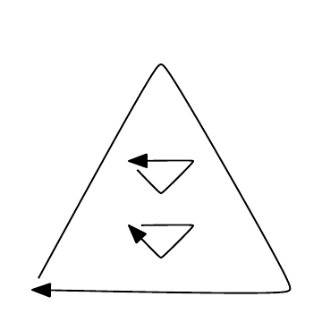</p>
</div>
<figcaption>Figure 5: A path where the boundary consists of three
triangles (two smaller ones within one larger one). The diagram on the
left shows the direction of the boundaries for the path. On the right,
the path is drawn by the grid.path() function, with the interior of the
path determined using the non-zero winding rule.</figcaption>
</figure>

The other rule for determining the interior of a path is called the
even-odd rule. This just draws an imaginary straight line through the
shape and counts how many times the straight line crosses the boundary
of the shape. Each time a boundary is crossed, we toggle between outside
and inside the shape.

The following code draws the same path as in Figure
[5](#figure:complexpath), but uses the even-odd rule to determine the
shape's interior. This time, the result is a larger triangle with *two*
smaller triangular holes punched out of it (see Figure
[6](#figure:complexpathevenodd)).

``` r
> grid.path(x, y, id=id,
+           rule="evenodd",
+           gp=gpar(fill="grey"))
```

{#figure:complexpathevenodd
width="50.0%" alt="graphic without alt text"}

The SVG language specification contains a nice simple explanation and
demonstration of these fill rules; see
<http://www.w3.org/TR/SVG/painting.html#FillRuleProperty>.

# Applications

So what can these complex paths be used for? The possibilities are
endless, but this section describes a couple of concrete examples. The R
code for these examples can be obtained from the online resources that
accompany this article.[^2]

A trivial observation is that complex paths allow us to draw complex
shapes. The triangle with triangular holes from the previous section is
an example of a complex shape; it is not possible to describe this shape
as a simple polygon.

Another way that paths can be useful for drawing complex shapes is that
they allow us to combine several simpler shapes to construct a more
complex whole. Figure [7](#figure:target) shows an example of this,
where the overall shape shape has a very complex outline, but it can be
constructed as a path simply by combining circles and triangles.

<figure id="figure:target">
<p>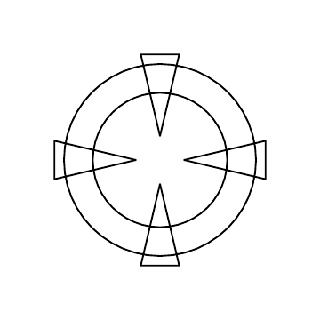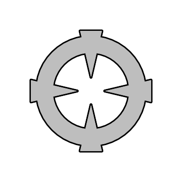</p>
<figcaption>Figure 7: A complex shape constructed from simple shapes
combined together to make a path.</figcaption>
</figure>

Figure [8](#figure:highlight) shows how this shape might be used to
dramatically highlight a point of interest within a graph (in this case,
to bring attention to the data for the *Ferrari Dino* in the `mtcars`
data set).

<figure id="figure:highlight">
<div class="center">
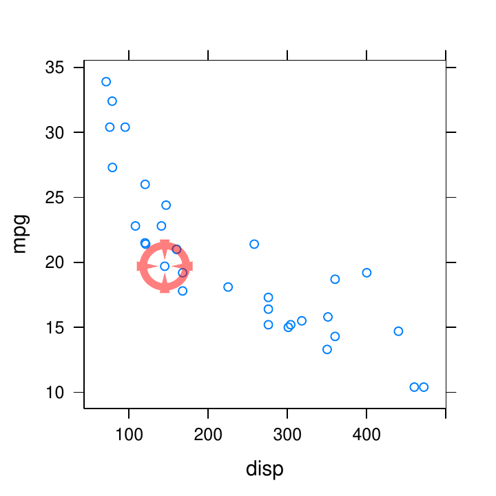
</div>
<figcaption>Figure 8: A plot with a complex path used to highlight a
special point of interest.</figcaption>
</figure>

Another situation where the ability to draw complex paths can be useful
is if we are trying to draw a shape that someone else has created. For
example, we might want to draw the logo of a company or an organisation
as a label on a plot.

Figure [9](#figure:GNUlogo) shows the GNU logo. This image consists of a
single complex path, so we must be able to draw such paths in order to
render it correctly.

<figure id="figure:GNUlogo">
<div class="center">

</div>
<figcaption>Figure 9: A complex path that describes the GNU
logo.</figcaption>
</figure>

Figure [10](#figure:GNUplot) shows the GNU logo being used as a
background watermark for a *lattice* barchart [@pkg:lattice:b].

<figure id="figure:GNUplot">
<div class="center">
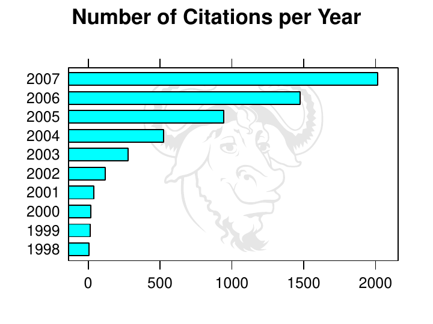
</div>
<figcaption>Figure 10: A plot with the GNU logo from Figure 9 as a
background watermark.</figcaption>
</figure>

Another way that we might use external complex shapes is as data symbols
on a plot. Figure [11](#figure:bus) shows a bus icon. Again, this bus
icon is a single path so it must be drawn using `grid.path()` or
`polypath()` in order for it to render correctly.

<figure id="figure:bus">
<div class="center">

</div>
<figcaption>Figure 11: A path that describes a bus icon.</figcaption>
</figure>

Figure [12](#figure:busplot) shows this bus icon being used as data
symbols on a *lattice* scatterplot of daily bus ridership data.

<figure id="figure:busplot">
<div class="center">
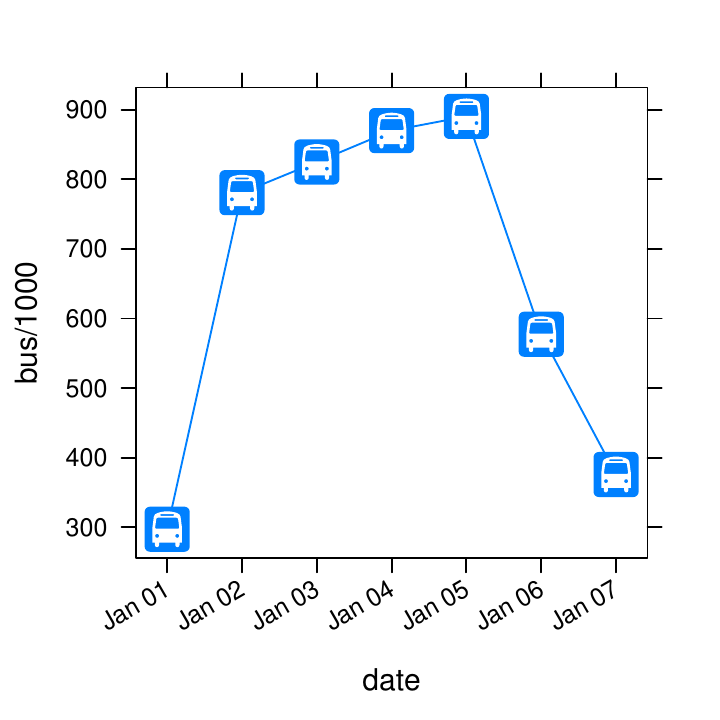
</div>
<figcaption>Figure 12: A plot with the bus icon from Figure 11 used as a
data symbol.</figcaption>
</figure>

Another general area where complex paths arise is the drawing of maps.
The outline of a country's borders or coastline represents a set of
$(x, y)$ coordinates, often in a very complicated arrangement. One
situation where it can be useful to treat the map outline as a path is
the case where a country contains a lake; the lake can be thought of as
a hole in the country shape. Things can get quite complicated if the
lake then contains an island, and the island has a lake, and so on. If
the map is treated as a path to fill then all of these cases are dealt
with quite easily.

Figure [13](#figure:nz) shows a map of part of the South Island of New
Zealand. The lake in the lower right quadrant of this map is Lake Te
Anau and at the base of one of the westerly spurs of this lake is an
island. This map outline has been drawn as a path with a green fill
colour used to indicate land area and an appropriate fill rule ensures
that the lake is not filled in, but the island on the lake is.

<figure id="figure:nz">
<div class="center">
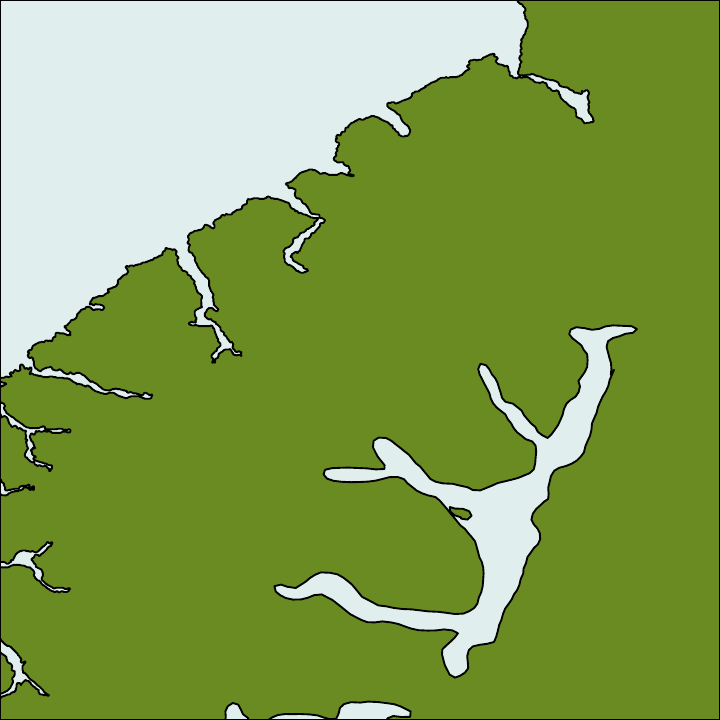
</div>
<figcaption>Figure 13: A map showing an island in a lake on an
island.</figcaption>
</figure>

Although R provides many low-level graphics facilities, such as the
ability to draw complex paths, there are still some basic tricks that it
does not yet support. One example is the ability to clip output to an
arbitrary region on the page (it is currently only possible to clip to
rectangular regions with R).

Sometimes, a missing feature like this can be worked around by making
inventive use of the existing facilities. Figure [14](#figure:mapclip)
shows an example of this, where a contour of earthquake events has been
overlaid on a map of New Zealand, but the contours are only visible over
land areas.

<figure id="figure:mapclip">
<div class="center">
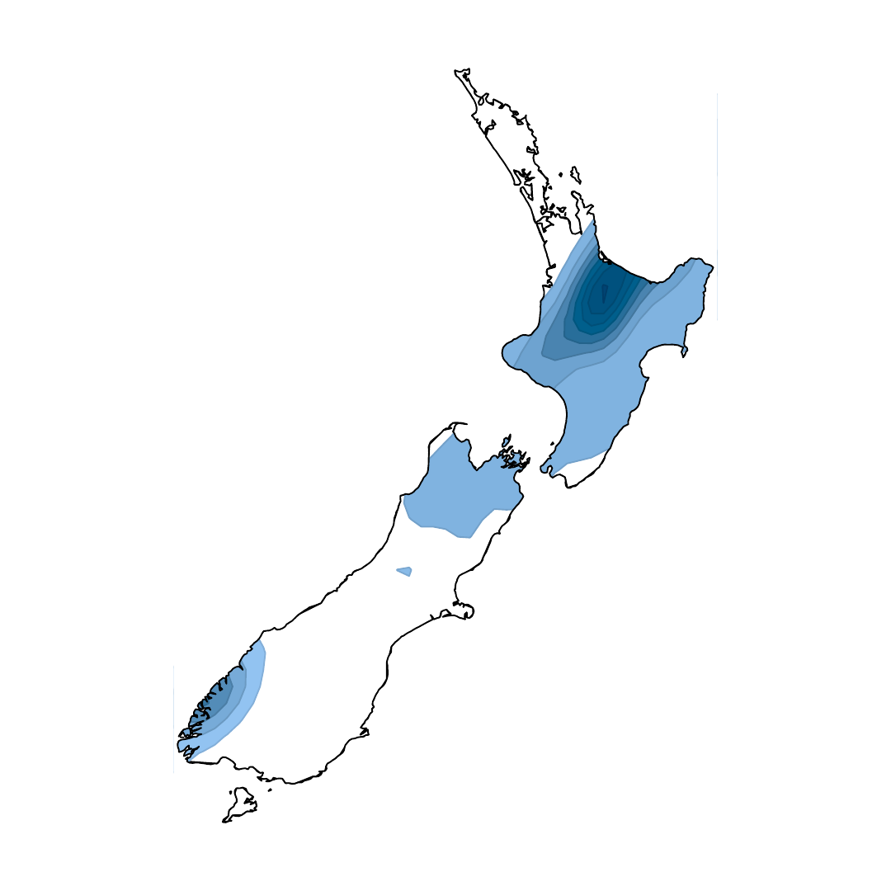
</div>
<figcaption>Figure 14: A map with an overlaid contour. A path has been
used to obscure the contour where it does not overlap with
land.</figcaption>
</figure>

This result was achieved using complex paths (see Figure
[15](#figure:mapclipsetup)). The starting point is the entire contour
overlaid on a New Zealand map (left). A path is constructed from the New
Zealand coastline (middle), and then a bounding rectangle is added to
the path (right). This combined path allows us to fill a region that is
everything outside of the New Zealand coastline and that can be drawn on
top of the original image to obscure those parts of the contour that are
not over land.

<figure id="figure:mapclipsetup">
<p>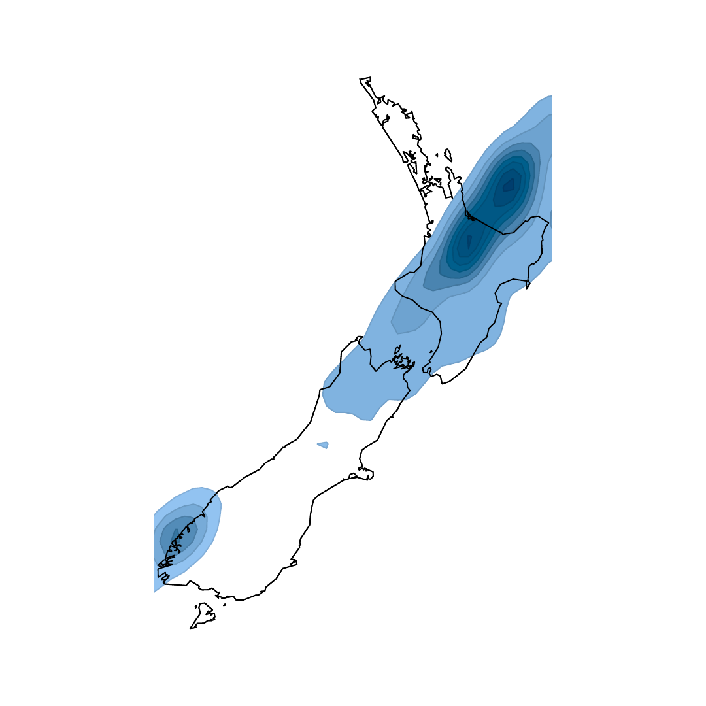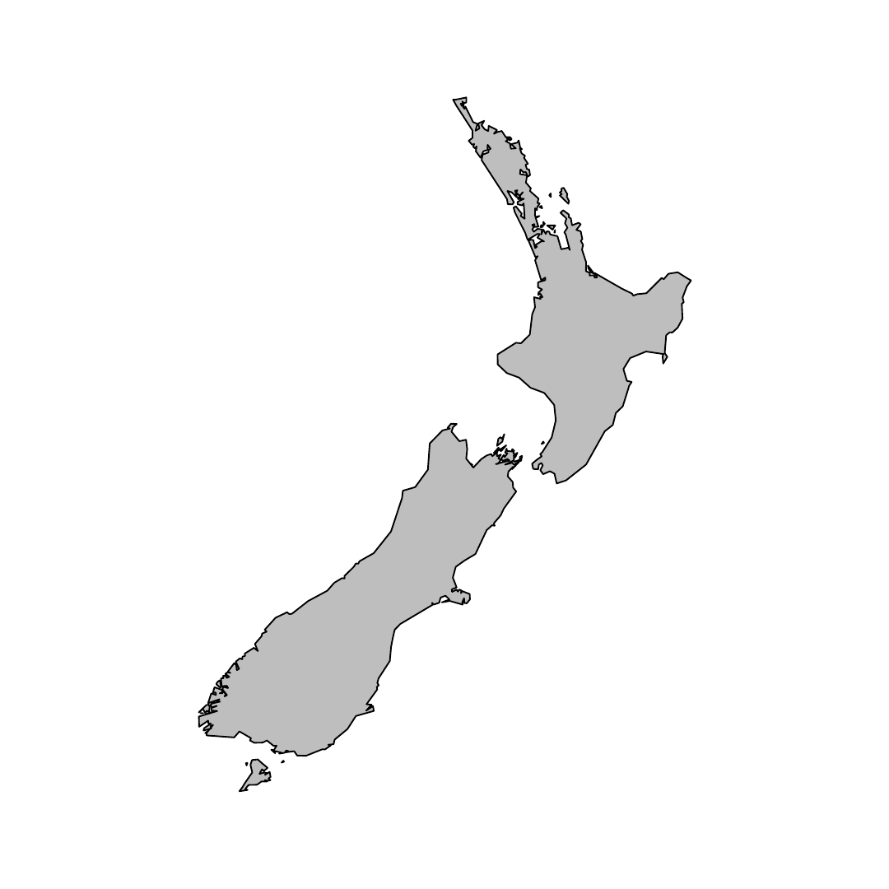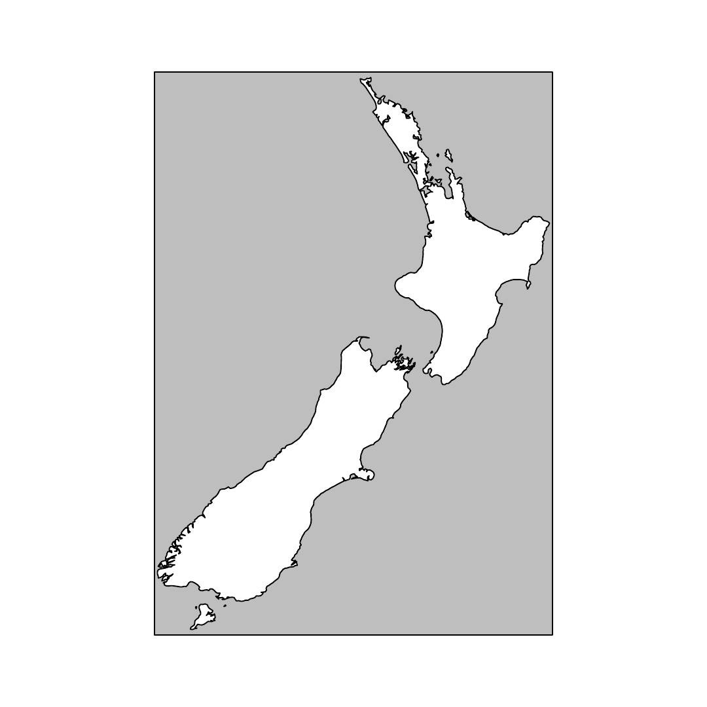</p>
<figcaption>Figure 15: A map with a path used to obscure unwanted
drawing.</figcaption>
</figure>

# Caveats

The `polypath()` and `grid.path()` functions are only supported on the
`pdf()`, `postscript()`, `x11(type="cairo")`, `windows()`, and
`quartz()` graphics devices (and associated raster formats).

These functions are not supported on `x11(type="Xlib")`, `xfig()`, or
`pictex()` and support is not guaranteed on graphics devices provided by
extension packages.

# Summary

There are new functions, `polypath()` and `grid.path()` for drawing
complex paths, including paths with holes, in R graphics output. These
functions can be useful for drawing non-trivial shapes, logos, custom
data symbols, and maps.

# Acknowledgements

The following material and data were used in this article:

-   The GNU logo was created by Aurelio A. Heckert and is available from
    <http://www.gnu.org/graphics/heckert_gnu.html>.

-   The bus icon was created by the Geographics Unit, School of
    Environment, The University of Auckland.

-   Both the GNU logo and the bus icon shape information were imported
    into R and drawn using the
    [*grImport*](https://CRAN.R-project.org/package=grImport) package
    [@pkg:grImport].

-   The bus data were obtained from the City of Chicago Data Portal
    <http://data.cityofchicago.org/Transportation/CTA-Ridership-Daily-Boarding-Totals/>.

-   The detailed map of the South Island of New Zealand came from the
    Global Self-consistent, Hierarchical, High-resolution Shoreline
    Database [version 2.0; @gshhs] and was loaded into R using the
    [*maptools*](https://CRAN.R-project.org/package=maptools) package
    [@pkg:maptools].

-   The earthquake data came from the GeoNet Project:
    <http://www.geonet.org.nz/>

-   The New Zealand coastline information for Figures
    [14](#figure:mapclip) and [15](#figure:mapclipsetup) came from the
    [*maps*](https://CRAN.R-project.org/package=maps) package
    [@pkg:maps].

Many thanks also to the anonymous reviewers who suggested several useful
improvements to this article.
:::

[^1]: When using `polypath()`, `NA` values must be inserted between
    distinct groups of $(x, y)$ values.

[^2]: <http://www.stat.auckland.ac.nz/~paul/R/Paths/>
