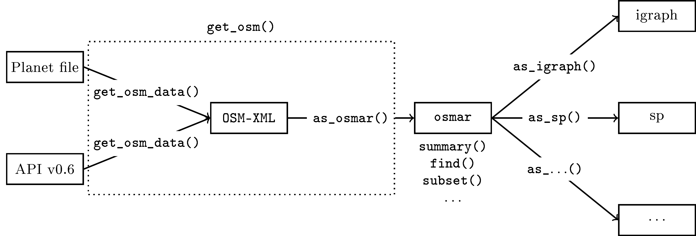
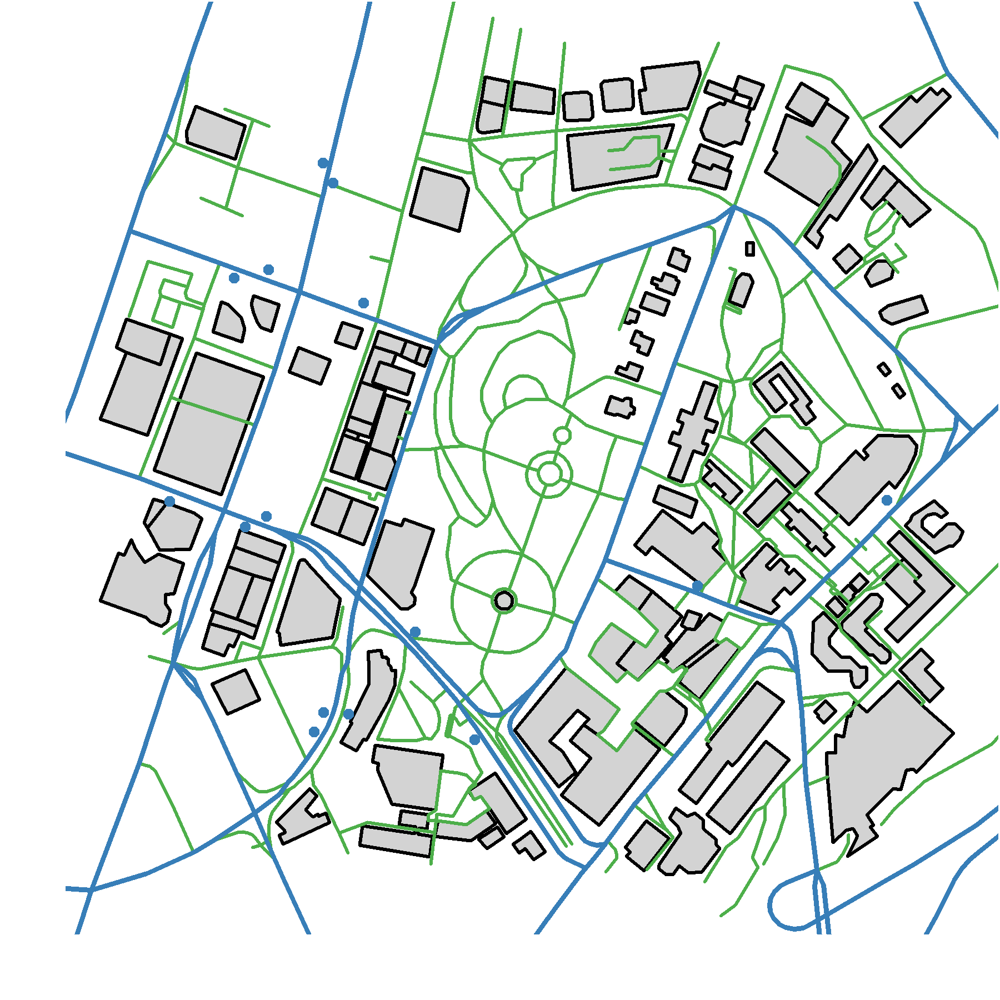

::: article
# Introduction

"*OpenStreetMap creates and provides free geographic data such as street
maps to anyone who wants them*" announces the OpenStreetMap wiki main
page [@osm] -- and we think R users want free geographic data.
Therefore, the add-on package
[*osmar*](https://CRAN.R-project.org/package=osmar) [@osmar] provides
extensible infrastructure for integrating the OpenStreetMap project
(OSM) into the R project.

The aim of the OpenStreetMap project is to create a free editable map of
the world. The project maintains a database of geographic elements
(nodes, ways and relations) and features (such as streets, buildings and
landmarks). These data are collected and provided by volunteers using
GPS devices, aerial imagery, and local knowledge. The most prominent
application is the rendering of the geographic data and features into
raster images (for example, for the OSM map on the website). However,
the project also provides an application programming interface (API) for
fetching raw data from and saving to the OSM database.

The OpenStreetMap project provides data in the OSM XML format, which
consists of three basic elements:

Node:

:   The basic element. It consists of the attributes latitude and
    longitude.

Way:

:   An ordered interconnection of nodes to describe a linear feature
    (e.g., a street). Areas (e.g., buildings) are represented as closed
    ways.

Relation:

:   A grouping of elements (nodes, ways, and relations), which are
    somehow geographically related (e.g., bus and cycle routes).

Each element has further attributes like the element ID (unique within
the corresponding element group) and timestamp. Furthermore, each
element may have an arbitrary number of tags (key-value pairs) which
describe the element. Ways and relations, in addition, have references
to their members' IDs.

In order to access the data, OSM provides an application programming
interface (API) over the hypertext transfer protocol (HTTP) for getting
raw data from and putting it to the OSM database. The main API
(currently in version 0.6) has calls to get elements (and all other
elements referenced by it) by, among other things, their ID and a
bounding box. However, the requests are limited (e.g., currently only an
area of $0.25$ square degrees can be queried). An (unlimited)
alternative is provided by planet files. These are compressed OSM XML
files containing different OSM database extracts (e.g., the entire world
or an individual country or area). Planet files can be downloaded from
the OSM wiki and processed using the command-line Java tool Osmosis
[@osmosis].

For a complete introduction into the OSM project, the OSM API, and the
OSM XML file format we refer to the project's wiki available at
<http://wiki.openstreetmap.org/>.

<figure id="fig:osmar-concept">


<figcaption>Figure 1: Schematic description of the osmar
concept.</figcaption>
</figure>

The aim of the package
[*osmar*](https://CRAN.R-project.org/package=osmar) is to provide
extensible infrastructure to get and to represent the above described
OSM data within R, to enable working with the OSM data in the familiar R
idiom, and to convert the OSM data to objects based on classes provided
by other packages. Figure [1](#fig:osmar-concept) visualizes the
package's concept. This is a different idea than existing packages like
[*OpenStreetMap*](https://CRAN.R-project.org/package=OpenStreetMap)
[@OpenStreetMap],
[*RgoogleMaps*](https://CRAN.R-project.org/package=RgoogleMaps)
[@RgoogleMaps], and [*ggmap*](https://CRAN.R-project.org/package=ggmap)
[@ggmap] follow. Whereas these packages provide access to the already
rendered data (i.e., raster images), *osmar* enables the usage of the
raw OSM data.

In the following section we present the package's implementation and
usage. Note that we try to increase readability by only showing the
relevant arguments of plot statements. We refer to the "navigator" demo
in the *osmar* package for the actual plot statements.

# Getting the data

We begin with defining the data source. Currently two sources, HTTP-API
and planet files, are supported. In this section we use the API of the
OSM project with the default URL
`url = `[`http://api.openstreetmap.org/api/0.6/`](http://api.openstreetmap.org/api/0.6/){.uri}:

``` r
> library("osmar")
```

``` r
Loading required package: XML
Loading required package: RCurl
Loading required package: bitops
Loading required package: gtools
Loading required package: geosphere
Loading required package: sp

Attaching package: 'osmar'

The following object(s) are masked
from 'package:utils':

    find
```

``` r
> src <- osmsource_api()
```

We can retrieve elements by using the IDs of the elements. The IDs in
these examples have been extracted by hand from the OpenStreetMap
website (via its export functionality). For example, one node:

``` r
> get_osm(node(18961430), source = src)
```

``` r
osmar object
1 nodes, 0 ways, 0 relations 
```

Or, one way with the way-related data only or with the data for all
referenced elements (nodes and relations):

``` r
> get_osm(way(3810479), source = src)
```

``` r
osmar object
0 nodes, 1 ways, 0 relations 
```

``` r
> get_osm(way(3810479), source = src, full = TRUE)
```

``` r
osmar object
11 nodes, 1 ways, 0 relations 
```

The first statement retrieves the way only (because the default value of
the `full` argument is `FALSE`). The second statement additionally
retrieves all nodes that are members of the way (i.e., all nodes that
define the way).

The second possibility to retrieve elements is to specify a bounding box
by defining the left, bottom, right, and top coordinates
(`corner_bbox()`), or the center point and width and height in meters
(`center_bbox()`):

``` r
> bb <- center_bbox(174.76778, -36.85056, 700, 700)
> ua <- get_osm(bb, source = src)
> ua
```

``` r
osmar object
2427 nodes, 428 ways, 70 relations 
```

The use of planet files via Osmosis as source works analogously. The
source is specified by the function `osmsource_osmosis()`. The
function's two arguments are the path to the planet file (`file`) and
the path to the `osmosis` tool (`osmosis = "osmosis"`). Note that per
default it is assumed that the Osmosis executable is in your `PATH`
environment variable. The navigator example demonstrates the usage of
planet files.

# Working with the data

The retrieved `osmar` object is a list with the three elements `nodes`,
`ways`, and `relations`. Each element again is a list containing
`data.frame`s for the attributes (the `attrs` list element) and
meta-data (the `tags` list element) of the OSM elements. Ways and
relations additionally have a `data.frame` containing their members (the
`refs` list element).

#### Summarize.

For each element `nodes`, `ways`, and `relations` of an `osmar` object
an individual summary method is available. The overall summary method
for an `osmar` object shows the three individual summaries all at once.

``` r
> summary(ua$nodes)
```

``` r
osmar$nodes object
2427 nodes, 771 tags

..$attrs data.frame:
    id, lat, lon, user, uid, visible, version,
    changeset, timestamp
..$tags data.frame:
    id, k, v

Bounding box:
          lat      lon
min -36.85661 174.7627
max -36.84472 174.7753

Key-Value contingency table:
             Key                   Value Freq
1      addr:city                Auckland  101
2    addr:street            Queen Street   61
3   addr:country                      NZ   40
4  addr:postcode                    1010   39
5        comment Determined via Keypa...   29
6    addr:street          Symonds Street   27
7        highway         traffic_signals   23
8    addr:street            Lorne Street   19
9        highway                bus_stop   15
10       amenity                    cafe   11
```

In the case of the summary for `nodes`, the number of elements and tags,
as well as the available variables for each corresponding `data.frame`
are shown. The bounding box of the coordinates and a contingency table
of the top ten most frequently available key-value pairs are printed.

The summaries for the other two elements `ways` and `relations` are
similar. Note that these methods in fact return the contingency table of
all available key-value pairs and, in addition, further information
which is not printed but may be useful for a descriptive analysis. We
refer to the help pages (e.g., `?summary.nodes`) for a detailed
description of the return values.

#### Find.

In order to find specific elements within the `osmar` object, the
`find()` function allows the object to be queried with a given
condition. As the basis of `osmar` objects are `data.frame`s, the
condition principally is a logical expression indicating the rows to
keep. In addition, one has to specify to which element (nodes, `node()`;
ways, `way()`; or relations, `relation()`) and to which data
(attributes, `attrs()`; meta-data, `tags()`; or members, `refs()`) the
condition applies.

If, for example, we want to find all traffic signal nodes, we know from
the object's summary that the corresponding value in the
`attrs data.frame` is `"traffic_signals"`. We can express this condition
as follows:

``` r
> ts_ids <- find(ua, node(tags(v == "traffic_signals")))
> ts_ids
```

``` r
[1] 25769635 25769637 25769641 ...
```

The result is a vector with node IDs (in this case 25 traffic signal
nodes) or `NA`. If the correct spelling is unknown, the defined binary
operators `%agrep%` for approximate matches (see `?agrep`) and `%grep%`
for pattern matches (see `?grepl`) can be used:

``` r
> bs_ids <- find(ua, node(tags(v %agrep% "busstop")))
> bs_ids
```

``` r
[1] 678301119  737159091  1318401034 ...
```

This returns $15$ bus stops available in the `ua` `osmar` object.

We use the functions `find_down()` and `find_up()` to find all related
elements for given element IDs. The OSM basic elements define a
hierarchy,
$$\text{node} \leftarrow \text{way} \leftarrow \text{relation,}$$ and
these two functions enable us to find the related elements up and down
the hierarchy. For example, `find_up()` on a node returns all related
nodes, ways, and relations; `find_down()` on a node returns only the
node itself. On the other hand, `find_up()` on a relation returns only
the relation itself; `find_down()` on a relation returns the relation
and all related ways and nodes.

``` r
> hw_ids <- find(ua, way(tags(k == "highway")))
> hw_ids <- find_down(ua, way(hw_ids))
```

In this example we find all ways that have a tag with the `k` attribute
set to `"highway"`. These contain hardened and recognised land routes
between two places used by motorised vehicles, pedestrians, cyclists,
etc. The return value of `find_down()` and `find_up()` is a list
containing the element IDs:

``` r
> str(hw_ids)
```

``` r
List of 3
 $ node_ids    : num [1:1321] 25769641 ...
 $ way_ids     : num [1:253] 4309608 ...
 $ relation_ids: NULL
```

#### Subset.

The return value of the find functions then can be used to create
subsets of `osmar` objects. The `subset()` method for `osmar` objects
takes element IDs and returns the corresponding data as `osmar` objects.
For example, the two subsets based on the traffic signal and bus stop
element IDs are:

``` r
> ts <- subset(ua, node_ids = ts_ids)
> ts
```

``` r
osmar object
25 nodes, 0 ways, 0 relations
```

``` r
> bs <- subset(ua, node_ids = bs_ids)
> bs
```

``` r
osmar object
15 nodes, 0 ways, 0 relations
```

The subset based on the highway element IDs is:

``` r
> hw <- subset(ua, ids = hw_ids)
> hw
```

``` r
osmar object
1321 nodes, 253 ways, 0 relations
```

Note that the subsetting of `osmar` objects is divided into the two
steps "finding" and "subsetting" to have more flexibility in handling
the related elements (here with using `find_down()` and `find_up()`, but
more sophisticated routines can be imagined).

#### Plot.

The visualization of `osmar` objects is possible if nodes are available
in the object (as only these OSM elements contain latitude and longitude
information). The functions `plot_nodes()` and `plot_ways()` plot the
available nodes as dots and ways as lines, respectively. The `plot()`
method combines these two function calls. Note that this is a plot of
the raw data and no projection is done (see the following section for a
projected visualization).

``` r
> plot(ua)
> plot_ways(hw, add = TRUE, col = "green")
> plot_nodes(ts, add = TRUE, col = "red")
> plot_nodes(bs, add = TRUE, col = "blue")
```

{#fig:osmar-ua
width="100%" alt="graphic without alt text"}

# Converting the data

In order to use the complete power of R on OpenStreetMap data, it is
essential to be able to convert `osmar` objects into commonly used
objects based on classes provided by other packages. Currently, *osmar*
provides two converters -- into the
[*sp*](https://CRAN.R-project.org/package=sp) [@sp] and the
[*igraph*](https://CRAN.R-project.org/package=igraph) [@igraph]
packages. In this section we show the conversion to `sp` objects, the
navigation device example shows the conversion to `igraph` objects.

The *sp* package provides special data structures and utility functions
for spatial data. Spatial data classes are available for points, lines,
and polygons and others [see @sp]. The *osmar* package provides the
`as_sp()` function,

``` r
> args(as_sp)
```

``` r
function(obj, what = c("points", "lines", "polygons"), 
         crs = osm_crs(), simplify = TRUE)
NULL
```

to convert an `osmar` object into the corresponding classes for points,
lines, and polygons in the *sp* package (given the required data are
available). Note that the appropriate WGS84 coordinate reference system
(CRS) for OpenStreetMap data is used (cf. `osm_crs()`).

#### Polygons.

Polygons are used to represent areas, which OpenStreetMap represents as
closed ways. Buildings, for example, are closed ways and can be
converted to an `sp` polygon object:

``` r
> bg_ids <- find(ua, way(tags(k == "building")))
> bg_ids <- find_down(ua, way(bg_ids))
> bg <- subset(ua, ids = bg_ids)
> bg
```

``` r
osmar object
991 nodes, 110 ways, 0 relations
```

``` r
> bg_poly <- as_sp(bg, "polygons")
```

The result is a `SpatialPolygonsDataFrame` with the `osmar` object's
attributes (the `attrs` element) as its data. Functionality provided by
the *sp* package can now be used to analyze the OSM data; e.g., the
`summary()` method or the `spplot()` method---the latter one, for
example, to see how often each building was modified:

``` r
> spplot(bg_poly, c("version"))
```

{#fig:osmar-ua-version width="100%" alt="graphic without alt text"}

Meta-data (the `tags` element) and members (the `refs` element) are not
automatically converted to a `SpatialPolygonsDataFrame`'s data.

#### Lines and points.

The conversion of lines and points works similarly:

``` r
> hw_line <- as_sp(hw, "lines")
> bs_points <- as_sp(bs, "points")
```

The results are `SpatialLinesDataFrame` and `SpatialPointsDataFrame`
objects, respectively.

In order to finalize the University of Auckland example we create a bus
route map and visualize the available bus routes belonging to the bus
stops. Therefore, we find all `bus` relations available in the object,
retrieve the corresponding data from the OSM API, and convert the data
into lines (note that this computation takes some time):

``` r
> bus_ids <- find(ua, relation(tags(v == "bus")))
> bus <- lapply(bus_ids,
+   function(i) {
+     raw <- get_osm(relation(i), full = TRUE)
+     as_sp(raw, "lines")
+   })
```

We use the argument `full = TRUE` to retrieve the relation itself and
all related members. In detail, this means we retrieve all nodes, ways,
and relations that are members of the specified relation; and,
recursively, all nodes that are members of the retrieved ways.

We then use the *sp* plot methods to create the final bus route map:

``` r
> plot(bg_poly, col = "gray")
> plot(hw_line, add = TRUE, col = "green")
> plot(bs_points, add = TRUE, col = "blue")
> for ( i in seq(along = bus) ) {
+   plot(bus[[i]], add = TRUE, col = "blue")
+ }
```

<figure id="fig:osmar-ua-bus">

<p>. <span id="fig:osmar-ua-bus" label="fig:osmar-ua-bus"></span></p>
<figcaption>Figure 4: Bus route map of the University of Auckland; roads
are green lines; bus stops and bus routes are blue points and
lines</figcaption>
</figure>

# R as navigator

We always wanted to know how a navigation device works. Now with
*osmar*, R provides the necessary components and this serves as nice
example on how to use *osmar*. The general idea is to (1) get the data,
(2) extract all highways, (3) create a graph of all highway nodes with
the distance between the highway nodes as edge weights, (4) compute the
shortest path on the graph, and (5) trace the path on the highways.

#### Get the data.

We use a planet file from Munich as the data source and use Osmosis
[@osmosis] to process the data. Note that `osmosis` has to be in your
`PATH` environment variable.

``` r
> library("osmar")
> url <- "http://osmar.r-forge.r-project.org/"
> file <- "muenchen.osm.gz"
> download.file(sprintf("%s%s", url, file), file)
> system("gzip -d muenchen.osm.gz")
```

Get the center of Munich with a $3\text{km} \times 3\text{km}$ bounding
box:

``` r
> src <- osmsource_osmosis(file = "muenchen.osm")
> muc_bbox <- center_bbox(11.575278, 48.137222, 3000, 3000)
> muc <- get_osm(muc_bbox, src)
> muc
```

``` r
osmar object
13713 nodes, 3156 ways, 76 relations
```

For the navigation device we only need streets. This means, we have to
find all ways that are tagged as highways and have a name tag, then find
the associated nodes, and finally subset the full `osmar` object:

``` r
> hways_muc <- subset(muc, way_ids = find(muc, way(tags(k == "highway"))))
> hways <- find(hways_muc, way(tags(k == "name")))
> hways <- find_down(muc, way(hways))
> hways_muc <- subset(muc, ids = hways)
> hways_muc
```

``` r
osmar object
3889 nodes, 995 ways, 0 relations
```

Suppose we want to start our route at the "Sendlinger Tor". This means
we first have to find a node that is tagged with the name "Sendlinger
Tor" and then the nearest highway node:

``` r
> hway_start_node <- local({
+   id <- find(muc, node(tags(v == "Sendlinger Tor")))[1]
+   find_nearest_node(muc, id, way(tags(k == "highway")))
+ })
> hway_start <- subset(muc, node(hway_start_node))
```

For a given node (by its ID), the function `find_nearest_node()` finds
the nearest node with the specified conditions (the package
[*geosphere*](https://CRAN.R-project.org/package=geosphere),
[@geosphere] is used to compute the distances). The end of the route
should be in the northeast part of Munich; so we find nodes that are in
the northeast and take one highway node:

``` r
> hway_end_node <- local({
+   id <- find(muc, node(attrs(lon > 11.59 & lat > 48.150)))[1]
+   find_nearest_node(muc, id, way(tags(k == "highway")))
+ })
> hway_end <- subset(muc, node(hway_end_node))
```

Finally, we visualize the initial situation:

``` r
> plot_nodes(muc, col = "gray")
> plot_ways(hways_muc, add = TRUE)
> plot_nodes(hways_muc, add = TRUE, col = "black")
> plot_nodes(hway_start, add = TRUE, col = "red")
> plot_nodes(hway_end, add = TRUE, col = "blue")
```

{#fig:munich-highway-map width="100%" alt="graphic without alt text"}

The gray nodes are all nodes available in the full `osmar` object, the
black nodes and lines are the road networks available in the
highway-`osmar` object, the red and blue dots denote the starting and
ending nodes of the searched route.

#### Compute the route.

In order to compute the shortest route between the defined starting and
ending nodes, we convert the highway-`osmar` object into a graph. R
provides a set of packages to work with graphs, we decided to use
*igraph*:

``` r
> library("igraph0")
> gr_muc <- as_igraph(hways_muc)
> summary(gr_muc)
```

``` r
Vertices: 2381
Edges: 2888
Directed: TRUE
No graph attributes.
Vertex attributes: name.
Edge attributes: weight, name.
```

The `osmar` object nodes define the nodes of the graph (node IDs are
used as graph node names). The `osmar` object ways define the edges (way
IDs are used as edge names), and the weights of the edges are the
geographical distance between the nodes.

The *igraph* package provides different shortest path algorithms (e.g.,
Dijkstra and Bellman-Ford) via the function `get.shortest.paths()`. The
shortest route (not necessarily unique) is:

``` r
> route <- get.shortest.paths(gr_muc,
+   from = as.character(hway_start_node),
+   to = as.character(hway_end_node))[[1]]
> route_nodes <- as.numeric(V(gr_muc)[route]$name)
```

We construct a new `osmar` object containing only elements related to
the nodes defining the route:

``` r
> route_ids <- find_up(hways_muc, node(route_nodes))
> route_muc <- subset(hways_muc, ids = route_ids)
> route_muc
```

``` r
osmar object
101 nodes, 83 ways, 0 relations
```

And add the route to the highway map of Munich center in
Figure [5](#fig:munich-highway-map):

``` r
> plot_nodes(route_muc, add = TRUE, col = "green")
> plot_ways(route_muc, add = TRUE, col = "green")
```

{#fig:munich-street-map2 width="100%" alt="graphic without alt text"}

#### Route details.

In order to present route details like street names, distances, and
directions we have to work directly on the internals of the `osmar`
objects.

We start by extracting the route's node IDs (which are in the correct
order) and the way IDs (which we have to order) where the nodes are
members:

``` r
> node_ids <- route_muc$nodes$attrs$id
> way_ids <- local({
+   w <- match(node_ids, route_muc$ways$refs$ref)
+   route_muc$ways$refs$id[w]
+ })
```

Then we extract the names of the ways in the correct order:

``` r
> way_names <- local({
+   n <- subset(route_muc$ways$tags, k == "name")
+   n[match(way_ids, n$id), "v"]
+ })
```

The next step is to extract the nodes' coordinates,

``` r
> node_coords <- route_muc$nodes$attrs[, c("lon", "lat")]
```

and to compute the distances (meters) and the bearings (degrees) between
successive nodes (using the package *geosphere*):

``` r
> node_dirs <- local({
+   n <- nrow(node_coords)
+   from <- 1:(n-1)
+   to <- 2:n
+
+   cbind(dist = c(0,
+         distHaversine(node_coords[from, ], node_coords[to, ])),
+         bear = c(0,
+         bearing(node_coords[from, ],
+                 node_coords[to, ])))
+ })
```

Finally, we pack together all the information, and additionally compute
the cumulative distance and a 16-point compass rose direction (the
`compass()` function is available in the "navigator" demo from the
*osmar* package):

``` r
> route_details <- data.frame(way_names, node_dirs)
> route_details$cdist <- cumsum(route_details$dist)
> route_details$dir <- compass(route_details$bear)
```

The result is a `data.frame` with a row for each node of the route. The
row shows the name of the associated way, the distance (meters) and
bearing (degrees and compass rose) to the successive node of the route,
and the cumulative distance:

``` r
> head(route_details)
```

``` r
               way_names dist bear cdist dir
1   Sendlinger-Tor-Platz    0    0     0   N
2             Wallstraße   65   62    65 ENE
3  Herzog-Wilhelm-Straße   29   75    94 ENE
4              Oberanger   10   78   104 ENE
5              Oberanger   69   94   173   E
6     Nikolaus-Gradl-Weg   25   76   198 ENE
```

Needless to say that this navigation device can be made much more
sophisticated. The *osmar* package contains the complete source code of
the basic navigation device as a demo and we invite everybody to improve
R as a navigator.

# Summary

The *osmar* package extends the R ecosystem with infrastructure to work
together with the OpenStreetMap project. So far, functionality is
available to get data from different sources (e.g., planet file and API
v0.6), to consolidate the data as an R `osmar` object, to work with the
`osmar` object (e.g., subsetting and plotting), and to convert it to
objects based on classes provided by other packages (e.g., to `igraph`
and `sp` objects).

Future work includes the implementation of further converters; e.g., a
converter from `osmar` objects to raster image objects via the
*OpenStreetMap* package. We are also interested in implementing
converters from objects provided by other R packages to `osmar` objects
and in saving these objects in different OpenStreetMap sources via a
`put_osm()` function. This would be, in fact, the completion of the
*osmar* concept illustrated in Figure [1](#fig:osmar-concept) with
arrows from the right to the left blocks.

Furthermore, we would like to incorporate tools originated in the
OpenStreetMap ecosystem. One idea is the implementation of a rule-based
rendering tool for generating SVG images of OSM data along the lines of
Osmarender [@osmarender]. Another interesting project is Osmium, a fast
and flexible C++ and Javascript toolkit and framework for working with
OSM data [@osmium]. An R interface [potentially via
[*Rcpp*](https://CRAN.R-project.org/package=Rcpp) modules; @Rcpp] would
provide a very fast and flexible way to work with large OSM data sets.

# Acknowledgment

The authors thank two anonymous reviewers and Joe Sakshaug for their
constructive comments to improve the manuscript.

\

\
:::
