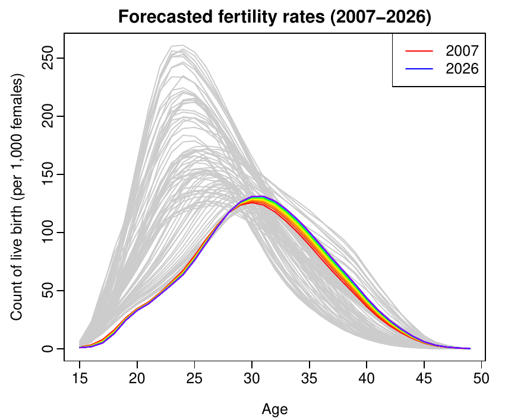
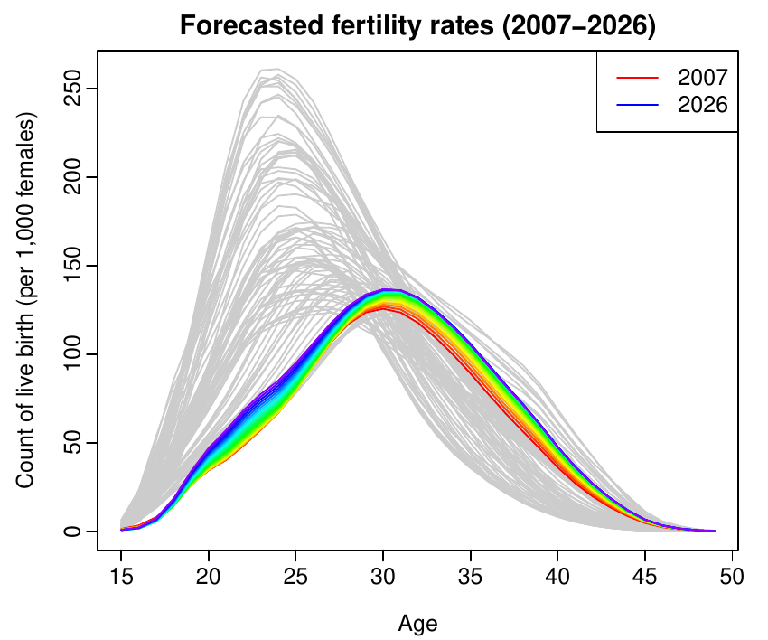

::: article
# Introduction

The aim of this article is to describe the R functions that are
readily-available in the
[*ftsa*](https://CRAN.R-project.org/package=ftsa) package [@HS12], for
modeling and forecasting functional time series. This article was
motivated by recent advances in computer recording and storing
technology that have enabled researchers to collect and store (ultra)
high-dimensional data. When the high-dimensional data are repeatedly
measured on the same object over a period of time, a time series of
continuous functions is observed within a common bounded interval
[@SH08].

Analyzing functional time series has received increasing attention in
the functional data analysis literature [see for example,
@HK10; @HHK10; @HK12]. [@HS10] presented a rainbow plot for visualizing
functional time series, where the distant past data are shown in red and
most recent data are shown in purple. [@AOV99] proposed functional
principal component regression (FPCR) to model and forecast functional
time series.

Before reviewing the FPCR, we first define the problem more precisely.
Let $y_t(x)$ denote a function, such as age-specific fertility rates for
the continuous age variable $x$ in year $t$, or monthly sea surface
temperatures for the continuous time variable $x$ in year $t$. In the
latter example, functional time series techniques allow us to capture
the underlying dynamic of the multiple seasonality in the data [see
@SH11; @Shang12a for example]. We assume that there is an underlying
smooth function $f_t(x)$ that observes with error at discretized grid
points of $x$. In practice, we observe $\{x_i, y_t(x_i)\}$ for
$t=1,2,\dots,n$ and $i=1,2,\dots,p$, from which we extract a smooth
function $f_t(x)$, given by

$$y_t(x_i) = f_t(x_i) + \sigma_t(x_i)\varepsilon_{t,i}, 
  \label{eq:51}  (\#eq:51)  $$

where $\varepsilon_{t,i}$ is an independent and identically distributed
(iid) standard normal random variable, $\sigma_t(x_i)$ allows the amount
of noise to vary with $x_i$, and $\{x_1,x_2,\dots,x_p\}$ is a set of
discrete data points. Given a set of functional data
$\mathbf{f}(x)=[f_1(x),f_2(x),\dots,f_n(x)]^{\top}$, we are interested
in finding underlying patterns using the FPCR, from which we obtain
forecasts of $y_{n+h}(x)$, where $h$ denotes the forecast horizon.

This article proceeds as follows. Techniques for modeling and
forecasting functional time series are reviewed and their
implementations using the *ftsa* package are described. Conclusions are
given at the end.

# Functional time series modeling and forecasting techniques {#sec:3}

## Functional principal component regression

The theoretical, methodological and practical aspects of functional
principal component analysis (FPCA) have been extensively studied in the
functional data analysis literature, since it allows finite dimensional
analysis of a problem that is intrinsically infinite-dimensional
[@HH06]. Numerous examples of using FPCA as an estimation tool in
regression problem can be found in different fields of applications,
such as breast cancer mortality rate modeling and forecasting [@EHG07],
call volume forecasting [@SH08], climate forecasting [@SH11],
demographical modeling and forecasting [@HS09], and electricity demand
forecasting [@APD+08].

At a population level, a stochastic process denoted by $f$ can be
decomposed into the mean function and the sum of the products of
orthogonal functional principal components and uncorrelated principal
component scores. It can be expressed as
$$f = \mu + \sum^{\infty}_{k=1}\beta_{k}\phi_k,$$ where $\mu$ is the
unobservable population mean function, $\beta_{k}$ is the
$k^{\text{th}}$ principal component scores, and $\phi_k$ is the
$k^{\text{th}}$ population functional principal component.

In practice, we can only observe $n$ realizations of $f$ evaluated on a
compact interval $x\in[0,\tau]$, denoted by $f_t(x)$ for
$t=1,2,\dots,n$. At a sample level, the functional principal component
decomposition can be written as

$$f_t(x) = \bar{f}(x) + \sum^K_{k=1}\widehat{\beta}_{t,k}\widehat{\phi}_k(x) + \widehat{\varepsilon}_t(x), 
 \label{eq:61}  (\#eq:61)  $$

where $\bar{f}(x)=\frac{1}{n}\sum^n_{t=1}f_t(x)$ is the estimated mean
function, $\widehat{\phi}_k(x)$ is the $k^{\text{th}}$ estimated
orthonormal eigenfunction of the empirical covariance operator
$$\widehat{\Gamma}(x)=\frac{1}{n}\sum^n_{t=1}[f_t(x)-\bar{f}(x)][f_t(x)-\bar{f}(x)],$$
the coefficient $\widehat{\beta}_{t,k}$ is the $k^{\text{th}}$ principal
component score for year $t$, it is given by the projection of
$f_t(x)-\bar{f}(x)$ in the direction of $k^{\text{th}}$ eigenfunction
$\widehat{\phi}_k(x)$, that is,
$\widehat{\beta}_{t,k}$=$<f_t(x)-\bar{f}(x), \widehat{\phi}_k(x)>$=$\int_x [f_t(x)-\bar{f}(x)]\widehat{\phi}_k(x)dx$,
$\widehat{\varepsilon}_t(x)$ is the residual, and $K$ is the optimal
number of components, which can be chosen by cross validation. [@HB08]
studied the impact on forecast accuracy with a smaller or larger than
the optimal value of $K$.

The functional principal component decomposition is first demonstrated
using the age-specific Australian fertility rate data between ages 15
and 49 observed from 1921 to 2006. This data set was obtained from the
Australian Bureau of Statistics (Cat No, 3105.0.65.001, Table 38). A
functional graphical display is given in [@Shang11].

Figure [1](#fig:3) presents the first two functional principal
components and their associated principal component scores. The bottom
panel of Figure [1](#fig:3) also plots the forecasted principal
component scores, and their 80% prediction intervals (in yellow color),
using an exponential smoothing state-space model [@HKO+08]. As pointed
out by a referee, the forecasts of principal component scores appear to
quickly level off, and the prediction intervals widen very quickly. This
reflects the difficulty of our model in forecasting medium or long term
horizon, as a result of the increase in variability.

{#fig:3 width="100%" alt="graphic without alt text"}

Figure [1](#fig:3) was produced by the following code.

``` r
# load the package used throughout this article
library("ftsa")
# Fit and plot functional principal components  
# order specifies the number of principal components
# h specifies the forecast horizon
plot(forecast(ftsm(Australiasmoothfertility, order=2), h=20), "components")
```

By conditioning on the set of smoothed functions
$\mathbf{f}(x)=[f_1(x),f_2(x),\dots,f_n(x)]^{\top}$ and the fixed
functional principal components
$\mathcal{\mathbf{B}}=[\widehat{\phi}_1(x),\widehat{\phi}_2(x),\dots,\widehat{\phi}_K(x)]^{\top}$,
the $h$-step-ahead forecasts of $y_{n+h}(x)$ can be obtained as

::: small
$$\begin{aligned}
\widehat{y}_{n+h|n}(x)=\text{E}[y_{n+h}(x)|\mathbf{f}(x),\mathcal{\mathbf{B}}]=\bar{f}(x)+\sum^K_{k=1}\widehat{\beta}_{n+h|n,k}\widehat{\phi}_k(x),
\end{aligned}$$
:::

where $\widehat{\beta}_{n+h|n,k}$ denotes the $h$-step-ahead forecasts
of $\beta_{n+h,k}$ using a univariate time series.

Figure [2](#fig:4) shows the forecasts of Australian fertility rate data
from 2007 to 2026 highlighted in rainbow color, while the data used for
estimation are grayed out. Both the multi-step-ahead and iterative
one-step-ahead forecasts exhibit a continuing shift to older ages of
peak fertility rates, caused by a recent tendency to postpone
child-bearing while pursuing careers.

<figure id="fig:4">
<p> (a)
Multiple-step-ahead forecasts. Based on the historical data from 1921 to
2006, we obtain 20-step-ahead forecasts for 2007 to 2026.  (b) Iterative
one-step-ahead forecasts. Based on the historical data from 1921 to
2006, we obtain iterative one-step-ahead forecasts for 2007 to 2026
using the rolling origin approach.</p>
<figcaption>Figure 2: Forecasts of the Australian fertility rates from
2007 to 2026, based on the first two functional principal components and
their associated principal component scores as an
illustration.</figcaption>
</figure>

Figure [2](#fig:4) was produced by the following code.

``` r
# Plot the historical data in gray
plot(Australiasmoothfertility, col = gray(0.8), xlab = "Age", 
     ylab = "Count of live birth (per 1,000 females)", 
     main = "Forecasted fertility rates (2007-2026)")
# Plot the forecasts in rainbow color for Fig. 4(a)
plot(forecast(ftsm(Australiasmoothfertility, order = 2), h = 20), add = TRUE)
legend("topright", c("2007", "2026"), col = c("red", "blue"), lty = 1)

plot(Australiasmoothfertility, col = gray(0.8), xlab = "Age",
     ylab = "Count of live birth (per 1,000 females)", 
     main = "Forecasted fertility rates (2007-2026)")
# Plot the forecasts in rainbow color for Fig. 4(b)
plot(ftsmiterativeforecasts(Australiasmoothfertility, components = 2, iteration = 20), 
     add = TRUE)
legend("topright", c("2007", "2026"), col = c("red", "blue"), lty = 1)
```

To construct prediction interval, we calculate the forecast variance
that follows from \@ref(eq:51) and \@ref(eq:61). Because of
orthogonality, the forecast variance can be approximated by the sum of
component variances $$\begin{aligned}
  \xi_{n+h}(x)&=\text{Var}[y_{n+h}(x)|\mathbf{f}(x),\mathcal{\mathbf{B}}]
  =\widehat{\sigma}_{\mu}^2(x)+\sum^K_{k=1}u_{n+h,k}\widehat{\phi}_k^2(x) + v(x) + \sigma^2_{n+h}(x),
\end{aligned}$$ where
$u_{n+h,k}=\text{Var}(\beta_{n+h,k}|\beta_{1,k},\beta_{2,k},\dots,\beta_{n,k})$
can be obtained from the time series model, and the model error variance
$v(x)$ is estimated by averaging
$\{\widehat{\varepsilon}_1^2(x),\widehat{\varepsilon}_2^2(x),\dots,\widehat{\varepsilon}_n^2(x)\}$
for each $x$, and $\widehat{\sigma}_{\mu}^2(x)$ and $\sigma^2_{n+h}(x)$
can be obtained from the nonparametric smoothing method used.

Based on the normality assumption, the $100(1-\alpha)\%$ prediction
interval for $y_{n+h}(x)$ is constructed as
$\widehat{y}_{n+h|n}(x)\pm z_{\alpha}\sqrt{\xi_{n+h}(x)}$, where
$z_{\alpha}$ is the $(1-\alpha/2)$ standard normal quantile.

{#fig:5 width="100%" alt="graphic without alt text"}

Figure [3](#fig:5) displays the forecasts of fertility rates in 2007,
along with the 80% prediction interval. It was created by the following
code.

``` r
# Plot the point forecast
aus = forecast(ftsm(Australiasmoothfertility, order = 2), h = 1)
plot(aus, ylim = c(0, 140))
# Plot the lower and upper bounds
lines(aus$lower, col = 2); lines(aus$upper, col = 2)
# Add a legend to the plot
legend("topright", c("Point forecasts", "Interval forecasts"), col = c(1, 2), lty = 1, 
       cex = 0.9)
```

For this Australian fertility rate data, the point and interval forecast
accuracy obtained by the FPCR have already been studied by [@Shang12].

## Updating point and interval forecasts

A special case of functional time series is when the continuous variable
is also a time variable, such as the monthly sea surface temperature
data from 1950 to 2011, obtained from National Oceanic and Atmospheric
Administration
([http://www.cpc.noaa.gov/ data/indices/sstoi.indices](http://www.cpc.noaa.gov/ data/indices/sstoi.indices){.uri}).
A similar type of functional graphical display is given in @Shang11
[Figure 2]. Such data originate from a univariate seasonal time series.
Let $\{Z_w, w\in[1,N]\}$ be a seasonal time series which has been
observed at $N$ equispaced times. We divide the observed time series
into $n$ trajectories, and then consider each trajectory of length $p$
as a curve rather than $p$ distinct data points. The functional time
series is given by
$$y_t(x)=\{Z_w, w\in(p(t-1), pt]\},\qquad t=1,2,\dots,n.$$ The problem
of interest is to forecast $y_{n+h}(x)$, where $h$ denotes forecast
horizon. In the sea surface temperature data, we consider $\{Z_w\}$ to
be monthly sea surface temperatures from 1950 to 2011, so that $p=12$
and $N=62\times 12=744$, and we are interested in forecasting sea
surface temperatures in 2012 and beyond.

When $N=np$, all trajectories are complete, and forecasts can be
obtained by the FPCR. However, when $N\neq np$, we revisited the block
moving (BM) and penalized least squares (PLS) proposed by [@SH11] to
update point and interval forecasts, when the most recent curve is
partially observed.

When functional time series are segments of a univariate time series,
the most recent trajectory is observed sequentially [@HS10]. When we
observe the first $m_0$ time period of $y_{n+1}(x_l)$, denoted by
$\mathbf{y}_{n+1}(x_e)=[y_{n+1}(x_1),y_{n+1}(x_2),\dots,y_{n+1}(x_{m_0})]^{\top}$,
we are interested in forecasting the data in the remaining time period,
denoted by $y_{n+1}(x_l)$ for $m_0<l\leq p$. By using the FPCR, the
partially observed data in the most recent curve are not incorporated
into the forecasts of $y_{n+1}(x_l)$. Indeed, the point forecasts
obtained from the FPCR can be expressed as $$\begin{aligned}
  \widehat{y}_{n+1|n}(x_l)&=\text{E}[y_{n+1}(x_l)|\mathbf{f}(x_l),\mathcal{\mathbf{B}}_l]
  =\bar{f}(x_l)+\sum^K_{k=1}\widehat{\beta}_{n+1|n,k}\widehat{\phi}_k(x_l),
\end{aligned}$$ for $m_0<l\leq p$, where $\mathbf{f}(x_l)$ denotes the
historical data corresponding to the remaining time periods;
$\bar{f}(x_l)$ is the mean function corresponding to the remaining time
periods; and
$\mathcal{\mathbf{B}}_l=\{\widehat{\phi}_1(x_l),\widehat{\phi}_2(x_l),\dots,$
$\widehat{\phi}_K(x_l)\}$ is a set of the estimated functional principal
components corresponding to the remaining time periods.

In order to improve point forecast accuracy, it is desirable to
dynamically update the point and interval forecasts for the rest of year
$n+1$ by incorporating the partially observed data. In what follows, I
shall revisit two methods for updating point and interval forecasts.

### Block moving (BM)

The BM method re-defines the start and end points of trajectories.
Because time is a continuous variable, we can change the function
support from $[1,p]$ to $[m_0+1, p]\bigcup [1,m_0]$. The re-defined
functional time series forms a complete block, at the cost of losing
some observations in the first year. With the complete data block, the
FPCR can then be applied to update the point and interval forecasts.

The re-defined data are shown diagrammatically in Figure [4](#fig:11),
where the bottom box has moved to become the top box. The cyan colored
region shows the data loss in the first year. The partially observed
last trajectory under the old "year\" completes the last trajectory
under the new year.

{#fig:11 width="100%" alt="graphic without alt text"}

As an illustration, suppose we observe the monthly sea surface
temperature data from January 1950 to May 2011, we aim to update the
point and interval forecasts from June 2011 to December 2011.
Figure [5](#fig:9) displays the point and interval forecasts for the
remaining months of 2011, by using the BM method.

{#fig:9
width="100%" alt="graphic without alt text"}

Figure [5](#fig:9) was created by the following code

``` r
# Name history to represent historical data,
history <- ElNino2011smooth
# Name obs to represent partially observed data,
obs <- ElNino2011smooth$y[1:5,62]
# Name fore to represent the forecasting period
fore <- ElNino2011smooth$y[6:12,62]
int <- dynupdate(data = history, newdata = obs, holdoutdata = fore, 
  method = "block", interval = TRUE, level = 80)
bmupdate <- dynupdate(data = history, newdata = obs, holdoutdata = fore, 
  method = "block", value = TRUE)
plot(6:12, fore, type = "l", ylim = c(19, 26), xlab = "Month", 
  ylab = "Sea surface temperature")
lines(6:12, bmupdate, col = 4)
lines(6:12, int$low$y, col = 2); lines(6:12, int$up$y, col = 2)
legend("topright", c("True observations", "Point forecasts", "Interval forecasts"),
   col=c(1, 4, 2), lty = 1, cex = 0.8)
```

### Penalized least squares (PLS)

We can also update the remaining part of the trajectory by using
regression-based approaches. Let $\mathbf{F}_e$ be $m_0\times K$ matrix,
whose $(j,k)^{\text{th}}$ entry is $\widehat{\phi}_k(x_j)$ for
$1\leq j\leq m_0$. Let
$\mathbf{\beta}_{n+1}=[\beta_{n+1,1},\beta_{n+1,2},\dots,\beta_{n+1,K}]^{\top}$,
$\mathbf{\bar{f}}(x_e)=[\bar{f}(x_1),\bar{f}(x_2),\dots,\bar{f}(x_{m_0})]^{\top}$,
and
$\mathbf{\epsilon}_{n+1}(x_e)=[\epsilon_{n+1}(x_1),\epsilon_{n+1}(x_2),\dots,\epsilon_{n+1}(x_{m_0})]^{\top}$.
As the mean-adjusted
$\widehat{\mathbf{y}}_{n+1}^*(x_e)=\mathbf{y}_{n+1}(x_e)-\mathbf{\bar{f}}(x_e)$
become available, a regression can be expressed as
$$\widehat{\mathbf{y}}_{n+1}^*(x_e) = \mathbf{F}_e\mathbf{\beta}_{n+1}+\mathbf{\epsilon}_{n+1}(x_e).$$
The $\mathbf{\beta}_{n+1}$ can be estimated by ordinary least squares,
assuming $(\mathbf{F}_e^{\top}\mathbf{F}_e)$ is invertible,
$$\widehat{\mathbf{\beta}}_{n+1}^{\text{OLS}}=(\mathbf{F}_e^{\top}\mathbf{F}_e)^{-1}\mathbf{F}_e^{\top}\widehat{\mathbf{y}}_{n+1}^*(x_e).$$
However, if $(\mathbf{F}_e^{\top}\mathbf{F}_e)$ is not invertible, then
a regularized approach can be implemented, such as the ridge regression
(RR) and penalized least squares (PLS). The regression coefficients of
the RR and PLS are

$$\begin{aligned}
  \widehat{\mathbf{\beta}}_{n+1}^{\text{RR}}&=(\mathbf{F}_e^{\top}\mathbf{F}_e+\lambda\mathbf{I}_K)^{-1}\mathbf{F}_e^{\top}\widehat{\mathbf{y}}_{n+1}(x_e),\notag\\
  \widehat{\mathbf{\beta}}_{n+1}^{\text{PLS}}&=(\mathbf{F}_e^{\top}\mathbf{F}_e+\lambda\mathbf{I}_K)^{-1}(\mathbf{F}_e^{\top}\widehat{\mathbf{y}}_{n+1}(x_e)+\lambda\widehat{\mathbf{\beta}}_{n+1|n}), 
  \label{eq:21}
\end{aligned}  (\#eq:21)  $$

where
$\widehat{\mathbf{\beta}}_{n+1}^{\text{RR}} \rightarrow \mathbf{0}$ as
$\lambda\rightarrow \infty$, and
$\widehat{\mathbf{\beta}}_{n+1}^{\text{RR}} \rightarrow \widehat{\mathbf{\beta}}_{n+1}^{\text{OLS}}$
as $\lambda\rightarrow 0$. In contrast, the
$\widehat{\mathbf{\beta}}_{n+1}^{\text{PLS}}\rightarrow \widehat{\mathbf{\beta}}_{n+1|n}$
as $\lambda\rightarrow \infty$, and
$\widehat{\mathbf{\beta}}_{n+1}^{\text{PLS}}\rightarrow \widehat{\mathbf{\beta}}_{n+1}^{\text{OLS}}$
as $\lambda\rightarrow 0$.

The point forecasts of $y_{n+1}(x_l)$ obtained by the RR and PLS methods
are given by $$\begin{aligned}
  \widehat{y}_{n+1}^{\text{RR}}(x_l)&=\bar{f}(x_l)+\sum^K_{k=1}\widehat{\mathbf{\beta}}_{n+1,k}^{\text{RR}}\widehat{\phi}_k(x_l),\\
  \widehat{y}_{n+1}^{\text{PLS}}(x_l)&=\bar{f}(x_l)+\sum^K_{k=1}\widehat{\mathbf{\beta}}_{n+1,k}^{\text{PLS}}\widehat{\phi}_k(x_l).
\end{aligned}$$

Among these regression-based approaches, the PLS method can also update
the interval forecasts. Let the one-step-ahead forecast errors of the
principal component scores be given by
$$\widehat{\xi}_{j,k}=\widehat{\beta}_{n-j+1,k}-\widehat{\beta}_{n-j+1|n-j,k},\quad \text{for}\quad j=1,2,\dots,n-K.$$
$\{\widehat{\xi}_{1,k},\widehat{\xi}_{2,k},\dots,\widehat{\xi}_{n-K,k}\}$
can then be sampled with replacement to give a bootstrap sample of
$\beta_{n+1|n,k}$:
$$\widehat{\beta}^b_{n+1|n,k}=\widehat{\beta}_{n+1|n,k}+\widehat{\xi}_{*,k}^b,\quad \text{for}\quad b=1,2,\dots,B,$$
where $\widehat{\xi}_{*,k}^b$ denotes the bootstrap samples, and $B$ is
the number of bootstrap replications. Based on \@ref(eq:21), the
bootstrapped $\widehat{\mathbf{\beta}}_{n+1|n}^b$ leads to the
bootstrapped $\widehat{\mathbf{\beta}}_{n+1}^{b,\text{PLS}}$, we obtain
$B$ replications of
$$\widehat{y}^{b,\text{PLS}}_{n+1}(x_l)=\bar{f}(x_l)+\sum^K_{k=1}\widehat{\beta}_{n+1,k}^{b,\text{PLS}}\widehat{\phi}_k(x_l)+\widehat{\epsilon}_{n+1}^b(x_l),$$
where $\widehat{\epsilon}_{n+1}^b(x_l)$ is obtained by sampling with
replacement from
$\{\widehat{\epsilon}_1(x_l),\widehat{\epsilon}_2(x_l),\dots,\widehat{\epsilon}_n(x_l)\}$.
Hence, the $100(1-\alpha)\%$ prediction interval for the updated
forecasts are defined as $\alpha/2$ and $(1-\alpha/2)$ quantiles of
$\widehat{y}_{n+1}^{b,\text{PLS}}(x_l)$.

{#fig:10
width="100%" alt="graphic without alt text"}

Figure [6](#fig:10) displays the point and interval forecasts for the
remaining time period of year 2011, by using the PLS method. It was
created by the following code

``` r
history <- ElNino2011smooth
obs <- ElNino2011smooth$y[1:5, 62]
fore <- ElNino2011smooth$y[6:12, 62]
# Implement the ridge and PLS regressions,
# The tuning parameter lambda=100 as an
# illustration
rrmethod <- dynupdate(history, newdata = obs, holdoutdata = fore, method = "ridge",
  value = TRUE, lambda = 100, level = 80)
plsmethod <- dynupdate(history, newdata = obs, holdoutdata = fore, method = "pls",
  value = TRUE, lambda = 100, level = 80)
plsmethodint <- dynupdate(history, newdata = obs, holdoutdata = fore, method = "pls",
  interval = TRUE, lambda = 100, level = 80)
# Plot the true observations for forecasting period
plot(6:12, fore, type = "l", ylim = c(19, 26), xlab = "Month", 
  ylab = "Sea surface temperature")
# Plot point forecasts obtained by RR and PLS
lines(6:12, plsmethod, col = 4); lines(6:12, rrmethod, col = "purple")
# Plot interval forecasts obtained by PLS
lines(6:12, plsmethodint$low$y, col = 2); lines(6:12, plsmethodint$up$y, col = 2)
legend("topright",c("True observations", "PLS point forecasts", "RR point forecasts",
  "PLS interval forecasts"), col = c(1, 4, "purple", 2), lty = 1, cex = 0.8)
```

For this sea surface temperature data set, the point and interval
forecast accuracy obtained by the FPCR, BM and PLS methods have already
been studied by [@SH11].

# Conclusion {#sec:4}

This article described several techniques in the *ftsa* package, for
modeling and forecasting functional time series. These methods centered
on the FPCR, which is a common dimension reduction technique in the
functional data analysis literature. FPCR reduces intrinsically infinite
number of variables to several orthogonal regressors, which captures the
main mode of variation in data. As illustrated by the Australian
fertility rate data, FPCR is able to model and forecast annual
Australian fertility rates through either multi-step-ahead forecasts or
iterative one-step-ahead forecasts using the rolling origin approach.
When the continuous variable in a functional time series is also a time
variable, a new observation arrives sequentially. As shown using the
monthly sea surface temperature data, the BM and PLS methods can update
the point and interval forecasts based on the FPCR.

To sum up, the methods reviewed in this article focus on extracting
patterns from a set of functional time series, and should be considered
when the interest lies in modeling and forecasting the future
realizations of a stochastic process.

# Acknowledgements

I would like to thank the editors and two reviewers for constructive
comments and suggestions that have significantly improved this article.
Thanks also go to Professor Rob Hyndman for helping with R code.

\
:::
