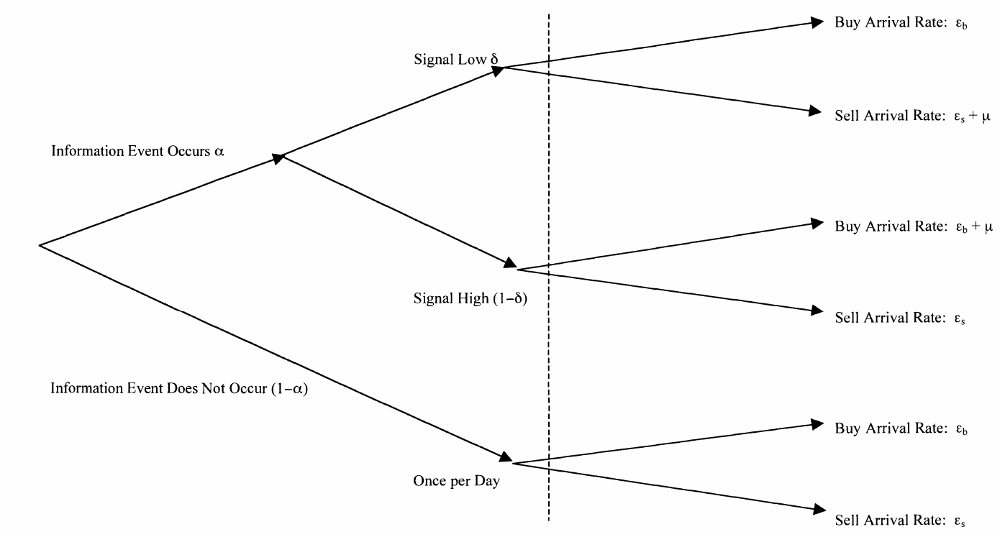

::: article
# Introduction

A large set of finance packages are available in R for an array of tasks
including, among others, portfolio analysis [e.g., see @boudt; @kane:2].
Only a small set of tools is available for the study of intra-daily
transactions, mostly focused on data-management issues. Yet these
represent only the first building block for modelling the dynamics of
asset prices.

In recent years, the rise of algorithmic and high-frequency trading has
shed a bright light on the fact that movements in financial market
prices are largely affected by microstructure forces. In particular,
some traders in the market may enjoy privileged information about the
value of an asset, while others may be trading merely on the basis of
public news. The risk that an individual uninformed trader may face an
informed counterparty in the market-place is then an important
determinant of asset prices [e.g., see @easley_1]. Hence, measuring the
probability that a counterparty enjoys asymmetric information, also
known as probability of informed trading (PIN), allows a trader to
correctly price a security [see @easley_4].

The [*PIN*](https://CRAN.R-project.org/package=PIN) package [@PIN]
provides tools for calculating the probability of informed trading
proposed by @easley_2. This measure is obtained by estimating a model of
strategic interaction between traders with different information sets.
In particular, the probability of informed trading depends on the number
of buy- and sell-trades taking place in the market.

Knowledge about whether a trade is initiated by the buying or selling
party is not always available. In this case, the so-called signing of
trades can be obtained from applying alternative classification
algorithms on trade and quote data, when available [e.g., see @lee].
These functionalities are already offered by excellent packages in R.

To illustrate the complementarity between these data-handling tools and
the *PIN* package, I present a sample application that uses the
[*highfrequency*](https://CRAN.R-project.org/package=highfrequency)
package of @highfrequency. I consider a data set of fictitious trades
and quotes for a given trading day that is well representative of
standard limited order books. This allows me to consider a preliminary
issue surrounding the availability of data. Quotes often need to be
matched to the available trades, in the sense of making the time stamps
of the two consistent with each other. Only after this is done, can the
user compute the number of implicit buy- and sell-trades, estimate the
parameters of the sequential trade model of @easley_2, and compute the
resulting PIN. In other words, I discuss the entire empirical modelling
cycle for the probability of informed trading.

I should stress that typical applications of the PIN focus on the stock
market. This is mostly due to the large availability of accessible data.
However, recent empirical contributions have estimated the PIN for
alternative markets, such as the U.S. government bond market [see @li].
@idier provide an application to the European overnight money market.
This is an over-the-counter market, for which only representative price
quotes are available. Estimating the probability of informed trading on
markets that do not feature a transparent organization of
exchanges---for instance, in the form of an order book or a
market-maker---requires adapting the model of @easley_2 to take into
account the relevant idiosyncratic features. For this reason, the
discussion in this paper focuses on standard market structures, such as
those of today's stock markets, and disregards the more controversial
case of over-the-counter markets.

# R packages for market microstructure analysis

The basic prerequisite for any application in market microstructure is
the availability of proper financial data. Hence, the R developers'
community has proposed a number of efficient and powerful tools to
address the resulting big-data challenge.

The starting point consists in downloading the data set from a provider.
The package [*IBrokers*](https://CRAN.R-project.org/package=IBrokers) by
@ryan provides access to the data-feed supplied by Interactive Brokers
and automates data requests for the creation of high-frequency data
sets.

Given the availability of a financial-market data set, a variety of
excellent functions are available in R for data management, including
data re-shuffling, plotting and computing descriptive statistics.
@kane:2 presents the package
[*orderbook*](https://CRAN.R-project.org/package=orderbook), which
provides data-handling functionalities from limited order books.
@boudt:1 present R functions for managing the trade and quote (TAQ) data
set from NASDAQ and NYSE in R. TAQ data set files are available in
different forms that report different types of information, potentially
involving a detailed structure of the order books. This can easily
result in terabytes of data. For this purpose, Emerson and Kane have
extended the available packages with the aim of handling terabyte-large
data sets[^1].

Only a few tools are available to the user community for the study of
market-microstructure issues in R. @enos present a library for the
computation of trade costs in market transaction of stocks. In a recent
conference presentation[^2], Yan and Zivot discuss the implementation of
models for price impact and discovery in the stock market.

The *RTAQ* package has recently been incorporated into the
*highfrequency* package [@highfrequency]. In this extension, the user is
provided with functions to compute different measures of market
liquidity, such as those of @hasbrouck and @venkataraman. This package
also provides functionalities for classifying trade origination. Not all
the markets provide public information on whether a trade starts either
from the buy-side, or from the sell-side. This is a prerequisite for
studying a large number of topics in market microstructure, including
asymmetric information and informed trading. For this purpose, several
methods have been proposed to infer trade direction from changes in
market prices and quotes. The *highfrequency* package implements an
effective modification of the so-called tick rule proposed by @lee.

# Computing the probability of informed trading

## The theoretical model

@easley_2 build on the sequential trading model of @glosten_milgrom and
@kyle to estimate the probability that a counterpart in the trading
process enjoys superior information. This is based on the assumption
that the market is composed by a heterogeneous population of traders.
Some traders are informed, while others are uninformed.

{#trading_tree
width="100%" alt="graphic without alt text"}

Within each trading day, a competitive market-maker buys or sells a
security at the bid and ask quotes that he or she announce publicly to
the market. Since the market-maker is risk-neutral and competes with the
traders in the transactions, the resulting prices represent the expected
value of the stock conditional on the market-maker's information at the
time of trade.

Before the beginning of a trading day, nature determines whether an
information event relevant to the value of the stock will occur.
Information events are independently distributed and occur with
probability $\alpha$. Good news events take place with a probability
$\delta$ and bad news events occur with a probability $1-\delta$. At the
end of the day, the information set of each actor in the market is
complete and the true value of the stock is realized.

The market-maker knows both the probability of these events taking place
and the arrival order of information to the market. However, he or she
does not know which event is realized. @easley_2 assume that the
market-maker is Bayesian in that they use the information from trade
arrival to update their belief about information events. Since the
information set is independent across days, the model structure allows
the change in beliefs to be considered separately on each day.

In this framework, the market is made by the traders that can observe
the signals about the true stock value and that benefit from asymmetric
information. There are also uninformed traders that receive no news
about the stock price. These two groups of traders enter the market with
a frequency determined by independent Poisson processes at any minute
within a trading day.

An information-revealing event causes informed traders to enter the
market. For instance, if a 'high-value' or 'good' signal materializes,
these traders buy the stock. The arrival of news events both to the
market and to each trader follow independent Poisson processes.

The set of events and associated probabilities can be represented in the
trading tree of Figure [1](#trading_tree). At the first node of the
tree, nature selects whether an information event occurs. If an event
does occur, nature determines the sign of the resulting news. The three
nodes of 'no event', 'good news' and 'bad news' placed before the dotted
line of Figure [1](#trading_tree) occur only once per day. Given the
node selected for the day, traders arrive according to the relevant
Poisson processes. On good-event days, the arrival rates are
$\epsilon+\mu$ for buy orders and $\epsilon$ for sell orders. On
bad-event days, the arrival rates are $\epsilon$ for buys and
$\epsilon+\mu$ for sells. Finally, on days without information-revealing
news, only uninformed traders take part in the market with an arrival
rate of $\epsilon$.

While observing changes in the order book, traders obtain information
about order arrival. However, they cannot observe the underlying motives
for trading by counterparties. In other words, traders do not know the
parameter values of the model consistent with trading patterns. However,
these parameters can be estimated from data on order arrivals.

## Empirical implementation of the theoretical model

In order to reduce the parameter space, it is typically assumed that the
sell- and buy-arrival rates $\epsilon_b$ and $\epsilon_s$ are equal. On
a good-day event, the probability of observing a sequence of buy- and
sell-initiated trades is given by
$$e^{-(\mu+\epsilon) T}\frac{[(\mu+\epsilon)T]^B}{B!}
e^{\epsilon T}\frac{(\epsilon T)^S}{S!}$$ On a bad-signal day, this
probability becomes $$e^{\epsilon T}\frac{(\epsilon T)^B}{B!}
e^{-(\mu+\epsilon) T}\frac{[(\mu+\epsilon)T]^S}{S!}$$ Finally, when
information-revealing events do not take place, the likelihood of
observing orders is equal to $$e^{\epsilon T}\frac{(\epsilon T)^B}{B!}
e^{\epsilon T}\frac{(\epsilon T)^S}{S!}$$

Assuming that trading activity is independent across $T$ days, the
likelihood of trading activity takes the form $$\begin{gathered}
\mathrm{L}\left[\{B, S\}|\theta \right]
= 
(1-\alpha)e^{-\epsilon T}\frac{(\epsilon T)^B}{B!} e^{-\epsilon T}\frac{(\epsilon T)^S}{S!} \\
+\alpha\delta e^{-\epsilon T}\frac{(\epsilon T)^B}{B!} e^{-(\mu+\epsilon) T}\frac{[(\mu+\epsilon)T]^S}{S!} \\
+\alpha(1-\delta) e^{-(\mu+\epsilon) T}\frac{[(\mu+\epsilon)T]^B}{B!}e^{-\epsilon T}\frac{(\epsilon T)^S}{S!} 
\end{gathered}$$ with the parameter space
$\theta={\alpha,\delta,\epsilon,\mu}$. Over $h$ independent days, the
likelihood of observing the data $M = (B_i, S_i)^h_{i=1}$ is the product
of the daily likelihoods

$$\mathrm{L}\left[M|\theta \right]
=
\prod_{i=1}^h \mathrm{L}\left( \theta|B_i,S_i \right)
\label{likelihood}  (\#eq:likelihood)  $$ To deal with the issue of
convergence in numerical maximization, I follow @aktasa and @easley_5,
and re-arrange the likelihood function \@ref(eq:likelihood) as:

$$\begin{gathered}
\mathrm{L}\left[M|\theta \right]
= 
\sum_{t=1}^T\left[ -2\epsilon + M_t \ln x + \left(B_t+S_t\right)\ln(\mu+\epsilon) \right] \\
+
\sum_{t=1}^T\ln\left[ \alpha(1-\alpha)e^{-mu}x^{S_t-M_t} + \alpha\delta e^{-\mu}x^{B_t-M_t} + (1-\alpha)x^{B_t+S_t-M_t}  \right] 
\label{likefun}
\end{gathered}  (\#eq:likefun)  $$

with $M_t = \mathrm{min}(B_t,S_t)+\mathrm{max}(B_t,S_t)/2$, and
$x_t=\epsilon/(\mu+\epsilon)$.

Consistent with the literature [e.g., see @easley_1; @easley_2], the
role of asymmetric information is measured by the probability of
informed trading ($\mathrm{PIN}_t$). This is defined as the
unconditional probability that informed traders buy or sell an asset at
each point in time, and is equal to $$\mathrm{PIN}_t
=
\frac{\alpha\mu}{\alpha\mu+2\epsilon}$$ When this probability is high,
uninformed traders face a higher risk of trading with a counterparty
that is better informed.

The package PIN includes an R function for the computation of the
log-likelihood function \@ref(eq:likefun). This takes as inputs the
parameter values---in the order $\epsilon,\mu,\alpha,\delta$---and the
time series of daily data on number of buy- and sell-initiated
trades---arranged as a $n \times w$ matrix, where $n$ is the number of
trading days. The first column of this data matrix includes the number
of buy trades and the second one has the number of sell trades.

# A practical example

In this section I present an example of how to integrate the PIN package
with other tools available in R for handling market-microstructure data
sets. In particular, the application presented here relies on the
capabilities provided by the *highfrequency* package.

I discuss the computation of PIN using a data set of fictitious quotes
and trades for an ideal stock. These quotes and trades are provided as
two data sets--`sample_qdata` and `sample_tdata`, respectively---in the
public distribution of the package *highfrequency*.[^3]

The noteworthy characteristic of the database for trades and quotes is
that its structure follows the TAQ format for standard NYSE stocks. In
other words, the approach discussed here is general enough to handle a
data source that has been a key reference in the industry.

It should be stressed that the fictitious trades and quotes refer to one
trading day only. This is an evident simplification, which is typically
avoided in empirical studies of PIN. For instance, @easley_1 exclude
stocks that have less than 60 days of quotes and trades data, suggesting
that would disrupt the reliability of the model parameter estimates. The
PIN package allows estimations over any sample length to be run.
Moreover, the application presented in this paper can easily be extended
to cover more than one trading day.

As a starting point, I load the relevant packages into R, including
those required by the *highfrequency* package:

``` r
library(zoo)
library(xts)
library(highfrequency)
library(TTR)
library(timeDate)
library(quantmod)
library(PIN)
```

Then, I prepare the data set for the estimation of PIN. The
*highfrequency* package includes two sample files with the trades and
quotes. These two pieces of information need to be matched, in the sense
of ordering the quoting activity that is consistent with the recorded
trades within a given trading day:

``` r
#Load data samples
data(sample_tdata)
data(sample_qdata)

#Match the trade and quote data
tqdata <- matchTradesQuotes(sample_tdata, sample_qdata)
```

The data set used in this example does not include information on trade
direction. As stressed earlier, this is an issue that is present in
certain markets and can be addressed using the trade classification
algorithms proposed in the finance literature. Here I use the
functionality of the *highfrequency* package to apply the Lee-Ready
approach that combines trading and quoting activity:

``` r
x <- getTradeDirection(tqdata)

tradeDirection <- matrix(x)

buy_side <- which(tradeDirection > 0)

num_buy_side <- length(matrix(buy_side))
num_sell_side <- length(tradeDirection) - length(matrix(buy_side))

ntrades <- cbind(num_buy_side, num_sell_side)
```

The maximization of the log-likelihood function \@ref(eq:likefun) is a
prerequisite for the computation of the PIN. Ideally, one should perform
a constrained optimization and restrict the spaces of all the parameters
over the unit interval $[0,1]$. For this particular data set, I employ
the general optimization routine `optim`:

``` r
initparams <- cbind(0.15, 0.05, 0.5, 0.5) 

options(warn = -1)
param_optim <- optim(initparams, pin_likelihood, gr = NULL, ntrades)
```

The optimizing parameters are 1, 0.3715623, 0.7255069 and 0.2808594.
These estimated values suggest that there is a high probability for the
trading day to reveal information (i.e., $\hat{\alpha}\approx0.72$. When
there are no news events, only uninformed traders take part in the
market ($\epsilon=1$).

Finally, given the optimizing parameters, the computation of the
probability of informed trading is straightforward:

``` r
epsi <- param_optim$par[1]
miu  <- param_optim$par[2]
alph <- param_optim$par[3]
delt <- param_optim$par[4]

pin <- (alph*miu)/(alph*miu + 2*epsi)
```

In this case, I obtain a low probability of trading with an informed
counterparty, which is equal to 0.1187762.

# Conclusion

This article discusses an application in R of concepts and methods of
financial market microstructure. In particular, I present a package for
the computation of the probability of informed trading. This is a
standard measure of asymmetric information that is based on trade
direction. I show how the proposed PIN package fits into the broader
context of the available tools for handling microstructure data.

The routines outlined here could be extended along several dimensions.
It would be useful to include alternative measures of information
asymmetry. The time-varying PIN specification of @easley_5 represents a
relevant candidate. Also, the Volume-Synchronized Probability of
Informed Trading - VPIN - is a key information metric that is
increasingly becoming the industry standard [see @easley_3].

The provision of liquidity to the market is related to the presence of
asymmetric information. This consideration is especially relevant for
market-makers, who manage inventories against the risk that
counterparties have superior information on the true value of an asset.
Hence, any tool that computes the PIN provides an incomplete picture of
the market if it says nothing about the sources for market liquidity.
For this reason, it would be beneficial to provide tools for the
measurement of price pressures, such as those proposed by @menkveld for
the NYSE.

# Acknowledgements

The author is very grateful to two anonymous referees for very effective
comments that have shaped the revision of this article to a major
extent.

\
:::

[^1]: Towards Terabytes of TAQ, R in Finance 2012,
    <http://www.rinfinance.com/agenda/2012/talk/Emerson+Kane.pdf>

[^2]: Estimating the Dynamics of Price Discovery, R in Finance 2012,
    <http://www.rinfinance.com/agenda/2012/talk/Yan+Zivot.pptx>

[^3]: Hence, data for these fictitious trades and quotes are available
    online to the R community.
