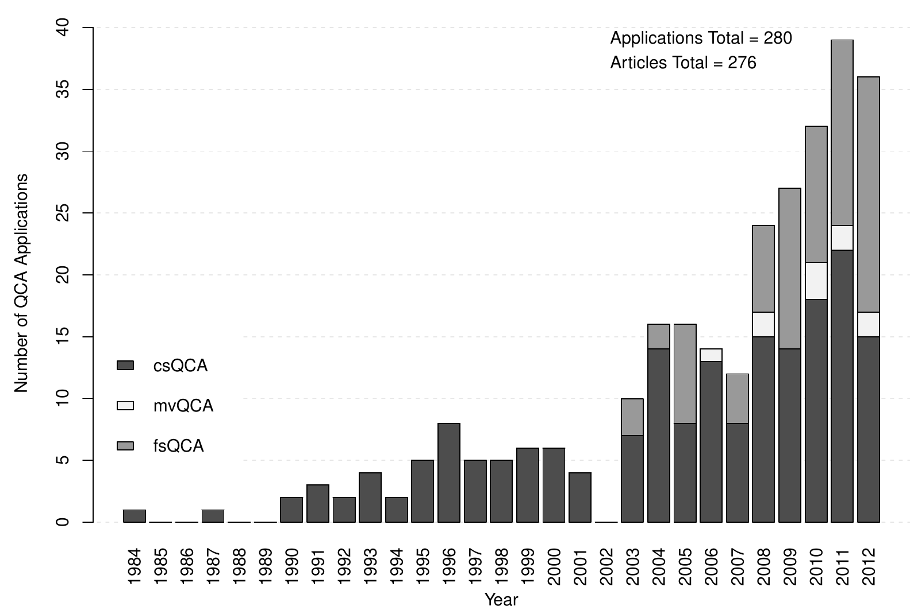
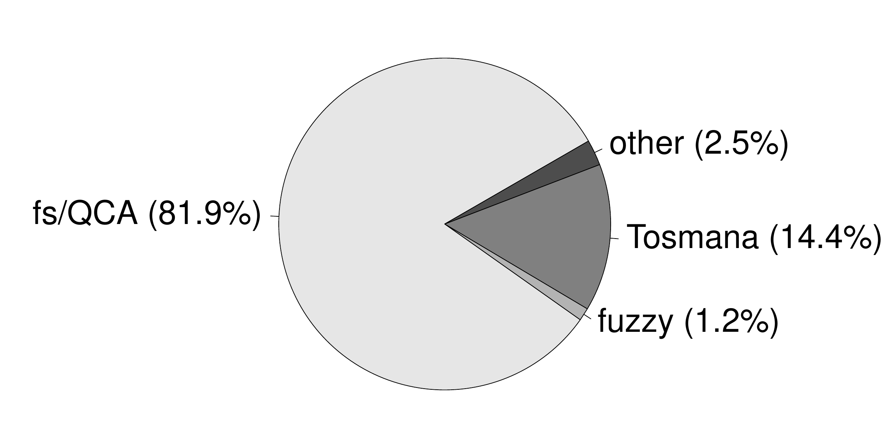

::: article
# Introduction

Qualitative Comparative Analysis (QCA) - a research method popularized
largely through the work of Charles Ragin
[@ragin1987; @ragin2000; @ragin2008] - counts among the most influential
recent innovations in social science methodology. In line with Ragin's
own background, QCA has been initially employed only by a small number
of (political) sociologists [e.g.,
@amenta1992; @griffin1991; @wickhamcrowley1991]. Since then, however,
the method has made inroads into political science and international
relations [e.g., @thiem2011; @vis2009], business and economics [e.g.,
@evans2008; @valliere2008], management and organization [e.g.,
@greckhamer2011], legal studies and criminology
[@arvind2010; @miethe1999], education [e.g.,
@glaesser2011; @schneider2010], and health policy research [e.g.,
@harkreader1999; @schensul2010]. Figure [1](#fig:QCAtrend) charts the
trend in the total number of QCA applications that have appeared in
peer-reviewed journal articles since 1984, broken down by its three
variants crisp-set QCA (csQCA), multi-value QCA (mvQCA) and fuzzy-set
QCA (fsQCA).[^1]

Allowing for a publication lag of about two years, 4.2 applications on
average have been published throughout the first decade following the
introduction of csQCA in @ragin1987. But only his sequel "Fuzzy-Set
Social Science" [@ragin2000] seems to have got the "Ragin Revolution"
[@vaisey2009] eventually off ground. In the years from 2003 to 2007, the
average number of applications had risen to 13.6 before the absolute
number of applications more than tripled from 12 in 2007 to 39 in 2011.
Despite the introduction of fsQCA, applications of csQCA have continued
to increase from four in 2001 to 22 in 2011. In contrast to csQCA and
fsQCA, mvQCA has remained underutilized. Of a total of 280 applications
between 1984 and 2012, only ten have employed this variant. Even when
accounting for the fact that it has been introduced in 2004, 17 years
after csQCA and four years after fsQCA, this represents a
disproportionately low number.[^2]

<figure id="fig:QCAtrend">
<p></p>
<figcaption>Figure 1: Trend in number of QCA applications by variants
and year, and software market share.</figcaption>
</figure>

QCA's methodological success story has created a growing demand for
tailored software, which has been met almost exclusively by two
programmes: Charles Ragin and Sean Davey's [-@ragindavey2009] fs/QCA and
Lasse Cronqvist's [-@cronqvist2011] Tosmana. Until recently, however,
users of non-Windows operating systems were limited as neither programme
ran on other operating systems than Microsoft Windows. As of version
1.3.2.0, Tosmana has also supported other operating systems. In 2008 and
2012, Kyle Longest and Stephen Vaisey's [-@longest2008] fuzzy package
for Stata and Christopher Reichert and Claude Rubinson's
[-@reichert2012] Kirq have been developed as alternatives to fs/QCA. For
the R environment, Adrian Duşa's
[*QCA*](https://CRAN.R-project.org/package=QCA) package has been first
added in 2006 and in 2009, Ronggui Huang [-@huang2011] has released the
[*QCA3*](https://CRAN.R-project.org/package=QCA3) package. The detailed
market shares of these software solutions are also shown in
Figure [1](#fig:QCAtrend).[^3] Holding a clear monopoly, fs/QCA is by
far the most common software with 82%, followed by Tosmana with 14% and
fuzzy with 1%. Other solutions have claimed about 3%, but neither R
package has managed to win any market shares thus far.

Not as unequal as their market shares, but significantly different
still, are the capabilities of these software solutions.
Table [1](#tab:software) provides an overview of the functionality each
programme offers. All alternatives to *QCA* have different capabilities,
but none covers the entire range of basic procedures. Kirq, fs/QCA and
fuzzy cannot handle multi-value sets, whereas Tosmana cannot process
fuzzy sets. The possibility to analyze necessity relations is not
implemented in Tosmana, either, and the other packages, except Kirq,
offer only limited user-driven routines. Complex and parsimonious
solutions can be found by all packages, but only fs/QCA generates
intermediate solutions on an automated basis.

::: {#tab:software}
  -------------------------------------------------------------------------------------------------------------------------------------------------------------------------------------------
  **Function**                                                                                                             Tosmana^b^      Kirq^c^   fs/QCA^d^   fuzzy^e^   QCA3^f^   QCA^g^
  --------------------------------------------------------------------------------------------------------------------- ----------------- --------- ----------- ---------- --------- --------
                                                                                                                            *variant*                                                

  2-7 csQCA                                                                                                                   full         $full$      full        full      full      full

  mvQCA                                                                                                                       full           no         no          no       full      full

  fsQCA                                                                                                                        no           full       full        full      full      full

  (tQCA)                                                                                                                       no            no        full         no       full      full

                                                                                                                         *solution type*                                             

  2-7 complex                                                                                                                 full          full       full        full      full      full

  intermediate                                                                                                                 no          partial     full         no      partial    full

  parsimonious                                                                                                                full          full       full        full      full      full

                                                                                                                           *procedure*                                               

  2-7 necessity tests                                                                                                          no           full      partial    partial    partial    full

  parameters of fit                                                                                                            no           full       full      partial    partial    full

  calibration                                                                                                                partial         no       partial    partial    partial    full

  factorization                                                                                                                no            no         no          no        no       full

  identify (C)SAs                                                                                                             full           no         no          no       full      full

  statistical tests                                                                                                            no            no         no         full     partial     no

                                                                                                                                                                                     

  ^b^ version 1.3.2.0; ^c^ version 2.1.9; ^d^ version 2.5; ^e^ version st0140_2; ^f^ version 0.0-5; ^g^ version 1.0-5                                                                
  -------------------------------------------------------------------------------------------------------------------------------------------------------------------------------------------

  : Table 1: Overview Software Functionality ^a^
:::

The calibration of crisp sets is limited in fs/QCA and *QCA3*. Tosmana
cannot handle fuzzy sets, but it provides more elaborate tools for the
calibration of crisp sets. In addition to Ragin's [-@ragin2008] "direct
method" and "indirect method", fuzzy offers a set-normalizing linear
membership function. Most importantly, it also includes various
statistical procedures for coding truth tables, the appropriateness of
which largely depends on the research design.[^4]

*QCA* combines and enhances the individual strengths of other software
solutions. It can process all QCA variants (including temporal QCA
(tQCA)), generates all solution types, and offers a wide range of
procedures. For example, *QCA* provides four classes of functions for
almost all kinds of calibration requirements and has an automated
routine for the analysis of necessity relations. *QCA* is also the only
package that can factorize any Boolean expression. As in Tosmana and
*QCA3*, simplifying assumptions can also be identified. Unlike Tosmana,
however, which does not present any parameters of fit, *QCA* produces
inclusion, coverage and PRI (Proportional Reduction in Inconsistency)
scores for both necessity and sufficiency relations in mvQCA.[^5]

In summary, a comprehensive QCA software solution has been missing so
far. Researchers have often been limited in their analyses when using
one programme, or they had to resort to different programmes for
performing all required operations. This gap is now filled by the *QCA*
package, which seeks to provide a user-friendly yet powerful
command-line interface alternative to the two dominant graphical user
interface solutions fs/QCA and Tosmana. In the remainder of this
article, we introduce some of the package's most important functions,
including the calibration of sets, the analysis of necessity relations,
the construction of truth tables and the derivation of complex,
parsimonious and intermediate solution types.

# Calibration of sets

The process of translating base variables (also referred to as raw data)
into condition or outcome set membership scores is called calibration,
in fsQCA also fuzzification. In contrast to csQCA, continuous base
variables need not be categorized directly in fsQCA but can be
transformed with the help of continuous functions, a procedure called
assignment by transformation [@verkuilen2005 p. 465]. @ragin2008, for
example, suggests a piecewise-defined logistic function. Sufficient for
the vast majority of fuzzification needs, *QCA* offers the `calibrate()`
function, one of whose flexible function classes for positive end-point
concepts is given in Equation \@ref(eq:posend).

$$\mu_{\mathbf{S}}(b) = 
 \begin{cases}
   0 & \text{if }\tau_{\text{ex}} \geq b,\\
   \frac{1}{2}\left(\frac{\tau_{\text{ex}} - b}{\tau_{\text{ex}} - \tau_{\text{cr}}}\right)^p &
     \text{if }\tau_{\text{ex}} < b \leq \tau_{\text{cr}},\\
   1 - \frac{1}{2}\left(\frac{\tau_{\text{in}} - b}{\tau_{\text{in}} - \tau_{\text{cr}}}\right)^q &
     \text{if }\tau_{\text{cr}} < b \leq \tau_{\text{in}},\\
   1 & \text{if }\tau_{\text{in}} < b.
 \end{cases} 
 \label{eq:posend}  (\#eq:posend)  $$

Here, $b$ is the base variable, $\tau_{\text{ex}}$ the threshold for
full exclusion from set $\mathbf{S}$, $\tau_{\text{cr}}$ the crossover
threshold at the point of maximally ambiguous membership in $\mathbf{S}$
and $\tau_{\text{in}}$ the threshold for full inclusion in $\mathbf{S}$.
The parameters $p$ and $q$ control the degrees of concentration and
dilation. The piecewise-defined logistic membership function suggested
in @ragin2008 is also available. Furthermore, `calibrate()` can generate
set membership scores for sets based on negative or positive mid-point
concepts [@thiemdusa2013 pp. 55-62]. If no suitable thresholds have been
found even after all means of external and internal identification have
been exhausted, *QCA*'s `findTh()` function can be employed for
searching thresholds using hierarchical cluster analysis.

``` r
> library(QCA)
> # base variable and vector of thresholds
> b <- sort(rnorm(15)); th <- quantile(b, c(0.1, 0.5, 0.9))

> # create bivalent crisp set
> calibrate(b, thresholds = th[2]) 
 [1] 0 0 0 0 0 0 0 1 1 1 1 1 1 1 1

> # create trivalent crisp set using thresholds derived from cluster analysis 
> calibrate(b, thresholds = findTh(b, groups = 3))
 [1] 0 0 0 1 1 1 1 1 1 1 1 2 2 2 2

> # fuzzification using Equation (1) 
> round(calibrate(b, type = "fuzzy", thresholds = th), 2)
 [1] 0.00 0.00 0.04 0.32 0.42 0.47 0.48 0.50 0.59 0.72 0.77 0.93 0.94 1.00 1.00

> # negation of previous result
> round(calibrate(b, type = "fuzzy", thresholds = rev(th)), 2)
 [1] 1.00 1.00 0.96 0.68 0.58 0.53 0.52 0.50 0.41 0.28 0.23 0.07 0.06 0.00 0.00

> # fuzzification using piecewise logistic
> round(calibrate(b, type = "fuzzy", thresholds = th, logistic = TRUE), 2)
 [1] 0.02 0.04 0.06 0.25 0.38 0.45 0.46 0.50 0.64 0.79 0.83 0.93 0.93 0.96 0.97
```

# Analysis of necessity

Whenever the occurrence of an event $B$ is accompanied by the occurrence
of an event $A$, then $B$ implies $A$ ($B \Rightarrow A$) and $A$ is
implied by $B$ ($A \Leftarrow B$). Put differently, $A$ is necessary for
$B$ and $B$ is sufficient for $A$. Transposed to the set-theoretic
terminology of QCA, analyses of necessity proceed from the observation
of a value under the outcome set $\mathbf{Y}$ - written
$\mathbf{Y}\{v_{l}\}$ - to the observation of a value under the
condition set $\mathbf{X}$ - written $\mathbf{X}\{v_{l}\}$. For
analyzing necessity inclusion, the decisive question is to which degree
objects are members of $\mathbf{X}\{v_{l}\}$ [and]{.underline}
$\mathbf{Y}\{v_{l}\}$ in relation to their overall membership in
$\mathbf{Y}\{v_{l}\}$. If necessity inclusion is high enough, the
evidence is consistent with the hypothesis that $\mathbf{X}\{v_{l}\}$ is
necessary for $\mathbf{Y}\{v_{l}\}$
($\mathbf{X}\{v_{l}\} \supseteq \mathbf{Y}\{v_{l}\}$). The formula for
necessity inclusion $\mathrm{Incl}_{N}(\mathbf{X}\{v_{l}\})$ is
presented in Equation \@ref(eq:inclNfs).

$$\mathrm{Incl}_{N}(\mathbf{X}\{v_{l}\}) = \frac{\sum^{n}_{i = 1}{\text{min}(\{v_{l}\}x_{i}, \{v_{l}\}y_{i})}}{\sum^{n}_{i = 1}{\{v_{l}\}y_{i}}} 
\label{eq:inclNfs}  (\#eq:inclNfs)  $$

Provided that $\mathbf{X}\{v_{l}\} \supseteq \mathbf{Y}\{v_{l}\}$ is
sufficiently true, *necessity coverage* allows an assessment of the
frequency with which $B$ occurs relative to $A$. The formula for
necessity coverage $\mathrm{Cov}_{N}(\mathbf{X}\{v_{l}\})$ is given in
Equation \@ref(eq:covNfs).

$$\mathrm{Cov}_{N}(\mathbf{X}\{v_{l}\}) = \frac{\sum^{n}_{i = 1}{\text{min}(\{v_{l}\}x_{i}, \{v_{l}\}y_{i})}}{\sum^{n}_{i = 1}{\{v_{l}\}x_{i}}} 
\label{eq:covNfs}  (\#eq:covNfs)  $$

For analyzing necessity relations, *QCA* offers the `superSubset()`
function. If $p_{j}$ denotes the number of values of condition set $j$
with $j = 1, 2, \ldots, k$, the function returns necessity inclusion,
PRI and coverage scores for those of the
$d = \prod_{j = 1}^{k}{(p_{j} + 1)} - 1$ combinations of condition set
values that just meet the given inclusion and coverage cut-offs.[^6]
Therefore, `superSubset()` does not require users to predefine the
combinations to be tested, and so removes the risk of leaving
potentially interesting results undiscovered. The initial set of
combinations always consists of all $\prod_{j = 1}^{k}{p_{j}}$ trivial
intersections
$\left\langle\mathbf{X}_{1}\{v_{1}\}, \mathbf{X}_{1}\{v_{2}\}, \ldots, \mathbf{X}_{1}\{v_{p}\}, \ldots, \mathbf{X}_{k}\{v_{p}\}\right\rangle$.
The size of the intersection is incrementally increased from $1$ to $k$
until its inclusion score falls below the cut-off. If no trivial
intersection passes the inclusion cut-off, `superSubset()` automatically
switches to forming set unions until the least complex form has been
found.

For demonstration purposes, we reanalyze the data from Krook's
[-@krook2010] csQCA on women's representation in 22 Western democratic
parliaments. Countries with electoral systems of proportional
representation ($\mathbf{ES}$), parliamentary quotas ($\mathbf{QU}$),
social democratic welfare systems ($\mathbf{WS}$), autonomous women's
movements ($\mathbf{WM}$), more than 7% left party seats ($\mathbf{LP}$)
and more than 30% seats held by women ($\mathbf{WNP}$) are coded "1",
all others "0". The first five sets are the conditions to be tested for
necessity in relation to the outcome set $\mathbf{WNP}$. For reasons of
simplicity and space, we use lower case letters for denoting set
negation in all remaining code examples.

``` r
> data(Krook)
> Krook
   ES QU WS WM LP WNP
SE  1  1  1  0  0   1
FI  1  0  1  0  0   1
NO  1  1  1  1  1   1
..  .  .  .  .  .   .
<rest omitted>

> superSubset(Krook, outcome = "WNP", cov.cut = 0.52)

             incl   PRI    cov.r 
-------------------------------- 
1  ES+LP     1.000  1.000  0.733 
2  ES+WM     1.000  1.000  0.524 
3  WS+WM+LP  1.000  1.000  0.611 
4  QU+wm+LP  1.000  1.000  0.550 
5  QU+WM+lp  1.000  1.000  0.524 
6  QU+WS+LP  1.000  1.000  0.550 
7  QU+WS+WM  1.000  1.000  0.524 
8  es+QU+WS  1.000  1.000  0.524 
-------------------------------- 
```

When not specified otherwise, all sets in the data but the outcome are
assumed to be conditions. By default, the function tests for necessity,
but sufficiency relations can also be analyzed. No trivial intersection
has passed the inclusion cut-off and `superSubset()` has thus formed
unions of conditions. Substantively, the first combination
$\mathbf{ES} + \mathbf{LP}$ means that having proportional
representation or strong left party representation is necessary for
having more than 30% parliamentary seats held by women.

# Analysis of sufficiency, step 1: Truth tables

Whenever the occurrence of an event $A$ is accompanied by the occurrence
of an event $B$, then $A$ implies $B$ ($A \Rightarrow B$) and $B$ is
implied by $A$ ($B \Leftarrow A$). Put differently, $A$ is sufficient
for $B$ and $B$ is necessary for $A$. Transposed to the set-theoretic
terminology of QCA, analyses of sufficiency proceed from the observation
of a value under $\mathbf{X}$ to the observation of a value under
$\mathbf{Y}$. For analyzing sufficiency inclusion, the decisive question
is to which degree objects are members of $\mathbf{X}\{v_{l}\}$
[and]{.underline} $\mathbf{Y}\{v_{l}\}$ in relation to their overall
membership in $\mathbf{X}\{v_{l}\}$. If sufficiency inclusion is high
enough, the evidence is consistent with the hypothesis that
$\mathbf{X}\{v_{l}\}$ is sufficient for $\mathbf{Y}\{v_{l}\}$
($\mathbf{X}\{v_{l}\} \subseteq \mathbf{Y}\{v_{l}\}$). The formula for
sufficiency inclusion $\mathrm{Incl}_{S}(\mathbf{X}\{v_{l}\})$ is
presented in Equation \@ref(eq:inclSfs).

$$\mathrm{Incl}_{S}(\mathbf{X}\{v_{l}\}) = \frac{\sum^{n}_{i = 1}{\text{min}(\{v_{l}\}x_{i}, \{v_{l}\}y_{i})}}{\sum^{n}_{i = 1}{\{v_{l}\}x_{i}}} 
\label{eq:inclSfs}  (\#eq:inclSfs)  $$

The classical device for analyzing sufficiency relations is the truth
table, which lists all $d = \prod_{j = 1}^{k}{p_{j}}$ configurations and
their corresponding outcome value.[^7] Configurations represent
exhaustive combinations of set values characterizing the objects. For
illustration, a simple hypothetical truth table with three bivalent
condition sets $\mathbf{X}_{1}$, $\mathbf{X}_{2}$ and $\mathbf{X}_{3}$
and the outcome value OUT is presented in Table [2](#tab:hypoTT). Three
bivalent conditions yield the eight configurations listed under
$\mathcal{C}_{i}$. The minimum number of cases $n$ that is usually
required for the respective outcome value is also appended.

::: {#tab:hypoTT}
  ---------------------------------------------------------------------------------------------
  $\mathcal{C}_{i}$    $\mathbf{X}_{1}$   $\mathbf{X}_{2}$   $\mathbf{X}_{3}$   OUT  $n$
  ------------------- ------------------ ------------------ ------------------ ----- ----------
  1                           1                  1                  1            1   $\geq 1$

  2                           1                  1                  0            1   $\geq 1$

  3                           1                  0                  1            1   $\geq 1$

  4                           1                  0                  0            1   $\geq 1$

  5                           0                  1                  1            0   $\geq 1$

  6                           0                  1                  0            C   $\geq 2$

  7                           0                  0                  1            ?   0

  8                           0                  0                  0            ?   0
  ---------------------------------------------------------------------------------------------

  : Table 2: Hypothetical Truth Table
:::

It is important to emphasize that the outcome value is not the same as
the outcome set, the latter of which does not show up in QCA truth
table. Instead, the outcome value is based on the sufficiency inclusion
score, returning a truth value that indicates the degree to which the
evidence is consistent with the hypothesis that a sufficiency relation
between a configuration and the outcome set exists. Configurations
$\mathcal{C}_{1}$ to $\mathcal{C}_{4}$ are *positive* because they
support this hypothesis (OUT = 1), $\mathcal{C}_{5}$ is *negative*
because it does not (OUT = 0). Mixed evidence exists for
$\mathcal{C}_{6}$ (OUT = C). If at least two objects conform to one
configuration, but the evidence neither sufficiently confirms nor
falsifies the hypothesis of a subset relation between this configuration
and the outcome set, contradictions arise. No empirical evidence at all
exists for $\mathcal{C}_{7}$ and $\mathcal{C}_{8}$. If a configuration
has no or too few cases, it is called a logical remainder (OUT = ?).

The `truthTable()` function can generate truth tables for all three main
QCA variants without users having to specify which variant they use. The
structure of the data is automatically transposed into the correct
format.

``` r
> KrookTT <- truthTable(Krook, outcome = "WNP")
> KrookTT

 OUT: outcome value
   n: number of cases in configuration
incl: sufficiency inclusion score
 PRI: proportional reduction in inconsistency

    ES QU WS WM LP OUT n  incl  PRI  
 3  0  0  0  1  0   0  2  0.000 0.000
 4  0  0  0  1  1   1  1  1.000 1.000
 9  0  1  0  0  0   0  1  0.000 0.000
11  0  1  0  1  0   0  4  0.000 0.000
12  0  1  0  1  1   1  1  1.000 1.000
18  1  0  0  0  1   0  1  0.000 0.000
21  1  0  1  0  0   1  1  1.000 1.000
24  1  0  1  1  1   1  1  1.000 1.000
25  1  1  0  0  0   0  3  0.000 0.000
26  1  1  0  0  1   1  1  1.000 1.000
27  1  1  0  1  0   1  1  1.000 1.000
28  1  1  0  1  1   1  2  1.000 1.000
29  1  1  1  0  0   1  1  1.000 1.000
32  1  1  1  1  1   1  2  1.000 1.000 
```

At a minimum, `truthTable()` requires an appropriate dataset and the
`outcome` argument, which identifies the outcome set. If `conditions` is
not provided as an argument, it is assumed that all other sets in the
data but the outcome are the conditions. By default, logical remainders
are not printed unless specified otherwise by the logical argument
`complete`. The logical argument `show.cases` prints the names of the
objects next to the configuration in which they have membership above
0.5.

The `truthTable()` function includes three cut-off arguments that
influence how `OUT` is coded. These are `n.cut`, `incl.cut1` and
`incl.cut0`. The first argument `n.cut` sets the minimum number of cases
with membership above 0.5 needed in order to not code a configuration as
a logical remainder. The second argument `incl.cut1` specifies the
minimal sufficiency inclusion score for a non-remainder configuration to
be coded as positive. The third argument `incl.cut0` offers the
possibility of coding configurations as contradictions when their
inclusion score is neither high enough to consider them as positive nor
low enough to code them as negative. If the inclusion score of a
non-remainder configuration falls below `incl.cut0`, this configuration
is always considered negative. By means of the `sort.by` argument, the
truth table can also be ordered along inclusion scores, numbers of cases
or both, in increasing or decreasing order. If the original condition
set labels are rather long, the logical `letters` argument can be used
to replace the set labels with upper case letters in alphabetical order.

The leftmost column list the configuration row index values from the
complete truth table. Sufficiency inclusion and PRI scores are also
provided in the two rightmost columns. Once the truth table is fully
coded, it can be minimized according to the theorems of Boolean algebra
[@mccluskey1965 pp. 84-89].

# Analysis of sufficiency, step 2: Boolean minimization

The canonical union resulting from the truth table presented in
Table [2](#tab:hypoTT) is given by Equation \@ref(eq:canexp). It
consists of four fundamental intersections (FI), each of which
corresponds to one positive configuration. Generally, all FIs also
represent positive configurations, but not all positive configurations
become FIs. The analyst may decide to exclude some of these
configurations from the minimization process on theoretical or empirical
grounds.

$$\overbracket[1pt]{\mathbf{X}_{1}\cap\mathbf{X}_{2}\cap\mathbf{X}_{3}}^{\mathcal{C}_{1}}{}\cup{}
\overbracket[1pt]{\mathbf{X}_{1}\cap\mathbf{X}_{2}\cap\mathbf{x}_{3}}^{\mathcal{C}_{2}}{}
\cup{}\overbracket[1pt]{\mathbf{X}_{1}\cap\mathbf{x}_{2}\cap\mathbf{X}_{3}}^{\mathcal{C}_{3}}{}\cup{}
\overbracket[1pt]{\mathbf{X}_{1}\cap\mathbf{x}_{2}\cap\mathbf{x}_{3}}^{\mathcal{C}_{4}}{}\subseteq{}\mathbf{Y} 
\label{eq:canexp}  (\#eq:canexp)  $$ If two FIs differ on the values of
one condition only, then this condition can be eliminated so that a
simpler term results. For example, Equation \@ref(eq:canexp) can be
reduced in two passes as shown in Figure [2](#fig:minimize). In the
first pass, the four FIs can be reduced to four simpler terms. In the
second pass, these four terms can then be reduced at once to a single
term. No further reduction is possible, $\mathbf{X}_{1}$ is the only
term which is essential with respect to the outcome
($\mathbf{X}_{1} \subseteq \mathbf{Y}$). All terms that survive the
Boolean minimization process are called prime implicants (PI).

{#fig:minimize width="100%" alt="graphic without alt text"}

The central function of the *QCA* package that performs the minimization
is `eqmcc()` ([e]{.underline}nhanced
[Q]{.underline}uine-[McC]{.underline}luskey) [@dusa2007; @dusa2010]. It
can derive complex, parsimonious and intermediate solutions from a truth
table object or a suitable dataset. In contrast to complex solutions,
parsimonious solutions incorporate logical remainders into the
minimization process without any prior assessment by the analyst as to
whether a sufficiency relation is plausible or not. Intermediate
solutions offer a middle way insofar as those logical remainders that
have been used in the derivation of the parsimonious solution are
filtered according to the analyst's directional expectations about the
impact of each single condition set value on the overall sufficiency
relation of the configuration of which it is part and the outcome set.
By formulating such expectations, difficult logical remainders are
excluded as FIs from the canonical union, whereas those logical
remainders that enter the canonical union are easy. The complex
solution, which is the default option, can be generated by `eqmcc()`
with minimal typing effort.

``` r
> KrookSC <- eqmcc(KrookTT, details = TRUE)
> KrookSC

n OUT = 1/0/C: 11/11/0 
  Total      : 22
  
S1: ES*QU*ws*LP + ES*QU*ws*WM + es*ws*WM*LP + ES*WS*wm*lp + ES*WS*WM*LP

             incl   PRI    cov.r  cov.u
---------------------------------------             
ES*QU*ws*LP  1.000  1.000  0.273  0.091
ES*QU*ws*WM  1.000  1.000  0.273  0.091                                  
es*ws*WM*LP  1.000  1.000  0.182  0.182                                  
ES*WS*wm*lp  1.000  1.000  0.182  0.182
ES*WS*WM*LP  1.000  1.000  0.273  0.273
---------------------------------------
S1           1.000  1.000  1.000
```

The truth table object `KrookTT` that was generated above is passed to
`eqmcc()`. No further information is necessary in order to arrive at the
complex solution. The logical argument `details` causes all parameters
of fit to be printed together with the minimal union `S1`: inclusion
(`incl`), PRI (`PRI`), raw coverage (`cov.r`) and unique coverage
(`cov.u`) scores for each PI as well as the minimal union.[^8] If
`details = TRUE`, the logical argument `show.cases` also prints the
names of the objects that are covered by each PI.

If alternative minimal unions exist, all of them are printed if the row
dominance principle for PIs is not applied as specified in the logical
argument `rowdom`. One PI $\mathcal{P}_{1}$ dominates another
$\mathcal{P}_{2}$ if all FIs covered by $\mathcal{P}_{2}$ are also
covered by $\mathcal{P}_{1}$ and both are not interchangeable [cf.
@mccluskey1965 p. 150]. Inessential PIs are listed in brackets in the
solution output and at the end of the PI part in the parameters-of-fit
table, together with their unique coverage scores under each individual
minimal union. For example, the parsimonious solution without row
dominance applied can be derived by making all logical remainders
available for inclusion in the canonical union as FIs and by setting
`rowdom` to `FALSE`.

``` r
> KrookSP <- eqmcc(KrookTT, include = "?", rowdom = FALSE, details = TRUE)
> KrookSP

n OUT = 1/0/C: 11/11/0 
  Total      : 22 

S1: WS + ES*WM + QU*LP + (es*LP) 
S2: WS + ES*WM + QU*LP + (WM*LP) 

                            ------------------- 
       incl   PRI    cov.r  cov.u  (S1)   (S2)  
----------------------------------------------- 
WS     1.000  1.000  0.455  0.182  0.182  0.182 
ES*WM  1.000  1.000  0.545  0.091  0.091  0.091 
QU*LP  1.000  1.000  0.545  0.091  0.091  0.091 
----------------------------------------------- 
es*LP  1.000  1.000  0.182  0.000  0.091        
WM*LP  1.000  1.000  0.636  0.000         0.091 
----------------------------------------------- 
S1     1.000  1.000  1.000 
S2     1.000  1.000  1.000 
```

The intermediate solution for bivalent set data requires a vector of
directional expectations in the `direxp` argument, where "0" denotes
absence, "1" presence and "-1" neither. The intermediate solution with
all conditions expected to contribute to a positive outcome value when
present is generated as follows:

``` r
> KrookSI <- eqmcc(KrookTT, include = "?", direxp = c(1,1,1,1,1), details = TRUE)
> KrookSI

n OUT = 1/0/C: 11/11/0 
  Total      : 22 

p.sol: WS + ES*WM + QU*LP + WM*LP

S1:    ES*WS + WM*LP + ES*QU*LP + ES*QU*WM 

          incl   PRI    cov.r  cov.u 
------------------------------------ 
ES*WS     1.000  1.000  0.455  0.182 
WM*LP     1.000  1.000  0.636  0.182 
ES*QU*LP  1.000  1.000  0.455  0.091 
ES*QU*WM  1.000  1.000  0.455  0.091 
------------------------------------ 
S1        1.000  1.000  1.000 
```

For intermediate solutions, `eqmcc()` also prints the parsimonious
solution (`p.sol`) whose simplifying assumptions have been used in
filtering logical remainders. The PI chart of this intermediate solution
(`i.sol`) that has been derived from the (first and only) complex and
the (first and only) parsimonious solution (`C1P1`) can then be
inspected by accessing the corresponding component in the returned
object.

``` r
> KrookSI$PIchart$i.sol$C1P1

          4  12 21 24 26 27 28 29 32
ES*WS     -  -  x  x  -  -  -  x  x 
WM*LP     x  x  -  x  -  -  x  -  x 
ES*QU*LP  -  -  -  -  x  -  x  -  x 
ES*QU*WM  -  -  -  -  -  x  x  -  x  
```

If several minimal sums exist under both the parsimonious and complex
solution, the PI chart of the respective combination for the
intermediate solution can be accessed by replacing the numbers in the
`C1P1` component.

Besides the PI chart, the solution object returned by `eqmcc()` also
contains a dataframe of PI set membership scores in the `pims`
component. These scores can then be used to draw Venn diagrams of
solutions, similar to the one shown in Figure [3](#fig:vennSufCS), using
suitable R packages such as
[*VennDiagram*](https://CRAN.R-project.org/package=VennDiagram)
[@chen2011].

``` r
> KrookSI$pims$i.sol$C1P1
   ES*WS WM*LP ES*QU*LP ES*QU*WM
SE     1     0        0        0
FI     1     0        0        0
NO     1     1        1        1
DK     1     1        0        0
NL     0     1        1        1
ES     0     0        0        1
..     .     .        .        .
<rest omitted>
```

{#fig:vennSufCS
width="45.0%" alt="graphic without alt text"}

# Summary

In recent years, Qualitative Comparative Analysis (QCA) has become the
method of choice for testing configurational hypotheses. However, QCA is
still very much a "method in the making". Extensions, enhancements and
alternative algorithms appear on a regular basis
[@baumgartner2009; @eliason2009; @schneider2012; @thiem2012]. R provides
an ideal environment within which established QCA procedures as well as
more advanced techniques can be implemented in a manner as transparent
and user-responsive as possible. The *QCA* package makes a significant
contribution in this regard. It fills the individual gaps in other
programs' coverage of basic functionality, and provides further
improvements through complementary and advanced procedures.

The QCA software market remains dominated by the two graphical user
interface programmes fs/QCA and Tosmana. *QCA* seeks to bridge the
method of QCA with powerful command-line software while retaining a
user-friendly code and command structure. In order to lower the barriers
for social scientists to choosing R for QCA further, we have published
an introductory textbook with extended replications of recent QCA
studies from various research areas [@thiemdusa2013]. Although most
examples have been taken from political science, the book may also be of
interest to researchers from related disciples. At the same time, this
textbook also serves as a comprehensive reference manual for the *QCA*
package.

\

\
:::

[^1]: The number of applications differs slightly from the number of
    articles as four articles have each presented two applications of
    QCA using two different variants. In order to be included in the
    data, applications had to focus primarily on a substantive research
    question, not QCA as a method. All entries have been recorded in the
    bibliography section on <http://www.compasss.org>.

[^2]: See the debate in *Field Methods* for more details on the status
    of mvQCA [@thiem2013; @vink2009; @vink2013].

[^3]: Only 156 out of 276 articles cite the software program that was
    used.

[^4]: As QCA has been initially developed for medium-$n$
    ($\approx$`<!-- -->`{=html}10-30 cases) macro-level data analysis,
    often with universes of objects rather than random samples,
    statistical tests are not only often meaningless but also rarely
    produce statistically significant configurations. With large-$n$
    micro-level data, such tests may be more appropriate.

[^5]: We prefer the term "inclusion" over the more common term
    "consistency" as introduced by @ragin2006 because the measure
    represents the degree to which one set is included by another,
    producing evidence that is either consistent with the underlying
    hypothesis, inconsistent or mixed. The measure is also called
    Inclusion-1 index [cf. @smithson2006 p. 65].

[^6]: The inclusion cut-off always enjoys priority over the coverage
    cut-off.

[^7]: This table is also often called "table of combinations"
    [@mccluskey1965] or "function table" [@hohn1966].

[^8]: Unique coverage scores do not apply to minimal unions.
