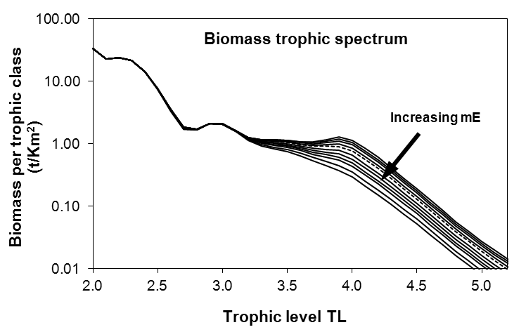
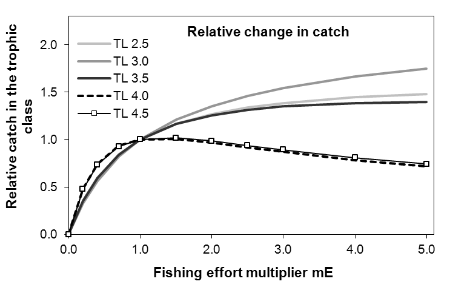
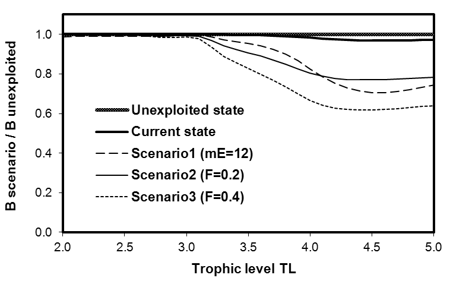
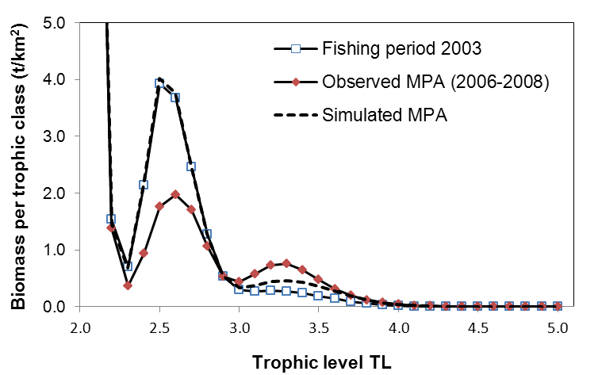
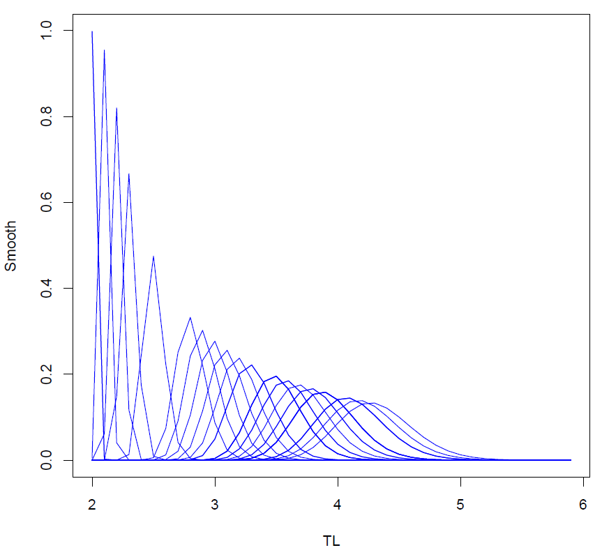

# Introduction

In the face of the global overexploitation of marine resources and the
fast degradation of ecosystems integrity, scientists developed new
modelling approaches at the scale of the ecosystem. In fact, the main
tool used for fisheries regulation is a stock approach which does not
account for the trophic network linking marine ecological components. An
important challenge is to analyze the aquatic ecological networks and
the related impacts of fishery. There are several ways to define and
represent an ecosystem. One widely used approach is based on the trophic
level concept. [@elton_animal_1927] and [@lindeman_trophic-dynamic_1942]
introduced this concept for describing aquatic ecosystems by assigning
integer trophic levels (TLs) to the individual numbers, to the biomass
or to the biological production by its component species. This approach
differentiated between primary producers and detritus ($\text{TL}=1$),
first-order consumers ($\text{TL}=2$), second-order consumers
($\text{TL}=3$) ...The ecosystem is so represented as a pyramid of
number, biomass or production, from low to high TLs.
[@odum_detritus-based_1975] developed this concept by implementing
fractional trophic levels resulting from the diet of the individual and
the trophic level of its preys. The emergence of Ecopath as a widely
used approach and software for modelling aquatic ecosystems
[@polovina_overview_1984; @christensen_ecopath_1992] contributed in a
major way to the prominence of TLs, especially as they were not an
input, but an output of the model (i.e. estimated parameters). As the
use of Ecopath spread worldwide with hundreds of application cases, so
did the trophic level concept.

EcoTroph (ET) is an approach and software for modelling marine and
freshwater ecosystems, entirely articulated around the TL concept
[@gascuel_trophic-level_2005; @gascuel_ecotroph:_2009]. It has been
developed at the same time as the Ecopath worldwide expansion happened
and incorporated into the Ecopath plug-in family
[@gascuel_ecotroph_2009]. The first key idea of ET is that it deals with
the continuous distribution of the biomass in an ecosystem as a function
of continuous TL. The biomass enters the foodweb at $\text{TL}=1$,
generated by the photosynthetic activity of primary producers, or
recycled from the detritus by the microbial loop. Between $\text{TL}=1$
and $\text{TL}=2$, the biomass is composed of mixotrophs only, and is
usually low. If any, it is conventionally split between biomasses at
$\text{TL}=1$ and 2. Then, at $\text{TLs} \ge 2$, the biomass is
composed by heterotrophic organisms with mixed diet and fractional TLs
resulting in a continuous distribution of biomass along TLs. The second
key feature of ET is that the trophic functioning of aquatic ecosystems
is modelled as a continuous flow of biomass surging up the foodweb, from
lower to higher TLs, through predation and ontogenic processes. All the
equations of the model are detailed in
[@gascuel_trophic-level-based_2011]. Such an approach, wherein species
as such disappear, may be viewed as the final stage in the use of the TL
metric for ecosystem modelling. It provides a simplified but useful
representation of ecosystem functioning and impact of fishing. Thus, ET
has been used both in theoretical contexts based on virtual ecosystems
[@gascuel_ecotroph:_2009; @gascuel_trophic-level-based_2011], or in
specific case studies to assess the current fishing impacts at the
ecosystem scale ([@gasche_global_2012], in the South African Benguela
ecosystem, [@lassalle_ecosystem_2012], in the Bay of Biscay,
[@tremblay-boyer_modelling_2011], for a worldwide analysis), or to
analyze the effects of marine protected areas on the whole food web
([@colleter_modelling_2012] in Sénégal, [@valls_modeling_2012] in the
Mediterranean Sea). Furthermore, ET enables the construction of a unique
comparison framework for Ecopath models, the trophic spectrum. This
display, based on ET key ideas, is a graphical representation of the
ecosystem parameters, such as biomass, production, catch, fishing
mortality, etc., along the trophic level [@gascuel_trophic_2005].
Examples of the use of the ET model and the associated trophic spectra
analyses are provided in Figure [1](#figure:example).

<figure id="figure:example">
<table>
<caption> </caption>
<tbody>
<tr class="odd">
<td style="text-align: left;"></td>
<td style="text-align: left;"></td>
</tr>
<tr class="even">
<td style="text-align: left;">(a) Fishing impact on biomass in the
Guinean ecosystem. Simulations refer to various multipliers (mE) of the
current (i.e. 2004) fishing mortalities, from <span
class="math inline">mE = 0</span> (i.e. virgin state) to mE<span
class="math inline"> = 5</span>. Results highlight the strong impact of
the current fishing effort (<span class="math inline">mE = 1</span>,
dashed lines) on the high TLs biomass: biomass is divided by 2 compared
to the virgin state for all trophic levels higher than 3.8. In contrast,
TLs around 3 benefit from a release of predation which approximately
counterbalances the fishing impact.</td>
<td style="text-align: left;">(b) Diagnosis on catch made in the Guinean
ecosystem. Relative values of catch simulated for some trophic classes
are expressed as a function of multipliers of the current fishing
mortalities. Results show that high TLs (<span
class="math inline">TL = 4</span> and 4.5) are fully exploited as an
increase in the fishing pressure leads to a decrease in catch. In
contrast, yields could be increased for the lower TLs. In other words,
increasing fishing pressure would lead to a decrease in the mean trophic
level of catch.</td>
</tr>
<tr class="odd">
<td style="text-align: left;"></td>
<td style="text-align: left;"></td>
</tr>
<tr class="even">
<td style="text-align: left;">(c) Diagnosis on the effect of restricting
fishery in the Port-Cros Marine Protected Area (France, Mediterranean
Sea): trophic spectra of the relative biomass for a total closure of the
fishery and 3 other hypothetical fishing scenarios. Results show that
the MPA fulfills its conservation objective with current biomass very
close to the virgin state for all trophic levels. Conversely, the other
fishing scenarios lead to a significant decrease in the biomass of high
trophic levels. It was concluded that the MPA mostly benefits predators
and the functional trophic biodiversity.</td>
<td style="text-align: left;">(d) Analysis of the Marine Protected Area
effect in the Bolong de Bamboung (Sénégal). Using the ET-Transpose
routine, biomass trophic spectra are built from the 2003 Ecopath model
(before the closure of the fishery) and the 2006–2008 model (enforced
closure). The ET-Diagnosis routine is used to simulate the MPA effect,
starting from the 2003 model and applying a null fishing mortality.
Results show that the closure of the fishery can explain, at least
partially, the increase observed in the biomass of high TLs (<span
class="math inline"> ≥ 3.3</span>). The decrease observed for
intermediate TLs may not only results from a release in predation.
Behavioral (refuge, flee) and environmental effects, that are not
included in the model, may thus explain the observed differences.</td>
</tr>
</tbody>
</table>
<figcaption>Figure 1: <span id="figure:example"
label="figure:example"></span> Examples of the use of the EcoTroph
model: diagnosis on the fishing impact on biomass (a) and catches (b) in
the Guinean Ecosystem (from Gascuel et al, 2011); assessment of a Marine
Protected Area (MPA) in Port-Cros, France (c) (from Valls et al, 2012)
and in the Bolong of Bamboung, Sénégal (d) (from Colléter et al., 2012).
</figcaption>
</figure>

This package is the first attempt to offer interfacing between R and
Ecopath through its plug-in EcoTroph. The plug-in will use R and the
[*EcoTroph*](https://CRAN.R-project.org/package=EcoTroph) [@ecotroph]
package within the free Ecopath with Ecosim software. This enables the
use of ET for a large panel through the plug-in for inexperienced R
users, or directly the R package for the more expert ones. On the
developer side, this way to link a rich user interface (developed in
Microsoft VB) and a well known software in the fishery scientists group
such as R is a way to set up a community. These researchers can so focus
on the model improvements without taking into account the rich user
interface which is time consuming. Along with several functions, we
include an example dataset on the Guinean marine ecosystem
[@gascuel_trophic-level-based_2011] within the package. This article
introduces, using the example dataset, the three main components of
*EcoTroph*:

1.  The data import and validation

2.  The ET-Transpose tool

3.  The ET-Diagnosis tool

A great deal of documentation, both introductory and advanced, is
available on the ET website
(<http://sirs.agrocampus-ouest.fr/EcoTroph>). The *EcoTroph* package
requires the [*XML*](https://CRAN.R-project.org/package=XML) package
[@xml_package] in order to load the model input parameters coming from
the Ecopath software. The `read.ecopath.model` function will parse the
data.

# Data import and validation 

The *EcoTroph* package requires an input data table to run. The user has
to load this dataset under the different possible formats (`.xls`,
`.csv`, `.txt`) with the functions `read.table`, `read.csv`...The
`ecopath_guinee` dataset (Table [1](#tab1)) is an example of a suitable
input table constructed for use with the *EcoTroph* package.

The variable names have to be specified and strictly the same as above:
`group_name` (name of the group representing one or several species
gathered together), `TL` (the trophic level of the group), `biomass`
(the biomass of the group), `prod` (the production on biomass ratio or
P/B) and `accessibility` (the ratio of the group biomass that would be
caught assuming an infinite fishing pressure). These parameters
generally come from Ecopath inputs or outputs, but can also be
independent. The entry `catch.1`, `catch.2`, `catch.whatyouwant` is
necessary if several fisheries do exist. The `OI` column (the omnivory
index, an Ecopath output parameter) is optional, it is used in the
`create.smooth` function for an alternative smooth form
($sigmaLN=\frac{OI}{TL_{j}}$ , see below).

The `check.table` function was developed to check the compatibility of
the input data table with the *EcoTroph* package:

``` r
check.table(ecopath_guinee)
```

In the example, no warning message appears as no error is made. If a
message appears, the user has to correct the dataset in view of the
comments. No missing values (`NA`s) are accepted as input, a yield
column has to be entered with 0-values if no catches are registered. As
well as the yield, the P/B of detritus groups (not entered in Ecopath)
has to be set to 0. The `check.table` function converts the input
dataset into a `"data.frame"` object if it is not already one.

A `read.ecopath.model` function was also implemented. It allows users to
import data in `.xml` format exported from the Ecopath/EcoTroph plug-in
or distributed by a web service (a database of Ecopath models has been
set up to allow a meta-analysis at a world scale,
<http://sirs.agrocampus-ouest.fr/EcoTroph>). This function formats the
inputs so they meet the *EcoTroph* package requirements. Nevertheless,
it is advisable to check the data consistency using the `check.table`
function.

# ET-Transpose tool

## Creation of the Smooth function

The Smooth function returns a table allowing the conversion of data
referring to specific taxons or functional groups (Ecopath trophic
groups for example) into data referring to trophic classes. The major
assumption of this function is that distributions of the trophic groups'
biomass, yield, etc., around their mean trophic level follow a lognormal
curve using the equation:
$$P_{ij}=\frac{1}{(\text{TL}_{i}-\text{shift})\sigma_{j}\sqrt{2\pi}}\exp\left[-\frac{(\ln(\text{TL}_{i}-\text{shift})-\ln(\overline{\text{TL}_{j}}-\text{shift}))^{2}}{2\sigma_{j}^{2}}\right]$$
The lognormal distribution is defined by: a mean (the mean trophic level
of the group, $\overline{\text{TL}}_{j}$), a standard deviation
($\sigma_{j}$ denoted as `sigmaLN` in the R code) which is a measure of
the trophic level variability within the group, and a shift parameter
defining the theoretical trophic level characterised by a null
variability in TL within group.

::: {#tab1}
  -----------------------------------------------------------------------------------------------
       group_name          TL     biomass    prod     catch.1   catch.2   accessibility   OI
  ---- ------------------- ------ ---------- -------- --------- --------- --------------- -------
  1    Whales              4.01   0.0309     0.020    0.000     0.000     0.0             0.059

  2    Dolphins            4.48   0.0433     0.070    0.000     0.000     0.0             0.331

  3    Turtles             2.19   0.0296     0.150    0.000     0.000     0.0             0.338

  4    Sea birds           3.81   0.0013     0.300    0.000     0.000     0.0             0.353

  5    Rays+               3.97   0.3860     0.363    0.012     0.024     0.9             0.329

  6    Sharks+             4.31   0.1050     0.410    0.007     0.003     0.8             0.633

  7    Large pelagics      4.21   0.3840     0.850    0.025     0.069     0.8             0.263

  8    Barracudas+         4.12   0.0583     0.920    0.009     0.022     0.9             0.259

  9    Carangids           4.16   0.0627     1.000    0.010     0.024     0.8             0.139

  10   Horse Makerels+     3.13   2.3330     0.700    0.000     0.115     0.8             0.366

       ...                 ...    ...        ...      ...       ...       ...             ...

  34   Primary producers   1.00   69.0000    84.000   0.000     0.000     0.0             0.000

  35   Detritus            1.00   290.0000   0.000    0.000     0.000     0.0             0.193
  -----------------------------------------------------------------------------------------------

  : Table 1: Data from the Ecopath model of the Guinean ecosystem
  (extracts).
:::

The `create.smooth` function enables the creation of this Smooth
function using several input parameters. The parameter `ecopath`
corresponds to the input data table (`ecopath_guinee` in the example).
The parameter `pas` defining the splitting of trophic classes has by
default a value of 0.1. The parameter `smooth_type` defines the form of
the standard deviation (`sigmaLN`) wanted for the lognormal
distribution. Three options are implemented:

1.  If `smooth_type=1` (choice by default), `sigmaLN` is constant. This
    constant `sigmaLN` is equal to the parameter `sigmaLN_cst` specified
    in the function, and has by default a value of 0.12. The `shift`
    parameter is set equal to 1.8 by default.

2.  If `smooth_type=2`, this is equivalent to
    `sigmaLN=smooth_param*ln(TL-0.05)`. The parameter `smooth_param` of
    this formula (also a parameter of the `create.smooth` function)
    defines the slope of the log-linear trophic level variability
    increase around the mean trophic level of the group. Based on our
    experience gained partially through observations, default parameters
    have been defined as follows: `smooth_param=0.07` and `shift=0.95`.
    (No need to change the `shift` value in the function, let
    `shift=NULL`, it will be automatically set to 0.95 for
    `smooth_type=2`. Same thing for the parameter `smooth_param`.)

3.  If `smooth_type=3`, `sigmaLN` for each group is equal to the
    omnivory index calculated by Ecopath divided by the mean trophic
    level of the group. A warning message will appear if OIs are equal
    to 0, they will be automatically changed to a value of 0.01. The
    parameter `shift` is by default equal to 0. (No need to change the
    `shift` value in the function, let `shift=NULL`, it will be
    automatically set to 0 for `smooth_type=3`.)

The `create.smooth` function returns a table of the distribution of each
mean trophic level within trophic classes (i.e. how a given species or
ecological group, characterized by a given and known mean trophic level,
is distributed around this trophic level). This table will be used in
the next step of the analysis for the construction of trophic spectra.

``` r
# default choice, constant sigmaLN
create.smooth(ecopath_guinee)                              
# sigmaLN = smooth_param*ln(TL-0.05) 
create.smooth(ecopath_guinee, smooth_type = 2)     
```

<figure id="figure:smooth">
<div class="center">

</div>
<figcaption>Figure 2: <span id="figure:smooth"
label="figure:smooth"></span> Output of the <code>plot(smooth)</code>
graphic function, applied to the Guinean ecosystem example. Each curve
represents the distribution across trophic levels for all groups whose
mean trophic level is equal to the mean value of the distribution. Only
curves related to existing groups are displayed.</figcaption>
</figure>

A graphic function, `plot(smooth)`, was developed in order to display
this Smooth function. The input parameter is the table returned by the
`create.smooth` function. It returns a plot with the lognormal curve for
each present trophic class (see Figure [2](#figure:smooth)).

``` r
plot(create.smooth(ecopath_guinee))
```

## Data transposition

The `Transpose` function enables the conversion of data referring to
specific taxons or functional groups (Ecopath trophic groups for
example) into data referring to trophic classes. This function uses the
table returned by the `create.smooth` function. The concerned variables
are the biomasses, or the catches or others ...Using the `Transpose`
function, these variables are distributed continuously along the trophic
classes for each group. This function will be reused in the
`create.ETmain` function to build a summary table with all the variables
calculated by trophic class.

`Transpose` takes as input parameters the table returned by the
`create.smooth` function (`tab_smooth`), the input data table
(`ecopath`), and the name of the column the user wants to distribute by
trophic class (`column`):

``` r
A <- create.smooth(ecopath_guinee)
# Transpose of the biomass column
T_biomass <- Transpose(A, ecopath_guinee, "biomass")
# Transpose of the catch.1 column
Transpose(A, ecopath_guinee, "catch.1")
```

Results can be displayed graphically using the `plot(Transpose)`
function. It takes as input parameter the table returned by the
`Transpose` function (`tab_Trans`). The user has the possibility to use
a log scale for the y-axis (`scale=log`, the minimum value considered on
the graph is conventionally set up at 1/10000 of the total biomass), and
to enter a title (`title`):

`plot(tab_Trans, title = NULL, scale = NULL)` returns the principal
plots according to the selected column, in particular a plot by group
and the associated trophic spectra (see Figure [3](#figure:transpose)).

``` r
# title and log scale for the biomass
plot(T_biomass, title = "biomass", log)
```

![Figure 3: []{#figure:transpose label="figure:transpose"} Output of the
`plot(Transpose)` graphical function applied to the biomass data per
ecological group in the Guinean ecosystem (`ecopath_guinee` dataset).
The top panel displays the distributions for each group, while the
bottom panel displays the biomass trophic spectrum (BTS, i.e. the sum of
all groups).](fig2.png){#figure:transpose width="100%" alt="graphic without alt text"}

## ET_Main table creation

The `create.ETmain` function enables the creation of a summary table,
`ET_Main`, containing the principal variables by trophic class. This
function can be used directly, there is no need of the previous steps
Smooth and Transpose (however these steps are necessary to a good
understanding of the EcoTroph model). It takes as input parameters the
input data table (`ecopath`) and the parameters of the `create.smooth`
function:

``` r
# constant sigmaLN
create.ETmain(ecopath_guinee)
# sigmaLN = smooth_param*ln(TL-0.05)
create.ETmain(ecopath_guinee, smooth_type = 2)
```

In the `ET_Main` output table (Table [2](#tab2)), some parameters
directly come from the input table (biomass `B`, catch `Y_tot`), while
some are calculated based on the definitions of EcoTroph parameters
(e.g. Fishing mortality $Fish\_mort=Y/B$, fishing loss rate
$F\_loss=Y/P$, see details in [@gascuel_ecotroph_2009]).

::: {#tab2}
  ---------------------------------------------------------------------------
  TL    B        B_acc   P         P_acc   Kin     Kin_acc   Y_tot   F_loss
  ----- -------- ------- --------- ------- ------- --------- ------- --------
  1     359.00   0.00    5796.00   0.00    16.14   1.00      0.00    0.00

  2     25.73    0.00    1029.20   0.00    40.00   0.68      0.00    0.00

  2.1   6.26     0.00    13.40     0.00    2.14    0.68      0.00    0.00

  2.2   82.06    0.06    147.64    0.04    1.80    0.68      0.01    0.00

  2.3   11.94    0.27    21.17     0.20    1.77    0.74      0.05    0.00

  2.4   0.62     0.44    0.90      0.57    1.44    1.31      0.24    0.00

        ...      ...     ...       ...     ...     ...       ...     ...
  ---------------------------------------------------------------------------

  : Table 2: `create.ETmain(ecopath_guinee)$ET_Main` results (extracts).
:::

::: {#tab2}
  ----------------------------------------------------------------------------------------------------------------------
  TL    F_loss_acc   N_loss                      Fish_mort   Fish_mort_acc   Selec   Time   N_loss_acc
  ----- ------------ --------------------------- ----------- --------------- ------- ------ ----------------------------
  1     0.00         1.73                        0.00        0.00            0.00    0.00   NaN

  2     0.22         43.41                       0.00        0.15            0.00    0.06   $-$`<!-- -->`{=html}197.08

  2.1   0.22         $-$`<!-- -->`{=html}24.00   0.00        0.15            0.00    0.06   $-$`<!-- -->`{=html}70.66

  2.2   0.22         19.42                       0.00        0.15            0.00    0.11   $-$`<!-- -->`{=html}16.80

  2.3   0.25         31.57                       0.00        0.18            0.02    0.17   $-$`<!-- -->`{=html}10.82

  2.4   0.42         $-$`<!-- -->`{=html}1.89    0.38        0.55            0.70    0.22   $-$`<!-- -->`{=html}6.45

        ...          ...                         ...         ...             ...     ...    ...
  ----------------------------------------------------------------------------------------------------------------------

  : 
:::

``` r
# constant sigmaLN
ET_Main <- create.ETmain(ecopath_guinee)\$ET_Main
ET_Main
```

The `create.ETmain` function also returns intermediate tables, i.e. the
following tables are also contained in the returned list object:

-   `biomass`, the table returned by the `Transpose` function for the
    column biomass.

-   `biomass_acc`, the table `biomass` multiplied by the `accessibility`
    parameter.

-   `prod`, the table corresponding to the production by trophic class.

-   `prod_acc`, the table `prod` multiplied by the `accessibility`
    parameter.

-   `tab_smooth`, the table returned by the `create.smooth` function.

-   `Y`, the table(s) returned by the `Transpose` function for the
    column `catch.(x)`.

``` r
> names(create.ETmain(ecopath_guinee))
[1] "ET_Main" "biomass" "biomass_acc" "prod" "prod_acc" "tab_smooth" "Y"          
```

As previously, we developed a graphic function to display the main
results: `plot(ETmain)`. Different plots are created, e.g. the biomass
trophic spectrum (BTS), the accessible biomass trophic spectrum (ABTS),
the catch trophic spectrum (CTS). It takes as input parameter the list
object returned by the `create.ETmain` function.

``` r
plot(create.ETmain(ecopath_guinee),log)
```

Naturally all the returned graphics are not exhaustive. The user can
construct other ones using the returned list object. Moreover the
`plot(ETmain)` function is implemented with a log scale parameter for
the different trophic spectra. However, this does not always provide a
good representation. We really encourage users to test different scales
for the y-axis. Some plots could be falsely interpreted with no
awareness of the y-axis form importance.

# ET-Diagnosis simulation tool

ET-Diagnosis is used to simulate the effect of different fishery
mortality scenarios on trophic spectra coming from ET-Transpose (see
above). Thus different effort multipliers (`Mul_eff` variable), ranging
conventionally from 0 to 5, are applied to the initial fishing
mortalities $F\tau$. `Mul_eff=0` corresponds to a fishery closure
($\text{F}=0$), and allows users to rebuilt an estimate of the
unexploited status of the studied ecosystem. Flow equations enable the
calculation of the biomasses $B\tau$, the productions $P\tau$ and the
catches $Y\tau$ at the equilibrium for each trophic class and `Mul_eff`.
The other variables contained in the `ET_Main` table are also treated.
We so obtain all the trophic spectra representing the situation at
equilibrium for each `Mul_eff`. Effects of fishery mortality changes at
an ecosystem scale include biomass, accessible biomass, and kinetic
changes but also impacts on the mean trophic level of the catch and the
total biomass. The model provides an overview of the current fishing
impact on the ecosystem (compared to the unexploited state), and some
long term forecasts on the consequences of increasing or decreasing
fishing pressures. This model also enables to see how different
ecosystem functioning hypotheses (values of the extent recycling,
top-down effect) could affect the ecosystem and trophic scale
properties.

ET-Diagnosis is implemented through the `create.ETdiagnosis` function.
It takes as input parameters the list object returned by the
`create.ETmain` function, `Mul_eff` a vector of the different effort
multipliers, and the specific parameters of the ET-diagnosis
simulations:

-   `Beta`, a parameter taking values between 0 and 1, which defines the
    intensity of the biomass recycling by the microbial loop (default
    value set to 0.1)

-   `TopD`, a parameter taking values between 0 and 1, which defines the
    intensity of the top-down control of predators on their preys
    (default value set to 0.2)

-   `FormD`, a parameter taking values between 0 and 1, which defines
    the functional relationship between preys and predators (default
    value set to 0.5)

(cf. package help for more details).

This function returns two types of results for each simulated effort
multiplier: indices calculated at the ecosystem scale for each effort
multiplier, and the catches, biomasses, accessible biomasses,
productions ...for each trophic class.

``` r
ETmain <- create.ETmain(ecopath_guinee)
create.ETdiagnosis(ETmain)
# change of the top-down parameter
create.ETdiagnosis(ETmain, TopD = 0.6)  
```

A graphic function, `plot(m, scale=null, maxrange=null)`, displays the
principal plots coming from the function `create.ETdiagnosis`: the
biomass, predator biomass, catches ratio plots for the different effort
multipliers, and the principle trophic spectra. This function takes as
input parameters the list object returned by the `create.ETdiagnosis`
function (`m`), one scale parameter for the y-axis of the BTS (`scale`,
log or not), and the maximum wanted for the x-axis (`maxrange`).
Naturally all the returned graphics are not exhaustive as users can
construct other ones using the returned list object. As previously
mentioned, we really encourage users to test different scales for the
y-axis. Figure [4](#figure:diagnosis) is one major graphic of the eight
displayed by the function.

``` r
# log scale for the BTS
diag <- create.ETdiagnosis(ETmain)
plot(diag, log)  
```

![Figure 4: []{#figure:diagnosis label="figure:diagnosis"} Simulated
biomass trophic spectra (BTS) of the Guinean ecosystem for various
fishing effort multipliers ranging from 0 (no fishing) to 5. Such a
graph highlights the fishing effects on trophic levels around 2.5 or
higher than 3.4, with larger impact for the top predators (highest TLs).
In contrast, the low and intermediate ones are less
damaged.](fig4.png){#figure:diagnosis width="100%" alt="graphic without alt text"}

# Summary

This article describes the principle functions of the *EcoTroph*
package. The package enables the analysis of fishing impacts on aquatic
trophic networks in a simple way, and also the simulation of various
fisheries in terms of catch (see Figure [1](#figure:example)). New
simulation tools are currently being developed to improve the model and
enable the implementation of more options regarding the fisheries
scenarios. The package is available on the Comprehensive R Archive
Network (CRAN, <http://CRAN.R-project.org/>) and users are encouraged to
provide feedback in order to enhance the tool. All the information
contained in this article is not exhaustive. More details are available
in the package help, and on the website
(<http://sirs.agrocampus-ouest.fr/EcoTroph>). Feel free to contact the
authors for any problem encountered while using the package.

# Acknowledgement

We would like to thank all the persons involved in the development of
EcoTroph. There are now numerous applications of this model available in
the scientific literature and we hope the R package will help to
continue to forge ahead.


