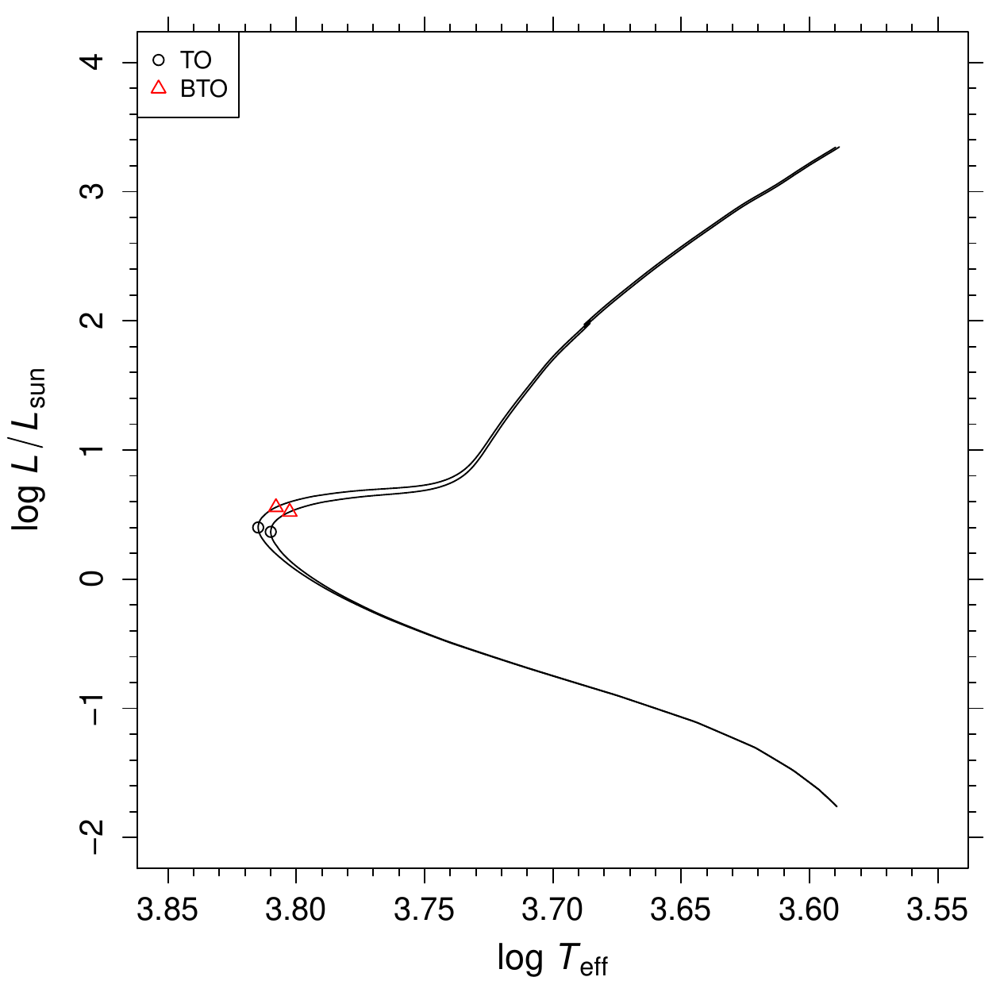
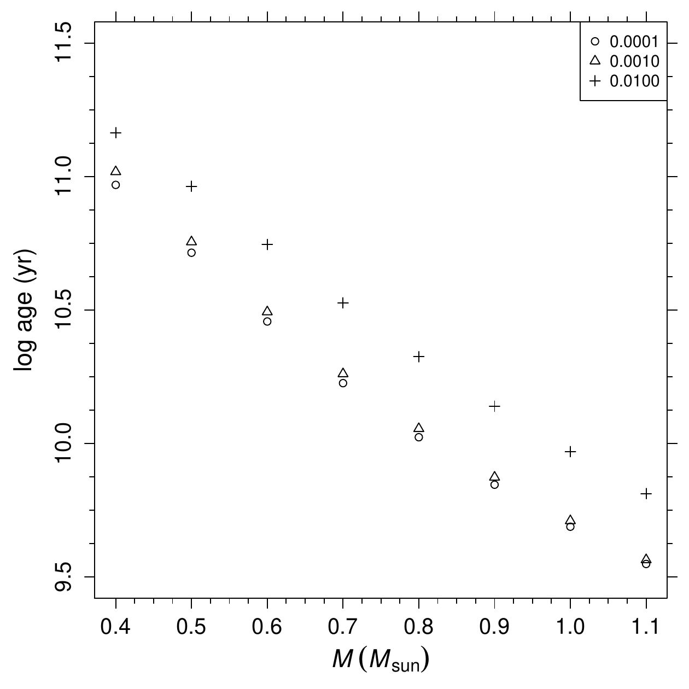

::: article
Due to the advance in the instrumentation, nowadays astronomers can deal
with a huge amount of high-quality observational data. In the last
decade impressive improvements of spectroscopic and photometric
observational capabilities made available data which stimulated the
research in the globular clusters field. The theoretical effort of
recovering the evolutionary history of the clusters benefits from the
computation of extensive databases of stellar tracks and isochrones,
such as @teramo06 [@dotter08; @padova08]. We recently computed a large
data set of stellar tracks and isochrones, "The Pisa low-mass database"
[@database2012], with up to date physical and chemical inputs, and made
available all the calculations to the astrophysical community at the
Centre de Données astronomiques de Strasbourg (CDS)[^1], a data center
dedicated to the collection and worldwide distribution of astronomical
data.

In most databases, the management of the information and the extraction
of the relevant evolutionary properties from libraries of tracks and/or
isochrones is the responsibility of the end users. Due to its extensive
capabilities of data manipulation and analysis, however, R is an ideal
choice for these tasks. Nevertheless R is not yet well known in
astrophysics; up to December 2012 only seven astronomical or
astrophysical-oriented packages have been published on CRAN (see the
CRAN Task View *Chemometrics and Computational Physics*).

The package [*stellaR*](https://CRAN.R-project.org/package=stellaR)
[@stellar] is an effort to make available to the astrophysical community
a basic tool set with the following capabilities: retrieve the required
calculations from CDS; plot the information in a suitable form;
construct by interpolation tracks or isochrones of compositions
different to the ones available in the database; construct isochrones
for age not included in the database; extract relevant evolutionary
points from tracks or isochrones.

# Get stellar evolutionary data

The Pisa low-mass database contains computations classified according to
four parameters: the metallicity $z$ of the star, its initial helium
value $y$, the value of $\alpha$-enhancement of the heavy elements
mixture with respect to the reference mixture and the mixing-length
parameter $\alpha_{\rm ml}$ used to model external convection
efficiency. The values of the parameters available in the database can
be displayed using the function `showComposition()`:

``` r
> showComposition()
Mixing-length values:
         1.7, 1.8, 1.9 

alpha-enhancement values:
	 0, 1  (i.e. [alpha/Fe] = 0.0 [alpha/Fe] = 0.3) 

Chemical compositions:
      z    y.1   y.2   y.3   y.4   y.5   y.6
  1e-04  0.249  0.25  0.27  0.33  0.38  0.42
  2e-04  0.249  0.25  0.27  0.33  0.38  0.42
  3e-04  0.249  0.25  0.27  0.33  0.38  0.42
  4e-04  0.249  0.25  0.27  0.33  0.38  0.42
  5e-04  0.250  0.25  0.27  0.33  0.38  0.42
  6e-04  0.250  0.25  0.27  0.33  0.38  0.42
  7e-04  0.250  0.25  0.27  0.33  0.38  0.42
  8e-04  0.250  0.25  0.27  0.33  0.38  0.42
  9e-04  0.250  0.25  0.27  0.33  0.38  0.42
  1e-03  0.250  0.25  0.27  0.33  0.38  0.42
  2e-03  0.252  0.25  0.27  0.33  0.38  0.42
  3e-03  0.254  0.25  0.27  0.33  0.38  0.42
  4e-03  0.256  0.25  0.27  0.33  0.38  0.42
  5e-03  0.258  0.25  0.27  0.33  0.38  0.42
  6e-03  0.260  0.25  0.27  0.33  0.38  0.42
  7e-03  0.262  0.25  0.27  0.33  0.38  0.42
  8e-03  0.264  0.25  0.27  0.33  0.38  0.42
  9e-03  0.266  0.25  0.27  0.33  0.38  0.42
  1e-02  0.268  0.25  0.27  0.33  0.38  0.42 
```

The table of chemical compositions presents all the $y$ values available
for a given $z$. For a set of parameters, the track files are identified
specifying the mass of the desired model (in the range \[0.30 - 1.10\]
$M_\odot$ ($M_\odot
= 1.99 \cdot 10^{33}$ g is the mass of the Sun), in steps of 0.05
$M_\odot$), while the age (in the range \[8.0 - 15.0\] Gyr, in steps of
0.5 Gyr) is required for the isochrones.

Upon specification of the aforementioned parameters, the *stellaR*
package can import data from CDS (via anonymous ftp) over an active
Internet connection. The CDS data are stored in ASCII format and include
a header with calculation metadata, such as the metallicity, the initial
helium abundance, and the mixing-length. The import is done via a
`read.table()` call, skipping the header of the files.

The following data objects can be downloaded from the database site:

-   Stellar track: a stellar evolutionary track computed starting from
    Pre-Main Sequence (PMS) and ending at the onset of helium flash (for
    masses $M \geq
    0.55$ $M_\odot$) or at the exhaustion of central hydrogen (for
    $0.30 \;
    M_\odot \leq M \leq 0.50 \; M_\odot$). The functions `getTrk()` and
    `getTrkSet()` can be used to access such data; they respectively
    return objects of classes `"trk"` and `"trkset"`.

-   Stellar ZAHB: Zero-Age Horizontal-Branch models. The function
    `getZahb()` can be used to access such data; it returns an object of
    class `"zahb"`.

-   HB models: computed from ZAHB to the onset of thermal pulses. The
    functions `getHb()` and `getHbgrid()` can be used to access such
    data; they respectively return objects of classes `"hb"` and
    `"hbgrid"`.

-   Stellar isochrones: computed in the age range \[8.0 - 15.0\] Gyr.
    The functions `getIso()` and `getIsoSet()` can be used to access
    such data; they respectively return objects of classes `"iso"` and
    `"isoset"`.

Readers interested in details about the computation procedure are
referred to @database2012. The data gathered from CDS are organized into
objects of appropriate classes. The package includes `print` and `plot`
S3 methods for the classes `"trk"`, `"trkset"`, `"zahb"`, `"hb"`,
`"hbgrid"`, `"iso"`, and `"isoset"`.

As an example, we illustrate the recovering of the stellar track for a
model of mass $M=0.80$ $M_\odot$, metallicity $z =0.001$, initial helium
abundance $y=0.25$, mixing-length $\alpha_{\rm ml} = 1.90$,
$\alpha$-enhancement \[$\alpha$/Fe\] = 0.0.

``` r
> track <- getTrk(m = 0.80, z = 0.001, y = 0.25, ml = 1.90, afe = 0)
> track
	 Stellar track

Mass = 0.8 Msun
Z = 0.001 , Y = 0.25 
Mixing length = 1.9 
[alpha/Fe] = 0 

> names(track)
[1] "mass"      "z"         "y"         "ml"        "alpha.enh" "data"     
> class(track)
[1] "trk"     "stellar"
```

The function `getTrk()` returns an object of class `"trk"`, which is a
list containing the track metadata, i.e. the star mass, the metallicity,
the initial helium abundance, the mixing-length and the
$\alpha$-enhancement, and the computed data in the data frame `data`.
Track data contains the values of 15 variables:

``` r
> names(track$data)
 [1] "mod"     "time"    "logL"    "logTe"   "mass"    "Hc"      "logTc"   "logRHOc"
 [9] "MHEc"    "Lpp"     "LCNO"    "L3a"     "Lg"      "radius"  "logg"   
```

The included variables are: `mod` the progressive model number; `time`
the logarithm of the stellar age (in yr); `logL` the logarithm of the
surface luminosity (in units of solar luminosity); `logTe` the logarithm
of the effective temperature (in K); `mass` the stellar mass (in units
of solar mass); `Hc` the central hydrogen abundance (after hydrogen
exhaustion: central helium abundance); `logTc` the logarithm of the
central temperature (in K); `logRHOc` the logarithm of the central
density (in g/cm$^3$); `MHEc` the mass of the helium core (in units of
solar mass); `Lpp` the luminosity of pp chain (in units of surface
luminosity); `LCNO` the luminosity of CNO chain (in units of surface
luminosity); `L3a` the luminosity of triple-$\alpha$ burning (in units
of surface luminosity); `Lg` luminosity of the gravitational energy (in
units of surface luminosity); `radius` the stellar radius (in units of
solar radius); `logg` the logarithm of surface gravity (in cm/s$^2$).

Similarly the part of the track starting from ZAHB and ending at the
onset of thermal pulses can be downloaded with the call:

``` r
> hbtk <- getHb(m = 0.80, z = 0.001, y = 0.25, ml = 1.90, afe = 0)
> hbtk
	 Stellar track from ZAHB

Mass = 0.8 Msun
Mass RGB = 0.8 Msun
Z = 0.001 , Y = 0.25 
Mixing length = 1.9 
[alpha/Fe] = 0 

> names(hbtk)
[1] "mass"      "massRGB"   "z"         "y"         "ml"        "alpha.enh"
[7] "data"     
> class(hbtk)
[1] "hb"      "stellar"
```

Function `getHb()` returns an object of class `"hb"`, which differs from
an object of class `"trk"` only for the presence of the variable
`massRGB`, i.e. the Red-Giant Branch (RGB) progenitor mass.

Usually a set of tracks with different mass and/or metallicity values
are needed for computations. The package *stellaR* provides the function
`getTrkSet()`, which can download a set of tracks with different values
for mass, metallicity, initial helium abundance, mixing-length and
$\alpha$-enhancement. As an example the whole set of masses (from 0.30
to 1.10 $M_\odot$, in steps of 0.05 $M_\odot$), for metallicity
$z =0.001$, initial helium abundance $y=0.25$, mixing-length
$\alpha_{\rm ml} = 1.90$, and $\alpha$-enhancement \[$\alpha$/Fe\] = 0.0
can be downloaded as follows:

``` r
> mass <- seq(0.3, 1.1, by = 0.05)
> trks <- getTrkSet(m = mass, z = 0.001, y = 0.25, ml = 1.90, afe = 0)
> trks
[[1]]
	 Stellar track

Mass = 0.3 Msun
Z = 0.001 , Y = 0.25 
Mixing length = 1.9 
[alpha/Fe] = 0

[[2]]
	 Stellar track

Mass = 0.35 Msun
Z = 0.001 , Y = 0.25 
Mixing length = 1.9 
[alpha/Fe] = 0

...
```

![Figure 1: The evolutionary tracks for masses from $M$ = 0.30 $M_\odot$
to $M$ = 1.10 $M_\odot$ from PMS to He flash. The parameters of the
calculations are: $z$ = 0.001, y = 0.25, $\alpha_{\rm ml}$ = 1.90,
$[\alpha/Fe]$ = 0.0.](fig/tracks.png){#fig:trkset width="100%" alt="graphic without alt text"}

The function `getTrkSet()` returns an object of class `"trkset"`, a list
containing objects of class `"trk"`. The track set can be displayed in
the usual ($\log T_{\rm
eff}$, $\log L/L_\odot$) plane by a call of the function `plot()`:

``` r
> plot(trks, lty = 1:2)
```

The output of the function is shown in Figure [1](#fig:trkset). The plot
is produced by a call to the function `plotAstro()`, which allows the
user to customize several aspects of the plot, such as the axes labels,
the number of minor ticks between two major ticks, the limits of the
axes, the color and type of the lines (as in the example), the type of
the plot (lines, points, both, ...).

The use of the `plot()` function is further demonstrated in Figure
[2](#fig:trkhb), where, for $z$ = 0.001, $y$ = 0.25, $\alpha_{\rm ml}$ =
1.90, \[$\alpha$/Fe\] = 0.0, the evolutionary tracks for $M = 
0.80$ $M_\odot$ from PMS to He flash (black line) and from ZAHB to
thermal pulses (green line) are displayed. The figure is obtained as
follows:

``` r
> plot(track)
> plot(hbtk, add = TRUE, col = "green")
```

![Figure 2: Black line: evolutionary tracks for mass $M$ = 0.80 $M_\odot$,
$z$ = 0.001, $y$ = 0.25, $\alpha_{\rm ml}$ = 1.90, $[\alpha/Fe]$ = 0.0
from PMS to He flash. Green line: evolutionary track from ZAHB to
thermal pulses. ](fig/track-and-hb.png){#fig:trkhb width="100%" alt="graphic without alt text"}

Apart from the plots discussed before, it is easy to display other
relations between the computed variables. In the following example we
get the data for two masses, namely 0.50 and 1.00 $M_\odot$, and plot
the trend of the radius (in units of solar radius) versus the logarithm
of the age for the first 100 models. The resulting plot is displayed in
Figure [3](#fig:radius).

``` r
> trkr <- getTrkSet(m = c(0.5, 1), z = 0.01, y = 0.25, ml = 1.8, afe = 0)
> mydata <- do.call(rbind, lapply(trkr, "[[", "data"))
> D <- subset(mydata, mod <= 100)
> key <- as.numeric(factor(D$mass))
> plotAstro(D$time, D$radius, type = "p", pch = key, ylab = "Radius (Rsun)", 
+    xlab = "log age (yr)")
> legend("topright", c("M=0.50", "M=1.00"), pch = 1:2)
```

![Figure 3: Radius versus the logarithm of the age for the first 100
models of two stars with different mass ($M$ = 0.50 $M_\odot$ and $M$ = 1.00
$M_\odot$) and identical composition, $z$ = 0.01, $y$ = 0.25,$\alpha_{\rm ml}$ = 1.8, $[\alpha/Fe]$ = 0.0. ](fig/radius.png){#fig:radius
width="100%" alt="graphic without alt text"}

Isochrones can be obtained from CDS and plotted in a similar way. As an
example, we get isochrones of 9 and 12 Gyr for $z$ = 0.001, $y$ = 0.25,
$\alpha_{\rm ml}$ = 1.90, \[$\alpha$/Fe\] = 0.0:

``` r
> isc <- getIsoSet(age = c(9, 12), z = 0.001, y = 0.25, ml = 1.90, afe = 0)
> isc
[[1]]
	 Stellar isochrone

Age = 9 Gyr
Z = 0.001 , Y = 0.25 
Mixing length = 1.9 
[alpha/Fe] = 0 

[[2]]
	 Stellar isochrone

Age = 12 Gyr
Z = 0.001 , Y = 0.25 
Mixing length = 1.9 
[alpha/Fe] = 0 

attr(,"class")
[1] "isoset"  "stellar"

> names(isc[[1]])
[1] "age"       "z"         "y"         "ml"        "alpha.enh" "data"     
> names(isc[[1]]$data)
[1] "logL"   "logTe"  "mass"   "radius" "logg"  
```

The function returns an object of class `"isoset"`, a list containing
objects of class `"iso"`. The latter objects are lists containing
metadata (age, metallicity, initial helium abundance, mixing-length,
$\alpha$-enhanchment) and the data frame `data`, which contains the
computed theoretical isochrones data. Figure [4](#fig:iso) shows the set
of isochrones plotted with the commands:

``` r
> plot(isc, lty = 1:2)
> legend("topleft", c("9 Gyr", "12 Gyr"), lty = 1:2)
```

![Figure 4: Isochrones in the theoretical plane for 9 and 12 Gyr.
Calculations performed for $z$ = 0.001, $y$ = 0.25, $\alpha_{\rm ml}$ =
1.90, $[\alpha/Fe]$ = 0.0. ](fig/iso.png){#fig:iso width="100%" alt="graphic without alt text"}

# Tools for interpolating among data structures

Even if the database provides a fine grid of models it is possible that
the specific model needed for a comparison with observational data has
not been calculated. To address this issue, the package *stellaR*
includes tools for constructing new sets of isochrones. The simplest
case is whenever one desires an isochrone for ages not included in the
database, but for a combination of metallicity, initial helium
abundance, mixing-length and $\alpha$-enhanchment existing in the
database. The function `makeIso()` is able to compute the required
isochrones by means of interpolation on a set of tracks. The
interpolation can be performed for age in the range \[7.0 - 15.0\] Gyr.
The user has the choice to explicitly provide to the function a set of
tracks, previously downloaded from CDS, or to specify the required
composition of the tracks to be downloaded for the interpolation. To
show the usage of the function we use the object `trks` downloaded
before to obtain an isochrone of age 9.7 Gyr:

``` r
> iso.ip <- makeIso(age = 9.7, tr = trks)
> iso.ip
	 Stellar isochrone

Age = 9.7 Gyr
Z = 0.001 , Y = 0.25 
Mixing length = 1.9 
[alpha/Fe] = 0 
```

The call produces a result identical to
`makeIso(age = 9.7, z = 0.001, y = 0.25, ml = 1.9, afe = 0)`; in the
latter case the data are taken from CDS before the interpolation
procedure.

The interpolation technique is based upon the fact that all the tracks
contain the same number of points by construction, and that a given
point corresponds to the same evolutionary phase on all the tracks. We
define $S(M)$ as the set of tracks to be used for interpolation,
parametrized by the value of the mass $M$. Let $t_i(M)$ be the
evolutionary time for the $i$th point on the track of mass $M$, and $A$
be the age of the required isochrone. Let $k$ be the point on the track
of lower mass of the set $S(M)$ for which $t_k(M) \geq A$. For each
point $j \geq k$ on the tracks in $S(M)$, a linear interpolation in age
of the values of mass, logarithm of the effective temperature and
logarithm of the luminosity is performed among tracks. These points
define the required isochrone. A potential problem of this simple
procedure will occur whenever massive stars develop a convective core
during the Main Sequence (MS). In this case, as shown for example in
@ginevra2012, the monotonic trend of the evolutionary time -- that
decreases with increasing stellar mass at the end of the MS -- inverts
at the middle of the MS. However the problem will be encountered only
for early-time isochrones, for which the mass at the isochrone Turn-Off
will be in the interval during which the convective core develops. The
procedure outlined in this Section is adequate for construction of
isochrones throughout the range allowed by the function.

## Track interpolation

The package *stellaR* provides also a tool for performing a 3D
interpolation on the database to construct a set of tracks for values of
metallicity, initial helium abundance and mixing-length not included in
the computations available at CDS. The function `interpTrk()` can be
used for this procedure. A call to this function causes the download
from CDS of the sets of tracks needed for the interpolation.

The new set of tracks is computed by means of a linear interpolation.
The metallicity is log-transformed before the interpolation procedure.
Let $T_{z,y,\alpha_{\rm ml}}(M)_i$ be the $i$th point in the data set
containing the evolutionary time, the effective temperature and the
logarithm of surface luminosity for the track of mass $M$ and given
composition. The interpolation algorithm proceeds as follows:
$$\overbrace{T_{z,y,\alpha_{\rm ml}}\left(M\right)_i}^{\rm 8 \; sets} \rightarrow 
\overbrace{T_{z,y,*}\left(M\right)_i}^{\rm 4 \; sets} \rightarrow
\overbrace{T_{z,*,*}\left(M\right)_i}^{\rm 2 \; sets} \rightarrow 
\overbrace{T_{*,*,*}\left(M\right)_i}^{\rm 1 \; set}$$ The symbol $*$
means that interpolation occurred in the substituted variable. The
selection of the set of tracks which enter in the interpolation is based
upon the identification of the vertexes of the cell of the ($z$, $y$,
$\alpha_{\rm ml}$) space containing the point identified by the required parameters.
Then, for all the 17 masses at the vertexes, the linear interpolation
described above is performed. In the worst case scenario, whenever none
of the supplied parameters values exists in the database, the
interpolation requires $2^3 = 8$ sets of 17 masses. The algorithm is
however able to reduce the dimensionality of the process if some of the
variable values exist in the database.

As a demonstration, let us compute a set of tracks with mixing-length
value $\alpha_{\rm ml}$ = 1.74, $z$ = 0.002, $y$ = 0.25, \[$\alpha$/Fe\]
= 0.0:

``` r
> ip.trk <- interpTrk(z = 0.002, y = 0.25, ml = 1.74, afe = 0)
```

Since the values of $z$ and $y$ exist in the database, only an
interpolation on the mixing-length value is performed by the function.
The set of tracks can be used for isochrone construction, like a
standard set of tracks:

``` r
> ip.iso <- makeIso(age = 12, tr = ip.trk)
```

# Keypoints extraction

Important stages in the evolution of a star are defined as
\"keypoints\", e.g. hydrogen core exhaustion, Turn-Off luminosity, RGB
tip luminosity. To simplify their extraction the package *stellaR*
provides the function `keypoints()`, which operates on an object of
class `"trk"` or `"iso"`.

The function extracts from the data stored in objects of class `"trk"`
the rows of the data frame relative to the following evolutionary
stages:

1.  *ZAMS.* : Zero-Age Main-Sequence, defined as the point for which the central H
    abundance drops below 99% of its initial value.

2.  *TO.* : Turn-Off, defined as the point for which the effective temperature
    reaches its maximum value. If multiple lines satisfy the constraint,
    the values of all the rows are averaged.

3.  *BTO.* : Brighter Turn-Off, defined as the point for which the effective
    temperature drops below the temperature of the TO minus 100 K. This
    point can not exist for low masses. Details on the advantages of
    this evolutionary point with respect to the TO can be found in @Chaboyer1996 .

4.  *exHc.* : Central H exhaustion, defined as the point for which the central H
    abundance is zero. For low masses the point can coincide with TO.
    This is the last point of the tracks with mass lower or equal to
    0.50 $M_\odot$.

5.  *Heflash.* : Helium flash, the last point of the track for masses higher than
    0.50 $M_\odot$.

When the function is called on an object of class `"iso"` it returns a
data frame containing only TO and BTO phases.

In both cases the function inserts in the returned data frame the
columns relative to mass (or age for isochrones), metallicity, initial
helium abundance value, mixing-length, $\alpha$-enhancement, and
evolutionary phase identifier.

As a demonstration we extract the TO and BTO points from the object
`isc` generated in a previous example:

``` r
> kp <- keypoints(isc)
> kp
          logL    logTe      mass  radius     logg age     z    y  ml alpha.enh id
TO   0.4044723 3.816652 0.8396903 1.23558 4.178911   9 0.001 0.25 1.9         0  1
BTO  0.5556971 3.809943 0.8561162 1.51671 4.009265   9 0.001 0.25 1.9         0  2
TO1  0.2917250 3.803611 0.7772973 1.15234 4.205965  12 0.001 0.25 1.9         0  1
BTO1 0.4495597 3.796545 0.7909500 1.42768 4.027426  12 0.001 0.25 1.9         0  2
```

The points can be easily superimposed to the isochrones in the
theoretical plane. The top panel of Figure [5](#fig:keypoints) is
obtained with the following commands:

``` r
> plot(isc)
> points(logL ~ logTe, data = kp, pch = id, col = id)
> legend("topleft", c("TO", "BTO"), pch = 1:2, col = 1:2)
```

As a last example we extract a set of tracks for masses in the range
\[0.40 - 1.10\] $M_\odot$ and three metallicity values $z$ = 0.0001,
0.001, 0.01 and we display the time of exhaustion of central hydrogen as
a function of the mass of the star (bottom panel in Figure
[5](#fig:keypoints)).

``` r
> mT <- seq(0.4, 1.1, by = 0.1)
> zT <- c(0.0001, 0.001, 0.01) 
> tr <- getTrkSet(m = mT, z = zT, y = 0.25, ml = 1.9, afe = 1)
> kp <- keypoints(tr)
> kpH <- subset(kp, id == 4)
> symbol <- as.numeric(factor(kpH$z))
> plotAstro(kpH$M, kpH$time, type = "p", pch = symbol, xi = 0.1, 
+    xlab = expression(italic(M) ~ (italic(M)[sun])), ylab = "log age (yr)")
> lab <- format(sort(unique(kpH$z)), nsmall = 4, scientific = FALSE)
> legend("topright", lab, pch = 1:3)
```

<figure id="fig:keypoints">
<p></p>
<figcaption>Figure 5: Left panel: same as Figure 4. The position of
Turn-Off (TO) and Brighter TO (BTO) are shown. Right panel: time to
exhaustion of central hydrogen as a function of the mass of the star.
The symbols identify the values of the metallicity z from 0.0001 to
0.01.</figcaption>
</figure>

# Summary

This paper demonstrated how the package *stellaR* can be useful to the
astrophysical community as a tool to simplify the access to stellar
tracks and isochrone calculations available on-line. A set of tools to
access, manipulate and plot data are included in the package and their
usage was shown. The interpolation functions included in the package can
be used to safely produce tracks or isochrones at compositions not
included in the database, without the need that users develop software
on their own. A planned extension of the package is the modification of
the algorithm of isochrone construction to make the calculation of
isochrones of young ages feasible. This step can be useful in view of a
possible extension of the Pisa database to higher masses, or to
manipulation of data stored in other databases. In fact, while the
package is currently developed for accessing data from the Pisa low-mass
database, other public databases can be in principle accessed in the
same way. This step is however complicated by the fact that no standard
for the stellar model output exists in the astrophysical community,
requiring the individual adaptation of the interface functions for each
data set.

# Acknowledgments

We are grateful to our anonymous referees for many stimulating
suggestions that helped to clarify and improve the paper and the
package. We thank Steve Shore for a careful reading of the manuscript
and many useful suggestions.

\

\
:::

[^1]: via anonymous ftp from <ftp://cdsarc.u-strasbg.fr> or via
    <http://cdsarc.u-strasbg.fr/viz-bin/qcat?J/A+A/540/A26>
