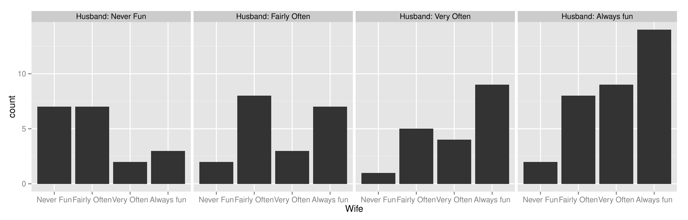
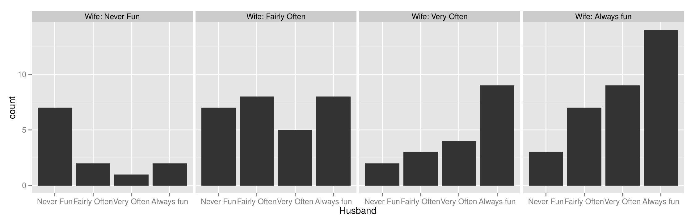

::: article
# Introduction

One of the attractive features of R and its package system is that it
allows the use of real datasets in the examples and vignettes to
demonstrate statistical analyses. While we usually associate R with
statistical methodology, it is hard to underestimate its impact as a
data archive and dissemination tool. R has long ago overtaken data
archives such as StatLib [@dasl] or OzDASL [@ozdasl] in scope and users.
There are over 3000 data objects included in the 1001 packages available
on CRAN, that have been submitted just before or after the release of R
2.15.2 (Trick or Treat) on Oct 26 2012. Not all of the objects are
datasets in the traditional sense, that we deal with a two dimensional
object with variables in the columns and records in the rows, but we
were able to extract information on the numbers of columns and rows for
2428 of them. Figure [1](#tab:data) gives a summary of the number of
packages and the number of associated datasets. A table of all packages
and associated data objects can be found at
<http://www.public.iastate.edu/~hofmann/data_in_r_sortable.html>.

For some of these datasets, graphics are also included, though the
emphasis is usually more on modelling and analysis. In this article we
want to show the value of including more graphics in R examples and to
illustrate how they complement modelling.

{#tab:data width="100.0%" alt="graphic without alt text"}

Graphics help identify data quality issues; they reveal dataset
structure and support the interpretation of results. The examples given
here are taken from various packages and are more of a convenience
sample than a random sample. In each case we give a brief description of
the dataset, a reference to the dataset description in R, and sometimes
some additional relevant information. We offer a selection of graphics,
each one pointing out some feature of the dataset, and the code to
produce them. Given the power of R's graphical tools and how easy it is
to draw graphics, there is no need to restrict ourselves to a single
all-encompassing display for a dataset. Instead, we recommend drawing
many graphics to ensure that most, if not all, aspects of the dataset
are presented. This approach takes up a lot of space in a printed copy,
but is easy to use on a computer screen or a webpage.

We would like to see more use made of graphics with R, though only if
each additional graphic conveys additional information. There is no
value in drawing more graphics just because we can; they all have to
tell a story. For each of the graphics in this article we have attempted
to explain what particular information can be gathered from it.
Sometimes there is overlap, in that the same information may be visible
in more than one graphic. Also there may be alternative graphics readers
might prefer to have drawn for presenting the same information. Graphics
will always be very much a matter of taste and experience. As long as we
are prepared to consider many graphics, we should be able to find good
ones, which convey the information we want to draw attention to
effectively.

Of course, graphics alone are not enough, just as analysis alone is
rarely enough. We do not discuss any modelling here, as we concentrate
on what graphics can contribute. Occasionally, we do point out where
modelling would be especially useful in checking or confirming an idea
discovered from a graphic. In many cases a suitable model is obvious; in
some others it is uncertain if there is any model that would do.
Graphical displays are able to draw our attention to unusual features in
a dataset, which we can recognise as being interesting without being
clear how to test for them.

# Examples

## Anorexia - MASS

This dataset is used in the
[*MASS*](https://CRAN.R-project.org/package=MASS) package [@MASS] to
illustrate a linear model fit, using `glm`. No plot is given with the
example code. The data is also used in many other packages such as
[*granova*](https://CRAN.R-project.org/package=granova) [@granova] where
some complex plots are provided. The original source is @hand:smalldata
who recommend "whichever statistical technique is employed, it is
instructive to look at the three scatterplots of after/before".
Curiously, none of the R users of the data follow this advice.

The dataset contains pre- and post-treatment weights for 72 young girls
being treated for anorexia. Three treatment groups are considered:
cognitive behavioural therapy (CBT), family therapy (FT) and a control
group (Cont). We suggest adding code to the help page for the anorexia
dataset (`?anorexia`) starting with:

``` r
data(anorexia, package = "MASS")
require("ggplot2")
qplot(data = anorexia, Treat, xlab = "", ylab = "")
```

This results in a barchart of the numbers in the three groups shown in
Figure [2](#anorexiaG). This plot, as all of our plots, is drawn with
the packages [*ggplot2*](https://CRAN.R-project.org/package=ggplot2)
[@ggplot2] and [*vcd*](https://CRAN.R-project.org/package=vcd)
[@meyer06] and weaved into the document with
[*knitr*](https://CRAN.R-project.org/package=knitr) [@knitr].

{#anorexiaG width="60.0%" alt="graphic without alt text"}

> *Story of Figure [2](#anorexiaG)*: This plot shows 'just' data
> structure, but surprisingly the three groups are not of equal size.
> This may mean that some girls dropped out or that it was an
> observational study without random allocation of the participants, or
> there could be another explanation altogether. This should be borne in
> mind in interpreting the results.

Figure [3](#anorexia1) shows -- as originally suggested by
@hand:smalldata -- scatterplots of the weights of the girls in the three
treatment groups. A simple version of this plot can be achieved with the
code below:

``` r
## Suggested addition for ?anorexia (Cont.)
## - Simple
qplot(Prewt, Postwt, data=anorexia, colour=Treat, facets=.~Treat) + 
  xlim(c(68,105)) + ylim(c(68,105))
```

{#anorexia1 width="100%" alt="graphic without alt text"}

A more polished variation also includes guide lines and leads the
following code and Figure [3](#anorexia1).

``` r
## - Polished
limits <- with(anorexia, range(c(Prewt, Postwt)))
limits <- limits + 0.05*c(-1,1)*limits

ggplot(data=anorexia, aes(x=Prewt, y=Postwt, colour=Treat)) + 
  coord_equal(ylim=limits, xlim=limits) +
  xlab("Pre-treatment weight (lbs)") +  
  ylab("Post-treatment weight (lbs)") + 
  geom_abline(intercept=0, slope=1, colour="white", size=1.25) + 
  geom_point(size=3) +
  facet_grid(.~Treat) + 
  scale_colour_discrete(guide="none")
```

> *Story of Figure [3](#anorexia1)*: This plot gives a preliminary
> overview of the data. We learn that there were differences in the
> weight gains between the treatment groups. Girls in the control group
> tended to have lower post-weight, and roughly half lost weight. Girls
> in the family treatment group fall into two clusters: girls in one
> group tended to respond well to this treatment and gained weight, but
> for a small group of four girls this treatment was not successful.
> Similarly, there appear to be two groups of girls in the CBT group: a
> group of about eight girls responded well to the treatment, but a
> larger group of girls did not respond well.

A general linear model to fit post-treatment weight given pre-treatment
weight is suggested in the existing help file of the function `glm`, as
shown below. To this, we add graphical support as shown in
Figure [4](#anorexia2), which displays plots that support a linear model
with change in weight plotted against pre-treatment weight. A guideline
is drawn at zero. Noticeable differences can be seen between the
treatments. This results in the following overall code:

{#anorexia2 width="100%" alt="graphic without alt text"}

``` r
## Existing example code
?glm
anorex.1 <- glm(Postwt ~ Prewt+Treat+offset(Prewt), family = gaussian, data = anorexia)
summary(anorex.1)

## Suggested addition
ggplot(data=anorexia, 
  aes(x=Prewt, colour=Treat, y=(Postwt-Prewt)/Prewt*100)) + 
  xlab("Pre-treatment weight (lbs)") +  
  ylab("Percent change in weight (in lbs)") +
  geom_hline(yintercept=0, size=1.25, colour="white") + 
  geom_point(size=3) +   
  facet_grid(.~Treat)+
  scale_colour_discrete(guide="none")
```

> *Story of Figure [4](#anorexia2)*: There are differences in the weight
> gain between the treatments, but there is also a lot of individual
> variation. For some girls the two treatment methods clearly did not
> help them to gain weight. More girls in the control group failed to
> gain weight -- only the very low weight girls gained much weight,
> which suggests that other influences may have been at work for these
> girls. The original data description indicates that intervention
> methods were used for the lightest girls. Generally there appears to
> be an association that the heavier girls, all still under normal
> weight, gained less weight than the lighter girls.

Various decisions were made in producing these plots to make them more
informative.

-   A raw data overview plot shows the data "straight out of the box".
    Such plots help the reader to identify any major issues with the
    data, such as extreme values or clusters.

-   Colour was used to draw attention to the primary comparison of
    distributions of treatments. Facetting was chosen over plotting on
    the same plot because of the considerable variation within
    treatments, which makes it difficult to evaluate differences. Note
    that facetting, lattice structures [@lattice], or trellis plots
    [@trellis] all describe the process of positioning plots of
    different, usually mutually exclusive, subsets of the data next to
    each other. The subsetting is usually done by conditioning on
    co-variates. Conditioning has a central role in statistical data
    analysis, and finds its visual expression here.

-   Guides for assisted viewing may be added, in this case the x = y
    line to determine which girls gained or lost weight. In other
    situations we could also employ data driven guides, such as
    contours, to focus attention on patterns.

-   The restructured data plot shows the data as a support for the
    model. Although weight change is not the precise match to the
    response variable, the model is implicitly exploring this. It also
    allows reading of the weight change in a vertical direction instead
    of the off-diagonal view in the raw data plot. The horizontal guide
    line at zero allows the reader to see which girls gained weight.
    Using a scatterplot enables the reader to see the nuances of the
    data, such as clusters of girls who do well in one treatment, or
    fail to respond, and the indication that intervention may have been
    applied to the very underweight girls.

## Lanza - HSAUR2

The `Lanza` data [@hsaur; @Lanza] consists of four clinical studies on
the use of the drug Misoprostol to prevent gastrointestinal damage.
Damage was measured as an ordinal response `classification` with levels
1 to 5 corresponding to a specified number of haemorrhages (with 1 being
the fewest and 5 the most). The visualisation given in `?Lanza` is a set
of four mosaicplots (without obvious information on which study is
shown) shaded by residuals for an independence model.

Rather than a modelling result, we suggest the use of barcharts as a
first introduction to the data. A simple barchart of study by treatment
(not shown here) shows that all studies were balanced and that studies I
to III had comparable numbers of patients, whereas study IV was smaller
with just less than half the number of participants of the other
studies. Breaking down the data further by the damage scores gives the
multiple barcharts shown in Figure [5](#Lanza.barchart), requiring a
single line extension of the existing code as shown below. We are making
use of the small multiples paradigm [@tufte; @trellis] to show study
outcome in terms of number of haemorrhages in subsets by clinical trial
and treatment:

{#Lanza.barchart width="100%" alt="graphic without alt text"}

``` r
## Existing code
data(Lanza, package="HSAUR2")

## Suggested example code for ?Lanza
qplot(classification, geom="bar", facets=treatment~study, data=Lanza)
```

> *Story of Figure [5](#Lanza.barchart)*: All of the barcharts suggest
> that Misopropol is an effective drug for controlling or preventing
> haemorrhaging - in every study patients in the active treatment group
> reported better end results than the Placebo group. The distribution
> of these results was very similar for studies I and III, with the bulk
> of people in the Misopropol group being classified as '1', and the
> bulk of patients in the Placebo group classified as '5'. Study II
> showed a larger spread and less structure in the results for the
> Placebo group, while study IV showed the strongest distinction between
> results for the two treatment groups. Patients in treatment group IV
> also showed a different pattern of resulting haemorrhaging. Even in
> the active treatment group, the most frequent response was '3' - which
> might indicate, together with the relatively low number of patients,
> that study IV was done for a different target population with possibly
> more affected individuals.

Figure [6](#Lanza.mosaic) is closer to the modelling approach suggested
by the existing help file. The code for showing this figure is:

``` r
## Suggested addition for ?Lanza (Cont.)
levels(Lanza$treatment) <- c("P", "M")

require(vcd)
colors <- c("grey80", "darkred")
mosaic(treatment ~ classification | study, highlighting_fill=colors, data=Lanza)
```

{#Lanza.mosaic width="90.0%" alt="graphic without alt text"}

> *Story of Figure [6](#Lanza.mosaic)*: A mosaic shows estimates of the
> conditional probability of being in the active treatment group given a
> particular haemorrhaging classification was reported. Since we know
> from our initial overview that treatment groups were balanced, this
> conditional probability is proportional to the conditional probability
> of seeing a specific outcome given treatment group, which is what we
> are more interested in, given the setup of the study. Again, we see
> that all four studies suggest a high effectiveness of Misopropol in
> terms of preventing haemorrhaging, since the presence of patients
> treated with Misopropol decreases with an increase of haemorrhages.
> Again, the different number of patients in study IV is visible (from
> the lower height of the rectangles in the last row of the plot), as
> well as its stronger separation of haemorrhaging outcomes between
> treatment groups.

## schizophrenia2 - HSAUR2

The `schizophrenia2` data are from a ten-month longitudinal study
following 44 individuals suffering from episodes of schizophrenia. Every
two months (except at 4 months after the study began) individuals
reported whether the disorder was in an active state (`present`) or
dormant (`absent`). Additionally, the data contain information about age
at onset of the disease: under the age of 20 or, less often, over the
age of 20.

The current help file presents a mosaicplot as an overview of the data,
which we basically agree with, albeit we would like to suggest changes
to the default values to emphasise various features in the data:

``` r
## Existing code
data("schizophrenia2", package = "HSAUR2")
mosaicplot(xtabs( ~ onset + month + disorder, data = schizophrenia2))

## suggested changes to the mosaic defaults:
levels(schizophrenia2$disorder) <- c("A", "P")
mosaic(disorder ~ month | onset, highlighting_fill = colors, data = schizophrenia2)
```

{#sc.mosaic.1 width="80.0%" alt="graphic without alt text"}

Changes to the defaults are based on recognition principles: reducing
the spacing between rectangles emphasises grouping of bins and thereby
helps with cognition of comparable subsets [@ware]. Similarly, the
pre-attentive property of colour [@healey] is used to give a strong
additional visual cue of similarity. The change from vertical to
horizontal layout emphasizes the longitudinal aspect of the study; by
making the time component 'month' the $x$ axis, we adhere to the
convention of time-series plot.

> *Story of Figure [7](#sc.mosaic.1)*: This plot gives an overview of
> the `schizophrenia2` data. For both early onset (top row) and late
> onset of the disease (bottom row) the state of the disease is shown
> for every two months after the beginning of the study - with the
> inexplicable exception of 4 months after the study began. Individuals
> reporting the disease are coloured dark red, the remaining cases are
> shown in grey. As the study progressed, fewer individuals experienced
> episodes of schizophrenia. The slight shifts in vertical alignments of
> rectangles between onset classifications (upper and lower row of the
> mosaic) hint at the presence of missing values.

{#sc.mosaic.2
width="80.0%" alt="graphic without alt text"}

The next plot incorporates these missing values, but leaves everything
else unchanged. The code for that is given as:

``` r
## Additional Suggestions for ?schizophrenia2
sc <- schizophrenia2
sc$disorder <- factor(sc$disorder, exclude=NULL)
levels(sc$disorder)[3] <- "dropout"

sc$disorder <- factor(sc$disorder, levels=rev(c("present", "absent", "dropout")))

colors <- c("white", "grey80", "darkred")
mosaic(disorder ~ month | onset, highlighting_fill = colors, data = sc)
```

> *Story of Figure [8](#sc.mosaic.2)*: Figure [8](#sc.mosaic.2)
> emphasizes the presence of drop-outs from the study: the number of
> drop-outs increased as the study progressed. Drop-out rates between
> different onsets of the disease can be made comparable by changing the
> plot to a Doubledecker display using the parameter
> `direction=c("v","v","h")` in the code above (not shown).

Figure [9](#sc.mosaic.3) summarizes individuals' experience throughout
the study. Again, a mosaicplot is our suggested visualization. Ordering
of the individuals is crucial for the plot and requires a surprising
amount of coding to achieve the display we want. Sorting is an
important, yet underestimated and underused tool in statistical
graphics.

The following code chunk leads through all necessary steps necessary for
producing Figure [9](#sc.mosaic.3):

``` r
## Further Suggestions for ?schizophrenia2 

## Calculate summary statistics of number and timing of episodes 
## for each individual
require(plyr)
sc.present <- subset(sc, disorder == "present")

attacks <- ddply(sc.present,  .(subject),  summarise, 
    episodes=length(month),
    first=min(month),
    last=max(month)
)		

## Dropout information for each individual
sc.dropout <- subset(sc, disorder=="dropout")
drops <- ddply(sc.dropout, 
  .(subject), summarise,
    drops=length(month)
)

## Merge all the information
sc <- merge(sc, drops, by="subject", all.x=T)
sc <- merge(sc, attacks, by="subject", all.x=T)
sc[is.na(sc)] <- 0

## hierarchical ordering: 
## sort according to 
##   number of episodes, 
##   first episode,
##   last episode,
##   number of dropouts,
sc$subject <- reorder(sc$subject, sc$drops)
sc$subject <- reorder(sc$subject, sc$last)
```

{#sc.mosaic.3 width="75.0%" alt="graphic without alt text"}

``` r
sc$subject <- reorder(sc$subject, sc$first)
sc$subject <- reorder(sc$subject, sc$episodes)

sc.table <- with(sc, table(onset,  month, subject, disorder))
dimnames(sc.table)$subject <- rep("", 44)

par(mar=c(2,2,0,0))
## Finally, plot
mosaicplot(sc.table, dir=c("h","v","h","h"), col=c("white", "grey","darkred"), 
           off=c(2,0,1,0), main="")
```

> *Story of Figure [9](#sc.mosaic.3)*: The mosaic plot of Figure
> [9](#sc.mosaic.3) shows each scheduled reporting of disease status for
> each individual in a box coloured according to the disease status (red
> for present, grey for absent, white for not reported). Time in months
> is on the horizontal axis and each individual is represented in a
> horizontal row of boxes. In this setting, we distinguish early onset
> (top rows) versus late onset of the disease. Within each of these
> groups, subjects are ordered hierarchically according to number of
> episodes reported, first reported episode, last reported episode and
> lastly, number of non-reports. What becomes apparent is a pattern in
> the non-reports: once a person does not report for the first time,
> consecutive reports are missing as well. Additionally we see that the
> majority of participants do not suffer episodes at 8 or 10 months, if
> they did not report an episode beforehand. The similarity of reports
> is also remarkable; ignoring non-reports, there are potentially
> $2^5 = 32$ different patterns of reports - only $12$ of these patterns
> show up among the $44$ participants.

## SexualFun -- vcd

The `SexualFun` dataset contains responses of $91$ married couples to
the questionnaire item \"Sex is fun for me and my partner\". Each
individual reports on a scale of \"Always fun\", \"Very Often\",
\"Fairly Often\", and \"Never Fun\". The only visualization in the
current version of `?SexualFun` is an agreement plot
[@friendly:vcd; @vcd], which is based on Bangdiwala agreement
statistics. As a precursor to that, we suggest the use of multiple
barcharts, as shown in Figure [10](#sf.fluct.1), resulting from the code
below, or a fluctuation diagram [@hofmann:2000].

<figure id="sf.fluct.1">


<figcaption>Figure 10: Barcharts of SexualFun showing the conditional
distributions of responses to the questionnaire item “Sex is fun for me
and my partner", conditioning first on the husband’s responses, then on
the wife’s. </figcaption>
</figure>

``` r
data(SexualFun, package="vcd")

# Suggested example code for ?SexualFun
sf  <- as.data.frame(SexualFun)

qplot(Wife, data=sf, weight=Freq) + facet_grid(facets=.~Husband, labeller="label_both")
qplot(Husband, data=sf, weight=Freq) + facet_grid(facets=.~Wife, labeller="label_both")
```

> *Story of Figure [10](#sf.fluct.1)*: The conditional barcharts show
> that the distributions are very similar except for the combinations
> "Never Fun\" and "Fairly Often\", where the wives say "Never Fun\"
> less frequently. Frequencies of \"Always fun\" are approximately
> equally high for both husbands and wives. In general, responses are
> spread across all possible combinations, with larger differences
> between couples occurring less frequently.

Assuming integer scores $1$ to $4$ for levels "Never Fun\" to "Always
fun\", we can compute a joint score for each of the couples as the sum
of their answers and an index of disagreement as the difference between
husbands' and wives' scores. Plotting this is similar to a Tukey
transformation [@tukey.eda], i.e. a rotation of a fluctuation diagram by
$45$ degrees.

This is achieved by the code below. Note that the command
`ggfluctuation` is deprecated in the current version of *ggplot2*, but
still works locally (after removing the deprecation notice).

{#sf.fluct.2 width="50.0%" alt="graphic without alt text"}

``` r
## Tukey Transformation:
## rotation by 45 degree
sf$husband <- as.numeric(sf$Husband)
sf$wife <- as.numeric(sf$Wife)

sf$Scale <- with(sf, husband+wife)
sf$Disagree <- with(sf, husband-wife)

## diamond shaped fluctuation diagram
sf$range <- sqrt(sf$Freq)
sf$range <- sf$range/max(sf$range)/2

ggfluctuation( xtabs(Freq~Disagree+Scale, data=sf)) + 
 xlab("Joint Couple Score") + 
 ylab("Disagreement: Husband - Wife") + 
 geom_rect(aes(xmin=Scale-1-range, ymin=-Disagree+4-range, 
               xmax=Scale-1+range, ymax=-Disagree+4+range), 
          fill=NA, colour="grey30", data=subset(sf, Disagree!=0), inherit.aes=FALSE) 
```

> *Story of Figure [11](#sf.fluct.2)*: This rotated fluctuation diagram
> emphasizes the numbers of agreements and disagreements among the
> couples directly. Symmetry above the middle line and asymmetry below
> reveal agreement and disagreement between husbands and wives. The
> fluctuation diagram is overlaid by outlines of the other spouses'
> squares to highlight deviation from symmetry. The top left corner
> again confirms what we have already observed: fewer women than men
> responded with "Never fun\".

Figures [10](#sf.fluct.1) and [11](#sf.fluct.2) show the same
information, though in Figure [10](#sf.fluct.1) each data point is shown
twice. Figure [11](#sf.fluct.2) is more efficient but requires more work
to decipher. With the overlaid rectangles it is in particular helpful to
highlight asymmetry in the answers between husbands and wives. There are
many more alternatives to the plots that we have chosen. One alternative
to the set of barcharts would be stacked barcharts, for instance the
likert plots implemented in Richard Heiberger's
[*HH*](https://CRAN.R-project.org/package=HH) package [@HH]. Interactive
graphics would be beneficial to both.

# Discussion and conclusions

What do we want? We would like to ask R Core to add a recommendation in
the existing test suite for packages to show plots within the example
section of a dataset documentation. We don't ask for this lightly, and
it certainly is not an ideal situation, since it adds yet another hurdle
that developers need to pass on their way to creating and submitting a
package on CRAN --- nor does it guarantee that the plots suggested would
be very helpful. However, this falls in line with standard rules for
CRAN --- checks are not based on content, but are syntactical. This is
done in the hope, that syntactic violations, for which we can create
automatic tests, are correlated with offenses in terms of content. From
a technical point of view the infrastructure of the package system is
already there. A plotting recommendation for datasets is feasible
without introducing a massive overhead because of dependencies on
various graphics packages: the `Suggests` specification in the
description file takes care of exactly those situations. It allows the
listing of all packages that do not need to be loaded for a package, but
are necessary for successfully running the examples.

Data is at the heart of our discipline. Having stricter rules on data
descriptions will give data a more central position in the R community.
The absence of good data documentations, both in terms of the data
structure and potential findings, devalues its usefulness. Documentation
is a large part of achieving reproducibility of research results, which
has been one of R's goals [@gentleman] for a long time. Past [@fritz]
and recent advances [@knitr] in tools for reproducible research have
facilitated the use of the existing infrastructure so much that we
should more actively employ it.

Help files do not currently include any output, neither graphics nor any
model output, and that is probably a good thing. Users can simply run
the code and see for themselves what happens. What we are asking for are
some pieces of code in the help files for creating (sensible) graphics
along the lines shown in this paper.

All our examples share the same unifying themes. Simple initial graphics
give a good overview of basic information --- like the sizes of
treatment groups and potential differences between them --- and identify
problems with the data --- such as data errors, outliers or heaping.
Graphics can enhance data analyses by suggesting new angles and by
illustrating results. Graphics have to tell a story just as any
statistical model must and stories should be given explicitly in the
text to the graphics. Stories in graphics are rarely as "obvious\" or
"easy to see\" as is often claimed. From a plot creator's point of view
this gives us also a way to check if a plot is worth a story --- if we
are having a hard time telling the story, we might want to take this as
a hint, that we should change the plot to something that is easier to
talk about.

Presenting a collection of graphics is usually better than trying to
convey all of a dataset's information in a single display.

\

\

\
:::
