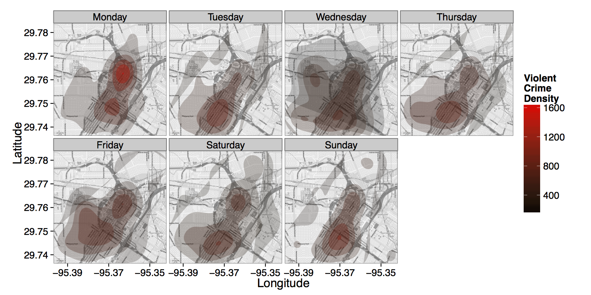

::: article
# Introduction

Visualizing spatial data in R can be a challenging task. Fortunately the
task is made a good deal easier by the data structures and plot methods
of [*sp*](https://CRAN.R-project.org/package=sp),
[*RgoogleMaps*](https://CRAN.R-project.org/package=RgoogleMaps), and
related packages [@sp1; @sp2; @RgoogleMaps2]. Using those methods, one
can plot the basic geographic information of (for instance) a shape file
containing polygons for areal data or points for point referenced data.
However, compared to specialized geographic information systems (GISs)
such as ESRI's ArcGIS, which can plot points, polygons, etc. on top of
maps and satellite imagery with drag-down menus, these visualizations
can be pretty disappointing. This article details some new methods for
the visualization of spatial data in R using the layered grammar of
graphics implementation of
[*ggplot2*](https://CRAN.R-project.org/package=ggplot2) in conjunction
with the contextual information of static maps from Google Maps,
OpenStreetMap, Stamen Maps or CloudMade Maps
[@ggplot2-book; @layeredgrammar]. The result is an easy to use R package
named [*ggmap*](https://CRAN.R-project.org/package=ggmap). After
describing the nuts and bolts of *ggmap*, we showcase some of its
capabilities in a simple case study concerning violent crimes in
downtown Houston, Texas and present an overview of a few utility
functions.

# Plotting spatial data in R

Areal data is data which corresponds to geographical extents with
polygonal boundaries. A typical example is the number of residents per
zip code. Considering only the boundaries of the areal units, we are
used to seeing areal plots in R which resemble those in Figure
[1](#fig:rareal) (left).

<figure id="fig:rareal">
<p></p>
<figcaption>Figure 1: A typical R areal plot – zip codes in the Greater
Houston area (left), and a typical R spatial scatterplot – murders in
Houston from January 2010 to August 2010 (right).</figcaption>
</figure>

While these kinds of plots are useful, they are not as informative as we
would like in many situations. For instance, when plotting zip codes it
is helpful to also see major roads and other landmarks which form the
boundaries of areal units.

The situation for point referenced spatial data is often much worse.
Since we can't easily contextualize a scatterplot of points without any
background information at all, it is common to add points as an overlay
of some areal data---whatever areal data is available. The resulting
plot looks like Figure [1](#fig:rareal) (right).

In most cases the plot is understandable to the researcher who has
worked on the problem for some time but is of hardly any use to his
audience, who must work to associate the data of interest with their
location. Moreover, it leaves out many practical details---are most of
the events to the east or west of landmark $x$? Are they clustered
around more well-to-do parts of town, or do they tend to occur in
disadvantaged areas? Questions like these can't really be answered using
these kinds of graphics because we don't think in terms of small scale
areal boundaries (e.g. zip codes or census tracts).

With a little effort better plots can be made, and tools such as
[*maps*](https://CRAN.R-project.org/package=maps),
[*maptools*](https://CRAN.R-project.org/package=maptools), *sp*, or
*RgoogleMaps* make the process much easier; in fact, *RgoogleMaps* was
the inspiration for *ggmap* [@maps; @maptools].

Moreover, there has recently been a deluge of interest in the subject of
mapmaking in R---Ian Fellows' excellent interactive GUI-driven
[*DeducerSpatial*](https://CRAN.R-project.org/package=DeducerSpatial)
package based on Bing Maps comes to mind [@deducersp]. *ggmap* takes
another step in this direction by situating the contextual information
of various kinds of static maps in the *ggplot2* plotting framework. The
result is an easy, consistent way of specifying plots which are readily
interpretable by both expert and audience and safeguarded from graphical
inconsistencies by the layered grammar of graphics framework. The result
is a spatial plot resembling Figure [2](#fig:spatialScatter). Note that
map images and information in this work may appear slightly different
due to map provider changes over time.

<figure id="fig:spatialScatter">
<div class="sourceCode" id="cb1"><pre class="sourceCode r"><code class="sourceCode r"><span id="cb1-1"><a href="#cb1-1" aria-hidden="true" tabindex="-1"></a>murder <span class="ot">&lt;-</span> <span class="fu">subset</span>(crime, offense <span class="sc">==</span> <span class="st">&quot;murder&quot;</span>) </span>
<span id="cb1-2"><a href="#cb1-2" aria-hidden="true" tabindex="-1"></a><span class="fu">qmplot</span>(lon, lat, <span class="at">data =</span> murder, <span class="at">colour =</span> <span class="fu">I</span>(<span class="st">&#39;red&#39;</span>), <span class="at">size =</span> <span class="fu">I</span>(<span class="dv">3</span>), <span class="at">darken =</span> .<span class="dv">3</span>)</span></code></pre></div>

<figcaption>Figure 2: A spatial scatterplot based on Stamen Maps’
terrain tile set made with the qmplot function, an experimental
amalgamation of the functions presented in this article.</figcaption>
</figure>

# The layered grammar of graphics

One advantage of making the plots with *ggplot2* is the layered grammar
of graphics on which *ggplot2* is based [@layeredgrammar; @grammar]. By
definition, the layered grammar demands that every plot consist of five
components :

-   a default dataset with aesthetic mappings,

-   one or more layers, each with a geometric object ("geom"), a
    statistical transformation ("stat"), and a dataset with aesthetic
    mappings (possibly defaulted),

-   a scale for each aesthetic mapping (which can be automatically
    generated),

-   a coordinate system, and

-   a facet specification.

Since *ggplot2* is an implementation of the layered grammar of graphics,
every plot made with *ggplot2* has each of the above elements.
Consequently, *ggmap* plots also have these elements, but certain
elements are fixed to map components : the $x$ aesthetic is fixed to
longitude, the $y$ aesthetic is fixed to latitude, and the coordinate
system is fixed to the Mercator projection.[^1]

The major theoretical advantage of using the layered grammar in plotting
maps is that aesthetic scales are kept consistent. In the typical
situation where the map covers the extent of the data, in *ggmap* the
latitude and longitude scales key off the map (by default) and one scale
is used for those axes. The same is true of colors, fills, alpha
blendings, and other aesthetics which are built on top of the map when
other layers are presented---each is allotted one scale which is kept
consistent across each layer of the plot. This aspect of the grammar is
particularly important for faceted plots in order to make a proper
comparison across several plots. Of course, the scales can still be
tricked if the user improperly specifies the spatial data, e.g. using
more than one projection in the same map, but fixing such errors is
beyond any framework.

The practical advantage of using the grammar is even better. Since the
graphics are done in *ggplot2* the user can draw from the full range of
*ggplot2*'s capabilities to layer elegant visual content---geoms, stats,
scales, etc.---using the usual *ggplot2* coding conventions. This was
already seen briefly in Figure [2](#fig:spatialScatter) where the
arguments of `qmplot` are identical to that of *ggplot2*'s `qplot`; much
more will be seen shortly.

# How *ggmap* works

The basic idea driving *ggmap* is to take a downloaded map image, plot
it as a context layer using *ggplot2*, and then plot additional content
layers of data, statistics, or models on top of the map. In *ggmap* this
process is broken into two pieces -- (1) downloading the images and
formatting them for plotting, done with `get_map`, and (2) making the
plot, done with `ggmap`. `qmap` marries these two functions for quick
map plotting (c.f. *ggplot2*'s `ggplot`), and `qmplot` attempts to wrap
up the entire plotting process into one simple command (c.f. *ggplot2*'s
`qplot`).

## The `get_map` function

In *ggmap*, downloading a map as an image and formatting the image for
plotting is done with the `get_map` function. More specifically,
`get_map` is a wrapper function for the underlying functions
`get_googlemap`, `get_openstreetmap`, `get_stamenmap`, and
`get_cloudmademap` which accepts a wide array of arguments and returns a
classed raster object for plotting with `ggmap`.

As the most important characteristic of any map is location, the most
important argument of `get_map` is the `location` argument. Ideally,
`location` is a longitude/latitude pair specifying the center of the map
and accompanied by a `zoom` argument, an integer from 3 to 20 specifying
how large the spatial extent should be around the center, with 3 being
the continent level and 20 being roughly the single building level.
`location` is defaulted to downtown Houston, Texas, and `zoom` to 10,
roughly a city-scale.

While longitude/latitude pairs are ideal for specifying a location, they
are somewhat inconvenient on a practical level. For this reason,
`location` also accepts a character string. The string, whether
containing an address, zip code, or proper name, is then passed to the
`geocode` function which then determines the appropriate
longitude/latitude coordinate for the center. In other words, there is
no need to know the exact longitude/latitude coordinates of the center
of the map---`get_map` can determine them from more colloquial ("lazy")
specifications so that they can be specified very loosely. For example,
since

``` r
> geocode("the white house") 
      lon       lat
-77.03676  38.89784 
```

works, `"the white house"` is a viable `location` argument. More details
on `geocode` and other utility functions are discussed at the end of
this article.

In lieu of a center/zoom specification, some users find a bounding box
specification more convenient. To accommodate this form of
specification, `location` also accepts numeric vectors of length four
following the left/bottom/right/top convention. This option is not
currently available for Google Maps.

While each map source has its own web application programming interface
(API), specification of `location`/`zoom` in `get_map` works for each by
computing the appropriate parameters (if necessary) and passing them to
each of the API specific `get_*` functions. To ensure that the resulting
maps are the same across the various sources for the same
`location`/`zoom` specification, `get_map` first grabs the appropriate
Google Map, determines its bounding box, and then downloads the other
map as needed. In the case of Stamen Maps and CloudMade Maps, this
involves a stitching process of combining several tiles (small map
images) and then cropping the result to the appropriate bounding box.
The result is a single, consistent specification syntax across the four
map sources as seen for Google Maps and OpenStreetMap in Figure
[3](#fig:locationzoombb).

<figure id="fig:locationzoombb">
<div class="sourceCode" id="cb1"><pre class="sourceCode r"><code class="sourceCode r"><span id="cb1-1"><a href="#cb1-1" aria-hidden="true" tabindex="-1"></a>baylor <span class="ot">&lt;-</span> <span class="st">&quot;baylor university&quot;</span></span>
<span id="cb1-2"><a href="#cb1-2" aria-hidden="true" tabindex="-1"></a><span class="fu">qmap</span>(baylor, <span class="at">zoom =</span> <span class="dv">14</span>)</span></code></pre></div>

<div class="sourceCode" id="cb2"><pre class="sourceCode r"><code class="sourceCode r"><span id="cb2-1"><a href="#cb2-1" aria-hidden="true" tabindex="-1"></a><span class="fu">qmap</span>(baylor, <span class="at">zoom =</span> <span class="dv">14</span>, <span class="at">source =</span> <span class="st">&quot;osm&quot;</span>)</span></code></pre></div>

<figcaption>Figure 3: get_map provides the same spatial extent for
Google Maps (top) and OpenStreetMaps (bottom) with a single simple
syntax, even though their APIs are quite different.</figcaption>
</figure>

Before moving into the `source` and `maptype` arguments, it is important
to note that the underlying API specific `get_*` functions for which
`get_map` is a wrapper provide more extensive mechanisms for downloading
from their respective sources. For example, `get_googlemap` can access
almost the full range of the Google Static Maps API as seen in Figure
[4](#fig:googleMapsAPI).

<figure id="fig:googleMapsAPI">
<div class="sourceCode" id="cb1"><pre class="sourceCode r"><code class="sourceCode r"><span id="cb1-1"><a href="#cb1-1" aria-hidden="true" tabindex="-1"></a><span class="fu">set.seed</span>(<span class="dv">500</span>)</span>
<span id="cb1-2"><a href="#cb1-2" aria-hidden="true" tabindex="-1"></a>df <span class="ot">&lt;-</span> <span class="fu">round</span>(<span class="fu">data.frame</span>(</span>
<span id="cb1-3"><a href="#cb1-3" aria-hidden="true" tabindex="-1"></a>  <span class="at">x =</span> <span class="fu">jitter</span>(<span class="fu">rep</span>(<span class="sc">-</span><span class="fl">95.36</span>, <span class="dv">50</span>), <span class="at">amount =</span> .<span class="dv">3</span>),</span>
<span id="cb1-4"><a href="#cb1-4" aria-hidden="true" tabindex="-1"></a>  <span class="at">y =</span> <span class="fu">jitter</span>(<span class="fu">rep</span>( <span class="fl">29.76</span>, <span class="dv">50</span>), <span class="at">amount =</span> .<span class="dv">3</span>)  </span>
<span id="cb1-5"><a href="#cb1-5" aria-hidden="true" tabindex="-1"></a>), <span class="at">digits =</span> <span class="dv">2</span>)</span>
<span id="cb1-6"><a href="#cb1-6" aria-hidden="true" tabindex="-1"></a></span>
<span id="cb1-7"><a href="#cb1-7" aria-hidden="true" tabindex="-1"></a>map <span class="ot">&lt;-</span> <span class="fu">get_googlemap</span>(<span class="st">&#39;houston&#39;</span>, <span class="at">markers =</span> df, <span class="at">path =</span> df, <span class="at">scale =</span> <span class="dv">2</span>)</span>
<span id="cb1-8"><a href="#cb1-8" aria-hidden="true" tabindex="-1"></a>  </span>
<span id="cb1-9"><a href="#cb1-9" aria-hidden="true" tabindex="-1"></a><span class="fu">ggmap</span>(map, <span class="at">extent =</span> <span class="st">&#39;device&#39;</span>)</span></code></pre></div>

<figcaption>Figure 4: Accessing Google Maps API features with
get_googlemap.</figcaption>
</figure>

### Tile style -- the `source` and `maptype` arguments of `get_map`

The most attractive aspect of using different map sources (Google Maps,
OpenStreetMap, Stamen Maps, and CloudMade Maps) is the different map
styles provided by the producer. These are specified with the `maptype`
argument of `get_map` and must agree with the `source` argument. Some
styles emphasize large roadways, others bodies of water, and still
others political boundaries. Some are better for plotting in a
black-and-white medium; others are simply nice to look at. This section
gives a run down of the various map styles available in *ggmap*.

Google provides four different familiar types---terrain (default),
satellite (e.g. Figure [13](#fig:shapefile)), roadmap, and hybrid (e.g.
Figure [12](#fig:routesf)). OpenStreetMap, on the other hand, only
provides the default style shown in Figure [3](#fig:locationzoombb).

Style is where Stamen Maps and CloudMade Maps really shine. Stamen Maps
has three available tile sets---terrain (e.g. Figures
[2](#fig:spatialScatter) or [13](#fig:shapefile)), watercolor, and toner
(for the latter two see Figure [5](#fig:stamenMaps)).

<figure id="fig:stamenMaps">
<div class="sourceCode" id="cb1"><pre class="sourceCode r"><code class="sourceCode r"><span id="cb1-1"><a href="#cb1-1" aria-hidden="true" tabindex="-1"></a><span class="fu">qmap</span>(baylor, <span class="at">zoom =</span> <span class="dv">14</span>, <span class="at">source =</span> <span class="st">&quot;stamen&quot;</span>, <span class="at">maptype =</span> <span class="st">&quot;watercolor&quot;</span>)</span>
<span id="cb1-2"><a href="#cb1-2" aria-hidden="true" tabindex="-1"></a><span class="fu">qmap</span>(baylor, <span class="at">zoom =</span> <span class="dv">14</span>, <span class="at">source =</span> <span class="st">&quot;stamen&quot;</span>, <span class="at">maptype =</span> <span class="st">&quot;toner&quot;</span>)</span></code></pre></div>
<p></p>
<figcaption>Figure 5: Stamen tile sets maptype = "watercolor" and
maptype = "toner".</figcaption>
</figure>

Stamen's terrain tile set is quite similar to Google's, but obviously
the watercolor and toner tile sets are substantially different than any
of the four Google tile sets. The latter, for example, is ideal for
black-and-white plotting.

CloudMade Maps takes the tile styling even further by allowing the user
to either (1) select among *thousands* of user-made sets or (2) create
an entirely new style with a simple online editor where the user can
specify colors, lines, and so forth for various types of roads,
waterways, landmarks, etc., all of which are generated by CloudMade and
accessible in *ggmap*. *ggmap*, through `get_map` (or
`get_cloudmademap`) allows for both options. This is a unique feature of
CloudMade Maps which really boosts their applicability and expands the
possibilities with *ggmap*. The one minor drawback to using CloudMade
Maps is that the user must register with CloudMade to obtain an API key
and then pass the API key into `get_map` with the `api_key` argument.
API keys are free of charge and can be obtained in a matter of minutes.
Two low-light CloudMade map styles are seen in Figure
[6](#fig:cloudMadeMaps). Note that map styles are only available to the
user that owns them.

Both Stamen Maps and CloudMade Maps are built using OpenStreetMap data.
These data are contributed by an open community of online users in much
the same way Wikipedia is---both are free, both are user-contributed,
and both are easily edited. Moreover, OpenStreetMap has data not only on
roadways and bodies of water but also individual buildings, fountains,
stop signs and other apparent minutiae. The drawback is that (like
Google Maps) not all locations are mapped with the same degree of
precision, and imperfections may be observed in small-scale out of the
way features.[^2]

<figure id="fig:cloudMadeMaps">
<div class="sourceCode" id="cb1"><pre class="sourceCode r"><code class="sourceCode r"><span id="cb1-1"><a href="#cb1-1" aria-hidden="true" tabindex="-1"></a><span class="fu">qmap</span>(baylor, <span class="at">zoom =</span> <span class="dv">14</span>, <span class="at">maptype =</span> <span class="dv">53428</span>, <span class="at">api_key =</span> api_key, </span>
<span id="cb1-2"><a href="#cb1-2" aria-hidden="true" tabindex="-1"></a>     <span class="at">source =</span> <span class="st">&quot;cloudmade&quot;</span>)</span>
<span id="cb1-3"><a href="#cb1-3" aria-hidden="true" tabindex="-1"></a><span class="fu">qmap</span>(<span class="st">&quot;houston&quot;</span>, <span class="at">zoom =</span> <span class="dv">10</span>, <span class="at">maptype =</span> <span class="dv">58916</span>, <span class="at">api_key =</span> api_key, </span>
<span id="cb1-4"><a href="#cb1-4" aria-hidden="true" tabindex="-1"></a>     <span class="at">source =</span> <span class="st">&quot;cloudmade&quot;</span>)</span></code></pre></div>
<p></p>
<figcaption>Figure 6: Two out of thousands of user made CloudMade Maps
styles. The left is comparable to Figures 3 and 5, and the right
contains the bodies of water in Figure 4.</figcaption>
</figure>

## The `ggmap` function

Once `get_map` has grabbed the map of interest, `ggmap` is ready to plot
it. The result of `get_map` is a specially classed raster object (a
matrix of colors as hexadecimal character strings) --

``` r
> paris <- get_map(location = "paris")
> str(paris)
 chr [1:1280, 1:1280] "#C6DAB6" "#C2D6B3" "#C2D6B3" ...
 - attr(*, "class")= chr [1:2] "ggmap" "raster"
 - attr(*, "bb")='data.frame':	1 obs. of  4 variables:
  ..$ ll.lat: num 48.6
  ..$ ll.lon: num 1.91
  ..$ ur.lat: num 49.1
  ..$ ur.lon: num 2.79
```

The purpose of `ggmap` is to take the map from the raster object to the
screen, and it fulfills this purpose by creating a ggplot object which,
when printed, draws the desired map in the graphics device. This is
illustrated in Figure [7](#fig:parisggmapplot).

While `ggmap` requires a ggmap object, it accepts a handful of other
arguments as well---`extent`, `base_layer`, `maprange`, `legend`,
`padding`, and `darken`. With none of these additional arguments,
`ggmap` effectively returns the following ggplot object

``` r
ggplot(aes(x = lon, y = lat), data = fourCorners) + 
  geom_blank() + coord_map("mercator") +
  annotation_raster(ggmap, xmin, xmax, ymin, ymax)
```

where `fourCorners` is the data frame resulting from applying
`expand.grid` to the longitude and latitude ranges specified in the `bb`
attribute of the ggmap object. Thus, the default base layer of the
ggplot2 object created by `ggmap` is
`ggplot(aes(x = lon, y = lat), data = fourCorners)`, and the default $x$
and $y$ aesthetic scales are calculated based on the longitude and
latitude ranges of the map.

<figure id="fig:parisggmapplot">
<div class="sourceCode" id="cb1"><pre class="sourceCode r"><code class="sourceCode r"><span id="cb1-1"><a href="#cb1-1" aria-hidden="true" tabindex="-1"></a><span class="fu">ggmap</span>(paris, <span class="at">extent =</span> <span class="st">&quot;normal&quot;</span>)</span></code></pre></div>

<figcaption>Figure 7: Setting extent = "normal" in ggmap illustrates how
maps in ggmap are simply ggplot2 graphics.</figcaption>
</figure>

The `extent` argument dictates how much of the graphics device is
covered by the map. It accepts three possible strings: `"normal"` shown
in Figure [7](#fig:parisggmapplot), `"panel"` shown in Figures
[10](#fig:facet) and [12](#fig:routesf), and `"device"` shown in every
other figure. `"normal"` situates the map with the usual axis padding
provided by *ggplot2* and, consequently, one can see the panel behind
it. `"panel"` eliminates this, setting the limits of the plot panel to
be the longitude and latitude extents of the map with
`scale_[x,y]_continuous(expand = c(0,0))`. `"device"` takes this to the
extreme by eliminating the axes themselves with the new exported
`theme_nothing`.

`base_layer` is a call which substitutes the default base layer to the
user's specification. Thus, in the above code the user can change
`ggplot(aes(x = lon, y = lat), data = fourCorners)` to a different call.
This is essential for faceting plots since the referent of *ggplot2*
functions `facet_wrap` and `facet_grid` is the base layer. Since
changing the base layer changes the base scales and therefore limits of
the plot, it is possible that when the base layer is changed only part
of the map is visible. Setting the `maprange` argument to `TRUE` (it
defaults to `FALSE`) ensures that *the map* determines the $x$ and $y$
axis limits (longitude and latitude) via the `bb` attribute of the ggmap
object itself, and not the `base_layer` argument.

The legend-related arguments of `ggmap` are `legend` and `padding`, and
they are only applicable when `extent = "device"`. The `legend` argument
determines where a legend should be drawn on the map if one should be
drawn. Its options are `"left"`, `"right"` (default), `"bottom"`,
`"top"`, `"topleft"`, `"bottomleft"`, `"topright"`, `"bottomright"` and
`"none"`. The first four draw the legend according to *ggplot2*'s normal
specifications (without any axes); the next four draw the legend on top
of the map itself similar to ArcGIS; and the last eliminates the legend
altogether. `padding` governs how far from the corner the legend should
be drawn.

The `darken` argument, a suggestion by Jean-Olivier Irisson, tints the
map image. The default, `c(0, "black")`, indicates a fully translucent
black layer, i.e. no tint at all. Generally, the first argument
corresponds to an alpha blending (0 = invisible, 1 = opaque) and the
second argument the color of the tint. If only a number is supplied to
the `darken` argument `ggmap` assumes a black tint. The tint itself is
made by adding a `geom_rect` layer on top of the map. An example is
provided by Figure [2](#fig:spatialScatter), where a black tint was
added to the map to enhance the visibility of the points.

Since `ggmap` returns a ggplot object, the product of `ggmap` can itself
act as a base layer in the *ggplot2* framework. This is an incredibly
important realization which allows for the full range of *ggplot2*
capabilities. We now illustrate many of the ways in which this can be
done effectively through a case study of violent crime in downtown
Houston, Texas.

# *ggmap* in action

## Data

Crime data were compiled from the [Houston Police Department's
website](http://www.houstontx.gov/police/cs/stats2.htm) over the period
of January 2010--August 2010. The data were lightly cleaned and
aggregated using [*plyr*](https://CRAN.R-project.org/package=plyr)
[@Wickham:2011] and geocoded using Google Maps (to the center of the
block, e.g., 6150 Main St.); the full data set is available in *ggmap*
as the data set `crime`.

``` r
> str(crime)
'data.frame':	86314 obs. of  17 variables:
 $ time    : POSIXt, format: "2010-01-01 0...
 $ date    : chr  "1/1/2010" "1/1/2010" "1...
 $ hour    : int  0 0 0 0 0 0 0 0 0 0 ...
 $ premise : chr  "18A" "13R" "20R" "20R" ...
 $ offense : chr  "murder" "robbery" "aggr...
 $ beat    : chr  "15E30" "13D10" "16E20" ...
 $ block   : chr  "9600-9699" "4700-4799" ...
 $ street  : chr  "marlive" "telephone" "w...
 $ type    : chr  "ln" "rd" "ln" "st" ...
 $ suffix  : chr  "-" "-" "-" "-" ...
 $ number  : int  1 1 1 1 1 1 1 1 1 1 ...
 $ month   : Factor w/ 12 levels "january"...
 $ day     : Factor w/ 7 levels "monday"  ...
 $ location: chr  "apartment parking lot" ...
 $ address : chr  "9650 marlive ln" "4750 ...
 $ lon     : num  -95.4 -95.3 -95.5 -95.4 ...
 $ lat     : num  29.7 29.7 29.6 29.8 29.7...
```

Since we are only interested in violent crimes which take place
downtown, we restrict the data set to those qualifiers. To determine a
bounding box, we first use `gglocator`, a *ggplot2* analogue of base's
`locator` function exported from *ggmap*. `gglocator` works not only for
*ggmap* plots, but *ggplot2* graphics in general.

``` r
> # find a reasonable spatial extent
> qmap('houston', zoom = 13)
> gglocator(2)
>         lon      lat
> 1 -95.39681 29.78400
> 2 -95.34188 29.73631
> 
> # only violent crimes
> violent_crimes <- subset(crime,
+   offense != "auto theft" & offense != "theft" & offense != "burglary")
> 
> # order violent crimes
> violent_crimes$offense <- factor(violent_crimes$offense, 
+   levels = c("robbery", "aggravated assault", "rape", "murder"))
>     
> # restrict to downtown
> violent_crimes <- subset(violent_crimes,
+   -95.39681 <= lon & lon <= -95.34188 &
+    29.73631 <= lat & lat <=  29.78400)
```

The analysis performed only concerns data on the violent crimes of
aggravated assault, robbery, rape and murder. Note that while some
effort was made to ensure the quality of the data, the data were only
leisurely cleaned and the data set may still contain errors.

## Analysis

The first step we might want to take is to look at where the individual
crimes took place. Modulo some simple *ggplot2* styling changes
(primarily in the fonts and key-styles of the legends via *ggplot2*'s
`guide` function), Figure [8](#fig:bubblechart) contains the code to
produce the spatial bubble chart shown on the left.

One of the problems with the bubble chart is overplotting and point
size---we can't really get a feel for what crimes are taking place and
where. One way around this is to bin the points and drop the bins which
don't have any samples in them. The result (Figure [8](#fig:bubblechart)
right) shows us where the crimes are happening at the expense of knowing
their frequency.

The binned plot is the first time we really begin to see the power of
having the maps in the *ggplot2* framework. While it is actually not a
very good plot, it illustrates the practical advantage of the *ggplot2*
framework with the contextual information of the map---the process of
splitting the data frame `violent_crimes` into chunks based on the
offense variable, binning the points of each, and aggregating back into
one data set to plot is all done entirely behind the scenes by
*ggplot2*.

<figure id="fig:bubblechart">
<div class="sourceCode" id="cb1"><pre class="sourceCode r"><code class="sourceCode r"><span id="cb1-1"><a href="#cb1-1" aria-hidden="true" tabindex="-1"></a><span class="fu">theme_set</span>(<span class="fu">theme_bw</span>(<span class="dv">16</span>))</span>
<span id="cb1-2"><a href="#cb1-2" aria-hidden="true" tabindex="-1"></a>HoustonMap <span class="ot">&lt;-</span> <span class="fu">qmap</span>(<span class="st">&quot;houston&quot;</span>, <span class="at">zoom =</span> <span class="dv">14</span>, <span class="at">color =</span> <span class="st">&quot;bw&quot;</span>, <span class="at">legend =</span> <span class="st">&quot;topleft&quot;</span>)</span>
<span id="cb1-3"><a href="#cb1-3" aria-hidden="true" tabindex="-1"></a>  </span>
<span id="cb1-4"><a href="#cb1-4" aria-hidden="true" tabindex="-1"></a>HoustonMap <span class="sc">+</span></span>
<span id="cb1-5"><a href="#cb1-5" aria-hidden="true" tabindex="-1"></a>   <span class="fu">geom_point</span>(<span class="fu">aes</span>(<span class="at">x =</span> lon, <span class="at">y =</span> lat, <span class="at">colour =</span> offense, <span class="at">size =</span> offense), </span>
<span id="cb1-6"><a href="#cb1-6" aria-hidden="true" tabindex="-1"></a>              <span class="at">data =</span> violent_crimes)</span>
<span id="cb1-7"><a href="#cb1-7" aria-hidden="true" tabindex="-1"></a>   </span>
<span id="cb1-8"><a href="#cb1-8" aria-hidden="true" tabindex="-1"></a>HoustonMap <span class="sc">+</span> </span>
<span id="cb1-9"><a href="#cb1-9" aria-hidden="true" tabindex="-1"></a>  <span class="fu">stat_bin2d</span>(</span>
<span id="cb1-10"><a href="#cb1-10" aria-hidden="true" tabindex="-1"></a>    <span class="fu">aes</span>(<span class="at">x =</span> lon, <span class="at">y =</span> lat, <span class="at">colour =</span> offense, <span class="at">fill =</span> offense), </span>
<span id="cb1-11"><a href="#cb1-11" aria-hidden="true" tabindex="-1"></a>    <span class="at">size =</span> .<span class="dv">5</span>, <span class="at">bins =</span> <span class="dv">30</span>, <span class="at">alpha =</span> <span class="dv">1</span><span class="sc">/</span><span class="dv">2</span>, </span>
<span id="cb1-12"><a href="#cb1-12" aria-hidden="true" tabindex="-1"></a>    <span class="at">data =</span> violent_crimes</span>
<span id="cb1-13"><a href="#cb1-13" aria-hidden="true" tabindex="-1"></a>  )   </span></code></pre></div>
<p></p>
<figcaption>Figure 8: Violent crime bubble chart of downtown Houston
(left) and the same binned (right).</figcaption>
</figure>

What about violent crimes in general? If we neglect the type of offense,
we can get a good idea of the spatial distribution of violent crimes by
using a contour plot. Since the map image itself is based on *ggplot2*'s
`annotation_raster`, which doesn't have a fill aesthetic, we can access
the fill aesthetic to make a filled contour plot. This is seen in Figure
[9](#fig:fills) (left).

<figure id="fig:fills">
<div class="sourceCode" id="cb1"><pre class="sourceCode r"><code class="sourceCode r"><span id="cb1-1"><a href="#cb1-1" aria-hidden="true" tabindex="-1"></a>houston <span class="ot">&lt;-</span> <span class="fu">get_map</span>(<span class="st">&quot;houston&quot;</span>, <span class="at">zoom =</span> <span class="dv">14</span>)</span>
<span id="cb1-2"><a href="#cb1-2" aria-hidden="true" tabindex="-1"></a>HoustonMap <span class="ot">&lt;-</span> <span class="fu">ggmap</span>(<span class="st">&quot;houston&quot;</span>, <span class="at">extent =</span> <span class="st">&quot;device&quot;</span>, <span class="at">legend =</span> <span class="st">&quot;topleft&quot;</span>)</span>
<span id="cb1-3"><a href="#cb1-3" aria-hidden="true" tabindex="-1"></a>  </span>
<span id="cb1-4"><a href="#cb1-4" aria-hidden="true" tabindex="-1"></a>HoustonMap <span class="sc">+</span> </span>
<span id="cb1-5"><a href="#cb1-5" aria-hidden="true" tabindex="-1"></a>  <span class="fu">stat_density2d</span>(</span>
<span id="cb1-6"><a href="#cb1-6" aria-hidden="true" tabindex="-1"></a>    <span class="fu">aes</span>(<span class="at">x =</span> lon, <span class="at">y =</span> lat, <span class="at">fill =</span> ..level..,  <span class="at">alpha =</span> ..level..), </span>
<span id="cb1-7"><a href="#cb1-7" aria-hidden="true" tabindex="-1"></a>    <span class="at">size =</span> <span class="dv">2</span>, <span class="at">bins =</span> <span class="dv">4</span>, <span class="at">data =</span> violent_crimes,</span>
<span id="cb1-8"><a href="#cb1-8" aria-hidden="true" tabindex="-1"></a>    <span class="at">geom =</span> <span class="st">&quot;polygon&quot;</span></span>
<span id="cb1-9"><a href="#cb1-9" aria-hidden="true" tabindex="-1"></a>  ) </span>
<span id="cb1-10"><a href="#cb1-10" aria-hidden="true" tabindex="-1"></a>  </span>
<span id="cb1-11"><a href="#cb1-11" aria-hidden="true" tabindex="-1"></a>overlay <span class="ot">&lt;-</span> <span class="fu">stat_density2d</span>(</span>
<span id="cb1-12"><a href="#cb1-12" aria-hidden="true" tabindex="-1"></a>  <span class="fu">aes</span>(<span class="at">x =</span> lon, <span class="at">y =</span> lat, <span class="at">fill =</span> ..level.., <span class="at">alpha =</span> ..level..),</span>
<span id="cb1-13"><a href="#cb1-13" aria-hidden="true" tabindex="-1"></a>  <span class="at">bins =</span> <span class="dv">4</span>, <span class="at">geom =</span> <span class="st">&quot;polygon&quot;</span>, </span>
<span id="cb1-14"><a href="#cb1-14" aria-hidden="true" tabindex="-1"></a>  <span class="at">data =</span> violent_crimes</span>
<span id="cb1-15"><a href="#cb1-15" aria-hidden="true" tabindex="-1"></a>)</span>
<span id="cb1-16"><a href="#cb1-16" aria-hidden="true" tabindex="-1"></a></span>
<span id="cb1-17"><a href="#cb1-17" aria-hidden="true" tabindex="-1"></a>HoustonMap <span class="sc">+</span> overlay <span class="sc">+</span> <span class="fu">inset</span>(</span>
<span id="cb1-18"><a href="#cb1-18" aria-hidden="true" tabindex="-1"></a>    <span class="at">grob =</span> <span class="fu">ggplotGrob</span>(<span class="fu">ggplot</span>() <span class="sc">+</span> overlay <span class="sc">+</span> <span class="fu">theme_inset</span>()), </span>
<span id="cb1-19"><a href="#cb1-19" aria-hidden="true" tabindex="-1"></a>    <span class="at">xmin =</span> <span class="sc">-</span><span class="fl">95.35836</span>, <span class="at">xmax =</span> <span class="cn">Inf</span>, <span class="at">ymin =</span> <span class="sc">-</span><span class="cn">Inf</span>, <span class="at">ymax =</span> <span class="fl">29.75062</span></span>
<span id="cb1-20"><a href="#cb1-20" aria-hidden="true" tabindex="-1"></a>  )  </span></code></pre></div>
<p></p>
<figcaption>Figure 9: Filled contour plot of violent crimes (left), and
the same with an inset (right).</figcaption>
</figure>

These kinds of overlays can be incredibly effective; however, their
ability to communicate information can be hindered by the fact that the
map overlay can be visually confused with the map itself. This is
particularly common when using colored maps. To get around this problem
the `inset` function can be used to insert map insets containing the
overlay on a white background with major and minor axes lines for visual
guides made possible by the exported function `theme_inset`; this is
seen in Figure [9](#fig:fills) (right).

The image indicates that there are three main hotspots of activity. Each
of these three corresponds to locations commonly held by Houstonians to
be particularly dangerous locations. From east to west, the hotspots are
caused by (1) a county jail which releases its inmates twice daily, who
tend to loiter in the area indicated, (2) a commercial bus station in an
area of substantial homelessness and destitution, and (3) a prostitution
hotspot in a very diverse and pedestrian part of town.

In addition to single plots, the `base_layer` argument to `ggmap` or
`qmap` allows for faceted plots (see Figure [10](#fig:facet)). This is
particularly useful for spatiotemporal data with discrete temporal
components (day, month, season, year, etc.).

This last plot displays one of the known issues with contour plots in
*ggplot2*---a "clipping" or "tearing" of the contours. Aside from that
fact (which will likely be fixed in subsequent *ggplot2* versions), we
can see that in fact most violent crimes happen on Monday, with a
distant second being Friday. Friday's pattern is easily recognizable---a
small elevated dot in the downtown bar district and an expanded region
to the southwest in the district known as midtown, which has an active
nightlife. Monday's pattern is not as easily explainable.

<figure id="fig:facet">
<div class="sourceCode" id="cb1"><pre class="sourceCode r"><code class="sourceCode r"><span id="cb1-1"><a href="#cb1-1" aria-hidden="true" tabindex="-1"></a>houston <span class="ot">&lt;-</span> <span class="fu">get_map</span>(<span class="at">location =</span> <span class="st">&quot;houston&quot;</span>, <span class="at">zoom =</span> <span class="dv">14</span>, <span class="at">color =</span> <span class="st">&quot;bw&quot;</span>, </span>
<span id="cb1-2"><a href="#cb1-2" aria-hidden="true" tabindex="-1"></a>                   <span class="at">source =</span> <span class="st">&quot;osm&quot;</span>)</span>
<span id="cb1-3"><a href="#cb1-3" aria-hidden="true" tabindex="-1"></a></span>
<span id="cb1-4"><a href="#cb1-4" aria-hidden="true" tabindex="-1"></a>HoustonMap <span class="ot">&lt;-</span> <span class="fu">ggmap</span>(houston, <span class="at">base_layer =</span> <span class="fu">ggplot</span>(<span class="fu">aes</span>(<span class="at">x =</span> lon, <span class="at">y =</span> lat), </span>
<span id="cb1-5"><a href="#cb1-5" aria-hidden="true" tabindex="-1"></a>                    <span class="at">data =</span> violent_crimes)) </span>
<span id="cb1-6"><a href="#cb1-6" aria-hidden="true" tabindex="-1"></a></span>
<span id="cb1-7"><a href="#cb1-7" aria-hidden="true" tabindex="-1"></a>HoustonMap <span class="sc">+</span> </span>
<span id="cb1-8"><a href="#cb1-8" aria-hidden="true" tabindex="-1"></a>  <span class="fu">stat_density2d</span>(<span class="fu">aes</span>(<span class="at">x =</span> lon, <span class="at">y =</span> lat, <span class="at">fill =</span> ..level.., <span class="at">alpha =</span> ..level..),</span>
<span id="cb1-9"><a href="#cb1-9" aria-hidden="true" tabindex="-1"></a>    <span class="at">bins =</span> <span class="dv">5</span>, <span class="at">geom =</span> <span class="st">&quot;polygon&quot;</span>, </span>
<span id="cb1-10"><a href="#cb1-10" aria-hidden="true" tabindex="-1"></a>    <span class="at">data =</span> violent_crimes) <span class="sc">+</span></span>
<span id="cb1-11"><a href="#cb1-11" aria-hidden="true" tabindex="-1"></a>  <span class="fu">scale_fill_gradient</span>(<span class="at">low =</span> <span class="st">&quot;black&quot;</span>, <span class="at">high =</span> <span class="st">&quot;red&quot;</span>) <span class="sc">+</span></span>
<span id="cb1-12"><a href="#cb1-12" aria-hidden="true" tabindex="-1"></a>  <span class="fu">facet_wrap</span>(<span class="sc">~</span> day)</span></code></pre></div>

<figcaption>Figure 10: Faceted filled contour plot by day.</figcaption>
</figure>

# *ggmap*'s utility functions {#sec:utility}

*ggmap* has several utility functions which aid in spatial exploratory
data analysis.

### The `geocode` function

The ability to move from an address to a longitude/latitude coordinate
is virtually a must for visualizing spatial data. Unfortunately however,
the process is almost always done outside R by using a proper geographic
information system (GIS), saving the results, and importing them into R.
The `geocode` function simplifies this process to a single line in R.

`geocode` is a vectorized function which accepts character strings and
returns a data frame of geographic information. In the default case of
`output = "simple"`, only longitudes and latitudes are returned. These
are actually Mercator projections of the ubiquitous unprojected 1984
world geodetic system (WGS84), a spheroidal earth model used by Google
Maps. When `output` is set to `"more"`, a larger data frame is returned
which provides much more Google Geocoding information on the query:

``` r
> geocode("baylor university", output = "more")
        lon      lat       type     loctype        address    north    south     east 
1 -97.11441 31.54872 university approximate [long address] 31.55823 31.53921 -97.0984       
       west postal_code       country   administrative_area_level_2
1 -97.13042       76706 united states                      mclennan 
  administrative_area_level_1 locality   street  streetNo point_of_interest
1                       texas     waco s 5th st      1311              <NA> 
```

In particular, administrative bodies at various levels are reported.
Going further, setting `output = "all"` returns the entire JavaScript
Object Notation (JSON) object given by the Google Geocoding API parsed
by [*rjson*](https://CRAN.R-project.org/package=rjson) [@rjson].

The Geocoding API has a number of request limitations in place to
prevent abuse. An unspecified short-term rate limit is in place (see
`mapdist` below) as well as a 24-hour limit of 2,500 requests. These are
monitored to some extent by the hidden global variable
`.GoogleGeocodeQueryCount` and exported function `geocodeQueryCheck`.
`geocode` uses these to monitor its own progress and will either (1)
slow its rate depending on usage or (2) throw an error if the query
limit is exceeded. Note that `revgeocode` shares the same request pool
and is monitored by the same variable and function. To learn more about
the Google Geocoding, Distance Matrix, and Directions API usage
regulations, see the websites listed in the bibliography.

### The `revgeocode` function

In some instances it is useful to convert longitude/latitude coordinates
into a physical address. This is made possible (to the extent to which
it is possible) with the `revgeocode` function which also relies on the
Google Geocoding API.

``` r
> gc <- geocode("baylor university")
> (gc <- as.numeric(gc))
[1] -97.11441  31.54872
> revgeocode(gc)
[1] "S 1st St, Baylor University, Waco, TX 76706, USA"
```

Like `geocode`, more output can be provided as well --

``` r
> revgeocode(gc, output = "more")
        address     route     establishment  neighborhood locality
1 [long address] S 1st St Baylor University        Baylor     Waco
  administrative_area_level_2 administrative_area_level_1       country postal_code
1                    McLennan                       Texas United States       76706  
```

Thus, in addition to the physical *where* of a reverse geocode (i.e.,
the address), `revgeocode` can report the *what* at various levels of
granularity. Finally, an `output = "all"` option is available which
returns the entire JSON object reported by Google.

### The `mapdist` function

The ability to compute colloquial distances in a spatial setting is
another invaluable commodity which typically sends analysts to a GIS.
Using the Google Distance Matrix API, *ggmap* is able to provide
distances for Google-determined routes for driving, bicycling, or
walking. In addition to the distances, Google reports estimated travel
durations as well. The full output is placed in an easy-to-use data
frame. For example,

``` r
> from <- c("houston", "houston", "dallas")
> to <- c("waco, texas", "san antonio", "houston")
> mapdist(from, to)
     from          to      m      km    miles seconds minutes    hours
1 houston waco, texas 298004 298.004 185.1797   11907  198.45 3.307500 
2 houston san antonio 320764 320.764 199.3227   11997  199.95 3.332500   
3  dallas     houston 387389 387.389 240.7235   14592  243.20 4.053333   
```

The default mode of transportation is driving; however, the other modes
are also available. The input forms of `from` and `to` can be either
physical addresses (ideal), lazy (`"the white house"`), or geographic
coordinates (which are reverse geocoded). While the output defaults to
the data frame format seen above, setting `output = "all"` provides the
full JSON object from Google.

The Distance Matrix API limits users to 100 requests per query, 100
requests per 10 seconds, and 2500 requests per 24 hours. To the extent
to which these can be easily monitored, the exported function
`distQueryCheck` helps the user keep track of their remaining balance of
queries. It relies on the hidden global variable `.GoogleDistQueryCount`
--

``` r
> distQueryCheck()
2495 distance queries remaining.
> .GoogleDistQueryCount
                 time        url elements
1 2012-03-16 00:12:11 [url used]        1
2 2012-03-16 00:16:10 [url used]        2
```

If the user exceeds the limitations, `mapdist` either (1) pauses until
the short-term request limit has lapsed or (2) errors if no queries are
remaining. Thus, it is almost identical to the mechanism in place for
geocoding. If the user believes this to be incorrect, an override is
available with the `mapdist` specification `override_limit = TRUE`.

The data frame output of `mapdist` is very convenient for use with
*ggplot2*. An example is provided by Figure [11](#fig:mapdist), where
travel times from one location (\"My Office\") to several nearby
locations are (1) determined using `mapdist`, (2) binned into categories
using `cut`, and then (3) plotted using a combination of `qmap`,
`geom_text`, and `geom_rect` with the fill aesthetic set to the category
of travel time. The full code is in the examples section of the
documentation of `ggmap`.

{#fig:mapdist width="100%" alt="graphic without alt text"}

### The `route` function

The `route` function provides the map distances for the sequence of
"legs" which constitute a route between two locations. Each leg has a
beginning and ending longitude/latitude coordinate along with a distance
and duration in the same units as reported by `mapdist`. The collection
of legs in sequence constitutes a single route (path) most easily
plotted with `geom_leg`, a new exported *ggplot2* geom which is simply
`geom_segment` with rounded ends.[^3]

A nice illustration of plotting routes with `geom_leg` can be seen in
Figure [12](#fig:routesf) where three routes are plotted between the
same two locations. These can be obtained using the
`alternatives = TRUE` specification in `route`. `alternatives` requests
more than one route from the origin to the destination; the returned
value is again a data frame with an additional variable which serves as
a route identifier (A, B, C, etc.).

<figure id="fig:routesf">
<div class="sourceCode" id="cb1"><pre class="sourceCode r"><code class="sourceCode r"><span id="cb1-1"><a href="#cb1-1" aria-hidden="true" tabindex="-1"></a>legs_df <span class="ot">&lt;-</span> <span class="fu">route</span>(</span>
<span id="cb1-2"><a href="#cb1-2" aria-hidden="true" tabindex="-1"></a>  <span class="st">&#39;marrs mclean science, baylor university&#39;</span>,</span>
<span id="cb1-3"><a href="#cb1-3" aria-hidden="true" tabindex="-1"></a>  <span class="st">&#39;220 south 3rd street, waco, tx 76701&#39;</span>, </span>
<span id="cb1-4"><a href="#cb1-4" aria-hidden="true" tabindex="-1"></a>  <span class="at">alternatives =</span> <span class="cn">TRUE</span></span>
<span id="cb1-5"><a href="#cb1-5" aria-hidden="true" tabindex="-1"></a>)</span>
<span id="cb1-6"><a href="#cb1-6" aria-hidden="true" tabindex="-1"></a></span>
<span id="cb1-7"><a href="#cb1-7" aria-hidden="true" tabindex="-1"></a><span class="fu">qmap</span>(<span class="st">&#39;424 clay avenue, waco, tx&#39;</span>, <span class="at">zoom =</span> <span class="dv">15</span>, <span class="at">maptype =</span> <span class="st">&#39;hybrid&#39;</span>,</span>
<span id="cb1-8"><a href="#cb1-8" aria-hidden="true" tabindex="-1"></a>    <span class="at">base_layer =</span> <span class="fu">ggplot</span>(<span class="fu">aes</span>(<span class="at">x =</span> startLon, <span class="at">y =</span> startLat), <span class="at">data =</span> legs_df)) <span class="sc">+</span></span>
<span id="cb1-9"><a href="#cb1-9" aria-hidden="true" tabindex="-1"></a>  <span class="fu">geom_leg</span>(</span>
<span id="cb1-10"><a href="#cb1-10" aria-hidden="true" tabindex="-1"></a>    <span class="fu">aes</span>(<span class="at">x =</span> startLon, <span class="at">y =</span> startLat, <span class="at">xend =</span> endLon, <span class="at">yend =</span> endLat, </span>
<span id="cb1-11"><a href="#cb1-11" aria-hidden="true" tabindex="-1"></a>        <span class="at">colour =</span> route),</span>
<span id="cb1-12"><a href="#cb1-12" aria-hidden="true" tabindex="-1"></a>    <span class="at">alpha =</span> <span class="dv">3</span><span class="sc">/</span><span class="dv">4</span>, <span class="at">size =</span> <span class="dv">2</span>, <span class="at">data =</span> legs_df</span>
<span id="cb1-13"><a href="#cb1-13" aria-hidden="true" tabindex="-1"></a>  ) <span class="sc">+</span></span>
<span id="cb1-14"><a href="#cb1-14" aria-hidden="true" tabindex="-1"></a>  <span class="fu">labs</span>(<span class="at">x =</span> <span class="st">&#39;Longitude&#39;</span>, <span class="at">y =</span> <span class="st">&#39;Latitude&#39;</span>, <span class="at">colour =</span> <span class="st">&#39;Route&#39;</span>) <span class="sc">+</span></span>
<span id="cb1-15"><a href="#cb1-15" aria-hidden="true" tabindex="-1"></a>  <span class="fu">facet_wrap</span>(<span class="sc">~</span> route, <span class="at">ncol =</span> <span class="dv">3</span>) <span class="sc">+</span> <span class="fu">theme</span>(<span class="at">legend.position =</span> <span class="st">&#39;top&#39;</span>)  </span></code></pre></div>

<figcaption>Figure 12: Three routes returned by route plotted with
geom_leg.</figcaption>
</figure>

Like map distances, there are restrictions on the limit of routes which
can be requested in a given period of time as well. The number of
queries left is monitored by the `.GoogleRouteQueryCount` variable with
the `routeQueryCheck` function.

# Plotting shape files

As a final example which is perhaps too common to ignore, plotting shape
files with *ggmap* is a breeze and can be done in several ways. The
easiest way is to convert the shape file to a data frame with `fortify`
(*ggplot2*) and then add a point/path/polygon layer to the map,
depending on what the contents of the shape file are (note that
`fortify` does not yet have methods for all shape files). Additional
layers can be added by simply layering on more `geom` layers. Figure
[13](#fig:shapefile) shows a basic example of plotting the U.S. Census
2000 census tracts along with complete code [@census].

<figure id="fig:shapefile">
<div class="sourceCode" id="cb1"><pre class="sourceCode r"><code class="sourceCode r"><span id="cb1-1"><a href="#cb1-1" aria-hidden="true" tabindex="-1"></a><span class="co"># get an example shape file</span></span>
<span id="cb1-2"><a href="#cb1-2" aria-hidden="true" tabindex="-1"></a><span class="fu">download.file</span>(<span class="st">&#39;http://www.census.gov/geo/cob/bdy/tr/tr00shp/tr48_d00_shp.zip&#39;</span>, </span>
<span id="cb1-3"><a href="#cb1-3" aria-hidden="true" tabindex="-1"></a>  <span class="at">destfile =</span> <span class="st">&#39;census.zip&#39;</span>)</span>
<span id="cb1-4"><a href="#cb1-4" aria-hidden="true" tabindex="-1"></a>  </span>
<span id="cb1-5"><a href="#cb1-5" aria-hidden="true" tabindex="-1"></a><span class="co"># unzip, and load tools  </span></span>
<span id="cb1-6"><a href="#cb1-6" aria-hidden="true" tabindex="-1"></a><span class="fu">unzip</span>(<span class="st">&#39;census.zip&#39;</span>); <span class="fu">library</span>(maptools); <span class="fu">library</span>(gpclib); <span class="fu">library</span>(sp); </span>
<span id="cb1-7"><a href="#cb1-7" aria-hidden="true" tabindex="-1"></a><span class="fu">gpclibPermit</span>()</span>
<span id="cb1-8"><a href="#cb1-8" aria-hidden="true" tabindex="-1"></a></span>
<span id="cb1-9"><a href="#cb1-9" aria-hidden="true" tabindex="-1"></a><span class="co"># read data into R</span></span>
<span id="cb1-10"><a href="#cb1-10" aria-hidden="true" tabindex="-1"></a>shapefile <span class="ot">&lt;-</span> <span class="fu">readShapeSpatial</span>(<span class="st">&#39;tr48_d00.shp&#39;</span>, </span>
<span id="cb1-11"><a href="#cb1-11" aria-hidden="true" tabindex="-1"></a>  <span class="at">proj4string =</span> <span class="fu">CRS</span>(<span class="st">&quot;+proj=longlat +datum=WGS84&quot;</span>))</span>
<span id="cb1-12"><a href="#cb1-12" aria-hidden="true" tabindex="-1"></a></span>
<span id="cb1-13"><a href="#cb1-13" aria-hidden="true" tabindex="-1"></a><span class="co"># convert to a data.frame for use with ggplot2/ggmap and plot</span></span>
<span id="cb1-14"><a href="#cb1-14" aria-hidden="true" tabindex="-1"></a>data <span class="ot">&lt;-</span> <span class="fu">fortify</span>(shapefile) </span>
<span id="cb1-15"><a href="#cb1-15" aria-hidden="true" tabindex="-1"></a><span class="fu">qmap</span>(<span class="st">&#39;texas&#39;</span>, <span class="at">zoom =</span> <span class="dv">6</span>, <span class="at">maptype =</span> <span class="st">&#39;satellite&#39;</span>) <span class="sc">+</span></span>
<span id="cb1-16"><a href="#cb1-16" aria-hidden="true" tabindex="-1"></a>  <span class="fu">geom_polygon</span>(<span class="fu">aes</span>(<span class="at">x =</span> long, <span class="at">y =</span> lat, <span class="at">group =</span> group), <span class="at">data =</span> data, </span>
<span id="cb1-17"><a href="#cb1-17" aria-hidden="true" tabindex="-1"></a>    <span class="at">colour =</span> <span class="st">&#39;white&#39;</span>, <span class="at">fill =</span> <span class="st">&#39;black&#39;</span>, <span class="at">alpha =</span> .<span class="dv">4</span>, <span class="at">size =</span> .<span class="dv">3</span>)</span></code></pre></div>

<figcaption>Figure 13: Plotting shape files – Census tracts in Texas
from the 2000 U.S. Census.</figcaption>
</figure>

# Conclusion and future directions

Building on top of *ggplot2*, *ggmap* provides several new useful tools
for visualizing spatial data. Theoretically speaking, the layered
grammar of graphics attempts to enforce plotting consistency and
therefore good plotting practice. Practically speaking, building *ggmap*
on *ggplot2* makes the result even better as the full range of *ggplot2*
capabilities can be brought to bear.

There are a number of future directions in store for *ggmap*. The new
[*osmar*](https://CRAN.R-project.org/package=osmar) package integrates R
and the OpenStreetMap data structures with which OpenStreetMap maps,
Stamen Maps, and CloudMade Maps are rendered, thereby opening a
floodgate of possibilities for plotting geographic objects on top of
maps or satellite imagery all within R using *ggmap* [@osmar2].
Alternatively, integration with other spatial packages in R could
provide several incredibly useful practical tools for spatial data
analysis. Finally, the Google Elevation API and Places API provide
additional interesting frontiers which can be incorporated into the
*ggmap* framework just like the other Google APIs to give users
additional capabilities though freely available geographical data.

# Acknowledgment

The authors would like to thank Jean-Olivier Irisson for his comments.

\

\
:::

[^1]: Note that because of the Mercator projection limitations in
    `mapproject`, anything above/below $\pm80^{\circ}$ cannot be plotted
    currently.

[^2]: As an example, the reader is referred to look at Google Maps
    satellite images of northwest tributaries to Lake Waco and search
    for them in the Stamen watercolor tile set.

[^3]: This was inspired by the beautiful work of J. Cheshire available
    at <http://spatialanalysis.co.uk/2012/02/great-maps-ggplot2/>.
