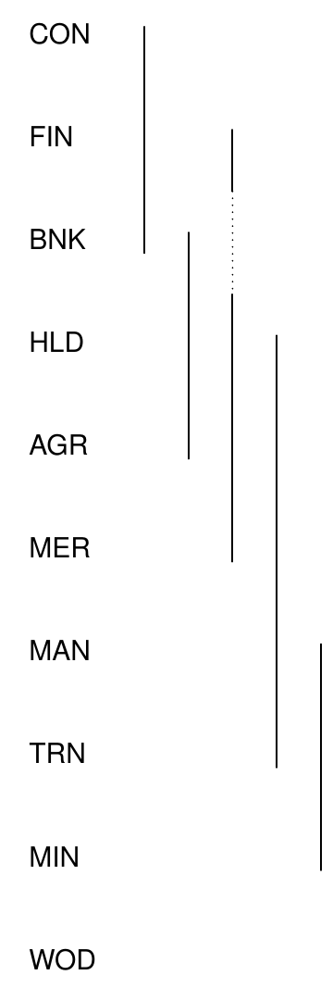
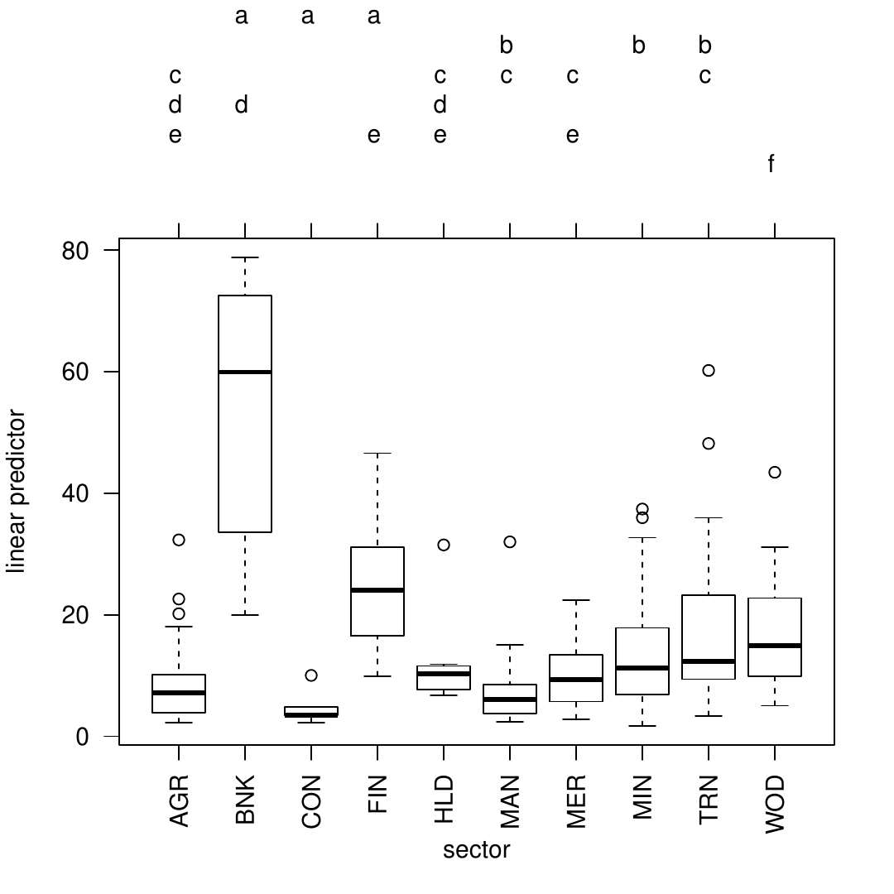
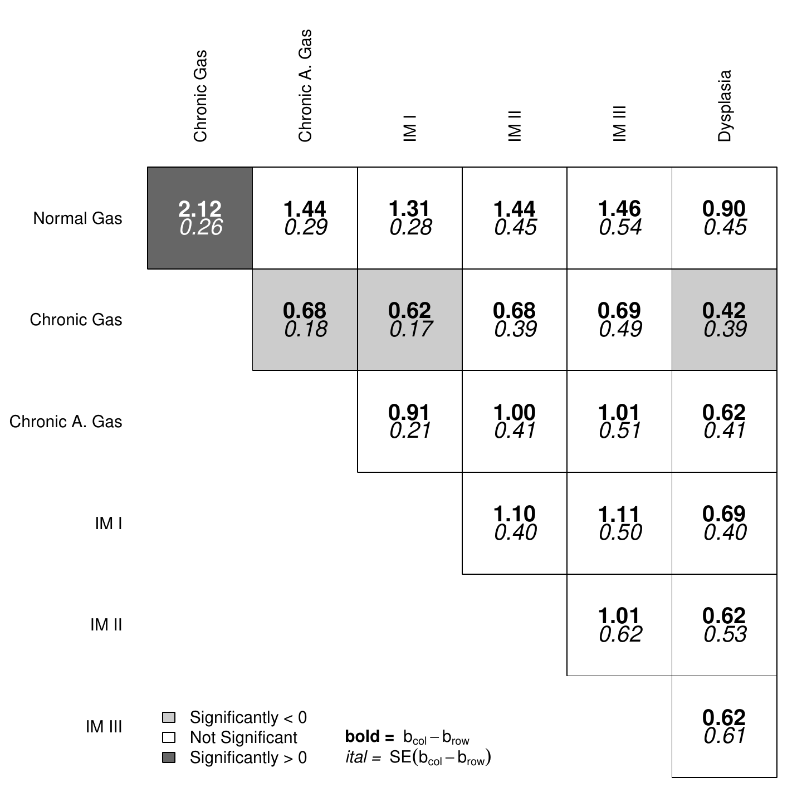
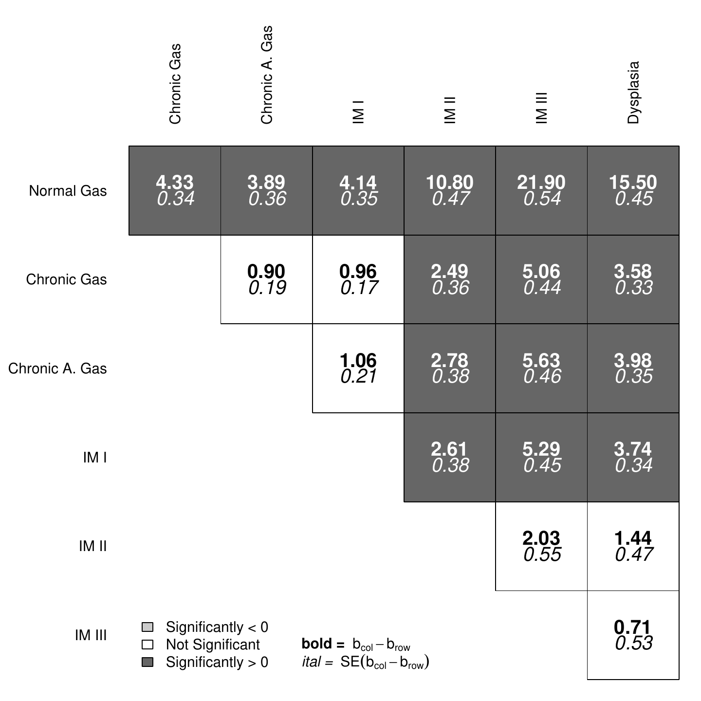

# Introduction

The problem of presenting information about categorical covariates in
generalized linear models is a relatively simple one. Nevertheless, it
has received some attention in the recent literature. To be clear about
the problem, consider the following linear model where $y$ is the
dependent variable and $G = \{1,2,\ldots,m\}$ is a categorical
independent variable that can be represented in the regression model by
$m-1$ dummy regressors, each one representing a different category of
$G$. The reference category, of course, is omitted. Thus, the model
looks as follows:

$$\begin{aligned}
	E(y_{i}) &= \mu_{i}\\
	g(\mu_{i}) &= \beta_{0} + \beta_{1}D_{i1} + \beta_{2}D_{i2} + \dots + \beta_{m-1}D_{im-1} + \beta_{m}X_{i1} + \ldots + \beta_{m+k-1}X_{ik} + \varepsilon_{i},
\end{aligned}$$

where $D_{i1} = 1$ if $G_{i} = 1$, $D_{i2} = 1$ if $G_{i} = 2$, etc.
$X_{ik}$ represent an arbitrary set of additional variables of any type.
Here, each of the coefficients on the dummy regressors for $G$
($\beta_{1},\ldots,\beta_{m-1}$) gives the difference in the conditional
transformed mean of $y$ between the category represented by the dummy
regressor and the reference category, controlling for all of the other
$X_{ik}$. However, the $m-1$ coefficients for the categories of $G$
imply $\frac{m(m-1)}{2}$ simple contrasts representing every pairwise
comparison between categories of $G$. Any single pairwise comparison of
non-reference category coefficients can be conducted in a
straightforward fashion. If the goal is to discern whether the
conditional mean of $y$ given $G=1$ is different from the conditional
mean of $y$ given $G=2$ holding all of the $X$ variables constant, the
quantity of interest is:

$$t = \frac{b_{1}-b_{2}}{\sqrt{V(b_{1} - b_{2})}}  
	\label{eq:t},   (\#eq:t)$$

where

$$V(b_{1} - b_{2}) = V(b_{1}) + V(b_{2}) - 2V(b_{1},b_{2})  
	\label{eq:condvar}.   (\#eq:condvar)$$

Thus, the calculation is not difficult, but calculating and presenting
all of these differences can become cumbersome, especially as $m$ gets
large.[^1] The problem comes not in the calculation of these quantities,
but in the parsimonious presentation of this information that will allow
users to evaluate any desired (simple) contrasts easily. Below, I
discuss two extant methods used to present such information. Floating
absolute risk (FAR) was first suggested by @easton_floating_1991 and was
more rigorously justified, though with different estimation strategies,
by @firth_quasi-variances_2004
[@menezes_more_1999; @plummer_improved_2004]. FAR is a means of
overcoming the reference category problem by calculating floating
variances for all levels of a factor (including the reference category).
These floating variances can be used to perform hypothesis tests or
construct floating confidence intervals that facilitate the graphical
comparison of different categories (i.e., \[log-\]relative risks). The
multiple comparisons literature has traditionally been focused on
finding the appropriate p-values to control either the family-wise error
rate [e.g., @holm_simple_1979] or the false discovery rate [e.g.,
@benjamini_controlling_1995] in a set of simultaneous hypothesis tests.
Presentation of this information has either been in the form of line
displays [e.g., @steel_principles_1980] or compact letter displays
[e.g., @gramm_algorithms_2007] with more recent innovation here by
@graves_multcompView_2012.

However, when simple contrasts are the only quantities of interest,
neither method above is perfect. When floating/quasi-variances are
presented, the user still has to evaluate a potentially large number of
hypothesis tests by either relying on the overlap in the floating
confidence intervals or by calculating the floating t-statistic. Either
solution requires a good deal of cognitive energy on the part of the
analyst or reader. Compact letter displays do well at identifying
patterns of statistical significance, but are perhaps cumbersome to
investigate when patterns of (in)significance are complicated and,
though mitigated to some degree, the problem still exists for the more
recent multcompTs suggested by @graves_multcompView_2012. Below, I
discuss a means for presenting this information in a manner that will
permit the immediate evaluation of all the $m(m-1)/2$ hypothesis tests
associated with simple contrasts. The method I propose can also
calculate analytical standard errors that are not prone to the same
potential inferential errors produced by floating variances. I provide
methods to summarize, print and plot the information in a way that is
both visually appealing and straightforward to understand.

# Solutions to the reference category problem

There are a number of reasonable solutions to the reference category
problem.[^2] The first solution is to present all of the covariance
information required to calculate $t$-statistics for contrasts of
interest (i.e., the variance-covariance matrix of the estimators). This
solution provides the reader with all necessary information to make
inferences. However, it does not provide an easy way for all of these
inferences to be presented. Another solution is to re-estimate the model
with different reference categories in turn.[^3] This method produces
the correct inferential information, but it is inelegant. The modal
response to the reference category problem is a failure to do anything
to discover (or allow readers to investigate) the implied pairwise
differences not captured by the estimated coefficients.

@easton_floating_1991 proposed the idea of floating absolute risk as a
means for evaluating multiple comparisons in matched case-control
studies. The idea was to provide sufficient information such that
readers could perform multiple comparisons with estimates of floating
absolute risk at the expense of presenting a single extra number for
each binary variable representing a level of a categorical covariate
(i.e., risk factor). Although @greenland_presenting_1999 disagreed on
terminology and on the utility of Easton's idea of a floating scale,
they agreed on the utility presenting information that would permit
users to easily make the right inferences about relative risks among any
levels of a categorical risk factor. Both @firth_quasi-variances_2004
and @plummer_improved_2004 provided a more rigorous statistical
foundation on which to build estimates of floating absolute risk (or as
Firth and De Menezes call them, quasi-variances). Firth and De Menezes'
method has been operationalized in R in the
[*qvcalc*](https://CRAN.R-project.org/package=qvcalc) package
[@firth_qvcalc_2010] and both the methods of Plummer as well as
Greenland et al. have been operationalized in the `float()` and
`ftrend()` functions, respectively, in the
[*Epi*](https://CRAN.R-project.org/package=Epi) package
[@bendix_epi_2013]. In general, these solutions allow sufficient (or
nearly sufficient) information to be presented in a single column of a
statistical table that makes valid, arbitrary multiple comparisons
possible.

The measures of floating absolute risk are often used to create floating
(or quasi-) confidence intervals.[^4] Presenting these intervals allows
the user to approximately evaluate hypothesis tests about any simple
contrast. While the exact nature of these confidence intervals is
somewhat controversial (for a discussion, see @easton_presenting_2000
[@greenland_presenting_1999; @greenland_presenting_2000]), all agree
that confidence intervals can be profitably put around some quantity
(either the log-relative risks versus the reference category or the
floating trend) to display the uncertainty around these quantities and
permit visual hypothesis tests.

The methods discussed above still require the analyst or reader to
either evaluate the pairwise hypothesis tests based on the extent to
which confidence intervals overlap or calculate the floating t-statistic
for each desired contrast. If the former, readers must still engage in a
cognitive task of position detection [@cleveland_elements_1985] and then
make an inference based on the extent to which intervals overlap. As the
horizontal distance between vertically-oriented floating confidence
intervals grows, this task becomes more difficult. Finally, as
@easton_floating_1991 suggests, floating variances are a "virtually
sufficient" summary of the uncertainty relating to relative risks;
however, they can produce erroneous inferences if the error rate is
sufficiently high. Both @firth_quasi-variances_2004 and
@plummer_improved_2004 provide methods for calculating this error rate,
which is often small relative to other sources of error in the model.

To put a finer point on the problem, consider the example below using
data from @ornstein_boards_1976 from the
[*car*](https://CRAN.R-project.org/package=car) package [@fox_r_2011].
The model of interest is:

$$\begin{aligned}
	\text{Interlocks}_{i} &\sim \text{Poisson}(\mu_{i})\\
	\log\left(\mu_{i}\right) &= \beta_{0} + \beta_{1}\log_{2}\left(\text{Assets}_{i}\right)+ \mathbf{\gamma}\text{Sector}_{ij} + \mathbf{\theta}\text{Nation}_{im} \nonumber
\end{aligned}$$

where $\mathbf{\gamma}$ represents a set of coefficients on the $j=9$
non-reference category dummy variables for the 10 sectors represented in
the data and $\mathbf{\theta}$ is the set of coefficients for the $m=3$
coefficients on the non-reference category dummy variables representing
the four nations in the dataset. The goal is to determine which sectors
(and/or nations) have significantly different transformed conditional
means of *Interlocks*. The quasi-variances can be presented along with
the coefficients permitting hypothesis testing at the reader's
discretion. This approach is economical, but still requires the
interested reader to make 27 pairwise hypothesis tests for sector and
three pairwise hypothesis tests for nation, beyond those presented in
the coefficient table.

The plot of the floating confidence intervals provides similar
information, but readers are still required to make judgements about
statistical significance with a visual method prone to occasional
inferential errors. Consider Figure [1](#fig:ornqvci), which presents
confidence intervals using the three different functions that produce
floating variances R --- `qvcalc()`, `float()` and `ftrend()`.[^5] In
the figure, the floating confidence interval for the mining sector
overlaps four other floating confidence intervals and does not overlap
the remaining five intervals.[^6] Advice from @smith_visual_1997
suggests that only confidence intervals not containing the point
estimate against which the test is being done are significant. Here, all
of the pairwise differences with the mining coefficient are significant
because none of the point estimates are within the 95% confidence
interval for mining. A more conservative strategy is to fail to reject
null hypotheses where confidence intervals overlap and to reject
otherwise. Using this criterion, the mining sector is different from
five other coefficients --- Agriculture, Banking, Construction, Finance
and Wood. @browne_visual_1979 shows that making inferences from
confidence intervals requires a knowledge of the different sampling
variances of the underlying random variables for which the confidence
intervals have been constructed (i.e., the widths of the intervals
matter); the decision does not rest solely on the extent to which the
intervals overlap. While Browne's method may produce more appropriate
inferences, it is hardly less work than producing the hypothesis tests
directly. When the appropriate pairwise hypothesis tests are performed,
without adjusting the $p$-values for multiple testing, it is clear that
the mining coefficient is different from seven coefficients when using a
two-sided test, as Table [1](#tab:multcompOrn) shows.

::: {#tab:multcompOrn}
  ---------------------------
  Contrast     Estimate/(SE)
  ----------- ---------------
  MIN - AGR       0.250\*

                  (0.069)

  MIN - BNK       0.416\*

                  (0.084)

  MIN - CON       0.739\*

                  (0.210)

  MIN - FIN       0.361\*

                  (0.067)

  MIN - HLD       0.265\*

                  (0.118)

  MIN - MAN        0.128

                  (0.071)

  MIN - MER       0.188\*

                  (0.085)

  MIN - TRN        0.098

                  (0.071)

  MIN - WOD      -0.248\*

                  (0.072)
  ---------------------------

  : Table 1: Analytical Test of Differences between Mining (MIN) and
  Other Sectors
:::

$^{*}$ p \< 0.05, two-sided.\
Estimates and standard errors produced by `glht()` from the *multcomp*
package.

Even if the evidence regarding the outcome of a hypothesis test from two
confidence intervals is clear, there are other potential sources of
error. @cleveland_elements_1985 finds that detecting position along a
common scale is one of the easiest tasks of graphical perception, but
that discerning length is considerably more difficult. His experiments
show that readers are prone to errors in even the easiest graphical
perception tasks and the error rate is nearly twice as high when readers
are asked to adjudicate the relative lengths of lines. Conducting
hypothesis tests using confidence intervals is an endeavor rife with
opportunities for inferential errors.

{#fig:ornqvci width="60.0%" alt="graphic without alt text"}

Means for calculating and presenting models with multiple simple
contrasts have developed in the multiple testing literature as well.
While the thrust of the literature mentioned above was dealing with the
reference category problem directly, the multiple comparisons literature
has placed greater focus on finding the appropriate $p$-values for a set
of hypothesis tests rather than a single test. This can be accomplished
through controlling the family-wise error rate (the probability of
committing a Type I error on *any* of the tests in the set) or the false
discovery rate (the proportion of falsely rejected hypotheses among
those rejected). Chapter 2 of @bretz_multiple_2011 provides a brief, but
informative discussion of these general concepts. While these are useful
concepts, and the package discussed below permits users to adjust
$p$-values in a number of ways to address these issues, I am more
interested in how the multiple testing literature has developed around
the presentation of multiple pairwise comparisons.

@gramm_algorithms_2007 discuss the two generally accepted methods for
presenting multiple comparisons --- the line display and the letter
display. A line display [see for example, @steel_principles_1980] prints
a column where each row represents a single element in the multiple
comparisons. In the example above, using the Ornstein data, these would
be the names of the various sectors. Then, vertical lines are drawn
connecting all values that are not significantly different from each
other. This is a relatively simple display, but as shown generally by
@piepho_algorithm_2004 and in this particular case, it is not always
possible to faithfully represent all of the pairwise comparisons with
connecting line segments. Note that in the third line, a discontinuity
is required to properly depict all of the pairwise relationships.
Further, this method requires that the levels of factors (at least
potentially) be reordered to identify insignificant differences. This
reordering, while reasonable for unordered factors, is not at all
reasonable if the factor is inherently ordered.
Figure [2](#fig:line_let)(a) shows the line display for the Ornstein
model above. A compact letter display [@piepho_algorithm_2004] places a
series of letters by each level of the categorical variable such that
any two levels with the same letter are not significantly different from
each other.[^7] Each letter essentially defines a set of factor levels
that have insignificant differences in coefficients among them. For
example, Banking, Construction and Finance all share the letter "a",
which means their coefficients are statistically indistinguishable from
each other. Note that Wood is the sole factor level with "f", meaning
that it has a statistically different coefficient than all of the other
factor levels. These are more flexible than line displays, though they
can still be improved upon. Even though these displays do identify all
pairwise significant relationships, they do not immediately identify the
sign and size of the differences and what appear to be complicated
patterns of significance may appear more simple with a different mode of
display.

<figure id="fig:line_let">
<table>
<caption> </caption>
<tbody>
<tr class="odd">
<td style="text-align: center;">(a) Line Display</td>
<td style="text-align: center;">(b) Letter Display</td>
</tr>
<tr class="even">
<td style="text-align: center;"></td>
<td style="text-align: center;"></td>
</tr>
</tbody>
</table>
<figcaption>Figure 2: Line and Letter Displays for Ornstein
Model</figcaption>
</figure>

@graves_multcompView_2012 discuss enhancements to the letter display
that make it somewhat more visually appealing and make the cognitive
tasks involved less cumbersome. This method is operationalized by the
`multcompTs` function in the
[*multcompView*](https://CRAN.R-project.org/package=multcompView)
package. While these functions are potentially useful, they are A) still
improved upon by the method discussed below and B) not intended for use
directly with "glm" class objects or "glht" class objects. Despite the
improvements over letter displays, complicated patterns of
(in)significance still result in cluttered displays.

# An alternative method of presentation

I argue that a good solution to the reference category problem is one
that permits the most efficient presentation and evaluation of a series
of hypothesis tests relating to various (simple) factor contrasts. As
discussed above, both the numerical presentation of floating variances
and the visual presentation of floating confidence intervals are not
maximally efficient on either dimension (presentation or evaluation)
when the analyst desires information about the simple pairwise
difference between coefficients related to the levels of a factor (i.e.,
simple contrasts). Similarly, I suggested that compact letter displays
(and to a lesser extent multcompTs), though they present all of the
appropriate information, are not maximally efficient at presenting the
desired information graphically. As @chambers_graphical_1983 and
@cleveland_elements_1985 suggest, one efficient way of presenting many
pairwise relationships is through a scatterplot matrix or a generalized
draftsman's display (a lower- or upper-triangular scatterplot
matrix).[^8] The important feature of a scatterplot matrix is the
organization of pairwise displays in a common scale. Thus, a display
that directly indicates the difference for the simple contrasts of
interest would be superior to one that requires the user to make
$(m(m-1))/2$ pairwise comparisons from $m$ floating variances or
confidence intervals.

The [*factorplot*](https://CRAN.R-project.org/package=factorplot)
function in the package of the same name (version 1.1) for R computes
all pairwise comparisons of coefficients relating to a factor; its
print, summary and plot methods provide the user with a wealth of
information regarding the nature of the differences in these
coefficients.[^9] These functions overcome the problems suffered by
previous methods as they present the results of pairwise hypothesis
tests directly in a visually appealing manner.

The function calculates equation (\@ref(eq:t)) for each simple contrast
directly through a set of elementary matrix operations. First,
$\mathbf{d}$, a $m\times \frac{m(m-1)}{2}$ matrix in which each column
has one entry equal to positive one, one entry equal to negative one and
all the remaining entries equal to zero is created. The positive and
negative ones indicate the comparison being calculated. Using the
coefficients for the desired factor covariate (call them $\mathbf{g}$, a
row-vector of length $m$), I calculate $\Delta = \mathbf{gd}$. Standard
errors for contrasts are calculated using the $m$ rows and columns of
the variance-covariance matrix of the estimators from the model (call
this $V(g)$): $V(\Delta) = \mathbf{d}^{\prime}\mathbf{V}(g)\mathbf{d}$.
The $\Delta$ vector and the square root of the diagonal of $V(\Delta)$
(both of length $\frac{m(m-1)}{2}$) are then organized into
$(m-1)\times(m-1)$ upper-triangular matrices where the rows refer to the
first $m-1$ elements of $\mathbf{g}$ and the columns refer to the last
$m-1$ elements of $\mathbf{g}$. The entries indicate the difference
between the coefficient represented by the row and the coefficient
represented by the column and its standard error.

The function has methods for objects of class "lm", "glm", "glht" and
"multinom" which do slightly different things depending on the input.
The default method will accept a vector of estimates and either A) a
full variance-covariance matrix or B) a vector of quasi or floated
variances that will be turned into a diagonal variance-covariance
matrix. The methods for "lm", "glm", "glht" and "summary.glht" objects
calculate the pairwise differences in the linear predictor for the
values of the specified factor variable. The method for "multinom" class
objects calculates the pairwise differences in coefficients across the
categories of the dependent variable for a single variable (i.e., column
of the model matrix).

## Example 1: Ornstein data

The `factorplot` method for "lm" class objects has six arguments. The
first two arguments, `obj` and `adjust.method`, indicate the object and
the method by which p-values are to be adjusted for multiple comparisons
(possibilities include all of those to `p.adjust` from the *stats*
package). The `factor.variable` argument indicates the factor for which
comparisons are desired. `pval` allows the user to set the desired Type
I error rate and `two.sided` allows the user to specify whether the null
hypothesis is tested against a one- or two-sided alternative with the
latter as the default. The `order` argument sets the ordering of the
coefficients, with three possibilities --- 'natural', 'alph' and 'size'.
The 'natural' option maintains the original ordering of the factor, the
'alph' option sorts them alphabetically and the 'size' option sorts in
ascending order of the magnitude of the coefficient. The choices made
here propagate through the plot, print and summary methods.

The plot method for "factorplot" class objects produces something akin
to an upper-triangular scatterplot. The analogy is not perfect, but the
idea is similar; each entry of the rows-by-columns display indicates the
pairwise difference between coefficients. The statistical significance
of these differences is indicated by three colors (one for
significant-positive, one for significant-negative and one for
insignificant differences). The three colors can be controlled with the
`polycol` argument and the text color within the polygons can be
controlled with the `textcol` argument.[^10] The plot method also allows
the user to specify the number of characters with which to abbreviate
the factor levels through the `abbrev.char` argument. Setting this to an
arbitrarily high value will result in no abbreviation. Finally, the
`trans` argument allows the user to impose a post-hypothesis-test
transformation to the coefficient estimates. For example, if the
underlying model is a logistic regression, tests will be done on the
log-relative risks, but the relative risks could be plotted with
`trans = "exp"`.[^11] By default, the function prints legends
identifying the colors and numbers; these can be turned on or off with
the logical arguments `print.sig.leg` and `print.square.leg`,
respectively. Figure [3](#fig:fporn) shows the display for the Ornstein
model. The following code produces the result in the figure.

``` r
library(factorplot)
library(car)
mod <- glm(interlocks ~ log2(assets) + nation + sector, data = Ornstein, 
    family = poisson)
fp <- factorplot(mod, adjust.method="none", factor.variable = "sector", pval = 0.05, 
 	two.sided = TRUE, order = "natural")
plot(fp, abbrev.char = 100)
```

The print method for a "factorplot" object prints all of the pairwise
differences, their accompanying analytical standard errors and
(optionally adjusted) $p$-values. The user can specify the desired
number of decimal places for rounding, with the `digits` argument. The
`sig` argument is logical allowing the user to print all pairwise
differences if `FALSE` and only significant differences when `TRUE`. The
print method also permits the same `trans` argument as the plot method
for objects of class "factorplot". An example of the output from the
print method is below. Here, twenty-five of the forty-five pairwise
differences are statistically different from zero when.

{#fig:fporn width="100%" alt="graphic without alt text"}

``` r
print(fp, sig = T)
          Difference    SE p.val
AGR - CON      0.489 0.213 0.023
CON - HLD     -0.474 0.235 0.045
BNK - MAN     -0.288 0.102 0.005
CON - MAN     -0.611 0.215 0.005
FIN - MAN     -0.233 0.082 0.005
BNK - MER     -0.228 0.106 0.032
CON - MER     -0.551 0.220 0.013
AGR - MIN     -0.250 0.069 0.000
BNK - MIN     -0.416 0.084 0.000
CON - MIN     -0.739 0.210 0.001
FIN - MIN     -0.361 0.067 0.000
HLD - MIN     -0.265 0.118 0.026
MER - MIN     -0.188 0.085 0.029
BNK - TRN     -0.318 0.082 0.000
CON - TRN     -0.641 0.217 0.004
FIN - TRN     -0.263 0.070 0.000
AGR - WOD     -0.498 0.076 0.000
BNK - WOD     -0.665 0.095 0.000
CON - WOD     -0.988 0.215 0.000
FIN - WOD     -0.610 0.077 0.000
HLD - WOD     -0.513 0.121 0.000
MAN - WOD     -0.376 0.080 0.000
MER - WOD     -0.437 0.090 0.000
MIN - WOD     -0.248 0.072 0.001
TRN - WOD     -0.346 0.081 0.000
```

The summary method for "factorplot" objects prints the number of
coefficients that are significantly smaller than the one of interest and
the number of coefficients larger than the one of interest for each
level of the factor. While this is not a common means of presenting the
results, this does nicely summarize the extent of significant
differences among the coefficients. Below is an example of printout from
the summary method. It is easy to see that the wood industry (WOD) has
the highest conditional means as it is significantly bigger than all of
other categories. It is also easy to see that the construction industry
(CON) has one of the smallest conditional means as it is significantly
smaller than seven of the other categories and not significantly bigger
than any.

``` r
summary(fp)
    sig+ sig- insig
AGR    1    2     6
BNK    0    5     4
CON    0    7     2
FIN    0    4     5
HLD    1    2     6
MAN    3    1     5
MER    2    2     5
MIN    6    1     2
TRN    3    1     5
WOD    9    0     0
```

Together, the `factorplot` function and its associated print, plot and
summary methods provide a wealth of information including direct
hypothesis tests using analytical standard errors for the simple
contrasts most commonly desired in (G)LMs.

## Example 2: *H. pylori* and gastric precancerous lesions

@plummer_heliobacter_2007 were interested in discerning the extent to
which infection with *H. pylori* containing the cytotoxin-associated
(cagA) gene increased the severity of gastric precancerous lesions. They
found that cagA+ patients had increased risks of more severe lesions
while cagA- patients were only at significantly higher risk (than their
uninfected counterparts) of chronic gastritis.
Table [2](#tab:plummer_2007) summarizes the results of the relative risk
of the various types of gastric lesions versus the baseline of normal or
superficial gastritis.

::: {#tab:plummer_2007}
  ---------------------------------- ------- ------- ------- -------
                                      cagA-           cagA+  

                                       OR      FSE     OR      FSE

  Normal and superficial gastritis    1.00    0.242   1.00    0.320

  Chronic gastritis                   2.12    0.096   4.33    0.101

  Chronic atrophic gastritis          1.44    0.156   3.89    0.160

  Intestinal metaplasia I             1.31    0.140   4.14    0.141

  Intestinal metaplasia II            1.44    0.380   10.8    0.349

  Intestinal metaplasia III           1.46    0.484   21.9    0.431

  Dysplasia                           0.90    0.375   15.5    0.311
  ---------------------------------- ------- ------- ------- -------

  : Table 2: Results from Plummer et al. (2007)
:::

OR = odds ratio\
FSE = floating standard error\
Adapted from Figure 1 in @plummer_heliobacter_2007 [p1331].

The default method for the `factorplot` function allows the user to
supply a vector of point estimates and (floating) variances rather than
an estimated model object. This function will be particularly useful for
those scholars in epidemiology, where floating standard errors are more
routinely presented. With 7 levels of the factor in
Table [2](#tab:plummer_2007), there are 21 pairwise comparisons implied,
which would require users to do a lot of calculations. However,
inputting the estimates and floated variances into R and subjecting them
to the `factorplot` function can do all of the calculations
automatically. Below is an example of how the results could be used in
conjunction with the *factorplot* suite of functions.

``` r
est1 <- log(c(1.00,2.12,1.44,1.31,1.44,1.46,0.90))
var1 <- c(0.242,0.096,0.156,0.140,0.380,0.484,0.375)^2
est2 <- log(c(1.00,4.33,3.89,4.14,10.8,21.9,15.5))
var2 <- c(0.320,0.101,0.160,0.141,0.349,0.431,0.311)^2
resdf <- 48+16+27+532+346+144+144+124+58+166+162+75+24+
	53+10+15+61+6+18+90+12-18
names(est1) <- names(est2) <- c(
     "Normal Gas","Chronic Gas", "Chronic A. Gas", 
     "IM I", "IM II", "IM III", "Dysplasia")

plummer_fp1 <- factorplot(est1, var = var1, resdf = resdf, adjust.method = "none")
plummer_fp2 <- factorplot(est2, var = var2, resdf = resdf, adjust.method = "none")
plot(plummer_fp1, trans = "exp", abbrev.char = 100, scale.text = 1.5, 
    scale.space = 1.5)
plot(plummer_fp2, trans = "exp", abbrev.char = 100, scale.text = 1.5, 
    scale.space = 1.5)
```

The plots are displayed in Figure [4](#fig:fp_plummer). The left-hand
plot suggests that *H. pylori* cagA- seems to raise the risk of chronic
gastritis relative to Intestinal metaplasia I and the reference group of
normal and superficial gastritis. The differences in the risk of chronic
gastritis and chronic atrophic gastritis or dysplasia are also
significant. The right-hand plot indicates that there are no significant
differences among the second through fourth diagnoses and the fifth
through seventh diagnoses. The difference between the risk of intestinal
metaplasia I and II (for cagA+) is also significant.

<figure id="fig:fp_plummer">
<table>
<caption> </caption>
<tbody>
<tr class="odd">
<td style="text-align: center;">(a) cagA-</td>
<td style="text-align: center;">(b) cagA+</td>
</tr>
<tr class="even">
<td style="text-align: center;"></td>
<td style="text-align: center;"></td>
</tr>
</tbody>
</table>
<figcaption>Figure 4: Results from Plummer et al. (2007) Presented as
factorplots</figcaption>
</figure>

## Example 3: vote choice in France

When `factorplot()` encounters an object of class `multinom`, it will
make comparisons within the same variable across all levels of the
dependent variable. The coefficient table presents a specific set of
pairwise comparisons --- namely those indicating the relationship of
each variable to the binary choice of each non-reference category versus
the reference category. However, other comparisons implied by that
coefficient table may be interesting or useful and should be
investigated.

In the example below, I estimate a multinomial logistic regression model
of vote choice (`vote`) on a number of standard controls: retrospective
national economic evaluations (`retnat`), self-placement on the
left-right ideological continuum (`lrself`), gender (`male`) and age
(`age`).[^12]

``` r
library(nnet)
data(france)
france.mod <- multinom(vote ~ retnat + lrself + male + age, data = france)
fp3 <- factorplot(france.mod, variable = "age")
plot(fp3)
```

{#fig:fpmnl width="100%" alt="graphic without alt text"}

Figure [5](#fig:fpmnl) shows that as people get older, they are more
likely to vote for RPR or UDF than the Greens or Communists (PCF) and
more likely to vote for the Socialists (PS) than the Greens. If one is
interested in whether variables have significant effects on vote choice,
all pairwise comparisons should be considered. `factorplot` makes it
easy for users to appropriately evaluate all relevant pairwise
comparisons.

# Conclusion

Easton's (1991) contribution of floating absolute risk has been
influential, especially in epidemiology and medicine, allowing
researchers to present easily information that permits the reader to
make any pairwise comparison among the different levels of a risk
factor. @firth_quasi-variances_2004 [@menezes_more_1999] and
@plummer_improved_2004 have provided not only a rigorous, model-based
foundation for this idea, but have also provided software that easily
produces these quantities for a wide array of statistical models. I
argue that while these quantities are interesting and useful, floating
confidence intervals, which are often provided ostensibly to permit
hypothesis testing can be imprecise and potentially misleading, as
regards hypothesis testing. Compact letter displays
[@piepho_algorithm_2004] are a step in the right direction, but I argue
that they can still be improved upon in terms of graphically presenting
information of interest to many researchers. In the common situation
wherein one is interested in simple contrasts, the `factorplot()`
functions and their associated print, plot and summary methods discussed
above provide much greater transparency with respect to the presentation
and evaluation of hypothesis tests than floating absolute risk or
quasi-variance estimates. The visual presentation of direct hypothesis
tests requires much less effort to adjudicate significance and uncover
patterns in the results than other methods, including compact letter
displays. While the calculation of these hypothesis tests is not novel,
the methods of presenting and summarizing the information represent a
significant advance over the previously available general solutions
available in R.

# Acknowledgements

I would like to thank Bob Andersen, Ryan Bakker, John Fox, Bill Jacoby,
Martyn Plummer and an anonymous reviewer as well as participants in the
Regression III course at the ICPSR Summer Program for helpful comments
and suggestions.


[^1]: Tools to carry out these computations already exist in the
    [*multcomp*](https://CRAN.R-project.org/package=multcomp) package in
    R [@hothorn_simultaneous_2008].

[^2]: The problem here applies particularly to polytomous, unordered
    risk factors or covariates. The case of ordinal risk factors, where
    only the difference in adjacent categories is of interest, is a bit
    less troublesome and will not be dealt with separately here.

[^3]: In fact, this re-parameterization method could be used to deal
    with more complicated contrasts, too. For example, it could be used
    to deal with the problem proposed by @greenland_presenting_1999
    wherein they wanted to estimate the relative risk of being above a
    particular category on birthweight.

[^4]: Occasionally, quasi-variance estimates are negative, which provide
    the right inferences, but do not permit plotting of quasi-confidence
    intervals.

[^5]: The figure below subtracts the arbitrary constant from the results
    of `ftrend()` to put all of these estimates on the same scale. I
    recognize that this is not what the authors had intended, but this
    should not lead to erroneous inferences in any event
    [@easton_presenting_2000].

[^6]: Horizontal gray lines have been drawn at the smallest lower- and
    largest upper-bounds of the mining sector floating confidence
    intervals to facilitate comparison. Note that differences across the
    three methods in the upper bounds and lower bounds were in the third
    decimal place.

[^7]: The boxplot on the graph is a boxplot of the linear predictor from
    the statistical model. If there were no other covariates in the
    model, this would just be a boxplot of the response variable by the
    different factor levels. While this does provide some information,
    it does not indicate how the predicted response changes as a
    function of the factor holding other things constant, which would
    perhaps be more useful.

[^8]: @cleveland_elements_1985 makes the argument in favor of a full
    scatterplot matrix, but in this case, the information presented in
    the upper-triangle is sufficient as nothing new could be learned by
    examining the full square matrix.

[^9]: The methods for "lm", "glm", "multinom" and the default method use
    the calculations mentioned below. The method for "glht" and
    "summary.glht" objects uses the built-in functionality from the
    *multcomp* package to do these calculations. The benefit here is
    that if a small subset of comparisons is desired, this subset can be
    identified in the call to `glht()` and only those comparisons will
    be computed, thus increasing efficiency.

[^10]: The printing of the estimates and standard errors can both be
    turned off with `print.est = FALSE` and `print.se = FALSE`,
    respectively.

[^11]: After the hypothesis tests are done, a matrix named `r.bdiff`
    holds the coefficient differences. The transformation is done as
    follows: `do.call(trans, list(r.bdiff))`, so only transformations
    amenable to this procedure will work.

[^12]: See help for `france` in the package *factorplot* for more
    details about the origin and coding of the data.
