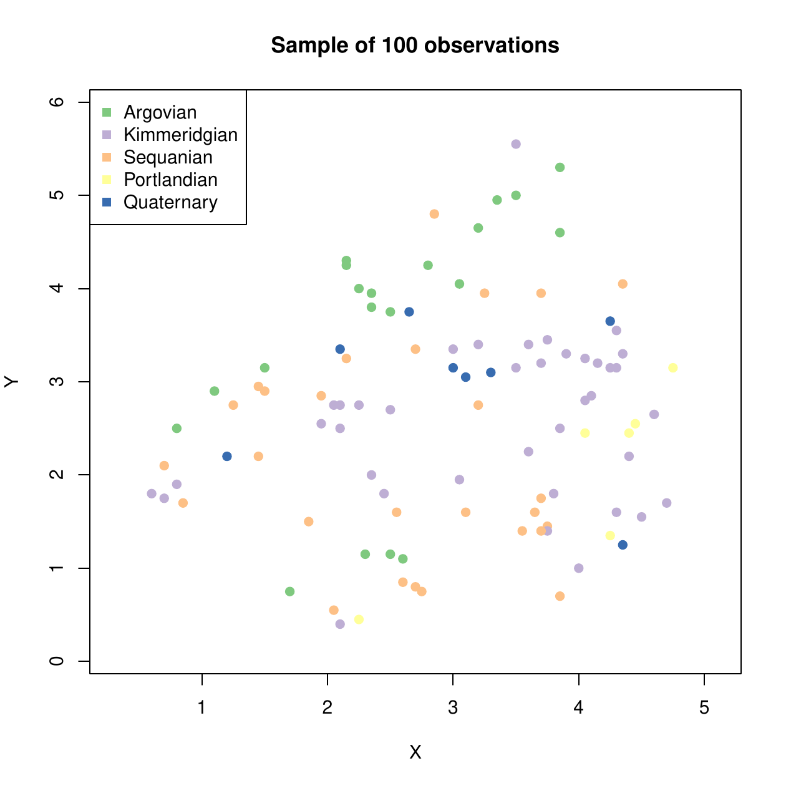

::: article
# Introduction

Originally, the [*spMC*](https://CRAN.R-project.org/package=spMC)
package [@Sartore:2013] was developed with the purpose of analysing
categorical data observed in 3-D locations. It deals with stochastic
models based on Markov chains, which may be used for the analysis of
spatial random patterns in continuous multidimensional spaces
[@Carle+Fogg:1997]. Its results are easily interpretable and it is a
good alternative to the T-PROGS software developed by @Carle:1999, which
is oriented towards modelling groundwater systems. The models considered
in the *spMC* package are used to analyse any categorical random
variable $Z(\mathbf{s})$ at the $d$-dimensional position $\mathbf{s} \in
\mathbb{R}^d$ which satisfies the Markov property. Other R packages are
also helpful for analysing categorical spatial data. For example, the
[*gstat*](https://CRAN.R-project.org/package=gstat) package
[@Pebesma:2004] allows for analyses using traditional methods such as
the parameter estimation of spatial models based on variograms and
kriging techniques for predictions. All these methods and their variants
are also available in other packages,
e.g. [*geoRglm*](https://CRAN.R-project.org/package=geoRglm)
[@Christensen+Ribeiro:2002] and
[*RandomFields*](https://CRAN.R-project.org/package=RandomFields)
[@Schlather:2013]. When $Z(\mathbf{s})$ is assumed to be linked to a
continuous hidden random process, these packages are useful for studying
the covariance structure of the data.

The *spMC* package extends the functionality of the T-PROGS software to
R users. New useful functions are included for faster modelling of
transition probability matrices, and efficient algorithms are
implemented for improving predictions and simulations of categorical
random fields. The main tasks and their functions are clearly summarised
in Table [1](#table:FUN). Three different fitting methods were
implemented in the package. The first is based on the estimates of the
main features that characterise the process, the second focuses on the
minimisation of the discrepancies between the empirical and theoretical
transition probabilities, and the third follows the maximum entropy
approach. Once the model parameters are properly estimated, transition
probabilities are calculated through the matrix-valued exponential
function [see @Higham:2008 Algorithm 10.20 in Chapter 10]. These
transition probabilities are then combined to predict the category in an
unsampled position. Three algorithms are used to simulate spatial random
fields; those based on the kriging techniques [@Carle+Fogg:1996], those
using fixed and random path methods [@Li:2007; @Li+Zhang:2007], or those
using multinomial categorical simulation proposed by @Allard:2011. In
order to reduce computation time through OpenMP API [version 3.0;
@OpenMP:2008], the `setCores()` function allows the user to change the
number of CPU cores, so that one can mix shared memory parallel
techniques with those based on the Message Passing Interface
[@MPIForum:1993] as described in @Smith:2000.

::: {#table:FUN}
  -----------------------------------------------------------------------------------------------------------------------------------------------
  Tasks and functions                                            Techniques implemented in the *spMC* package
  -------------------------------------------------------------- --------------------------------------------------------------------------------
  *Estimations of one-dimensional continuous lag models*         

  `transiogram`                                                  Empirical transition probabilities estimation

  `tpfit`                                                        One-dimensional model parameters estimation

  `tpfit_ils`                                                    Iterated least squares method for one-dimensional model parameters estimation

  `tpfit_me`                                                     Maximum entropy method for one-dimensional model parameters estimation

  `tpfit_ml`                                                     Mean length method for one-dimensional model parameters estimation

                                                                  

  *Estimations of multidimensional continuous lag models*        

  `pemt`                                                         Pseudo-empirical multidimensional transiograms estimation

  `multi_tpfit`                                                  Multidimensional model parameters estimation

  `multi_tpfit_ils`                                              Iterated least squares method for multidimensional model parameters estimation

  `multi_tpfit_me`                                               Maximum entropy method for multidimensional model parameters estimation

  `multi_tpfit_ml`                                               Mean length method for multidimensional model parameters estimation

                                                                  

  *Categorical spatial random field simulation and prediction*   

  `sim`                                                          Random field simulation

  `sim_ck`                                                       Conditional simulation based on indicator cokriging

  `sim_ik`                                                       Conditional simulation based on indicator kriging

  `sim_mcs`                                                      Multinomial categorical simulation

  `sim_path`                                                     Conditional simulation based on path algorithms

                                                                  

  *Graphical tools*                                              

  `plot.transiogram`                                             Plot one-dimensional transiograms

  `mixplot`                                                      Plot of multiple one-dimensional transiograms

  `contour.pemt`                                                 Display contours with pseudo-empirical multidimensional transiograms

  `image.pemt`                                                   Images with pseudo-empirical multidimensional transiograms

  `image.multi_tpfit`                                            Images with multidimensional transiograms
  -----------------------------------------------------------------------------------------------------------------------------------------------

  : Table 1: Most important user functions in the *spMC* package.
:::

Here, it will be shown how to perform a geostatistical analysis of the
Jura data set [@Goovaerts:1997] using the *spMC* package (version
0.3.1). The data set consists of 359 sampled spatial coordinates and
their respective observed realisations of two categorical variables
(related to the rock-type and the land use) and some continuous
variables (corresponding to the topsoil content).

# Brief overview of the models

The *spMC* package deals with both one-dimensional and multidimensional
continuous lag models. If $Z(\mathbf{s}_l)$ denotes a categorical random
variable in a location $\mathbf{s}_l$, for any $l =
1, \ldots, n$, its outcome conventionally takes values in the set of
mutually exclusive states $\left\{z_1, \ldots, z_K\right\}$, where $K$
represents the total number of observable categories. A continuous lag
Markov chain model organises the conditional probabilities
$$t_{ij}(\mathbf{s}_l - \mathbf{s}_k) = \Pr(Z(\mathbf{s}_l) = z_j
\vert Z(\mathbf{s}_k) = z_i),$$
for any $i, j = 1, \ldots, K$, in a $K \times K$ transition probability
matrix. Generally speaking, such a model is a transition probability
matrix-valued function depending on one-dimensional or multidimensional
lags, i.e.
$$\mathbf{T}(h_\phi) : \mathbb{R}^d \rightarrow [0, 1]^{K \times K},$$
wherein $h_\phi$ denotes a $d$-dimensional continuous lag along the
direction $\phi \in \mathbb{R}^d$. Such a lag corresponds to the
difference between the location coordinates and is proportional to the
direction $\phi$. The exponential form,

$$\begin{aligned}
 \mathbf{T}(h_\phi) &= \exp \left( \Vert h_\phi \Vert \mathbf{R}_\phi \right), \\
                    &= \sum_{u = 0}^\infty \frac{\Vert h_\phi \Vert^u}{u!} \mathbf{R}_\phi^u, \notag  
                    \label{eq:model}
\end{aligned}   (\#eq:model)$$

is usually adopted to model the observed variability and local
anisotropy. The components of the transition rate matrix
$\mathbf{R}_\phi \in \mathbb{R}^{K \times K}$ (the model coefficients)
depend on the direction $\phi$ and they must satisfy the following
properties [@Norris:1998 Section 2.1]:

-   $r_{ii} \leq 0$, for any $i = 1, \ldots, K$.

-   $r_{ij} \geq 0$, if $i \neq j$.

-   The row sums satisfy
    $$\sum_{j = 1}^K r_{ij} = 0.$$

-   The column sums satisfy
    $$\sum_{i = 1}^K p_i r_{ij} = 0,$$
    where $p_i$ is the proportion of the $i$-th category.

The components of $\mathbf{R}_{-\phi}$ may be computed through the
relation
$$r_{ij,~-\phi} = \frac{p_j}{p_i} r_{ji,~\phi} \qquad \forall i, j =
1, \ldots, K,$$
where $-\phi$ denotes the opposite direction.

# Transition rate matrix estimation

In order to obtain an estimate of the transition rate matrix along the
direction $\phi$, the package provides two solutions, i.e. by following
the one-dimensional approach or the multidimensional. The latter
estimates the matrix $\mathbf{R}_\phi$ by the ellipsoidal interpolation
of $d$ matrices, which are computed along the axial directions through
one-dimensional procedures.

The one-dimensional techniques related to the `tpfit_ml()` and
`tpfit_me()` functions are based on mean lengths
$\overline{L}_{i, ~\phi}$ and transition frequencies of embedded
occurrences $f^*_{kj, ~\phi}$. The iterated least squares method is
implemented through the `tpfit_ils()` function.

The first two functions estimate the stratum mean lengths for each
category through the `mlen()` function. The mean lengths are computed
either with the average of the observed stratum lengths or their
expectation based on the maximum likelihood estimate by assuming that
the observed lengths are independent realisations of a log-normal random
variable. In order to verify the distributional assumption on the
lengths, the function `getlen()` estimates stratum lengths of embedded
Markov chains along a chosen direction, while other functions such as
`boxplot.lengths()`, `density.lengths()`, `hist.lengths()` are used for
graphical diagnostics.

The `tpfit_ml()` function computes the transition frequencies of
embedded occurrences as an average through the function `embed_MC()`.
The maximum entropy method, adopted by the `tpfit_me()` function,
calculates the transition frequencies of embedded occurrences through
the iterative proportion fitting [@Goodman:1968]. The algorithm may be
summarised as follows:

1.  Initialise $f_{i, ~\phi}$ with $p_i / \overline{L}_{i, ~\phi}$.

2.  Compute $f^*_{ij, ~\phi} = f_{i, ~\phi} f_{j, ~\phi}$ $\forall
      i,j = 1, \ldots, K$.

3.  Compute
    $$f_{i, ~\phi} = \frac{p_i \sum_{k = 1}^K \sum_{j \neq k}^K
        f^*_{kj, ~\phi}}{\overline{L}_{i, ~\phi} \sum_{j \neq i}^K
        f^*_{ij, ~\phi}}.$$

4.  Repeat the second and the third step until convergence.

Both `tpfit_ml()` and `tpfit_me()` functions estimate the autotransition
rates as $r_{ii} = - 1 / \overline{L}_{i, ~\phi}$, while the rates for
any $i \neq j$ are calculated as $r_{ij, ~\phi} =
f^*_{ij, ~\phi} / \overline{L}_{i, ~\phi}$.

The `tpfit_ils()` function estimates the transition rate matrix by
minimising the sum of the squared discrepancies between the empirical
probabilities given by the `transiogram()` function and theoretical
probabilities given by the model. The bound-constrained Lagrangian
method [@Conn+Gould+Toint:1991] is performed in order to have a proper
transition rate matrix, which satisfies the transition rate properties.

The multidimensional approach is computationally efficient. In fact a
generic entry of the matrix $\mathbf{R}_\phi$ is calculated by the
ellipsoidal interpolation as

$$\vert r_{ij, ~\phi} \vert =
  \sqrt{\sum_{v = 1}^d \left( \frac{h_{v, ~\phi}}{\Vert h_\phi \Vert}
      r_{ij, ~\mathbf{e}_v} \right)^2},  
      \label{eq:rates}   (\#eq:rates)$$

where $h_{v, ~\phi}$ is the $v$-th component of the vector $h_\phi$,
$\mathbf{e}_v$ represents the standard basis vector, and the rate
$r_{ij, ~\mathbf{e}_v}$ is replaced by $r_{ij, ~-\mathbf{e}_v}$ for
components $h_{v, ~\phi} < 0$. In this way, it is only necessary to have
in memory the estimates for the main directions.

The `multi_tpfit_ml()`, `multi_tpfit_me()` and the `multi_tpfit_ils()`
functions automatically perform the estimation of $d$ transition rate
matrices along the axial directions with respect to the chosen
one-dimensional method.

# Prediction and simulation based on transition probabilities

Several methods were developed to predict or simulate the category in an
unobserved location $\mathbf{s}_0$ given the knowledge of the sample
positions $\mathbf{s}_1, \ldots, \mathbf{s}_n$. The conditional
probability,
$$\Pr\left( Z(\mathbf{s}_0) = z_i \left\vert \bigcap_{l = 1}^n
    Z(\mathbf{s}_l) = z(\mathbf{s}_l)\right. \right),$$
is used to predict or simulate the category in $\mathbf{s}_0$, where
$z_i$ represents the $i$-th category and $z(\mathbf{s}_l)$ is the
observed category in the $l$-th sample location.

Usually such a probability is approximated through

-   Kriging- and Cokriging-based methods, implemented in the `sim_ik()`
    and `sim_ck()` functions.

-   Fixed or random path algorithms, available in `sim_path()`.

-   Multinomial categorical simulation procedure, `sim_mcs()` function.

The approximation proposed by @Carle+Fogg:1996 is implemented in the
functions `sim_ik()` and `sim_ck()`. Both of them use some variant of
the following
$$\Pr\left( Z(\mathbf{s}_0) = z_j \left\vert \bigcap_{l = 1}^n Z(\mathbf{s}_l) = z(\mathbf{s}_l)\right. \right) \approx \sum_{l = 1}^n \sum_{i = 1}^K w_{ij, ~l} ~ c_{il},$$
where
$$c_{il} = \begin{cases} 1 &\text{if } z(\mathbf{s}_l) = z_i, \\ 0
  &\text{otherwise,} \end{cases}$$
and the weights $w_{ij, ~l}$ are calculated by solving the following
system of linear equations:

$$\begin{bmatrix} \mathbf{T}(\mathbf{s}_1 - \mathbf{s}_1) & \cdots & \mathbf{T}(\mathbf{s}_n - \mathbf{s}_1) \\
    \vdots & \ddots & \vdots \\
    \mathbf{T}(\mathbf{s}_1 - \mathbf{s}_n) & \cdots &
    \mathbf{T}(\mathbf{s}_n - \mathbf{s}_n) \end{bmatrix}
\begin{bmatrix} \mathbf{W}_1 \\ \vdots \\ \mathbf{W}_n \end{bmatrix} = 
\begin{bmatrix} \mathbf{T}(\mathbf{s}_0 - \mathbf{s}_1) \\ \vdots \\
  \mathbf{T}(\mathbf{s}_0 - \mathbf{s}_n)\end{bmatrix},$$
where
$$\mathbf{W}_l = \begin{bmatrix} w_{11, ~l} & \cdots & w_{1K, ~l}\\
  \vdots & \ddots & \vdots \\
  w_{K1, ~l} & \cdots & w_{KK, ~l} \end{bmatrix}.$$

This approximation does not satisfy the probability axioms, because such
probabilities might lie outside the interval $[0, 1]$ and it is not
ensured that they sum up to one. To solve the former problem truncation
is considered, but the usual normalisation is not adopted to solve the
latter; in fact, after the truncation, these probabilities might also
sum up to zero instead of one. The implemented stabilisation algorithm
translates the probabilities with respect to the minimum computed for
that point. Then, the probabilities are normalised as usual.

To improve the computational efficiency of the algorithm, the
$m$-nearest neighbours are considered in the system of equations instead
of all sample points; in so doing, a decrease in computing time is noted
and the allocated memory is drastically reduced to a feasible quantity.

For the approximation adopted in the `sim_path()` function, conditional
independence is assumed in order to approximate the conditional
probability as in the analysis of a Pickard random field
[@Pickard:1980]. This method, as described in @Li:2007a, considers $m$
known neighbours in the axial directions, so that the probability is
computed as
$$\begin{aligned}
  \Pr\left( Z(\mathbf{s}_0) = z_i \left\vert \bigcap_{l = 1}^n Z(\mathbf{s}_l) = z(\mathbf{s}_l)\right. \right) &\approx \Pr\left(Z(\mathbf{s}_0) = z_i \left\vert \bigcap_{l = 1}^{m} Z(\mathbf{s}_l) = z_{k_l} \right.\right) \propto \\
  &\propto t_{k_1 i}(\mathbf{s}_0 - \mathbf{s}_1) \prod_{l = 2}^m t_{i
    k_l}(\mathbf{s}_0 - \mathbf{s}_l).
\end{aligned}$$

The method proposed by @Allard:2011 is implemented in the `sim_mcs()`
function. It was introduced to improve the computational efficiency of
the Bayesian maximum entropy approach proposed by @Bogaert:2002. Here,
the approximation of the conditional probability is
$$\Pr\left( Z(\mathbf{s}_0) = z_i \left\vert \bigcap_{l = 1}^n
    Z(\mathbf{s}_l) = z(\mathbf{s}_l)\right. \right) \approx
\frac{\displaystyle p_{i} \prod_{l = 1}^n t_{i k_l}(\mathbf{s}_0 -
  \mathbf{s}_l)}{\displaystyle \sum_{i = 1}^K p_{i} \prod_{l = 1}^n
  t_{i k_l}(\mathbf{s}_0 - \mathbf{s}_l)}.$$
Also in this case, the user can choose to apply this approximation by
considering all data or only the $m$-nearest neighbours, with the same
advantages described above.

Once the conditional probabilities are computed, the prediction is given
by the highest probable category, while the simulation is given by
randomly selecting one category according to the computed probabilities.

After the first simulation is drawn, the `sim_ik()` and `sim_ck()`
functions execute an optimisation phase in order to avoid "artifact
discontinuities", wherein the simulated patterns do not collimate with
the conditioning data [@Carle:1997]. The user can then choose to perform
simulated annealing or apply a genetic algorithm in order to reduce the
quantity
$$\sum_{i = 1}^K \sum_{j = 1}^K \left(r_{ij, ~\mathrm{SIM}} - r_{ij,
    ~\mathrm{MOD}}\right)^2 + \sum_{i = 1}^K \left(p_{i,
    ~\mathrm{SIM}} - p_{i, ~\mathrm{MOD}}\right)^2,$$
where $r_{ij,
  ~\mathrm{SIM}}$ and $p_{i, ~\mathrm{SIM}}$ are coefficients estimated
from the pattern to optimise, while $r_{ij, ~\mathrm{MOD}}$ and
$p_{i, ~\mathrm{MOD}}$ are those used to generate the initial
simulation. Other comparison methods are also available through the
argument `optype`.

# An example with the Jura data set

The data set consists of spatial coordinates and the observed values of
both categorical and continuous random variables collected at 359
locations in the Jura region in Switzerland. In particular, we will deal
with the rock-type categorical variable of the geological map created by
@Goovaerts:1997 [see Figure [4](#figure:jura)], which consists of 5957
sites. The aim of these analyses is related to the parameters estimation
of the model in \@ref(eq:model), and its interpretation through
graphical methods. These analyses are useful to check the model
assumptions and to ensure the accuracy of the predictions.

First, the *spMC* package and the Jura data set in the *gstat* package
are loaded as follows:

``` r
  library(spMC)
  data(jura, package = "gstat")
```

If the package is compiled with the OpenMP API, the number of CPU cores
to use can be set by

``` r
  setCores(4)
```

otherwise a message will be displayed and only one core can be
internally used by the *spMC* package.

In order to study the spatial variability of the data and interpret the
transitions from a geometrical viewpoint, the empirical transition
probabilities along the main axes are calculated. These probabilities
point out the persistence of a category according to the lag between two
points. They also provide juxtapositional and asymmetrical features of
the process, which are not detected by adopting indicator
cross-variograms [@Carle+Fogg:1996]. Therefore, all couples of points
along axial directions are chosen such that their lag-length is less
than three. After, we calculate the empirical transition probabilities
for twenty points within the maximum distance. This can be conducted
with the execution of the following code:

``` r
  data <- jura.grid[, 4]
  coords <- jura.grid[, 1:2]
  Trg <- list()
  Trg[[1]] <- transiogram(data, coords, max.dist = 3, mpoints = 20,
                          direction = c(1, 0))
  Trg[[2]] <- transiogram(data, coords, max.dist = 3, mpoints = 20,
                          direction = c(0, 1))
```

If we want to compare these probabilities with the theoretical one, we
first need to estimate two transition rate matrices, i.e. the model
coefficients, along the axial directions. Three estimation methods are
available in the *spMC* package (see Table [1](#table:FUN)), but only
those based on mean lengths and maximum entropy are shown, even though
the iterated least squares may be similarly applied. The code to
estimate the transition rates through the mean lengths method is written
as follows:

``` r
  RTm <- list()
  RTm[[1]] <- tpfit_ml(data, coords, direction = c(1, 0))
  RTm[[2]] <- tpfit_ml(data, coords, direction = c(0, 1))
```

In this case, the mean lengths are calculated through the average of the
stratum lengths along the chosen directions. On the other hand, to
estimate the transition rate matrices through the maximum entropy
approach, the following code must be executed:

``` r
  ETm <- list()
  ETm[[1]] <- tpfit_me(data, coords, direction = c(1, 0))
  ETm[[2]] <- tpfit_me(data, coords, direction = c(0, 1))
```

Given the model coefficients, the transition probabilities for some
specific lags are calculated as in \@ref(eq:model). This is done as
follows:

``` r
  RTr <- list()
  ETr <- list()
  for (i in 1:2) {
      RTr[[i]] <- predict(RTm[[i]], lags = Trg[[i]]$lags)
      ETr[[i]] <- predict(ETm[[i]], lags = Trg[[i]]$lags)
  }
```

Since these probabilities are calculated with respect to some fixed
directions, i.e. by considering a one-dimensional perspective, they can
be graphically compared. By the use of the `mixplot()` function, several
transition probability diagrams (transiograms) can be superposed in a
unique graphic, e.g.

``` r
  for (i in 1:2)
    mixplot(list(Trg[[i]], RTr[[i]], ETr[[i]]), type = c("p", "l", "l"), pch = "+",
            col = c(3, 1, 2), legend = FALSE, main = paste(
            "One-dimensional transiograms", c("(X-axis)", "(Y-axis)")[i]))
```

By looking at the graphics in Figure [1](#figure:mxplotXY), one can see
how well the estimated models fit the observed probabilities (green
points). This kind of graphic may be interpreted as a transition
probability matrix; in fact it shows the probability dynamic related to
one-dimensional lags along the specified direction. For example, let us
consider the first horizontal line of graphics in
Figure [1](#figure:mxplotXY) on the left. They denote the transition
probabilities at each lag from the Argovian state to one of the five
categories.

<figure id="figure:mxplotXY">
<p></p>
<figcaption>Figure 1: <span id="figure:mxplotXY"
label="figure:mxplotXY"></span> Empirical transiogram (green points) and
theoretical probabilities (average method in black lines, maximum
entropy method in red) along the <span
class="math inline"><em>X</em></span>-axis (left) and along the <span
class="math inline"><em>Y</em></span>-axis (right).</figcaption>
</figure>

These graphics are mainly used to investigate the stationarity of the
stochastic process. In particular, the process is weakly stationary if
the expected probabilities are not dependent on the location points,
i.e. $\mathbb{E}[\Pr(Z(\mathbf{s}) = z_i)] = p_i$ for all $\mathbf{s} \in
\mathbb{R}^d$. Theoretically, the transition probability matrix in
\@ref(eq:model) becomes constant as the lag distance $\Vert h_\phi
\Vert \to \infty$. In order to check the stationarity property of the
process along one fixed direction $\phi$, we need to look at empirical
transition probabilities computed for large distances. If most of these
probabilities reproduce the characteristics already described, the data
might be considered as a realisation from a weakly stationary process.

The comparison can also be made between two or more transiograms drawn
for different directions. In so doing, it is possible to check if the
process is anisotropic. This happens when there is directional
dependence in the data. From a probabilistic point of view, the
transiogram may show different dynamics when it approaches the limit
probability matrix along different directions. In our case, the
behaviours of the empirical transition probabilities along the axial
directions do not match. Although those based on the estimated model are
more regular than the empirical, they are not similar. This means that
the Jura data set is anisotropic.

The function `pemt()` can be considered as another tool to check the
anisotropy of the process. It estimates the transition rate matrix for
each multidimensional lag direction and computes the transition
probabilities as in \@ref(eq:model). At the same time the function
calculates other probabilities through the transition rates computed as
in \@ref(eq:rates). Then the probabilities are drawn by use of the
function `image.pemt()` (see Figure [2](#figure:pseudoTr)). If
probabilities at the same level (those with the same colour) are placed
on ellipses, the process is characterised by geometrical anisotropy.
Comparisons made by the use of `contour.pemt()` are more evident,
because contour lines are displayed for both the pseudo-empirical and
the theoretical probabilities in a unique graphic.

![Figure 2: []{#figure:pseudoTr label="figure:pseudoTr"}
Multidimensional pseudoempirical
transiogram.](Rplots_3.png){#figure:pseudoTr width="90.0%" alt="graphic without alt text"}

The following R code can be executed to obtain
Figure [2](#figure:pseudoTr):

``` r
  psEmpTr <- pemt(data, coords, 40, max.dist = c(.5, .5))
  mycol <- rev(heat.colors(500))
  image(psEmpTr, col = mycol, useRaster = TRUE, breaks = c(0:500) / 500)
```

From a computational point of view, the model based on the ellipsoidal
interpolation of transition rate matrices is the most efficient way to
calculate transition probabilities given multidimensional lags. In these
cases, the model coefficients can be separately estimated by a unique R
function. Hence, the functions `multi_tpfit_ml()` and `multi_tpfit_me()`
provide methods to estimate transition rate matrices along axial
directions. These functions implement algorithms based on the mean
lengths and the maximum entropy respectively (see
Table [1](#table:FUN)).

``` r
  MTr <- list()
  MTr$average <- multi_tpfit_ml(data, coords)
  MTr$entropy <- multi_tpfit_me(data, coords)
```

With the output of these functions, we can draw the theoretical
transition probability maps as follows:

``` r
  image(MTr$average, 40, max.dist = 0.25, col = mycol, nlevels = 5,
        breaks = 0:500 / 500)
  image(MTr$entropy, 40, max.dist = 0.25, col = mycol, nlevels = 5,
        breaks = 0:500 / 500)
```

<figure id="figure:mTrA">
<p></p>
<figcaption>Figure 3: <span id="figure:mTrA" label="figure:mTrA"></span>
Multidimensional theoretical transiogram (transition rates are estimated
by the average method (left) and by the maximum entropy method
(right).</figcaption>
</figure>

Both graphics in Figure [3](#figure:mTrA) denote transition probability
maps. The way to read these graphics is almost the same as for
one-dimensional transiograms. Each image in this kind of graphic
represents a 2-D transition probability section; this means that the
probability level is given by the colour of the points. Each point is
located to a specific "bidimensional" lag.

The transition probabilities obtained through maximum entropy rates (see
Figure [3](#figure:mTrA) on the right) are too regular for the process.
If we look at the transiogram in Figure [1](#figure:mxplotXY) on the
left, we note that the red lines are not so close to the empirical
transition probabilities and this may create some forecast problems when
we consider the multidimensional lags. In fact, since the model was
developed for stationary processes, its use is suitable when the
stochastic process might be considered stationary.

Once the best fitting mdoel is chosen, we can predict the category in
the unknown points or simulate a random field. In any case, we need to
consider that the approximation of the simulation probabilities is
affected by further variability due to the ellipsoidal interpolation of
the transition rates. This means that the real transition rates for a
non-axial direction can be overestimated or underestimated with a bigger
error than the axial directions.

In this example, 100 observations are sampled from the original
geological map and, instead of re-estimating transition rates, we are
going to predict the category in the original locations through the
already estimated rates. From a computational viewpoint, this allows us
to compare the prediction accuracy of the procedures exposed in
Table [1](#table:FUN).

In real applications, all data may be used to estimate the parameters of
the model and get better predictions. Simulations should be used only
for drawing scenarios for non-observed locations. Obviously, the most
probable category in a location is the best prediction.

The following lines of code are executed to plot the Jura geological map
(see Figure [4](#figure:jura)):

``` r
  X <- jura.grid$X
  Y <- jura.grid$Y
  library(RColorBrewer)
  brwCol <- brewer.pal(nlevels(data), "Accent")
  par(mfrow = c(1, 1), mar = c(5, 4, 4, 2))
  plot(X, Y, col = brwCol[data], pch = 15, main = "Swiss Jura geological map")
  legend("topleft", legend = levels(data), col = brwCol, pch = 15)
```

<figure id="figure:jura">
<p></p>
<figcaption>Figure 4: <span id="figure:jura" label="figure:jura"></span>
The Swiss Jura geological map (left) and the 100 sampled observations
(right).</figcaption>
</figure>

One hundred observations are randomly selected as follows:

``` r
  set.seed(29062011)
  smp <- sample(length(data):1, 100)
```

and they are plotted by the following code:

``` r
  plot(X, Y, type = "n", main = "Sample of 100 observations", xlab = "X", ylab = "Y")
  points(X[smp], Y[smp], pch = 19, col = brwCol[data[smp]])
  legend("topleft", legend = levels(data), col = brwCol, pch = 15)
```

Usually, before performing the simulation, a grid of points is generated
by the use of the well-known `expand.grid()` function. In this example,
the simulation grid is set as

``` r
  grid <- jura.grid[, 1:2]
```

The kriging algorithm will approximate the conditional probabilities by
considering the twelve nearest neighbours for all points in the
simulation grid. Since only predictions will be presented here, the
optimisation phase used to adjust the simulations will be skipped.

``` r
  iks <- sim_ik(MTr$average,  data = data[smp], coords = coords[smp, ],
                grid, knn = 12, max.it = 0)
```

Both fixed and random path simulation methods are performed by
considering those nearest points along the axial directions within a
radius of length one.

``` r
  fpth <- sim_path(MTr$average, data = data[smp], coords = coords[smp, ],
                   grid, radius = 1, TRUE)
  rpth <- sim_path(MTr$average, data = data[smp], coords = coords[smp, ],
                   grid, radius = 1)
```

The multinomial categorical simulation method will approximate the
prediction probabilities by considering all sample points.

``` r
  mcs <- sim_mcs(MTr$average, data = data[smp], coords = coords[smp, ], grid)
```

All these functions returns a "`data.frame`" object as output. It
contains the coordinates, predictions, simulations and the approximated
probability vector for each point in the simulation grid. Through these
quantities we can plot the prediction maps by the use of the following R
code:

``` r
  posCol <- as.integer(iks$Prediction)
  plot(X, Y, pch = 15, col = brwCol[posCol], main = "Kriging prediction map")
  legend("topleft", legend = levels(data), col = brwCol, pch = 15)
  posCol <- as.integer(fpth$Prediction)
  plot(X, Y, pch = 15, col = brwCol[posCol], main = "Fixed path prediction map")
  legend("topleft", legend = levels(data), col = brwCol, pch = 15)
  posCol <- as.integer(rpth$Prediction)
  plot(X, Y, pch = 15, col = brwCol[posCol], main = "Random path prediction map")
  legend("topleft", legend = levels(data), col = brwCol, pch = 15)
  posCol <- as.integer(mcs$Prediction)
  plot(X, Y, pch = 15, col = brwCol[posCol], 
       main = "Multinomial categorical prediction map")
  legend("topleft", legend = levels(data), col = brwCol, pch = 15)
```

<figure id="figure:iks">
<p></p>
<figcaption>Figure 5: <span id="figure:iks" label="figure:iks"></span>
Prediction obtained by kriging probability approximation (left) and by
fixed path probability approximation (right).</figcaption>
</figure>

By looking at the graphics in Figures [5](#figure:iks) and
[6](#figure:rps), we can have an idea of the prediction heterogeneity of
these methods. In order to establish which is the best predictor, one
should perform these simulations more than once. At each time, another
100 observations must be randomly selected. However, this is beyond the
aim of this example.

Using only 2% of the original data, we can obtain the results in
Table [2](#table:prmatch) by checking how many predictions match with
the observed categories. Since the data are used in the computations of
the probabilities, the prediction accuracy improves under particular
conditions. Essentially, the sample size should increase while the
spatial domain, wherein the observations are taken, is fixed and
bounded. In this example, we can have more accurate predictions by
increasing the number of the random selected observations and keeping
the number of points in the simulation grid fixed.

<figure id="figure:rps">
<p></p>
<figcaption>Figure 6: <span id="figure:rps" label="figure:rps"></span>
Prediction obtained by random path probability approximation (left) and
by multinomial categorical probability approximation
(right).</figcaption>
</figure>

In order to compute the number of matches, we calculate the contingency
table as follows:

``` r
  ikTb <- table(data, iks$Prediction)
  fpTb <- table(data, fpth$Prediction)
  rpTb <- table(data, rpth$Prediction)
  mcTb <- table(data, mcs$Prediction)
```

The relative frequencies of matches are given by the following code:

``` r
  ikPr <- sum(diag(ikTb)) / length(data)
  fpPr <- sum(diag(fpTb)) / length(data)
  rpPr <- sum(diag(rpTb)) / length(data)
  mcPr <- sum(diag(mcTb)) / length(data)
```

This allows us to obtain the values in Table [2](#table:prmatch).

::: {#table:prmatch}
  ---------------------------------------
                  Probability of coverage
  ------------- -------------------------
        Kriging                   0.65452

     Fixed path                   0.54709

    Random path                   0.58922

    Multinomial                   0.60047
  ---------------------------------------

  : Table 2: Percentages of matched categories.
:::

# Conclusions

Although there exist other approaches to study categorical random
fields, the *spMC* package is a powerful tool for modelling continuous
lag Markov chains. In particular, the user is allowed to deal with
categorical response variables based on spatial stochastic processes
without specifying a variogram model for the spatial dependence
structure.

Several functions were developed to investigate graphically the
properties of the process (e.g. stationarity and anisotropies), while
others are useful to estimate the parameters, to predict and simulate
the categorical values on unsampled locations. All of the functions in
the package were designed in order to achieve good results in a
reasonable time, as well as for large data sets.

# Acknowledgements

I would like to thank the reviewers for providing useful comments and
suggestions.

\
:::
