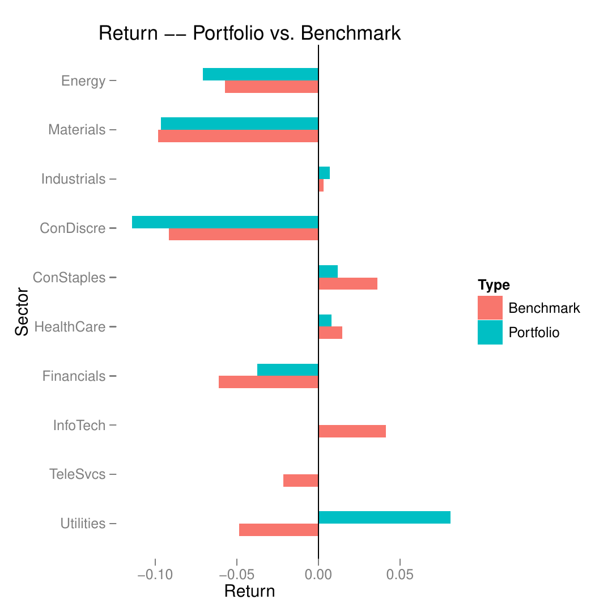
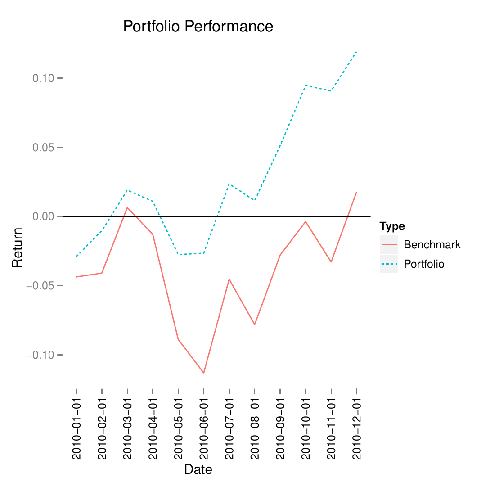

::: article
# Introduction

Almost all portfolio managers measure performance with reference to a
benchmark. The difference in return between a portfolio and the
benchmark is its active return. Performance attribution decomposes the
active return. The two most common approaches are the Brinson model
[@brinson:gary] and a regression-based analysis [@jpmreg].

Portfolio managers use different variations of the two models to assess
the performance of their portfolios. Managers of fixed income portfolios
include yield-curve movements in the model [@lord] while equity managers
who focus on the effect of currency movements use variations of the
Brinson model to incorporate "local risk premium" [@localrisk]. In
contrast, in this paper we focus on attribution models for long-only
equity portfolios without considering any currency effect.[^1]

The [*pa*](https://CRAN.R-project.org/package=pa) package provides tools
for conducting both methods for long-only, single currency equity
portfolios.[^2] The Brinson model takes an ANOVA-type approach and
decomposes the active return of any portfolio into asset allocation,
stock selection, and interaction effects. The regression-based analysis
utilizes estimated coefficients from a linear model to estimate the
contributions from different factors.

# Data

We demonstrate the use of the *pa* package with a series of examples
based on data from MSCI Barra's Global Equity Model II (GEM2).[^3] The
original data set contains selected attributes such as industry, size,
country, and various style factors for a universe of approximately
48,000 securities on a monthly basis. For illustrative purposes, this
article uses three modified versions of the original data set (`year`,
`quarter`, and `jan`), each containing 3000 securities. The data frame,
`quarter`, is a subset of `year`, containing the data of the first
quarter. The data frame, `jan`, is a subset of `quarter` with the data
from January, 2010.

``` r
> data(year)
> names(year)
 [1] "barrid"    "name"      "return"    "date"      "sector"    "momentum" 
 [7] "value"     "size"      "growth"    "cap.usd"   "yield"     "country"  
[13] "currency"  "portfolio" "benchmark"
```

See `?year` for information on the different variables. The top 200
securities, based on `value` scores, in January are selected as
portfolio holdings and are held through December 2010 with monthly
rebalances to maintain equal-weighting. The benchmark for this portfolio
is defined as the largest 1000 securities based on `size` each month.
The benchmark is cap-weighted.

Here is a sample of rows and columns from the data frame `year`:

``` r
                               name   return       date     sector  size
44557  BLUE STAR OPPORTUNITIES CORP  0.00000 2010-01-01     Energy  0.00
25345  SEADRILL                     -0.07905 2010-01-01     Energy -0.27
264017 BUXLY PAINTS (PKR10)         -0.01754 2010-05-01  Materials  0.00
380927 CDN IMPERIAL BK OF COMMERCE   0.02613 2010-08-01 Financials  0.52
388340 CDN IMPERIAL BK OF COMMERCE  -0.00079 2010-11-01 Financials  0.55
       country portfolio benchmark
44557      USA     0.000  0.000000
25345      NOR     0.000  0.000427
264017     PAK     0.005  0.000000
380927     CAN     0.005  0.000012
388340     CAN     0.005  0.000012
```

The portfolio has 200 equal-weighted holdings each month. The row for
Canadian Imperial Bank of Commerce indicates that it is one of the 200
portfolio holdings with a weight of 0.5% in 2010. Its return was 2.61%
in August, and close to flat in November.

# Brinson model

Consider an equity portfolio manager who uses the S&P 500 as the
benchmark. In a given month, she outperformed the S&P by 3%. Part of
that performance was due to the fact that she allocated more weight of
the portfolio to certain sectors that performed well. Call this the
*allocation effect*. Part of her outperformance was due to the fact that
some of the stocks she selected did better than their sector as a whole.
Call this the *selection effect*. The residual can then be attributed to
an interaction between allocation and selection -- the *interaction
effect*. The Brinson model provides mathematical definitions for these
terms and methods for calculating them.

The example above uses sector as the classification scheme when
calculating the allocation effect. But the same approach can work with
any other variable which places each security into one, and only one,
discrete category: country, industry, and so on. In fact, a similar
approach can work with continuous variables that are split into discrete
ranges: the highest quintile of market cap, the second highest quintile
and so forth. For generality, we will use the term "category" to
describe any classification scheme which places each security in one,
and only one, category.

Notations:

-   $w^B_i$ is the weight of security $i$ in the benchmark.

-   $w^P_i$ is the weight of security $i$ in the portfolio.

-   $W^B_j$ is the weight of category $j$ in the benchmark. $W^B_j
      = \sum w^B_i$, $i$ $\in$ $j$.

-   $W^P_j$ is the weight of a category $j$ in the portfolio. $W^P_j
      = \sum w^P_i$, $i$ $\in$ $j$.

-   The sum of the weight $w^B_i$, $w^P_i$, $W^B_j$, and $W^P_j$ is 1,
    respectively.

-   $r_i$ is the return of security $i$.

-   $R^B_j$ is the return of a category $j$ in the benchmark. $R^B_j
      = \sum w^B_ir_i$, $i$ $\in$ $j$.

-   $R^P_j$ is the return of a category $j$ in the portfolio. $R^P_j
      = \sum w^P_ir_i$, $i$ $\in$ $j$.

The return of a portfolio, $R_P$, can be calculated in two ways:

-   On an individual security level by summing over $n$ stocks: $R_P =
        \sum\limits_{i = 1}^n w^P_ir_i$.

-   On a category level by summing over $N$ categories:
    $R_P = \sum\limits_{j =
        1}^N W^P_jR^P_j$.

Similar definitions apply to the return of the benchmark, $R_B$,
$$R_B = \sum\limits_{i = 1}^n w^B_ir_i = \sum\limits_{j = 1}^N W^B_jR^B_j.$$

Active return of a portfolio, $R_{active}$, is a performance measure of
a portfolio relative to its benchmark. The two conventional measures of
active return are arithmetic and geometric. The *pa* package implements
the arithmetic measure of the active return for a single-period Brinson
model because an arithmetic difference is more intuitive than a ratio
over a single period.

The arithmetic active return of a portfolio, $R_{active}$, is the
portfolio return $R_P$ less the benchmark return $R_B$:
$$R_{active} = R_P - R_B.$$

Since the category weights of the portfolio are generally different from
those of the benchmark, allocation plays a role in the active return,
$R_{active}$. The same applies to stock selection effects. Within a
given category, the portfolio and the benchmark will rarely have exactly
the same holdings. Allocation effect $R_{allocation}$ and selection
effect $R_{selection}$ over $N$ categories are defined as:
$$R_{allocation} = \sum\limits_{j = 1}^N \left(W^P_j - W^B_j\right)R^B_j,$$
and
$$R_{selection} = \sum\limits_{j = 1}^N W^B_j\left(R^P_j - R^B_j\right).$$

The intuition behind the allocation effect is that a portfolio would
produce different returns with different allocation schemes ($W^P_j$ vs.
$W^B_j$) while having the same stock selection and thus the same return
($R^B_j$) for each category. The difference between the two returns,
caused by the allocation scheme, is called the allocation effect
($R_{allocation}$). Similarly, two different returns can be produced
when two portfolios have the same allocation ($W^B_j$) yet dissimilar
returns due to differences in stock selection within each category
($R^p_j$ vs. $R^B_j$). This difference is the selection effect
($R_{selection}$).

Interaction effect ($R_{interaction}$) is the result of subtracting
return due to allocation $R_{allocation}$ and return due to selection
$R_{selection}$ from the active return $R_{active}$:
$$R_{interaction} = R_{active} - R_{allocation} - R_{selection}.$$

The Brinson model allows portfolio managers to analyze the active return
of a portfolio using any attribute of a security, such as country or
sector. Unfortunately, it is very hard to expand the analysis beyond two
categories. As the number of categories increases, the number of terms
to be included in the Brinson model grows exponentially; this procedure
is thus subject to the curse of dimensionality. To some extent, the
regression-based model detailed later ameliorates this problem.

## Brinson tools

Brinson analysis is run by calling the function `brinson` to produce an
object of class "brinson".

``` r
> data(jan)
> br.single <- brinson(x = jan, date.var = "date", cat.var = "sector",
+            bench.weight = "benchmark", portfolio.weight = "portfolio", 
+            ret.var = "return")
```

The data frame, `jan`, contains all the information necessary to conduct
a single-period Brinson analysis. `date.var`, `cat.var`, and `return`
identify the columns containing the date, the factor to be analyzed, and
the return variable, respectively. `bench.weight` and `portfolio.weight`
specify the name of the benchmark weight column and that of the
portfolio weight column in the data frame.

Calling `summary` on the resulting object `br.single` of class "brinson"
reports essential information about the input portfolio (including the
number of securities in the portfolio and the benchmark as well as
sector exposures) and the results of the Brinson analysis (both by
sector and aggregate).

``` r
> summary(br.single)
Period:                              2010-01-01
Methodology:                         Brinson
Securities in the portfolio:         200
Securities in the benchmark:         1000

Exposures 
            Portfolio Benchmark     Diff
Energy          0.085    0.2782 -0.19319
Materials       0.070    0.0277  0.04230
Industrials     0.045    0.0330  0.01201
ConDiscre       0.050    0.0188  0.03124
ConStaples      0.030    0.0148  0.01518
HealthCare      0.015    0.0608 -0.04576
Financials      0.370    0.2979  0.07215
InfoTech        0.005    0.0129 -0.00787
TeleSvcs        0.300    0.1921  0.10792
Utilities       0.030    0.0640 -0.03399

Returns 
$'Attribution by category in bps'
            Allocation Selection Interaction
Energy         110.934    -37.52      26.059
Materials      -41.534      0.48       0.734
Industrials      0.361      1.30       0.473
ConDiscre      -28.688     -4.23      -7.044
ConStaples       5.467     -3.59      -3.673
HealthCare      -6.692     -4.07       3.063
Financials     -43.998     70.13      16.988
InfoTech        -3.255     -5.32       3.255
TeleSvcs       -23.106     41.55      23.348
Utilities       16.544     83.03     -44.108
Total          -13.966    141.77      19.095

$Aggregate
                   2010-01-01
Allocation Effect    -0.00140
Selection Effect      0.01418
Interaction Effect    0.00191
Active Return         0.01469
```

The `br.single` summary shows that the active return of the portfolio,
in January, 2010 was 1.47%. This return can be decomposed into
allocation effect (-0.14%), selection effect (1.42%), and interaction
effect (0.19%).

``` r
> plot(br.single, var = "sector", type = "return")
```

{#figure:return width="100%" alt="graphic without alt text"}

Figure [1](#figure:return) is a visual representation of the return of
both the portfolio and the benchmark sector by sector in January, 2010.
Utilities was the sector with the highest active return in the
portfolio.

To obtain Brinson attribution on a multi-period data set, one calculates
allocation, selection and interaction within each period and aggregates
them across time. There are three methods for this -- arithmetic,
geometric, and optimized linking [@linking]. The arithmetic attribution
model calculates active return and contributions due to allocation,
selection, and interaction in each period and sums them over multiple
periods.

In practice, analyzing a single-period portfolio is meaningless as
portfolio managers and their clients are more interested in the
performance of a portfolio over multiple periods. To apply the Brinson
model over time, we can use the function `brinson` and input a
multi-period data set (for instance, `quarter`) as shown below.

``` r
> data(quarter)
> br.multi <- brinson(quarter, date.var = "date", cat.var = "sector",
+           bench.weight = "benchmark", portfolio.weight = "portfolio",
+           ret.var = "return")
```

The object `br.multi` of class `"brinsonMulti"` is an example of a
multi-period Brinson analysis.

``` r
> exposure(br.multi, var = "size")
$Portfolio
     2010-01-01 2010-02-01 2010-03-01
Low       0.140      0.140      0.155
2         0.050      0.070      0.045
3         0.175      0.145      0.155
4         0.235      0.245      0.240
High      0.400      0.400      0.405

$Benchmark
     2010-01-01 2010-02-01 2010-03-01
Low      0.0681     0.0568     0.0628
2        0.0122     0.0225     0.0170
3        0.1260     0.1375     0.1140
4        0.2520     0.2457     0.2506
High     0.5417     0.5374     0.5557

$Diff
     2010-01-01 2010-02-01 2010-03-01
Low      0.0719   0.083157     0.0922
2        0.0378   0.047456     0.0280
3        0.0490   0.007490     0.0410
4       -0.0170  -0.000719    -0.0106
High    -0.1417  -0.137385    -0.1507
```

The `exposure` method on the `br.multi` object shows the exposure of the
portfolio and the benchmark, and their difference based on a
user-specified variable. Here, it shows the exposure on `size`. We can
see that the portfolio overweights the benchmark in the lowest quintile
in `size` and underweights in the highest quintile.

``` r
> returns(br.multi, type = "arithmetic")
$Raw
             2010-01-01 2010-02-01 2010-03-01
Allocation      -0.0014     0.0062     0.0047
Selection        0.0142     0.0173    -0.0154
Interaction      0.0019    -0.0072    -0.0089
Active Return    0.0147     0.0163    -0.0196

$Aggregate
             2010-01-01, 2010-03-01
Allocation                   0.0095
Selection                    0.0160
Interaction                 -0.0142
Active Return                0.0114
```

The `returns` method shows the results of the Brinson analysis applied
to the data from January, 2010 through March, 2010. The first portion of
the `returns` output shows the Brinson attribution in individual
periods. The second portion shows the aggregate attribution results. The
portfolio formed by top 200 value securities in January had an active
return of 1.14% over the first quarter of 2010. The allocation and the
selection effects contributed 0.95% and 1.6% respectively; the
interaction effect decreased returns by 1.42%.

# Regression

One advantage of a regression-based approach is that such analysis
allows one to define their own attribution model by easily incorporating
multiple variables in the regression formula. These variables can be
either discrete or continuous.

Suppose a portfolio manager wants to find out how much each of the
value, growth, and momentum scores of her holdings contributes to the
overall performance of the portfolio. Consider the following linear
regression without the intercept term based on a single-period portfolio
of $n$ securities with $k$ different variables:
$$\mathbf{r}_n = \mathbf{X}_{n,k}\mathbf{f}_k + \mathbf{u}_n$$ where

-   $\mathbf{r}_n$ is a column vector of length $n$. Each element in
    $\mathbf{r}_n$ represents the return of a security in the portfolio.

-   $\mathbf{X}_{n,k}$ is an $n$ by $k$ matrix. Each row represents $k$
    attributes of a security. There are $n$ securities in the portfolio.

-   $\mathbf{f}_k$ is a column vector of length $k$. The elements are
    the estimated coefficients from the regression. Each element
    represents the *factor return* of an attribute.

-   $\mathbf{u}_n$ is a column vector of length $n$ with residuals from
    the regression.

In the case of this portfolio manager, suppose that she only has three
holdings in her portfolio. $r_3$ is thus a 3 by 1 matrix with returns of
all her three holdings. The matrix $\mathbf{X}_{3,3}$ records the score
for each of the three factors (value, growth, and momentum) in each row.
$\mathbf{f}_3$ contains the estimated coefficients of a regression
$\mathbf{r}_3$ on $\mathbf{X}_{3, 3}$.

The active exposure of each of the $k$ variables, $X_{i}$, $i$ $\in$
$k$, is expressed as
$$X_i = \mathbf{w}_{active}\prime \mathbf{x}_{n,i},$$ where $X_i$ is the
value representing the active exposure of the attribute $i$ in the
portfolio, $\mathbf{w}_{active}$ is a column vector of length $n$
containing the active weight of every security in the portfolio, and
$\mathbf{x}_{n, i}$ is a column vector of length $n$ with attribute $i$
for all securities in the portfolio. Active weight of a security is
defined as the difference between the portfolio weight of the security
and its benchmark weight.

Using the example mentioned above, the active exposure of the attribute
`value`, $X_{value}$ is the product of $\mathbf{w}_{active}\prime$
(containing active weight of each of the three holdings) and
$\mathbf{x}_{3}$ (containing value scores of the three holdings).

The contribution of a variable $i$, $R_i$, is thus the product of the
factor returns for the variable $i$, $f_i$ and the active exposure of
the variable $i$, $X_i$. That is, $$R_i = f_iX_i.$$ Continuing the
example, the contribution of value is the product of $f_{value}$ (the
estimated coefficient for value from the linear regression) and
$X_{value}$ (the active exposure of value as shown above).

Therefore, the active return of the portfolio $R_{active}$ is the sum of
contributions of all $k$ variables and the residual $u$ (a.k.a. the
interaction effect), $$R_{active} = \sum\limits_{i = 1}^kR_i + u.$$

For instance, a hypothetical portfolio has three holdings (A, B, and C),
each of which has two attributes -- size and value.

``` r
  Return Name Size Value Active_Weight
1    0.3    A  1.2   3.0           0.5
2    0.4    B  2.0   2.0           0.1
3    0.5    C  0.8   1.5          -0.6
```

Following the procedure as mentioned, the factor returns for size and
value are -0.0313 and -0.1250. The active exposure of size is 0.32 and
that of value is 0.80. The active return of the portfolio is -11% which
can be decomposed into the contribution of size and that of value based
on the regression model. Size contributes 1% of the negative active
return of the portfolio and value causes the portfolio to lose the other
10.0%.

## Regression tools

The *pa* package provides tools to analyze both single-period and
multi-period data frames.

``` r
> rb.single <- regress(jan, date.var = "date", ret.var = "return",
+          reg.var = c("sector", "growth", "size"),
+          benchmark.weight = "benchmark", portfolio.weight = "portfolio")
```

`reg.var` specifies the columns containing variables whose contributions
are to be analyzed. Each of the `reg.var` input variables corresponds to
a particular column in $\mathbf{X}_{n,k}$ from the aforementioned
regression model. `ret.var` specifies the column in the data frame `jan`
based on which $\mathbf{r}_n$ in the regression model is formed.

``` r
> exposure(rb.single, var = "growth")
     Portfolio Benchmark    Diff
Low      0.305    0.2032  0.1018
2        0.395    0.4225 -0.0275
3        0.095    0.1297 -0.0347
4        0.075    0.1664 -0.0914
High     0.130    0.0783  0.0517
```

Calling `exposure` with a specified `var` yields information on the
exposure of both the portfolio and the benchmark by that variable. If
`var` is a continuous variable, for instance, `growth`, the exposure
will be shown in 5 quantiles. Majority of the high `value` securities in
the portfolio in January have relatively low `growth` scores.

``` r
> summary(rb.single)
Period:                            2010-01-01
Methodology:                       Regression
Securities in the portfolio:       200
Securities in the benchmark:       1000

Returns 
                 2010-01-01
sector             0.003189
growth             0.000504
size               0.002905
Residual           0.008092
Portfolio Return  -0.029064
Benchmark Return  -0.043753
Active Return      0.014689
```

The `summary` method shows the number of securities in the portfolio and
the benchmark, and the contribution of each input variable according to
the regression-based analysis. In this case, the portfolio made a loss
of 2.91% and the benchmark lost 4.38%. Therefore, the portfolio
outperformed the benchmark by 1.47%. `sector`, `growth`, and `size`
contributed 0.32%, 0.05%, and 0.29%, respectively.

Regression-based analysis can be applied to a multi-period data frame by
calling the same method `regress`. By typing the name of the object
`rb.multi` directly, a short summary of the analysis is provided,
showing the starting and ending period of the analysis, the methodology,
and the average number of securities in both the portfolio and the
benchmark.

``` r
> rb.multi <- regress(year, date.var = "date", ret.var = "return", 
+         reg.var = c("sector", "growth", "size"),
+         benchmark.weight = "benchmark", portfolio.weight = "portfolio")
> rb.multi
Period starts:                     2010-01-01
Period ends:                       2010-12-01
Methodology:                       Regression
Securities in the portfolio:       200
Securities in the benchmark:       1000
```

The regression-based summary shows that the contribution of each input
variable in addition to the basic information on the portfolio. The
summary suggests that the active return of the portfolio in year 2010 is
10.1%. The `Residual` number indicates the contribution of the
interaction among various variables including `sector`, `growth`, and
`size`. Based on the regression model, `size` contributed to the lion's
share of the active return.

``` r
> summary(rb.multi)
Period starts:                     2010-01-01
Period ends:                       2010-12-01
Methodology:                       Regression
Avg securities in the portfolio:   200
Avg securities in the benchmark:   1000

Returns 
$Raw
                 2010-01-01 2010-02-01 2010-03-01
sector               0.0032     0.0031     0.0002
growth               0.0005     0.0009    -0.0001
size                 0.0029     0.0295     0.0105
Residual             0.0081    -0.0172    -0.0302
Portfolio Return    -0.0291     0.0192     0.0298
Benchmark Return    -0.0438     0.0029     0.0494
Active Return        0.0147     0.0163    -0.0196
                 2010-04-01 2010-05-01 2010-06-01
sector               0.0016     0.0039     0.0070
growth               0.0001     0.0002     0.0004
size                 0.0135     0.0037     0.0018
Residual            -0.0040     0.0310     0.0183
Portfolio Return    -0.0080    -0.0381     0.0010
Benchmark Return    -0.0192    -0.0769    -0.0266
Active Return        0.0113     0.0388     0.0276
                 2010-07-01 2010-08-01 2010-09-01
sector               0.0016     0.0047    -0.0022
growth              -0.0005     0.0005    -0.0006
size                 0.0064     0.0000     0.0096
Residual            -0.0324     0.0173    -0.0220
Portfolio Return     0.0515    -0.0119     0.0393
Benchmark Return     0.0764    -0.0344     0.0545
Active Return       -0.0249     0.0225    -0.0152
                 2010-10-01 2010-11-01 2010-12-01
sector               0.0015    -0.0044    -0.0082
growth              -0.0010    -0.0004     0.0010
size                 0.0022     0.0130     0.0056
Residual             0.0137     0.0175    -0.0247
Portfolio Return     0.0414    -0.0036     0.0260
Benchmark Return     0.0249    -0.0293     0.0523
Active Return        0.0165     0.0257    -0.0263

$Aggregate
                 2010-01-01, 2010-12-01
sector                           0.0120
growth                           0.0011
size                             0.1030
Residual                        -0.0269
Portfolio Return                 0.1191
Benchmark Return                 0.0176
Active Return                    0.1015
```

Figure [2](#figure:regmultiattrib) displays both the cumulative
portfolio and benchmark returns from January, 2010 through December,
2010. It suggests that the portfolio, consisted of high `value`
securities in January, consistently outperformed the benchmark in 2010.
Outperformance in May and June helped the overall positive active return
in 2010 to a large extent.

``` r
> plot(rb.multi, var = "sector", type = "return")
```

{#figure:regmultiattrib width="100%" alt="graphic without alt text"}

# Conclusion

In this paper, we describe two widely-used methods for performance
attribution -- the Brinson model and the regression-based approach, and
provide a simple collection of tools to implement these two methods in R
with the *pa* package. A comprehensive package,
[*portfolio*](https://CRAN.R-project.org/package=portfolio)
[@kane:david], provides facilities to calculate exposures and returns
for equity portfolios. It is possible to use the *pa* package based on
the output from the *portfolio* package. Further, the flexibility of R
itself allows users to extend and modify these packages to suit their
own needs and/or execute their preferred attribution methodology. Before
reaching that level of complexity, however, *pa* provides a good
starting point for basic performance attribution.

\

\
:::

[^1]: See @morningstar for a comprehensive discussion of conventional
    attribution methods.

[^2]: There are several R packages which provide related functionality:
    [*portfolio*](https://CRAN.R-project.org/package=portfolio)
    [@kane:david] enables users to analyze and implement equity
    portfolios;
    [*PerformanceAnalytics*](https://CRAN.R-project.org/package=PerformanceAnalytics)
    [@performance:analytics] provides a collection of econometric
    functions for performance and risk analysis; the Rmetrics suite
    contains a collection of functions for computational finance
    [@rmetrics]. Although *PerformanceAnalytics* and the Rmetrics suite
    provide a variety of tools, they do not provide for the attribution
    of returns using the Brinson Model.

[^3]: See [www.msci.com](http://www.msci.com){.uri} and @gem2 for more
    information.
