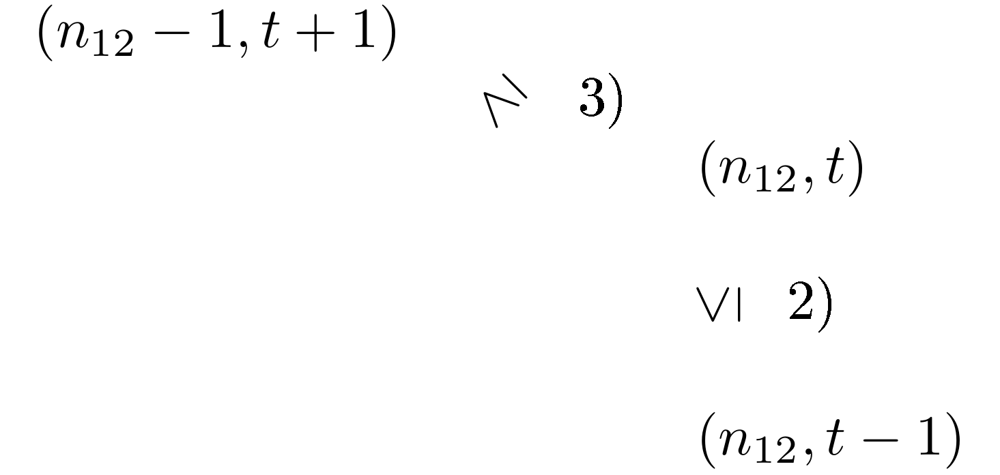
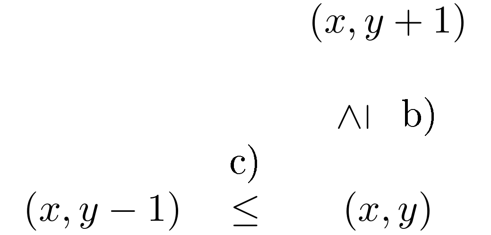
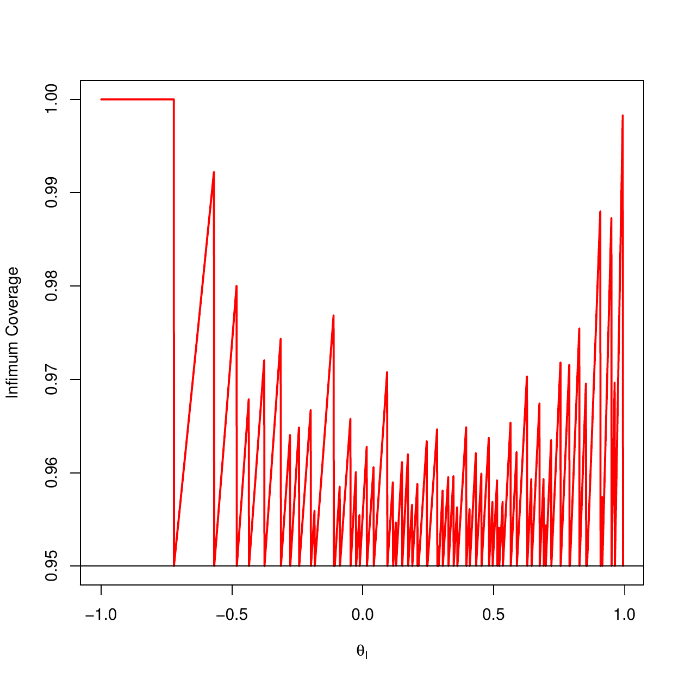
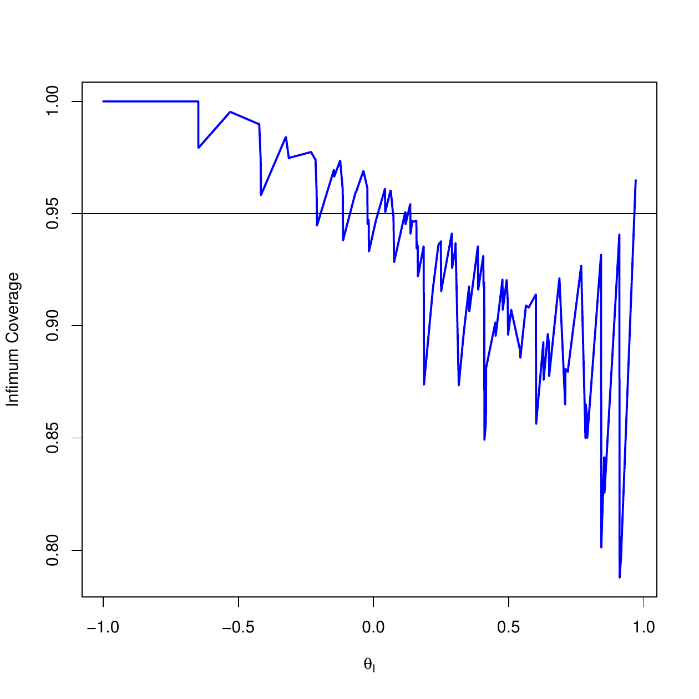

::: article
# Introduction

The comparison of two proportions through the difference is one of the
basic statistical problems. One-sided confidence intervals are of
interest if the goal of a study is to show superiority (or inferiority),
e.g., that a treatment is better than the control. If both limits are of
interest, then two-sided intervals are needed.

In practice, most available intervals, see
[@Newcombe1998Improved; @Newcombe1998Interval], are approximate ones,
i.e., the probability that the interval includes the difference of two
proportions, the so-called coverage probability, is not always at least
the nominal level although the interval aims at it. Also, even with a
large sample size, the infimum coverage probability may still be much
less than the nominal level and does not converge to this quantity. In
fact, the Wald type interval has an infimum coverage probability zero
for any sample sizes and any nominal level $1-\alpha$ even though it is
based on asymptotic normality, as pointed out by
[@Agresti1998Approximate] and [@Brown2001Interval]. See
[@Wang2013Asymptotic] for more examples. Therefore, people may question
of using large samples when such approximate intervals are employed
since they cannot guarantee a correct coverage.

Exact intervals which assure an infimum coverage probability of at least
$1-\alpha$ do not have this problem. But they are typically
computer-intensive by nature. In this paper, a new R package
[*ExactCIdiff*](https://CRAN.R-project.org/package=ExactCIdiff)
[@exacdidiff] is presented which implements the computation of such
intervals as proposed in [@Wang2010Construction; @Wang2012Inductive].
The package is available from CRAN at
<http://CRAN.R-project.org/package=ExactCIdiff/.> This package contains
two main functions: `PairedCI()` and `BinomCI()`, where `PairedCI()` is
for calculating lower one-sided, upper one-sided and two-sided
confidence intervals for the difference of two paired proportions and
`BinomCI()` is for the difference of two independent proportions when
the sample size is small to medium. Results from *ExactCIdiff* are
compared with those from the function `ci.pd()` in the R package
[*Epi*](https://CRAN.R-project.org/package=Epi) [@epi], and the
`PROC FREQ` procedure in the software SAS [@SAS].

Depending on how the data are collected, one group of three intervals is
needed for the difference of two paired proportions and another group
for the difference of two independent proportions. Pointed out by
[@Mehrotra2003Cautionary], an exact inference procedure may result in
poor powerful analysis if an impropriate statistic is employed. Wang's
one-sided intervals [@Wang2010Construction; @Wang2012Inductive],
obtained through a carefully inductive construction on an order, are
optimal in the sense that they are a subset of any other one-sided
$1-\alpha$ intervals that preserve the same order, and are called the
smallest intervals. See more details in the paragraph following
(\@ref(eq:fz1e)). From the mathematical point of view, his intervals are
not nested, see [@Lloyd2010Letter]; on the other hand, for three
commonly used confidence levels, 0.99, 0.95, 0.9, the intervals are
nested based on our numerical study.

Although R provides exact confidence intervals for one proportion, e.g.,
the function `exactci()` in the package
[*PropCIs*](https://CRAN.R-project.org/package=PropCIs) [@propcis], the
function `binom.exact()` in the package
[*exactci*](https://CRAN.R-project.org/package=exactci)
[@exactci; @exactci2] and the function `binom.test()` in the package
*stats* (Version 2.15.2), there is no exact confidence interval
available in R, to the best of our knowledge, for the difference of two
proportions, which is widely used in practice. *ExactCIdiff* is the
first available R package to serve this purpose. The R package
*ExactNumCI* [@exactnumci] claims that its function `pdiffCI()`
generates an exact confidence interval for the difference of two
independent proportions, however, pointed out by a referee, the coverage
probability of a 95% confidence interval, when the numbers of trials in
two independent binomial experiments are 3 and 4, respectively, is equal
to 0.8734 when the two true proportions are equal to 0.3 and 0.5,
respectively.

In the rest of the article, we discuss how to compute intervals for the
difference of two paired proportions $\theta_P$ defined in
(\@ref(eq:thetap)), then describe the results for the difference of two
independent proportions $\theta_I$ given in (\@ref(eq:thetai)).

# Intervals for the difference of two paired proportions

Suppose there are $n$ independent and identical trials in an experiment,
and each trial is inspected by two criteria 1 and 2. By criterion $i$,
each trial is classified as $S_i$ (success) or $F_i$ (failure) for
$i=1,2$. The numbers of trials with outcomes $(S_1,S_2)$, $(S_1,F_2)$,
$(F_1,S_2)$ and $(F_1,F_2)$ are the observations, and are denoted by
$N_{11}, N_{12}$, $N_{21}$ and $N_{22}$, respectively. Thus
$\underline{X}=(N_{11}, N_{12}, N_{21})$ follows a multinomial
distribution with probabilities $p_{11}, p_{12},
p_{21}$, respectively. Let $p_i=P(S_i)$ be the two paired proportions.
The involved quantities are displayed in Table [1](#tab:table).

::: {#tab:table}
  -----------------------------------------------------------------------
                  $S_2$               $F_2$        
  ------- --------------------- ------------------ ----------------------
   $S_1$    $N_{11}, p_{11}$     $N_{12}, p_{12}$   $p_1=p_{11}+p_{12}$

   $F_1$    $N_{21}, p_{21}$     $N_{22}, p_{22}$  

           $p_2=p_{11}+p_{21}$                      $\sum_{i,j}p_{ij}=1$
  -----------------------------------------------------------------------

  : Table 1: Overview of involved quantities in a matched pairs
  experiment.
:::

The parameter of interest is the difference of $p_1$ and $p_2$:

$$\theta_P\stackrel{def}{=}p_1-p_2=p_{12}-p_{21}.  
\label{eq:thetap}   (\#eq:thetap)$$

To make interval construction simpler, let $T=N_{11}+N_{22}$ and
$p_T=p_{11}+p_{22}$. We consider intervals for $\theta_P$ of form
$[L(N_{12},T),U(N_{12},T)]$, where $(N_{12},T)$ also follows a
multinomial distribution with probabilities $p_{12}$ and $p_T$. The
simplified sample space is
$$S_P=\{(n_{12},t):
0\leq n_{12}+t \leq  n\}$$
with a reduced parameter space
$H_P=\{(\theta_P,p_T): p_T \in D(\theta_P), -1\leq
\theta_P\leq 1\},$ where
$D(\theta_P)= \{p_T: 0 \leq p_T\leq 1-|\theta_P|\}.$ The probability
mass function of $(N_{12}, T)$ in terms of $\theta_P$ and $p_T$ is
$$p_{P}(n_{12},t;\theta_P,p_T)=\frac{n!}{n_{12}!t!n_{21}!}
p_{12}^{n_{12}}p_T^{t}p_{21}^{n_{21}}.$$

Suppose a lower one-sided $1-\alpha$ confidence interval
$[L(N_{12},T),1]$ for $\theta_P$ is available. It can be shown that
$[-1,U(N_{12},T)]$ is an upper one-sided $1-\alpha$ confidence interval
for $\theta_P$ if

$$U(N_{12},T)\stackrel{def}{=}-L(n-N_{12}-T,T), 
\label{eq:ulp}   (\#eq:ulp)$$

and $[L(N_{12},T), U(N_{12},T)]$ is a two-sided $1-2\alpha$ interval for
$\theta_P$. Therefore, we focus on the construction of $L(N_{12},T)$
only in this section. The R code will provide two (lower and upper)
one-sided intervals and a two-sided interval, all are of level
$1-\alpha$. The first two are the smallest. The third is the
intersection of the two smallest one-sided $1-\alpha/2$ intervals. It
may be conservative since the infimum coverage probability may be
greater than $1-\alpha$ due to discreteness.

## An inductive order on $S_P$

Following [@Wang2012Inductive], the construction of the smallest
$1-\alpha$ interval $[L(N_{12},T),1]$ requires a predetermined order on
the sample space $S_P$. An order is equivalent to assigning a rank to
each sample point, and this rank provides an order on the confidence
limits $L(n_{12},t)$'s. Here we define that a sample point with a small
rank has a large value of $L(n_{12},t)$, i.e., a large point has a small
rank. Let $R(n_{12},t)$ denote the rank of $(n_{12},t)$. Intuitively,
there are three natural requirements for $R$:

1)  $R(n,0)=1$,

2)  $R(n_{12},t)\leq R(n_{12},t-1)$,

3)  $R(n_{12},t)\leq R(n_{12}-1,t+1)$,

as shown in the diagram below:

{width="50%" alt="graphic without alt text"}

Therefore, $R(n-1,1)=2$ and a numerical determination is needed for the
rest of $R(n_{12},t)$'s. [@Wang2012Inductive] proposed an inductive
method to determine all $R(n_{12},t)$'s, which is outlined below.

::: description

Step 1: Point $(n,0)$ is the largest point. Let
$R_1=\{(n,0)\}=\{(n_{12},t)\in S_P: R(n_{12},t)=1\}$.

...

Step k: For $k>1$, suppose the ranks, $1,\ldots,k$, have been assigned to a set
of sample points, denoted by $S_k=\cup_{i=1}^k R_i$, where $R_i$
contains the $i$th largest point(s) with a rank of $i$. Thus, $S_k$
contains the largest through $k$th largest points in $S_P$. The order
construction is complete if $S_{k_0}=S_P$ for some positive integer
$k_0$, and $R$ assumes values of $1,...,k_0$.

Step k+1: Now we determine $R_{k+1}$ that contains the $(k+1)$th largest point(s)
in $S_P$.

1.  For each point $(n_{12},t)$, let $N_{(n_{12},t)}$ be the neighbor
    set of $(n_{12},t)$ that contains the two points next to but smaller
    than $(n_{12},t)$, see the diagram above. Let $N_{k}$ be the
    neighbor set of $S_k$ that contains all sets $N_{(n_{12},t)}$ for
    $(n_{12},t)$ in $S_k$.

2.  To simplify the construction on $R$, consider a subset of $N_k$,
    called the candidate set

    $$C_{k}=\{(n_{12},t) \in N_{k}:
    (n_{12},t+1)\notin N_{k},
    (n_{12}+1,t-1) \notin N_{k}\},  
    \label{eq:ck}   (\#eq:ck)$$

    from which $R_{k+1}$ is going to be selected.

3.  For each point $(n_{12},t)\in C_{k}$, consider

    $$\begin{aligned}
     f^*_{(n_{12},t)}(\theta_P)&=1-\alpha,\\
    where\\
    f^*_{(n_{12},t)}(\theta_P)&=\inf_{p_T \in D(\theta_P)}
    \sum_{(n_{12}',t')\in (S_k \cup (n_{12},t))^c} p_P(n_{12}',t';\theta_P,p_T).\nonumber
    \label{eq:fz}
    \end{aligned}   (\#eq:fz)$$

    Let

    $$L^*_P(n_{12},t)=
    \left\{ \begin{array}{ll}
    -1,& \textrm{if no solution for (4);}\\
    \textrm{the smallest solution of (4)},&\textrm{otherwise}.
    \end{array}
    \right.  
    \label{eq:gzz}   (\#eq:gzz)$$

    Then define $R_{k+1}$ to be a subset of $C_k$ that contains point(s)
    with the largest value of $L^*_P$. We assign a rank of $k+1$ to
    point(s) in $R_{k+1}$ and let $S_{k+1}$ be the union of $R_1$ up to
    $R_{k+1}$.
:::

Since $S_P$ is a finite set and $S_k$ is strictly increasing in $k$,
eventually, $S_{k_0}=S_P$ for some positive integer $k_0$ $(\leq
(n+1)(n+2)/2)$ and the order construction is complete.

## The computation of the rank function $R(N_{12},T)$ in R

There are three issues to compute the rank function $R(n_{12},t)$:

i)  compute the infimum in $f^*_{(n_{12},t)}(\theta_P)$;

ii) determine the smallest solution of equation (\@ref(eq:fz));

iii) repeat this process on all points in $S_P$.

These have to be done numerically.

Regarding i), use a two-step approach to search for the infimum when
$p_T$ belongs to interval $D(\theta_P)$, i.e., in the first step,
partition $D(\theta_P)$ into, for example, 30 subintervals, find the
grid, say $a$, where the minimum is achieved; then in the second step,
partition a neighborhood of $a$ into, for example, 20 subintervals and
search the minimal grid again. In total we compute about 50 ($=30+20$)
function values. On the other hand, if one uses the traditional one-step
approach, one has to compute 600 ($=30 \times 20$) function values to
obtain a similar result.

Regarding ii), the smallest solution is found by the bisection method
with different initial upper search points and a fixed initial lower
search point $-1$. The initial upper search point is the lower
confidence limit of the previous larger point in the inductive search
algorithm.

Regarding iii), use `unique()` to eliminate the repeated points in $N_k$
and use `which()` to search for $R_{k+1}$ from $C_k$ (smaller) rather
than $N_k$.

## The smallest one-sided interval under the inductive order

For any given order on a sample space the smallest one-sided $1-\alpha$
confidence interval for a parameter of interest can be constructed
following the work by
[@Buehler1957Confidence; @chen1993order; @Lloyd2003Optimality] and
[@Wang2010Construction]. This interval construction is valid for any
parametric model. In particular, for the rank function $R(n_{12},t)$
just derived, the corresponding smallest one-sided $1-\alpha$ confidence
interval, denoted by $L_P(n_{12},t)$, has a form
$$L_P(n_{12},t)=
\left\{ \begin{array}{ll} 
-1,&  \textrm{if no solution for (6)};\\
\textrm{the smallest solution of (6)},&\textrm{otherwise},
\end{array}
\right.$$
where

$$\begin{aligned}
 f_{(n_{12},t)}(\theta_P)&=1-\alpha\\
and\\
f_{(n_{12},t)}(\theta_P)&=1-\sup_{p_T \in D(\theta_P)}
\sum_{\{(n_{12}',t')\in S_P: R(n_{12}',t')\leq R(n_{12},t)\}} p_P(n_{12}',t';\theta_P,p_T),\nonumber  
\label{eq:fz1e}
\end{aligned}   (\#eq:fz1e)$$

that are similar to (\@ref(eq:fz)) and (\@ref(eq:gzz)).

Two facts are worth mentioning. a) Among all one-sided $1-\alpha$
confidence intervals of form $[L(N_{12},T), 1]$ that are nondecreasing
regarding the order by the rank function $R$, $L\leq L_P$. So $[L_P,1]$
is the best. b) Among all one-sided $1-\alpha$ confidence intervals of
form $[L(N_{12},T), 1]$, $[L_P,1]$ is admissible by the set inclusion
criterion [@Wang2006Smallest]. So $[L_P,1]$ cannot be uniformly
improved. These properties make $[L_P,1]$ attractive for practice. The
computation of $L_P$ is similar to that of the rank function $R$.

# Intervals for the difference of two independent proportions

Suppose we observe two independent binomial random variables $X\sim
Bin(n_1,p_1)$ and $Y\sim Bin(n_2,p_2)$ and the difference

$$\theta_I=p_1-p_2  
\label{eq:thetai}   (\#eq:thetai)$$

is the parameter of interest. The sample space $S_I=\{(x,y): 0\leq
x\leq n_1, 0\leq y\leq n_2 \}$ consists of $(n_1+1)(n_2+1)$ sample
points, the parameter space in terms of $(\theta_I, p_2)$ is
$H_I=\{(\theta_I, p_2): p_2\in D_I(\theta_I), -1\leq \theta_I\leq
1\},$ where
$D_I(\theta_I)= \{p_2: -\min\{0, \theta_I\}\leq p_2\leq 1-\max\{0,\theta_I\} \}.$
The joint probability mass function for $(X,Y)$ is
$$p_I(x,y;\theta_I,p_2)={n_1!\over
  x!(n_1-x)!}(\theta_I+p_2)^x(1-\theta_I-p_2)^{n_1-x}{n_2!\over
  y!(n_2-y)!}p_2^y(1-p_2)^{n_2-y}.$$
Exact $1-\alpha$ confidence intervals for $\theta_I$ of form
$[L(X,Y),1]$, $[-1, U(X,Y)]$, $[L(X,Y), U(X, Y)]$ are of interest.
Similar to (\@ref(eq:ulp)), $U(X,Y)=-L(n_1-X, n_2-Y).$ Therefore, we
only need to derive the smallest lower one-sided $1-\alpha$ confidence
interval for $\theta_I$, denoted by $[L_I(X,Y),1]$. Then
$U_I(X,Y)=-L_I(n_1-X,n_2-Y)$ is the upper limit for the smallest upper
one-sided $1-\alpha$ interval.

## An inductive order and the corresponding smallest interval

Following [@Wang2010Construction], a rank function $R_I(X,Y)$ is to be
introduced on $S_I$. This function provides an order of the smallest
one-sided interval $L_I(x,y)$. In particular, a point $(x,y)$ with a
small $R_I(x,y)$ is considered a large point and has a large value of
$L_I(x,y)$. Similar to the rank function $R$ in the previous section,
$R_I$ should satisfy three rules:

a)  $R_I(n_1,0)=1$,

b)  $R_I(x,y)\leq R_I(x,y+1)$,

c)  $R_I(x,y)\leq R_I(x-1,y)$,

as shown in the diagram below:

{width="50%" alt="graphic without alt text"}

Repeating the process in the previous section, we can derive this new
rank function $R_I$ on $S_I$ and the corresponding smallest one-sided
$1-\alpha$ confidence interval $[L_I(X,Y),1]$ for $\theta_I$ by
replacing $(n_{12},t)$ by $(x,y)$, $D(\theta_P)$ by $D_I(\theta_I)$ and
$p_P(N_{12},T;\theta_P,p_T)$ by $p_I(x,y;\theta_I,p_2)$. The only thing
different is that for the case of $n_1=n_2=n$, $R_I$ generates ties. For
example, $R_I(x,y)=R_I(n-y,n-x)$ for any $(x,y)$. However, the procedure
developed is still valid for this case. Technical details were given in
the Sections 2 and 3 of [@Wang2010Construction].

# Examples

## Example 1: Exact intervals for the difference of two paired proportions $\theta_P$

We illustrate the usage of the `PairedCI()` function to calculate the
exact smallest lower one-sided confidence interval $[L_P,1]$ for
$\theta_P$ in (\@ref(eq:thetap)) with the data from [@Karacan1976Sleep].
In this study, 32 marijuana users are compared with 32 matched controls
with respect to their sleeping difficulties, with
$n_{11}=16, n_{12}=9, n_{21}=3,$ and $n_{22}=4$. The second argument in
the function is $t=n_{11}+n_{22}=20$.

Function `PairedCI()` has the following arguments:

``` r
PairedCI(n12, t, n21, conf.level = 0.95, CItype = "Lower", precision = 0.00001, 
         grid.one = 30, grid.two = 20)
```

The arguments `n12`, `t`, and `n21` are the observations from the
experiment. The value of `conf.level` is the confidence coefficient of
the interval, $1-\alpha$, which is equal to the infimum coverage
probability here. One may change the value of `CItype` to obtain either
an upper one-sided or a two-sided interval. The precision of the
confidence interval with a default value 0.00001 is rounded to 5
decimals. The values of `grid.one` and `grid.two` are the number of grid
points in the two-step approach to search the infimum. The higher the
values of `grid.one` and `grid.two`, the more accurate is the solution
but the longer is also the computing time. Based on our extensive
numerical study, we find that `grid.one = 30` and `grid.two = 20` are
sufficient enough for the problem.

In the data by [@Karacan1976Sleep], the researchers wish to see how much
more help the marijuana use provides for sleeping by using a lower
one-sided 95$\%$ confidence interval $[L_P(n_{12},t),1]$ for
$\theta_P=p_1-p_2$ at $(n_{12},t)=(9,20)$, where $p_1$ is the proportion
of marijuana users who have sleeping improved, and $p_2$ is the
proportion in the controls. Given that the package *ExactCIdiff* is
installed to the local computer, type the following:

``` r
> library(ExactCIdiff)
> lciall <- PairedCI(9, 20, 3, conf.level = 0.95) # store relevant quantities
> lciall                 # print lciall
$conf.level
[1] 0.95                 # confidence level
$CItype
[1] "Lower"              # lower one-sided interval
$estimate
[1] 0.1875               # the mle of p1 - p2
$ExactCI
[1] 0.00613 1.00000      # the lower one-sided 95% interval 
> lci <- lciall$ExactCI  # extracting the lower one-sided 95% interval 
> lci                    # print lci
[1] 0.00613 1.00000
```

The use of marijuana helps sleeping because the interval $[0.00613,1]$
for $\theta_P$ is positive.

The upper one-sided $95\%$ interval and the two-sided $95\%$ interval
for $\theta_P$ are given below for illustration purpose.

``` r
> uci <- PairedCI(9, 20, 3, conf.level = 0.95, CItype = "Upper")$ExactCI
> uci                    # the upper one-sided 95% interval
[1] -1.00000  0.36234
> u975 <- PairedCI(9, 20, 3, conf.level = 0.975, CItype = "Upper")$ExactCI
> u975                   # the upper one-sided 97.5% interval
[1] -1.00000  0.39521
> l975 <- PairedCI(9, 20, 3, conf.level = 0.975, CItype = "Lower")$ExactCI
> l975                   # the lower one-sided 97.5% interval
[1] -0.03564  1.00000
> ci95 <- PairedCI(9, 20, 3, conf.level = 0.95)$ExactCI
> ci95
[1] -0.03564  0.39521    # the two-sided 95% interval 
                         # it is equal to the intersection of two one-sided intervals
```

In summary, three $95\%$ confidence intervals, $[0.00613, 1]$, $[-1,
0.36234]$ and $[-0.03564, 0.39521]$, are computed for $\theta_P$.
[@Wang2012Inductive] also provided R code to compute these three
intervals, but the calculation time is about 60 times longer.

## Example 2: Exact intervals for the difference of two independent proportions $\theta_I$

The second data set is from a two-arm randomized clinical trial for
testing the effect of tobacco smoking on mice [@Essenberg1952Cigarette].
In the treatment (smoking) group, the number of mice is $n_1=23$, and
the number of mice which developed tumor is $x=21$; in the control
group, $n_2=32$ and $y=19$. The function `BinomCI()` computes exact
confidence intervals for $\theta_I$ in (\@ref(eq:thetai)), the
difference of proportions between two groups.

Function `BinomCI()` has the following arguments:

``` r
BinomCI(n1, n2, x, y, conf.level = 0.05, CItype = "Lower", precision = 0.00001, 
        grid.one = 30, grid.two = 20)  
```

The arguments `n1`, `n2`, `x` and `y` are the observations from the
experiment. The rest of the arguments are the same as in function
`PairedCI()`.

In this clinical trial, the maximum likelihood estimate for the
difference between two tumor rates $\theta_I$ is calculated as
$$\hat{\theta}_{I}=\frac{x}{n_1}-\frac{y}{n_2}=0.319293.$$
The lower confidence interval $[L(X,Y),1]$ for $\theta_I$ is needed if
one wants to see that the treatment (smoking) increases the risk of
tumor. Compute the interval by typing:

``` r
> lciall <- BinomCI(23, 32, 21, 19, CItype = "Lower")
> lciall                 # print lciall
$conf.level
[1] 0.95                 # confidence level
$CItype
[1] "Lower"
$estimate
[1] 0.319293             # the mle of p1 - p2
$ExactCI
[1] 0.133 1.00000        # the lower one-sided 95% interval 
> lci <- lciall$ExactCI  # extracting the lower one-sided 95% interval
> lci
[1] 0.133 1.00000
```

The lower one-sided 95% confidence interval for $\theta_I$ is
$[0.133, 1]$. Therefore, the tumor rate in the smoking group is higher
than that of the control group.

The following code is for the upper one-sided and two-sided 95%
confidence intervals.

``` r
> uci <- BinomCI(23, 32, 21, 19, conf.level = 0.95, CItype = "Upper")$ExactCI
> uci                    # the upper one-sided 95% interval
[1] -1.00000  0.48595
> u975 <- BinomCI(23, 32, 21, 19, conf.level = 0.975, CItype = "Upper")$ExactCI
> u975                   # the upper one-sided 97.5% interval 
[1] -1.00000  0.51259
> l975 <- BinomCI(23, 32, 21, 19, conf.level = 0.975, CItype = "Lower")$ExactCI
> l975                   # the lower one-sided 97.5% interval
[1] 0.09468 1.00000
> ci95 <- BinomCI(23, 32, 21, 19)$ExactCI
> ci95
[1] 0.09468  0.51259     # the two-sided 95% interval
                         # it is equal to the intersection of two one-sided intervals
```

They are equal to $[-1, 0.48595]$ and $[0.09468, 0.51259]$,
respectively.

# Comparison of results with existing methods

Our smallest exact one-sided confidence interval $[-1,U_I]$ for
$\theta_I$ is first compared to an existing asymptotic interval
[@Newcombe1998Interval] using the coverage probability. The coverage of
an upper confidence interval $[-1,U(X,Y)]$ as a function of $\theta_I$
is defined as:
$$Coverage(\theta_I)=\inf_{p_2\in D_I(\theta_I)} P(\theta_I\leq U(X,Y); \theta_I, p_2).$$
Ideally, a $1-\alpha$ interval requires that $Coverage(\theta_I)$ is
always greater than or equal to $1-\alpha$ for all the possible values
of $\theta_I$.

<figure id="fig:coverage">
<table>
<caption> </caption>
<tbody>
<tr class="odd">
<td style="text-align: center;">Exact method</td>
<td style="text-align: center;">Asymptotic method</td>
</tr>
<tr class="even">
<td style="text-align: center;"></td>
<td style="text-align: center;"></td>
</tr>
</tbody>
</table>
<figcaption>Figure 1: <span id="fig:coverage"
label="fig:coverage"></span> Coverage probability of upper confidence
intervals for <span
class="math inline"><em>θ</em><sub><em>I</em></sub></span> when <span
class="math inline"><em>n</em><sub>1</sub> = <em>n</em><sub>2</sub> = 10</span>
and <span class="math inline"><em>α</em> = 0.05</span>.</figcaption>
</figure>

The coverage for the exact upper 95% confidence interval $[-1,U_I]$ and
the asymptotic upper confidence interval based on the tenth method of
[@Newcombe1998Interval], which is the winner of his eleven discussed
intervals, is shown in Figure [1](#fig:coverage). The two intervals are
calculated by `BinomCI()` and the function `ci.pd()` in the package
*Epi*. The left plot of Figure [1](#fig:coverage) shows the coverage
against $\theta_I \in
[-1,1]$ based on our exact method. As expected, it is always at least
95%. However, the coverage for the asymptotic interval may be much less
than 95% as seen in the right plot of Figure [1](#fig:coverage). The
coverage of the majority of $\theta_I$ values is below 95% and the
infimum is as low as 78.8% for a nominal level of 95%. The similar
results are observed for the asymptotic confidence intervals based on
other methods, including the one proposed by [@Agresti2000Simple].

In light of the unsatisfied coverage for the asymptotic approaches, we
next compare our exact intervals to the exact intervals by the
`PROC FREQ` procedure in the software SAS. First revisit Example 2,
where SAS provides a wider exact two-sided 95$\%$ interval
$[0.0503,0.5530]$ for $\theta_I$ using the `EXACT RISKDIFF` statement
within `PROC FREQ`. This is the SAS default. The other exact 95%
interval in SAS using `METHOD = FMSCORE` is $[0.0627,
0.5292]$, which is narrower than the default but is wider than our
two-sided interval. Also SAS does not compute exact intervals for
$\theta_P$ at all.

Two exact upper intervals produced by `BinomCI()` in the R package
*ExactCIdiff* and the `PROC FREQ` procedure in SAS are shown in
Figure [2](#fig:exact). The smaller upper confidence interval is
preferred due to the higher precision. Almost all the points in the
figure are below the diagonal line, which confirms a better performance
of the interval by `BinomCI()`. The average lengths of the two-sided
interval for $n_1=n_2=10$ and $\alpha=0.1$ are 0.636 and 0.712,
respectively, for our method and the SAS default procedure. The newly
developed exact confidence intervals have better performance than other
asymptotic or exact intervals due to their guarantee on the coverage or
because of their shorter length.

![Figure 2: []{#fig:exact label="fig:exact"} Exact upper confidence
intervals for $\theta_I$ by `BinomCI()` and `PROC FREQ` when
$n_1=n_2=10$ and
$\alpha=0.05$.](exactcompare-eps-converted-to.png){#fig:exact
width="47.7%" alt="graphic without alt text"}

# Summary

A group of three exact confidence intervals (lower one-sided, upper
one-sided, and two-sided) are computed efficiently with the R package
*ExactCIdiff* for each of the differences of two proportions: $\theta_P$
and $\theta_I$. Each one-sided interval is admissible under the set
inclusion criterion and is the smallest in a certain class of intervals
that preserve the same order of the computed interval. Unlike asymptotic
intervals, these intervals assure that the coverage probability is
always not smaller than the nominal level.

A practical issue for *ExactCIdiff* is the computation time that depends
on the sample size $n=n_{12}+t+n_{21}$ for `PairedCI()` ($n=n_1+n_2$ for
`BinomCI()`) and the location of observations $(n_{12},t,n_{21})$
($(x,y)$ for `BinomCI()`), e.g.,
`PairedCI(30, 40, 30) = [-0.15916, 0.15916]`, with a sample size of 100,
takes about a hour to complete on an HP laptop with Intel(R) Core(TM)
i5=2520M CPU@2.50 GHz and 8 GB RAM, and
`PairedCI(300, 10, 10, CItype = "Lower") = [0.86563, 1.00000]`, with a
sample size of 320, takes less than one minute. Our exact interval is
constructed by an inductive method. By nature, when there are many
sample points, i.e., the sample size is large, deriving an order on all
sample points is very time consuming. Thus the confidence limit on a
sample point, which is located at the beginning (ending) part of the
order, needs a short (long) time to calculate. Roughly speaking, when
the sample size is more than 100, one would expect a long computation
time for a two-sided interval. More details may be found at:
<http://www.wright.edu/~weizhen.wang/software/ExactTwoProp/examples.pdf.>

# Acknowledgments

Wang's research is partially supported by NSF grant DMS-0906858. The
authors are grateful to three anonymous referees and the Editor for
their constructive suggestions.

\

\
:::
