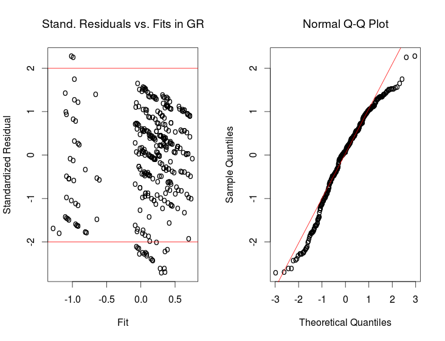

::: article
# Introduction

Rank-based procedures retain distribution-free estimation and testing
properties. These procedures are much less sensitive to outliers than
the traditional analyses when random errors are not normally
distributed. Alternative robust score functions can be accommodated with
the rank-based methods to protect analyses from influential observations
in factor and response spaces. Also, the choice of these score functions
could depend on the prior knowledge on error distributions. The Wilcoxon
score function is fairly efficient for moderate to heavy-tailed error
distributions. For example, rank-based procedures with Wilcoxon scores
achieve up to 95% efficiency relative to least squares methods when the
data are normal and are much more efficient than least squares methods
for heavy tailed error distributions. These properties make the
rank-based methods appealing. However, to our knowledge, statistical
analyses for random effects models using the rank-based methodology have
not yet been considered in any statistical package. This article
proposes an R package with three rank-based fitting methods that
estimate fixed effects and predict random effects in two- and
three-level random effects nested models.

The rank-based norm, analogous to the least squares norm, is briefly
defined as

$$\left\Vert w\right \Vert _{\varphi}=\sum_{i}^{n}a\left[R(w_{i}) \right] w_{i}, \mbox{ }w \epsilon R^{n},  
\label{eq:Normr}  (\#eq:Normr)  $$

where the scores are generated as $a(i)=\varphi[i/(n+1)]$ for a
non-decreasing function $\varphi(u)$, defined on the interval $(0,1)$,
and $R(w_{i})$ is the rank of $w_{i}$ among $w_{1},w_{2},...,w_{n}$. We
assume without loss of generality that the scores sum to zero. Two of
the most commonly used score functions are the Wilcoxon
$\varphi(u)=\sqrt{12}\cdot(u-\frac{1}{2})$ and the sign
$\varphi(u)=sgn[u\text{-}1/2]$.

The rank-based estimate of $\beta$ for the independent error model
$Y=X\beta+e$ is given by

$$\hat{\beta}_{\varphi}=\mbox{Argmin}\left\Vert Y-X\beta\right\Vert _{\varphi}.$$
Assume that the errors are independent and identically distributed with
a continuous density function $f(x)$. Under regularity conditions,
$\beta$ is estimated by

$$\hat{\beta}\dot{\sim}N(\beta,\:\tau_{\varphi}^{2}(X^{T}X)^{-1}),$$

$$\tau_{\varphi}=\left[\int\varphi(u)\varphi_{f}(u)du\right]^{-1},  
 \label{eq:Tau}  (\#eq:Tau)  $$

with
$\varphi_{f}(u)=-{\displaystyle {\displaystyle {\textstyle \frac{f^{\prime}(F^{-1}(u))}{f(F^{-1}(u)}}}}$.
The parameter $\tau_{\varphi}$ is a scale parameter for the error terms
$e$. The rank-based estimator of the fixed effects for independent
linear models is asymptotically normal, shown in the work of Jaeckel and
Jureckova in the 1970's. See Chapter 3, @HM2012 for the relevant theory
in detail. Recently, the
[*Rfit*](https://CRAN.R-project.org/package=Rfit) package was released
for rank-based regression analysis that uses rank-based norm and robust
estimators for independent linear models [@Rfit]. We extend the
rank-based regression methodology to include random effects nested
models.

Random effects nested models are frequently utilized in many research
areas such as: education, survey sampling, meta-analysis, agriculture,
and health. Survey sampling might happen within organizational units,
communities, clusters, or hospitals. The experimental design of interest
is expressed in terms of fixed effects but, for these designs, nested
factors are a natural part of the experiment. These nested effects are
generally considered random and must be taken into account in the
statistical analysis. For example, repeated measures design, randomized
block design, and cluster correlated data consider each subject as a
cluster having a correlated structure so the observations are nested
within the subject. This subject would be a block, a cluster, an
institution or a region. These designs are examples of two-level nested
structures. Compound symmetric error structure is a natural
variance-covariance form of these designs. It implies that all distinct
members of a cluster or a subcluster are equally correlated with each
other. When there is one more correlated level (subclusters) within
clusters, this design could be called a three-level nested structure.
Hierarchical linear models can also deal with these nested designs.

To illustrate the issues involved in data analysis, consider a simple
example of a two-level nested design where students are nested within
schools (see Model \@ref(eq:2level)), and a three-level nested design
where students are nested within sections in schools (see Model
\@ref(eq:3level)). Students are measured on a continuous univariate
response variable of interest, $y$. The $p$-variate design data,
including covariates, treatment, etc., are stored in the $x$ vector. The
problem is summarized in the linear model as

$$y_{ij}=\alpha+x_{ij}^{T}\beta+a_{i}+\epsilon_{ij},  
\label{eq:2level}  (\#eq:2level)  $$

with $i=1,...,I$ and $j=1,...,n_{i}$, where $a_{i}$ is the random effect
for school $i$ (cluster effects), $I$ is the number of schools, $n_{i}$
is the size of the $i^{th}$ school, and

$$y_{ijk}=\alpha+x_{ijk}^{T}\beta+a_{i}+w_{j(i)}+\epsilon_{ijk},  
\label{eq:3level}  (\#eq:3level)  $$

with $i=1,...,I$, $j=1,...,J_{i}$ and $k=1,...,n_{ij}$, where $a_{i}$ is
the random effect for school $i$ (cluster effects), $w_{j(i)}$ is the
random effect for the $j^{th}$ section of school $i$ (subcluster
effects), $J_{i}$ is the number of sections in school $i$, $n_{ij}$ is
the size of $j^{th}$ section in school $i$. Random errors are
uncorrelated and independent.

The main interest with these models would be to estimate the regression
parameters $\beta$ as fixed effects, to predict $a_{i}$ and $w_{j(i)}$
as random effects, and scale parameters of the error and random effects.
The *intra-class correlation coefficient* (ICC) for each nested level
would be also estimated using the scale parameter estimates. ICC
provides information on the degree of dependencies of the observations
within the same cluster. It is a useful and contextual parameter
associated with the random effects of clusters that measures the
proportion of the variability of the response to the total variability.
It is sometimes called *cluster effect* and applied only to random
models. For example, independent observations within- and
between-cluster yield an ICC of zero.

This nested analog could be adopted for other organizational studies and
hierarchical data. These designs often address questions related to

-   the examination of differences within and across clusters or
    contexts such as classrooms, schools, neighborhoods, or groups on
    individual outcomes;

-   the investigation of the degree to which individuals within a group
    or cluster are similar as measured through the ICC;

-   the study of the factors that explain institutional/cluster
    differences;

-   the effects of clusters and treatment on individual scores, e.g.,
    student's academic achievement --- both random and fixed effects are
    addressed in these interests.

In this article, three rank-based fitting methods and a new prediction
algorithm are briefly introduced. A data analysis example using our
package, [*rlme*](https://CRAN.R-project.org/package=rlme), is also
presented.

# Three rank-based methods

This section introduces three rank-based fitting methods to obtain fixed
effects estimations: Joint Ranking (JR), Generalized Rank Estimate (GR)
and Generalized Estimating Equation (GEER). The algorithm for robust
variance estimates and random effects predictions in random effects
nested models, called Rank Prediction Procedure (RPP), is then
introduced. To sketch the calculation algorithms in these methods,
Models (\@ref(eq:2level)) and (\@ref(eq:3level)) can be rewritten in the
general mixed model matrix and vector notations as follows:

$$Y = X\beta+e = X\beta+Zb+ \epsilon,   
\label{eq:Mixed}  (\#eq:Mixed)  $$

where $Y$ denotes a $n \times 1$ vector of responses, $X$ is a
$n\times (p+1)$ known fixed effects design matrix, $\beta$ is a
$(p+1)\times 1$ fixed effects parameter vector, $Z$ is a $n\times k$
known random effects design matrix, $b$ is a $k\times 1$ vector of
random effects, and $\epsilon$ is a $n\times 1$ vector of random errors.

Alternatively, the model can be written in vectors of the observations
obtained from independent $I$ clusters. Within cluster $k$, let $Y_k$,
$X_k$, and $e_k$ denote respectively the $n_k \times 1$ vector of
responses, the $n_k \times p$ design matrix, and the $n_k \times 1$
vector of errors. Then the general mixed model for $Y_k$ is

$$Y_k = \alpha 1_{n_k} + X_k \beta+e_k, \mbox{  }k=1,...I,   
\label{eq:Mixed2}  (\#eq:Mixed2)  $$ where the components of the random
error vector $e_k$ contain random effects and errors.

## Joint ranking method: JR

This rank-based method for nested random effects models uses asymptotic
results of the study by @Kloke2009 in estimating fixed effects and
standard errors. @Kloke2009 developed the asymptotic theory for the
rank-based estimates of fixed effects in the general mixed model using
the general rank theory of @BD1994. The estimation of fixed effects in
the JR method uses the dispersion function as in the independent linear
model. However, the asymptotic distribution of $\hat{\beta}_{JR}$ has a
different covariance matrix formula due to the correlated errors in the
model. This is expressed as

$${var}(\hat{\beta}_{JR})\doteq\tau_{\varphi}^{2}(X'X)^{-1}(\Sigma_{\varphi})(X'X)^{-1},  
\label{eq:JR2}  (\#eq:JR2)  $$

where
$\Sigma_{\varphi}=\mbox{lim}{}_{I\rightarrow\infty}\sum_{i=1}^{I}X_{i}^{'}\Sigma_{\varphi,i}X_{i}\doteq\sum_{i=1}^{I}X_{i}^{'}\Sigma_{\varphi,i}X_{i}$,
$\Sigma_{\varphi,i}$ is given by
$\Sigma_{\varphi,i}=\mbox{cov}(\varphi(F(e_{i}))$, and $F(x)$ denotes
the distribution function of errors.

After estimating the fixed effects in Model (\@ref(eq:Mixed)), we
predict the nested random effects and estimate the variance components
using the random prediction procedure explained in the next section. In
this method, for each cluster in Model (\@ref(eq:Mixed2)), simple moment
estimators of $\Sigma_{\varphi,i}$ is calculated as in @Kloke2009.

## Iteratively reweighted generalized rank method: GR

The generalized rank-based fitting for the general mixed model is an
iteratively reweighted rank method based on the Newton-type
approximation. @HM2012 developed the asymptotic properties of linearized
rank estimators for use in the linear model with the $k$-step
Gauss-Newton approximation without weights. @Bilgic2012 and @BilgicGR
extended this theory to the $k$-step GR method in the general mixed
models. After the first fitting, the estimates are asymptotically
equivalent to the independent case because residuals are no longer
dependent because of the reweighting with covariance weights. This
algorithm could work for any type of variance-covariance error structure
in the general mixed models.

Consider Model (\@ref(eq:Mixed)) where $\Sigma_{Y}$ is the
variance-covariance matrix of the response vector $Y$ and $\theta$ is
the vector of variance components of the model. The proposed iteratively
reweighted generalized rank-based algorithm is as follows:

1.  Set $l=0$. The JR estimate serves as the initial fit.

2.  Obtain $\hat{\beta}^{(l)}$ as the rank-based fit of the model.

    $$Y^* = X^*\beta +e^*, 
    \label{mod}  (\#eq:mod)  $$

    where $Y^{*}=\hat{\Sigma}_{Y}^{-1/2} Y$,
    $X^{*}=\hat{\Sigma}_{Y}^{-1/2} X$, and
    $e^* = \hat{\Sigma}_{Y}^{-1/2} e$. Thus, $\hat{\beta}^{(l)}$
    minimizes the rank norm with $Y$ and $X$ replaced by $Y^*$ and
    $X^*$, respectively. If $l=0$ then use $\hat{\Sigma}_{Y}=I_{n}$;
    otherwise use $\hat{\Sigma}_{Y}=\Sigma_{Y}(\hat{\theta}^{(l-1)})$.

3.  Use $\hat{\beta}^{(l)}$ to calculate the residuals,
    $\hat{e}^{(l)}=Y-X\hat{\beta}^{(l)}.$

4.  Use $\hat{e}^{(l)}$ to obtain $\hat{b}^{(l)}$, the predictor of $b$
    via the RPP algorithm.

5.  Use $\hat{b}^{(l)}$ to estimate the variance components,
    $\hat{\theta}^{(l)}$ via the RPP algorithm.

6.  If
    $\left\Vert \hat{\beta}^{(l)}-\hat{\beta}^{(l-1)}\right\Vert < TOL_1 \left\Vert \hat{\beta}^{(l-1)}\right\Vert$
    and
    $\left\Vert \hat{\theta}^{(l)}-\hat{\theta}^{(l-1)}\right\Vert < TOL_2 \left\Vert \hat{\theta}^{(l-1)} \right\Vert$
    then stop. Else let
    $\hat{\beta}=\hat{\beta}^{(l)},\hat{\theta}=\hat{\theta}^{(l)}$ and
    $\hat{b}=\hat{b}^{(l)}$. Set $l=l+1$ and return to step (1).

The estimators of the asymptotic variance-covariance matrix of
$\hat{\beta}_{GR}$ require consistent $\tau_{\varphi}$ and $\Sigma_{Y}$
which are obtained from the current estimate of weighted errors.

## Rank-based generalized estimating equations method: GEER

Considering an alternative representation of generalized linear models
for correlated data in estimates, @Ashebe2013 extended the general
estimating equations (GEE) method of @LZ1986 for the general mixed
models in the rank-based norm, and derived the asymptotic normality of
the rank estimators. Briefly, as @Ashebe2013 describe, we can rewrite
the general estimating equations expression proposed by Liang and Zeger
in terms of the Euclidean norm in Model (\@ref(eq:GEE)), and thus, the
rank-based norm in Model (\@ref(eq:GEER)) as follows:

$$D_{GEE}(\beta)=\sum_{i=1}^{I}(Y_{i}^{*}-D_{i}(\beta))^{2}  
\label{eq:GEE}  (\#eq:GEE)  $$ and

$$D_{GEER}(\beta)=\sum_{i=1}^{I}\varphi\left[\frac{R(Y_{i}^{*}-D_{i}(\beta))}{n+1}\right]\cdot\left[Y_{i}^{*}-D_{i}(\beta)\right],  
\label{eq:GEER}  (\#eq:GEER)  $$ with $n_{i} \times 1$ vectors
$Y_{i}^{*}=\hat{V_{i}}^{-1/2}\cdot Y_{i}$, the estimate of the
covariance matrix of $Y_i$ is $\hat{V_{i}}$, and
$D_{i}(\beta)=\hat{V_{i}}^{-1/2}\cdot E[Y_{i}]$.

@Ashebe2013 developed a class of nonlinear robust estimators minimizing
the rank-based norm of the residuals defined in the rank-based general
estimating equations utilizing a 'working' covariance structure in the
rank-based fitting as an analogue of the GEE. Thus, the estimate of
$\beta_{GEER}$ is obtained by the usual iterated reweighted least
squares algorithm applied to the rank-based fitting in Equation
(\@ref(eq:GEER)).

## Theory references and comparison

The asymptotic derivations for the proposed estimators are discussed in
several papers; @Kloke2009 for the JR method; @BilgicGR for the GR
method; and @Ashebe2013 for the GEER method. In these studies, the
rank-based estimators are competitive with the traditional methods such
as maximum likelihood (ML), restricted maximum likelihood (REML) and
least squares in the normal case and outperform when random errors are
contaminated and exhibit better efficiency properties of the estimates
when outliers exist. Among the three methods, the JR method is
unweighted so its empirical validity and efficiency for the fixed
effects is reported to be poorer than the other two methods in the Monte
Carlo study performed by @Bilgic2012. The empirical validity and
efficiency of GR and GEER methods are reported to be very similar. The
GR estimates and their standard errors are obtained from the rank-based
norm properties, whereas the GEER combines the rank-based norm and least
squares properties. For highly correlated data, the GR or GEER method
would be preferred.

The *rlme* package uses the suite of R functions *ww* developed by
@TM2005 that computes fixed estimates for the rank analysis based on
Wilcoxon scores when needed for independent linear models and initial
fits. We plan to use the subroutines of the *Rfit* package for the next
version of our package because it allows the user to choose the
estimation algorithm for general scores.

# Rank-based prediction procedure: RPP

So far, fixed effects estimations are calculated with the JR, GR and
GEER methods described in the previous section. This section introduces
robust predictions for random effects and variance components for two-
and three-level nested designs. Robust predictions of random effects
have been discussed in several papers, including @Groggel1983,
@Groggel1988, @Dub2004, and @Kloke2009. These predictions based on
clusters use robust scale estimators. However, these papers only handle
two-level random nested designs.

To illustrate how our recursive algorithm works, let us consider a
two-level nested structure. The random effects model is defined as

$$y_{ij}=x_{ij}^{T}\beta+a_{i}+\epsilon_{ij}=x_{ij}^{T}\beta+e_{ij},  
\label{eq:SMM}  (\#eq:SMM)  $$

for $i=1,2,...,I$ and $j=1,2,...,n_{i}$ (say, $I$ schools, $n_{i}$
students in each). $a_{i}$ and $\epsilon_{ij}$ are random cluster
effects and error effects, respectively. We observe the values of
$y_{ij}$ and $x_{ij}$, the variables $a_{i}$ and $\epsilon_{ij}$ are not
observable. In cluster $i$, we rewrite (\@ref(eq:SMM)) as
$y_{ij}-x_{ij}^{T}\beta=e_{ij}=a_{i}+\epsilon_{ij}$. This is a location
model. The residuals $\hat{e}_{ij}$ obtained from one of rank-based
fittings predict the cluster effects $a_{i}$. Let $\hat{a}$ be a
consistent *location estimator*. The next step is that the residuals
$\hat{\epsilon}_{ij}$ are obtained from the subtraction
$\hat{\epsilon}_{ij}=\hat{e}_{ij}-\hat{a}_{i}.$ Hence, we are ready to
estimate the scale parameters of the errors with a robust *scale
estimator*. In the package, RPP has two options for location and scale
estimates. The options are the median ($med$) and Hodges-Lehman ($HL$)
location estimators in Equation (\@ref(eq:hl)), and the median absolute
deviation ($MAD$) and the dispersion scale estimator ($Disp$) in
Equations (\@ref(eq:MAD)) and (\@ref(eq:Disp3)), respectively. In the
prediction algorithm, one estimator from each is needed. Natural pairs
are *med-MAD* and *HL-Disp*.

For a vector $e$ of errors $e_i$ in $n \times 1$, the robust location
estimate associated with the Wilcoxon scores is the $HL$ estimator
expressed as

$$HL(e) = \mbox{med}_{s \leq t}\{(e_{s}+e_{t})/2\}.  
\label{eq:hl}  (\#eq:hl)  $$ Our scale estimators in the package are
$MAD$ and $Disp$ defined as

$$MAD(e)=1.483\mbox{med}_{i}|e_{i}-\mbox{med}_{j}\{e_{j}\}| 
\label{eq:MAD}  (\#eq:MAD)  $$ and

$$Disp(e)=\frac{2\sqrt{\pi}}{n}\sum_{i=1}^{n}\left(\frac{R(e_{i})}{n+1}-\frac{1}{2}\right)\cdot e_{i}. 
\label{eq:Disp3}  (\#eq:Disp3)  $$

The estimator in Equation (\@ref(eq:Disp3)) is a consistent estimator of
a scale parameter when the errors have a normal distribution [@HM2012].
@Kloke2009 suggest that the $MAD$ is a robust and consistent estimator
for scale parameter in clustered correlated designs.

For a three-level nested structure, consider Model (\@ref(eq:3level)).
The residuals $\hat{e}_{ijk}$ obtained from the fit predict
$a_{i}+w_{ij}$ using the location model
$$y_{ijk}-x_{ijk}^{T}\beta=e_{ijk}=a_{i}+w_{ij}+\epsilon_{ijk}.$$ To
separate the cluster effects $a_{i}$ and the subcluster effects
$w_{ij}$, we need location estimates for each subcluster $w_{ij}$, which
is nested within the cluster $a_{i}$. Proceeding over all subclusters
using one of our robust location estimators, the estimates of $w_{ij}$
are obtained. After subtracting these from the residuals
$\hat{e}_{ijk}$, it yields the estimates of the cluster effects $a_{i}$
using the location model $e_{ijk}-w_{ij}=a_{i}+\epsilon_{ijk}$. The
scale parameters of the errors of each type, i.e. $a_{i}$, $w_{ij}$ and
$\epsilon_{ijk}$, are then estimated with our robust scale estimators.

The RPP algorithm can handle k-level nestings in a hierarchical
structure in the same manner. The algorithm needs only residuals from
the model fitting for predictions of the random effects. In $k$-level
random effects nested models, these residuals contain the estimates of
errors and random effects. @Groggel1983 calls these random effects
*pseudo-samples*, which are formed using consistent location estimators
in this recursive way. Pseudo-samples are asymptotically equivalent to
the true random effects in the model. See @Bilgic2012 for details.

# Data example

The *rlme* package uses linear model syntax in the
[*lme4*](https://CRAN.R-project.org/package=lme4) package for two- and
three-level models. To illustrate how our package does nested structured
data analysis, a data set was obtained from the OECD Programme for
International Student Assessment (PISA) conducted in 2009 (OECD, 2010).
The data set includes 334 observations of metacognitive scores in 11
private schools in four geographic regions in USA. Metacognitive score
is an index measure of the metacognitive aspect of learning. The
research questions to be answered are how metacognitive scores depend on
gender and age, and how the variability of the scores are explained by
regional differences and school differences. Student scores are nested
in the private schools which are nested within the regions. Data are
correlated within region and school, hence, regions and schools are
random effects on observations. This design would be considered
hierarchical with two- or three- levels, such as students nested in
regions, or students in schools nested within regions. In the package,
this data set is called `schools`.

In our package, a 3-level nested design data analysis is done using the
following syntax:

``` r

> library(rlme)
> data(schools)
> model = y ~ 1 + sex + age + (1 | region) + (1 | region:school)
> rlme.fit = rlme(model, schools, method="gr") 

# For robust predictions, include rprpair="med-mad" 
```

The formula syntax, the same as in the `lmer` function, expects the
random effect terms to be enclosed with parenthesis, with nesting of
variables denoted by a colon. In this example, region and school are two
random effects, with school nested within region. The method is set to
the rank-based method `gr` along with the prediction method `hl-disp`
and Wilcoxon scores `wil` (the default). Alternatively the other
rank-based fitting methods, `jr` or `geer`, and the maximum likelihood
methods, `reml` or `ml`, may be called from `method`.

The calculated fit can be examined using the `summary` function:

``` r
> summary(rlme.fit)
Linear mixed model fit by  GR 
Formula:  y ~ 1 + sex + age + (1 | region) + (1 | region:school) 
Random effects:
 Groups         Name        Variance  
 region:school  (Intercept) 0.14703510
 region         (Intercept) 0.01497416
 Residual                   0.81229310

Number of obs:
334 observations, 4 clusters, 11 subclusters

Fixed effects:
             Estimate   Std. Error  ..  p value    
 (Intercept)  0.1586624 0.2686822   ..  0.554841676
 sex         -0.2953611 0.1071201   ..  0.005828259
 age          0.2260327 0.1621609   ..  0.163354085

Intra-class correlation coefficients
                  Estimates 
 intra-cluster    0.1509132
 intra-subcluster 0.1662823

cov-var (fixed effects)
                            sex           age
     7.219013e-02 -0.0002000644 -1.672882e-05
sex -2.000644e-04  0.0114747092  9.802962e-04
age -1.672882e-05  0.0009802962  2.629616e-02
```

Here, *intra-cluster*, $\rho_{region}$, is the robust estimate of the
intra-class correlation coefficient for region and *intra-subcluster*,
$\rho_{school(region)}$, is for school nested within region. We can say
that regional differences explain only $15.1\%$ of the total variability
in the model. The difference, $16.6\%-15.1\%=1.5\%$, shows that the
contribution of the school variability to the total variability could be
ignored. Using the `reml` method, this result is calculated around
$2.1\%$, similar to the result of the rank analysis.

The plot function can be used to generate the standardized residuals vs.
the fitted response and a normal Q-Q plot as shown in Figure
[1](#fig:qq):

``` r
> plot(rlme.fit)
```

{#fig:qq
width="100%" alt="graphic without alt text"}

The residuals and random effects can be extracted from the fit. For
example, we can extract the raw residuals through the list element
`ehat`:

``` r

# Raw residuals
> rlme.fit$ehat 
[,1]
1   -1.186129739
2   -1.641494973
3   -1.147704177
...
334 -0.327186795
```

Several other elements of interest would include the effects
estimates/predictions of the fixed effects, errors, clusters, and
subclusters, which are obtained from `rlme.fit$fixed.effects`,
`..$effect.err`, `..$effect.cluster`, and `..$effect.subcluster`,
respectively. A full list can be found in the `help(rlme)` command or
the `str` command. The same model can be also evaluated with the
likelihood methods, `reml` or `ml`:

``` r
> rlme.fit = rlme(model, schools, method="reml")
> summary(rlme.fit)
Linear mixed model fit by  REML 
...
Fixed effects:
             Estimate    Std. Error .. p value  
 (Intercept) -0.08756901 0.2681410  .. 0.7439869
 sex         -0.26286182 0.1092493  .. 0.0161250
 age          0.24712016 0.1720753  .. 0.1509693

Intra-class correlation coefficients
                  Estimates 
 intra-cluster    0.2433171
 intra-subcluster 0.2443941
...
```

The REML and GR results are slightly different, but do coincide in the
inference at the 5% level. A 2-level random effects nested data analysis
that students are nested within regions can be done in a similar syntax:

``` r
> data(schools)
> model = y ~ 1 + sex + age + (1 | region)
> rlme.fit = rlme(model, data = schools, method = "gr")
> summary(rlme.fit)
Linear mixed model fit by  GR 
Formula:  y ~ 1 + sex + age + (1 | region) 
...
Fixed effects:
             Estimate    Std. Error  .. p value     
 (Intercept) -0.09298845 0.22061464  .. 6.733921e-01
 sex         -0.35939453 0.08977332  .. 6.245027e-05
 age          0.11882249 0.13665390  .. 3.845660e-01

Intra-class correlation coefficients
                  Estimates 
 intra-cluster    0.1452482
 intra-subcluster 1.0000000
...
```

Diagnostics, `TDBETAS` and `CFITS`, to detect differences in fits for
various methods can be obtained with the function `fitdvcov`. To compare
the fixed effects estimates from any two fits, the covariance matrix
from one rank-based method is required. Here we compare the REML and GR
methods for the model:

``` r

> data(schools)
> model = y ~ 1 + sex + age + (1 | region) + (1 | region:school)

# Extract covariates into matrix
> cov = as.matrix(data.frame(rep(1, length(schools[,"y"])), 
schools[,"sex"], schools[,"age"]))

# Fit the models using each method
> reml.fit = rlme(model, schools, method="reml")
> gr.fit = rlme(model, schools, method="gr")

# Extract fixed effects estimates
> reml.beta = reml.fit$fixed.effects$Estimate
> gr.beta = gr.fit$fixed.effects$Estimate

# Extract the covariance matrix of the fixed effects estimates
> var.b = reml.fit$var.b

> fitdvcov(cov, reml.beta, gr.beta, var.b)$tdbeta 
[1] 0.9406339

# The following gets CFITS. For more info about diagnostics and 
# benchmarks, see help(fitdvcov) and help(compare.fits)
> fitdvcov(cov, reml.beta, gr.beta, var.b)$cfits 

# Graphing alone and getting standard residuals
> getgrstplot(gr.fit)
> getgrstplot(gr.fit)$sresid

> getlmestplot(reml.fit)
> getlmestplot(reml.fit)$sresid
```

In our package, in case of potential outliers in factor space, high
breakdown weights (hbr), `weight="hbr"`, are specified along with
`method="geer"`. We use the routines of the *ww* R codes for independent
models:

``` r
> data(schools)
> rlme.fit = rlme(y ~ 1 + sex + age, data = schools)

You have entered an independent linear model.
Continuing using the ww package.

Wald Test of H0: BETA1=BETA2=0
TS: 38.4414 PVAL: 0 

Drop Test of H0: BETA1=BETA2=0
TS: 7.819 PVAL: 5e-04 

          EST     SE      TVAL PVAL
BETA0  0.2333 0.0000 9105.8041    0
BETA1 -0.4192 0.0478   -8.7664    0
BETA2  0.0000 0.0772    0.0000    1
```

# Summary and further directions

The *rlme* package analyzes random effects nested models with respect to
estimation, inference and prediction for two- and three-level designs.
These designs are a class of mixed models. Hierarchical linear model
users may be interested in our package for robust analysis as well.

In the *rlme* package, estimations and inferences are obtained from
three different rank-based methods along with the likelihood methods
obtained from the *nlme* package [@nlme]. These three methods include
the joint ranking (JR), iteratively reweighted generalized rank (GR) and
rank-based generalized estimating equations (GEER). Variance estimates
and random effects predictions are obtained along with a robust
algorithm, called Rank Prediction Procedure (RPP). New rank-based
estimators are employed in these algorithm and methods. Diagnostics are
included in our package as well.

We are planning to extend statistical analysis of iteratively
generalized rank-based methods using rank-norm properties to the general
mixed models with various error structures. We would welcome any
feedback and/or collaborations.

# Acknowledgement

We would like to thank J. W. McKean for his invaluable guidance in
theory and C. Leary for reviewing a preliminary version of this article.

\

\
:::
