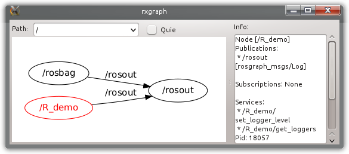
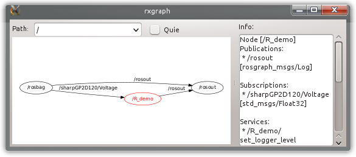

# Introduction

The development of robotic applications has become more and more an
interdisciplinary task, ranging from mechanical and electrical
engineering, signal processing, control technology and cybernetics, up
to artificial intelligence, etc. The Robot Operating System[^1],
abbreviated as ROS, is a relatively new framework, intended to simplify
the development of any kind of robotic application by bringing together
the latest scientific knowledge. And by the time it has become a de
facto standard in the scientific robotics community [cf. 
@Kramer07developmentenvironments]. In order to disseminate a certain
algorithm, toolbox, or function, a large number of developers provide
interfaces to ROS. Currently there are more than 1700 different packages
available online for various purposes, for example "Marker Detection",
"Simultaneous Localization And Mapping", "Trajectory Planning", and many
more. These packages can easily be used, combined, and integrated into
new applications, with only a little knowledge about the ROS philosophy.
Robotic applications are no longer designed as single and monolithic
processes, but instead as a collection of nodes, which perform a certain
type of computation, similar to the UNIX philosophy [cf.  @unix94]:
"*Write programs that do one thing and do it well. Write programs to
work together. Write programs to ...*". The development of a ROS node is
mainly based on two philosophical pillars (apart from open source
ideology), namely multilingualism and peer-to-peer [cf. 
@quigley2009ros].

Multilingualism means to implement a node in the most appropriate
programming language. In most cases C++ (roscpp[^2]) is the ideal choice
for developing a node [cf.  @roscpp], especially to fulfill
hardware-related or computationally expensive functionalities, whereas
Python ([rospy](http://www.ros.org/wiki/rospy)) is suitable for rapid
prototyping, scripting, and GUI development. The Lisp language support
([roslisp](http://www.ros.org/wiki/roslisp)) was also intended for
scripting, but is mostly employed for fast and interactive debugging.
Next to these programming languages with full ROS support, there are
also other "experimental" language[^3]-extensions, serving different
needs. Java
([rosjava](http://docs.rosjava.googlecode.com/hg/rosjava_core/html/index.html))
allows developers to build nodes for Android, while Lua
([roslua](http://www.ros.org/wiki/roslua)) currently is used for
scripting reactive robot behavior.

The interconnection between nodes is established at run time in a
peer-to-peer topology, using publish/ subscribe or service-based
communication. This allows to run nodes on different hosts and it
enables their dynamic integration and segregation. For this purpose, ROS
guarantees mutual understanding (and thus interoperability) by explicit
message descriptions.

Until now, it was not possible to develop nodes in the statistical
programming language R. R is probably not the best choice for
implementing fancy GUIs or to develop hardware drivers, but it has by
far one of the richest libraries for statistical analyses, data-mining,
machine learning, and visualization. According to the comparison of
statistical packages on [@wiki:comparison], R is the only product that
has support for every listed demand (unlike MATLAB or SciPy).
Furthermore, most of its algorithms are directly implemented in C or
C++, which guarantees fast and efficient computation.

In light of these qualities, R is an adequate programming language for
sensor signal analysis, evaluation and visualization. These types of
tasks are very important for embedded or robotic applications where
developers cope with non-linear behavior, different measurement faults
or external disturbances. An exemplary evaluation of sensor data is
described in [@ZDK10a]. The presented infrared sensors can be easily
disturbed by external light, leading to faulty measurements. But these
external disturbances also affect the measurement noise in such a way
that it can be detected by applying statistical tests -- an ideal
application for R.

### Overview

This work is intended to serve two tasks. On the one hand, we want to
introduce ROS and present its general development principles to the
common R developer. On the other hand, we want to convince ROS
developers to use R for certain types of computation. To demonstrate the
utility of combining ROS and R, we chose a quite common application, the
linearization of sensor distance measurements. In a tutorial-like
section we will highlight all relevant aspects in a step-by-step
development of an R node. This node will receive raw sensor data,
perform a linearization, visualize and publish the resulting values.

Before we describe how to develop a ROS node in pure R and how to
install our [*rosR*](http://www.ros.org/wiki/rosR) package, we will give
a brief introduction to the common ROS communication principles in the
next section. Some limitations of R made it difficult to implement
*rosR* as a typical R library, such as single threading, problems in
supporting sockets and in handling raw data streams. Instead we
developed a common ROS package, which furthermore required to interface
several ROS packages. To ease the interconnection of ROS C++
functionality with R we applied the Simplified Wrapper and Interface
Generator [@swig]. The second-last section deals with these
implementation details as well as the project structuring and should
afterwards allow to extend the package with custom functionality. We
conclude our paper with a summary.

# ROS communication principles

As already mentioned, ROS offers two basic communication principles,
publish/subscribe and service-based communication. The participation of
an R node within a ROS network requires the implementation of these
paradigms. Hence, we briefly introduce both concepts, although *rosR*
currently does not support services.

## Publish/Subscribe

{#fig:communication
width="100%" alt="graphic without alt text"}

The main idea behind publish/subscribe (pub/sub) is to decouple the
production and consumption of data. In contrast to the widely used
address-based communication paradigm, it offers content-based
communication. But, as in most cases including ROS pub/sub, this is just
an overlay on address-based communication. Topics in this sense define
logical channels that transport all related messages. In ROS, a channel
is tagged by a unique string, such as `/map`, `/odometry`, or
`/laserscan`, which identifies the content of a channel and its message
format. Messages are strongly typed data structures, composed of
different primitive types (e. g., `string`, `integer`, `float`, `array`,
etc.), similar to structs in C. ROS provides a number of standard data
types for certain sensors or tasks. But a user can define individual or
adapted message formats related to specific purposes. A publisher
(producing node) advertises its intent to publish on a topic, while a
subscriber (consuming node) indicates its interest on one or more
topics. In ROS there is a central master node that provides name
registration and lookup for all connected nodes. The steps for
establishing a connection been both parties are depicted in
Figure [1](#fig:communication). Thus, data is only transmitted, if there
is at least one publisher and one subscriber for one topic.

## Services

Pub/sub is ideal for dynamic and flexible message passing, but in some
cases it might be more useful to request for a certain type of data
(e. g., camera parameters, robot states, etc.) or the execution of an
action (e. g., grasping an object, planning a trajectory, etc.). This
kind of remote procedure call is handled via services. Nodes offer their
services by using string names, similar to topics in pub/sub, and
clients can call these services by sending their request in an
appropriate message format, awaiting the reply message. The connection
between both entities is also instantiated with the help of the master,
as seen in Figure [1](#fig:communication).

## Parameters

The access to the parameter server is often mentioned as a third
communication method, comparable to shared memory. Parameters are stored
at runtime in a multivariate dictionary, which is also hosted by the ROS
master node. It is mainly applied for simple configuration purposes, but
it also allows to inspect and to modify the global configuration.

# Installation

First of all ROS has to be installed and configured. Good installation
guides can be found on <http://www.ros.org/wiki/ROS/Installation>.
Additionally, we put an extensive installation description for Ubuntu
12.04 and ROS "Groovy Galapagos" on our project site
<http://www.ros.org/wiki/rosR#R-Side>. The install manual was intended
to guide R developers with no or only a little ROS experience.
Information on further developments and adaptations for new ROS versions
will be available on the project website too. Before compiling our
*rosR* package, there are three things required (apart from an ROS-base
and a R-base):

1.  SWIG is responsible for interfacing the C++ code (only SWIG2.0 is
    able to generate appropriate wrappers for R),

2.  the R development packages for C++
    [*Rcpp*](https://CRAN.R-project.org/package=Rcpp) [cf.  @rcpp],

3.  and a running subversion client to be able to download our package
    via:`$ svn co http://svn.code.sf.net/p/ivs-ros-pkg/code/trunk/rosR`

Finally, simply enter the installation folder of *rosR* and run the
shell-command `rosmake` [cf. @rosmake]. If everything compiled
successfully, you should be able to launch a simple test application
with:

``` r
$ roslaunch rosR random.launch
```

# How-to develop a *rosR* node

As already mentioned, this section is intended to demonstrate how to use
the *rosR* API, by developing a node responsible for a common sensor
data transformation. For this purpose we chose a common infrared
distance sensor, the Sharp GP2D120 [cf.  @GP2D120]. We start with a very
basic application and extend it in the following subsections. The
complete source code for every example as well as the attached sensor
measurements can be downloaded from the following ROS project repository
(which can be treated as any ordinary ROS package and therefore has to
be built with rosmake:

``` r
$ svn co http://svn.code.sf.net/p/ivs-ros-pkg/code/trunk/rosR_demos
```

Every subsection will tackle an individual development part and in doing
so, will also explain some internal ROS matters, which makes it
necessary to switch between the R-terminal and the command-line shell.
`$` is used to indicate the shell usage `>` and `+` indicate R-commands,
while `#` is used for comments in both cases.

With the following shell-command you start the replay of previously
recorded ROS data, gathered from a Sharp infrared distance sensor. It
will also start a ROS master. Therefore, the user should not cancel it,
because then it will not be possible to subscribe to any kind of data or
to publish any sensor data.

``` r
$ # replay of data (using rosbag) from rosR_demos/nodes/RJournal/sharpGP2D120.bag
$ roslaunch rosR_demos sharp-playbag.launch
```

## Node initialization

Because we have developed a typical ROS package, which can be located
anywhere on your system, it has to be loaded manually. Run the following
command in R to load all required functionality. It invokes the system
call `rospack find` [cf. @rospack], which is responsible for locating
the current *rosR* installation directory.

``` r
> source(paste(system("rospack find rosR", intern = TRUE), "/lib/ros.R", sep = ""),
+   chdir = TRUE)
```

Each command of our API starts with `ros.`, so that the auto-completion,
after entering `ros.` into the R-terminal, should present the same
result. These are all functions that are required to participate in
every ROS network and to publish and subscribe for messages.

``` r
> ros.
ros.BagRead     ros.Logging          ros.ParamType                    ros.TimeNow
ros.Debug       ros.Message          ros.Publisher                    ros.Warn
ros.Error       ros.OK               ros.ReadMessage                  ros.WriteMessage
ros.Fatal       ros.ParamDelete      ros.SpinOnce                 
ros.Info        ros.ParamGet         ros.Subscriber               
ros.Init        ros.ParamSet         ros.SubscriberHasNewMessage
```

First of all, and as it is required for all ROS nodes, the node has to
be registered as a new participant by announcing at the ROS master with
an arbitrary but unique identifier. This can be done with the R-command:

``` r
> ros.Init("R_demo")
```

ROS also provides a monitoring tool `rxgraph` [cf. @rxgraph] that shows
all active applications ("nodes") and active connections between them.
Starting this tool from the shell should show the same result, as
presented in Figure [2](#fig:rxgraph) below. By examining these nodes,
you will see that our newly created node is neither subscribed to nor
publishing on a certain topic, while `rosbag` [cf. @rosbag] is
continuously publishing `Float32` data under topic
`/sharpGP2D120/Voltage`.

<figure id="fig:rxgraph">
<table>
<caption> </caption>
<tbody>
<tr class="odd">
<td style="text-align: left;">(a) before subscribing</td>
<td style="text-align: left;">(b) after subscribing</td>
</tr>
<tr class="even">
<td style="text-align: left;"></td>
<td style="text-align: left;"></td>
</tr>
</tbody>
</table>
<figcaption>Figure 2: Connectivity graphs, created with the
shell-command <code>rxgraph</code>, both show additional information
about node <code>"R_demo"</code> on the right.</figcaption>
</figure>

## Subscriptions and logging

Within this section, we will show how to subscribe to and receive
messages from other ROS nodes. A subscription in R can be created as
easily as in other programming languages. The only relevant parameters
are the topic and the message type (we will handle messages in more
detail within subsection "[4.6](#sec:pub)"). The function call as listed
below creates a new subscription and also changes the connectivity graph
of the ROS network, as depicted in Figure [2](#fig:rxgraph).

``` r
> subscription <- ros.Subscriber("/sharpGP2D120/Voltage", "std_msgs/Float32")
```

Due to the fact that R is single-threaded and the lack of native support
for callbacks, we have to continuously poll for new messages. The code
snippet below faciliates this:

``` r
> while(ros.OK()) {  # evaluates to TRUE as long as the master is online
+     ros.SpinOnce() # fill the subscription buffers with new messages
+     if(ros.SubscriberHasNewMessage(subscription)) {
+         message <- ros.ReadMessage(subscription)
+         ros.Info( paste("Measured Voltage", message$data) )
+ } }
[ INFO] [1374149363.939419670]: Measured Voltage 0.675665080547333
[ INFO] [1374149364.069367143]: Measured Voltage 0.713892936706543
...
```

Function `ros.SpinOnce()` is responsible for filling the message buffers
of all generated subscribers with the newest message at once. The fact
that a subscriber has received a new message or not, is indicated with
the function call `ros.SubscriberHasNewMessage()`. This has to be called
for every subscription. The last message that was received can be read
out with function `ros.ReadMessage()`. A message remains in the message
buffer of a subscriber as long as it is not overwritten by a newly
received message (`ros.SpinOnce()`).

Instead of using the standard `print` function of R to print out the
content of the message, it is also possible to use some of ROS's logging
functionalities `ros.Logging(text, mode)` or the abbreviations for
different modes. These are `ros.Debug(text)`, `ros.Info(text)`,
`ros.Warn(text)`, `ros.Error(text)`, and `ros.Fatal(text)`. The usage of
these functions enable a user to debug an application, consisting of
multiple nodes, since this information is published to node `rosout` and
can be further analyzed with various tools, compare with
Figure [3](#fig:rqt_console).

![Figure 3: Screenshot of `rqt_console` [cf. @rqt_console], a viewer
that displays logs of various
nodes.](pic/rqt_console.png){#fig:rqt_console width="100%"
alt="graphic without alt text"}

## Executable scripts

Two things are required, to start the example from above as a R-script
from the shell. A comment at the first line of the script, which defines
the correct interpreter:

``` r
#!/usr/bin/r
```

The script also has to be made executable, which can be done with the
shell-command `chmod`:

``` r
$ chmod +x script.R
```

Afterwards it is possible to run the script in the same way as any other
ordinary ROS node. The script that we had developed so far can be found
at
[`rosR_demos/nodes/RJournal/demo0.R`](http://svn.code.sf.net/p/ivs-ros-pkg/code/trunk/rosR_demos/nodes/RJournal/demo0.R)
(this folder also contains further examples) and is started from the
shell with `rosrun` [cf. @rosrun]:

``` r
$ rosrun rosR_demos demo0.R
```

## Time and visualization

{#fig:demo1
width="100%" alt="graphic without alt text"}

Since we started out by stating how easy it is to visualize data with R,
the snippet below shows an improved version of the previous code. The
voltage values and their reception time are stored within two vectors,
which are updated and plotted during every processing cycle.
Furthermore, a filter is applied to smooth the results of the
measurements. The resulting visualization is shown in
Figure [4](#fig:demo1) and the corresponding source code can be examined
at
[`rosR_demos/nodes/RJournal/demo1.R`](http://svn.code.sf.net/p/ivs-ros-pkg/code/trunk/rosR_demos/nodes/RJournal/demo1.R).

``` r
> x11(width = 6, height = 4, 
+     title = "SharpGP2D120-Monitor")
> Voltage <- Time <- rep(NA, 100)
> while(ros.OK()) { 
+   ros.SpinOnce()
+   if (ros.SubscriberHasNewMessage(subscription)){		
+     message <- ros.ReadMessage(subscription)
+     Voltage <- c(Voltage[-1], message$data)
+     Time <- c(Time[-1], ros.TimeNow()) 
+     plot(Time, Voltage, t = "l",
+          main = "Measured Voltage")
+     lines(Time,
+       filter(Voltage, rep(0.1, 10), sides = 1),
+              type = "l", col = "blue", lwd = 2.5) 
+ }}
```

The only newly used ROS function is `ros.TimeNow()`. It returns the
global system time of the ROS master as `double` value, as presented
below. The dot separates between seconds since the first of January 1970
and nanoseconds (everything after the decimal point).

``` r
> as.POSIXlt(ros.TimeNow(), origin="1970-01-01")       > ros.TimeNow() 
[1] "2013-07-18 15:46:26 CEST"                         [1] 1374155184.932926893234
```

## Bag-files and linearization

The conversion of non-linear voltage outputs into usable distance
measurements is a frequently occurring tasks, by dealing with raw sensor
data. The data sheet from the [@GP2D120] provides a voltage-distance
characteristic, which is quite similar to our measurements depicted in
Figure [5](#fig:plot). These measurements (sensor output voltage and
manually controlled distance) were stored additionally in the bag-file
that is currently replayed by rosbag to publish the voltage values of
Sharp distance sensor. A bag is a standard format in ROS for storing any
kind of ROS messages. Reading in messages from a bag-file, to analyze
their content in R, is therefore also provided by our API. Next to
replaying messages, rosbag can also be used for recording messages and
inspecting bag-files, as it is presented below:

``` r
$ rosbag info rosR_demos/nodes/RJournal/sharpGP2D120.bag
...
start:       Nov 19 2013 14:03:28.91 (1384866208.91)
end:         Nov 19 2013 14:28:42.09 (1384867722.09)
size:        39.6 KB
messages:    554
compression: none [1/1 chunks]
types:       rosR_demos/Linearization [3f7dd391cdbb9d1f72822c152e8c430f]
             std_msgs/Float32         [73fcbf46b49191e672908e50842a83d4]
topics:      /sharpGP2D120/Linearization   240 msgs    : rosR_demos/Linearization
             /sharpGP2D120/Voltage         314 msgs    : std_msgs/Float32
```

The result shows that there are two different topics in two different
message formats. The voltage values to which we had subscribed
`/sharpGP2D120/Voltage` and `/sharpGP2D120/Linearization`, which
contains the previously measured distance/voltage values. This message
format is defined in
[`rosR_demos/msg/Linearization.msg`](http://svn.code.sf.net/p/ivs-ros-pkg/code/trunk/rosR_demos/msg/Linearization.msg)
and is composed of two `Float32` values. Reading these messages from the
bag-file into R can be done with the function `ros.BagRead`. The
required input parameters are the filename and a vector of strings that
defines the topics of interest:

``` r
> file <- paste(system("rospack find rosR_demos", intern = TRUE),
+               "/nodes/RJournal/sharpGP2D120.bag", sep = "")
> bag.data <-  ros.BagRead(file, c("rosR_demos/Linearization"))
```

The result is a list consisting of four vectors, these are the topic
names, message types, timestamps, and the messages themselves (the
details of message conversion are explained in the next subsection):

``` r
> bag.data$topic[2]                           > bag.data$message[2]
[1] "/sharpGP2D120/Linearization"             [[1]]
> bag.data$data_type[2]                       [[1]]$dist
[1] "rosR_demos/Linearization"                [1] 0.031
> bag.data$time_stamp[2]                      [[1]]$volt
[1] 1374499648.961932659149                   [1] 3.0251
```

Before fitting a suitable equation to describe the relation between
distance and voltage, we have to transform the linearization messages
into an appropriate R format (`data.frame`). In the code example below,
this happens by extracting all required values with the help of
`sapply`:

``` r
> # Copy data
> dist <- sapply(bag.data$message, 
+                "[[", "dist")
> volt <- sapply(bag.data$message,
+                "[[", "volt")
> sharp.data <- data.frame(dist, volt)
> plot(sharp.data, main = "Linearization")
>
> # Linearization
> sharp.reg <- lm(dist ~ poly(volt, 8),
+                 data = sharp.data)
> sharp.dist <- function(volt) {
+  predict(sharp.reg,data.frame(volt))
+ }
>
> # Test 1            > # Test 2
> sharp.dist(0.8)     > sharp.dist(2.0)
[1] 0.1638513         [1] 0.0613970
```

{#fig:plot
width="100%" alt="graphic without alt text"}

We decide to approximate the relation by a polynom. Previous
investigations showed, that a polynom with a degree of 8 meets our
expectations related to the maximum deviation. This is pretty straight
forward in R and can be realized with `lm` within one line. The
following line defines a function that makes predictions based on the
fitted polynom. The predictions made by the resulting linearization
function `sharp.dist` are quite close to the measurements in data sheet
[@GP2D120]. The confidence intervals of this linearization are depicted
in Figure [6](#fig:demo3). See also
[`rosR_demos/nodes/RJournal/demo2.R`](http://svn.code.sf.net/p/ivs-ros-pkg/code/trunk/rosR_demos/nodes/RJournal/demo2.R),
which contains the source code of the running example.

## Publishing new messages {#sec:pub}

This subsection concludes our attempts at developing ROS nodes in R.
While the first part describes message handling and conversion from ROS
to R, the second part will show how simply the calculated distance
values can be published under a new topic and in an appropriate message
format (`sensor_msgs/Range`).

### Messages

In ROS every topic is defined by a strongly typed message format.
Messages are therefore described in language-neutral [interface
definition format](http://www.ros.org/wiki/msg). They are defined as
compositions of primitive data types such as `int32`, `float64`,
`string`, `arrays`, etc., but they can also contain other message
definitions to derive more complex structures for various purposes.
Furthermore, every ROS package can define its own message formats.
Addressing a specific message definition therefore requires two values,
in the format of `"ros-package-name/message-description-file"`. By
applying `rosmsg` [cf. @rosmsg] it is possible to examine messages that
are defined in different packages as follows:

``` r
$ rosmsg show rosR_demos/Linearization        $ rosmsg show std_msgs/Float32
float32 dist                                  float32 data
float32 volt                             
                                              $ rosmsg show sensor_msgs/LaserScan
$ rosmsg show sensor_msgs/Range               std_msgs/Header header
uint8 ULTRASOUND=0                              uint32 seq 
uint8 INFRARED=1                                time stamp
std_msgs/Header header                          string frame_id
  uint32 seq                                  float32 angle_min
  time stamp                                  float32 angle_max
  string frame_id                             float32 angle_increment
uint8 radiation_type                          float32 time_increment
float32 field_of_view                         float32 scan_time
float32 min_range                             float32 range_min
float32 max_range                             float32 range_max
float32 range                                 float32[] ranges
```

The listing above shows the definition formats of four different
messages. The first two of them were already used and you will probably
recognize where the names for list elements (`$data`, `$dist`, `$volt`)
came from. It is notable that the more complex messages combine static
information related to the sensor (`field_of_view`, `min_range`) and the
actual measurement sets (`stamp`, `range`). All ROS messages are
automatically converted into compositions of lists, whose format is
defined by the message definition. The resulting list from reading in a
message, from a subscription or from a bag-file, is already presented in
the appropriate structure. Calling function `ros.Message` will also
generate an empty message in the requested format:

``` r
> range <- ros.Message("sensor_msgs/Range")
```

Elements of that newly generated message can simply be changed by
assigning new values as follows (range values from [@GP2D120]):

``` r
> # equal to range.min_range as in rospy      > # or to range->min_range in roscpp
> range$min_range <- 0.04                     > range$header$seq <- 0
> range$max_range <- 0.30                     > range$header$frame_id <- "/sharp"
```

`header` in this case is an example of a nested message definition. As
shown in the result of rosmsg, this element of type `std_msgs/Header`
contains three primitive data types, which means in R that `header` is
also translated into a list containing three further elements. Some
message definitions like `sensor_msgs/LaserScan` might also contain
arrays, which cannot be directly translated into appropriate R elements
(vectors), as it happens for primitive data types. The conversion of
arrays by using SWIG2.0 can be very time consuming, at least in R. It
requires that every single element has to be copied into a new R vector.
Just think of a camera frame with 640x480 (RGB) pixels, resulting in an
array with 921600 elements. We therefore choose another strategy, to
enable and to speed up the access to these values, if it is required. An
array is handled in background as a C++ `std::vector<T>`. The access to
the elements of this C++ vector is enabled via R wrapper classes. See
file
[`rosR/lib/std_vector.R`](http://svn.code.sf.net/p/ivs-ros-pkg/code/trunk/rosR/lib/std_vector.R)
for implementation details.

``` r
> scan <- ros.Message("sensor_msgs/LaserScan")
> typeof(scan$ranges) # element defines float32 array
[1] "S4"
```

The functions that are currently used to wrap the access to these C++
vectors are `length`, `print`, `show`, `resize`, `pop`, `pop_back`,
`back`, `front`, `clear`, and `[]`. The usage of these functions allows
to query the length or to print the content of an array as follows:

``` r
> length(scan$ranges)                         > scan$ranges
[1] 0                                         [1] NULL
```

Inherited from the SWIG2.0 conversion of `std::vectors`, array elements
have to be added by using the function `append` or `push_back` and can
be removed with the functions `pop` or `pop_back`, while accessing and
changing already existing array elements can be done in the common R
way:

``` r
> append(scan$ranges, 0)                      > msg$ranges[2:4]
> append(scan$ranges, c(1, 2, 3))             [1] 1 2 3
> length(scan$ranges)                         > msg$ranges[2:4] <- c(11, 22, 33)
[1] 4                                         > msg$ranges[1:5]
> push_back(scan$ranges, c(4, 5, 6))          [1] 0 11 22 33 4
> length(scan$ranges)                         > pop(msg$ranges)
[1] 7                                         [1] 6
> msg$ranges                                  > msg$ranges
[1] 0 1 2 3 4 5 6                             [1] 0 11 22 33 4 5
```

It has to be noted that `[]` always creates local copies of the elements
stored within a C++ vector. Thus, accessing and analyzing huge arrays
(e. g., camera images) is possible but it may require some time for
conversion.

``` r
> sum(scan$ranges)
Error in sum(scan$ranges) : invalid 'type' (S4) of argument         
> sum(scan$ranges[1:6])
[1] 75
```

Nevertheless, it is possible to speed up the execution of required
functions, such as `sum`, `median`, or `density`, by manually
implementing wrapper functions in the same way as done for `length` or
`[]` in file
[`rosR/lib/std_vector.R`](http://svn.code.sf.net/p/ivs-ros-pkg/code/trunk/rosR/lib/std_vector.R).
See therefore also section "[5](#sec:implementation)".

### Publishing

Coming back to our example, the publication of converted distance
measurements requires the announcement of a new topic with the new
message format. This is done automatically by creating a new
publication:

``` r
> publication <- ros.Publisher("/sharpGP2D120/Distance", "sensor_msgs/Range")
```

Afterwards, the previously generated message of type `sensor_msgs/Range`
has to be updated with the current distance value, a timestamp, and a
sequence number. This can happen within the main loop as follows:

``` r
> range$range <- sharp.dist(volt)             # convert voltage to distance
> range$header$seq <- counter                 # store a running sequence number
> range$header$stamp <- ros.TimeNow()         # store the current time
```

Finally, the message can be published by writing the message to the
publisher. In contrast to a subscription, this information is
immediately published and does not require to run function
`ros.SpinOnce()`.

``` r
> ros.WriteMessage(publication, range)        # publish the adapted message
```

![Figure 6: Screenshots of the final R application (foreground:
`$ rosrun rosR_demos demo3.R`) and the published range messages in a
textual format (background: `$ rostopic echo /sharp- GP2D120/Distance`)
by using `rostopic` [cf. @rostopic].](pic/demo3.png){#fig:demo3
width="100%" alt="graphic without alt text"}

Figure [6](#fig:demo3) shows the running example of the R node, which is
publishing and visualizing the linearized distance measurements. The
additional plot on the left shows the non-linear relation between
voltage and distance as well as the current measurement. See also
[`rosR_demos/nodes/RJournal/demo3.R`](http://svn.code.sf.net/p/ivs-ros-pkg/code/trunk/rosR_demos/nodes/RJournal/demo3.R).

## Accessing the parameter server

The parameter server is also part of the ROS master and allows different
nodes to exchange simple parameters (i. e., `logical`, `integer`,
`double`, `character`). Accessing and storing parameters is enabled by
the functions `ros.ParamSet`, `ros.ParamGet`, `ros.ParamType`, and
`ros.ParamDelete`, which can be used as follows:

``` r
> ros.ParamSet("name", "value")               > ros.ParamGet("name")
> ros.ParamGet("name")                        [1] 12.22
[1] "value"                                   > ros.ParamType("name")
> ros.ParamSet("name", TRUE)                  [1] "double"
> ros.ParamType("name")                       > ros.ParamDelete("name")
[1] "logical"                                 > ros.ParamType("name")
> ros.ParamSet("name", 12.22)                 NULL
```

Function `ros.ParamType` checks the type of a certain parameter, but can
also be used to check if a parameter does not exist, in this case it
will return `NULL`.

# Implementation details {#sec:implementation}

This section will give insights into the project structure and details
of implementation. Thus, adapting and adding new functionality is
strongly recommended. As mentioned earlier, our package was developed
with the help of SWIG2.0. This is an "easy to use" tool for interfacing
C and C++ libraries/programs from various languages such as Python, Tcl,
Go, Guile, Java, and also R. Literally, it can be seen as a compiler
that takes C and C++ declarations as input and generates wrappers as
output. These interfaces and the conversion between different data
formats for R are automatically generated with the help of the *Rcpp*
package, which provides required R functions and a C++ library for the
interconnection.

## Structure

To ease the development and the maintenance of the code and the API, the
*rosR* project was separated into an R and a C++ part:

-   [`rosR/lib/`](http://svn.code.sf.net/p/ivs-ros-pkg/code/trunk/rosR/lib/):
    Folder for all R related files that are listed below.
    -   [`ros.R`](http://svn.code.sf.net/p/ivs-ros-pkg/code/trunk/rosR/lib/ros.R):
        Is the main file of the project, which has to be loaded by every
        R node. It implements the whole *rosR* API and is therefore also
        responsible for loading other R files. It also contains a couple
        of internal helper functions, responsible for message conversion
        and handling. Extending the *rosR* API therefore also requires
        adapting this file.
    -   `rosR.R` and `rosR.so`: This is the SWIG2.0 generated wrapper
        code for R and the compiled C++ library, which enables to access
        ROS via C++ objects and methods.
    -   [`std_vector.R`](http://svn.code.sf.net/p/ivs-ros-pkg/code/trunk/rosR/lib/std_vector.R):
        This is the handmade wrapper for accessing ROS arrays. It
        implements a general `rros_vector` class as well as classes for
        every primitive data type (`std::vector<T>`). Based on these
        class definitions, different wrapper functions were implemented
        (i. e., `length`, `print`, `show`, `resize`, `pop`, `pop_back`,
        `back`, `front`, `clear`, and `[]`) to ease and hide the
        complexity of array access. This is also the right place to
        include additional user-defined functionality such as `sum`,
        `mean`, etc., which can increase the speed of execution. Vector
        elements can be accessed and manipulated directly with C++
        functions, which is probably more advantageous than creating
        local vector copies.
-   [`rosR/src/`](http://svn.code.sf.net/p/ivs-ros-pkg/code/trunk/rosR/src/):
    Includes all C++ wrappers as listed below, based on `roscpp` by
    [@roscpp], `topic_tools` by [@topic_tools], and `rosbag` by
    [@rosbag].
    -   [`rosR.i`](http://svn.code.sf.net/p/ivs-ros-pkg/code/trunk/rosR/src/rosR.i):
        The SWIG2.0 input file, used to include all below listed
        classes. The result is the generated wrapper file
        `rosR_wrap.cpp`, which allows to access all methods and classes,
        defined in the files below.
    -   [`rosR.h`](http://svn.code.sf.net/p/ivs-ros-pkg/code/trunk/rosR/src/rosR.h)`/`[`cpp`](http://svn.code.sf.net/p/ivs-ros-pkg/code/trunk/rosR/src/rosR.cpp):
        Defines general functionality such as initializing a node and
        generating a node handle, logging, timing, and spinning. It is
        the right place for including basic functionality.
    -   [`PublisheR.h`](http://svn.code.sf.net/p/ivs-ros-pkg/code/trunk/rosR/src/PublisheR.h)`/`[`cpp`](http://svn.code.sf.net/p/ivs-ros-pkg/code/trunk/rosR/src/PublisheR.cpp):
        The generation of a ROS publisher for R is more complex and was
        therefore outsourced. The header file contains the
        implementation of a specific publisher class developed for R.
        Other functions defined within the
        [`cpp`](http://svn.code.sf.net/p/ivs-ros-pkg/code/trunk/rosR/src/PublisheR.cpp)-file,
        only give access to this specific R-publisher and allow the
        modification of its settings, such as topic, message type, etc.,
        but also to alter the content of its message buffer (derived
        from `topic_tools`).
    -   [`SubscribeR.h`](http://svn.code.sf.net/p/ivs-ros-pkg/code/trunk/rosR/src/SubscribeR.h)`/`[`cpp`](http://svn.code.sf.net/p/ivs-ros-pkg/code/trunk/rosR/src/SubscribeR.cpp):
        The subscriber was developed similarly to the implementation of
        the publisher. The header filer contains the implementation of a
        specific R subscriber. Due to the fact that callbacks cannot be
        defined within R, every `SubscribeR` object also contains a
        callback method, which comes into play when `ros::SpinOnce()` is
        activated. It receives and stores every new message. Other
        functions defined within these files give access to the
        subscriber and its message buffer.
    -   [`BagR.h`](http://svn.code.sf.net/p/ivs-ros-pkg/code/trunk/rosR/src/BagR.h)`/`[`cpp`](http://svn.code.sf.net/p/ivs-ros-pkg/code/trunk/rosR/src/BagR.cpp)
        and
        [`ParamR.h`](http://svn.code.sf.net/p/ivs-ros-pkg/code/trunk/rosR/src/ParamR.h)`/`[`cpp`](http://svn.code.sf.net/p/ivs-ros-pkg/code/trunk/rosR/src/ParamR.cpp):
        As the names suggest, these files contain the functions to read
        out bag-files and give access to the parameter server.
    -   `rosR_wrap.cxx`: This file contains the generated wrapper and
        conversion functionality for C++, which is based on *Rcpp*.

## SWIG by example

The following two functions are taken from
[`ParamR.cpp`](http://svn.code.sf.net/p/ivs-ros-pkg/code/trunk/rosR/src/ParamR.cpp).
The first function is used to retrieve string parameters from the
parameter server, similar functions were also defined to retrieve
`double`, `boolean`, and `integer` values. The second function
identifies the type of the parameter, returning the type as a string and
the string `NULL`, if the parameter does not exist.

``` r
char* rrosGetParamString(                  char* rrosGetParamType(ros::NodeHandle* h,
   ros::NodeHandle* handle,                    char* p)//(==param) requested parameter
   char* param)                            {                       
{                                            bool b; int i; double d; std::string s;
  std::string val;                           if(h->getParam(p, b)) return "logical";
  handle->getParam(param, val);              if(h->getParam(p, i)) return "integer";
  return const_cast<char*>(val.c_str());     ...
}                                            return "NULL"; }
```

After SWIG2.0 did its magic, these C++ functions are also callable from
R (with their pervious C++ function names). The API functions
`ros.ParamGet` and `ros.ParamType` are simple workarounds (defined in
[`rosR/lib/ros.R`](http://svn.code.sf.net/p/ivs-ros-pkg/code/trunk/rosR/lib/ros.R))
that hide the different data types and therefore different C++ function
calls:

``` r
ros.ParamGet <- function(param) {          # "rros_node" is a pointer to the ROS node-
  p <- param; h <-rros_node;               # handle, which was created during the ini-    
  type <- ros.ParamType(param)             # tialization by "ros.Init()".
  if (type == "logical") {                 # It is stored as a global variable and re-  
    return(rrosGetParamBoolean(h, p))      # quired by most of the rosR API functions.
  } else if (type == "integer") {
    return(rrosGetParamInteger(h, p))      ros.ParamType <- function(param) {    
  } else if (type == "double") {             p <- param; h <-rros_node;
    return(rrosGetParamDouble(h, p))         type <- rrosGetParamType(h, p)
  } else if (type == "character") {          if (type == "NULL") { 
    return(rrosGetParamString(h, p))           return(NULL) }
  } else { return(NULL) } }                  return(type) } 
```

The other functions of our API were also implemented in the same manner
(cf.
[`ros.R`](http://svn.code.sf.net/p/ivs-ros-pkg/code/trunk/rosR/lib/ros.R)),
while announcing a subscriber or a publisher (and also the
initialization with `ros.Init`) also generate specified objects. The
wrapper functions for writing and reading out messages therefore always
require the pointer to these objects, to get access to their public
class methods.

# Summary

We have developed the first interface for ROS in R and demonstrated its
utility as well as its main concepts, which represents a fruitful
combination of the (interdisciplinary) world of robotics with the world
of statistics. On the one hand, it gives ROS developers full access to
the huge amount of R algorithms and functionality for analyzing,
visualizing, combining and filtering data. And on the other hand, it
will probably open up a new branch to the R community, by giving online
access to real hardware devices and their data, in contrast to the
traditional offline data analysis.

But, there is still a lot of work to do. The next extensions should
cover the integration of [services](http://www.ros.org/wiki/Services),
which could be used for parameter fitting, clustering, machine learning,
or pattern matching. Furthermore, it would be beneficial to develop
methods in R that would enable callback mechanisms or multi-threading,
to overcome polling for new messages.

# Acknowledgements

This work is funded and supported by the German Ministry of Education
and research within the project
[ViERforES-II](http://www.vivera.org/ViERforES) (grant no. 01IM10002B)
and by the EU FP7-ICT program under the contract number 288195
"Kernel-based ARchitecture for safetY-critical cONtrol"
([KARYON](http://www.karyon-project.eu)).


[^1]: Official ROS project website: <http://www.ROS.org>

[^2]: ROS language extensions for C++, Python, Lisp, Java, and Lua.

[^3]: For a complete list of supported programming languages see
    [http://www.ros.org/wiki/Client
    Libraries](http://www.ros.org/wiki/Client
    Libraries){.uri}.
