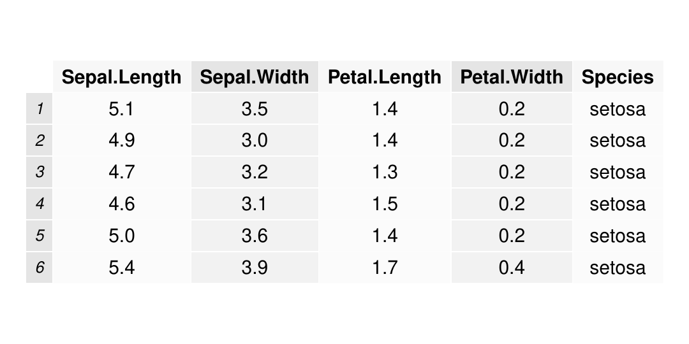
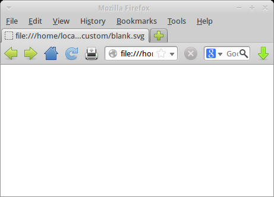
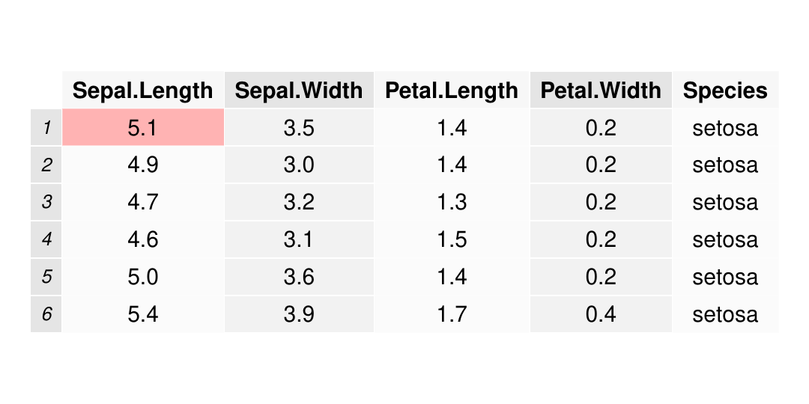
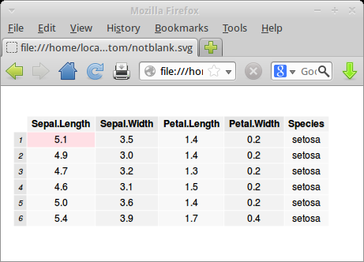

::: article
# Introduction

The *grid* graphics package [@Murrell201106] provides a low-level
graphics system as an alternative to the default *graphics* package.
Several high-level graphics packages build on *grid*; for example, if we
use [*lattice*](https://CRAN.R-project.org/package=lattice) [@lattice]
or [*ggplot2*](https://CRAN.R-project.org/package=ggplot2) [@ggplot] to
draw a plot, then we are also using *grid*.

This section shows a simple example of using *grid* that results in a
problem, and this problem provides the motivation for the changes that
were made to *grid* for R 3.0.0.

The following code uses the *grid* package to draw an axis.

``` r
> library(grid)
```

``` r
> grid.xaxis(at=c(0, .5, 1), name="axis-1")
```

{width="100%" alt="graphic without alt text"}

In addition to drawing the axis, *grid* keeps a list of graphical
objects, or grobs, that contain descriptions of what has been drawn. The
following code lists the grobs in the current scene: there is a parent
grob called `"axis-1"` (this is actually a gTree, which is a grob that
can have other grobs as children), and several child grobs including a
\"major\" line, several \"ticks\" line segments, and several text
\"labels\", all collected together to make an axis.

``` r
> grid.ls(fullNames=TRUE)
```

``` r
xaxis[axis-1]
  lines[major]
  segments[ticks]
  text[labels]
```

The *grid* package keeps a list of grobs because it can be useful to
access, query, and modify the grobs in a scene. For example, the
following code uses the `grid.edit()` function to change the lines on
the axis to grey and the text to bold.

``` r
> grid.edit("major|ticks", grep=TRUE, global=TRUE, gp=gpar(col="grey"))
> grid.edit("labels", gp=gpar(fontface="bold"))
```

{width="100%" alt="graphic without alt text"}

## A problem

The next piece of code also draws an axis, but this time we do not
specify where the tick marks should go on the axis. There is also code
to show the grobs that *grid* has kept as a record of this scene. The
important difference to note is that this time the grob listing only
shows the `"axis-2"` gTree; there are no grobs representing the lines,
segments, and text on the axis.

``` r
> grid.xaxis(name="axis-2")
```

{width="100%" alt="graphic without alt text"}

``` r
> grid.ls(fullNames=TRUE)
```

``` r
xaxis[axis-2]
```

This lack of child grobs is a problem because it means that it is not
possible to access (or query or modify) the child grobs. The problem
exists because, when the tick mark locations are not specified for an
axis, the axis decides which tick marks to draw every time the axis is
drawn - no child grobs are kept because they are recreated every time.

One of the reasons for the changes to *grid* in R 3.0.0 is to provide a
solution for this problem. It is important to point out that many *grid*
grobs do not suffer from this issue at all. This problem only occurs for
a small set of *grid* grobs that decide what to draw at drawing time
rather than at creation time. On the other hand, the problem becomes
more likely in packages that build on *grid* and define new classes of
*grid* grobs, so fixing the problem in *grid* has large flow-on effects
to other packages.

One of the very visible changes to *grid* is the new function
`grid.force()`. The following code shows that the `grid.force()`
function can be used to create permanent versions of the child grobs for
the axis, which then means that it is possible to modify those child
grobs.

``` r
> grid.force()
```

``` r
> grid.ls(fullNames=TRUE)
```

``` r
forcedgrob[axis-2]
  lines[major]
  segments[ticks]
  text[labels]
```

``` r
> grid.edit("major|ticks", grep=TRUE, global=TRUE, gp=gpar(col="grey"))
> grid.edit("labels", gp=gpar(fontface="bold"))
```

{width="100%" alt="graphic without alt text"}

The `grid.force()` function is just one of the changes to *grid* for R
3.0.0. This article describes the full set of changes, including more
about `grid.force()`, and explores some of the other reasons for change
and some of the other benefits that arise from these changes.

# A simple *grid* demonstration

In order to demonstrate the changes in *grid*, we will consider several
different ways to develop a function that draws a "text box" with
*grid*. This function will draw a text label and surround the text with
a box (with rounded corners). In effect, we are going to create a new
class of grob; one that draws text surrounded by a box.

The simplest way to implement this sort of thing in *grid* is to write a
function that makes several calls to draw standard *grid* grobs. For
example, the following code defines a `textbox()` function that takes a
single argument, a text label, and calls `textGrob()` to create a text
grob, `roundrectGrob()` to create a box around the label, and then
`grid.draw()` to draw the two grobs. The `stringWidth()` and
`stringHeight()` functions are used to make sure that the box is the
right size for the label.

``` r
> library(grid)
```

``` r
> textbox <- function(label) {
+     tg <- textGrob(label, name="text")
+     rr <- roundrectGrob(width=1.5*stringWidth(label),
+                         height=1.5*stringHeight(label),
+                         name="box")
+     grid.draw(tg)
+     grid.draw(rr)
+ }
```

The following code shows the function in action and the output is shown
below the code.

``` r
> grid.newpage()
> textbox("test")
```

{width="100%" alt="graphic without alt text"}

The code and output below shows that *grid* has kept a record of the
grobs that were drawn.

``` r
> grid.ls(fullNames=TRUE)
```

``` r
text[text]
roundrect[box]
```

One deficiency with the `textbox()` function is that there is no
connection between the two grobs that it creates. For example, if we
modify the text (code below), the roundrect stays the same size and
becomes too small for the text (see the output below the code).

``` r
> grid.edit("text", label="hello world")
```

{width="100%" alt="graphic without alt text"}

An alternative implementation is to *group* the two grobs together by
constructing a gTree to contain them both. For example, the following
code redefines the `textbox()` function so that it generates a gTree
containing a text grob and a roundrect grob and then draws the gTree.

``` r
> textbox <- function(label) {
+     tg <- textGrob(label, name="text")
+     rr <- roundrectGrob(width=1.5*stringWidth(label),
+                         height=1.5*stringHeight(label),
+                         name="box") 
+     gt <- gTree(children=gList(tg, rr), name="tb")
+     grid.draw(gt)
+ }
```

This version of the function produces the same output as the previous
version, but the scene now consists of a single gTree that contains the
text grob and the roundrect grob.

``` r
> grid.newpage()
> textbox("test")
```

{width="100%" alt="graphic without alt text"}

``` r
> grid.ls(fullNames=TRUE)
```

``` r
gTree[tb]
  text[text]
  roundrect[box]
```

Unfortunately, the contents of the gTree are fixed at creation time, so
if we modify the text grob child of the gTree, the roundrect child is
still not updated.

``` r
> grid.edit("tb::text", label="hello world")
```

{width="100%" alt="graphic without alt text"}

# The old `drawDetails()` hook

The behaviour of the text box can be made more coherent if we delay the
construction of the box until drawing time (i.e., recalculate the box
every time that we draw the text box). That way, the box will always be
the right size for the text. This can be achieved in *grid* by creating
a new class of grob with the `grob()` function and then defining a
`drawDetails()` method for this new grob class. For all grobs, the
`drawDetails()` hook is called whenever the grob is drawn (with the
default `drawDetails()` method doing nothing).

For example, the following code redefines the `textbox()` function so
that it generates a grob with the class `"textbox"` and draws that.

``` r
> textbox <- function(label, 
+                     name=NULL, gp=NULL, vp=NULL) {
+     g <- grob(label=label, 
+               name=name, gp=gp, vp=vp, 
+               cl="textbox")
+     grid.draw(g)
+ }
```

Because we have created a new class of grob, *grid* does not know how to
draw it. To tell *grid* how to draw a `"textbox"` grob, we can define a
`drawDetails()` method for `"textbox"` grobs. Such a method is shown in
the code below, which is almost identical to the previous version of
`textbox()`; all that we have done is delay the generation of the text
grob and roundrect grob until drawing time.

``` r
> drawDetails.textbox <- function(x, ...) {
+     tg <- textGrob(x$label, name="text")
+     rr <- roundrectGrob(width=1.5*stringWidth(x$label),
+                         height=1.5*stringHeight(x$label),
+                         name="box") 
+     gt <- gTree(children=gList(tg, rr), name=x$name)
+     grid.draw(gt)
+ }
```

The following code shows the new `textbox()` function in action and
shows that it produces exactly the same output as the first version.

``` r
> grid.newpage()
> textbox("test", name="tb")
```

{width="100%" alt="graphic without alt text"}

One big difference is that only one `"textbox"` grob was generated,
rather than separate text and roundrect grobs. The latter are only
generated at drawing time and are not retained.

``` r
> grid.ls(fullNames=TRUE)
```

``` r
textbox[tb]
```

The advantage that we get is that, if we modify that one grob, both the
text and the box are updated.

``` r
> grid.edit("tb", label="hello world")
```

{width="100%" alt="graphic without alt text"}

The disadvantage is that the individual text and box grobs are no longer
visible as separate grobs, so it is not possible to access the
individual text or roundrect grobs. In other words, we have a convenient
high-level interface to the combined text and box, but we *only* have
that high-level interface. This is the same problem that we had with the
axis grob at the start of this article.

# The new `makeContent()` hook

The new `makeContent()` function provides an alternative way to specify
how to draw a new *grid* grob class (an alternative to writing a
`drawDetails()` method). The main difference is that, whereas a
`drawDetails()` method typically calls *grid* functions to *draw
output*, a `makeContent()` method calls *grid* functions to *generate
grobs*. The standard behaviour for grobs automatically takes care of
drawing the content.

To continue our example, the following code redefines `textbox()` yet
again. This is very similar to the previous version of `textbox()`. The
one important difference in this new version is that the `gTree()`
function is used to generate a new *gTree* class, rather than calling
the `grob()` function to generate a new grob class. We do this because
we are going to be writing a `makeContent()` method that creates more
than one grob to draw; we can only use a `makeContent()` method for a
grob class if the method only creates a single predefined grob to
draw.[^1] The gTree does not get any children when it is created because
the children will be built (and added) at drawing time by a
`makeContent()` method.

``` r
> textbox <- function(label, 
+                     name=NULL, gp=NULL, vp=NULL) {
+     gt <- gTree(label=label, 
+                 name=name, gp=gp, vp=vp, 
+                 cl="textboxtree")
+     grid.draw(gt)
+ }
```

To tell *grid* how to draw this new gTree class, instead of a
`drawDetails()` method, we define a `makeContent()` method. This is
similar to the `drawDetails()` method above because it generates a text
grob and a roundrect grob, but instead of drawing them, it simply adds
these grobs as children of the gTree. The modified gTree must be
returned as the result of this function so that *grid* can draw the
generated content.

``` r
> makeContent.textboxtree <- function(x) {
+     t <- textGrob(x$label,
+                   name="text")
+     rr <- roundrectGrob(width=1.5*grobWidth(t), 
+                         height=1.5*grobHeight(t),
+                         name="box")
+     setChildren(x, gList(t, rr))
+ }
```

The following code shows that the new `textbox()` function produces
exactly the same output as before.

``` r
> grid.newpage()
> textbox("test", name="tbt")
```

{width="100%" alt="graphic without alt text"}

As with the `drawDetails()` approach, the scene consists of only one
grob, this time a `"textboxtree"` grob.

``` r
> grid.ls(fullNames=TRUE)
```

``` r
textboxtree[tbt]
```

Furthermore, if we modify that one grob, both the text and the box are
updated.

``` r
> grid.edit("tbt", label="hello world")
```

{width="100%" alt="graphic without alt text"}

In summary, the `makeContent()` approach behaves exactly the same as the
`drawDetails()` approach. The advantages of the `makeContent()` approach
lie in the *extra* things that it allows us to do.

# The `grid.force()` function

The new function `grid.force()` affects any grobs that have a
`makeContent()` method. This function *replaces* the original grob with
the modified grob that is returned by the `makeContent()` method.

For example, if we use `grid.force()` on a scene that contains a
`"textboxtree"` grob, the output of the scene is unaffected (see below).

``` r
> grid.force()
```

{width="100%" alt="graphic without alt text"}

However, the scene now consists of a gTree with a text grob and a
roundrect grob as its children (rather than just a single
`"textboxtree"` object).

[]{#page:force label="page:force"}

``` r
> grid.ls(fullNames=TRUE)
```

``` r
forcedgrob[tbt]
  text[text]
  forcedgrob[box]
```

Now that we can see the individual components of the text box, we can
modify them independently. For example, the following code just modifies
the box component of the scene, but not the text component.

``` r
> grid.edit("box", gp=gpar(col="grey"))
```

{width="100%" alt="graphic without alt text"}

In other words, in addition to the convenient high-level interface to
the text box, we can now "force" the high-level gTree to produce a
low-level interface to the individual components of the text box.

## Forced grobs

In the list of grobs above, the `"tbt"` grob is labelled as a
`"forcedgrob"` after the call to `grid.force()`. This is an additional
class that is attached to grobs that have been forced. The `"tbt"` grob
is still a `"textboxtree"`, as shown below.

``` r
> class(grid.get("tbt"))
```

``` r
[1] "forcedgrob"  "textboxtree" "gTree"       "grob"        "gDesc"      
```

The `"box"` grob in the example above has also been forced because
*grid* `"roundrect"` grobs now have a `makeContent()` method. In this
case, the forced grob is now a `"polygon"` grob (because the
`makeContent()` method creates a `"polygon"` to draw based on the
description in the `"roundrect"` grob).

``` r
> class(grid.get("box"))
```

``` r
[1] "forcedgrob" "polygon"    "grob"       "gDesc"     
```

# The `grid.revert()` function

One downside of calling `grid.force()` is that the convenient high-level
interface to a grob is no longer available. For example, changing the
label on the text box no longer has any effect.

``` r
> grid.edit("tbt", label="test")
```

{width="100%" alt="graphic without alt text"}

The new `grid.revert()` function is provided to reverse the effect of
`grid.force()` and replace the individual components of the forced grob
with the original grob. The following code and shows this function in
action. It also demonstrates that the reversion will lose any changes
that were made to any of the individual components. We return to the
scene that we had before the call to `grid.force()`.

``` r
> grid.revert()
```

{width="100%" alt="graphic without alt text"}

In other words, for grobs that generate content at drawing time, we can
have *either* the high-level interface *or* the low-level interface, but
not both at once.

# A reminder

All of the discussion in this article applies to the situation where a
new *grid* grob class is created that *needs to calculate what to draw
at drawing time*. If the entire content of a grob or gTree can be
generated at creation time, rather than having to wait until drawing
time, then things are much easier, and it is possible to have both a
high-level interface and low-level access at the same time.

It is only when the content must be generated at drawing time, as is the
case for *grid* axis grobs, that the design decisions and functions
described in this article become necessary.

# Review

To review the changes described so far, where once we might have written
a `drawDetails()` method for a new *grid* grob or gTree class, we can
*instead* write a `makeContent()` method. If we do so, the new
`grid.force()` function can be used to gain access to low-level grobs
that otherwise would not be accessible. One example where this is useful
is for *grid* axis grobs (with no tick location specified), in order to
gain access to the individual lines and text that make up the axis.

# Revisiting the simple *grid* demonstration

In order to demonstrate some of the other changes in *grid* for R 3.0.0,
we will revisit the simple text box example from before. In the
implementations of the `textbox()` function so far, we have focused our
effort on what *content* to draw for the text box. In this section, we
also consider the *context* for drawing; the *grid* viewports that a
text box is drawn within.

In this next implementation, when a text box is drawn, we will set up a
viewport to draw the text box within and then draw a text grob and
roundrect grob within that viewport. This will simplify the creation of
the text and roundrect grobs.

This change only requires modifications to the methods for the
`"textboxtree"` class; the `textbox()` function remains the same as
before.

``` r
> textbox <- function(label, 
+                     name=NULL, gp=NULL, vp=NULL) {
+     gt <- gTree(label=label, 
+                 name=name, gp=gp, vp=vp, 
+                 cl="textboxtree")
+     grid.draw(gt)
+ }
```

# The old `preDrawDetails()` hook

We can specify how to set up the drawing context for a grob class by
defining a `preDrawDetails()` method for the class. For all grobs, the
`preDrawDetails()` hook is called *before* the `makeContent()` or
`drawDetails()` hooks (with the default `preDrawDetails()` method doing
nothing). The following code defines a method for `"textboxtree"` grobs
that pushes a viewport the appropriate size for drawing the text box.

``` r
> preDrawDetails.textboxtree <- function(x) {
+     tbvp <- viewport(width=1.5*stringWidth(x$label),
+                      height=1.5*stringHeight(x$label))
+     pushViewport(tbvp)
+ }
```

With this method defined, the `makeContent()` method for `"textboxtree"`
grobs becomes much simpler because the roundrect grob just fills up the
viewport that was created by the `preDrawDetails()` method (we have
already calculated the appropriate size when we created the viewport in
the `preDrawDetails()` method).

``` r
> makeContent.textboxtree <- function(x) {
+     t <- textGrob(x$label, name="text")
+     rr <- roundrectGrob(name="box")
+     setChildren(x, gList(t, rr))
+ }
```

Whenever a `preDrawDetails()` method is defined, it must be accompanied
by a `postDrawDetails()` method, which must revert any changes to the
drawing context.

``` r
> postDrawDetails.textboxtree <- function(x) {
+     popViewport()
+ }
```

The following code shows that the `textbox()` function produces exactly
the same output as before.

``` r
> grid.newpage()
> textbox("test", name="tbt")
```

{width="100%" alt="graphic without alt text"}

The drawing context is regenerated every time the text box is drawn, so
modifying the text label updates the viewport that both text and box are
drawn in and the box expands with the text.

``` r
> grid.edit("tbt", label="hello world")
```

{width="100%" alt="graphic without alt text"}

# The new `makeContext()` hook

In parallel with the change from `drawDetails()` to `makeContent()`,
there is a new `makeContext()` generic function to replace the use of
`preDrawDetails()` (and `postDrawDetails()`).

The main difference is that a `makeContext()` method must create new
viewports and *add* them to the `vp` slot of the grob (rather than
pushing the new viewports), *and* it must return the modified grob. The
following code demonstrates what a `makeContext()` method looks like for
a `"textboxtree"` grob.

``` r
> makeContext.textboxtree <- function(x) {
+     tbvp <- viewport(width=1.5*stringWidth(x$label),
+                      height=1.5*stringHeight(x$label))
+     if (is.null(x$vp))
+         x$vp <- tbvp
+     else
+         x$vp <- vpStack(x$vp, tbvp)
+     x
+ }
```

This is similar to the `preDrawDetails()` method, but it has additional
code to combine the new viewport with the current value of the `vp` slot
for the grob. On the plus side, there is no need for a
`postDrawDetails()` method. In fact, it is essential that we remove the
`preDrawDetails()` and `postDrawDetails()` methods for this class; we
only need the `makeContext()` method now.

``` r
> rm("preDrawDetails.textboxtree")
> rm("postDrawDetails.textboxtree")
```

The following code shows that the `textbox()` function still works and
that the box expands if we modify the text label.

``` r
> grid.newpage()
> textbox("test", name="tbt")
```

{width="100%" alt="graphic without alt text"}

``` r
> grid.edit("tbt", label="hello world")
```

{width="100%" alt="graphic without alt text"}

## Mixing viewports with viewport paths

The example in the previous section contains another subtle change in
*grid* for R 3.0.0. Within the `makeContext()` method there is the
expression `vpStack(x$vp, tbvp)`. The `vpStack()` function combines two
viewports into a viewport stack (one or more viewports that will be
pushed in series, one after the other). The second argument to the call,
`tbvp` is a viewport, but the first argument to the call is the `vp`
slot of a grob, which could be a viewport *or* it could be a viewport
path. The ability to combine viewport paths with viewports like this is
new in R 3.0.0 and is necessary for `makeContext()` methods to work.

# Another reminder

Modifying the drawing context at drawing time is not always necessary.
When creating a new grob class, it is often simpler just to set up the
drawing context at creation time by creating `childrenvp` for the
children of a gTree. It is only when the generation of drawing context
has to be delayed until drawing time that a `makeContext()` method
becomes necessary.

# Review

In addition to the new `makeContent()` hook for generating content at
drawing time, and the new `grid.force()` function for exposing content
that is only created at drawing time, there is a new `makeContext()`
hook for generating context at drawing time.

The new `makeContext()` hook has been described, but it may not be clear
what benefits accrue from it. That is the purpose of the next section.

# Who benefits?

The problem with *grid* axes that was described at the start of this
article has existed for many years. Having a solution for that problem
scratches a years-long itch, but it was not the main reason for the
changes in R 3.0.0. One of the motivations for changes to *grid* was
provided by the difficulties that the authors of the
[*gtable*](https://CRAN.R-project.org/package=gtable) package [@gtable]
had in implementing `"gtable"` grobs. The *gtable* package is important
because it is used by the popular *ggplot2* package to arrange the
different components of plots.

The *gtable* authors had to write not just `preDrawDetails()` and
`postDrawDetails()` methods, but also `grid.draw()` methods to get the
behaviour they desired for `"gtable"` grobs. This is undesirable because
having a `grid.draw()` method makes `"gtable"` grobs behave differently
from standard *grid* grobs. A symptom of this problem is the fact that
not all grobs from a `"gtable"` are accessible for editing (similar to
the axis problem at the start of this article). Having a special
`grid.draw()` method also causes problems for packages that rely on the
behaviour of standard *grid* grobs (as we shall see with the *gridSVG*
package below).

The new `makeContext()` hook makes it possible to implement `"gtable"`
grobs without resorting to a `grid.draw()` method. A new implementation
is available as a fork of the *gtable* package on github.[^2]

Another motivator for change was the
[*gridSVG*](https://CRAN.R-project.org/package=gridSVG) package
[@gridsvg]. The main function of this package is to transform every grob
in a *grid* scene into an SVG representation, but this package could not
transform grobs that were not accessible (such as the ticks and labels
for an axis grob). In fact, the package could not transform any grob
that had a `drawDetails()` method because the grobs produced by a
`drawDetails()` method were not recorded anywhere. The new
`grid.force()` function (which depends on the new `makeContent()` hook)
means that the *gridSVG* package can now access all of the grobs in a
scene by "forcing" the scene before transforming it.

A number of grobs within *grid* itself, such as `"roundrect"` grobs and
`"curve"` grobs, and several other packages, such as
[*grImport*](https://CRAN.R-project.org/package=grImport) [@grimport]
and [*gridGraphviz*](https://CRAN.R-project.org/package=gridGraphviz)
[@gridgraph], have also switched to using `makeContext()` and
`makeContent()` methods, with further flow-on effects for *gridSVG*.

# When to use `makeContent()` or `makeContext()`

The new functions in *grid* for R 3.0.0 are only *necessary* when it is
not possible to determine either the drawing context or the drawing
content at creation time.

These functions *may* be used in other situations. The main text box
example used in this article does not strictly require using
`makeContent()` because an `editDetails()` method could be used instead.
The `editDetails()` hook is called whenever a grob is modified by
`grid.edit()`. In the main example, the box around the text label could
be recreated if the text label is modified. So a developer could elect
to use `makeContent()` in some cases just because it may be easier than
writing an `editDetails()` method.

Another alternative is to use an `edits` slot on a grob. This works a
bit like a panel function for *lattice* plots. The idea is that changes
to the children of a gTree can be specified as part of the description
of the gTree and then only applied at drawing time, using
`applyEdits()`, once the children of the gTree have been created. This
approach has actually been implemented for *grid* axis grobs, but has
not proven popular and has not been implemented anywhere else. One way
to look at the changes to *grid* for R 3.0.0 is as a replacement for
that `edits` slot approach; one which will hopefully prove more popular
because it has wider benefits.

One reason why a grob may wish to delay construction of its content
until drawing time is because the grob is expected to undergo dramatic
changes before drawing occurs. In this case, it is inefficient to update
the contents of the grob every time it is modified; it is better to wait
until drawing time and perform the construction only once. The
`"gtable"` class from the *gtable* package is an example of this sort of
grob.

These are only examples of situations that might motivate the use of
`makeContext()` and `makeContent()`. In some cases, the decision will be
forced, but in other cases the choice may be deliberate, so there is no
fixed rule for when we might need to use these functions.

It is also important to remember that simpler options may exist because
*grid* already delays many calculations until drawing time via the use
of `gp` and `vp` slots on grobs and the use of units for locations and
dimensions. While it would be wrong to characterise these functions as a
"last resort", developers of new grob classes should think at least
twice before deciding that they are the best solution.

# Other hook functions

In addition to the superceded `drawDetails()`, `preDrawDetails()`, and
`postDrawDetails()` hook functions, and the `editDetails()` hook that
was mentioned in the previous section, there are several other hook
functions in *grid*.

The `validDetails()` function is called whenever a grob is created or
edited. This can be used to check that the slots of a grob contain valid
values. It is unaffected by the changes to *grid* described in this
article.

The `widthDetails()` function is called when a `"grobwidth"` unit is
evaluated, to determine the width of a grob. There is a similar function
`heightDetails()`, plus `xDetails()` and `yDetails()` for determining
locations on the boundary of a grob. Although these functions are not
directly affected by the changes to *grid*, there are likely to be
opportunities for code sharing between methods for these functions and
`makeContent()` methods because grobs that have to calculate what to
draw at drawing time are likely to have to also calculate what to draw
in order to determine widths and heights or locations on a grob
boundary.

# Who else could benefit?

A number of packages besides *ggplot2* and *gridSVG* build on top of
*grid* and therefore could take advantage of the new changes to *grid*.
One example is version 0.9.1 of the
[*gridExtra*](https://CRAN.R-project.org/package=gridExtra) package
[@gridextra].

``` r
> library(gridExtra)
```

The following code uses the `grid.table()` function from *gridExtra* to
draw a tabular arrangement of values from a data frame.

``` r
> grid.newpage()
> grid.table(head(iris), 
+            v.even.alpha=0.3, v.odd.alpha=1)
```

{width="100%" alt="graphic without alt text"}

The `grid.table()` function creates a `"table"` grob with a
`drawDetails()` method that determines how to arrange the contents of
the table only at drawing time. Because of this, none of the grobs that
represent the actual table content are accessible. The call to
`grid.ls()` below only reveals the overall `"table"` grob, but no other
grobs, so there is no way to access or modify the contents of the table.

``` r
> grid.ls()
```

``` r
GRID.table.2
```

A further consequence is that the *gridSVG* package, which attempts to
transform all grobs in the current scene to SVG, has nothing to
transform; the code below produces a blank SVG image.

``` r
> library(gridSVG)
```

``` r
> gridToSVG("blank.svg")
```

{width="100%" alt="graphic without alt text"}

If there was a `makeContent()` method for `"table"` grobs, instead of a
`drawDetails()` method, the function `grid.table()` would produce the
same drawing, but it would become possible to `grid.force()` a `"table"`
to make the grobs representing the content of the table accessible. The
following code shows an example of how this could work, with
`grid.edit()` used to modify the background colour for one of the cells
in the table.

``` r
> grid.newpage()
> grid.table(head(iris), 
+            v.even.alpha=0.3, v.odd.alpha=1)
> grid.force()
> grid.edit("core-fill-1", gp=gpar(fill="red"))
```

{width="100%" alt="graphic without alt text"}

Furthermore, export to SVG via the *gridSVG* package would now work, as
shown below.

``` r
> gridToSVG("notblank.svg")
```

{width="100%" alt="graphic without alt text"}

# Summary

The functions `makeContext()` and `makeContent()` provide a new approach
to developing a new *grid* grob class (replacing the old approach based
on `drawDetails()` and `preDrawDetails()`).

The advantage of the new approach is that, for grobs that generate
content at drawing time, it is possible to access and edit the low-level
content that is generated at drawing time by calling the `grid.force()`
function.

Together, these new features allow for greater flexibility in the
development of new *grid* grob classes and greater powers to access and
modify the low-level details of a *grid* scene.

# Availability

The new *grid* functions `makeContext()`, `makeContent()`,
`grid.force()`, and `grid.revert()` are only available from R version
3.0.0.

A number of higher-level graphics packages can potentially make use of
these new facilities in *grid*, but it may take time for the respective
package maintainers to make the necessary changes (if they elect to do
so at all). For example, versions 0.9-0 of the *grImport* package and
version 1.3-0 of the *gridSVG* package on R-Forge
[@RJournal:Theussl+Zeileis:2009] have incorporated changes. An example
where future development may occur is `"gtable"` grobs from the *gtable*
package, if changes from the fork on github are merged back into the
original package.

# Further reading

A more technical document describing the development and testing of
these changes is available from the R developer web site
(<http://www.stat.auckland.ac.nz/~paul/R/customGridRedesign.pdf>).

An earlier version of this article appeared as Technical Report 2012-9
on the Statistics Technical Blog of the Department of Statistics at the
University of Auckland [@grid-custom-tech-report].

# Acknowledgements

Thanks to the reviewers of early versions of this article, who provided
many useful suggestions that improved and expanded the article. Thanks
also to the developers of *gtable* who provided the nudge to finally
tackle the *grid* axis problem properly.
:::

[^1]: We also create a different class than before, called
    `"textboxtree"` so that we do not have both `drawDetails()` and
    `makeContent()` methods defined for the same class.

[^2]: <https://github.com/pmur002/gtable>
