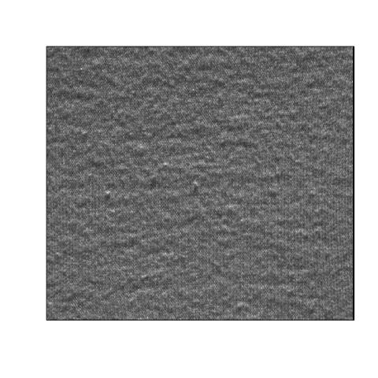
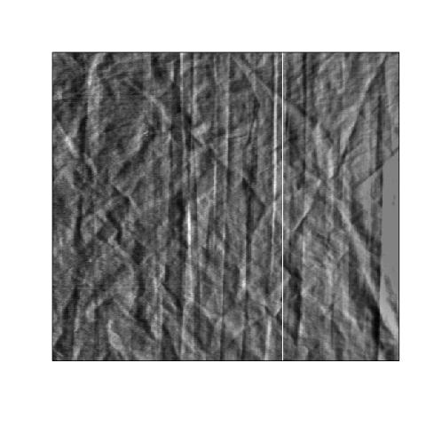
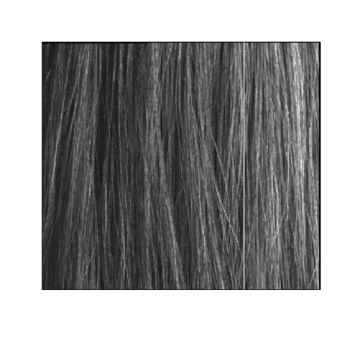
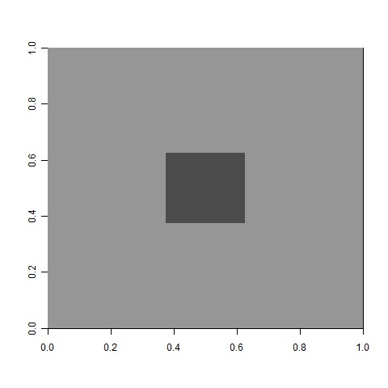

::: article
# Introduction

This paper provides an introduction to the
[***LS2Wstat***](https://CRAN.R-project.org/package=LS2Wstat) package
[@LS2Wstat], developed to implement recent statistical methodology for
the analysis of (greyscale) textured images. Texture analysis is a
branch of image processing concerned with studying the variation in an
image surface; this variation describes the physical properties of an
object of interest. The key applications in this field, namely
discrimination, classification and segmentation, are often dependent on
assumptions relating to the second-order structure (variance properties)
of an image. In particular many techniques commonly assume that images
possess the property of spatial stationarity [@gonzalez01:digital].
However, for images arising in practice this assumption is often not
realistic, i.e. typically the second-order structure of an image varies
across location. It is thus important to test this assumption of
stationarity before performing further image analysis. See
Figure [1](#fig:textures) for examples of textured images. For a
comprehensive introduction to texture analysis, see [@bishop06:pattern]
or [@petrou06:image].

<figure id="fig:textures">
<p></p>
<figcaption>Figure 1: <span id="fig:textures"
label="fig:textures"></span> Examples of textured images: fabric,
creased material and hair <span class="citation"
data-cites="eckley11:ls2wpackage">(Eckley and Nason 2013, available from
the R package <a href="https://CRAN.R-project.org/package=LS2W"
role="doc-biblioref"><strong><em>LS2W</em></strong></a>;)</span>.</figcaption>
</figure>

Recently, [@taylor13:a] proposed a test of spatial stationarity founded
on the *locally stationary two-dimensional wavelet* (LS2W) modelling
approach of [@eckley10:locally]. The LS2W modelling approach provides a
location-based decomposition of the spectral structure of an image. The
$Bootstat_{LS2W}$ test proposed by [@taylor13:a] uses a statistic based
on an estimate of the process variance within a hypothesis testing
framework, employing bootstrap resampling under the null hypothesis
assumption of stationarity to assess its significance.

Given a test of spatial stationarity for random fields, it is natural to
consider how this might be usefully applied within a problem such as
texture segmentation. The ability to determine non-stationarity and the
presence of localised textured regions within images is important in a
broad range of scientific and industrial applications, including product
evaluation or quality control purposes. Possible areas of use for the
methods described in this article include identifying uneven wear in
fabrics [@chan00:fabric; @taylor13:a] and defect detection on the
surface of industrial components [@wiltschi00:an; @bradley01:surface] or
natural products [@funck03:image; @polzleitner03:quality]. For a review
of texture segmentation, see [@pal93:a].

Readily available implementations for stationarity assessment have, up
until now, been restricted to the time series setting; examples of such
software in this context include the R add-on packages
[***urca***](https://CRAN.R-project.org/package=urca)
[@pfaff13:urca2; @pfaff13:urca],
[***CADFtest***](https://CRAN.R-project.org/package=CADFtest)
[@lupi14:CADFtest] and
[***locits***](https://CRAN.R-project.org/package=locits)
[@nason13:locits; @nason13:locits2].

Below we describe the package ***LS2Wstat***  which implements the
spatial test of stationarity proposed by [@taylor13:a]. The package has
been developed in R and makes use of several functions within the
***LS2W*** package [@eckley11:ls2w; @eckley11:ls2wpackage]. The article
is structured as follows. We begin by describing details of simulation
of LS2W and other processes. An overview of the $Bootstat_{LS2W}$ test
of stationarity is then given, focussing in particular on the function
`TOS2D`. We then illustrate the application of the test on both
simulated and real texture images. Finally, the article concludes by
describing how the algorithm might be embedded within a quadtree image
splitting procedure to identify regions of texture homogeneity within a
multi-textured image.

## Simulating textured images with ***LS2Wstat*** {#sec:ls2wsim}

Before describing the implementation of the work proposed in
[@taylor13:a], we first explain how to generate candidate textured
images using the ***LS2Wstat*** package. Several different spatially
stationary and non-stationary random fields can be generated with the
`simTexture` function. See the package help file for full details of the
processes available.

To demonstrate the ***LS2Wstat*** implementation, throughout this
article we consider a realisation of a white noise process with a
subregion of random Normal deviates in its centre with a standard
deviation of 1.6. This simulated texture type is called `NS5`, and is
one of several textures which can be simulated from the package. In
particular, we consider an image of dimension $512\times 512$ with a
central region that is a quarter of the image, i.e. a dimension size of
$128\times 128$. This can be obtained as follows:

``` r
> library("LS2Wstat")
> set.seed(1)
> X <- simTexture(n = 512, K = 1, imtype = "NS5", sd = 1.6, prop = 0.25)[[1]]
> image(plotmtx(X), col = grey(255:0/256))
```

The `simTexture` function returns a list of length `K` with each list
entry being a matrix representing an image of dimension `n` $\times$ `n`
with the chosen spectral structure. In this case, since `K = 1`, a list
of length 1 is returned. The simulated image `X` is shown in
Figure [2](#fig:image1). Note in particular that visually, one can
discern that the image consists of two subtly different texture types.
Firstly, the centre of the image has one particular form of second order
structure. The second texture structure can be seen in the remainder of
the image. Throughout the rest of this article we shall apply the
approach of [@taylor13:a] to this image.

![Figure 2: []{#fig:image1 label="fig:image1"} An example of a textured
image (`NS5`) simulated with the `simTexture`
function.](NS4q512j.jpg){#fig:image1 width="45.0%" alt="graphic without alt text"}

# Testing the spatial stationarity of images {#sec:bootstat}

We now briefly introduce the LS2W random field model of
[@eckley10:locally] together with some associated notation, before
describing the implementation of the test of stationarity proposed in
[@taylor13:a]. For an accessible introduction to wavelets, please see
[@prasad97:wavelet], [@vidakovic99:statistical] or [@nason08:wavelet].

The LS2W process model is defined by

$$\label{eq:ls2wproc}  
X_{\mathbf{r}} = \sum_{l} \sum_{j=1}^{\infty}\sum_{\mathbf{u}} w^{l}_{j,\mathbf{u}}\psi^{l}_{j,\mathbf{u}}(\mathbf{r})\xi^{l}_{j,\mathbf{u}} \, ,   (\#eq:ls2wproc)$$

for directions $l=h, v \mbox{~or~} d$ and spatial locations
$\mathbf{r}$, where $\{\xi^l_{j, \mathbf{u}}\}$ is a zero-mean random
orthonormal increment sequence; $\{\psi^l_{j,\mathbf{u}}\}$ is a set of
discrete nondecimated wavelets and $\{w^l_{j,\mathbf{u}} \}$ is a
collection of amplitudes, constrained to vary slowly over locations of
an image [@eckley10:locally]. In the above definition, we assume the
image is of dyadic dimension, i.e. we have $\mathbf{r}=(r,s)$ with
$r, s\in\{1,\dots,2^J\}$ and where $J$ is the coarsest observed scale.

[@eckley10:locally] also define the *local wavelet spectrum* (LWS)
associated with an LS2W process. The LWS for a given location
$\mathbf{z}=\left(\frac{r}{2^J},\frac{s}{2^J}\right)\in (0,1)^2$, at
scale $j$ in direction $l$ is
$S^l_j(\mathbf{z})\approx w^l_j(\mathbf{u}/\mathbf{R})^2$. The LWS
provides a decomposition of the process variance at (rescaled) locations
$\mathbf{z}$, directions $l$, and wavelet scales $j$. In practice the
LWS is usually unknown and so needs to be estimated [see
@eckley10:locally for details]. Spectral estimation using the LS2W model
is implemented in R in the add-on package ***LS2W***
[@eckley11:ls2wpackage]. The ***LS2Wstat*** routines described below
thus have a dependence on some functions from the ***LS2W*** package.

## A test of stationarity for LS2W processes

Next we turn to describe the implementation of a test of stationarity
within the ***LS2Wstat*** package. We focus on describing the
$Bootstat_{LS2W}$ approach implemented in the ***LS2Wstat*** package,
referring the interested reader to [@taylor13:a] for details of other
tests which might be employed. Throughout this section let us assume
that we have some image $X_{\mathbf{r}}$ (as in
Figure [2](#fig:image1)), whose second-order structure we wish to test
for spatial stationarity. We assume that $X$ is an LS2W process with
associated unknown spectrum, $S_{j}^{\ell}$ for $j=1,\ldots,J$ and
$\ell=v$, $h$ or $d$. Since the model in \@ref(eq:ls2wproc) assumes the
process has zero mean, if necessary the image can be detrended. This can
be done in R, for example, by using the core ***stats*** package
function `medpolish`, which implements Tukey's median polish technique
[@tukey77:exploratory].

Under the null hypothesis of stationarity, the wavelet spectrum will be
constant across location for each scale and direction. Motivated by this
fact [@taylor13:a] formulate a hypothesis test for the stationarity of
the image $X_{\mathbf{r}}$ with
$$\begin{aligned}
H_0 : & \ S_{j}^{\ell}(\mathbf{z}) \mbox{ is constant across $\mathbf{z}$ for all $j$ and $\ell$}, \\
H_A : & \ S_{j}^{\ell}(\mathbf{z}) \mbox{ is not constant across $\mathbf{z}$ for some $j$ or $\ell$}. 
\end{aligned}$$
Hence, a test statistic for the hypothesis should measure how much the
wavelet spectrum for an observed image differs from constancy.
[@taylor13:a] suggest using the average scale-direction spectral
variance as a test statistic to measure the degree of non-stationary
within an image, where the variance is taken over pixel locations, that
is:

$$\label{eq:tos}
 T\left\{ \hat{S}_j^{\ell}(\mathbf{z})\right\} = \frac{1}{3J}\sum_{\ell} \sum_{j=1}^{J} \mbox{var}_{\mathbf{u}}\left( \hat{S}_{j,\mathbf{u}}^{\ell}\right).   (\#eq:tos)$$

In practice this statistic is computed based on an (unbiased) estimate
of the local wavelet spectrum, produced by the ***LS2W*** function
`cddews` (see the documentation in ***LS2W*** for details on optional
arguments to this function). For the (square) image `X`, the test
statistic is calculated using the function `avespecvar` as follows:

``` r
> TSvalue <- avespecvar(cddews(X, smooth = FALSE))
> TSvalue
[1] 0.2044345
```

Since the spectrum characterises the second-order structure of the
observed random field (and hence its stationarity properties),
[@taylor13:a] suggest determining the p-value of the hypothesis test by
performing parametric bootstrapping. This corresponds to sampling LS2W
processes assuming stationarity under the null hypothesis, and comparing
the observed test statistic to that of the simulated LS2W processes
under stationarity. For pseudo-code of this algorithm, please see
Algorithm [1](#alg:bootstat).

<figure id="alg:bootstat">
<h4 id="bootstatmboxscriptsize-ls2w">Bootstat<span
class="math inline">${\mbox{{\scriptsize {LS2W}}}}$</span></h4>
<ol>
<li><p>Compute the estimate of the LWS for the observed image, <span
class="math inline"><em>Ŝ</em><sub><em>j</em></sub><sup><em>l</em></sup>(<strong>z</strong>)</span>.</p></li>
<li><p>Evaluate <span class="math inline"><em>T</em><sub></sub></span>
(Equation ) on the observed image, call this value <span
class="math inline"><em>T</em><sub></sub><sup><em>o</em><em>b</em><em>s</em></sup></span>.</p></li>
<li><p>Compute the pixel average stationary spectrum <span
class="math inline"><em>S̃</em><sub><em>j</em></sub><sup><em>l</em></sup></span>
by taking the average of spectrum values for each scale and
direction.</p></li>
<li><p><span><strong>Iterate</strong></span> for <span
class="math inline"><em>i</em></span> in 1 to <span
class="math inline"><em>B</em></span> bootstraps:</p>
<ol>
<li><p>Simulate <span
class="math inline"><em>X</em><sub><strong>r</strong></sub><sup>(<em>i</em>)</sup></span>
from the stationary <span>LS2W</span> model using squared amplitudes
given by <span
class="math inline"><em>S̃</em><sub><em>j</em></sub><sup><em>l</em></sup></span>
and Gaussian process innovations.</p></li>
<li><p>Compute the test statistic <span
class="math inline"><em>T</em><sub></sub></span> on the simulated
realisation, call this value <span
class="math inline"><em>T</em><sub></sub><sup>(<em>i</em>)</sup></span>.</p></li>
</ol></li>
<li><p>Compute the p-value for the test as <span
class="math inline">$p=\frac{1+ \#\left\{\, T_{}^{\mathit{obs}}\,\leq\,
T_{}^{(i)}\, \right\}}{B+1}.$</span></p></li>
</ol>

<figcaption>Algorithm 1: The bootstrap algorithm for testing the
stationarity of locally stationary images.</figcaption>
</figure>

This bootstrap algorithm is performed with the ***LS2Wstat*** function
`TOS2D`. The function has arguments:

image

:   The image you want to analyse.

detrend

:   A binary value indicating whether the image should be detrended
    before applying the bootstrap test. If set to `TRUE`, the image is
    detrended using Tukey's median polish method.

nsamples

:   The number of bootstrap simulations to carry out. This is the value
    $B$ in the pseudocode given above. By default this takes the value
    100.

theTS

:   This specifies the test statistic function to be used within the
    testing procedure to measure non-stationarity. The test statistic
    should be based on the local wavelet spectrum and by default is the
    function `avespecvar` representing the statistic \@ref(eq:tos).

verbose

:   A binary value indicating whether informative messages should be
    printed.

\...

:   Any optional arguments to be passed to the ***LS2W*** function
    `cddews`. See the documentation for the `cddews` function for more
    details.

Note that `TOS2D` uses the ***LS2W*** process simulation function
`LS2Wsim` from the ***LS2W*** R package to simulate bootstrap
realizations under the null hypothesis. The output of `TOS2D` is a list
object of class `"TOS2D"`, which describes pertinent quantities
associated with the bootstrap test of stationarity. The object contains
the following components:

data.name

:   The name of the image tested for stationarity.

samples

:   A vector of length `nsamples + 1` containing each of the test
    statistics calculated in the bootstrap test. The first element of
    the vector is the value of the test statistic calculated for the
    original image itself.

statistic

:   The statistic used in the test.

p.value

:   The bootstrap p-value associated with the test.

In particular, the object returns the measure of spectral constancy in
the entry `statistic`, together with the p-value associated with the
stationarity test (in the `p.value` component).

An example of the function call is

``` r
  > Xbstest <- TOS2D(X, nsamples = 100) 
```

Note that the p-value returned within the `"TOS2D"` object is computed
using the utility function `getpval`, which returns the parametric
bootstrap p-value for the test from the bootstrap test statistics
provided by counting those test statistic values less than
$T^{\mathit{obs}}$ [see @davison99:bootstrap for more details]. In other
words, the `p.value` component is obtained by the following call:

``` r
  > pval <- getpval(Xbstest$samples) 
  Observed bootstrap is  0.204
  p-value is  0.00990099 
```

This p-value can then be used to assess the stationarity of a textured
image region.

Information on the `"TOS2D"` class object can be obtained using the
`print` or `summary` S3 methods for this class. For example, using the
summary method, one would obtain

``` r
  > summary(Xbstest)
  
  2D bootstrap test of stationarity
        object of class TOS2D
  ----------------------------------
  
  summary
  =======
  data: X 
  Observed test statistic: 0.204 
  bootstrap p-value: 0.01 
```

Alternatively, the `print` method for the `"TOS2D"` class prints more
information about the `Xbstest` object. Note that the function
internally calls the `summary` method for `"TOS2D"` objects:

``` r
  2D bootstrap test of stationarity
        object of class TOS2D
  ----------------------------------
  
  summary
  =======
  data: X 
  Observed test statistic: 0.204
  bootstrap p-value: 0.01
  
  Number of bootstrap realizations: 100 
  spectral statistic used: avespecvar 
```

## Other textured images

To demonstrate the test of stationarity further, we now provide some
other textured image examples. Firstly, we consider a *Haar wavelet
random field* with a diagonal texture, an example of a LS2W process as
described in [@eckley10:locally]. The realisation of the process (shown
in Figure [3](#fig:s5)) is simulated using the `simTexture` function
with the command:

``` r
  > Haarimage <- simTexture(512, K = 1, imtype = "S5")[[1]]
```

![Figure 3: []{#fig:s5 label="fig:s5"} A realisation of a stationary
LS2W process, `Haarimage`, with a diagonal texture.](s5.jpg){#fig:s5
width="49.0%" alt="graphic without alt text"}

The test of stationarity of [@taylor13:a] performed on the image
`Haarimage` with the function `TOS2D` reveals that the image is
spatially stationary as expected, with a high p-value associated to the
test.

``` r
> Haarimtest <- TOS2D(Haarimage, smooth = FALSE, nsamples = 100)
> summary(Haarimtest)

2D bootstrap test of stationarity
      object of class TOS2D
----------------------------------

summary
=======
data: Haarimage 
Observed test statistic: 0.631 
bootstrap p-value: 0.673

Number of bootstrap realizations: 100 
spectral statistic used: avespecvar 
```

As another example of a textured image, we construct an image montage
using two of the textures shown in Figure [1](#fig:textures) from the
package ***LS2W***. The montage, `montage1`, is shown in
Figure [4](#fig:AB).

![Figure 4: []{#fig:AB label="fig:AB"} An example of an image montage,
`montage1`, using two of the textures from
Figure [1](#fig:textures).](AB.jpg){#fig:AB width="49.0%" alt="graphic without alt text"}

Note that since this image may not have zero mean as assumed by the LS2W
model \@ref(eq:ls2wproc), we detrend the montage first using the
`medpolish` function in the ***stats*** package.

``` r
> data(textures)
> montage1 <- cbind(A[1:512, 1:256], B[, 1:256])
> montage1zm <- medpolish(montage1)$residuals
```

The `TOS2D` test indicates that the texture montage is non-stationary:

``` r
> montage1zmtest <- TOS2D(montage1zm, smooth = FALSE, nsamples = 100)
> summary(montage1zmtest)

2D bootstrap test of stationarity
      object of class TOS2D
----------------------------------

summary
=======
data: montage1zm 
Observed test statistic: 0 
bootstrap p-value: 0.01 

Number of bootstrap realizations: 100 
spectral statistic used: avespecvar 
```

# Identifying areas of homogeneous texture using the bootstrap test of stationarity {#sec:segment}

In this section we describe embedding a test of stationarity into a
quadtree algorithm to identify regions of spatial homogeneity within a
textured image. This segmentation approach is similar in spirit to,
e.g., [@spann85:a] or [@pal87:segmentation] which use homogeneity
measures within a quadtree structure. We first give details of the
quadtree implementation, and subsequently describe functions to aid
illustration of quadtree decompositions.

## A quadtree algorithm implementation {#sec:qt}

In essence, a region splitting algorithm recursively subdivides an input
image into smaller regions, with the subdivision decisions being based
on some statistical criterion. More specifically, in a *quadtree
representation*, at each stage a (sub)image is divided into its four
subquadrants if the criterion is not satisfied [see e.g.,
@sonka99:image]. The statistical criterion we use is spatial
homogeneity, that is, a quadrant is further divided if it is considered
as non-stationary by the $Bootstat_{LS2W}$ test. In practice, the
quadtree implementation in ***LS2Wstat*** continues until all subregions
are considered as stationary, or until the subregions reach a particular
minimal dimension. The motivation for this is to ensure that we obtain
statistically meaningful decisions using the stationarity test by not
allowing too small a testing sub-image. This procedure segments an image
into regions of spatial stationarity. The quadtree algorithm is
summarised in Algorithm [2](#alg:qt).
<figure id="alg:qt">
<h4 id="quadtree-decomposition">Quadtree decomposition</h4>
<ul>
<li><p>For an input image <span class="math inline"><em>X</em></span>:
Use the <span
class="math inline"><em>B</em><em>o</em><em>o</em><em>t</em><em>s</em><em>t</em><em>a</em><em>t</em><sub><em>L</em><em>S</em>2<em>W</em></sub></span> test
to assess whether <span class="math inline"><em>X</em></span> is
second-order stationary. If stationary, stop. If not,</p>
<ol>
<li><p>Divide the image into four quadrants.</p></li>
<li><p>For each quadrant, assess its stationarity with the <span
class="math inline"><em>B</em><em>o</em><em>o</em><em>t</em><em>s</em><em>t</em><em>a</em><em>t</em><sub><em>L</em><em>S</em>2<em>W</em></sub></span> test.</p></li>
<li><p>For each quadrant assessed as non-stationary, recursively repeat
steps 1–2, until the minimum testing region is reached or until all
sub-images are judged to be stationary.</p></li>
</ol></li>
</ul>

<figcaption>Algorithm 2: The quadtree algorithm for segmenting an image
into regions of spatial stationarity. </figcaption>
</figure>

Each image is further split if deemed non-stationary, which is
determined by a test of stationarity such as `TOS2D`. After the first
subdivison of an image, each sub-image is of size $n/2 \times n/2$. The
sizes of the regions halve in size at each progressive division but
increase in number. The R function in ***LS2Wstat*** which creates the
quadtree structure described in Algorithm [2](#alg:qt) is `imageQT`. The
function has inputs:

image

:   The image to be decomposed with the quadtree algorithm.

test

:   A function for assessing regions of spatial homogeneity, for example
    `TOS2D`.

minsize

:   The testing size of sub-images below which we should not apply the
    function `test`.

alpha

:   The significance level of the $Bootstat_{LS2W}$ test, with which to
    assess spatial stationarity of textured regions.

\...

:   Any other optional arguments to `test`.

As an illustration of using the `imageQT` function, consider the code
below to decompose the (non-stationary) input image `X`. We use the
function `TOS2D` to assess the regions of spatial homogeneity although
the `imageQT` function allows other functions to be supplied.

``` r
  > QTdecX <- imageQT(X, test = TOS2D, nsamples = 100)
```

The output of the `imageQT` function is a list object of class
`"imageQT"` with components:

indl

:   The index representation of the non-stationary images in the
    quadtree decomposition.

resl

:   The results of the stationarity testing (from the `test` argument)
    during the quadtree decomposition. The results giving `FALSE`
    correspond to those non-stationary sub-images contained in the
    `indl` component and the results giving `TRUE` correspond to the
    stationary sub-images, i.e. those contained in the `indS` component.

indS

:   The index representation of the stationary images in the quadtree
    decomposition.

This particular way of splitting an image has a convenient indexing
representation to identify the position of subregions within an image.
If a (sub)image is subdivided into quadrants, we assign it a base 4
label as follows: 0 -- top-left quadrant; 1 -- bottom-left quadrant; 2
-- top-right quadrant; 3 -- bottom-right quadrant. By continuing in this
manner, we can assign an index to each tested subregion, with the number
of digits in the index indicating how many times its parent images have
been subdivided from the "root" of the tree (the original image). This
indexing is illustrated for the quadtree decomposition given in the
example in Figure [5](#fig:qt).

![Figure 5: []{#fig:qt label="fig:qt"} An example of a quadtree
decomposition. The location of the sub-images in the decomposition are
described by the indexing system described in the
text.](Segmentation2.jpg){#fig:qt width="49.0%" alt="graphic without alt text"}

Examining the quadtree decomposition of the image `X` using the `print`
S3 method for the `"imageQT"` class, we have

``` r
  > print(QTdecX)
  
  2D quadtree decomposition
   object of class imageQT
  -------------------------
  
  summary
  =======
  data: X 
  Indices of non-stationary sub-images:
  "0" "1" "2" "3" "03" "12" "21" "30"
  
  Indices of stationary sub-images:
  "00" "01" "02" "10" "11" "13" "20" "22" "23" "31" "32" "33" "030" "031" "032" "033" 
  "120" "121" "122" "123" "210" "211" "212" "213" "300" "301" "302" "303"
  
  minimum testing region: 64
```

The `resl` component gives the results of the test of stationarity for
all sub-images tested during the quadtree procedure, reporting `FALSE`
for the non-stationary sub-images and `TRUE` for the stationary ones:

``` r
  > QTdecX$resl
  [1] FALSE
  [[2]]
  [1] FALSE FALSE FALSE FALSE
  [[3]]
   [1] TRUE  TRUE  TRUE FALSE  TRUE  TRUE FALSE  TRUE  TRUE FALSE  TRUE  TRUE  
  [13] FALSE  TRUE  TRUE  TRUE
  [[4]]
   [1] TRUE TRUE TRUE TRUE TRUE TRUE TRUE TRUE TRUE TRUE TRUE TRUE TRUE TRUE TRUE 
  [16] TRUE
```

## Plotting a quadtree decomposition

By performing the quadtree algorithm given in Algorithm [2](#alg:qt), it
is possible to decompose images into regions indicating regional
stationarity. Note that if a texture discrimination procedure is used to
classify the output from the stationarity quadtree algorithm, the image
segmentation method can be seen as a *split and merge* technique.

Suppose we have performed the quadtree decomposition. The
***LS2Wstat*** package includes an S3 `plot` method for `"imageQT"`
objects to plot the output for the `"imageQT"` class and optionally a
classification of those textured regions. If the classification output
is plotted (`class = TRUE`), each textured region is uniquely coloured
according to its texture group. The function has arguments:

x

:   A quadtree decomposition object, such as output from `imageQT`.

cires

:   Vector of class labels associated to the subimages produced by the
    quadtree decomposition.

unclassval

:   A value for any unclassified values in a quadtree decomposition.

class

:   A Boolean value indicating whether to plot the classification of the
    quadtree subimages.

QT

:   A Boolean value indicating whether to plot the quadtree
    decomposition.

We now illustrate the use of this function with the example given in
Figure [2](#fig:image1). Suppose the textured regions identified by the
quadtree algorithm in the `QTdecX` object have been classified according
to some texture discrimination procedure. For the purposes of this
example, we suppose that the 28 regions of stationarity in `QTdecX` (see
Figure [5](#fig:qt)) have been classified as coming from two groups
according to the labels

``` r
  > texclass <- c(rep(1, times = 15), rep(c(2, 1, 1), times = 4), 1)
  > texclass
   [1] 1 1 1 1 1 1 1 1 1 1 1 1 1 1 1 2 1 1 2 1 1 2 1 1 2 1 1 1
```

Using the output from the quadtree technique (`QTdecX`) and the texture
classification vector `texclass`, we can use the quadtree plotting
function for `"imageQT"` objects as follows:

``` r
  > plot(QTdecX, texclass, class = TRUE, QT = TRUE)
  > plot(QTdecX, texclass, class = TRUE, QT = FALSE)
```

The quadtree decomposition from this example is shown in
Figure [[fig:CT1]](#fig:CT1)a; the same decomposition is shown together
with the texture classification in Figure [6](#fig:CI1)b.

<figure id="fig:CI1">
<p> <span
id="fig:CI1" label="fig:CI1"></span></p>
<figcaption>Figure 6: An example of a quad-tree decomposition using
<code>imageQT</code>, together with an assumed sub-image texture
classification.</figcaption>
</figure>

We also consider an image montage using the textures from the package
***LS2W***. The montage `Y` is shown in Figure [7](#fig:texmix). Prior
to performing the quadtree decomposition, we detrend the image.

``` r
  > data(textures)
  > Y <- cbind(A[1:512, 1:256], rbind(B[1:256, 1:256], C[1:256, 1:256]))
  > Yzm <- medpolish(Y)$residuals
```

![Figure 7: []{#fig:texmix label="fig:texmix"} An example of an image
montage, `Y`, using the textures from
Figure [1](#fig:textures).](texmix.jpg){#fig:texmix width="49.0%" alt="graphic without alt text"}

Similarly to above, we can now perform a quadtree decomposition of the
image `Y`:

``` r
  > QTdecYzm <- imageQT(Yzm, test = TOS2D, nsamples = 100)
  > print(QTdecYzm)
  
  2D quadtree decomposition
   object of class imageQT
  -------------------------
  
  summary
  =======
  data: Yzm 
  Indices of non-stationary sub-images:
  
  Indices of stationary sub-images:
  "0" "1" "2" "3" 
  
  minimum testing region: 64
```

The function `imageQT` initially assesses that the image is indeed
non-stationary, and then proceeds to analyse sub-images of the montage.
The algorithm stops the quadtree decomposition after the first
decomposition level, since it judges all quadrants of the image to be
stationary, described by the indices \"0\", \"1\", \"2\", and \"3\".

# Summary {#sec:concs}

In this article we have described the ***LS2Wstat*** package, which
implements some recent methodology for image stationarity testing
[@taylor13:a]. Our algorithm is most useful as a test of homogeneity in
textures which are visually difficult to assess. We have also extended
its potential use by embedding it within a quadtree implementation,
allowing assessment of potentially multi-textured images. The
implementation is demonstrated using simulated and real textures
throughout the paper.

# Acknowledgements

We thank Aimée Gott for suggestions on an early version of the package.
We would also like to thank Heather Turner, two anonymous referees and
the Editor for helpful comments which have resulted in an improved
manuscript and package.
:::
