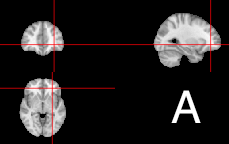
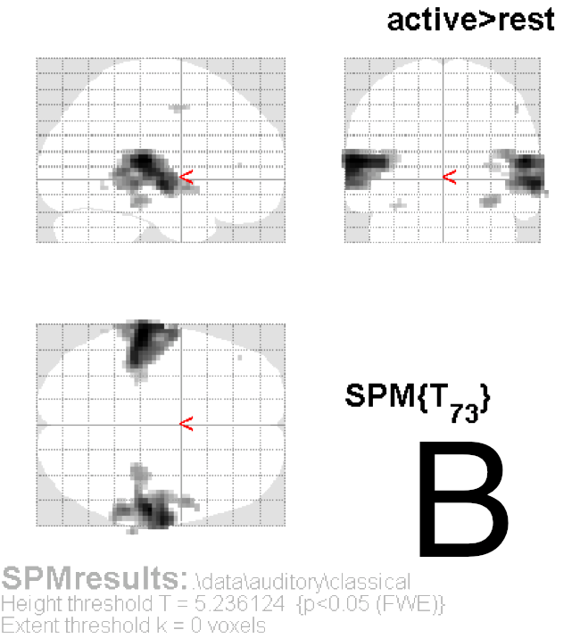
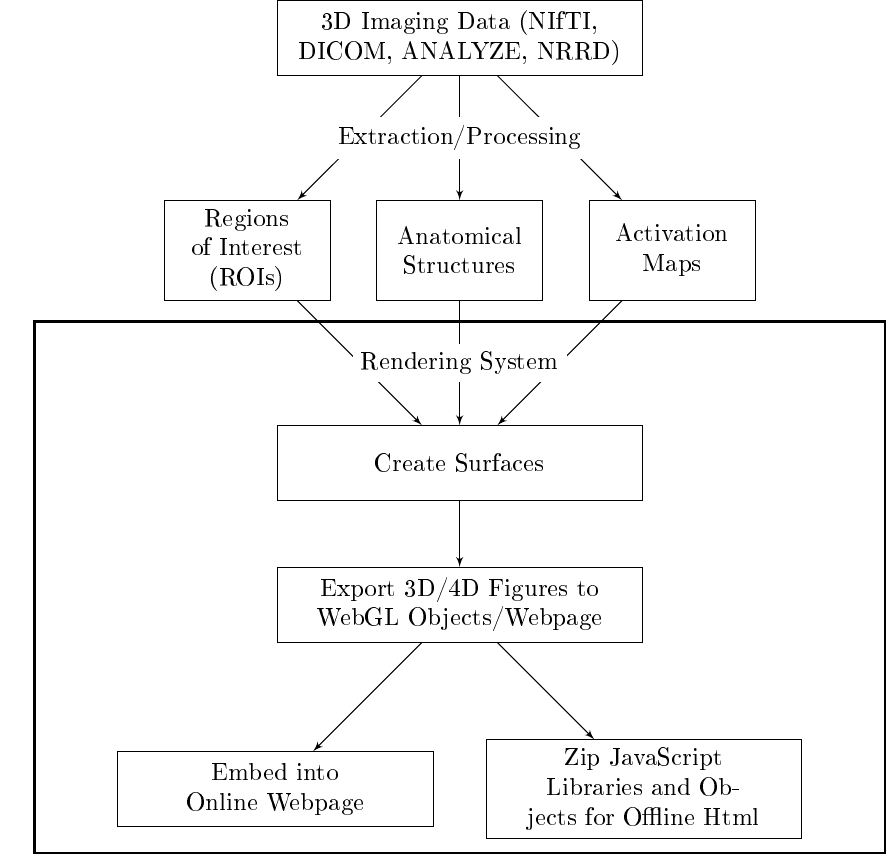

::: article
# Introduction {#sec:intro}

We provide a set of software tools that produce interactive
3-dimensional (3D) and 4-dimensional (4D) figures using currently
available open-source software. These images can be embedded into
webpages (<http://bit.ly/1kEJH6q>), creating an environment where users
can interact with the images without additional software or expertise.
We present two examples of applications of these tools using
neuroimaging data: 1) a 3D example: displaying hyper-intense white
matter regions in a template image; and 2) a 4D example: tracking the
lesion formation process over time via 3D segmentation.

Many applications display true 3D data as single 2-dimensional (2D)
cross-sections, a series of cross-sections, or a projection of the data
onto 2D space. In neuroimaging data, for example, the current standard
is to present spatial results as a set of 2D figures, or slices.
Figure [1](#fig:ortho) displays the magnetic resonance image (MRI) of a
normal brain and includes three planar views: axial (vertical plane
dividing the body into front and back), sagittal (vertical plane
dividing the brain into right and left), and coronal (horizontal plane
dividing the brain into top and bottom). Other types of presentations
can be employed, such as lightbox views where all slices of the brain
are presented in series, single plane views, 3D surface images, or
maximum intensity projections onto transparent cross-sectional views
(known as "glass brains", Figure [1](#fig:ortho)B). We wish to improve
on these data representations by using truly 3D figures.

<figure id="fig:ortho">
<p></p>
<figcaption>Figure 1: Example of an othrographic representation of the
brain (A), where the brain is displayed axially (bottom), coronally (top
left), and sagitally (top right). Cross-hairs (red) are shown to orient
the user to how certain areas fall in each dimension. Figures using
maximum intensity projections show a similar set of 3 transparent views,
known as “glass brains”, such as (B) from the SPM8 manual, showing how
certain information (in this case activation) corresponds spatially .
Example of an othrographic representation of the brain, where the brain
is displayed axially (bottom), coronally (top left), and sagittally (top
right)</figcaption>
</figure>

The goal of these multi-panel 2D figures is to allow the user to: 1)
orient themselves spatially; 2) understand the local brain features or
pathology in relationship to known and observable biological landmarks;
and 3) provide qualitative or quantitative assessments of the image.
While these approaches provide important information and are extensively
used in practice, they also have innate limitations. For example, the
slices presented must be chosen by the presenter/author, which may not
be representative of all areas of the brain. Most importantly though,
the true 3D structure of the data is not exploited and 4D interactive
visualizations are difficult to implement.

With the advancement of 3D rendering techniques and web-based tools, the
ability to provide more intuitive and informative figures is now
possible. People are not yet taking full advantage of the ability to
present true, interactive 3D figures. This may be because 3D figures are
not currently accepted for publication, a fact that is likely to change
with the generational shift to digital journal print. Therefore, the
purpose of this article is to inform the reader how to create and use
interactive 3D figures for exploration, presentation, and
published-article figures.

We will be providing 1) the characteristics of a good 4D interactive
figure, 2) a framework for creating these figures in R, 3) examples of
creating figures within this framework using R, and 4) description of
practical applications for these figures. The examples in the article
are brain images, but these concepts and methods can be used for general
3D surfaces.

## What makes a good 4D interactive figure?

In order to determine software necessary for 3D figure generation, we
discuss properties of the figures and the process that are required for
their generation. We argue that for the interactive capabilities of 3D
figures to have added value over current presentation methods they
should have the following characteristics:

-   Rotation/Translation: allows the user to see objects from multiple
    angles and positions.

-   Digital zoom: enables multilayer display of information from minute
    details to coarser anatomy.

-   Color: allows for proper contrast between structures, and also the
    ability to highlight regions of interest.

-   Transparency: provides the ability to adaptively explore the
    changing opacity of cortical surface as well as sub-cortical deep
    structures.

-   Addition/Removal of structures: allows users to contrast one surface
    with another by adding or removing an individual surface to see how
    the surfaces overlap and compare spatially.

These capabilities provide users the ability to more accurately view
differences between populations, image processing pipelines, and
segmentation algorithms. With the addition and removal of surfaces,
users can also view changes in brain structures longitudinally in 4D.

We refer to 4D viewing as observing 3D objects over another domain other
than space, such as time. The user interacts over this domain while
keeping the brain in the same 3D space. For example, characterizing the
size and shape changes of the hippocampus over time within a person.
Similarly, activation maps derived from a functional MRI (fMRI) task can
be calculated for a diseased group of people and a control group. We can
present the area of activation from the control group and switch to the
map for a diseased group for comparison. Lastly, we have used these
techniques to determine how a hemorrhage in the brain changes over
time---pre and post treatment---depicting where the treatment had
removed hemorrhage.

Even with these capabilities, without quick and easy usability,
sophisticated plotting tools, such as those described here, will not be
used in practice. Therefore, the publishing platform needs to render
surfaces very fast and be easy to use and manipulate. Publishing and
presenting such figures in a user-friendly interface that does not
require third-party software is another essential part of visualization.

## Software and tools

Many rendering systems, or analysis tools with rendering capabilities
exist, such as FreeSurfer (<http://surfer.nmr.mgh.harvard.edu/>),
ParaView [@paraview], MIPAV [@mipav], 3D Slicer [@pieper_3d_2004], and
[*rgl*](https://CRAN.R-project.org/package=rgl) [@rgl] in R. We will
focus on the R package *rgl* as it has the desired characteristics
outlined above and can easily export images to the web with a small
amount of setup and knowledge of the system.

The R programming language is becoming more widely used, with expanding
areas of research and capabilities. *rgl* is an R implementation of the
graphics programming interface Open Graphics Library [OpenGL; @opengl],
that allows for 3D rendering. These rendered objects can be
interactively explored on screen. We prefer using R because it has many
packages that read, analyze, and display neuroimaging data (@oro.nifti
[@fmri; @AnalyzeFMRI], see also the CRAN Task View on Medical Image
Analysis; @taskview), is multi-platform, free, and open-source with a
large user and developer community. As a statistical programming
language, it contains state-of-the-art statistical tools with a growing
number of packages for additional analysis, and the capability to create
highly customizable figures. Our framework uses *rgl* to generate the
figures and export these figures as webpages using WebGL, the web
implementation of OpenGL. Using these objects and the X Toolkit (XTK;
<https://github.com/xtk/X>), one can create customizable webpages with
versatile user-interaction capabilities. Moreover, R also has integrated
tools such as [*knitr*](https://CRAN.R-project.org/package=knitr) and
[*Sweave*](https://CRAN.R-project.org/package=Sweave) that allow the
user to completely reproduce a figure and analysis, and
[*slidify*](https://CRAN.R-project.org/package=slidify) to create HTML5
slide decks with these figures embedded [@knitr; @sweave; @slidify].

@levine presented a way to embed 3D objects from *rgl* directly into a
Portable Document Format (PDF) document, along with additional
applications [@asymptote]. Though this option is promising, we have
found that large images, such as Figure [3](#fig:writeWebGL) do not
render quickly and can lag when interacting with them on a laptop and
sometimes crash before rendering even with moderate amounts of memory
(Mac OSX 10.9.2, 16Gb RAM, 2.8GHz Intel i7). Furthermore, all
capabilities mentioned above were not implemented, such as interactively
changing transparency or 4D visualization, and customized control is not
easily implemented in the framework of @levine without learning
additional graphics languages. Some of these are current limitations of
the interactive capabilities within PDF, but the integration of
JavaScript into PDF documents will likely expand on these capabilities
[@story2001techniques]. We acknowledge others have proposed similar
ideas of 3D rendering in R using Virtual Reality Markup Language [VRML;
@vrml]. We chose to focus on WebGL because browsers require VRML viewer
browser plugins and popular browsers (Safari, Google Chrome, Firefox)
can render WebGL without any additional plugins.

Although users may prefer some of the aforementioned systems, we wish to
inform the community about a simple option to create these figures; we
also discuss why they should be more generally used and accepted for
publication.

## Framework

Figure [2](#fig:framework) illustrates our working framework for figure
generation. Briefly, the neuroimaging data is processed and areas of
interest are extracted. Examples include: activation maps from fMRI
studies during tasks, parcellations of cortical and deep structures,
segmentation maps for detection of abnormal tissue, and more general
regions of interest (ROIs). These images are passed into the rendering
system and surfaces are created from either binary masks or thresholds
of the image values. A surface is a collection of vertices that are
connected. A collection of multiple surfaces together will be referred
to as a scene.

<figure id="fig:framework">


<figcaption>Figure 2: Overall workflow of generating 3D or 4D figures
from data. After the raw data has been processed and areas have been
extracted, surfaces can be rendered. We are concerned with the steps
outlined in the large box: creating surfaces and export to the web. The
last branch shows 2 options for export: publishing the figure to the web
or enclosing it in a folder with all other libraries needed for
rendering. The second option allows users to include these zipped
directories as supplementary figures (3D and 4D interactive images are
not currently published by journals). </figcaption>
</figure>

First, the [*misc3d*](https://CRAN.R-project.org/package=misc3d) package
creates 3D contours for the surfaces for rendering [@misc3d]. Once the
surface is created, *rgl* can create and export the scene in two
ways: 1) output all properties of the scene (colors, shading and
lighting, surface orientation) and vertices of the surface directly into
one html file or 2) export the vertices of a surface into a 3D-object
file and separately write the scene properties into the html file.
Option 1 is easier and is our recommendation for exporting 3D images.
This process uses the `writeWebGL` command from the *rgl* package and
creates one html file with an accompanying JavaScript library. An
example of an exported figure is shown in Figure [3](#fig:writeWebGL),
which depicts a 3D rendering of a brain template [@template] and areas
of hyper-intense white matter in WebGL.

One problem with this option is that surfaces in WebGL are limited to
$65535$ vertices, which may be too few for some large figures that are
common in high resolution imaging data. To avoid this, users can
downsample their data to reduce the dimensions or use
`writeWebGL_split`: a simple function to split the data into smaller
structures so that these larger images can be displayed (courtesy of
Duncan Murdoch). This function is located in the
[*brainR*](https://CRAN.R-project.org/package=brainR) package. Although
easily executed, this option is limited in 2 ways: 1) the html file
contains all vertices of a surface; there can be thousands of
vertices---this limits the readability of the html file and 2) it does
not easily allow for adding user control of surfaces to create a 4D
figure.

``` r
require(brainR)

# Template from MNI152 from McGill
template <- readNIfTI(system.file("MNI152_T1_2mm_brain.nii.gz", package = "brainR"), 
                      reorient = FALSE) 

### 4500 - value that empirically value that presented a brain with gyri
### lower values result in a smoother surface
dtemp <- dim(template)
contour3d(template, level = 4500, alpha = 0.1, draw = TRUE)
```

``` r
### this would be the `activation' or surface you want to render 
### - hyper-intense white matter
contour3d(template, level = c(8200, 8250), alpha = c(0.5, 0.8), 
          add = TRUE, color = c("yellow", "red"))
# create text for orientation of right/left 
text3d(x = dtemp[1]/2, y = dtemp[2]/2, z = dtemp[3] * 0.98, text = "Top") 
text3d(x = dtemp[1] * 0.98, y = dtemp[2]/2, z = dtemp[3]/2, text = "Right")

### render this on a webpage and view it!
browseURL(paste("file://", 
          writeWebGL_split(dir =  file.path(tempdir(), "webGL"),  
	  template = system.file("my_template.html", package = "brainR"),
	  width = 500), sep = ""))
```

![Figure 3: Snapshot of a 3D interactive figure exported from R using
writeWebGL. The figure has many of the qualities of a good figure:
transparency, text rendering, colors, and multiple surfaces. The online
web version is located http://bit.ly/QrJqs2 (high-resolution version).
Viewing the page source code illustrates how all points of the surfaces
are outputted directly to html---rendering users unable to easily
replicate the figure without source code. Full code is located at
http://bit.ly/1gE48M1. ](snapshot.png){#fig:writeWebGL width="100%" alt="graphic without alt text"}

Option 2 allows users to export individual objects/surfaces to either
STL (STereoLithography) or Wavefront OBJ files---file formats for 3D
surfaces. XTK renders these individual surfaces, and users interact with
these objects by turning surfaces on or off, changing opacity, or
manipulating any of the surface attributes interactively on the webpage
with JavaScript. This process produces interactive 4D figures, allowing
3D brain structures to be contrasted such as parcellations of the same
brain area under different algorithms or single-subject stroke
segmentations over time.

We have included functions (`write4D` and `write4D.file`) in the
*brainR* package that allow users to export a scene and embed it in html
with basic JavaScript controls. We have included a 4D example of
segmentation of white matter lesions in a patient with multiple
sclerosis (MS) using SubLIME, an automated method for segmenting
enlarging and incident MS lesions [@sublime]. Each surface represents
enlarging lesions compared to the last visit. The rendered html allows
control of the opacity of the brain and to compare which areas of the
brain have lesion enlargements over time (Figure [4](#fig:4D)). This 4D
rendering of new and enlarging MS lesions could be used to monitor the
clinical progression of the disease.

``` r
### Example data courtesy of Daniel Reich 
### Each visit is a binary mask of lesions in the brain
template <- readNIfTI(system.file("MNI152_T1_1mm_brain.nii.gz", 
                      package = "brainR"), reorient = FALSE)
brain <- contour3d(template, level = 4500, alpha = 0.8, draw = FALSE)
imgs <- paste("Visit_", 1:5, ".nii.gz", sep = "") 
files <- sapply(imgs, system.file, package = "brainR")
scene <- list(brain)
## loop through images and threshold masks
nimgs <- length(imgs) # get number of images
cols <- rainbow(nimgs) # set colors
for (iimg in 1:nimgs) {
  mask <- readNIfTI(files[iimg], reorient = FALSE)[,,,1] # read image mask
  ## use 0.99 for level of mask - binary
  activation <- contour3d(mask, level = 0.99, alpha = 1, add = TRUE, 
                          color = cols[iimg], draw = FALSE)  
  ## add these triangles to the list
  scene <- c(scene, list(activation))
}
## make output image names from image names
fnames <- c("brain.stl", gsub(".nii.gz", ".stl", imgs, fixed = TRUE))
outfile <-  "index_4D_stl.html"

## write the html file out with JavaScript checkboxes 
write4D(scene = scene, fnames = fnames, outfile = outfile, standalone = TRUE)
browseURL(outfile)
```

![Figure 4: Example of a 4D Figure: a 3D rendered brain (gray) and areas
of enlarging white matter lesions in a patient with MS over different
followup visits (multiple colors). The checkboxes switch between lesion
enlargements at different followup visits and can display multiple
visits simultaneously. The brain alpha blending slider (bottom left)
allows you to change the opacity of the brain image; this feature can
also be added for each surface. We observe that lesions enlarge at many
different regions over different visits. The interactive version is
located at http://bit.ly/1kEJH6q, and code
http://bit.ly/1kdnWeg.](supp_2_fig_FINAL.png){#fig:4D width="100%" alt="graphic without alt text"}

# Discussion

## Webpages as a medium

Our main proposal is to create interactive 3D and 4D figures that allow
easy manipulation of embedded 3D objects and additional annotations. We
propose export directly to webpages, which makes the figures widely
available, reduces dependence on operating systems, and allows a much
larger community to be able to interact with the data.

Browser interfaces are versatile, flexible, and have large support
communities, but rendering may rely on libraries that are not maintained
by researchers. Thus, their maintenance is not guaranteed, but the
likelihood of maintenance is higher with increased use. The main concern
is to produce figures under JavaScript libraries and R packages that are
popular and therefore more likely to be updated and improved. Also,
including these libraries in the document as supplementary material for
standalone figures allows for authors to guarantee which versions of the
software readers will be using.

Although highly versatile, web-based tools are not browser independent.
Some 3D and 4D interactive figures may be supported on some browsers but
not others and may not be usable on the expanding number of devices,
such as tablets or smart phones. Our current software works with
browsers supporting WebGL and HTML5. Even with these limitations,
webpages as figures are extremely powerful and adaptable and present the
basic avenue for easy-to-use interactive figures.

## Embedding figures into PDF documents

Previous authors have contributed work that allow users to embed 3D
figures directly into PDF documents [@levine; @barnes2013embedding].
While we think this is a useful endeavor for many applications, some of
the capabilities described above are lacking. Another drawback is that
predominantly all rendering must be done within the Adobe Acrobat Reader
[@pdf], as it is the primary PDF reader with 3D capabilities. Also, we
have found that web-based rendering performs much faster than those
within PDF for the dimensionality of points we are plotting. Overall, we
think this system may fully integrate the needs of the end user into one
document, but currently is not optimal for 3D and 4D neuroimaging
figures.

## Practical applications of 3/4D figures

Above, we described how this framework has been used to view a
longitudinal image segmentation in a holistic way for scans of patients
with MS. Other potential applications for this framework are exploratory
data analysis and communication of analysis results. The results from
analysis such as segmentation, thresholding, or any other
surface-generating mechanism can be easily viewed in 3D. Parameters from
an analysis can be interactively changed and optimized in this
framework. Also, as these figures are in webpages, embedding them into
online presentations or journal articles is straightforward and simple.
Therefore, journals will not be required to change the way they publish
articles while still allowing audiences to interact with figures and get
a more comprehensive view of results.

# Conclusion

Interactive 3D figures can be created quickly. They are reproducible and
can be exported easily to standalone webpages. This framework allows for
these figures to supplement 2D figures to present results from analysis
and image processing in neuroimaging research. These figures allow users
to view the data in the natural setting: 3D space. Users can also create
4D images that can spatially display longitudinal data, group
comparisons of areas of activation, differences between parcellation
schemes, different independent component analysis networks, and other
results from neuroimaging analysis. This provides a powerful alternative
to the current state-of-the-art, which relies predominantly on
projections, multiple figures, or other reductions of data that make
comparisons more difficult than necessary. To our knowledge we are the
first to present a framework for depicting neuroimaging results in a
condensed, interactive figure with the aforementioned capabilities.

# Sources of funding

The project described was supported by the National Institutes of Health
(NIH) grant RO1EB012547 from the National Institute of Biomedical
Imaging And Bioengineering, training grant T32AG000247 from the National
Institute on Aging, NIH grants RO1NS060910 and RO1NS085211 from the
National Institute of Neurological Disorders and Stroke (NINDS), and by
NIH grant RO1MH095836 from the National Institute of Mental Health.

# Acknowledgements

The authors thank Brian Caffo, Martin Lindquist, and Duncan Murdoch for
comments/help and Daniel Reich for providing the MS lesion data.

# Supplemental material

## Enabling WebGL in Safari

By default, WebGL is not enabled in Safari. This is a description of how
to enable WebGL in Safari in order to view the webpages created in this
paper.

In Safari, open the Safari menu and select Preferences. Then, click the
Advanced tab in the Preferences window. Then, at the bottom of the
window, check the Show Develop menu in the menu bar checkbox. Then, open
the Develop menu in the menu bar and select Enable WebGL.
:::
