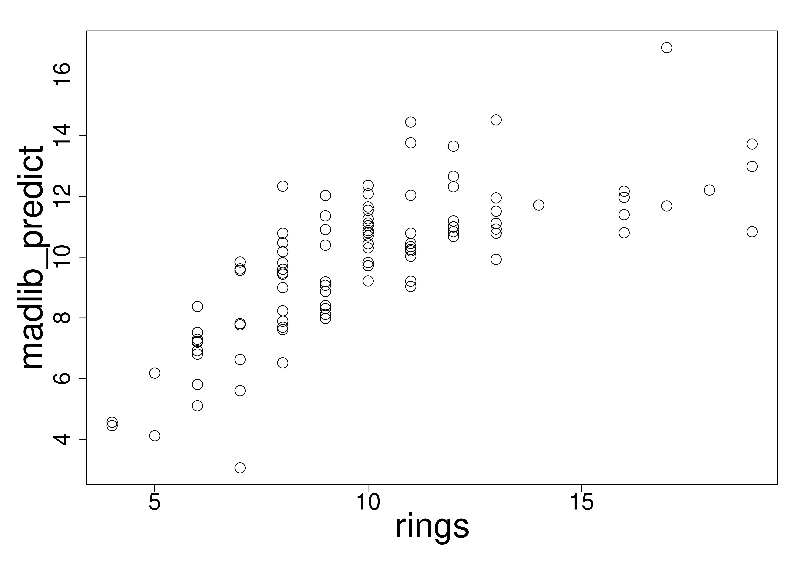

::: article
# Introduction

In recent years, Big Data has become an important research topic and a
very realistic problem in industry. The amount of data that we need to
process is exploding, and the ability of analyzing big data has become
the key factor in competition. Big data sets do not fit into computer's
memory and it would be really slow if the big data sets were processed
sequentially. On the other hand, most contributed packages of R are
still strictly sequential, single machine, and they are restricted to
small data sets that can be loaded into memory. As computing shifts
irreversibly to parallel architectures and big data, there is a risk for
the R community to become irrelevant.

Some efforts have been invested into developing packages that give R
users and developers the access to some of the parallel distributive
platforms. Some examples include *dplyr* [@dplyr], *RHadoop* [@RHadoop]
(including *plyrmr*, *rmr*, *rhdfs*, *rhbase*), *RHIPE* [@RHIPE],
*RHive* [@RHive], *teradataR* [@teradatar] etc.

In this paper we introduce the package
[*PivotalR*](https://CRAN.R-project.org/package=PivotalR) [@pivotalr],
which provides an R front-end with data.frame oriented API for R users
to access big data stored in distributive databases or Hadoop
distributive file system (HDFS) [@hdfs]. In this sense, *PivotalR* is
close to the still under development *dplyr* package, which has a
data.frame oriented API and multiple back-ends including several SQL
database systems. *PivotalR* puts more emphasis on machine learning by
providing a wrapper for MADlib [@madlib], which is an open-source
library of scalable in-database machine learning algorithms. Actually
*PivotalR* offers more than what MADlib has. It adds functionalities
that do not exist in MADlib, for example, the support for categorical
variables. *PivotalR* makes it easier to work on big data sets in
databases.

This package is especially useful for users who are not familiar with
SQL language, because the functions and syntax for the manipulation of
tables are very similar to those for data.frame manipulation defined
natively in R. Thus the learning curve for the package is very smooth.
*PivotalR* is also very useful for users who are familiar with SQL
language, because it brings the graphical and analytical functionalities
of R to the processing of big data stored in databases.

*PivotalR* is contributed to the open-source community by the Predictive
Analytics Team at Pivotal Inc. In order to gain the power of
distributive storage and parallel computation, the users need to have a
distributive database system installed, for example the Greenplum
Database or HAWQ. *PivotalR* also supports the open-source database
system PostgreSQL. Therefore *PivotalR* benefits R users by providing an
easy-to-access interface for manipulating data tables stored in
PostgreSQL database system and a combination of the powers of R and
MADlib, which lets the user directly apply machine learning algorithms
on the big data stored in databases.

It is worth mentioning that *PivotalR* provides the access to data
stored on HDFS by supporting HAWQ [@hawq], which is the SQL query engine
on HDFS created by Pivotal Inc.

The user does not need to worry about the restriction of memory size
even if the data size is very big, because *PivotalR* minimizes the
amount of data transferred between the database and R. The user
manipulates the data from R but the data itself stays in the database.

The work flow of using *PivotalR* is the following. First, the user uses
`"db.connect"` to connect to a database. Then, `"db.data.frame"` can be
used to create a wrapper for a data table in the database. Minimal
information about the table is kept in the wrapper, and no data is
loaded into the memory. The user can easily operate on the
`"db.data.frame"` wrapper object and any operation creates a
`"db.Rquery"` object, which is just a wrapper for a series of operations
and contains a SQL query string (see the section of Manipulation of Data
Tables in Database). During this data preparation step, no data is
loaded. In the next step, the user can either call the `"lookat"`
function to view a sample of the operation result, or call one of the
MADlib wrapper functions to execute a machine learning algorithm. Both
choices initiate computation in the connected database. Usually the
computation result is small and can be loaded into memory for further
processing. In some cases, the result is also big, for example, the
MADlib wrapper for ARIMA produces the residuals for each row of the
data. In such cases, a table is created in the database to store the
result and a wrapper is automatically created in R, and the user can use
the same work flow to analyze the result table.

From the above work flow, one can see that all the actual computation is
done in the database. So the performance depends on the database. For
the Greenplum database or HAWQ, all computation is done in a parallel
and distributive way. Especially the MADlib machine learning functions
are all implemented to fully utilize the parallel and distributive power
of the databases. There are some operations that cannot be done in a
parallel way, for example the ordered aggregate, but they have not been
implemented in *PivotalR* yet. For the Postgres database, even though
the computation is not in parallel, the user can still use PivotalR to
easily access the data stored in the database, which might be too big to
load into memory. Actually the performance on Postgres is not bad at
all. In our performance tests in Postgres database, PivotalR's ARIMA
wrapper function for MADlib is faster than R's own `"arima"` function
when applied on large data sets.

It is worth mentioning that the Greenplum database (GPDB) [@gpdb] has a
community edition, which is free (but not open-source) and has all the
functionalities except the technical support from Pivotal Inc.

At the time of writing, the version of *PivotalR* on CRAN is 0.1.8.

In this paper, we briefly introduce the usage of *PivotalR*. First in
the next section we explain the architecture of *PivotalR*. Then we use
various examples to illustrate the usage and work flow of *PivotalR*.

# Architecture of *PivotalR*

As is shown in Fig. [1](#fig:structure), *PivotalR* connects to the
database through the
[*RPostgreSQL*](https://CRAN.R-project.org/package=RPostgreSQL) [@rpostgresql]
package. However, *PivotalR* does not directly call the functions in
RPostgreSQL. Instead we create an abstraction layer to wrap the
functions of RPostgreSQL, and the access to the database is done by
calling the functions in the abstraction layer, which then call the
functions in RPostgreSQL. This design makes it easier to add supports
for other data storage platforms in the future. Right now, *PivotalR*
only supports the connection to PostgreSQL, GPDB (Greenplum Database)
and HAWQ. Through HAWQ, *PivotalR* can access the big data stored on
HDFS.

In the future, *PivotalR* will add supports to other DBMS, Pivotal HD
(Hadoop created by Pivotal Inc.) and Hadoop (MapReduce), but we have not
decided about how to do that. This is why there are question marks in
Fig. [1](#fig:structure).

The table operation functions are built upon the abstraction layer for
accessing data. The syntax of these functions is the same as R's
`"data.frame"` operation functions, such as `[, [<-, $, $<-`, `merge`,
`"by"` etc. Arithmetic methods such as `+, -, *, /`, logical functions
such as `>, <, ==, !=, <=, >=, !, |, &`, math functions such as
`log, exp, factorial` etc. are all implemented.

The layers that are built upon the table operations are the MADlib
function wrappers and other functions, which will be covered in the
subsequent sections.

A graphical user interface using the
[*shiny*](https://CRAN.R-project.org/package=shiny) [@shiny] package is
also implemented. Right now it only provides the graphical interface to
the MADlib wrapper functions, but we have the plan to provide the
graphical access to all functionalities of *PivotalR* in the future.

![Figure 1: The structure of PivotalR. PivotalR accesses the data
storage through an abstraction layer which wraps the functions that can
directly access the database. Other types of data storages will be
supported in the future. Right now it only supports connections to
PostgreSQL, GPDB and HAWQ. Table operation functions are built upon the
data accessing layer. They have the exact same interface as R's
\"data.frame\" operation functions. MADlib function wrappers and other
functions are built upon the table operations. The graphical user
interface makes the package easier to
use.](PivotalR_structure.png){#fig:structure width="100%" alt="graphic without alt text"}

It is worth explaining more about how *PivotalR* operates on the tables.
Before everything, the user needs to create a `"db.data.frame"` object,
which is just a wrapper of the table. Any operation on this object is
translated into an SQL query string. However, the SQL query is not
executed at this point, and is instead stored in an object of class
`"db.Rquery"` in R. When the user wants to execute the operation, he can
call the function `"preview"` or `"lookat"` (or a shorthand `"lk"`) to
execute the operation and load part or all of the results into memory to
view. The user can also choose to use `"as.db.data.frame"` to execute
the SQL query and save the result into a new table. This design gives
the user the freedom to choose when to load data into memory or create
tables to store intermediate data in the process of a calculation. It
also avoids the risk of accidentally loading big data into memory.

In order to realize the above design, we use a class hierarchy shown in
Fig. [2](#fig:hierarchy). *PivotalR* uses S4 object-oriented programming
extensively. All objects that are related to the data in the database
belong to subclasses of an abstract class named `"db.object"`.

{#fig:hierarchy width="100%" alt="graphic without alt text"}

As has been mentioned, the class `"db.data.frame"` is a wrapper of data
objects stored in the connected database. When it is created by the
command `"db.data.frame"`, no actual data stored in the data table in
the database is transferred from the database to R. This object just
contains some basic information about the data object in the database,
such as dimensions and column names. `"db.data.frame"` has two
sub-classes, `"db.table"` and `"db.view"`, which are wrappers for tables
and views respectively.

``` r
> library(PivotalR)
> conn.id <- db.connect(port = 14526, dbname = "madlib", host = "localhost")
Created a connection to database with ID 1
> x <- db.data.frame("abalone")
```

The command `"db.connect"` in the abstraction layer is used to connect
to one or multiple databases. It has an optional parameter that lets the
user select which package he wants to use to connect to the databases,
although only *RPostgreSQL* is supported right now. The returned value
of `"db.connect"` is an integer which represents the database
connection. *PivotalR* can connect to multiple databases at the same
time. Thus it is possible to train a machine learning model using the
data from database 1 and then make predictions using the data from
database 2. One can use `"db.disconnect"` to disconnect a connection and
`"db.list"` to list all active connections.

Any operation on an object of the class `"db.data.frame"` produces an
object of the class `"db.Rquery"`. An object of the class `"db.Rquery"`
resides entirely on the R side, and is a wrapper of operations on a
`"db.data.frame"` object. Most operations on a `"db.Rquery"` object
produces another `"db.Rquery"` object. Essentially, a `"db.Rquery"`
object is just a container of a string of SQL query, which can be viewed
using the command `"content"`. The command `"as.db.data.frame"` creates
a table in the database using the results of the SQL query contained in
a `"db.Rquery"` object and then creates a `"db.data.frame"` wrapper that
points to this table.

`"preview"` (or its alias `"lookat"` and `"lk"`) transfers the data from
the database into R's memory. By default it fetches $100$ rows of data
from the table in the database and converts the data into a
`"data.frame"` in R.

``` r
> lookat (x, 10)
   id sex length diameter height  whole shucked viscera shell rings
1   4   M  0.440    0.365  0.125 0.5160  0.2155  0.1140 0.155    10
2   8   F  0.545    0.425  0.125 0.7680  0.2940  0.1495 0.260    16
3  12   M  0.430    0.350  0.110 0.4060  0.1675  0.0810 0.135    10
4  16   M  0.500    0.400  0.130 0.6645  0.2580  0.1330 0.240    12
5  20   M  0.450    0.320  0.100 0.3810  0.1705  0.0750 0.115     9
6  24   F  0.550    0.415  0.135 0.7635  0.3180  0.2100 0.200     9
7  28   M  0.590    0.445  0.140 0.9310  0.3560  0.2340 0.280    12
8  32   F  0.680    0.560  0.165 1.6390  0.6055  0.2805 0.460    15
9  36   M  0.465    0.355  0.105 0.4795  0.2270  0.1240 0.125     8
10 40   M  0.355    0.290  0.090 0.3275  0.1340  0.0860 0.090     9
```

The MADlib wrappers can be applied to both `"db.data.frame"` and
`"db.Rquery"` objects. When a MADlib wrapper function is applied to a
`"db.Rquery"` object, a temporary table is created using
`as.db.data.frame`. MADlib is an in-database library and we have to
convert `"db.Rquery"` into an object inside the database so that we
could apply MADlib functions to it. This temporary table is dropped
after the computation is done.

The design of *PivotalR* minimizes the amount of data that needs to be
transferred between the database and R. The only function that transfers
data from the database is `"preview"`.

# Manipulation of data tables in database

As has been mentioned, *PivotalR* overloads many methods that operate on
`"data.frame"`, and thus lets the operations on the `"db.obj"` objects
mimic those on `"data.frame"` as much as possible, with one important
difference discussed below.

``` r
> x <- db.data.frame ("abalone")
> dim (x)
[1] 4177   10
> names (x)
 [1] "id"       "sex"      "length"   "diameter" "height"   "whole"
 [7] "shucked"  "viscera"  "shell"    "rings"
> x$rings <- x$rings + 2 / 3
> x$newCol <- (x$rings + x[['length']]) < 10
> content(x)
[1] "select \"id\" as \"id\", \"sex\" as \"sex\", \"length\" as \"length\",
\"diameter\" as \"diameter\", \"height\" as \"height\", \"whole\" as \"whole\",
\"shucked\" as \"shucked\", \"viscera\" as \"viscera\", \"shell\" as \"shell\",
(\"rings\")::double precision + 0.666666666666667 as \"rings\",
(((\"rings\")::double precision + 0.666666666666667)::double precision
+ (\"length\"))::double precision < 10 as \"newCol\" from \"abalone\""
```

Here `"content"` displays the SQL query stored in the `"db.Rquery"`. The
quotes inside the SQL query is used to deal with column or table names
with special characters. `x` was originally a `"db.data.frame"` object,
but was converted to a `"db.Rquery"` object by the operation
`x$rings <- x$rings + 2 / 3`.

As long as a `"key"` is specified when the user calls `"db.data.frame"`
function, the syntax `A[3,4]` can be used. Here the first number `"3"`
means that the key column has the value of `3`. Therefore,
`lk(A[3,4],-1)` may return multiple values. This is different from the
behavior of `"data.frame"`, where `A[3,4]` returns the element on 3-rd
row and 4-th column. This difference is related to the lack of intrinsic
order in the database tables, which will be discussed in the following.

The rows of a `"data.frame"` object have an intrinsic order, which makes
the operations that involve two `"data.frame"` objects easier to define.
For example, it is straightforward to define the subtraction of two
columns of two different `"data.frame"` objects by matching the order of
the rows as long as they have the same number of rows.

On the other hand, the tables in the database do not have an intrinsic
order for the rows. Thus, most operations like subtraction, addition
etc. can only be defined for columns belonging to the same table.
However, this is usually not a problem. Whenever the user wants to do an
operation that involves two tables, he/she should first call the
function `"merge"` to create a new table (actually a `"db.Rquery"`
object) from the two tables and at the same time explicitly specify how
to match the rows of the two different tables. Then, the user can easily
do operations on the new table. While R's `"data.frame"` implicitly uses
the intrinsic order of the rows to match the rows from two different
data.frames, this needs to be explicitly done for `"db.data.frame"`
objects. For example,

``` r
> x <- db.data.frame("abalone")
> y <- db.data.frame("abalone")
> z <- merge(x, y, by = NULL) # cross join two tables
> names(z)
 [1] "id_x"       "sex_x"      "length_x"   "diameter_x" "height_x"
 [6] "whole_x"    "shucked_x"  "viscera_x"  "shell_x"    "rings_x"
[11] "id_y"       "sex_y"      "length_y"   "diameter_y" "height_y"
[16] "whole_y"    "shucked_y"  "viscera_y"  "shell_y"    "rings_y"
> z$sex_x == z$sex_y # This is a db.Rquery object
```

The data frame `abalone` is lazy-loaded in *PivotalR*. It is used as an
example data here. One can use `as.db.data.frame` to transfer this data
set into a table in the database and at the same time create a wrapper
for the table.

``` r
> x <- as.db.data.frame(abalone, conn.id=1)
The data in the data.frame abalone is stored into the table in 
database madlib on localhost !
```

All the subsequent operations will be applied on the table wrapper `x`.
A sample of the data is shown in the following, where `sort` is used to
create a sorting operation on the original table.

``` r
> lookat(sort(x, FALSE, x$id), 10) # load 10 rows of the sorted data
   id sex length diameter height  whole shucked viscera shell rings
1   1   M  0.455    0.365  0.095 0.5140  0.2245  0.1010 0.150    15
2   2   M  0.350    0.265  0.090 0.2255  0.0995  0.0485 0.070     7
3   3   F  0.530    0.420  0.135 0.6770  0.2565  0.1415 0.210     9
4   4   M  0.440    0.365  0.125 0.5160  0.2155  0.1140 0.155    10
5   5   I  0.330    0.255  0.080 0.2050  0.0895  0.0395 0.055     7
6   6   I  0.425    0.300  0.095 0.3515  0.1410  0.0775 0.120     8
7   7   F  0.530    0.415  0.150 0.7775  0.2370  0.1415 0.330    20
8   8   F  0.545    0.425  0.125 0.7680  0.2940  0.1495 0.260    16
9   9   M  0.475    0.370  0.125 0.5095  0.2165  0.1125 0.165     9
10 10   F  0.550    0.440  0.150 0.8945  0.3145  0.1510 0.320    19
```

Finally, I want to reiterate that all these operations done on
`"db.data.frame"` are not executed immediately. Instead a `"db.Rquery"`
object is produced. The user can convert it into a real table using
`as.db.data.frame`.

# MADlib wrapper functions

In the next, we show some examples of MADlib wrapper functions. As is
shown in Fig. [2](#fig:hierarchy), all MADlib wrapper functions can be
applied to `"db.obj"` objects. Because the connection information is
already contained in `"db.obj"` objects, we do not need to specify
`"conn.id"` in the MADlib wrapper functions.

First, we show several examples of linear regression. Basically,
*PivotalR*'s `"madlib.lm"` uses the same formula syntax as `"lm"`.
Because MADlib's linear regression supports fitting separate linear
regression models on sub-groups of the data, which are grouped by one or
multiple columns, `"madlib.lm"` allows `"|"` in the formula, which means
that the model is fit on a subset of the data conditioned on the value
of the variables after `"|"`.

``` r
> ## fit one different model to each group of data with the same sex
> fit <- madlib.lm(rings ~ . - id | sex, data = x)
```

`sex` has $3$ distinct values, and thus `fit` is a list of 3 elements.
Each element is the linear regression model for a subset of the data.
The mean square error can be easily computed

``` r
> ## apply the model to data in another database
> lookat(mean((x$rings - predict(fit, x))^2)) # mean square error
  rings_madlib_predict_opr_opr_avg
1                         4.647291
```

We can plot a random sample of the fitted values together with the real
values, as is shown in Fig. [3](#fig:sample). We can also select one
model from the fitting result to plot, as is shown in the comments of
the following snippets.

``` r
> ## plot the result
> ap <- cbind(x$rings, predict(fit, x)) # combine two columns
> plot(lookat(sort(ap, FALSE, NULL), 100)) # plot a random sample
> ## ap <- cbind(x$rings[x$sex == "I"], predict(fit[[1]], x[x$sex == "I",]))
> ## plot(lookat(sort(ap, FALSE, NULL), 100)) # plot a random sample
```

{#fig:sample width="75.0%" alt="graphic without alt text"}

Support for categorical variables is done through `"as.factor"`, as is
shown in the next example.

``` r
> v <- x
> v$sex <- as.factor(v$sex) # specify which column to pivot
> f <- madlib.lm(rings ~ . - id, data = v)
> f
MADlib Linear Regression Result

Call:
madlib.lm(formula = rings ~ . - id, data = v)

---------------------------------------

Coefficients:
             Estimate Std. Error  t value       Pr(>|t|)
(Intercept)   3.89464    0.29157  13.3576  6.992e-40 ***
sex:M         0.05772    0.08335   0.6925  4.887e-01
sex:I        -0.82488    0.10240  -8.0558  1.022e-15 ***
length       -0.45834    1.80912  -0.2533  8.000e-01
diameter     11.07510    2.22728   4.9725  6.876e-07 ***
height       10.76154    1.53620   7.0053  2.861e-12 ***
whole         8.97544    0.72540  12.3730  1.469e-34 ***
shucked     -19.78687    0.81735 -24.2086 2.988e-121 ***
viscera     -10.58183    1.29375  -8.1792  3.757e-16 ***
shell         8.74181    1.12473   7.7723  9.639e-15 ***
---
Signif. codes:  0 '***' 0.001 '**' 0.01 '*' 0.05 '.' 0.1 ' ' 1

R-squared: 0.5378844
Condition Number: 137.2694
```

Because `extractAIC` methods are implemented for the result of
`madlib.lm` and `madlib.glm`, one can use R's `step` function for
feature selection.

``` r
  fit <- madlib.glm(rings < 10 ~ ., data = x, family = "binomial")
  step(fit)
```

This is a good example of how R's analytical functionalities can be
combined with MADlib.

In the next example, we use the bootstrap aggregate method to fit a
linear model to the data.

``` r
  ## generic bagging
  fit <- generic.bagging(function(data) {
                            madlib.lm(rings ~ . - id - sex, data = data)
                         },
                         data = x, nbags = 10, fraction = 0.85)

  pred <- predict(fit, newdata = x) # make prediction

  lookat(mean((x$rings - pred)^2))
```

Just like `"glm"` in the *stats* package, *PivotalR* provides
`"madlib.glm"`, which can do both linear and logistic regressions. The
usage is similar to `glm`. Please refer to *PivotalR* manual [@pivotalr]
for details.

# Support for array columns

Both Greenplum and Postgres databases have an upper limit for the number
of columns in a data table. The upper limit depends on the column data
types, but is usually around 1600. If the big data set has more
features, the only workaround is to use an array column to encapsulate
all the features, because there is no limit for how many elements an
array can contain.

*PivotalR* has full support for such array columns, as is shown in the
next example.

``` r
> z <- db.data.frame("madlibtestdata.lin_auto_mpg_oi")
> lookat(z, 10)
   x.1 x.2 x.3 x.4 x.5 x.6 x.7  y
1     8  383  170 3563 10.0   70    1 15
2     8  340  160 3609  8.0   70    1 14
3     8  400  150 3761  9.5   70    1 15
4     4  121  113 2234 12.5   70    2 26
5     8  360  215 4615 14.0   70    1 10
6     8  304  193 4732 18.5   70    1  9
7     4  113   95 2228 14.0   71    3 25
8     6  250   88 3302 15.5   71    1 19
9     8  351  153 4154 13.5   71    1 14
10    8  318  150 4096 13.0   71    1 14
> madlib.lm(y ~ x, data = z)
MADlib Linear Regression Result

Call:
madlib.lm(formula = y ~ x, data = z)

---------------------------------------

Coefficients:
              Estimate Std. Error t value      Pr(>|t|)
(Intercept) -17.218435   4.644294 -3.7074 2.402e-04 ***
x[1]         -0.493376   0.323282 -1.5261 1.278e-01
x[2]          0.019896   0.007515  2.6474 8.445e-03 **
x[3]         -0.016951   0.013787 -1.2295 2.196e-01
x[4]         -0.006474   0.000652 -9.9288 7.883e-21 ***
x[5]          0.080576   0.098845  0.8152 4.155e-01
x[6]          0.750773   0.050973 14.7288 3.069e-39 ***
x[7]          1.426140   0.278136  5.1275 4.666e-07 ***
---
Signif. codes:  0 '***' 0.001 '**' 0.01 '*' 0.05 '.' 0.1 ' ' 1

R-squared: 0.8214781
Condition Number: 85850.33
```

# Handling of NULL values

*PivotalR* makes it very easy to filter `NULL` values from a table. Here
we show an example using the data `"null.data"` that comes with
*PivotalR*. `"null.data"` has lots of `NULL` value. However, we can
easily filter out all the `NULL` values.

``` r
> delete("null_data", conn.id = 2)
[1] TRUE
> w <- as.db.data.frame(null.data, "null_data", conn.id = 2)
The data in the data.frame null.data is stored into the table null_data in database 
madlib on localhost !
> dim(w)
[1] 67126    10
> lookat(w, 10)
   sf_mrtg_pct_assets ris_asset lncrcd lnauto lnconoth lnconrp intmsrfv
1               31.62    208596      0     NA    18260      44        0
2               20.66     34647      0     NA     2997       0        0
3               14.95    160175      0     NA    15164       0        0
4               17.49    117398      0     NA    12365       0        0
5               35.59    233592      0     NA     6261     151        0
6               11.57    166387      0     NA    36356       0        0
7               10.56    102891      0     NA     6311       0        0
8                6.05     30138      0     NA     2664       0        0
9               14.53   1615727      0     NA    80829    1106      105
10              12.88     83090      0     NA    11815       0        0
   lnrenr1a lnrenr2a lnrenr3a
1        NA       NA       NA
2        NA       NA       NA
3        NA       NA       NA
4        NA       NA       NA
5        NA       NA       NA
6        NA       NA       NA
7        NA       NA       NA
8        NA       NA       NA
9        NA       NA       NA
10       NA       NA       NA
> db.objects("null", conn.id = 2)
[1] "madlibtestdata.credit_nulls"         "madlibtestdata.rf_golf_nullclass"
[3] "madlibtestdata.rf_nursery_nullclass" "madlibtestdata.table_has_null"
[5] "public.null_data"
> for (i in 1:10) w <- w[!is.na(w[i]),] # filter NULL values
> dim(w)
[1] 6789   10
> madlib.lm(sf_mrtg_pct_assets ~ ., data = w)
MADlib Linear Regression Result

Call:
madlib.lm(formula = sf_mrtg_pct_assets ~ ., data = w)

---------------------------------------

Coefficients:
              Estimate Std. Error   t value      Pr(>|t|)
(Intercept)  1.528e+01  1.471e-01 103.90694 0.000e+00 ***
ris_asset    1.602e-08  1.141e-08   1.40440 1.602e-01
lncrcd      -1.608e-07  7.725e-08  -2.08170 3.741e-02 *
lnauto      -3.871e-07  3.447e-07  -1.12301 2.615e-01
lnconoth    -7.498e-07  4.370e-07  -1.71559 8.628e-02 .
lnconrp      7.575e-08  1.229e-06   0.06165 9.508e-01
intmsrfv     8.609e-06  1.790e-06   4.81005 1.542e-06 ***
lnrenr1a    -4.827e-06  3.837e-05  -0.12580 8.999e-01
lnrenr2a     1.358e-04  2.359e-05   5.75605 8.986e-09 ***
lnrenr3a    -3.133e-05  4.273e-06  -7.33355 2.502e-13 ***
---
Signif. codes:  0 '***' 0.001 '**' 0.01 '*' 0.05 '.' 0.1 ' ' 1

R-squared: 0.01083685
Condition Number: 37854014
```

`na.action` is supported by `madlib.lm`, `madlib.glm` and
`madlib.elnet`. The user can define his own `"na.action"` function.
`"na.omit"` method is also implemented.

# Quickly creating prototypes of machine learning algorithms

One of the goals of *PivotalR* is to help data scientists quickly create
prototypes for parallel machine learning algorithms that can run in
distributive databases. Although *PivotalR* is still at an early stage
of development, we have already invested some effort into this. The idea
is to implement some basic operations that forms the building blocks for
most machine learning algorithms.

For example, we implemented the function `crossprod`, which computes the
operation $X^{T}Y$. $X$ and $Y$ are wrappers created by
`"db.data.frame"` for tables that represent matrices. $X$ has $m$ rows
(observations) and $n$ columns (features). The assumption here is that
$m$ can be very large but the number of features $n$ is small. Thus
results of $X^TX$ and $X^TY$ are both small and can be loaded into
memory for further calculations. The big data computation only involves
the computations of $X^TX$ and $X^TY$ in the database.

``` r
  ## linear regression
  linregr <- function (x, y)
  {
    a <- crossprod (x)
    b <- crossprod (x, y)
    solve (lookat (a)) %*% lookat(b)
  }

  linregr (db.array(1, x[,-c (1,2,10)]), x[["rings"]])
```

Another example is the implementation of PCA for a matrix $Z$. Again we
assume that the number of columns $n$ is not large and the product
$Z^TZ$ is small enough to be loaded into memory. *PivotalR* implements
`"scale"`, which is used together with `crossprod` in this example.

``` r
  ## PCA
  ## compute all eigenvectors in parallel
  ## can be used for tables with features < 1000

  pca <- function (x, center = TRUE, scale = FALSE)
  {
    y <- scale(x, center = center, scale = scale) # centering and scaling
    z <- as.db.data.frame(y, verbose = FALSE) # create an intermediate
    # table to speed up computation
    m <- lookat(crossprod(z)) # one scan of the table to compute Z^T * Z
    d <- delete(z) # delete the intermediate table
    res <- eigen(m) # only this computation is in R
    n <- attr(y, "row.number") # save the computation to count rows

    ## return the result
    list(val = sqrt(res$values/(n-1)), # eigenvalues
    vec = res$vectors, # columns of this matrix are eigenvectors
    center = attr(y, "scaled:center"),
    scale = attr(y, "scaled:scale"))
  }

  dat <- db.data.frame("madlibtestdata.pca_mat_600_100", conn.id = 2)

  q <- pca(dat[,-1])
```

# GUI of *PivotalR*

As a front-end to both the database and MADlib, *PivotalR* also provides
a graphical user interface (GUI) to let users that are not familiar with
data science have an easy access to the functionalities. The GUI is
written using the package *shiny*, which provides a very nice web
application framework to create graphical user interface.

The GUI is launched by the command `pivotalr` after the connection to
the databases have been created. Fig. [4](#fig:gui_table) and
Fig. [5](#fig:gui_linregr) show the graphical user interface.
Fig. [4](#fig:gui_table) shows a screenshot for the summary of various
properties for all columns of a table. The actual computation is done
through MADlib's `"summary"` function, which has a wrapper function
`"madlib.summary"` in *PivotalR*. Fig. [5](#fig:gui_linregr) shows the
computation result of linear regression. The actual computation is done
through MADlib's `linregr_train` function, which has a wrapper function
`"madlib.lm"`.

{#fig:gui_table width="85.0%" alt="graphic without alt text"}

{#fig:gui_linregr width="85.0%" alt="graphic without alt text"}

The GUI of *PivotalR* is based upon the package *shiny*, which is a web
application framework. Therefore the command `pivotalr` launches a web
application. One can run the GUI on a server and connect to it using a
web browser.

The GUI of *PivotalR* is still at its early development stage. Many
functionalities, especially the various operations on data tables,
cannot be done through GUI.However, we expect to improve the GUI
gradually in the future releases.

# Future work

MADlib has a wide variety of machine learning functions. At the time of
writing, the version of *PivotalR* on CRAN is 0.1.8, and it implements 5
wrapper functions: linear regression, logistic regression, ARIMA,
elastic net regularization, and the data table summary function. In the
future, all MADlib functions will have their wrappers in *PivotalR*.
This is our highest priority right now.

As to the shiny interface of *PivotalR*, we are still exploring the
possibilities of streamlining the machine learning workflow and making
it compatible with a graphical interface. This by itself is a big
project, but it has a lower priority in our road-map.

The support for other platforms, like Hadoop or other database systems,
is also on our road-map, but has a relatively low priority too.

# Summary

Here we introduced *PivotalR*, a package created by Pivotal Inc. This
package provides an R front-end to PostgreSQL and all PostgreSQL-like
databases like Pivotal Inc.'s Greenplum Database (GPDB), HAWQ.
*PivotalR* allows the user to manipulate tables in database from within
R. It also provides the wrapper functions for MADlib, which is an
in-database machine learning library. *PivotalR* implements the support
for array columns and `NULL` handling. It also helps the user to quickly
create prototypes of machine learning algorithms. A graphical user
interface based on shiny is also implemented. In general, *PivotalR*
gives the user access to big data stored in databases and an easy-to-use
machine learning toolkit.
:::
