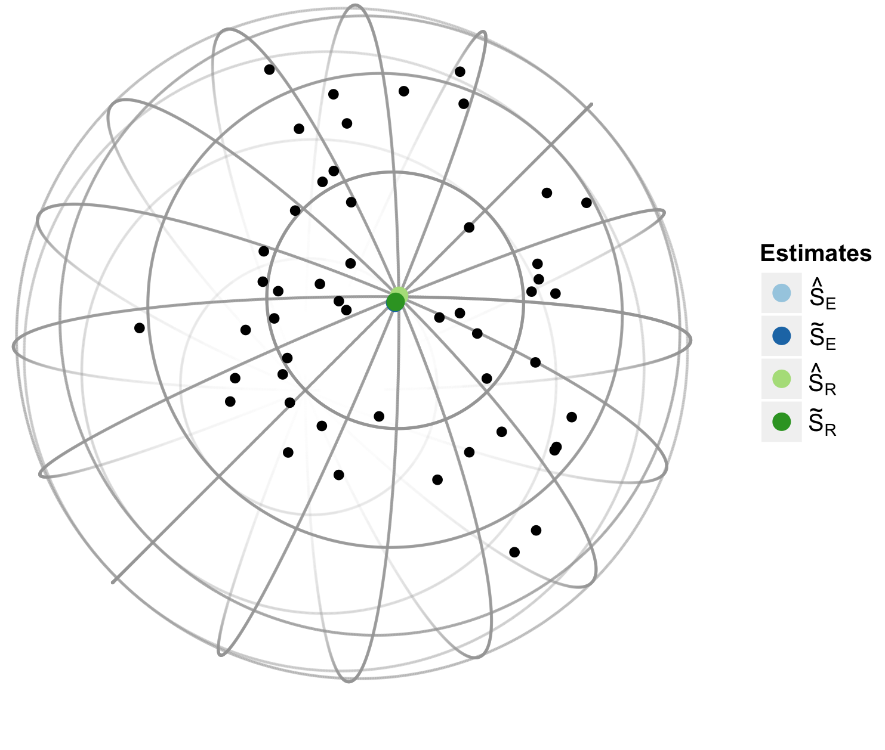
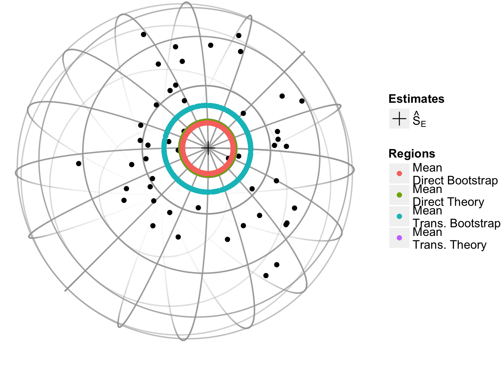

::: article
# Introduction

Data in the form of three-dimensional rotations have applications in
many scientific areas, such as bio-medical engineering, computer vision,
and geological and materials sciences where such data represent the
positions of objects within a three-dimensional reference frame. For
example, [@humbert1996], [@bingham2009] and [@bachmann2010] apply
rotation data to study the orientation of cubic crystals on the surfaces
of metal. [@rancourt2000] use rotations to represent variations in human
movement while performing a task.

A common goal shared in the analysis of rotation data across all fields
is to estimate the main or central orientation for a sample of
rotations. More formally, let $SO(3)$ denote the rotation group, which
consists of all real-valued $3\times 3$ matrices $\mathbf R$ with
determinant equal to +1. Then observations
$\mathbf{R}_1,\ldots,\mathbf{R}_n \in SO(3)$ can be conceptualized as a
random sample from a location model

$$\label{eq:locmodel}  
\mathbf{R}_i = \mathbf{S} \mathbf{E}_i, \quad i=1,\ldots,n,  (\#eq:locmodel)  $$

where $\mathbf S \in SO(3)$ is the *fixed* parameter of interest
indicating the central orientation, and
$\mathbf{E}_1,\ldots,\mathbf{E}_n \in SO(3)$ denote i.i.d. *random*
rotations which symmetrically perturb $\mathbf{S}$. Model
\@ref(eq:locmodel) is a rotation-matrix analog of a location model for
scalar data $Y_i = \mu + e_i$, where $\mu \in \mathbb{R}$ denotes a mean
and $e_i \in \mathbb{R}$ denotes an additive error symmetrically
distributed around zero.

Assuming the perturbations $\mathbf E_i$ symmetrically perturb
$\mathbf S$ implies that the observations $\mathbf R_i$ have no
preferred direction relative to $\mathbf S$ and that
$E\left(\mathbf R_i\right)=c\mathbf S$ for some $c\in\mathbb{R}^+$ for
all $i$. Also note that under the symmetry assumption,
\@ref(eq:locmodel) could be equivalently specified as
$\mathbf R_i=\mathbf E_i\mathbf S$, though the form given in
\@ref(eq:locmodel) is the most common form in the literature (see
@bingham2009 for details).

While there is a multitude of packages and functions available in R to
estimate the mean in a location model, the toolbox for rotational data
is limited. The
[*orientlib*](https://CRAN.R-project.org/package=orientlib)
[@murdoch2003] package includes the definition of an orientation class
along with a few methods to summarize and visualize rotation data. A
strength of the *orientlib* package is its thorough exploration of
rotation representations, but the estimation and visualization
techniques are lacking and no methods for inference are available. The
[*onion*](https://CRAN.R-project.org/package=onion) [@hankin2011]
package includes functions for rotation algebra but only the quaternion
form is available and data analysis is not possible. The *uarsbayes*
[@qu2013] package includes functions for data generation and Bayes
inference but this package is currently not publicly available. Packages
for circular and spherical data,
e.g. [*circular*](https://CRAN.R-project.org/package=circular)
[@agostinelli2011] and
[*SpherWave*](https://CRAN.R-project.org/package=SpherWave) [@oh2013],
can possibly be used but their extension to rotation data is not
straightforward.

The [*rotations*](https://CRAN.R-project.org/package=rotations)
[@stanfill2014] package fills this void by providing users with the
tools necessary to simulate rotations from \@ref(eq:locmodel) with four
distribution choices for the perturbation matrices $\mathbf E_i$.
Estimation and inference for $\mathbf{S}$ in \@ref(eq:locmodel) is
available along with two visualization techniques. The remainder of this
manuscript introduces rotation data more fully and discusses the ways
they are handled by the *rotations* package. For the latest on this
package as well as a full list of available functions, see
`help(package = "rotations")`.

# Rotation parameterizations

Several parameterizations of rotations exist. We consider two of the
most commonly used: orthogonal $3\times 3$ matrices with determinant one
and four-dimensional unit vectors called quaternions. The *rotations*
package allows for both parameterizations as input as well as
transforming one into the other. We will briefly discuss each:

## Matrix form {#subsec:matrix}

Rotations in three-dimensions can be represented by $3\times3$
orthogonal matrices with determinant one. Matrices with these
characteristics form a group called the special orthogonal group, or
rotation group, denoted $SO(3)$. Every element in $SO(3)$ is associated
with a skew-symmetric matrix $\mathbf\Phi\left(\mathbf W\right)$ where
$$\mathbf{\Phi}\left(\mathbf{W}\right) = \left(\begin{array}{ccc}0 & -w_3 & w_2 \\ w_3 & 0 & -w_1 \\-w_2 & w_1 & 0\end{array}\right)$$
and $\mathbf W\in\mathbb{R}^3$. Applying the exponential operator to the
matrix $\mathbf\Phi\left(\mathbf W\right)$ results in the rotation
$\mathbf R$

$$\label{eq:expW}   
  \mathbf R=\exp\left[\mathbf{\Phi}\left(\mathbf{W}\right)\right] = \sum\limits_{k=0}^\infty \frac{\left[\mathbf{\Phi}\left(\mathbf{W}\right)\right]^k}{k!}.  (\#eq:expW)  $$

Since $\mathbf\Phi\left(\mathbf W\right)$ is skew-symmetric, it can be
shown that \@ref(eq:expW) reduces to

$$\label{eq:angleAxis}  
  \mathbf R =\cos(r)\mathbf{I}_{3\times3} + \sin(r) \mathbf{\Phi}\left(\mathbf{U}\right) + [1-\cos (r)] \mathbf{U} \mathbf{U}^\top,  (\#eq:angleAxis)  $$

where $r=\|\mathbf{W}\|$, $\mathbf{U} =\mathbf{W}/\|\mathbf{W}\|$. In
the material sciences literature $r$ and $\mathbf U\in\mathbb{R}^3$ are
termed the misorientation angle and misorientation axis, respectively.

Given a rotation matrix $\mathbf R$ one can find the associated
skew-symmetric matrix $\mathbf{\Phi}\left(\mathbf W\right)$ by applying
the logarithm operator defined by

$$\label{eq:matLog}  
\text{Log}\left(\mathbf R\right)=\begin{cases}
\mathbf 0 &\text{if } \theta=0\\
\frac{r}{2\sin r}\left(\mathbf R-\mathbf R^\top\right)&\text{otherwise,}
\end{cases}  (\#eq:matLog)  $$

where $r\in[-\pi,\pi)$ satisfies
$\text{tr}\left(\mathbf R\right)=1+2\cos r$ and $\mathbf{tr}(\cdot)$
denotes the trace of a matrix. For more on the correspondence between
$SO(3)$ and skew-symmetric matrices see [@stanfill2013].

The *rotations* package defines the `S3` class `"SO3"`, which internally
stores a sample of $n$ rotations as a $n\times9$ matrix. If $n=1$ then
an object of class `"SO3"` is printed as a $3\times3$ matrix but for
$n>1$ the $n\times9$ matrix is printed. Objects can be coerced into, or
tested for the class `"SO3"` with the `as.SO3` and `is.SO3` functions,
respectively. Any object passed to `is.SO3` is tested for three
characteristics: dimensionality, orthogonality and determinant one.

The `as.SO3` function coerces the input into the class `"SO3"`. There
are three types of input supported by the `as.SO3` function. Given a
singe angle $r$ and axis $\mathbf U$, `as.SO3` will form a rotation
matrix according to \@ref(eq:angleAxis). Equivalently one could supply a
three-dimensional vector $\mathbf W$, then the length of that vector
will be taken to be the angle of rotation $r=\|\mathbf W\|$ and the axis
is taken to be the unit-vector in the direction of $\mathbf W$,
i.e. $\mathbf U=\mathbf W/\|\mathbf W\|$. One can also supply a rotation
$\mathbf Q$ in the quaternion representation. The `as.SO3` function will
return the matrix equivalent of $\mathbf Q$. For all input types the
function `as.SO3` returns an $n\times9$ matrix of class `"SO3"` where
each row corresponds to a rotation matrix. Below we illustrate the use
of the `as.SO3` function by constructing the $3\times3$ matrix
associated with a $90^\circ$ rotation about the $y$-axis, i.e. $r=\pi/2$
and $\mathbf U=(0,1,0)$. In this example and all that follow, we have
rounded the output to three digits for compactness.

``` r
> r <- pi/2
> U <- c(0, 1, 0)
> W <- U * r
> R <- as.SO3(W)
> R

     [,1] [,2] [,3]
[1,]    0    0    1
[2,]    0    1    0
[3,]   -1    0    0

> identical(R, as.SO3(U, r))

[1] TRUE
```

Given a rotation matrix $\mathbf R$, the functions `mis.angle` and
`mis.axis` will determine the misorientation angle and axis of an object
with class `"SO3"` as illustrated in the next example.

``` r
> mis.angle(R) * 2/pi

[1] 1

> mis.axis(R)

     [,1] [,2] [,3]
[1,]    0    1    0
```

## Quaternion form

Quaternions are unit vectors in $\mathbb{R}^4$ that are commonly written
as

$$\label{eq:quat} 
 Q = x_1 + x_2 i + x_3 j + x_4 k,  (\#eq:quat)  $$

where $x_l\in[-1,1]$ for $l=1,2,3,4$ and $i^2 = j^2= k^2 =ijk= -1$. We
can write $\mathbf Q=\left(s,\mathbf V\right)$ as tuple of the scalar
$s$ for coefficient $\mathbf 1$ and vector $\mathbf V$ for the remaining
coefficients, i.e. $s=x_1$ and $\mathbf V= (x_2, x_3, x_4)$.

A rotation around axis $\mathbf U$ by angle $r$ translates to
$\mathbf Q=\left(s,\mathbf V\right)$ with
$$s = \cos{(r/2)},  \ \ \mathbf V = \mathbf U \sin {(r/2)}.$$ Note that
rotations in quaternion form are over-parametrized: $\mathbf Q$ and
$-\mathbf Q$ represent equivalent rotations. This ambiguity has no
impact on the distributional models, parameter estimation or inference
methods to follow. Hence, for consistency, the *rotations* package only
generates quaternions satisfying $x_1\geq0$. Data provided by the user
does not need to satisfy this condition however.

The `S3` class `"Q4"` is defined for the quaternion representation of
rotations. All the functionality of the `"SO3"` class also exists for
the `"Q4"` class, e.g. `is.Q4` and `as.Q4` will test for and coerce to
class `"Q4"`, respectively. Internally, a sample of $n$ quaternions is
stored in the form of a $n\times4$ matrix with each row a unit vector.
Single quaternions are printed according to the representation in
\@ref(eq:quat) (see example below) while a sample of size $n$ is printed
as a $n\times 4$ matrix with column names `Real`, `i`, `j` and `k` to
distinguish between the four components.

The following code creates the same rotation from the previous section
in the form of a quaternion with the `as.Q4` function. This function
works much the same way as the `as.SO3` function in terms of possible
inputs but returns a vector of length four of the class `"Q4"`.

``` r
> as.Q4(U, r)

0.707 + 0 * i + 0.707 * j + 0 * k

> as.Q4(as.SO3(U, r))

0.707 + 0 * i + 0.707 * j + 0 * k
```

# Data generation[]{#section:generation label="section:generation"}

If the rotation $\mathbf{E}_i\in SO(3)$ from \@ref(eq:locmodel) has an
axis $\mathbf U$ that is uniformly distributed on the unit sphere and an
angle $r$ that is independently distributed about zero according to some
symmetric distribution function then $\mathbf E_i$ is said to belong to
the uniform-axis random spin, or UARS, class of distributions. From
[@bingham2009] the density for $\mathbf E_i$ is given by

$$\label{eq:uarsden}  
f\left(\mathbf E_i|\kappa\right)=\frac{4\pi}{3-\text{tr}\left(\mathbf E_i\right)}C\left(\left.\text{acos}\left\{\frac{\text{tr}(\mathbf E_i)-1}{2}\right\}\right|\kappa\right),  (\#eq:uarsden)  $$

where $C(\cdot|\kappa)$ is the distribution function associated with the
angle of rotation $r$ with concentration parameter $\kappa$. Members of
the UARS family of distributions are differentiated based on the angular
distribution $C(\cdot|\kappa)$.

The *rotations* package gives the user access to four members of the
UARS class. Each member is differentiated by the distribution function
for $r$: the uniform, the matrix Fisher
[@langevin2005; @downs1972; @khatri1977; @jupp1979], the Cayley
[@Schaeben1997; @leon2006] and the circular-von Mises distribution
[@bingham2009]. Note: probability distribution functions on $SO(3)$ such
as \@ref(eq:uarsden) are defined with respect to the Haar measure, which
we denote by $\lambda$. That is, the expectation of a random rotation
$\mathbf R\in SO(3)$ with corresponding misorientation angle $r$ is
given by
$E\left(\mathbf R\right)=\int_\Omega\mathbf Rf\left(\mathbf R|\kappa\right)\mathrm{d}\lambda$
where $\Omega=SO(3)$,
$\mathrm{d} \lambda=[1-\cos(r)]\mathrm{d} r/(2\pi)$ and $\mathrm{d} r$
is the derivative of $r$ with respect to the Lebesgue measure. Because
the Haar measure acts as the uniform measure on $SO(3)$ and
$\lambda\left(\Omega\right)=1$, then the angular distribution
$C(r)=[1-\cos(r)]/(2\pi)$ is referred to as the uniform distribution for
misorientation angles $r$ and has been included in the *rotations*
package under the name `.haar` (see Table [1](#tab:Crforms)).

The spread of the Cayley, matrix Fisher and circular-von Mises
distributions is controlled by the concentration parameter $\kappa$.
Concentration is a distribution specific quantity and is not comparable
across different distributions. To make comparisons across distributions
possible we also allow for specification of the circular variance, which
is defined as $\nu=1-E[\cos(r)]$ where $E[\cos(r)]$ is often referred to
as the mean resultant length [@fisher1996book]. The form of each angular
distribution along with the circular variance as a function of the
concentration parameter is given in Table [1](#tab:Crforms).

::: {#tab:Crforms}
  -----------------------------------------------------------------------------------------------------------------------------------------------------------------------------------------------------------------------------
  **Name**                                                    **Density** $C(r |\kappa)$                                                                 **Circular variance $\nu$**                             **Function**
  -------------------- -- -------------------------------------------------------------------------------------------------- -- ----------------------------------------------------------------------------- -- --------------
  Uniform                                                      $\frac{1-\cos(r)}{2\pi}$                                                                         $\frac{3}{2}$                                    `.haar`

  Cayley                   $\frac{\Gamma(\kappa+2)(1+\cos r)^\kappa(1-\cos r)}{2^{(\kappa+1)}\sqrt{\pi}\Gamma(\kappa+1/2)}$                                       $\frac{3}                                      `.cayley`
                                                                                                                                                                 {\kappa+2}$                                     

  matrix Fisher                                            $\frac{[1-\cos(r)]\exp[2\kappa                                        $\frac{3\mathrm{I}_0(2\kappa)-4\mathrm{I}_1(2\kappa)+\mathrm{I}_2(2\kappa)}     `.fisher`
                                            \cos(r)]}{2\pi[\mathrm{I_0}(2\kappa)-\mathrm{I_1}(2\kappa)]}$                                     {2[\mathrm{I}_0(2\kappa)-\mathrm{I}_1(2\kappa)]}$                  

  circular-von Mises                           $\frac{\exp[\kappa\cos(r)]}{2\pi \mathrm{I_0}(\kappa)}$                            $\frac{\mathrm{I_0}(\kappa)-\mathrm{I_1}(\kappa)}{\mathrm{I_0}(\kappa)}$       `.vmises`

                                                                                                                                                                                                                 
  -----------------------------------------------------------------------------------------------------------------------------------------------------------------------------------------------------------------------------

  : Table 1: Circular densities and circular variance $\nu$;
  $I_i(\cdot)$ represents the modified Bessel function of order $i$ and
  $\Gamma(\cdot)$ is the gamma function.
:::

For a given concentration `d`, `p` and `r` take the same meaning as for
the more familiar distributions such as `dnorm`. To simulate a sample of
$SO(3)$ data, the `ruars` function takes arguments `n`, `rangle`, and
`kappa` to specify the sample size, angular distribution and
concentration as shown below. Alternatively, one can specify the
circular variance $\nu$. Circular variance is used in the event that
both circular variance and concentration are provided. The `space`
argument determines the parameterization to form. When a sample of
rotations is printed then a $n\times 9$ matrix is printed with column
titles that specify which element of the matrix each column corresponds
to. For example, the $\mathbf R_{\{1,1\}}$ element of a rotation matrix
is printed under the column heading `R11` as illustrated below.

``` r
> Rs <- ruars(n = 20, rangle = rcayley, kappa = 1, space = "SO3")
> Qs <- ruars(n = 20, rangle = rcayley, kappa = 1, space = "Q4")
> Rs <- ruars(n = 20, rangle = rcayley, nu = 1, space = "SO3")
> Qs <- ruars(n = 20, rangle = rcayley, nu = 1, space = "Q4")
> head(Rs, 3)

        R11    R21   R31   R12    R22    R32    R13    R23   R33
[1,] -0.425 -0.850 0.310 0.475 -0.501 -0.723  0.770 -0.160 0.617
[2,] -0.564 -0.733 0.379 0.745 -0.256  0.615 -0.354  0.630 0.691
[3,]  0.087 -0.716 0.692 0.117  0.698  0.707 -0.989  0.019 0.145
```

# Data analysis[]{#section:analysis label="section:analysis"}

In this section we present functions in the *rotations* package to
compute point estimates and confidence regions for the central
orientation $\mathbf S$.

## Estimation of central orientation

Given a sample of $n$ observations $\mathbf R_1,\dots,\mathbf R_{n}$
generated according to \@ref(eq:locmodel), the *rotations* package
offers four built-in ways to estimate the central orientation
$\mathbf S$. These estimators are either Riemannian- or Euclidean-based
in geometry and use either the $L_1$- or $L_2$- norm, i.e. they are
median- or mean-type. We briefly discuss how the choice of geometry
affects estimation of $\mathbf S$.

The choice of geometry results in two different metrics to measure the
distance between rotation matrices $\mathbf{R}_1$ and
$\mathbf{R}_2 \in SO(3)$. The Euclidean distance, $d_E$, between two
rotations is defined by
$$d_E\left(\mathbf{R}_1,\mathbf{R}_2\right)=\left\|\mathbf{R}_1-\mathbf{R}_2\right\|_F,$$
where
$\|\mathbf{A}\|_F = \sqrt{\mathbf{tr}({\mathbf A^\top \mathbf A})}$
denotes the Frobenius norm. The Euclidean distance between two rotation
matrices corresponds to the length of the shortest path in
$\mathbb{R}^{3\times3}$ that connects them and is therefore an extrinsic
distance metric.

Estimators based on the Euclidean distance form the class of projected
estimators. The name is derived from the method used to compute these
estimators. That is, each estimator in this class is the projection of
the the generic $3\times 3$ matrix that minimizes the loss function into
$SO(3)$. For an object with class `"SO3"` the `median` or `mean`
function with argument `type = "projected"` will return a $3\times 3$
matrix in $SO(3)$ that minimizes the first- or second-order loss
function, respectively.

By staying in the Riemannian space $SO(3)$ the natural distance metric
becomes the Riemannian (or geodesic) distance, $d_R$, which for two
rotations $\mathbf{R}_1,\mathbf{R}_2\in SO(3)$ is defined as
$$d_R\left(\mathbf{R}_1,\mathbf{R}_2\right)=  \frac{1}{\sqrt{2}}\left\|\text{Log}\left(\mathbf{R}_1^\top\mathbf{R}_2\right)\right\|_F = |r|,$$
where $\text{Log}(\mathbf{R})$ denotes the logarithm of $\mathbf{R}$
defined in \@ref(eq:matLog) and $r\in[-\pi,\pi)$ is the misorientation
angle of $\mathbf{R}_1^\top \mathbf{R}_2$. The Riemannian distance
corresponds to the length of the shortest path that connects
$\mathbf{R}_1$ and $\mathbf{R}_2$ *within* the space $SO(3)$ and is
therefore an intrinsic distance metric. For this reason, the Riemannian
distance is often considered the more natural metric on $SO(3)$. As
demonstrated in [@stanfill2013], the Euclidean and Riemannian distances
are related by
$d_E(\mathbf R_1,\mathbf R_2)=2\sqrt{2}\sin\left[d_R(\mathbf R_1,\mathbf R_2)/2\right]$.

Estimators based on the Riemannian distance metric are called geometric
estimators because they preserve the geometry of $SO(3)$. These can be
computed using the `mean` and `median` functions with the argument
`type = "geometric"`. Table [2](#tab:ests.sum) summarizes the four
estimators including their formal definition and how they can be
computed.

The estimators in Table [2](#tab:ests.sum) find estimates based on
minimization of $L_1$- and $L_2$-norms in the chosen geometry. The
function `gradient.search` provides the option to optimize for any other
arbitrary minimization criterion. As the name suggests, the minimization
is done along the gradient of the minimization function in the rotation
space. Starting from an initial, user-specified rotation, the algorithm
finds a (local) minimum by stepping iteratively in the direction of the
steepest descent. Step size is regulated internally by adjusting for
curvature of the minimization function.

We highlight this process in the example below. The function `L1.error`
is defined to minimize the intrinsic $L_1$-norm, the result from the
optimization should therefore agree with the geometric median of the
sample. In fact, the difference between the two results is at the same
level as the minimal difference (`minerr`) used for convergence of the
gradient search. What is gained in flexibility of the optimization is,
of course, paid for in terms of speed: the built-in median function is
faster by far than the gradient search.

Also illustrated in the example below is the `rot.dist` function, which
computes the distance between two objects of class `"SO3"`, e.g. `R1`
and `R2`. The argument `method` specifies which type of distance to
compute: the `"extrinsic"` option will return the Euclidean distance and
the `"intrinsic"` option will return the Riemannian distance. If `R1` is
an $n\times9$ matrix representing a sample of rotations, then `rot.dist`
will return a vector of length $n$ where the $i$th element represents
the specified distance between `R2` and the $i$th row of `R1`.

``` r
> # error function definition
> L1.error <- function(sample, Shat) {
+    sum(rot.dist(sample, Shat, method = "intrinsic", p = 1))
+ }
> cayley.sample <- ruars(n = 50, rangle = rcayley, nu = 1, space = "SO3")
> # gradient based optimization
> system.time(SL1 <- gradient.search(cayley.sample, L1.error))

   user  system elapsed 
  3.464   0.007   3.473 

> # in-built function
> system.time(S <- median(cayley.sample, type = "geometric"))

   user  system elapsed 
  0.004   0.000   0.005  
  
> rot.dist(S, SL1$Shat)

[1] 1.492e-05
```

::: {#tab:ests.sum}
  --------------------------------------------------------------------------------------------------------------------------------------------------------------------------------------------
  **Estimator name**      **Definition**                                                                                                              **Code**                              
  -------------------- -- ------------------------------------------------------------------------------------------------------------------------ -- ---------------------------------- -- --
  Projected Mean          $\widehat{\mathbf{ S}}_E=\underset{\mathbf S\in SO(3)}{\text{argmin}}\sum\limits_{i=1}^n d_E^2(\mathbf S,\mathbf R_i)$      `mean(Rs, type = "projected")`        

  Projected Median        $\widetilde{\mathbf{ S}}_E=\underset{\mathbf S\in SO(3)}{\text{argmin}}\sum\limits_{i=1}^nd_E(\mathbf S,\mathbf R_i)$       `median(Rs, type = "projected")`      

  Geometric Mean          $\widehat{\mathbf{ S}}_R=\underset{\mathbf S\in SO(3)}{\text{argmin}}\sum\limits_{i=1}^n d_R^2(\mathbf S,\mathbf R_i)$      `mean(Rs, type = "geometric")`        

  Geometric Median        $\widetilde{\mathbf{ S}}_R=\underset{\mathbf S\in SO(3)}{\text{argmin}}\sum\limits_{i=1}^nd_R(\mathbf S,\mathbf R_i)$       `median(Rs, type = "geometric")`      

                                                                                                                                                                                            
  --------------------------------------------------------------------------------------------------------------------------------------------------------------------------------------------

  : Table 2: A summary of the estimators included in the *rotations*
  package. `Rs` is a sample of $n$ rotations with class `"SO3"` or
  `"Q4"`.
:::

## Confidence regions[]{#subsec:regions label="subsec:regions"}

Asymptotic results for the distribution of the projected mean
$\widehat{\mathbf{ S}}_E$ and median $\widetilde{\mathbf{ S}}_E$ can be
used to construct confidence regions for the central orientation
$\mathbf S$. In the literature two approaches are available to justify
the limiting distribution of the vector in $\mathbb{R}^3$ associated
with the centered estimator through \@ref(eq:expW). More specifically,
the vector $\sqrt{n}\widehat{\mathbf h}$ has been shown to have a
trivariate normal distribution where
$\widehat{\mathbf h}\in\mathbb{R}^3$ satisfies
$$\exp\left[\mathbf{\Phi}\left(\widehat{\mathbf h}\right)\right]=\mathbf S^\top\widehat{\mathbf{ S}}_E.$$
The first approach transforms a result from directional statistics while
the second uses $M$-estimation theory in $SO(3)$ directly. A summary of
these methods is given next.

In the context of directional statistics, [@prentice1984] used results
found in [@tyler1981] and the fact that $\widehat{\mathbf{ S}}_E$ is a
function of the spectral decomposition of
$\overline{\mathbf R}=\sum_{i=1}^n\mathbf{R}_i/n$ in order to justify a
multivariate normal limiting distribution for the scaled vector
$\sqrt{n}\,\widehat{\mathbf h}$. Unsatisfied with the coverage rate
achieved by [@prentice1986], [@fisher1996Boot] proposed a pivotal
bootstrap procedure that results in coverage rates closer to the nominal
level for small samples. A transformation from unit vectors in
$\mathbb{R}^d$ to rotation matrices is required in order to apply the
results of [@prentice1984] and [@fisher1996Boot] to $SO(3)$, therefore
they are called transformation-based. The projected median
$\widetilde{\mathbf{ S}}_E$ cannot be expressed as a function of the
sample spectral decomposition, therefore this approach cannot be used to
create confidence regions based on $\widetilde{\mathbf{ S}}_E$.

It has also been shown that both estimators $\widehat{\mathbf{ S}}_E$
and $\widetilde{\mathbf{ S}}_E$ are $M$-estimators, which motivates a
direct approach to confidence region estimation in $SO(3)$ [@chang2001].
In [@stanfill2014b], a pivotal bootstrap method based on the direct
approach was implemented to improve coverage rates in small samples.
Because the results in [@chang2001] and [@stanfill2014b] deal with
$SO(3)$ data directly, this approach is called direct.

The six possible confidence regions that result from these two methods
are available through the wrapper function `region`. They are
differentiated based on the `method`, `type` and `estimator` arguments.
Set `estimator = "mean"` or `estimator = "median"` to estimate a region
based on $\widehat{\mathbf{ S}}_E$ or $\widetilde{\mathbf{ S}}_E$,
respectively. For $\widehat{\mathbf{ S}}_E$ one can choose
`method = "transformation"` for the transformation-based methods or
`method = "direct"` for the direct method. Since the
transformation-based methods cannot be applied to
$\widetilde{\mathbf{ S}}_E$ an error is returned if
`estimator = "median"` and `method = "transformation"` are combined. A
bootstrap version of the specified method is implemented if
`type = "bootstrap"` or the normal limiting distribution can be chosen
with `type = "asymptotic"`. If a bootstrap type region is specified one
can additionally specify the bootstrap sample size with the `m`
argument, which is set to 300 by default. Regardless of the method and
type chosen a single value is returned on the interval $(0,\pi]$. This
value corresponds to the radius of the confidence region centered at
each of the axes of the specified estimator.

In the example code below a sample of $n=50$ rotations are drawn from
the Cayley-UARS($\mathbf I_{3\times 3}, \kappa=10$) distribution then
the four types of confidence regions based on the direct approach are
constructed. For a graphical representation of this dataset along with
an interpretation of the confidence regions see Figure
[1](#figure:eye1).

``` r
> Rs <- ruars(50, rcayley, kappa = 10)
> region(Rs, method = "direct", type = "asymptotic", 
+        estimator = "mean", alp = 0.05)

[1] 0.189

> region(Rs, method = "direct", type = "bootstrap", estimator = "mean",
+        alp = 0.05, m = 300)

[1] 0.201

> region(Rs, method = "direct", type = "asymptotic", 
+        estimator = "median", alp = 0.05)

[1] 0.201

> region(Rs, method = "direct", type = "bootstrap", estimator = "median",
+        alp = 0.05, m = 300)

[1] 0.249
```

# Visualizations

The *rotations* package offers two methods to visualize rotation data in
three-dimensions. Because rotation matrices are orthogonal, each column
of a rotation matrix has length one and is perpendicular to the other
axes. Therefore each column of a rotation matrix can be illustrated as a
point on the surface of a unit sphere, which represents the position of
the $x$-, $y$- or $z$-axis for that rotation matrix. Since each sphere
represents one of the three axes, three spheres are required to fully
visualize a sample of rotations. Though the use of separate spheres to
represent each axis can be seen as a disadvantage, the proposed
visualization method makes the idea of a central orientation and a
confidence region interpretable.

An existing function that can be used to illustrate rotation data is the
`boat3d` function included in the *orientlib* package. Given a sample of
rotations, the `boat3d` function produces either a static or interactive
three-dimensional boat to represent the provided data. If only one
rotation is of interest, the `boat3d` function is superior to the
proposed method because it conveniently illustrates rotational data in a
single image. If multiple rotations are provided, however, the `boat3d`
function will produce separate side-by-side boats, which can be hard to
interpret. In addition, the illustration of a estimated central
orientation or a confidence region in $SO(3)$ with the `boat3d` function
is not presently possible.

The *rotations* package can be used to produce high-quality static plots
within the framework of the
[*ggplot2*](https://CRAN.R-project.org/package=ggplot2) package
[@wickham2009]. Static plots are specifically designed for datasets that
are highly concentrated and for use in presentations or publications.
Alternatively, the *rotations* package can produce interactive plots
using functions included in the
[*sphereplot*](https://CRAN.R-project.org/package=sphereplot) package
[@robotham2013]. Interactive plots are designed so that the user can
explore a dataset and visualize a diffuse sample.

Calling the `plot` function with a `"SO3"` or `"Q4"` object will result
in an interactive or static sphere, differentiated by setting the
argument `interactive` to `TRUE` or `FALSE`, respectively. The `center`
argument defines the center of the plot and is usually set to the
identity rotation `id.SO3` or an estimate of the central orientation,
e.g. `mean(Rs)`. The user can specify which columns to visualize with
the `col` argument with options $1$, $2$ and $3$ representing the $x$-,
$y$- and $z$- axes, respectively. For static plots, multiple axes can be
displayed simultaneously by supplying a vector to `col`; only one column
will be displayed at a time for interactive plots. Also available to
static plots is the argument `to`$\_$`range`, which when set to `TRUE`
will display the portion of the sphere where the observations are
present.

All four estimates of the central orientation can be plotted along with
a sample of rotations. Setting the argument
`estimates`$\_$`show = "all"` will display all four simultaneously. If
only a few estimates are of interest then any combination of
`"proj.mean"`, `"proj.median"`, `"geom.mean"` or `"geom.median"` are
valid inputs. The estimators are indicated by color and a legend is
provided, see Figure [1](#figure:eye1). Finally, the `mean`$\_$`regions`
and `median`$\_$`regions` options allow the user to draw a circle on the
surface of the sphere representing the confidence region for that axis,
centered at $\widehat{\mathbf{ S}}_E$ and $\widetilde{\mathbf{ S}}_E$
respectively. If estimators are plotted along with the different regions
in static plots then shapes represent the estimators and colors
represent the region methods, see Figure [1](#figure:eye1), while
regions and estimators are always distinguished by colors for the
interactive plots. Given the sample of rotations generated in a previous
example, the example below illustrates how to produce static plots using
the `plot` function for objects of class `"SO3"` and Figure
[1](#figure:eye1) illustrates the results of these commands.

``` r
> plot(Rs, center = mean(Rs), col = 1, show_estimates = "all",
+      interactive = FALSE)
> plot(Rs, center = mean(Rs), col = 1, show_estimates = "proj.mean", 
+      mean_regions = "all", alp = .05, interactive = FALSE)
```

<figure id="figure:eye1">
<table>

<tbody>
<tr class="odd">
<td style="text-align: center;"></td>
<td style="text-align: center;"></td>
</tr>
<tr class="even">
<td style="text-align: center;">(a)Point estimates, static.</td>
<td style="text-align: center;">(b)Confidence region estimates,
static.</td>
</tr>
</tbody>
</table>
<figcaption>Figure 1: The x-axis of a random sample from the Cayley-UARS
distribution with \kappa=1, n=50. All for point estimates are displayed
in (a) and all three region methods along with the projected mean are in
(b). </figcaption>
</figure>

# Datasets

Datasets `drill` and `nickel` are included in the *rotations* package to
illustrate how the two representations of orientation data discussed
here are used in practice. The `drill` dataset was collected to assess
variation in human movement while performing a task [@rancourt1995].
Eight subjects drilled into a metal plate while being monitored by
infrared cameras. Quaternions are used to represent the orientation of
each subjects' wrist, elbow and shoulder in one of six positions. For
some subjects several replicates are available. See [@rancourt2000] for
one approach to analyzing these data. In the example below we load the
`drill` dataset, coerce the observations for subject one's wrist into a
form usable by the *rotations* package via `as.Q4`, then estimate the
central orientation with the projected mean.

``` r
> data(drill)
> head(drill)

  Subject Joint Position Replicate    Q1      Q2      Q3     Q4
1       1 Wrist        1         1 0.944  -0.192  -0.156  0.217
2       1 Wrist        1         2 0.974  -0.120  -0.111  0.158
3       1 Wrist        1         3 0.965  -0.133  -0.141  0.177
4       1 Wrist        1         4 0.956  -0.134  -0.115  0.233
5       1 Wrist        1         5 0.953  -0.199  -0.061  0.222
6       1 Wrist        2         1 0.963  -0.159  -0.127  0.177

> Subj1Wrist<-subset(drill, Subject == '1' & Joint == 'Wrist')
> Subj1Wdata <- as.Q4(Subj1Wrist[, 5:8])
> mean(Subj1Wdata)

0.987 - 0.070 * i - 0.134 * j + 0.049 * k
```

In the `nickel` dataset, rotation matrices are used to represent the
orientation of cubic crystals on the surface of a nickel sample measured
with Electron Backscatter Diffraction. Each `location` on the surface of
the nickel is identified by the `xpos` and `ypos` columns while the
`rep` column identifies which of the fourteen replicate scans that
measurement corresponds to. The last nine columns, denoted `v1`-`v9`,
represent the elements of the rotation matrix at that location in vector
form. See [@bingham2009; @bingham2010b] and [@stanfill2013] for more
details. In the example below we estimate the central orientation at
location one.

``` r
> data(nickel)
> head(nickel[, 1:6])

  xpos  ypos location rep     V1    V2
1    0 0.346        1   1 -0.648 0.686
2    0 0.346        1   2 -0.645 0.688
3    0 0.346        1   3 -0.645 0.688
4    0 0.346        1   4 -0.646 0.688
5    0 0.346        1   5 -0.646 0.686
6    0 0.346        1   6 -0.644 0.690

> Location1<-subset(nickel, location == 1)
> Loc1data<-as.SO3(Location1[, 5:13])
> mean(Loc1data)

       [,1]   [,2]   [,3]
[1,] -0.645 -0.286 -0.708
[2,]  0.687 -0.623 -0.374
[3,] -0.334 -0.728  0.599
```

# Summary

In this manuscript we introduced the *rotations* package and
demonstrated how it can be used to generate, analyze and visualize
rotation data. The *rotations* package is compatible with the quaternion
specific *onion* package by applying its `as.quaternion` function to a
transposed `"Q4"` object. Connecting to the *onion* package gives the
user access to a wide range of algebraic functions unique to
quaternions. Also compatible with the *rotations* package is the
*orientlib* package, which includes additional parameterizations of
rotations. To translate rotation matrices generated by the *rotations*
package into a form usable by the *orientlib* package, first coerce a
`"SO3"` object into a matrix of the same dimension, i.e. $n\times9$,
then apply the `rotvector` function provided by the *orientlib* package.
Quaternions are defined in the *orientlib* package by
$\mathbf Q = x_1 i + x_2 j + x_3 k + x_4$, cf. \@ref(eq:quat), which may
lead to confusion when translating quaternions between the *orientlib*
package and either of the *onion* or *rotations* packages. Below is a
demonstration of how quaternions and rotation matrices generated by the
*rotations* package can be translated into a form usable by the *onion*
and *orientlib* packages, respectively. See `help(package = "onion")`
and `help(package = "orientlib")` for more on these packages.

``` r
> Qs <- ruars(20, rcayley, space = 'Q4')
> Rs <- as.SO3(Qs)
> suppressMessages(require(onion))
> onionQs <- as.quaternion(t(Qs))
> suppressMessages(require(orientlib))
> orientRs <- rotvector(matrix(Rs, ncol = 9))
```

Computational speed of the *rotations* package has been enhanced through
use of the [*Rcpp*](https://CRAN.R-project.org/package=Rcpp) and
[*RcppArmadillo*](https://CRAN.R-project.org/package=RcppArmadillo)
packages [@eddelbuettel2013; @eddelbuettel2013b]. In future versions of
the package we plan to extend the parameterization and estimator
sections to include robust estimators currently being developed by the
authors.

# Acknowledgements

We would like to thank the reviewers for their comments and suggestions.
The *rotations* package and this article have benefited greatly from
their time and effort.

\

\

\
:::
