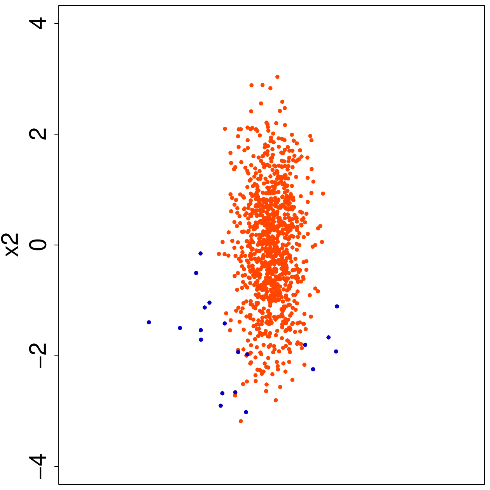
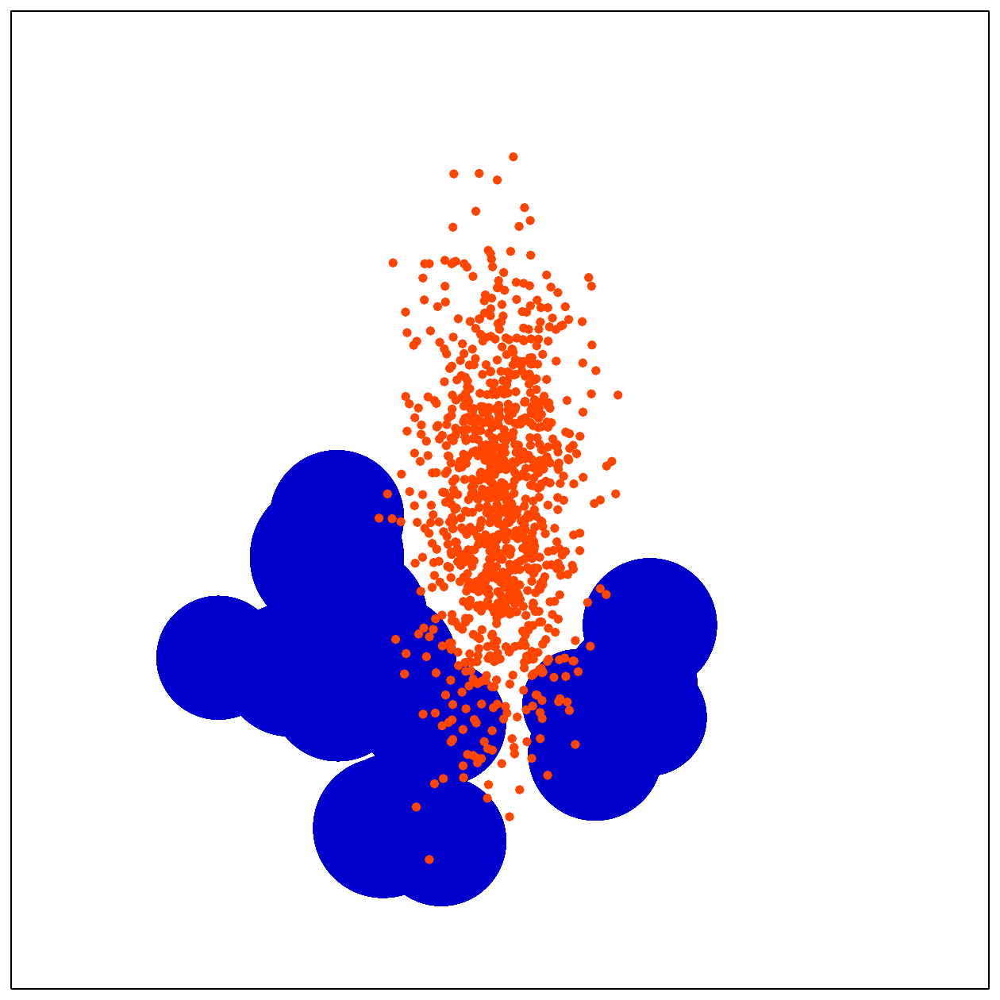
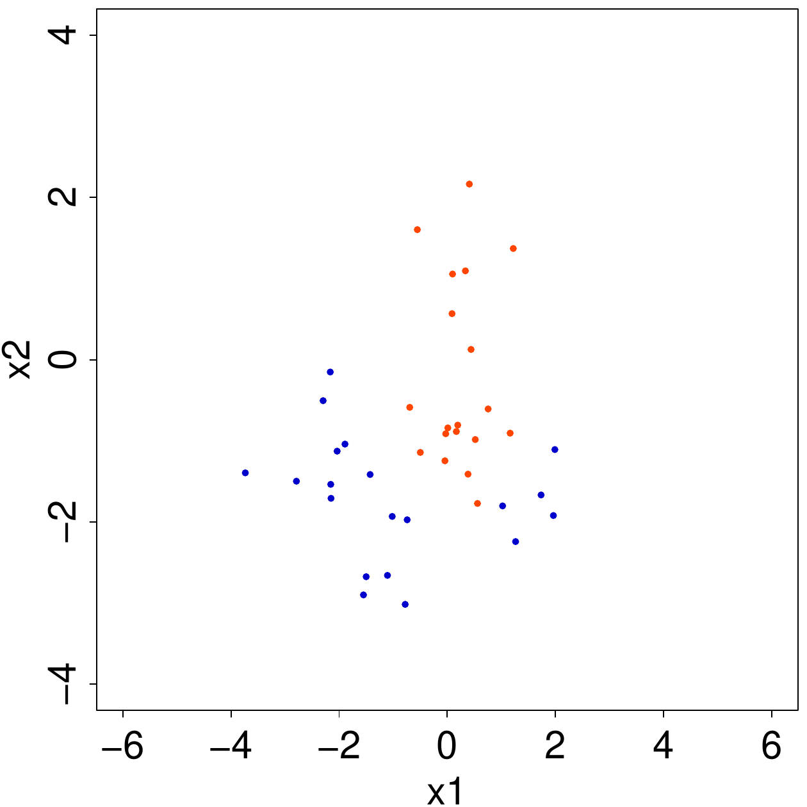
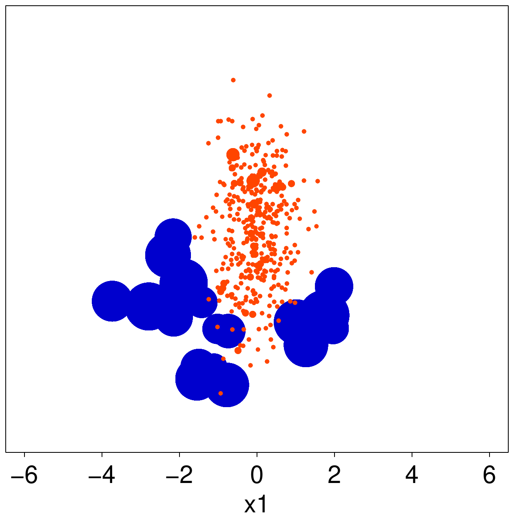
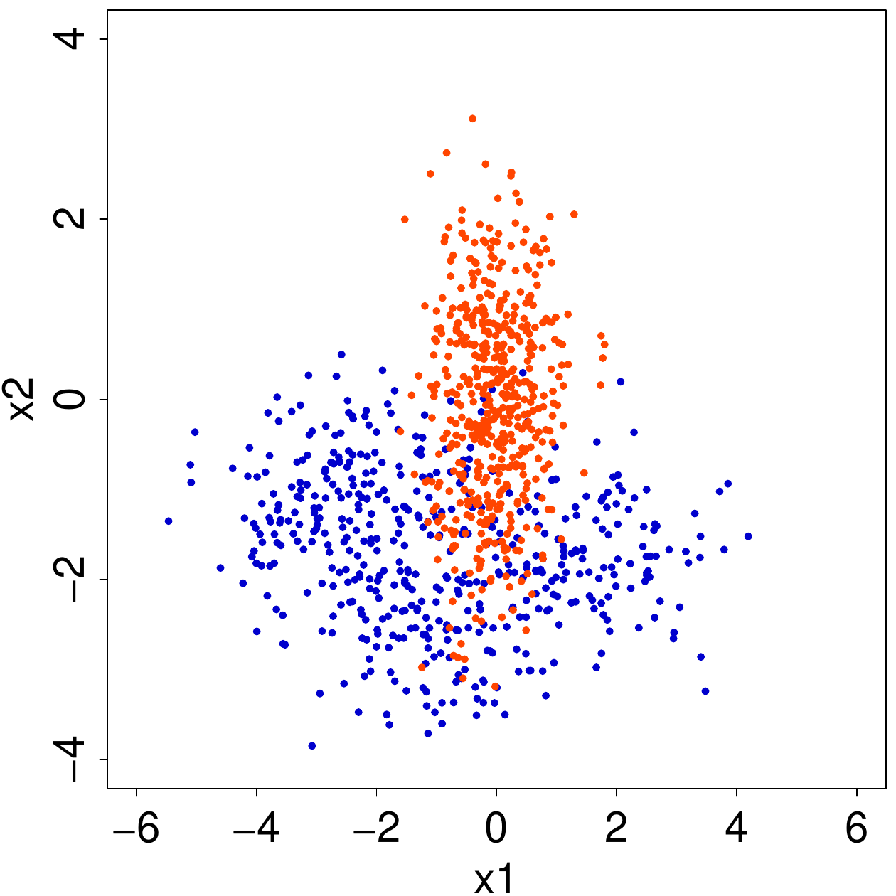
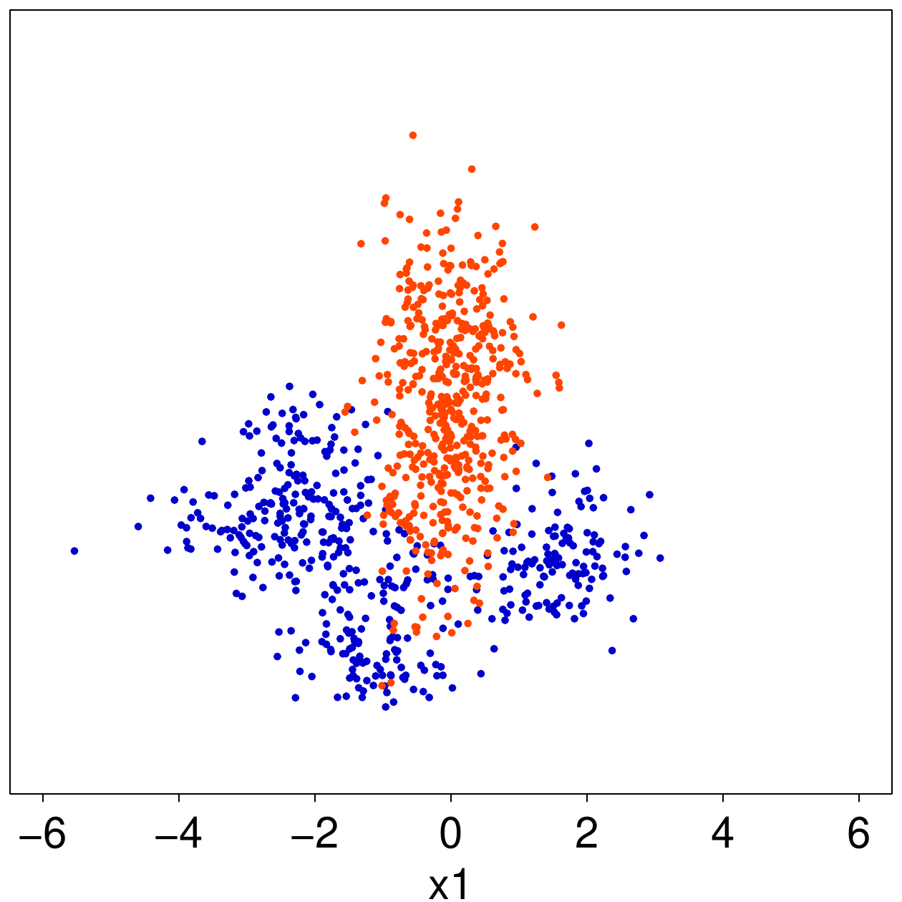
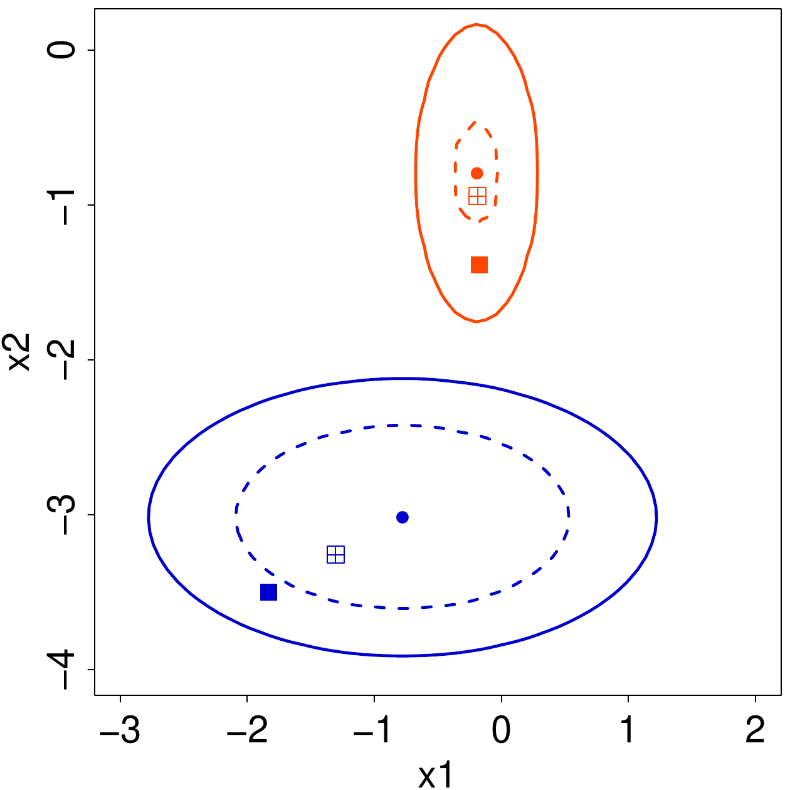
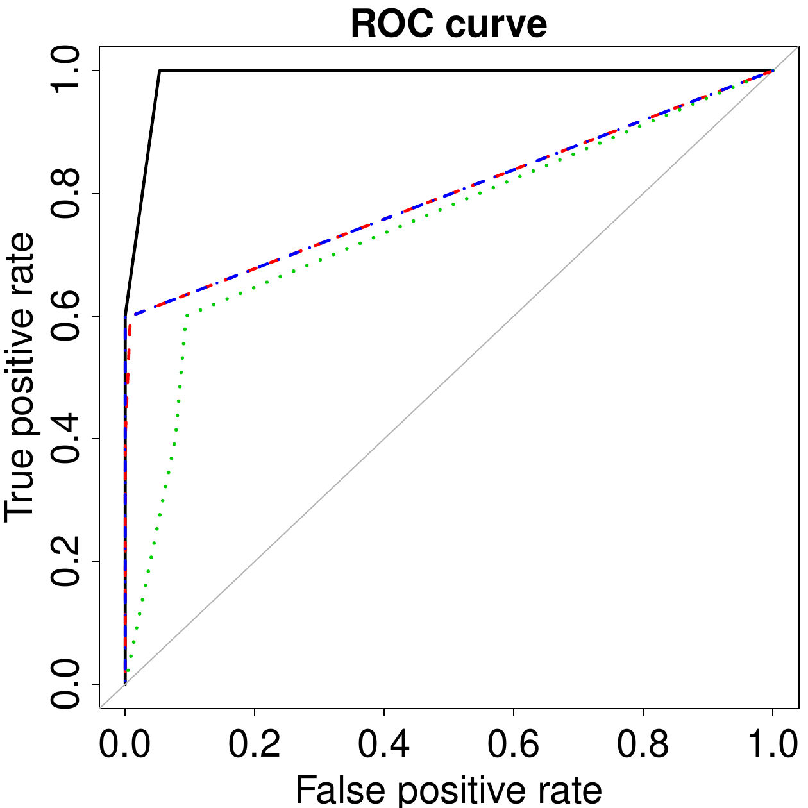

::: article
# Introduction

*Imbalanced learning* is the heading which denotes the problem of
supervised classification when one of the classes is rare over the
sample. As class imbalance situations are pervasive in a plurality of
fields and applications, the issue has received considerable attention
recently. Numerous works have focused on warning about the heavy
implications of neglecting the imbalance of classes, as well as
proposing suitable solutions to relieve the problem. Nonetheless, there
is a general lack of procedures and software explicitly aimed at
handling imbalanced data and which can be readily adopted also by non
expert users. To the best of our knowledge, in the R environment, only a
few functions are designed for imbalanced learning. It is worth
mentioning package [*DMwR*](https://CRAN.R-project.org/package=DMwR)
[@DMWR], which provides a specific function (`smote`) to aid the
estimation of a classifier in the presence of class imbalance, in
addition to extensive tools for data mining problems (among others,
functions to compute evaluation metrics as well as different accuracy
estimators). In addition, package
[*caret*](https://CRAN.R-project.org/package=caret) [@caret] contains
general functions to select and validate regression and classification
problems and specifically addresses the issue of class imbalance with
some naive functions (`downSample` and `upSample`).

These reasons motivate the
[*ROSE*](https://CRAN.R-project.org/package=ROSE) package [@ROSE], which
is intended to provide both standard and more refined tools to enhance
the task of binary classification in an imbalanced setting. The package
is designed around ROSE (Random Over-Sampling Examples), a smoothed
bootstrap-based technique which has been recently proposed by
@menardi_torelli:2013DMKD. ROSE helps to relieve the seriousness of the
effects of an imbalanced distribution of classes by aiding both the
phases of model estimation and model assessment.

This paper is organized as follows: after a brief introduction to the
problem of class imbalance and to the statistical foundations at the
basis of the ROSE method, we provide an overview of the functions
included in the package and illustrate their use with a numerical
example.

# The class imbalance problem {#sec:imbalance}

Without attempting a full discussion, we summarize here the main
statistical issues emerging in imbalanced learning. The outline focuses
on those aspects that are relevant for a full comprehension of the
routines implemented in the package. The interested reader is invited to
refer to @menardi_torelli:2013DMKD and the references therein for a
deeper discussion and technical details.

The presence of a strong imbalance in the distribution of the response
variable may lead to heavy consequences in pursuing a classification
task, in both phases of model estimation and accuracy evaluation.
Disregarding the specificities of different models, what typically
happens is that classification rules are overwhelmed by the prevalent
class and the rare examples are ignored.

Most of the current research on imbalanced classification focuses on
proposing solutions to improve the model estimation step. The most
common remedy to the imbalance problem involves altering the class
distribution to obtain a more balanced sample. Remedies based on
balancing the class distribution include various techniques of data
resampling, such as random oversampling (with replacement) of the rare
class and random undersampling (without replacement) of the prevalent
class. Under the same hat of these balancing methods, we can also
include the ones designed to generate new artificial examples that are
'similar', in a certain sense, to the rare observations. Generation of
new artificial data that have not been previously observed reduces the
risk of overfitting and improves the ability of generalization
compromised by oversampling methods, which are bound to produce ties in
the sample. As will be clarified subsequently, the ROSE technique can be
rightly considered as following this route.

When a classification task is performed, evaluating the accuracy of the
classifier plays a role that is at least as important as model
estimation, because the extent to which a classification rule may be
operationally applied to real-world problems, for labeling new
unobserved examples, depends on our ability to measure classification
accuracy.

In the accuracy evaluation step, the first problem one has to face
concerns the choice of the accuracy metric, since the use of standard
measures, such as the overall accuracy, may yield misleading results.
The choice of the evaluation measure has to be addressed in terms of
some class-independent quantities, such as precision, recall or the F
measure. For the operational computation of these measures, one should
set a suitable threshold for the probability of belonging to the
positive class, above which an example is predicted to be positive. In
standard classification problems, this threshold is usually set to 0.5,
but the same choice is not obvious in imbalanced learning, as it is
likely that no examples are labeled as positive. Moreover, moving a
threshold to smaller values is equivalent to assume a higher
misclassification cost for the rare class, which is usually the case. To
avoid an arbitrary choice of the threshold, a ROC curve can be adopted
to measure the accuracy, because it plots the true positive rate versus
the false positive rate as the classification threshold varies.

Apart from the choice of an adequate performance metric, a more serious
problem in imbalanced learning concerns the estimation method for the
selected accuracy measure. To this aim, standard practices are the
resubstitution method, where the available data are used for both
training and assessing the classifier or, more frequently, the holdout
method, which consists of estimating the classifier over a training
sample of data and assessing its accuracy on a test sample. In the
presence of a class imbalance, often, there are not sufficient examples
from the rare class for both training and testing the classifier.
Additionally, the scarcity of data leads to estimates of the accuracy
measure which are affected by a high variance and are then regarded as
unreliable. On the other hand, the resubstitution method is known to
lead to overoptimistic evaluation of learner accuracy. Then, alternative
estimators of the accuracy measure have to be considered, as pointed out
in the next section.

## The ROSE strategy to deal with class imbalance {#sec:rose}

ROSE [@menardi_torelli:2013DMKD] provides a unified framework to deal
simultaneously with the two above-mentioned problems of model estimation
and accuracy evaluation in imbalanced learning. It builds on the
generation of new artificial examples from the classes, according to a
smoothed bootstrap approach [see, *e.g.*, @efron_tibshirani:1993].

Consider a training set $\mathbf{T}_n$, of size $n$, whose generic row
is the pair $(\mathbf{x}_i, y_i), i=1,\dots, n$. The class labels $y_i$
belong to the set $\{\mathcal Y_0, \mathcal Y_1\}$, and $\mathbf{x}_i$
are some related attributes supposed to be realizations of a random
vector $\bf{x}$ defined on $\mathrm{R}^d$, with an unknown probability
density function $f(\mathbf{x})$. Let the number of units in class
$\mathcal{Y}_j, j=0, 1,$ be denoted by $n_j < n$. The ROSE procedure for
generating one new artificial example consists of the following steps:

1.  Select $y^{*}=\mathcal{Y}_j$ with probability $\pi_j$.

2.  Select $(\mathbf{x}_i, y_i) \in \mathbf{T}_n,$ such that
    $y_i=y^{*}$, with probability $\frac{1}{n_j}$.

3.  Sample $\mathbf{x}^{*}$ from $K_{\mathbf{H}_j}(\cdot,\mathbf{x}_i)$,
    with $K_{\mathbf{H}_j}$ a probability distribution centered at
    $\mathbf{x}_i$ and covariance matrix $\mathbf{H}_j$.

Essentially, we draw from the training set an observation belonging to
one of the two classes, and generate a new example
$(\mathbf{x}^{*}, y^{*})$ in its neighborhood, where the shape of the
neighborhood is determined by the shape of the contour sets of $K$ and
its width is governed by $\mathbf{H}_j.$

It can be easily shown that, given selection of the class label
$\mathcal{Y}_j$, the generation of new examples from $\mathcal{Y}_j$,
according to ROSE, corresponds to the generation of data from the kernel
density estimate of $f (\mathbf{x}|\mathcal{Y}_j),$ with kernel $K$ and
smoothing matrix $\mathbf{H}_j$ [@menardi_torelli:2013DMKD]. The choices
of $K$ and $\mathbf{H}_j$ may be then addressed by the large specialized
literature on kernel density estimation [see, *e.g.*
@bowman_azzalini:1997]. It is worthwhile to note that, for
$\mathbf{H}_j\rightarrow 0$, ROSE collapses to a standard combination of
over- and under-sampling.

Repeating steps 1 to 3 $m$ times produces a new synthetic training set
$\mathbf{T}^*_m,$ of size $m$, where the imbalance level is defined by
the probabilities $\pi_j$ (if $\pi_j=1/2$, then approximately the same
number of examples belong to the two classes). The size $m$ may be set
to the original training set size $n$ or chosen in any way.

Apart from enhancing the process of learning, the synthetic generation
of new examples from an estimate of the conditional densities of the two
classes may also aid the estimation of learner accuracy and overcome the
limits of both resubstitution and the holdout method. Operationally, the
use of ROSE for estimating learner accuracy may follow different
schemes, which resemble standard accuracy estimators but claim a certain
degree of originality. For example, a holdout version of ROSE would
involve testing the classifier on the originally observed data after
training it on the artificial training set $\mathbf{T}^*_m$.
Alternatively, bootstrap or cross-validated versions of ROSE may be
chosen as estimation methods, as illustrated in Table [1](#tab:cross).
An extensive simulation study in @menardi_torelli:2013DMKD has, in fact,
shown that the holdout and bootstrap versions of ROSE tend to
overestimate the accuracy, but their mean square error is lower than the
one obtained by utilizing a standard holdout method. Hence, overall,
these estimates are preferable.

::: {#tab:cross}
  -------------------------------------------------------------------------------------------------------------------------------------------------------------
  Cross validation (leave-K-out) ROSE                                                           Bootstrap ROSE
  --------------------------------------------------------------------------------------- -- -- ---------------------------------------------------------------
  `Split `$\mathbf{T}_n$` into Q=n/K sets `$\mathbf{T}^1_K,\ldots,\mathbf{T}^Q_K$               **`for`**` (b: 1 `**`to`**` B) `[`do`]{.sans-serif}

  **`for`**` (i: 1 `[`to`]{.sans-serif}` Q) `[`do`]{.sans-serif}                                `get a ROSE sample `$\mathbf{T}^{*b}_m$` from `$\mathbf{T}_n$

  `get a ROSE sample `$\mathbf{T}^{*i}_m$` from `$\mathbf{T}_n\setminus \mathbf{T}^i_K$         `estimate a classifier on `$\mathbf{T}^{*b}_m$

  `estimate a classifier on `$\mathbf{T}^{*i}_m$                                                `make a prediction `$\mathbf{P}^b_n$` on `$\mathbf{T}_n$

  `make a prediction `$\mathbf{P}^i_K$` on `$\mathbf{T}^i_K$                                    `compute accuracy of `$\mathbf{P}^b_n$

  **`end for`**                                                                                 **`end for`**

  `compute accuracy of `$\left\{\mathbf{P}^1_K,\ldots,\mathbf{P}^Q_K\right\}$                   `get the bootstrap distribution `

                                                                                                `of the accuracy measure`
  -------------------------------------------------------------------------------------------------------------------------------------------------------------

  : Table 1: Pseudo-code of the alternative uses of ROSE for model
  assessment.
:::

# Package illustration

## Overview

The package provides a complete toolkit to tackle the problem of binary
classification in the presence of imbalanced data. Functions are
supplied to encompass all phases of the learning process: from model
estimation to assessment of the accuracy of the classification. In the
former phase, the user has to choose both the remedy to adopt for the
class imbalance, and the classifier to estimate for the learning
process. For the first aim, functions `ROSE` or `ovun.sample` can be
adopted to balance the sample. One is allowed to choose among all the
functions already implemented in R to build the desired binary
classifier, such as `glm`, `rpart`, `nnet`, as well as user defined
functions. Once a classifier has been trained, its accuracy has to be
evaluated, which requires the choice of both an appropriate accuracy
measure, and an estimation method that can provide a reliable estimate
of such measure. Functions `roc.curve` and `accuracy.meas` implement the
most commonly adopted measures of accuracy in imbalance learning, while
function `ROSE.eval` provides a ROSE version of holdout, bootstrap or
cross-validation estimates of the accuracy measures, as described above.

A summary of the functions provided by the package, classified according
to the main tasks they are designed for, is listed in Table [2](#tab1).

::: {#tab1}
  -----------------------------------------------------
  Data balancing        `ROSE`        `ovun.sample`
  --------------------- ------------- -----------------
  Accuracy measures     `roc.curve`   `accuracy.meas`

  Accuracy estimators   `ROSE.eval`   
  -----------------------------------------------------

  : Table 2: Summary of the functions in package **ROSE**
:::

[]{#tab1 label="tab1"}

[*ROSE*](https://CRAN.R-project.org/package=ROSE) also includes the
simulated data `hacide`, which are adopted here to illustrate the
package. The workspace `hacide` consists of a bidimensional training set
`hacide.train` and a test set `hacide.test`, amounting to 1000 and 250
rows, respectively. The binary label class (denoted as `cls`) has a
heavily imbalanced distribution, with the positive examples occurring in
approximately 2% of the cases. The rare class may be described as a
depleted noisy semi-circle filled with the prevalent class, which is
normally distributed and has elliptical contours. See the top-left panel
of Figure [1](#figure:fig1) for an illustration.

<figure id="figure:fig1">
<div class="center">
<table>

<tbody>
<tr class="odd">
<td style="text-align: center;"></td>
<td style="text-align: center;"></td>
</tr>
<tr class="even">
<td style="text-align: center;"></td>
<td style="text-align: center;"></td>
</tr>
</tbody>
</table>
</div>
<figcaption>Figure 1: Outcomes of data balancing strategies implemented
in the ROSE package on the hacide.train data. The orange and blue colors
denote the majority and minority class examples, respectively. Top-left
panel: training data; top-right: oversampling; bottom-left:
undersampling; bottom-right: combination of over and undersampling.
</figcaption>
</figure>

### Ignoring the imbalance

After loading the package and the data, we explore the training set
structure:

``` r
> library(ROSE)
Loaded ROSE 0.0-3

> data(hacide)

> str(hacide.train)
'data.frame':	1000 obs. of  3 variables:
 $ cls: Factor w/ 2 levels "0","1": 1 1 1 1 1 1 1 1 1 1 ...
 $ x1 : num  0.2008 0.0166 0.2287 0.1264 0.6008 ...
 $ x2 : num  0.678 1.5766 -0.5595 -0.0938 -0.2984 ...

> table(hacide.train$cls)
  0   1
980  20
```

Now, we show that ignoring class imbalance is not inconsequential.
Suppose we want to build a binary classification tree, based on the
training data. We first load package `rpart`.

``` r
> library(rpart)
> treeimb <- rpart(cls ~ ., data = hacide.train)
```

In the current example, the accuracy of the estimated classifier may be
evaluated by a standard application of the holdout method, because as
many data as we need can be simulated from the same distribution as the
training sample to test the classifier. For the sake of illustration, a
test sample `hacide.test` is supplied by the package.

Irrespective of the performance metric used for evaluation, a prediction
on the test data is first required.

``` r
> pred.treeimb <- predict(treeimb, newdata = hacide.test)
> head(pred.treeimb)
          0          1
1 0.9898888 0.01011122
2 0.9898888 0.01011122
3 0.9898888 0.01011122
4 0.9898888 0.01011122
5 0.9898888 0.01011122
6 0.9898888 0.01011122
```

The accuracy may be now assessed by means of the performance metrics
`accuracy.meas` or `roc.curve` provided by the package. These functions
share the mandatory arguments `response` and `predicted`, representing
true class labels and the predictions of the classifier, respectively.
Predicted values may take the form of a vector of class labels, or
alternatively may represent the probability or some score of belonging
to the positive class.

``` r
> accuracy.meas(hacide.test$cls, pred.treeimb[,2])

Call:
accuracy.meas(response = hacide.test$cls, predicted = pred.treeimb[,2])

Examples are labelled as positive when predicted is greater than 0.5

precision: 1.000
recall: 0.200
F: 0.167
```

Function `accuracy.meas` computes recall, precision, and the F measure.
The estimated classifier shows maximum precision, that is, there are no
false positives. On the other hand, recall is very low, thereby implying
that the model has predicted a large number of false negatives.

Function `accuracy.meas` is endowed with an optional argument
`threshold`, which defines the predicted value over which an example is
assigned to the rare class. As one can deduce by the the output above,
argument `threshold` defaults to $0.5$, like the standard cut-off
probability adopted in balanced learning. In the current example, moving
`threshold` does not improve classification (results not reported) but
this is usually an advisable practice in imbalanced learning. Indeed,
the default choice is often too high and might lead to not labeling any
example as positive, which would entail undefined values for precision,
recall, and F.

To safeguard the user by an arbitrary specification of `threshold` in
`accuracy.meas`, the package supplies function `roc.curve`, which
computes the area under the ROC curve (AUC) as a measure of accuracy and
is not affected by the choice of any particular cut-off value.

``` r
> roc.curve(hacide.test$cls, pred.treeimb[,2], plotit = FALSE)
Area under the curve (AUC): 0.600
```

Additionally, when optional argument `plotit` is left to its default
`TRUE`, `roc.curve` makes an internal call to `plot` and displays the
ROC curve in a new window. Further arguments of functions `plot` and
`lines` can be invoked in `roc.curve` to customize the resulting ROC
curve.

In the current example, the returned AUC is small, thereby indicating
that the poor prediction is due to the class imbalance and is not
imputable to a wrong threshold.

### Balancing the data

The example above highlights the need of adopting a cure for the class
imbalance. The first-aid set of remedies provided by the package
involves creation of a new artificial data set by suitably resampling
the observations belonging to the two classes. Function `ovun.sample`
embeds some consolidated resampling techniques to perform such a task
and considers different sampling schemes. It is endowed with the
argument `method`, which takes one value among
`c("over", "under", "both")`.

Option `"over"` determines simple oversampling with replacement from the
minority class until either the specified sample size `N` is reached or
the positive examples have probability `p` of occurrence. Thus, when
`method = "over"`, an augmented sample is returned. Since the prevalent
class amounts to 980 observations, to obtain a balanced sample by
oversampling, we need to set the new sample size to 1960.

``` r
> data.bal.ov.N <- ovun.sample(cls ~ ., data = hacide.train, method = "over",
		   N = 1960)$data
> table(data.bal.ov.N$cls)
  0   1
980 980 		
```

Function `ovun.sample` returns an object of class `list` whose elements
are the matched call, the method for data balancing, and the new set of
balanced `data`, which has been directly extracted here. Alternatively,
we may design the oversampling by setting argument `p`, which represents
the probability of the positive class in the new augmented sample. In
this case, the proportion of positive examples will be only
approximatively equal to the specified `p`.

``` r
> data.bal.ov.p <- ovun.sample(cls ~ ., data = hacide.train, method = "over",
		   p = 0.5)$data
> table(data.bal.ov.p$cls)
  0   1
980 986
```

In general, a reader who executes this code would obtain a different
distribution of the two classes, because of the randomness of the data
generation. To keep trace of the generated sample, a `seed` may be
specified:

``` r
> data.bal.ov <- ovun.sample(cls ~ ., data = hacide.train, method = "over",
		 p = 0.5, seed = 1)$data
```

The code chunks above also show how to instruct function `ovun.sample`
to recognize the different roles of the column data, namely through the
specification of the first argument `formula`. This expects the response
variable `cls` on the left-hand side and the predictors on the
right-hand side, in the guise of most R regression and classification
routines. As usual, the `‘.’` has to be interpreted as 'all columns not
otherwise in the formula'.

Similar to option `"over"`, option `"under"` determines simple
undersampling without replacement of the majority class until either the
specified sample size `N` is reached or the positive examples has
probability `p` of occurring. It then turns out that when
`method = "under"`, a sample of reduced size is returned. For example,
if we set `p`, then

``` r
> data.bal.un <- ovun.sample(cls ~ ., data = hacide.train, method = "under",
		  p = 0.5, seed = 1)$data
> table(data.bal.un$cls)
 0  1
19 20
```

When `method = "both"` is selected, both the minority class is
oversampled with replacement and the majority class is undersampled
without replacement. In this case, both the arguments `N` and `p` have
to be set to establish the amount of oversampling and undersampling.
Essentially, the minority class is oversampled to reach a size
determined as a realization of a binomial random variable with size `N`
and probability `p`. Undersampling is then performed accordingly, to
abide by the specified `N`.

``` r
> data.bal.ou <- ovun.sample(cls ~ ., data = hacide.train, method = "both",
		 N = 1000, p = 0.5, seed = 1)$data
> table(data.bal.ou$cls)
  0   1
520 480
```

From a qualitative viewpoint, these strategies produce rather different
artificial data sets. A flavor of these differences is illustrated in
Figure [1](#figure:fig1), where the outcome of running the three options
of function `ovun.sample` on data `hacide.train` is displayed. Each
observation appearing in the resulting balanced data set is represented
by a point whose size is proportional to the number of ties.
Oversampling produces a considerable amount of repeated observations
among the rare examples, while undersampling excludes a large number of
observations from the prevalent class. A combination of over- and
undersampling is a compromise between the two, but still produces
several ties for the minority examples when the original training set
size is large and the imbalance is extreme.

Data generation according to ROSE attempts to circumvent the pitfalls of
the resampling methods above by drawing a new, synthetic, possibly
balanced, set of data from the two conditional kernel density estimates
of the classes. Endowed with arguments `formula`, `data`, `N`, and `p`,
function `ROSE` shares most of its usage with `ovun.sample`:

``` r
> data.rose <- ROSE(cls ~ ., data = hacide.train, seed = 1)$data
```

The optional argument `seed`, has been specified here only for
reproducibility, while additional arguments have been left to their
defaults. In particular, the size `N` of the new artificial sample is
set by default to the size of the input training data, and `p = 0.5`
produces an approximately balanced sample:

``` r
> table(data.rose$cls)
  0   1
520 480
```

Figure [2](#figure:fig2) shows that, unlike the simple balancing
mechanism provided by `ovun.sample`, ROSE generation does not produce
ties and it actually provides the learner with the option of enlarging
the neighborhoods of the original feature space when generating new
observations. The widths of such neighborhoods, governed by the matrices
$\mathbf{H}_0$ and $\mathbf{H}_1$, are primarily selected as
asymptotically optimal under the assumption that the true conditional
densities underlying the data follow a Normal distribution [see
@menardi_torelli:2013DMKD for further details]. However, $\mathbf{H}_0$
and $\mathbf{H}_1$ may be scaled by arguments `hmult.majo` and
`hmult.mino`, respectively , whose default values are set to $1$.
Smaller (larger) values of these arguments have the effect of shrinking
(inflating) the entries of the corresponding smoothing matrix
$\mathbf{H}_j$. Shrinking would be a cautious choice if there is a
concern that excessively large neighborhoods could lead to blur the
boundaries between the regions of the feature space associated with each
class. For example, we could set

``` r
> data.rose.h <- ROSE(cls ~ ., data = hacide.train, seed = 1, hmult.majo = 0.25,
		hmult.mino = 0.5)$data
```

The generated data are illustrated in the right panel of Figure
[2](#figure:fig2). To better understand the rationale behind `ROSE`,
Figure [3](#figure:fig3) (left panel) shows two observations belonging
to the prevalent and rare classes, and the surroundings within the
observations are likely to be generated, for the two options
`hmult.majo = 0.25, hmult.mino = 0.5`.

<figure id="figure:fig2">
<div class="center">
<table>

<tbody>
<tr class="odd">
<td style="text-align: center;"></td>
<td style="text-align: center;"></td>
</tr>
</tbody>
</table>
</div>
<figcaption>Figure 2: Illustration of hacide.train data balanced by
ROSE. Left panel: all arguments of function ROSE have been set to the
default values. Right panel: smoothing parameters have been shrunk, by
setting hmult.majo = 0.25 and hmult.mino = 0.5.</figcaption>
</figure>

Equipped with the new balanced samples generated by `ovun.sample` and
`ROSE`, we can train the classifiers and run them on the test set to
assess their accuracy:

``` r
> tree.rose <- rpart(cls ~ ., data = data.rose)
> tree.ov <- rpart(cls ~ ., data = data.bal.ov)
> tree.un <- rpart(cls ~ ., data = data.bal.un)
> tree.ou <- rpart(cls ~ ., data = data.bal.ou)

> pred.tree.rose <- predict(tree.rose, newdata = hacide.test)
> pred.tree.ov <- predict(tree.ov, newdata = hacide.test)
> pred.tree.un <- predict(tree.un, newdata = hacide.test)
> pred.tree.ou <- predict(tree.un, newdata = hacide.test)

> roc.curve(hacide.test$cls, pred.tree.rose[,2])
Area under the curve (AUC): 0.989
> roc.curve(hacide.test$cls, pred.tree.ov[,2], add.roc = TRUE, col = 2, lty = 2)
Area under the curve (AUC): 0.798
> roc.curve(hacide.test$cls, pred.tree.un[,2], add.roc = TRUE, col = 3, lty = 3)
Area under the curve (AUC): 0.749
> roc.curve(hacide.test$cls, pred.tree.ou[,2], add.roc = TRUE, col = 4, lty = 4)
Area under the curve (AUC): 0.798
```

The returned AUCs clearly highlight the effectiveness of balancing the
sample. An illustration of the ROC curves is given in the right panel of
Figure [3](#figure:fig3).

<figure id="figure:fig3">
<div class="center">
<table>

<tbody>
<tr class="odd">
<td style="text-align: center;"></td>
<td style="text-align: center;"></td>
</tr>
</tbody>
</table>
</div>
<figcaption>Figure 3: Left panel: a zoomed view of two selected points
of the hacide.train data, the contour within which the ROSE artificial
data are generated with probability 0.95 and an example of artificial
points generated. The solid contour (and the associated filled points)
refer to the use of the default smoothing parameters. The dashed contour
(and associated points filled with a cross) refer to the use of
hmult.majo = 0.25 and hmult.mino = 0.5. Right panel: ROC curves
associated with classification trees built on data balanced according to
different remedies. Solid line: data balanced by ROSE; dotted line: data
balanced by undersampling; dashed (overlapping) lines: data balanced by
oversampling and by a combination of over and
undersampling.</figcaption>
</figure>

## Adopting alternative estimators of accuracy 

In real data applications, we often cannot benefit from the availability
of additional data to test the accuracy of the estimated model (or if we
can, we will probably use the additional information to train a more
accurate model). Moreover, in imbalanced learning, the scarcity of data
causes high variance estimates of the accuracy measure. Then, it is
often appropriate to adopt some alternative methods to estimate model
accuracy in place of the standard holdout. Function `ROSE.eval` comes to
this aid by implementing a ROSE version of holdout, bootstrap or
leave-K-out cross-validation estimators of the accuracy of a specified
classifier, as measured according to a selected metric.

Suppose that a test set, to evaluate the accuracy of the classifier
previously denoted as `tree.rose`, is not available. We first exploit
`ROSE.eval` to obtain a ROSE-based `holdout` estimate of the AUC:

``` r
> ROSE.holdout <- ROSE.eval(cls ~ ., data = hacide.train, learner = rpart,
		  method.assess = "holdout", extr.pred = function(obj)obj[,2], seed = 1)
> ROSE.holdout

Holdout estimate of auc: 0.985
```

Similarly to `ROSE`, the former instruction specifies the role of the
column `data` from which a ROSE sample is generated via argument
`formula`. The specification of `seed` ensures the generation of the
same sample as the one used to build `tree.rose`. Based on the synthetic
sample, the classifier is built through an internal call to function
`rpart` specified in `learner`.

Argument `learner` is designed to recognize virtually all the R
functions having a standard definition, as well as suitably user-defined
functions, thereby allowing for a high flexibility in the employment of
classifiers which exhibit non-homogeneous usage. As a consequence of
such heterogeneity, some caution is needed when specifying argument
`learner`. In its simplest form, `learner` is a standard R function,
that is, it has a `formula` as a first compulsory argument and returns
an object whose class is associated with a `predict` method. As required
by R conventions, the function name of the classifier and its R class
should match. For example, in the chunk code above, `learner = rpart` is
specified, as function `rpart` returns an object of class `rpart` to
which a `predict.rpart` method is associated. Thus, function
`predict.rpart` is internally called by `ROSE.eval` to obtain a
prediction. Also classifiers implemented by R functions with a
non-standard usage can be passed to `learner`. In this case, `learner`
takes a different form, as will be clarified subsequently in this
section.

Function `ROSE.eval` works properly only when the prediction is a vector
of class labels, probabilities, or scores from the estimated `learner`.
Since `predict` methods in R sources exhibit very non-homogeneous
outputs, the optional argument `extr.pred` can be deployed to pass a
suitable user-defined function that filters relevant information from
the output of any predict method and extracts a vector of predicted
values. In the example above, `predict.rpart` returns a matrix of
predicted probabilities when fed with a classification tree. Hence,
argument `extr.pred = function(obj)obj[,2]` is defined as a function
which extracts the column of probabilities of belonging to the positive
class.

Along with the argument `learner`, function `ROSE.eval` requires the
specification of argument `acc.measure`, an accuracy measure to be
selected among `c("auc", "precision", "recall", "F")`, which are the
metrics supplied by the package. In the current example, `acc.measure`
has been left to its default value `"auc"`, which determines an internal
call to function `roc.curve`. The other options entail an internal call
to function `accuracy.meas`.

As an alternative to the ROSE-based holdout method, we may wish to
obtain a ROSE version of the bootstrap accuracy distribution. By
selecting `method.assess = "BOOT"`, we fit the specified `learner` on
`B` ROSE samples and test each of them on the observed data specified in
the `formula`. The optional argument `trace` shows the progress of model
assessment by printing the number of completed iterations. The bootstrap
distribution of the selected accuracy measure is then returned as output
of function `ROSE.eval`.

``` r
> ROSE.boot <- ROSE.eval(cls ~ ., data = hacide.train, learner = rpart,
		method.assess = "BOOT", B = 50, extr.pred = function(obj)obj[,2],
		seed = 1, trace = TRUE)
Iteration:
10, 20, 30, 40, 50

> summary(ROSE.boot)

Call:
ROSE.eval(formula = cls ~ ., data = hacide.train, method.assess = "BOOT",
    B = 50, learner = rpart, extr.pred = function(obj) obj[, 2],
    trace = TRUE, seed = 1)

Summary of bootstrap distribution of auc:
   Min. 1st Qu.  Median    Mean 3rd Qu.    Max.
 0.9282  0.9800  0.9839  0.9820  0.9860  0.9911
```

Similarly, we could obtain a leave-K-out cross validation estimate of
the accuracy by selecting option `method.assess = "LKOCV"`. This option
works as follows: the provided data, say of size $n$, are split at
random into $Q=n/K$ groups of size defined by argument `K`; to speed up
the computations, we set `K = 5`. However, in the presence of extreme
imbalance between the classes, choosing `K` as low as possible is
advisable, to not alter the class distribution in the data used for
training. At each round, the specified `learner` is estimated on a ROSE
sample built on the provided data excluding one of these groups, and
then a prediction on the excluded set of observations is made. At the
end of the process, the predictions obtained on the $Q$ distinct groups
are deployed to compute the selected accuracy measure, which is then
retrieved in the component `acc` of the output of `ROSE.eval`.

``` r
> ROSE.l5ocv <- ROSE.eval(cls ~ ., data = hacide.train, learner = rpart,
		method.assess = "LKOCV", K= 5, extr.pred = function(obj)obj[,2],
		seed = 1, trace = TRUE)
Iteration:
10, 20, 30, 40, 50, 60, 70, 80, 90, 100,
110, 120, 130, 140, 150, 160, 170, 180, 190, 200

> ROSE.l5ocv
Call:
ROSE.eval(formula = cls ~ ., data = hacide.train, learner = rpart,
    extr.pred = function(obj)obj[, 2], method.assess = "LKOCV",
    K = 5, trace = TRUE, seed = 1)

Leave K out cross-validation estimate of auc: 0.973
```

In principle, the classification task would terminate here. However, one
might wonder if different choices in the balancing mechanism or in the
classifier estimation would lead to better results. To answer this
question, we just need to set arguments `control.ROSE` or, respectively
`control.learner` accordingly. For example the `hmult.majo` and/or
`hmult.mino` arguments could have been shrunk:

``` r
> ROSE.holdout.h <- ROSE.eval(cls ~ ., data = hacide.train, learner = rpart,
		    extr.pred = function(obj)obj[,2], seed = 1,
		    control.rose = list(hmult.majo = 0.25, hmult.mino = 0.5))
```

or one could have grown a tree of a given complexity, in the following
manner:

``` r
> ROSE.holdout.cp <- ROSE.eval(cls ~ ., data = hacide.train, learner = rpart,
		     extr.pred = function(obj)obj[,2], seed = 1,
		     control.learner = list(control=list(cp = 0.05)))
```

Lastly, one could wish to compare the results with those obtained by
using a different classifier. Suppose, for example, one is interested in
fitting a $K$-nearest neighbors classifier. This is implemented, among
others, by function `knn` in package
[*class*](https://CRAN.R-project.org/package=class). Function `knn` has
a nonstandard R behaviour, both because it does not require a `formula`
argument and because model training and prediction are performed, by
construction, simultaneously. The usage of function `knn` is described
by

``` r
	knn(train, test, cl, k = 1, l = 0, prob = FALSE, use.all = TRUE)
```

where `train` and `test` are the training and the testing columns of
predictors, respectively, and `cl` is the vector of training class
labels. To employ `knn` as a `learner` function in `ROSE.eval`, we need
to embed it within a suitable wrapper function which requires two
mandatory arguments: `data` and `newdata`. The wrapper for `knn` is
then:

``` r
knn.wrap <- function(data, newdata, ...){
    	knn(train = data[,-1], test = newdata, cl = data[,1], ...)}
```

where the first column is extracted as, in the current `hacide` example,
it contains the class labels. Arguments `data` and `newdata` are
automatically filled when the wrapper is embedded in `ROSE.eval`.
Further arguments can be passed to `knn` through the usual argument
`control.learner`, owing to the presence of argument `dots` in the
wrapper. For example, we may specify $k = 2$ nearest neighbors and ask
to return the predicted probabilities of belonging to the positive class
as follows.

``` r
> rose.holdout.knn <- ROSE.eval(cls ~ ., data = hacide.train, learner = knn.wrap,
      		control.learner = list(k = 2, prob = TRUE),
      		method.assess = "holdout", seed = 1)
```

As we can see, even if the employed classifier has a nonstandard
implementation, it can be easily adapted to be used inside function
`ROSE.eval`.

\

\

\
:::
